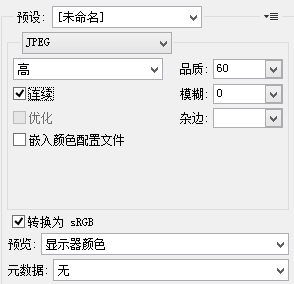

今天学习到原来JPEG文件有两种保存方式他们分别是Baseline JPEG（标准型）和Progressive JPEG（渐进式）。两种格式有相同尺寸以及图像数据，他们的扩展名也是相同的，唯一的区别是二者显示的方式不同。


## Baseline JPEG与Progressive JPEG的差异

### Baseline JPEG

这种类型的JPEG文件存储方式是按从上到下的扫描方式，把每一行顺序的保存在JPEG文件中。打开这个文件显示它的内容时，数据将按照存储时的顺序从上到下一行一行的被显示出来，直到所有的数据都被读完，就完成了整张图片的显示。如果文件较大或者网络下载速度较慢，那么就会看到图片被一行行加载的效果，这种格式的JPEG没有什么优点，因此，一般都推荐使用Progressive JPEG。


### Progressive JPEG

和Baseline一遍扫描不同，Progressive JPEG文件包含多次扫描，这些扫描顺寻的存储在JPEG文件中。打开文件过程中，会先显示整个图片的模糊轮廓，随着扫描次数的增加，图片变得越来越清晰。这种格式的主要优点是在网络较慢的情况下，可以看到图片的轮廓知道正在加载的图片大概是什么。在一些网站打开较大图片时，你就会注意到这种技术。


## 图片如何保存为Progressive JPEG？

说了这边多下面就改讲讲怎么讲图片保存为或者转化为Progressive JPEG了。

### PhotoShop

在PS中有“存储为web所用格式”，打开后选择“连续”就是渐进式JPEG。




### Linux

检测是否为progressive jpeg ： identify -verbose filename.jpg | grep Interlace（如果输出 None 说明不是progressive jpeg；如果输出 Plane 说明是 progressive jpeg。）

将basic jpeg转换成progressive jpeg：> convert infile.jpg -interlace Plane outfile.jpg


### PHP

使用[imageinterlace](https://www.php.net/manual/en/function.imageinterlace.php)和[imagejpeg](https://www.php.net/manual/en/function.imagejpeg.php)函数我们可以轻松解决转换问题。

```php
<?php
    $im = imagecreatefromjpeg('pic.jpg');
    imageinterlace($im, 1);
    imagejpeg($im, './php_interlaced.jpg', 100);
    imagedestroy($im);
?>
```


### Python

```python
import PIL
from exceptions import IOError

img = PIL.Image.open("c:\\users\\biaodianfu\\pictures\\in.jpg")
destination = "c:\\users\\biaodianfu\\pictures\\test.jpeg"
try:
    img.save(destination, "JPEG", quality=80, optimize=True, progressive=True)
except IOError:
    PIL.ImageFile.MAXBLOCK = img.size[0] * img.size[1]
    img.save(destination, "JPEG", quality=80, optimize=True, progressive=True)
```


### C#

```c#
using (Image source = Image.FromFile(@"D:\temp\test2.jpg")) { 
    ImageCodecInfo codec = ImageCodecInfo.GetImageEncoders().First(c => c.MimeType == "image/jpeg"); 
    EncoderParameters parameters = new EncoderParameters(3);
    parameters.Param[0] = new EncoderParameter(System.Drawing.Imaging.Encoder.Quality, 100L);
    parameters.Param[1] = new EncoderParameter(System.Drawing.Imaging.Encoder.ScanMethod, (int)EncoderValue.ScanMethodInterlaced);
    parameters.Param[2] = new EncoderParameter(System.Drawing.Imaging.Encoder.RenderMethod, (int)EncoderValue.RenderProgressive); 
    source.Save(@"D:\temp\saved.jpg", codec, parameters);
}
```


