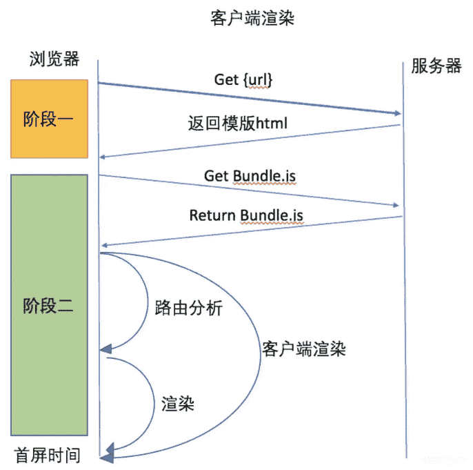
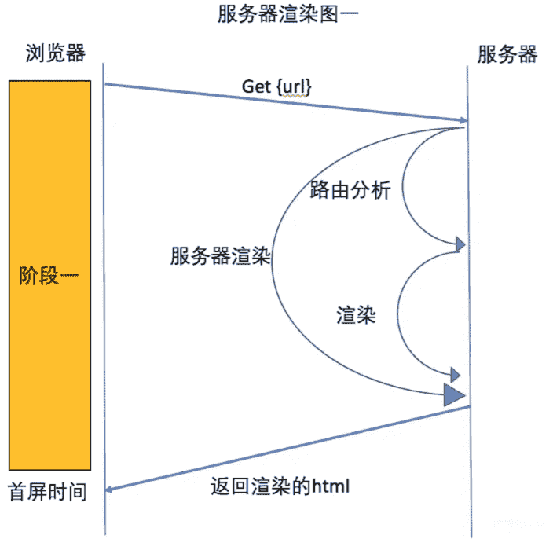
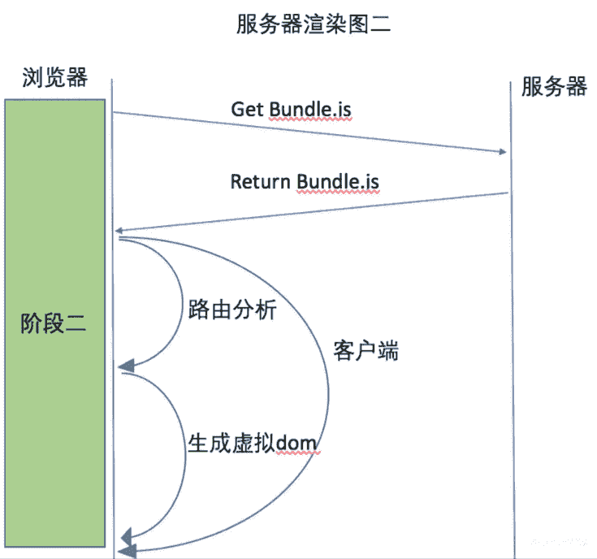

## 单页面程序(SPA)

**概念**

单页应用程序(SPA)全称是: Single-page application，SPA应用是**在客户端渲染**的（我们称之为**CSR**）

- SPA应用默认只返回一个空HTML页面，如body只有`

`
- 而整个应用程序的内容都是通过Javascript动态加载，包括应用程序的逻辑、UI以及与服务器通信相关的所有数据。
- 常见的SPA应用框架有Vue、React等

**优点**

- 只需加载一次：SPA应用程序只需要在第一次请求时加载页面,页面切换不需重新加载，而传统的Web应用程序必须在每次请求时都得加载页面，需要花费更多时间。因此，SPA页面加载速度要比传统 Web应用程序更快。
- 更好的用户体验
  - SPA提供类似于桌面或移动应用程序的体验。用户切换页面不必重新加载新页面
  - 切换页面只是内容发生了变化，页面并没有重新加载，从而使体验变得更加流畅

- 可轻松的构建功能丰富的Web应用程序

**缺点**

- SPA应用默认只返回一个空HTML页面，不利于SEO
- 首屏加载的资源过大时，一样会影响首屏的渲染
- 也不利于构建复杂的项目，复杂Web应用程序的大文件可能变得难以维护

## 客户端渲染(CSR)

**渲染流程**：浏览器请求url --> 服务器返回index.html(空body、白屏) --> 再次请求bundle.js、路由分析 --> 浏览器渲染

bundle.js体积越大，会导致浏览器白屏时间越长。

## 静态站点生成(SSG)

**概念**

静态站点生成(SSG)全称是: Static Site Generate，是预先生成好的静态网站。

- SSG应用一般在构建阶段就确定了网站的内容。
- 如果网站的内容需要更新了，那必须得重新再次构建和部署。
- 构建SSG应用常见的库和框架有: Vue Nuxt、React Next.js 等。

**优点**

- 访问速度非常快，因为每个页面都是在构建阶段就已经提前生成好了。
- 直接给浏览器返回静态的HTML，也有利于SEO
- SSG应用依然保留了SPA应用的特性，比如:前端路由、响应式数据、虚拟DOM等

**缺点**

- 页面都是静态，不利于展示实时性的内容，实时性的更适合SSR。
- 如果站点内容更新了，那必须得重新再次构建和部署。

## 服务器端渲染(SSR)

**概念**

服务器端渲染全称是: Server Side Render，**在服务器端渲染页面**，并将渲染好HTML返回给浏览器呈现。

- SSR应用的页面是在服务端渲染的，用户每请求一个SSR页面都会先在服务端进行渲染，然后将渲染好的页面，返回给浏览器呈现。
- 构建SSR应用常见的库和框架有: Vue Nuxt、React Next.js等(SSR应用也称同构应用)。

**优点**

- 更快的首屏渲染速度
  - 浏览器显示静态页面的内容要比JavaScript动态生成的内容快得多。
  - 当用户访问首页时可立即返回静态页面内容，而不需要等待浏览器先加载完整个应用程序。
- 更好的SEO
  - 爬虫是最擅长爬取静态的HTML页面，服务器端直接返回一个静态的HTML给浏览器。
  - 这样有利于爬虫快速抓取网页内容，并编入索引，有利于SEO。
  - SSR应用程序在Hydration 之后依然可以保留Web应用程序的交互性。比如:前端路由、响应式数据、虚拟DOM等。

**缺点**

- SSR通常需要对服务器进行更多API调用，以及在服务器端渲染需要消耗更多的服务器资源，成本高。
- 增加了一定的开发成本，用户需要关心哪些代码是运行在服务器端，哪些代码是运行在浏览器端。
- SSR配置站点的缓存通常会比SPA站点要复杂一点。

**渲染流程**

- 阶段一：浏览器请求url --> 服务器路由分析、执行渲染 --> 服务器返回index.html(实时渲染的内容，字符串) --> 浏览器渲染
- 阶段二：浏览器请求bundle.js --> 服务器返回bundle.js --> 浏览器路由分析、生成虚拟DOM --> 比较DOM变化、绑定事件 --> 二次渲染

