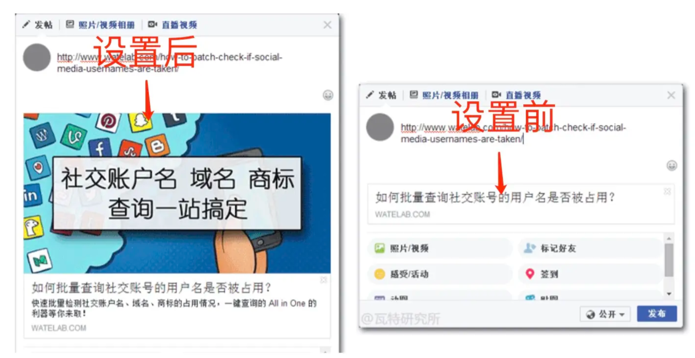

## 前言

SEO 代表搜寻引擎最佳化/搜寻引擎优化(英文全名Search Engine Optimization，简称SEO)，是指通过了解搜寻引擎的自然排名的算法逻辑，以提高目标网站在有关搜寻引擎内排名的方式。

网站的 SEO 至关重要，它可以让你的网站获得更好的排名和流量，从而提高网站知名度。对于一些盈利的网站，做好seo，还可以以低成本提高投资回报率。

> 本文将为你带来非常全面的SEO方案🔥🔥🔥，当然了，网站SEO是长线工作，在做好一些基础的配置之后，更重要的是后期的维护，比如定期更新网站动态文章，不断寻找优质外链资源等🤌。

本文将以三个层面展开：

1. TDK优化
2. 网站质量
3. SEO手段（10种手段）


## TDK优化

TDK是Title(页面标题)、Meta Description（页面描述）和Meta Keywords（页面关键词）的缩写，对网站的这三个信息的提炼是网站SEO的重要环节。

但是由于一些原因，各大主流搜索引擎基本都已经**大大降低甚至移除了 `<keywords>` 对排名的影响**。


### title标签-网站名片

title标签相当于网站的名片，他会直接显示在搜索结果中。一个好的标题势必可以为网站带来流量，从而提升网站排名。

注意：网站标题避免冗长

```html
<title>鲸落的个人博客</title>
```


### META标签-网站信息

META标签是网页head区的辅助性标签，它的作用是经过配置一些参数用以描述页面属性。**目前几乎所有搜索引擎都使用网上机器人自动查找meta值来给网页分类。**


#### meta标签如何使用

meta标签的`属性`有两种：`name`和`http- equiv`

**"name"属性有以下配置项：**

- Keywords(关键词，现在不再重要了)：逗号分隔的关键词列表（告诉搜索引擎页面是与什么相关的）
- description(网站内容描述，很重要)：页面描述。搜索引擎会把这个描述显示在搜索结果中
- format-detection：格式检测，比如禁止识别电话，邮箱等
- author：作者的名字
- Robots：用来告诉搜索机器人哪些页面需要索引，哪些页面不需要索引
- theme-color：网站主题色

```html
<meta name="keywords" content="掘金,稀土,Vue.js,前端面试题,Kotlin,ReactNative,Python">

<meta name="description" content="掘金是面向全球中文开发者的技术内容分享与交流平台。我们通过技术文章、沸点、课程、直播等产品和服务，打造一个激发开发者创作灵感，激励开发者沉淀分享，陪伴开发者成长的综合类技术社区。">

<meta name="format-detection" content="telephone=no">

<meta name="author" content="cece">

<Meta name="Robots" Content="Nofollow">
/** 
all：文件将被检索，且页面上的链接可以被查询；  
none：文件将不被检索，且页面上的链接不可以被查询；(和 "noindex, no follow" 起相同作用)  
index：文件将被检索；（让robot/spider登录）  
follow：页面上的链接可以被查询；  
noindex：文件将不被检索，但页面上的链接可以被查询；(不让robot/spider登录)  
nofollow：文件将不被检索，页面上的链接可以被查询。(不让robot/spider顺着此页的连接往下探找)
*/

<meta name="theme-color" content="#4285f4" />
```


**"http- equiv"属性有以下配置项：**

http-equiv顾名思义，相当于http的文件头作用，它可以向浏览器传回一些有用的信息，以帮助正确和精确地显示网页内容。

`<meta http-equiv="参数" content="参数变量值">`

- refresh(期限)：定义文档自动刷新的时间间隔（下面content中的2是指停留2秒钟后自动刷新到URL网址）。这个属性值慎重使用，因为它会使得页面不受用户控制；
- set-cookie：如果网页过期，那么存盘的cookie将被删除；

```html
<meta http-equiv="refresh" content="2;URL=http://www.baidu.com">

<meta http-equiv="Set-Cookie"content="cookie value=xxx;expires=Friday,12-Jan-200118:18:18GMT；path=/">
```


#### Open Graph 协议标签

Open Graph 协议标签通过 OG Tags （OG 标签）实现的，它属于 Meta 标签的一种，可以用来标识网页类型和元素，让分享到社交网络的内容可以被有效的抓取，还可以控制分享的网站卡片呈现我们想要显示的内容。

只要看到以 `og:` 为前缀的 Meta 标签就可以判断该网页支持 OG 标签了，如下：

```html
<meta property="og:title" content="设置Open Graph 标签！社交营销优化！">
<meta property="og:site_name" content="鲸落">
<meta property="og:type" content="article">
<meta property="og:description" content="Open Graph Protocol（开放图谱协议），简称 OG 协议或 OGP。">
```

设置og协议前后的网站分享卡片对比：




#### 网站关键词

上面也提到了，现在 `keywords` 关键词已经被各大搜索引擎降低了权重，所以可以设置也可以不设置，但我认为它仍然有他存在的价值。

如果你决定配置网站关键词，需要注意以下几点：

- keywords 关键词数量控制在1-4个左右，避免关键词堆砌；
- 合理选择长尾关键词（长尾关键词一般是2-3个词组成。例如，目标关键词是服装，其长尾关键词可以是男士服装、冬装等），长尾关键词虽然相对核心关键词的搜索量小很多，但是它带来的流量精准度非常高，后期的转化效果更好；
- 避免使用过于专业的词汇。过于专业的词汇的搜索量较低；
- 减少使用热门关键词，要选择合适的关键词（搜索量大、转化率高、定位精准）。


#### 网站描述

- Description（页面描述）的长度最好控制在120~200个字符
- Description要让用户知道将从页面中获得什么
- 在Description中合理使用行动号召（CTA）用语（例如“了解更多”、“立即获取”、“免费试用”等等……）
- Description应该包含页面的核心关键字
- 为每个页面创建独一无二的Description


## 网站质量

### 网站性能

网站性能是会影响到网站的SEO排名的，原因可想而知：

- 网站卡顿势必会大大降低网站的用户留存率
- 如果网站加载缓慢，搜索引擎就会认为该网站对用户不友好，从而将其排名下降
- 影响搜索引擎蜘蛛的爬取频率
- 等...

参考文章[解析谷歌将网页加载速度快慢作为影响排名重要因素](https://www.xingbell.com/db/news-n42.html)


### HTML语义化

语义化是指内容的结构化（内容语义化），选择合适的标签（代码语义化）。

杜绝通篇div，HTML语义化不仅便于开发者阅读，还有利于浏览器爬虫的解析，对seo优化很有帮助。

所以我们在开发时要遵循语义化的开发规范，根据页面内容，选择合适的标签，优化代码，使得网页结构更加清晰。

**下面介绍几种标签的使用：**

**h 标签**
 h标签一种有六个，分别是h1，h2...h6。h1-h6文字由大到小，权重也逐渐降低。相比其他标签而言，h标签在页面中的权重非常高，所以不要滥用h标签。要利用h标签告诉浏览器网页的核心内容！例如：
 h1写主标题，通常与网页title标签一致，可以在页面展示，**一个页面最好只有一个h1标签**。
 h2写次级标题，h3-h6以此类推，细分网页结构。

**strong、em 标签**
 `<b>`和`<strong>`标签都是加粗文字的标签，其二者的区别就在于：`<b>`是为了加粗而加粗的，`<strong>`是为了强调而加粗的。
 同样斜体标签 `<i>` 和 `<em>` 也有着相同的区别，`<em>`有强调效果。
 推荐使用`<strong> <em>`，而不是 `<b> <i>` 等，单纯修改加粗等样式可以用css实现。

**ul ol li 标签**
 这三个都是列表标签，ul表示无序列表（unordered list），ol表示有序列表(oredr list), li 表示列表项（list item）。从网站优化的角度来说，在罗列多个词条的时候，最好使用列表标签，例如 使用ul li布局网站导航条对搜索引擎蜘蛛更加友好，也是影响搜索引擎排名的因素之一。

**img 标签**
 img图片标签的 `alt` 属性是图片的替换文字。
 alt属性可以帮助蜘蛛快速理解图片的具体内容，并且在网络故障时，仍然能够爬取到图片的内容信息。

**其他标签**

- **nav** 标签定义导航链接的部分；
- **aside** 标签定义侧边栏内容、引述内容；
- **header** 标签定义网站头部，介绍信息。它通常是一组介绍性描述 (搜索框 / logo / …)，网络爬虫知道诸如与之类的部分后可以非常简单的跳过它们，更好的定位网页内容；
- **article** 标签定义网站的内容部分。搜索引擎通过这个标签可以正确知道页面中哪些是正文内容；
- **section** 标签定义文档中的节（section、区段）。比如章节、页眉、页脚或文档中的其他部分；
- **footer** 标签定义文档或节的页脚。它对网站首页的排名将会增加，而对于内页来说搜索引擎将有可能会视而不见。不建议每个web的footer信息都是独立的，这或许意味着新的黑帽手段将会出现。


### 其他注意点

- SEO的禁忌之一就是用JS输出重要的内容。爬虫不会读取JS格式的内容，所以重要的内容必须是HTML格式，这也就是为什么现在流行的spa框架都不利于seo的原因之一
- 尽量不使用iFrame。因为搜索引擎不会抓取iframe内的内容，所以重要内容绝对不能放在iframe中
- 如果需要截取文字，尽量用css实现，保证文字可以完整呈现给搜索引擎


## SEO手段

### 各搜索引擎提交站点收录

在各个搜索引擎的站点平台提交网站收录可以缩短爬虫发现网站链接时间，加快爬虫抓取速度。

[百度搜索资源平台_共创共享鲜活搜索 (baidu.com)](https://ziyuan.baidu.com/?castk=LTE%3D)

[Google 搜索中心（前身为“Google 网站站长”）| 网站 SEO 资源  | Search Central  | Google for Developers](https://developers.google.com/search?hl=zh-cn)

[Bing - 网站管理员工具](https://www.bing.com/webmaster/info/missinginfo)

[头条搜索站长平台 (toutiao.com)](https://zhanzhang.toutiao.com/)


### sitemap站点地图


## 参考链接

[⛳前端进阶：SEO 全方位解决方案 - 掘金 (juejin.cn)](https://juejin.cn/post/7241813423460581435)

