**当我们向浏览器的地址栏输入URL的时候，网络会进行一系列的操作，最终获取到我们所需要的文件，如何交给浏览器进行渲染**

我们所关注的问题也就是：

- **如何获取到我们所需要的文件**
- **浏览器是如何渲染的**


## 大致的执行顺序

- URL解析

- DNS 解析：缓存判断 + 查询IP地址
- TCP 连接：TCP 三次握手
- SSL/TLS四次握手（只有https才有这一步）
- 浏览器发送请求
- 服务器响应请求并返回数据
- 浏览器解析渲染页面
- 断开连接：TCP 四次挥手


## URL解析

浏览器先会判断输入的字符是不是一个合法的URL结构，如果不是，浏览器会使用搜索引擎对这个字符串进行搜索


**URL结构组成**

`https://www.example.com:80/path/to/myfile.html?key1=value1&key2=value2#anchor`

- 协议：`https://`
  - 互联网支持多种协议，必须指明网址使用哪一种协议，默认是 HTTP 协议。
  - 也就是说，如果省略协议，直接在浏览器地址栏输入`www.example.com`，那么浏览器默认会访问`http://www.example.com`。
  - HTTPS 是 HTTP 的加密版本，出于安全考虑，越来越多的网站使用这个协议。
- 主机：`www.example.com`
  - 主机（host）是资源所在的网站名或服务器的名字，又称为域名。上例的主机是`www.example.com`。
  - 有些主机没有域名，只有 IP 地址，比如`192.168.2.15`。
- 端口：`https://`
  - 同一个域名下面可能同时包含多个网站，它们之间通过端口（port）区分。
  - “端口”就是一个整数，可以简单理解成，访问者告诉服务器，想要访问哪一个网站。
  - 默认端口是80，如果省略了这个参数，服务器就会返回80端口的网站。
  - 端口紧跟在域名后面，两者之间使用冒号分隔，比如`www.example.com:80`。
- 路径：`/path/to/myfile.html`
  - 路径（path）是资源在网站的位置。比如，`/path/index.html`这个路径，指向网站的`/path`子目录下面的网页文件`index.html`
  - 互联网的早期，路径是真实存在的物理位置。现在由于服务器可以模拟这些位置，所以路径只是虚拟位置
  - 路径可能只包含目录，不包含文件名，比如`/foo/`，甚至结尾的斜杠都可以省略
  - 这时，服务器通常会默认跳转到该目录里面的`index.html`文件（即等同于请求`/foo/index.html`），但也可能有其他的处理（比如列出目录里面的所有文件），这取决于服务器的设置
  - 一般来说，访问`www.example.com`这个网址，很可能返回的是网页文件`www.example.com/index.html`
- 查询参数：`?key1=value1&key2=value2`
  - 查询参数（parameter）是提供给服务器的额外信息。参数的位置是在路径后面，两者之间使用`?`分隔
  - 查询参数可以有一组或多组。每组参数都是键值对（key-value pair）的形式，同时具有键名(key)和键值(value)，它们之间使用等号（`=`）连接。比如，`key1=value`就是一个键值对，`key1`是键名，`value1`是键值
  - 多组参数之间使用`&`连接，比如`key1=value1&key2=value2`
- 锚点：`#anchor`
  - 锚点（anchor）是网页内部的定位点，使用`#`加上锚点名称，放在网址的最后，比如`#anchor`
  - 浏览器加载页面以后，会自动滚动到锚点所在的位置
  - 锚点名称通过网页元素的`id`属性命名


## DNS解析

DNS（Domain Names System），域名系统，是互联网一项服务，是进行域名和与之相对应的 IP 地址进行转换的服务器

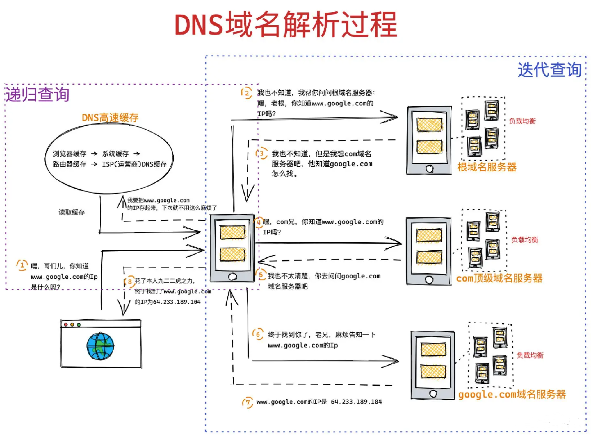

### 第一步：缓存判断

判断是正确的URL格式之后，DNS会在我们的缓存中查询是否有当前域名的IP地址

基本步骤：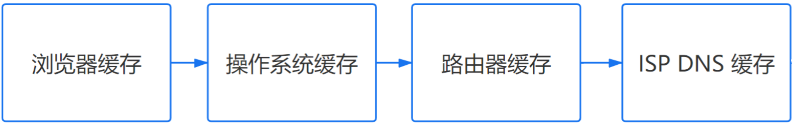

- 浏览器缓存：浏览器检查是否在缓存中
- 操作系统缓存：操作系统DNS缓存，去本地的hosts文件查找
- 路由器缓存：路由器DNS缓存
- ISP 缓存： ISP DNS缓存（ISP DNS 就是在客户端电脑上设置的首选 DNS 服务器，又称本地的DNS服务器）


在经历上述缓存查找还没有找到的话，就进行下一步查询操作


### 第二步：查询IP地址

浏览器会去根域名服务器中查找，如果还没有就去顶级域名服务器中查找，最后是权威域名服务器。

找到IP地址后，将它记录在缓存中，供下次使用。

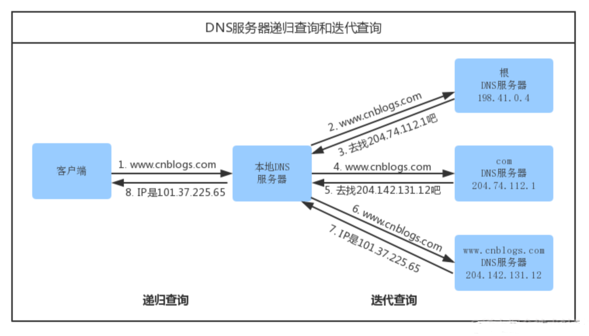


## TCP连接：三次握手

### 简单理解

简单的理解就是：

```
客户端：hello，你好，你是server吗？
服务端：hello，你好，我是server，你是client吗
客户端：yes，我是client
开始数据传输.....
——————————————————————————————————————————
客户端(男人)：我喜欢你，咱俩处对象吧
服务端(女人)：我也喜欢你，我答应你
客户端(男人)：太棒了，我们现在去看电影吧
开始数据传输.....
```

然后双方就正确建立连接，开始传输数据


### 详细分析

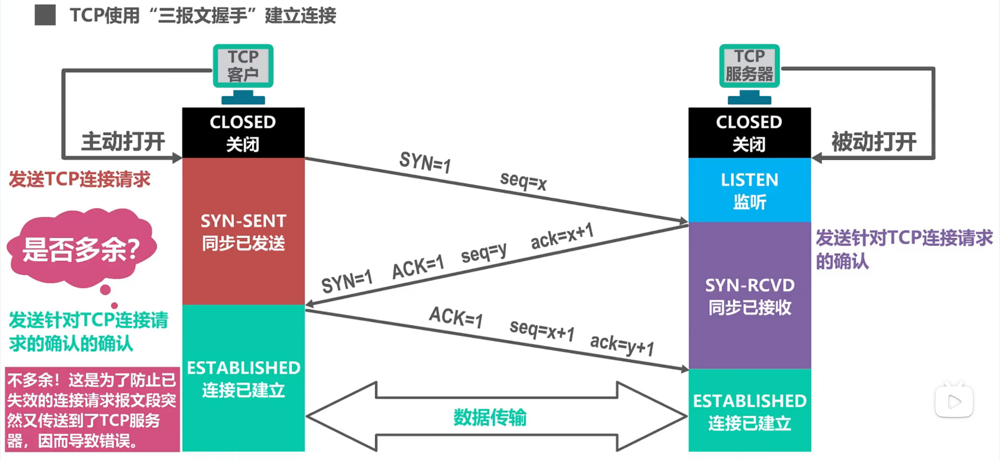

- 第一次握手：客户端发送一个带 `SYN=1，Seq=x` 的数据包到服务器端口
  - `第一次握手，由浏览器发起，告诉服务器我要发送请求了`
  - SYN(synchronous)：请求建立连接
  - seq(sequence)：随机序列号
  - 请注意TCP规定SYN被设置为1的报文段**不能携带数据**但要消耗掉一个序号。
- 第二次握手：服务器发回一个带 `SYN=1， ACK=1， seq=y, ack= x+1` 的响应包以示传达确认信息
  - `第二次握手，由服务器发起，告诉客户端我准备接受了，你赶紧发送吧`
  - ACK(acknowledgement)：确认，是一个确定字符
  - ack：**ack=上一次的seq+1**，作用是接受上一次远端主机传来的seq，加一然后再传给客户端，提示客户端已经成功接收上一次所有数据
  - **请注意这个报文段不能携带数据**，因为它是SYN被设置为一的报文段但同样要消耗掉一个序号
- 第三次握手：客户端再回传一个带 `ACK，seq = x + 1,  ack = y + 1` 的数据包，代表“握手结束”
  - `第三次握手，由浏览器发送，告诉服务器，我马上就发了，准备接受吧`
  - **确认报文段可以携带数据**。但**如果不携带数据则不消耗序号**，在这种情况下所发送的下一个数据报文段的序号仍是x + 1

然后双方就正确建立连接，开始传输数据


## SSL/TLS四次握手

**HTTPS 建立连接的过程，先进行 TCP 三次握手，再进行 TLS 四次握手**（仅对https）

因为 HTTPS 都是基于 TCP 传输协议实现的，得先建立完可靠的 TCP 连接才能做 TLS 握手的事情。

### 第一次握手：客户端发出请求Client Hello

- 首先，客户端先向服务器发出加密通信的请求，这被叫做clienthello请求。

- 在这一步，客户端主要向服务器提供以下信息：
  - 支持的协议版本，比如TLS1.0版本
  - 支持的加密方法，比如RSA公钥加密
  - 一个客户端生成的**随机数(client random)**, 稍后用于生成对话密钥(session key)


### 第二次握手：服务器回应Server Hello

- 服务器收到客户端请求后，向客户端发出回应，这叫做serverhello

- 这一步服务器主要干三件事：
  - 确认使用的加密通信协议版本，比如TLS1.00版本。如果游览器与服务器支持的版本不一致，服务器关闭加密通信
  - 确认使用的加密方法（客户端所支持），比如RSA公钥加密
  - 将服务器证书、非对称加密的公钥，以及一个随机数(Server random)发送给客户端游览器


### 客户端验证证书

客户端收到服务器回应以后，首先验证服务器证书，验证手段就是执行如下三种检查：

- 检查证书是否已过期；
- 检查证书中的域名与实际域名是否一致
- 检查证书是否是可信机构颁布的

如果，上述过程中有任何一个环节发现问题，那么浏览器就会向访问者显示一个警告，由其选择是否还要继续通信。如果证书受信任，或者是用户接受了不受信的证书，**浏览器会生成一串新的随机数（Premaster secret ）**。


### 第三次握手：客户端回应

此时，浏览器会根据前三次握手中的三个随机数：

- **Client random**
- **Server random**
- **Premaster secret**

通过一定的算法来**生成 “会话密钥” （Session Key）**，这个会话密钥就是接下来双方进行**对称加密解密**使用的密钥！


### 第四次握手：服务端回应

服务端收到客户端的回复，利用已知的加密解密方式进行解密，服务器收到客户端的第三个随机数（ Premaster secret） 之后，使用同样的算法计算出 “会话密钥” （Session Key）。


至此，整个握手阶段全部结束。接下来，客户端与服务器进入加密通信，就完全是使用普通的 HTTP 协议，只不过用 “会话密钥” 加密内容。（非对称加密解密将不再使用，接下来完全由对称加密接手了，因为密钥已经安全的传送给了通信的双方）


### 总结

1. 客户端请求建立SSL链接，并向服务发送一个**随机数–Client random**和**客户端支持的加密方法**，比如RSA公钥加密，此时是明文传输

2. 服务端回复一种客户端支持的**加密方法**、**一个随机数–Server random**、授信的**服务器证书**和**非对称加密的公钥**

3. 客户端收到服务端的回复后利用**服务端的公钥**，加上**新的随机数–Premaster secret** 通过服务端下发的**公钥及加密方法**进行加密，发送给服务器

4. 服务端收到客户端的回复，利用**已知的加解密方式进行解密**，同时利用**Client random、Server random和Premaster secret**通过一定的算法生成HTTP链接数据传输的对称加密**key – session key**


## 浏览器发送请求

连接建立成功之后，浏览器向服务器发送**HTTP请求报文**，来获取自己想要的数据

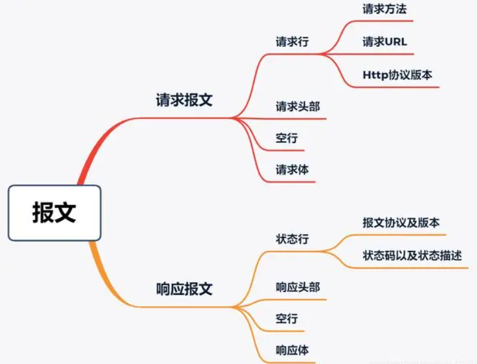

**请求报文由请求行、请求头、空行、请求体四部分组成**

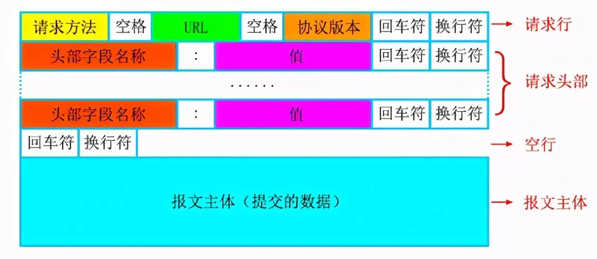

- **请求行**：有请求方法、请求的url、http协议及其版本
- **请求头**：把浏览器的一些基础信息告诉服务器。比如包含了浏览器所使用的操作系统、浏览器内核等信息，以及当前请求的域名信息、浏览器端的 Cookie 信息等
- **空行**：最后一个请求头之后是一个空行，发送回车符和换行符，通知服务器以下不再有请求头
- **请求体**（报文主体/请求中文）：当使用POST, PUT等方法时，通常需要客户端向服务器传递数据。这些数据就储存在**请求正文**中。在请求包头中有一些与请求正文相关的信息，例如: 现在的Web应用通常采用Rest架构，请求的数据格式一般为json。这时就需要设置`Content-Type: application/json`。


## 服务端响应请求并返回数据

服务器对http请求报文进行解析，并给客户端发送**HTTP响应报文**对其进行响应


**HTTP响应报文也是由状态行、响应头、空行、响应体四部分组成**

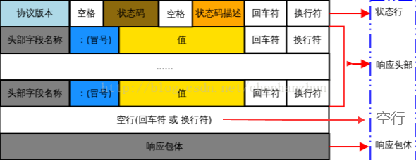

- 响应行/状态行：由 HTTP 版本协议字段、状态码和状态码的描述文本 3 个部分组成
- 响应头：用于指示客户端如何处理响应体，告诉浏览器响应的类型、字符编码和字节大小等信息
- 空行：最后一个响应头部之后是一个空行，发送回车符和换行符，通知服务器以下不再有响应头部。
- 响应体：返回客户端所需数据

这个时候浏览器拿到我们服务器返回的HTML文件，可以开始解析渲染页面


## 浏览器解析渲染页面

**当我们经历了上述的一系列步骤之后，我们的浏览器就拿到了我的HTML文件那么它又是如何解析整个页面并且最终呈现出我们的网页呢?**

### 渲染流程图

**简图：**从这张图上我们可以得出一个重要的结论：**下载CSS文件并不会阻塞HTML的解析**

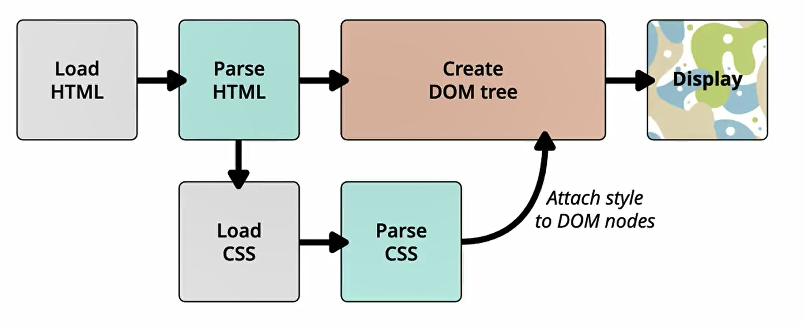

**详图**：

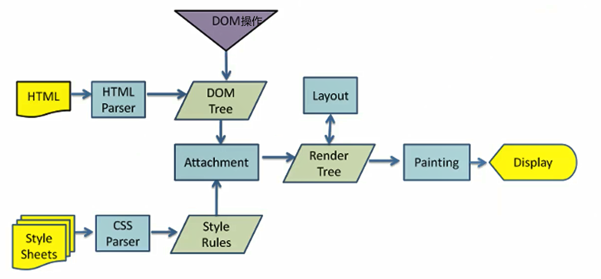


### 详细解析步骤

### 解析一：HTML解析过程

默认情况下服务器会给浏览器返回index.html文件，所以解析HTML是所有步骤的开始：解析HTML，会 **构建DOM Tree**

当遇到我们的script文件的时候，我们是不能进行去构建DOM Tree的。它会**停止继续构建，首先下载JavaScript代码，并且执行JavaScript的脚本，只有等到JavaScript脚本执行结束后，才会继续解析HTML，构建DOM树**。

具体的相关细节看下面的script与页面解析

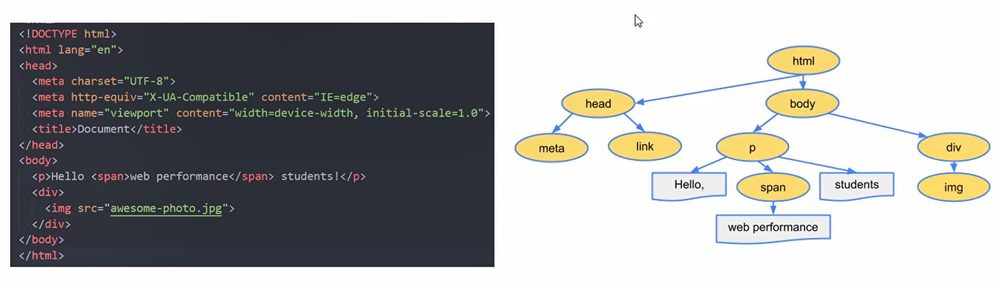


### 解析二：生成CSS规则

- 在解析的过程中，如果遇到CSS的link元素，那么会由浏览器负责下载对应的CSS文件
  - 注意:下载CSS文件是不会影响DOM的解析的

- 浏览器下载完CSS文件后，就会对CSS文件进行解析，解析出对应的规则树
  - 我们可以称之为 **CSSOM** (CSS Object Model，**CSS对象模型**）


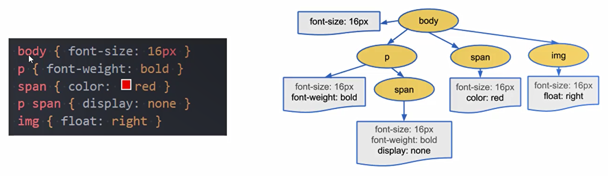

### 解析三：构建Render Tree

当有了 **DOM Tree 和 CSSOM Tree** 后，就可以两个结合来 **构建 Render Tree**

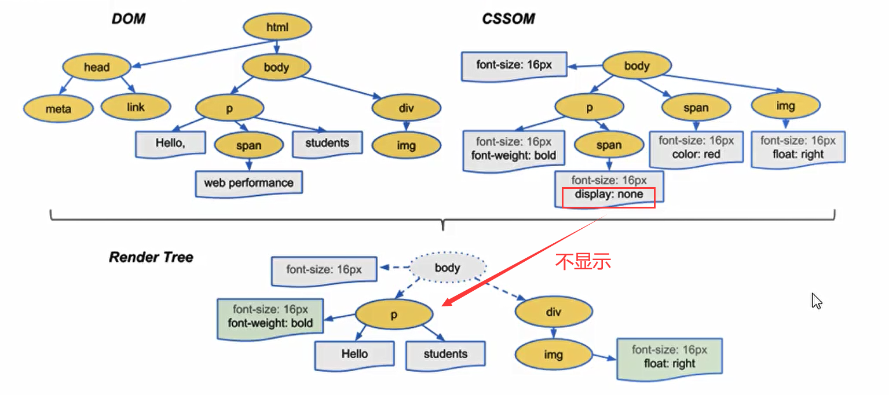

- 注意一：**link元素不会阻塞DOM Tree的构建过程，但是会阻塞Render Tree的构建过程**
  - 因为Render Tree在构建时，需要对应的CSSOM Tree。当我们DOMTree解析完成的时候，如果CSSOM Tree没解析完成就会阻塞。当然一般情况下浏览器会进行优化处理，不会傻傻的等待

- 注意二：**Render Tree和DOMTree并不是一一对应的关系**
  - 比如对于display为none的元素，压根不会出现在render tree中


### 解析四：布局(layout)和绘制(Paint)

- 第四步是在**渲染树(Render Tree)**上运行 **布局(Layout)** 以计算每个节点的几何体。
  - 渲染树会 表示 **要显示哪些节点以及其他样式**，但是 **不表示 每个节点的尺寸、位置** 等信息
  - **布局的主要目的是为了确定呈现树中所有节点的宽度、高度和位置信息**
- 第五步是将每个节点 **绘制(Paint)** 到屏幕上
  - 在绘制阶段，浏览器将布局阶段计算的 每个frame转为屏幕上实际的像素点
  - 包括 将元素的可见部分进行绘制，比如文本、颜色、边框、阴影、替换元素（比如img）

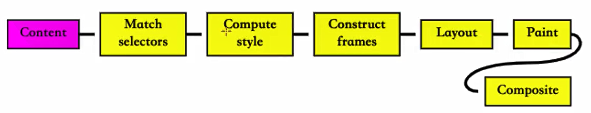

### 特殊解析：composite合成

- 绘制的过程,可以将布局后的元素**绘制到多个合成图层中**【这是浏览器的一种优化手段】

- 默认情况下，标准流中的内容都是被绘制在**同一个图层**(Layer)中的

- 而一些特殊的属性，会创建一个新的合成层（Compositinglayer )，并且新的图层可以利用GPU来加速绘制
  - 因为每个合成层都是单独渲染的

- 那么哪些属性可以形成新的合成层呢?常见的一些属性：

  - 3D transforms

  - video、canvas、iframe
  - opacity动画转换时
  - position: fixed
  - will-change:一个实验性的属性，提前告诉浏览器元素可能发生哪些变化
  - animation或 transition设置了opacity、transform

- 分层确实可以提高性能，但是它以内存管理为代价，因此不应作为web性能优化策略的一部分过度使用


### 其他相关概念

#### 回流

- 回流reflow(也可以称之为重排)
  - 第一次确定节点的大小和位置，称之为**布局**(layout)
  - 之后对节点的大小、位置修改 **重新计算** 称之为**回流**
- 什么情况下引起回流呢?
  - 比如DOM结构发生改变（添加新的节点或者移除节点)
  - 比如改变了布局(修改了width、height、padding、font-size等值)
  - 比如窗口resize(修改了窗口的尺寸等)
  - 比如调用getComputedStyle方法获取尺寸、位置信息


#### 重绘

- 重绘repaint【字面理解就是对页面再做绘制】
  - 第一次渲染内容称之为**绘制**(paint)
  - 之后重新渲染称之为**重绘**
- 什么情况下会引起重绘呢?
  - 比如修改背景色、文字颜色、边框颜色、样式等


#### 联系

- 回流一定会引起重绘，所以回流是一件很消耗性能的事情。
- 所以在开发中要尽量避免发生回流
  - 修改样式时尽量一次性修改【比如通过cssText修改，比如通过添加class修改】
  - 尽量 **避免频繁的操作DOM**【我们可以在一个DocumentFragment或者父元素中将要操作的DOM操作完成，再一次性的操作】
  - 尽量 **避免通过getComputedStyle获取尺寸、位置等信息**
  - 对某些元素使用position的absolute或者fixed【并不是不会引起回流，而是开销相对较小，不会对其他元素造成影响】


### script元素

#### script元素和页面联系

- 我们现在已经知道了页面的渲染过程，但是JavaScript在哪里呢?
  - 事实上，浏览器在解析HTML的过程中，**遇到了 script元素是不能继续构建DOM树的**
  - 它会 **停止继续构建，首先下载JavaScript代码，并且执行JavaScript的脚本**
  - 只有 **等到JavaScript脚本执行结束后，才会继续解析HTML，构建DOM树**
- 为什么要这样做呢?
  - 这是 **因为JavaScript的作用之一就是操作DOM，并且可以修改DOM**
  - 如果我们等到DOM树构建完成并且渲染再执行JavaScript会造成严重的回流和重绘，影响页面的性能
  - 所以会在遇到script元素时，优先下载和执行JavaScript代码，再继续构建DOM树
- 但是这个也往往会带来新的问题，特别是现代页面开发中:
  - 在目前的开发模式中（比如Vue、React)，脚本往往比HTML页面更“重”，处理时间需要更长
  - 所以会造成页面的解析阻塞，在脚本下载、执行完成之前，用户在界面上什么都看不到
- 为了解决这个问题，script元素给我们提供了两个属性(attribute) : defer和async


#### defer属性

- defer属性告诉浏览器 **不要等待脚本下载，而继续解析HTML，构建DOM Tree**

  - 脚本会 **由浏览器来进行下载，但是不会阻塞DOM Tree的构建过程**
  - 如果脚本提前下载好了，它会 **等待DOM Tree构建完成，在DOMContentLoaded事件之前先执行defer中的代码**

- 所以DOMContentLoaded总是会等待defer中的代码先执行完成

  - ```html
    <script src="./foo.js" defer></script>
    <script>
    	 window.addEventListener("DOMContentLoaded",()=>{
             console.log("DOMContentLoaded");
         })
    </script>
    ```

- **多个带defer的脚步是可以保持正确的执行顺序的**

- 从某种角度来说，defer可以提高页面的性能，并且推荐放到head元素中

- 注意：defer仅适用于外部脚本，对于script默认内容会被忽略


#### async属性

- async特性与defer有些类似，它也能够让脚本不阻塞页面
- async是让一个脚本完全独立的:
  - 浏览器 **不会因async 脚本而阻塞**(与defer类似)
  - **async脚本不能保证顺序，它是独立下载、独立运行，不会等待其他脚本**
  - **async不会能保证在DOMContentLoaded之前或者之后执行**


- defer通常用于需要在文档解析后操作DOM的JavaScript代码，并且对多个script文件有顺序要求的
- async通常用于独立的脚本，对其他脚本，甚至DOM没有依赖的


## 断开连接：TCP 四次挥手

在渲染完成后，浏览器可能会继续加载页面中的其他资源，如异步加载的内容或者通过JavaScript生成的动态内容。

而在此过程中，如果没有其他资源需要加载，浏览器将与服务器之间的TCP连接断开。


### 简单理解

```
主动方：我已经关闭了向你那边的主动通道了，这是我最后一次给你发消息了，之后只能被动接收你的信息了
被动方：收到你通道关闭的信息
被动方：那我也告诉你，我这边向你的主动通道也关闭了
主动方：最后收到你关闭的信息，OK结束
断开连接，结束通讯
————————————————————————————————————————————————————————————————————————————
提出分手的可能是男生（客户端），也可能是女生（服务端）
主动方：分手吧，我不喜欢你了！
被动方：行，你等我忙完手上的工作我在收拾你！
被动方：我忙完了，分手就分手！
主动方：好，好聚好散，拜拜！
断开连接，结束通讯
```


### 详细分析

由于**TCP连接是全双工的**，因此，每个方向都必须要单独进行关闭，这一原则是当一方完成数据发送任务后，发送一个FIN来终止这一方向的连接，收到一个FIN只是意味着这一方向上没有数据流动了，即不会再收到数据了，但是在这个TCP连接上仍然能够发送数据，直到这一方向也发送了FIN。首先进行关闭的一方将执行主动关闭，而另一方则执行被动关闭。

**任何一方都可以在数据传送结束后发出连接释放的通知，所有主动发起关闭请求可以是客户端，也可以是服务端**

**这里我们假设是由客户端先主动发起关闭请求**

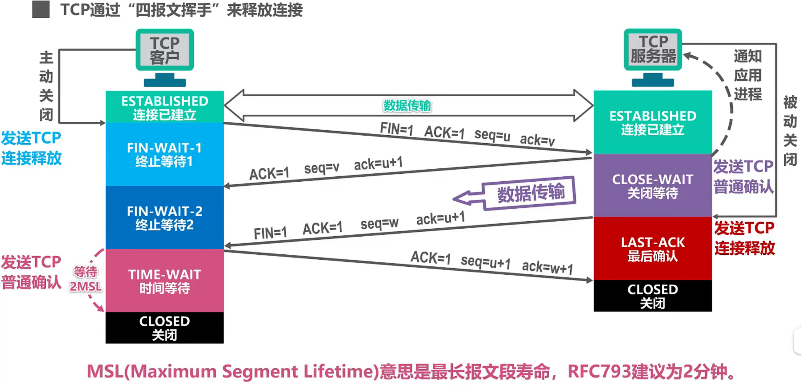

- 第一次挥手：TCP客户进程会发送TCP连接释放报文段，并进入终止等待1(FIN-WAIT-1)状态。
  - FIN：终止位，表示断开TCP连接
  - TCP规定终止位FIN等于1的报文段即使不携带数据，也要消耗掉一个序号
- 第二次挥手：TCP服务器进程收到TCP连接释放报文段后，会发送一个普通的TCP确认报文段并进入关闭等待(CLOSE-WAIT)状态。
  - 序号seq字段的值设置为v，与之前收到的TCP连接释放报文段中的确认号匹配
  - TCP客户进程收到TCP确认报文段后就进入终止等待2(FIN-WAIT-2)状态，等待TCP服务器进程发出的TCP连接释放报文段
  - 这时的TCP连接属于半关闭状态，也就是TCP客户进程已经没有数据要发送了。但如果TCP服务器进程还有数据要发送，TCP客户进程仍要接收，也就是说从**TCP服务器进程到TCP客户进程这个方向的连接并未关闭，这个状态可能要持续一段时间。**
- 第三次挥手：TCP服务器进程发送TCP连接释放报文段
  - 假定序号seq字段的值为w，这是因为在半关闭状态下，TCP服务器进程可能又发送了一些数据。
  - 确认号ack字段的值为u+1，这是对之前收到的TCP连接释放报文段的重复确认。
- 第四次挥手：TCP服务器进程收到确定报文段后就进入关闭状态，而TCP客户进程还要经过2MSL后才能进入关闭状态。


之后断开连接，结束通讯


## 总结

- 浏览器先判断是否为合法的url格式，不合法则在搜索引擎中搜索
- 合法后，DNS解析会先判断缓存中是否有url的ip地址。
- 缓存的查询顺序是：浏览器缓存 -> 操作系统缓存（本地的hosts文件） -> 路由器缓存 -> 本地的DNS服务器缓存
- 在缓存中没有的情况，则向服务器发起请求查询ip地址。
- 查询IP地址的顺序是：根域名服务器 -> 顶级域名服务器 -> 权威域名服务器。直到查找到返回，并将其存储在缓存中下次使用
- TSP建立连接，也就是三次握手
- 第一次握手，携带建立连接请求SYN=1和随机序列seq=x
- 第二次握手，携带确定字段ACK=1、连接请求SYN=1、随机序列seq=y和ack为上一次握手的seq+1，就是x+1
- 第三次握手，携带确定字段ACK=1、ack=y+1、seq=x+1
- 如果是https，还有一个TLS四次握手
- 第一次握手，客户端向服务端发送 支持的协议版本 + 支持的加密方法 + 生成的随机数
- 第二次握手，服务端向客户端发送 证书 + 公钥 + 随机数
- 第三次握手前，客户端会先验证证书有没有过期、域名对不对、是否可信机构颁发的。
- 没有问题或者用户接受不受信的证书，浏览器会生成一个新的随机数
- 第三次握手，将之前的三个随机数通过一定的算法生成会话秘钥，之后的加密解密都是用这个秘钥
- 第四次握手，服务端收到回复，是用确定的加密方法进行解密，得到第三个随机数，使用同样的算法计算出会话秘钥
- 建立连接之后，浏览器发送http请求
- 请求报文由请求行、请求头、空行和请求体组成
- 服务器解析请求报文，返回响应报文
- 响应报文由响应行、响应头、空行和响应体组成，我们需要的html文件就在响应体中
- 浏览器拿到html文件并开始解析，构建dom tree。遇到css文件，下载并构建CSSOM tree。等到两者都构建完成之后，一起构建Render tree。然后进行布局和绘制
- 其中遇到了script标签，则停止构建dom tree，等下载完成之后才会继续构建dom tree
- 当资源传输完毕之后，TSP关闭连接，进行四次挥手的操作，其中四次挥手的操作客户端和服务器都可以发起
- 第一次挥手，携带断开连接的FIN=1、确定字段ACK=1、随机序列seq=u，ack=v
- 第二次挥手，携带确定字段ACK=1、随机序列seq=v，ack=u+1
- 第三次挥手，携带确定字段ACK=1、断开连接FIN=1、随机序列seq=w、ack=u+1
- 第四次挥手，携带确定字段ACK=1，随机序列seq=u+1，ack=w+1
- 等待2MSL后进入关闭状态
- 断开连接，结束通讯


## 细说HTTP缓存

HTTP缓存属于客户端缓存，我们常认为浏览器有一个缓存数据库，用来保存一些静态文件，下面我们分为以下几个方面来简单介绍HTTP缓存

- 缓存的规则
- 缓存的方案
- 缓存的优点
- 不同刷新的请求执行过程


### 缓存的规则

缓存规则分为**强制缓存**，**协商缓存**和**启发式缓存**

#### 强制缓存

当缓存数据库中有客户端需要的数据，**浏览器如果判断本地缓存未过期**，就直接使用，当缓存服务器没有需要的数据时，客户端才会向服务端请求。

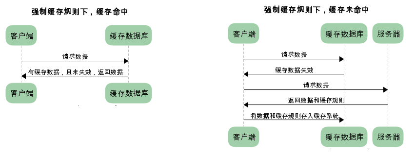

#### 协商缓存

又称对比缓存。浏览器第一次请求数据时，服务器会将缓存标识与数据一起返回给客户端，客户端将二者备份至缓存数据库中。再次请求数据时，客户端将备份的缓存标识发送给服务器，服务器根据缓存标识进行判断，判断成功后，返回`304`状态码，通知客户端比较成功，可以使用缓存数据。如果失效，服务端会返回新的数据

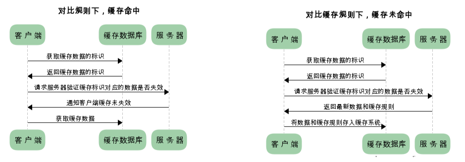

**第一次访问**

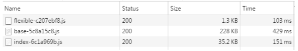

**再次访问**

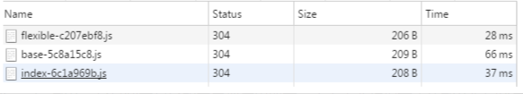

通过两图的对比，我们可以很清楚的发现，在**协商缓存**生效时，状态码为304，并且报文大小和请求时间大大减少。

原因是，服务端在进行标识比较后，只返回header部分，通过状态码通知客户端使用缓存，不再需要将报文主体部分返回给客户端。


#### 启发式缓存

**启发式缓存就是无任何缓存相关的请求头的一种兜底策略，只有在服务端没有返回明确的缓存策略时才会激活浏览器的启发式缓存策略**

如果响应中未显示Expires，Cache-Control：max-age或Cache-Control：s-maxage，并且响应中不包含其他有关缓存的限制，缓存可以使用启发式方法计算新鲜度寿命。通常会根据响应头中的2个时间字段 Date 减去 Last-Modified 值的 10% 作为缓存时间

```
// Date 减去 Last-Modified 值的 10% 作为缓存时间。
// Date：创建报文的日期时间, Last-Modified 服务器声明文档最后被修改时间
response_is_fresh =  max(0,（Date -  Last-Modified)) % 10
```


#### 总结

- 强制缓存如果生效，不需要再和服务器发生交互，而对比缓存不管是否生效，都需要与服务端发生交互。
- 两类缓存规则可以同时存在，强制缓存优先级高于对比缓存，也就是说，当执行强制缓存的规则时，如果缓存生效，直接使用缓存，不再执行对比缓存规则。


### 缓存方案

#### 强制缓存

**浏览器是如何判断缓存数据是否失效呢**

我们知道，在没有缓存数据的时候，浏览器向服务器请求数据时，服务器会将数据和缓存规则一并返回，缓存规则信息包含在响应header中。

对于强制缓存来说，响应header中会有两个字段来标明失效规则（Expires/Cache-Control）

使用chrome的开发者工具，可以很明显的看到对于强制缓存生效时，网络请求的情况

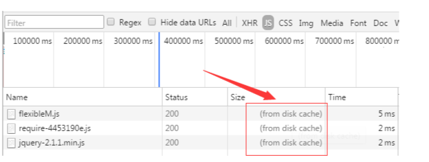

**Expires**

- Expires的值为服务端返回的到期时间，即下一次请求时，请求时间小于服务端返回的到期时间，直接使用缓存数据。

- 不过Expires 是HTTP 1.0的东西，现在默认浏览器均默认使用HTTP 1.1，所以它的作用基本忽略。、
- 另一个问题是，到期时间是由服务端生成的，但是客户端时间可能跟服务端时间有误差，这就会导致缓存命中的误差。所以HTTP 1.1 的版本，使用Cache-Control替代。

**Cache-Control**

- Cache-Control 是最重要的规则。常见的取值有private、public、no-cache、max-age，no-store，默认为private。
- private：客户端可以缓存
- public：客户端和代理服务器都可缓存
- max-age=xxx： 缓存的内容将在 xxx 秒后失效
- no-cache：需要使用**对比缓存**来验证缓存数据（后面介绍）
- no-store：所有内容都不会缓存，强制缓存，对比缓存都不会触发（对于前端开发来说，缓存越多越好，so...基本上和它说886）

**举个例子**

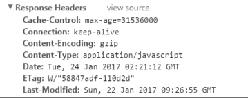

图中Cache-Control仅指定了max-age，所以默认为private，缓存时间为31536000秒（365天）。也就是说，在365天内再次请求这条数据，都会直接获取缓存数据库中的数据，直接使用。


#### 协商缓存

对于**协商缓存**来说，缓存标识的传递是我们着重需要理解的，它在请求header和响应header间进行传递，一共分为两种标识传递，接下来，我们分开介绍。

**Last-Modified / If-Modified-Since**

Last-Modified：服务器在响应请求时，告诉浏览器资源的最后修改时间。

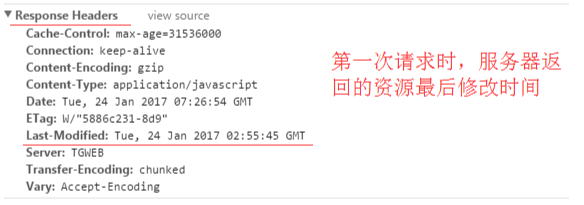

If-Modified-Since：

- 再次请求服务器时，会在其**请求头**上附带上 `If-Modified-Since` 字段（值就是第一次获取请求资源时响应头中返回的 `Last-Modified` 值）
- 服务器收到请求后发现有头If-Modified-Since 则与被请求资源的最后修改时间进行比对。
- 若资源的最后修改时间大于If-Modified-Since，说明资源又被改动过，则响应整片资源内容，返回状态码200；
- 若资源的最后修改时间小于或等于If-Modified-Since，说明资源无新修改，则响应HTTP 304，告知浏览器继续使用所保存的cache。

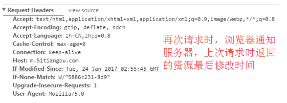

**Etag / If-None-Match**（优先级高于Last-Modified / If-Modified-Since）

Etag：服务器响应请求时，告诉浏览器当前资源在服务器的唯一标识（生成规则由服务器决定）。

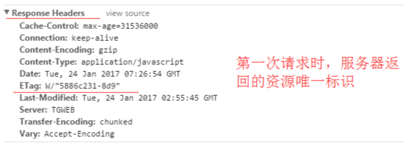

If-None-Match：

- 再次请求服务器时，通过此字段通知服务器客户段缓存数据的唯一标识。
- 服务器收到请求后发现有头If-None-Match 则与被请求资源的唯一标识进行比对，
- 不同，说明资源又被改动过，则响应整片资源内容，返回状态码200；
- 相同，说明资源无新修改，则响应HTTP 304，告知浏览器继续使用所保存的cache。

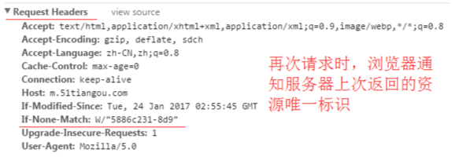

#### 启发式缓存

启发式缓存会引起什么问题吗？？

文件响应头中的 `Date` 和 `Last-Modified` 信息，这里的这两个时间是决定下次刷新页面之后，是请求服务器还是走本地缓存的关键因素，注意是**下一次请求**！

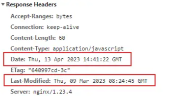

此时当前这一次请求的响应头 `（Date - Last-Modified） * 0.1` 是决定该文件缓存时间的长短，也就是 `（2023-04-13 - 2023-03-09）` 等于35天（具体时间时分秒先不计算），再乘以0.1，则当前文件则会缓存大约3.5天的时间，用户下次请求这个文件的时候，在3.5天之内请求则直接走本地缓存获取，超过3.5天去请求当前文件，则会去请求服务器的资源，不再走缓存！


#### 总结

浏览器第一次请求：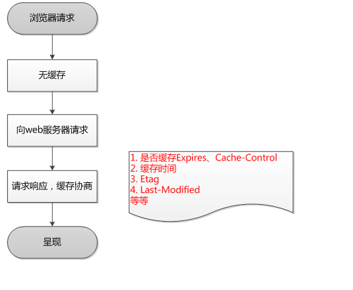

浏览器再次请求：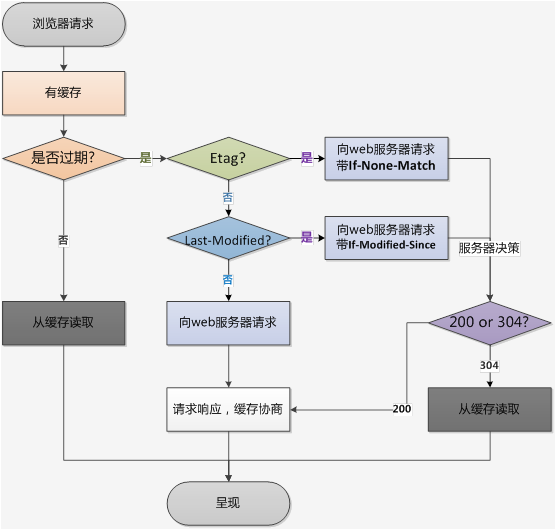


### 缓存的优点

- 减少了冗余的数据传递，节省宽带流量
- 减少了服务器的负担，大大提高了网站性能
- 加快了客户端加载网页的速度 这也正是HTTP缓存属于客户端缓存的原因。


### 不同刷新的请求执行过程

- **浏览器地址栏中写入URL，回车**：浏览器发现缓存中有这个文件了，不用继续请求了，直接去缓存拿。（最快）
- **F5**：F5就是告诉浏览器，别偷懒，好歹去服务器看看这个文件是否有过期了。于是浏览器就战战兢兢的发送一个请求带上If-Modify-since。
- **Ctrl+F5**：告诉浏览器，你先把你缓存中的这个文件给我删了，然后再去服务器请求个完整的资源文件下来。于是客户端就完成了强行更新的操作


## 细说HTTP请求方法

### 常见的HTTP请求方法

有GET、POST、DELETE、PUT、HEAD、OPTIONS、TRACE、PATCH、CONNECT 方法

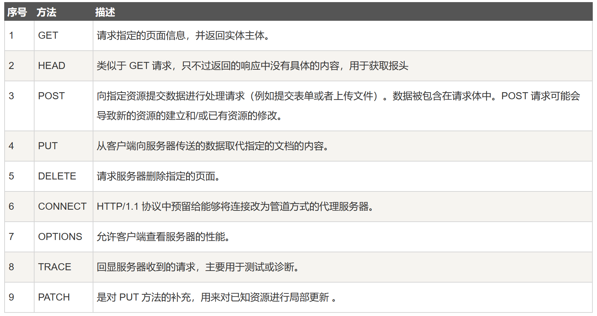


### GET和POST的区别

- **用途**
  - GET 用于从服务器获取资源或数据。通常用于获取、读取数据。
  - POST 用于向服务器提交数据，通常用于创建、更新或修改服务器上的资源

- **参数传递**
  - GET 请求的参数通常通过 URL 的查询字符串（Query String）传递，参数会附加在 URL 的末尾，浏览器对其有长度限制。
  - POST 请求的参数通常通过请求的主体部分（Body）传递，可以传递较大量的数据，而不会受到 URL 长度限制。

- **缓存**
  - GET 请求可以被浏览器缓存，相同的请求可以从缓存中获取结果，提高性能。
  - POST 请求默认不会被浏览器缓存，每次请求都会获取最新的结果。

- **数据安全性**
  - GET比POST更不安全，因为参数直接暴露在URL上。
  - POST参数在请求主体中，对数据的传输相对安全，适合传输敏感信息。


补充：有些文章中提到，post 会将 header 和 body 分开发送，先发送 header，服务端返回 100 状态码再发送 body。HTTP 协议中没有明确说明 POST 会产生两个 TCP 数据包，而且实际测试(Chrome)发现，header 和 body 不会分开发送。所以，header 和 body 分开发送是部分浏览器或框架的请求方法，不属于 post 必然行为。


### POST和PUT的区别

两者都是将数据携带传输给后端，但是有一定的区别的

**它们最根本的区别就是：POST方法不具有幂等性，而PUT方法则有幂等性**

幂等（idempotent、idempotence）是一个抽象代数的概念。在计算机中，可以这么理解，一个幂等操作的特点就是其任意多次执行所产生的影响均与依次一次执行的影响相同。

POST在每次请求的时候，服务器会每次都创建一个文件，但是在PUT方法的时候只是简单地更新，而不是去重新创建。因此PUT是幂等的。

举例来说，当你在掘金编辑博客时，后台提供了一个API：test。如果你发送n次test请求，后台始终都只产生了一篇文章，说明前面的请求被覆盖了，那么这个test在多次请求中没有副作用，则它使用的应该是幂等方法PUT。如果n次请求后，后台产生了n篇文章，那么test则是非幂等方法POST。


## HTTP的发展

**HTTP**（HyperText Transfer Protocol）是万维网（World Wide Web）的基础协议

### 发展历程

[HTTP 的发展 - HTTP | MDN (mozilla.org)](https://developer.mozilla.org/zh-CN/docs/Web/HTTP/Basics_of_HTTP/Evolution_of_HTTP)

**HTTP/0.9——单行协议**

最初版本的 HTTP 协议并没有版本号，后来它的版本号被定位在 0.9 以区分后来的版本。HTTP/0.9 极其简单：请求由单行指令构成，以唯一可用方法 `GET`开头，其后跟目标资源的路径（一旦连接到服务器，协议、服务器、端口号这些都不是必须的）


**HTTP/1.0——构建可扩展性**

由于 HTTP/0.9 协议的应用十分有限，浏览器和服务器迅速扩展内容使其用途更广：

- 协议版本信息现在会随着每个请求发送（`HTTP/1.0` 被追加到了 `GET` 行）。
- 状态码会在响应开始时发送，使浏览器能了解请求执行成功或失败，并相应调整行为（如更新或使用本地缓存）。
- 引入了 HTTP 标头的概念，无论是对于请求还是响应，允许传输元数据，使协议变得非常灵活，更具扩展性。
- 在新 HTTP 标头的帮助下，具备了传输除纯文本 HTML 文件以外其他类型文档的能力（凭借 [`Content-Type`](https://developer.mozilla.org/zh-CN/docs/Web/HTTP/Headers/Content-Type) 标头）


**HTTP/1.1——标准化的协议**

HTTP/1.1 消除了大量歧义内容并引入了多项改进：

- 连接可以复用，节省了多次打开 TCP 连接加载网页文档资源的时间。
- 增加管线化技术，允许在第一个应答被完全发送之前就发送第二个请求，以降低通信延迟。
- 支持响应分块。
- 引入额外的缓存控制机制。
- 引入内容协商机制，包括语言、编码、类型等。并允许客户端和服务器之间约定以最合适的内容进行交换。
- 凭借 [`Host`](https://developer.mozilla.org/zh-CN/docs/Web/HTTP/Headers/Host) 标头，能够使不同域名配置在同一个 IP 地址的服务器上。


**HTTP/2——为了更优异的表现**

HTTP/2 在 HTTP/1.1 有几处基本的不同

- HTTP/2 是二进制协议而不是文本协议。不再可读，也不可无障碍的手动创建，改善的优化技术现在可被实施。
- 这是一个多路复用协议。并行的请求能在同一个链接中处理，移除了 HTTP/1.x 中顺序和阻塞的约束。
- 压缩了标头。因为标头在一系列请求中常常是相似的，其移除了重复和传输重复数据的成本。
- 其允许服务器在客户端缓存中填充数据，通过一个叫服务器推送的机制来提前请求。


**HTTP/3——基于QUIC的HTTP**


### http1.0与http1.1的区别

- **缓存处理**
  - 在HTTP1.0中主要使用header里的If-Modified-Since,Expires来做为缓存判断的标准
  - HTTP1.1则引入了更多的缓存控制策略例如Entity tag，If-Unmodified-Since, If-Match, If-None-Match等更多可供选择的缓存头来控制缓存策略
- **长链接**
  - HTTP 1.1支持长连接（PersistentConnection）和请求的流水线（Pipelining）处理，在一个TCP连接上可以传送多个HTTP请求和响应，减少了建立和关闭连接的消耗和延迟，在HTTP1.1中默认开启Connection： keep-alive，一定程度上弥补了HTTP1.0每次请求都要创建连接的缺点
- **host头处理**
  - http1.1 中新增了 host 字段，用来指定服务器的域名。http1.0 中认为每台服务器都绑定一个唯一的 IP 地址，因此，请求消息中的 URL 并没有传递主机名（hostname）。但随着虚拟主机技术的发展，在一台物理服务器上可以存在多个虚拟主机，并且它们共享一个IP地址。因此有了 host 字段，这样就可以将请求发往到同一台服务器上的不同网站。

- **宽带优化**
  - HTTP1.0中，存在一些浪费带宽的现象，例如客户端只是需要某个对象的一部分，而服务器却将整个对象送过来了，并且不支持断点续传功能，HTTP1.1则在请求头引入了range头域，它允许只请求资源的某个部分，即返回码是206（Partial Content），这样就方便了开发者自由的选择以便于充分利用带宽和连接
- **错误通知的管理**
  - 在HTTP1.1中新增了24个错误状态响应码，如409（Conflict）表示请求的资源与资源的当前状态发生冲突；410（Gone）表示服务器上的某个资源被永久性的删除

- **请求方法**
  - HTTP1.0定义了三种请求方法：GET、POST和HEAD方法
  - HTTP1.1新增了五种请求方法：OPTIONS、PUT、DELETE、TRACE和CONNECT方法


### HTTP2.0和HTTP1.X的区别

- **新的二进制格式**
  - HTTP1.x解析是基于文本的，基于文本协议的格式解析存在天然缺陷，文本的表现形式有多样性，考虑的场景必然很多
  - 二进制则不同，只认0和1的组合。基于这种考虑HTTP2.0的协议解析决定采用二进制格式
- **头部压缩**
  - 在HTTP1.1中，HTTP请求和响应都是由状态行、请求/响应头部、消息主体三部分组成。一般而言，消息主体都会经过gzip压缩，或者本身传输的就是压缩过后的二进制文件，但状态行和头部却没有经过任何压缩，直接以纯文本传输。随着Web功能越来越复杂，每个页面产生的请求数也越来越多，导致消耗在头部的流量越来越多，尤其是每次都要传输UserAgent、Cookie这类不会频繁变动的内容，完全是一种浪费
  - HTTP/2 对这一点做了优化，引入了头信息压缩机制。一方面，头信息使用 gzip 或 compress 压缩后再发送；另一方面，客户端和服务器同时维护一张头信息表，所有字段都会存入这个表，生成一个索引号，以后就不发送同样字段了，只发送索引号，这样就能提高速度了
- **服务器推送**
  - HTTP/2 允许服务器未经请求，主动向客户端发送资源，这叫做服务器推送
  - 使用服务器推送提前给客户端推送必要的资源，这样就可以相对减少一些延迟时间
  - 这里需要注意的是 http2 下服务器主动推送的是静态资源，和 WebSocket 以及使用 SSE 等方式向客户端发送即时数据的推送是不同的
- **多路复用**
  - 在http1.1中，浏览器客户端在同一时间，针对同一域名下的请求有一定数量的限制，超过限制数目的请求会被阻塞。这也是为何一些站点会有多个静态资源 CDN 域名的原因之一。
  - http2.0中的多路复用优化了这一性能。多路复用允许同时通过单一的http/2 连接发起多重的请求-响应消息。有了新的分帧机制后，http/2 不再依赖多个TCP连接去实现多流并行了。每个数据流都拆分成很多互不依赖的帧，而这些帧可以交错（乱序发送），还可以分优先级，最后再在另一端把它们重新组合起来。
  - http 2.0 连接都是持久化的，而且客户端与服务器之间也只需要一个连接（每个域名一个连接）即可。http2连接可以承载数十或数百个流的复用，多路复用意味着来自很多流的数据包能够混合在一起通过同样连接传输。当到达终点时，再根据不同帧首部的流标识符重新连接将不同的数据流进行组装。


## 细说HTTP状态码

HTTP 响应状态码用来表明特定 HTTP请求是否成功完成。 响应被归为以下五大类：（同时列出一些常见的状态码）

- [信息响应](https://developer.mozilla.org/zh-CN/docs/Web/HTTP/Status#信息响应) (`100`–`199`)
- [成功响应](https://developer.mozilla.org/zh-CN/docs/Web/HTTP/Status#成功响应) (`200`–`299`)
  - `200 OK`：请求成功
  - `201 Created`：该请求已成功，并因此创建了一个新的资源。这通常是在 POST 请求，或是某些 PUT 请求之后返回的响应。
- [重定向消息](https://developer.mozilla.org/zh-CN/docs/Web/HTTP/Status#重定向消息) (`300`–`399`)
  - `301 Moved Permanently`：请求资源的 URL 已永久更改。在响应中给出了新的 URL。
- [客户端错误响应](https://developer.mozilla.org/zh-CN/docs/Web/HTTP/Status#客户端错误响应) (`400`–`499`)
  - `400 Bad Request`：由于被认为是客户端错误（例如，错误的请求语法、无效的请求消息帧或欺骗性的请求路由），服务器无法或不会处理请求。
  - `401 Unauthorized`：虽然 HTTP 标准指定了"unauthorized"，但从语义上来说，这个响应意味着"unauthenticated"。也就是说，客户端必须对自身进行身份验证才能获得请求的响应。
  - `403 Forbidden`：客户端没有访问内容的权限；也就是说，它是未经授权的，因此服务器拒绝提供请求的资源
  - `404 Not Found`：服务器找不到请求的资源
  - `405 Method Not Allowed`：服务器知道请求方法，但目标资源不支持该方法
- [服务端错误响应](https://developer.mozilla.org/zh-CN/docs/Web/HTTP/Status#服务端错误响应) (`500`–`599`)
  - `500 Internal Server Error`：服务器遇到了不知道如何处理的情况
  - `501 Not Implemented`：服务器不支持请求方法，因此无法处理
  - `502 Bad Gateway`：此错误响应表明服务器作为网关需要得到一个处理这个请求的响应，但是得到一个错误的响应


## TCP异常处理

[TCP 才不傻：三次握手和四次挥手的异常处理 - 知乎 (zhihu.com)](https://zhuanlan.zhihu.com/p/398890723)


## 思考的问题

### TCP第四次挥手为什么要等待2MSL

为了保证客户端发送的最后一个ACK报文段能够到达服务器。因为这个ACK有可能丢失，从而导致处在LAST-ACK状态的服务器收不到对FIN-ACK的确认报文。服务器会超时重传这个FIN-ACK，接着客户端再重传一次确认，重新启动时间等待计时器。最后客户端和服务器都能正常的关闭。假设客户端不等待2MSL，而是在发送完ACK之后直接释放关闭，一但这个ACK丢失的话，服务器就无法正常的进入关闭连接状态。


### 为什么会采用三次握手，若采用二次握手可以吗？ 四次呢？

**为什么需要三次握手，两次不行吗？**

这是由TCP的自身特点**可靠传输**决定的。客户端和服务端要进行可靠传输，那么就需要**确认双方的`接收`和`发送`能力**。第一次握手可以确认客服端的`发送能力`,第二次握手，服务端`SYN=1,Seq=Y`就确认了`发送能力`,`ack=X+1`就确认了`接收能力`，第三次握手可以确认客户端的`接收能力`。

试想如果是用两次握手，则会出现下面这种情况： 如客户端发出连接请求，但因连接请求报文丢失而未收到确认，于是客户端再重传一次连接请求。后来收到了确认，建立了连接。数据传输完毕后，就释放了连接，客户端共发出了两个连接请求报文段，其中第一个丢失，第二个到达了服务端，但是第一个丢失的报文段只是在某些网络结点长时间滞留了，延误到连接释放以后的某个时间才到达服务端，此时服务端误认为客户端又发出一次新的连接请求，于是就向客户端发出确认报文段，同意建立连接，不采用三次握手，只要服务端发出确认，就建立新的连接了，此时客户端忽略服务端发来的确认，也不发送数据，则服务端一致等待客户端发送数据，浪费资源。


**四次呢？**

四次是可以的。TCP三次握手原本应该是"四次握手"，但是中间的同步报文段SYN和应答报文ACK是可以合在一起的，这两个操作在时间上是同时发送的，于是就没必要分成两次传输，直接一步到位。分成两次反而会更浪费系统资源


### 为什么建立连接是三次握手，关闭连接确是四次挥手呢？

因为当服务端收到客户端的SYN连接请求报文后，可以**直接发送SYN+ACK报文**。其中ACK报文是用来应答的，SYN报文是用来同步的。但是关闭连接时，当服务端收到FIN报文时，很可能并不会立即关闭，所以只能先回复一个ACK报文，告诉客户端，“你发的FIN报文我收到了”。只有等到我服务端所有的报文都发送完了，我才能发送FIN报文，因此不能一起发送。故需要四次挥手。


### URL为什么要解析

一开始在互联网上，所有的地址都是IP地址，但是由于这些IP地址太难记了，所以就出现了域名（比如 findland.cn ）。 而域名解析就是将域名转换为IP地址去访问输入的网址的这样一种行为。


### 什么是半连接队列/全连接队列

在 TCP 三次握手的时候，Linux 内核会维护两个队列，分别是：

- 半连接队列，也称 SYN 队列；
- 全连接队列，也称 accepet 队列；

服务端收到客户端发起的 SYN 请求后，内核会把该连接存储到半连接队列，并向客户端响应 SYN+ACK，接着客户端会返回 ACK，服务端收到第三次握手的 ACK 后，内核会把连接从半连接队列移除，然后加入全连接队列，等待进程调用 accept 函数时把连接取出来。

服务端收到客户端发起的 SYN 请求后，内核会把该连接存储到**半连接队列**，并向客户端响应 SYN+ACK，接着客户端会返回 ACK，服务端收到第三次握手的 ACK 后，内核会把连接从**半连接队列**移除，然后创建新的完全的连接，并将其添加到**全连接队列**，等待进程调用 accept 函数时把连接取出来。

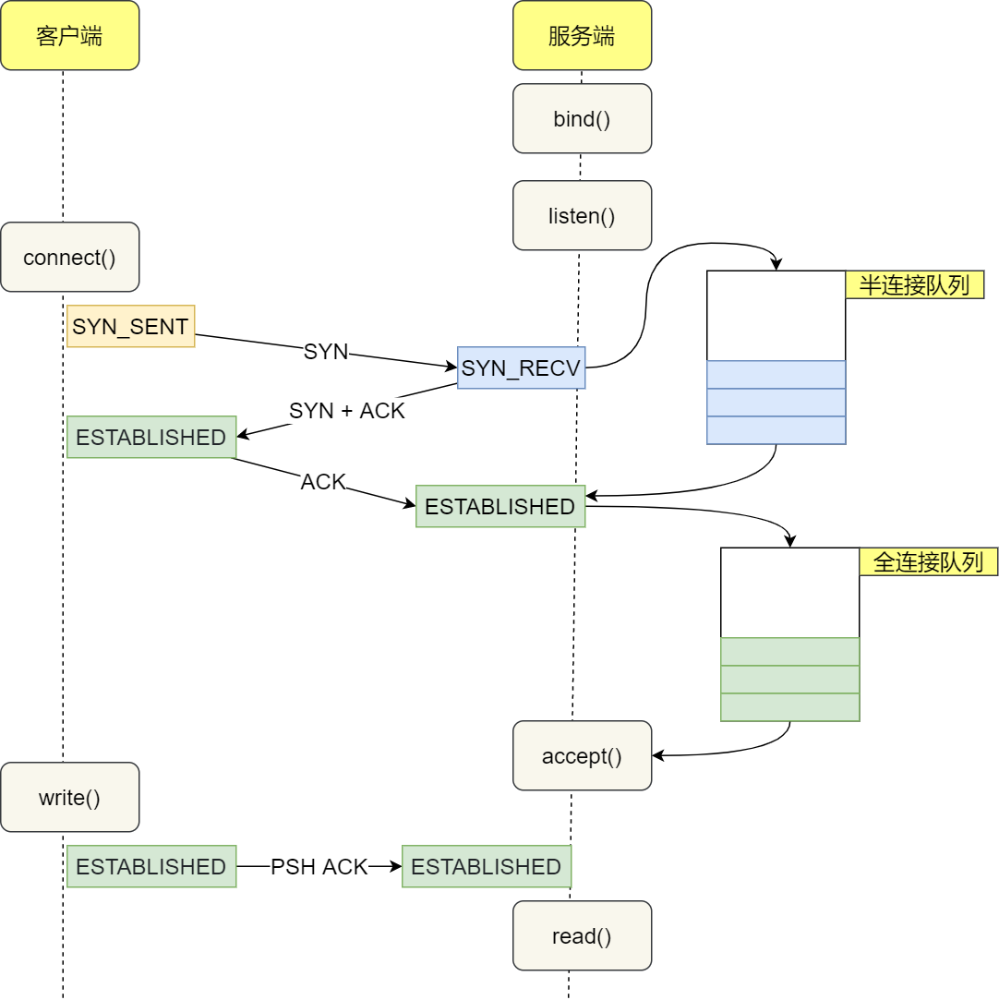


## 补充知识点

### 前端对DNS解析优化

一次DNS解析需要耗费 20-120ms，所以为了优化DNS，我们可以考虑两个方向：

1. 减少DNS请求次数
2. 缩短DNS解析时间`dns-prefetch`


#### 什么是dns-prefetch

`dns-prefetch`(**DNS预获取**)是前端网络性能优化的一种措施。它根据浏览器定义的规则，**提前解析**之后可能会用到的域名，使解析结果**缓存到系统缓存**中，缩短DNS解析时间，进而提高网站的访问速度。


#### 为什么要用dns-prefetch？

每当浏览器从（第三方）服务器发送一次请求时，都要先通过**DNS解析**将该跨域域名解析为 IP地址，然后浏览器才能发出请求。

如果某一时间内，有多个请求都发送给同一个服务器，那么DNS解析会多次并且重复触发。这样会导致整体的网页加载有延迟的情况。

我们知道，虽然DNS解析占用不了多大带宽，但是它会产生很高的延迟，尤其是对于移动网络会更为明显。

因此，为了减少DNS解析产生的延迟，我们可以通过`dns-prefetch`预解析技术有效地缩短DNS解析时间。

```html
<link rel="dns-prefetch" href="https://baidu.com/"> 
```


#### 原理

`dns-prefetch`就是在**将解析后的IP缓存在系统中**。


### UDP/TCP区别

TCP/IP 中有两个具有代表性的传输层协议，分别是 TCP 和 UDP。

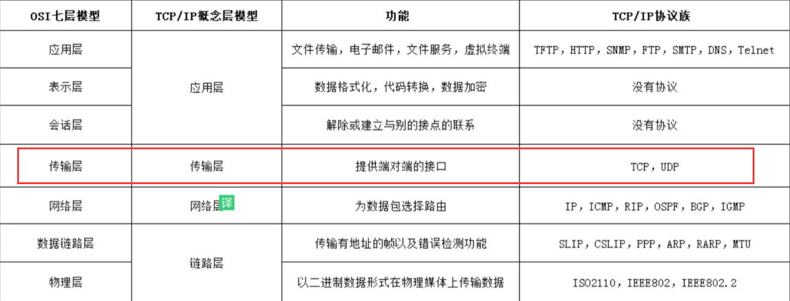


#### 介绍UDP

我们先简单了解一个TCP协议和UDP协议是什么，这里主要介绍UDP协议，上面有详细介绍TCP，这边不多叙述

**TCP协议**

TCP是面向连接的协议，也就是说，在收发数据前，必须和对方建立可靠的连接。 一个TCP连接必须要经过三次握手

**UDP协议**

- UDP是一个非连接的协议，传输数据之前源端和终端不建立连接， 当它想传送时就简单地去抓取来自应用程序的数据，并尽可能快地把它扔到网络上。
- 由于传输数据不建立连接，因此也就不需要维护连接状态，包括收发状态等， 因此一台服务机可同时向多个客户机传输相同的消息。


#### 区别

- 连接
  - TCP 是面向连接的传输层协议，传输数据前先要建立连接
  - UDP 是不需要连接，即刻传输数据
- 服务对象
  - TCP 是一对一的两点服务，即一条连接只有两个端点
  - UDP 支持一对一、一对多、多对多的交互通信
- 可靠性
  - TCP 是可靠交付数据的，数据可以无差错、不丢失、不重复、按需到达
  - UDP 是尽最大努力交付，不保证可靠交付数据
- 拥塞控制、流量控制
  - TCP 有拥塞控制和流量控制机制，保证数据传输的安全性。
  - UDP 则没有，即使网络非常拥堵了，也不会影响 UDP 的发送速率。
- 传输数据形式
  - TCP面向字节流，实际上是TCP把数据看成一连串无结构的字节流
  - UDP是面向报文的
- 首部开销
  - TCP首部开销20字节，如果使用了「选项」字段则会变长的。
  - UDP的首部开销小，只有8个字节，且固定不变


#### 应用场景

- TCP应用场景
  - 效率要求相对低，但对准确性要求相对高的场景。
  - 因为传输中需要对数据确认、重发、排序等操作，相比之下效率没有UDP高
  - 举几个例子：文件传输（准确高要求高、但是速度可以相对慢）、接受邮件、远程登录
- UDP应用场景
  - 效率要求相对高，对准确性要求相对低的场景。
  - 举几个例子：QQ聊天、在线视频、网络语音电话（即时通讯，速度要求高，但是出现偶尔断续不是太大问题，并且此处完全不可以使用重发机制）、广播通信（广播、多播）


### HTTP与HTTPS

#### HTTP

HTTP协议也就是超文本传输协议，是一种使用明文数据传输的网络协议。一直以来HTTP协议都是最主流的网页协议，HTTP协议被用于在Web浏览器和网站服务器之间传递信息，以明文方式发送内容，不提供任何方式的数据加密，如果攻击者截取了Web浏览器和网站服务器之间的传输报文，就可以直接读懂其中的信息。


#### HTTPS

为了解决HTTP协议的这一缺陷，需要使用另一种协议：安全套接字层超文本传输协议HTTPS，为了数据传输的安全，HTTPS在HTTP的基础上加入了**SSL/TLS协议**，SSL/TLS依靠证书来验证服务器的身份，并为浏览器和服务器之间的通信加密。HTTPS协议可以理解为HTTP协议的升级，就是在HTTP的基础上增加了数据加密。在数据进行传输之前，对数据进行加密，然后再发送到服务器。这样，就算数据被第三者所截获，但是由于数据是加密的，所以你的个人信息仍然是安全的。这就是HTTP和HTTPS的最大区别。


#### 图解

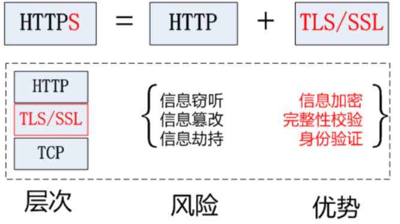

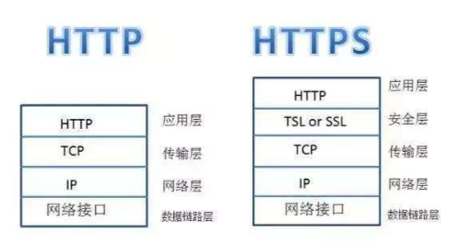


#### 区别

- HTTP 是超文本传输协议，信息是明文传输，HTTPS 则是具有安全性的 SSL 加密传输协议
- HTTP 和 HTTPS 使用的是完全不同的连接方式，默认端口号也不一样，前者是80，后者是443
- HTTP协议连接很简单，是无状态的；HTTPS协议是有SSL和HTTP协议构建的可进行加密传输、身份认证的网络协议，比HTTP更加安全
- HTTPS协议需要CA证书，费用较高；而HTTP协议不需要


## 概念解释

- ACK：此标志表示应答域有效，就是说前面所说的TCP应答号将会包含在TCP数据包中；有两个取值：0和1，为1的时候表示应答域有效，反之为0。TCP协议规定，只有ACK=1时有效，也规定连接建立后所有发送的报文的ACK必须为1。
- SYN：在连接建立时用来同步序号。当SYN=1而ACK=0时，表明这是一个连接请求报文。对方若同意建立连接，则应在响应报文中使SYN=1和ACK=1. 因此, SYN置1就表示这是一个连接请求或连接接受报文。
- FIN：即完，终结的意思， 用来释放一个连接。当 FIN = 1 时，表明此报文段的发送方的数据已经发送完毕，并要求释放连接。

- 报文：我们将位于**应用层**的信息分组称为报文。报文是网络中交换与传输的数据单元，也是网络传输的单元。报文包含了将要发送的完整的数据信息，其长短不需一致。报文在传输过程中会不断地封装成分组、包、帧来传输，封装的方式就是添加一些控制信息组成的首部，那些就是报文头

- 字节流：一切文件数据在存储时，都是以二进制数字的形式保存，都一个一个的字节，那么传输时一样如此。所以，字节流可以传输任意文件数据。在操作流的时候，我们要时刻明确，无论使用什么样的流对象，底层传输的始终为二进制数据

- 拥塞控制

  - 拥塞控制就是防止过多的数据注入到网络中，这样可以使网络中的路由器或链路不致过载
  - 解决方法：[流量控制和拥塞控制](https://blog.csdn.net/weixin_39003229/article/details/81842940)

- 流量控制

  - 如果发送方把数据发送得过快，接收方可能会来不及接收，这就会造成数据的丢失。
  - TCP的流量控制是利用滑动窗口机制实现的，接收方在返回的数据中会包含自己的接收窗口的大小，以控制发送方的数据发送
  - 流量控制是为了预防拥塞

- TLS/SSL 的功能实现主要依赖于三类基本算法

  - 散列函数 Hash、对称加密和非对称加密
  - 其利用非对称加密实现身份认证和密钥协商，对称加密算法采用协商的密钥对数据加密，基于散列函数验证信息的完整性
  - 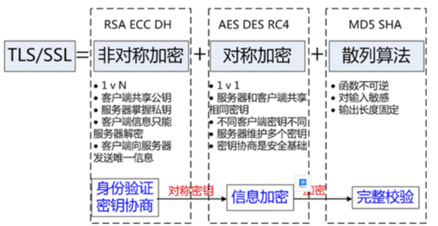

  


## 参考链接

[在浏览器输入 URL 回车之后发生了什么（超详细版）](https://juejin.cn/post/6844903922084085773?searchId=20230802223229AA8C4FCC51FB3AE4FBA6)

[深入浅出TCP三次握手 （多图详解）_三次握手详细过程](https://blog.csdn.net/weixin_45629285/article/details/121195202)

[深入浅出TCP四次挥手 （多图详解）](https://juejin.cn/post/7063829623024386056)

[彻底弄懂HTTP缓存机制及原理](https://www.cnblogs.com/chenqf/p/6386163.html)

[HTTP 的发展 - HTTP | MDN (mozilla.org)](https://developer.mozilla.org/zh-CN/docs/Web/HTTP/Basics_of_HTTP/Evolution_of_HTTP)

[URL 简介 - 网址的组成部分 - 《阮一峰 HTML 语言教程》](https://www.bookstack.cn/read/html-tutorial/spilt.2.docs-url.md)

[SSL/TLS四次握手过程是怎么样的？](https://blog.csdn.net/Mind_programmonkey/article/details/118380707)
