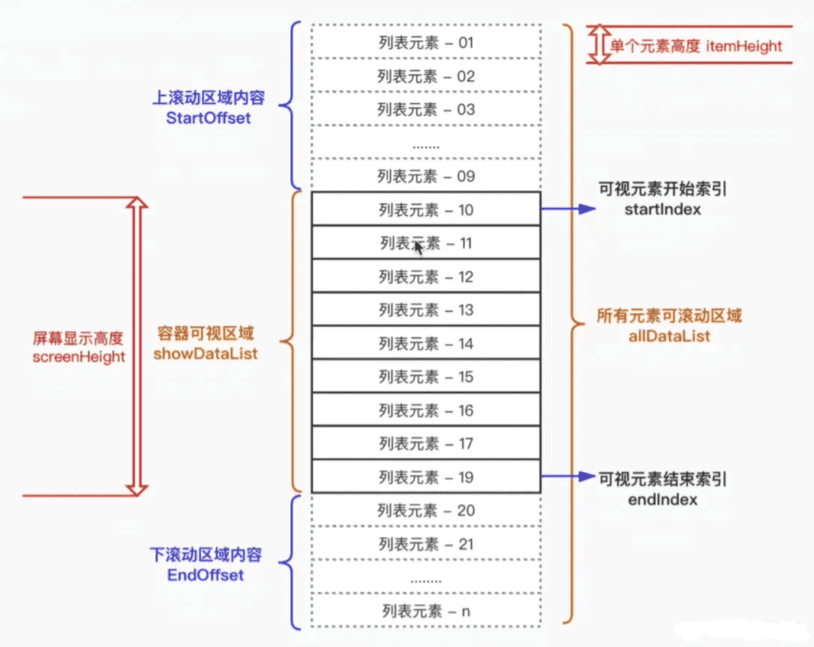

##  for 循环100000次

最直接的方式就是直接渲染出来，但是这样的做法肯定是不可取的，因为一次性渲染出`10w`个节点，是非常耗时间的

```js
const renderList = async () => {
    console.time('列表时间')
    const list = await getList()
    list.forEach(item => {
        const div = document.createElement('div')
        div.className = 'sunshine'
        div.innerHTML = `<span>${item.text}</span>`
        container.appendChild(div)
    })
    console.timeEnd('列表时间')
}
renderList()
```


## setTimeout分页渲染(时间分片)

这个方法就是，把`10w`按照每页数量`limit`分成总共`Math.ceil(total / limit)`页，然后利用`setTimeout`，每次渲染1页数据，这样的话，渲染出首页数据的时间大大缩减了

```js
const renderList = async () => {
    console.time('列表时间')
    const list = await getList()
    console.log(list)
    const total = list.length
    const page = 0
    const limit = 200
    const totalPage = Math.ceil(total / limit)

    const render = (page) => {
        if (page >= totalPage) return
        setTimeout(() => {
            for (let i = page * limit; i < page * limit + limit; i++) {
                const item = list[i]
                const div = document.createElement('div')
                div.className = 'sunshine'
                div.innerHTML = `<span>${item.text}</span>`
                container.appendChild(div)
            }
            render(page + 1)
        }, 0)
    }
    render(page)
    console.timeEnd('列表时间')
}
```


## requestAnimationFrame

requestAnimationFrame 和 setTimeout 的区别：

- `requestAnimationFrame`的调用频率通常为每秒60次。这意味着我们可以在**每次重绘之前更新**动画的状态，并确保动画流畅运行，而不会对浏览器的性能造成影响。
- `setInterval`与`setTimeout`它可以让我们在指定的时间间隔内重复执行一个操作，**不考虑浏览器的重绘**，而是按照**指定的时间间隔**执行回调函数，可能会被延迟执行，从而影响动画的流畅度。


使用`requestAnimationFrame`代替`setTimeout`，减少了`重排`的次数，极大提高了性能，建议大家在渲染方面多使用`requestAnimationFrame`

`requestAnimationFrame`不是定时器！不是定时器！！！只是一个用作定时器的帧函数

```js
const renderList = async () => {
    console.time('列表时间')
    const list = await getList()
    console.log(list)
    const total = list.length
    const page = 0
    const limit = 200
    const totalPage = Math.ceil(total / limit)

    const render = (page) => {
        if (page >= totalPage) return
        // 使用requestAnimationFrame代替setTimeout
        requestAnimationFrame(() => {
            for (let i = page * limit; i < page * limit + limit; i++) {
                const item = list[i]
                const div = document.createElement('div')
                div.className = 'sunshine'
                div.innerHTML = `<span>${item.text}</span>`
                container.appendChild(div)
            }
            render(page + 1)
        })
    }
    render(page)
    console.timeEnd('列表时间')
}
```


## 文档碎片 + requestAnimationFrame

先解释一下什么是 DocumentFragment ，文献引用自[MDN](https://link.juejin.cn/?target=https%3A%2F%2Fdeveloper.mozilla.org%2Fzh-CN%2Fdocs%2FWeb%2FAPI%2FDocumentFragment)

```
DocumentFragment，文档片段接口，表示一个没有父级文件的最小文档对象。它被作为一个轻量版的`Document`使用，用于存储已排好版的或尚未打理好格式的XML片段。最大的区别是因为`DocumentFragment`不是真实DOM树的一部分，它的变化不会触发DOM树的（重新渲染) ，且不会导致性能等问题。可以使用`document.createDocumentFragment`方法或者构造函数来创建一个空的`DocumentFragment
```


`文档碎片`的好处

- 之前都是每次创建一个`div`标签就`appendChild`一次，但是有了`文档碎片`可以先把1页的`div`标签先放进`文档碎片`中，然后一次性`appendChild`到`container`中，这样减少了`appendChild`的次数，极大提高了性能
- 页面只会渲染`文档碎片`包裹着的元素，而不会渲染`文档碎片`

```js
const renderList = async () => {
    console.time('列表时间')
    const list = await getList()
    console.log(list)
    const total = list.length
    const page = 0
    const limit = 200
    const totalPage = Math.ceil(total / limit)

    const render = (page) => {
        if (page >= totalPage) return
        requestAnimationFrame(() => {
            // 创建一个文档碎片
            const fragment = document.createDocumentFragment()
            for (let i = page * limit; i < page * limit + limit; i++) {
                const item = list[i]
                const div = document.createElement('div')
                div.className = 'sunshine'
                div.innerHTML = `<span>${item.text}</span>`
                // 先塞进文档碎片
                fragment.appendChild(div)
            }
            // 一次性appendChild
            container.appendChild(fragment)
            render(page + 1)
        })
    }
    render(page)
    console.timeEnd('列表时间')
}
```


## 懒加载

一句话解释：最开始不渲染所有数据，只展示视图上可见的数据，当滚动到页面底部时，加载更多数据

- 位置计算 + 滚动事件 (Scroll) + DataSet API

  - `clientTop`，`offsetTop`，`clientHeight` 以及 `scrollTop` 各种关于图片的高度作比对

  - 监听 `window.scroll` 事件

  - ```js
    // 控制图片懒加载
    
    // 首先设置一个临时 Data 属性 data-src，控制加载时使用 src 代替 data-src，可利用 DataSet API 实现
     img.src = img.datset.src   
    ```

- getBoundingClientRect API + Scroll with Throttle + DataSet API

  - 如何判断图片出现在了当前视口？
  - `Element.getBoundingClientRect()` 方法返回元素的大小及其相对于视口的位置。`img.getBoundingClientRect().top < document.documentElement.clientHeight;`

- IntersectionObserver api

  - 上一个方案使用的方法是: `window.scroll` 监听 `Element.getBoundingClientRect()` 并使用 `_.throttle` 节流
  - 浏览器出了一个三合一事件: `IntersectionObserver` API，一个能够监听元素是否到了当前视口的事件，一步到位！


## 虚拟列表

### 概念

`虚拟列表`其实是按需显示的一种实现，即只对`可见区域`进行渲染，对`非可见区域`中的数据不渲染或部分渲染的技术，从而达到极高的渲染性能。

假设有1万条记录需要同时渲染，我们屏幕的`可见区域`的高度为`500px`,而列表项的高度为`50px`，则此时我们在屏幕中最多只能看到10个列表项，那么在首次渲染的时候，我们只需加载10条即可。为了防止`滑动过快`导致的`白屏`现象，我们可以使用`预加载`的方式多加载一些数据出来。




### 实现

实现屏加载的时候，只加载`可视区域`内需要的列表项，当滚动发生时，动态通过计算获得`可视区域`内的列表项，并将`非可视区域`内存在的列表项删除。

- 计算当前`可视区域`起始数据索引(`startIndex`)
- 计算当前`可视区域`结束数据索引(`endIndex`)
- 计算当前`可视区域的`数据，并渲染到页面中
- 计算`startIndex`对应的数据在整个列表中的偏移位置`startOffset`并设置到列表上


由于只是对`可视区域`内的列表项进行渲染，所以为了保持列表容器的高度并可正常的触发滚动，将Html结构设计成如下结构：

```html
<div class="infinite-list-container">
    <div class="infinite-list-phantom"></div>
    <div class="infinite-list">
      <!-- item-1 -->
      <!-- item-2 -->
      <!-- ...... -->
      <!-- item-n -->
    </div>
</div>
```

- `infinite-list-container` 为`可视区域`的容器
- `infinite-list-phantom` 为容器内的占位，高度为总列表高度，用于形成滚动条
- `infinite-list` 为列表项的`渲染区域`

接着，监听`infinite-list-container`的`scroll`事件，获取滚动位置`scrollTop`

- 假定`可视区域`高度固定，称之为`screenHeight`
- 假定`列表每项`高度固定，称之为`itemSize`
- 假定`列表数据`称之为`listData`
- 假定`当前滚动位置`称之为`scrollTop`

则可推算出：

- 列表总高度`listHeight` = listData.length * itemSize
- 可显示的列表项数`visibleCount` = Math.ceil(screenHeight / itemSize)
- 数据的起始索引`startIndex` = Math.floor(scrollTop / itemSize)
- 数据的结束索引`endIndex` = startIndex + visibleCount
- 列表显示数据为`visibleData` = listData.slice(startIndex,endIndex)

当滚动后，由于`渲染区域`相对于`可视区域`已经发生了偏移，此时我需要获取一个偏移量`startOffset`，通过样式控制将`渲染区域`偏移至`可视区域`中。

- 偏移量`startOffset` = scrollTop - (scrollTop % itemSize)


### 简易代码

最终的`简易代码`如下：

```js
<template>
  <div ref="list" class="infinite-list-container" @scroll="scrollEvent($event)">
    <div class="infinite-list-phantom" :style="{ height: listHeight + 'px' }"></div>
    <div class="infinite-list" :style="{ transform: getTransform }">
      <div ref="items"
        class="infinite-list-item"
        v-for="item in visibleData"
        :key="item.id"
        :style="{ height: itemSize + 'px',lineHeight: itemSize + 'px' }"
      >{{ item.value }}</div>
    </div>
  </div>
</template>

<script>
export default {
  name:'VirtualList',
  props: {
    //所有列表数据
    listData:{
      type:Array,
      default:()=>[]
    },
    //每项高度
    itemSize: {
      type: Number,
      default:200
    }
  },
  computed:{
    //列表总高度
    listHeight(){
      return this.listData.length * this.itemSize;
    },
    //可显示的列表项数
    visibleCount(){
      return Math.ceil(this.screenHeight / this.itemSize)
    },
    //偏移量对应的style
    getTransform(){
      return `translate3d(0,${this.startOffset}px,0)`;
    },
    //获取真实显示列表数据
    visibleData(){
      return this.listData.slice(this.start, Math.min(this.end,this.listData.length));
    }
  },
  mounted() {
    this.screenHeight = this.$el.clientHeight;
    this.start = 0;
    this.end = this.start + this.visibleCount;
  },
  data() {
    return {
      //可视区域高度
      screenHeight:0,
      //偏移量
      startOffset:0,
      //起始索引
      start:0,
      //结束索引
      end:null,
    };
  },
  methods: {
    scrollEvent() {
      //当前滚动位置
      let scrollTop = this.$refs.list.scrollTop;
      //此时的开始索引
      this.start = Math.floor(scrollTop / this.itemSize);
      //此时的结束索引
      this.end = this.start + this.visibleCount;
      //此时的偏移量
      this.startOffset = scrollTop - (scrollTop % this.itemSize);
    }
  }
};          
</script>
```


## 多大量数据进行处理 — Web Worker

因为js是单线程运行的，在遇到一些需要处理大量数据的js时，可能会阻塞页面的加载，造成页面的假死。

在HTML5的新规范中，实现了 Web Worker 来引入 js 的 “多线程” 技术, 可以让我们在页面主运行的 js 线程中，加载运行另外单独的一个或者多个 js 线程

**一句话： Web Worker专门处理复杂计算的，从此让前端拥有后端的计算能力**


## 参考链接

[后端一次给你10万条数据，如何优雅展示 - 掘金 (juejin.cn)](https://juejin.cn/post/7031923575044964389?searchId=202308101555312B42A22943F38A586AE6)

[高性能渲染十万条数据(虚拟列表) - 掘金 (juejin.cn)](https://juejin.cn/post/6844903982742110216?searchId=202308101555312B42A22943F38A586AE6)