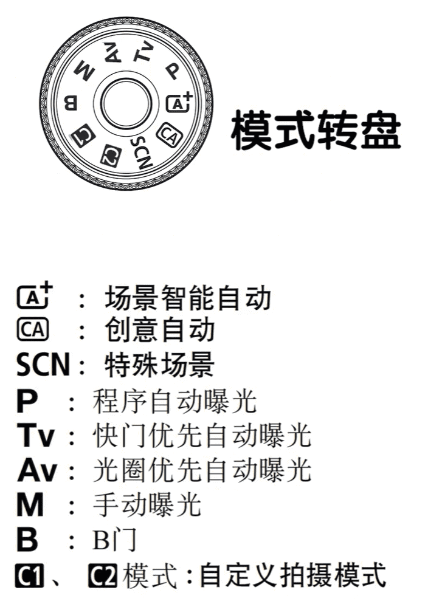
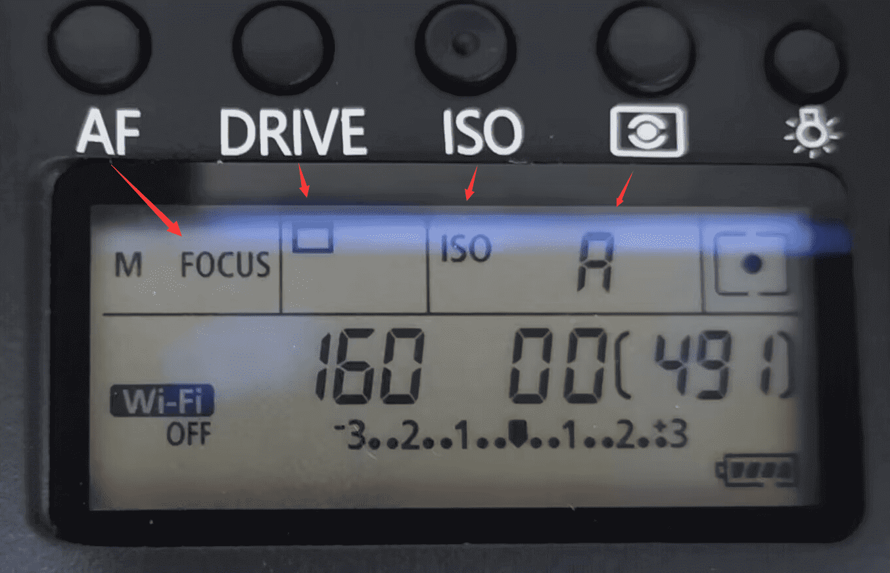
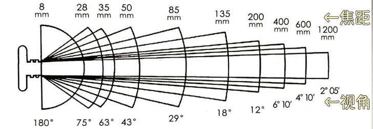
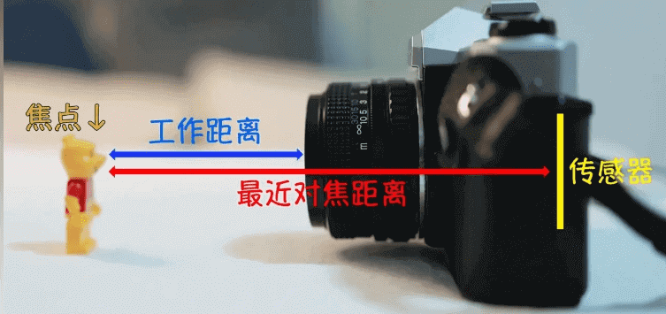
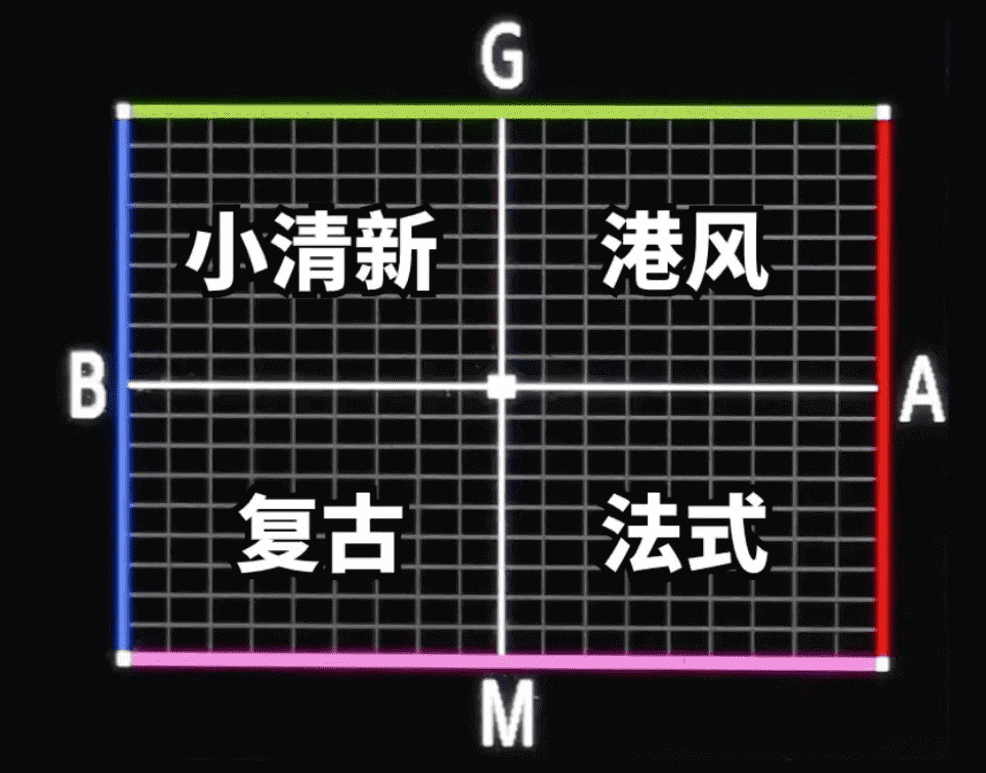
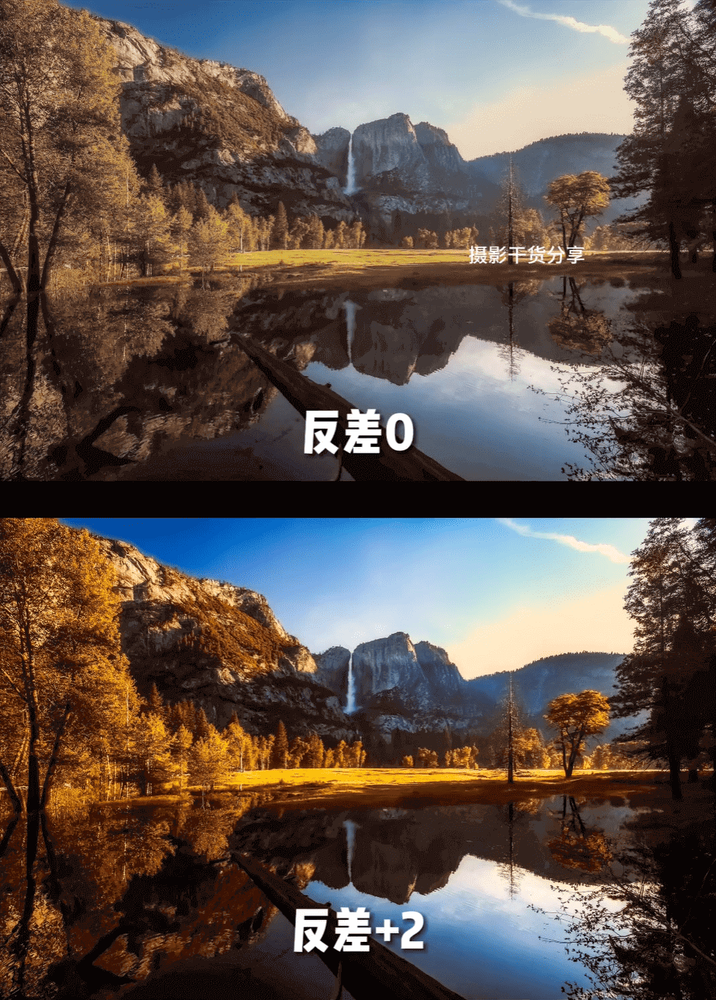

## 了解相机 - 佳能6D

全画幅相机，EF卡口

- 安装镜头的时候，红点对红点扭一下就好了

### 了解相机按键功能

————

- MENU：菜单
- INFO：显示相机参数

————

- 取景器旁边有一个小波轮，叫屈光度调节

————

- 最前面是相机的快门按键，半按快门是相机对焦，按实就是拍照
- 然后快门后面是上波轮，在实时取景时，可以用来**调节快门数值**

————

- AF：对焦模式（新手推荐单次自动对焦）
  - 对焦模式要看镜头的情况
  - ONE SHOT：单次自动对焦，就是按一次快门对一次焦
  - AI FOCUS：人工智能自动对焦，介于拍摄物品是静态和动态之前切换，这种情况
  - AL SERVO：人工智能伺服自动对焦，常用语拍摄物品一直不停的在运动
- DRIVE：驱动模式（就是我们所说的单拍或连拍）
- ISO：感光度调节（新手推荐Auto）
- 下一个是测光按键（新手推荐评价测光）
- 在下一个就是查看参数的灯

————

- AF-ON：**快捷对焦，手动对焦的时候使用**
- *：曝光锁定按键，可以锁定曝光参数
- *旁边：自动对焦的选择

————

- 屏幕上方：取景器切换按键，波动切换拍照视频模式，视频情况下按一下中间开始，再按一下结束
- 放大镜：照片回放放大的功能
- 下面是照片回放的按键
- Q：调节屏幕参数
- 波轮：**调节光圈数值**
- 上下左右按键
- 垃圾桶：删除照片
- LOCK：锁定按键，锁定之后无法调节参数

————

- 前箭头旁边的按钮：箭头拆卸的时候需要按住

### 相机上部屏幕参数

上部屏幕显示的参数在住屏幕中都可以看到，上面主要显示的一些重要的方便查看

- 491：代表的是你的内存，还可以拍多少照片

- 160：代表快门
- 00：代表光圈
- 下面的代表曝光标尺

### 了解项目主屏幕参数

我们分为五层，一层一层来说（从左到右）

- 第一层：M档位、快门、光圈、ISO、对焦
- 第二层：曝光标尺、wifi
- 第三次：照片风格就是图像效果的设置、白平衡、自动亮点优化、
- 第四层：对焦模式、自动对焦点选择、连拍、点测光、图像画质设置
- 第五层：电池、容量什么的

## 镜头 - 28-135

全画幅镜头

- AF/MF：自动对焦 / 手动对焦
- stabilizer：表示防抖，I是打开防抖

- 28-135代表焦段范围
  - 数字越小焦段越广，拍的越广
  - 数字越大焦段越窄，拍的越远
- 1:3.5-5.6：代表最大光圈是3.5-5.6，当使用28的时候最大光圈可以开到3.5，使用135的时候最大光圈可以开到5.6
- $72mm：代表你的镜头直径
- 0.5m/1.6ft：最近对焦距离 米/英尺

## 了解相关术语

### 曝光三要素

曝光三要素：光圈、快门、ISO（感光度）

- 当我们想要拍一个人的时候，我们想要虚化背景，就会将光圈开大（数值变小），但是光圈大意味着进光量多，那么就会过度曝光，这个时候我们就需要提高拍摄速度来让进光亮减少，就是提高我们快门的速度，也可以减少感光度

### 光圈

光圈：由数个叶片组成，是镜头内一个可调节大小的、控制镜头通光量的构件。

光圈数值用f来表示，计算公式为：光圈数值f=镜头焦距/镜头有效通光口直径

所得结果是一个倒数，所l以

- 数字越小，代表光圈口径越大，那么通光量就越多
- 数字越大，代表光圈口径越小，那么通光量就越少

光圈的影响：

- 通光量：光圈越大，对快门速度、感光度的要求越低。
- 背景虚化：光圈越大，背景虚化效果越好。

- 当你想突出某一个物体的时候，就可以使用大光圈，就是数字小。

- 当你想拍摄一个前后一致的时候（如大合照），可以使用小光圈

### 快门

- 快门速度就是快门帘打开的速度。**快门控制曝光持续的时间**

- 从打开到关闭，用了2s，那么它的快门时间就是2s

- 接收的时间越长，接收的光线就越多，但由于在持续曝光，很容易手抖而让画面模糊（可以使用安全快门来维持画面清晰）
- 安全快门一般是 1 / 焦距。如使用85mm，镜头时，安全快门就是 1/85，或者 1/85s以上画面才不容易糊
- 在相机上是数字显示，
- 一般我们抓拍运动物体的时候用高速快门，当我们拍运动轨迹的时候可以用慢速快门
- 快门速度越快，进光量越少（对于佳能6D相机就是屏幕的数组越大，不带秒单位的）
- 模特摆pose，一般设置1/200即可，人物走动一般设置1/500以上，跑动设置1/1000以上 

### ISO

- ISO，感光度，就是对光线的灵敏度，
- 感光度越高，对光越敏感，照片的曝光度就会越多，就是画面更亮的，但带来的问题就是照片的成像会有较多的噪点

- ISO数值越大，进光量越多，照片越亮，画质越差
- ISO数值越小，进光量越少，照片越暗， 画质越好

为什么光圈能提高曝光量，还要用感光度来提高曝光呢？

因为很多镜头的最大光圈也不是很大，就算开到最大依然画面曝光不足，所以需要提高感光度

- 在光线充足的户外，一般用100-200即可
- 如果是阴雨天或者室内，ISO就要提高到400-800
- 如果是夜晚或光线差的环境，就需要不断提高ISO来确保画面曝光正常

### 焦距

焦距：镜组的光学中心到感光元件的距离，主要的影响是视角，焦距越小，视角越宽广，单位是毫米(mm)，根据焦距可分为：

- 超广角镜头：焦距一般小于24mm，视角宽广，适合拍摄风光建筑，能营造出强烈的视觉冲击力，其中焦距小于16mm的镜头为鱼眼镜头，视角极其宽广和夸张。
- 广角镜头︰焦距在24-35mm之间，视角相对超广角小，但也能拍出大场景，其中35mm是很经典的焦距，风光、人文、人像、建筑、室内外等都合适。
- 标准镜头∶焦距在43mm左右，视角和人眼所见差不多，常用于拍摄人像和扫街，其中50mm比较常见，进可攻退可守。
- 中焦镜头︰焦距在75-135mm之间，视角不大，对空间有一定压缩感，适合柏摄局部特写，常用于相人像。
- 长焦镜头︰焦距在135-300mm，对空间有较强压缩感,常用于相摄远距离的主体，例如拍摄舞台、运动会等。
- 超长焦镜头:焦距在300mml以上，拍摄更远距离的主体，例如拍摄飞机、目亮、野生动物等。

### 实际焦距和等效焦距

镜头上所标的焦距都是相对于**全画幅而言的实际焦距**

一个焦距为50mm的镜头，安装在全画幅相机上，所得的取景视角就是50mm焦距的实际视角，如果安装在其他画幅相机上，所得视角会有所不同，像裁剪过一样，这种变化衍生出等效焦距这个概念。

例如50mm焦距，安装在半画幅相机上，所得取景视角相当于75mm焦距在全画幅相机上的实际视角，所L以说50mm焦距在半画幅相机上的等效焦距是75mm。

这里有个新概念转化系数，一般半画幅相机的转化系数为1.5，镜头实际焦距乘以1.5即可得出它在半画幅相机上的等效焦距，其他画幅l以此类椎(M4/3画幅转化系数为2，计算公式为全画幅对角线长度/其他画幅对角线长度)。

### 最近对焦距离

镜头能够合焦(对上焦)的最短拍摄距离，即从焦点到感光元件平面的距离，并不是镜头最前面的镜片到对焦点的距离(这个距离叫工作距离)。

### 测光

测光就是相机会根据检测到的光线明暗情况来设计机内参数，让我们可以排出一张明暗合适的照片

常见的测光模式有四种，他们的区别就是**相机测光面积大小的不同**

- 评价测光：评价测光会将画面评分成若千区域，然后对画面的各个区域进行测光，去一个平均值来拍照。适合拍**摄光线比较均匀**的场景，比如风景
- 中心重点平均测光：在评价测光的基础上会更加注重画面中央的曝光情况，适合拍摄中心点构图中**主体和环境都需要兼顾**的场景，比如人像
- 局部测光：在点测光的基础上对画面局部进行测光，测光面积比点测光要大一点
- 点测光：测光面积最小，因此测光精度也更高，相机会对中心原点周围进行测光。当我们中心发生变化测光就会变化，比如拍摄**逆光人像**（需要将测光点对准主体）可以使用

### 白平衡

- 白平衡其实就是调节颜色，用来还原物体本身的颜色
- 手动：K值越高，画面会添加更多的橙色/黄色，就是暖色。K值越低，会添加更多的蓝色，就是冷色
- 相机通过调节白平衡来接近更真实的色彩

### 白平衡偏移

- 蓝+绿 适合拍摄文艺小清新
- 红+绿 适合拍摄灯红酒绿的港风
- 洋红+蓝 适合拍摄色彩明艳的昭和风
- 洋红+红 适合拍摄暖色的复古风

### 照片风格

- 锐度：画面清晰度，强度和细度越高，照片细节和纹理就越清晰，就是照片的细节

  - 皮肤好可以调高一点突出细节，皮肤有瑕疵可以降低起到磨皮的作用

- 反差：控制着照片的明暗对比，增加反差，照片对比更明显，视觉冲击力更强

  

- 饱和度：控制色彩鲜艳程度，饱和度越高色彩越鲜艳，饱和度低画面更灰

- 色调：控制画面整体色彩偏向，色调向左肤色偏红润，色调向右画面偏绿（适合风景）

