## 邂逅Nest

我们通过不同的 url 来访问后端接口：

```
/user/create
/user/list
/book/create
/book/list
```

不同的 url 是不同的路由。

这些路由在 Controller 里声明：

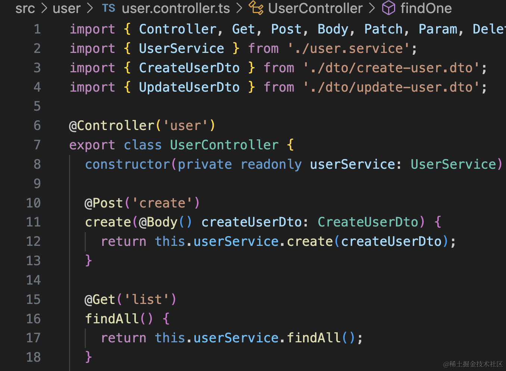

在 class 上和它方法的方法上加上 @Controller、@Get、@Post 的装饰器就可以了。

controller 的方法叫做 handler，是处理路由的。


## **controller** 数据获取

post 的请求体，get 的请求参数，都可以通过装饰来取：

通过 @Param 取 url 中的参数，比如 /user/111 里的 111

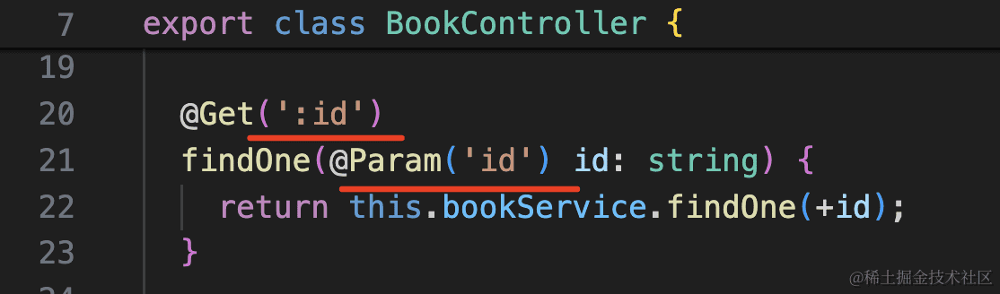

通过 @Query 来取 url 中的 query 参数，比如 /user/xx?id=222 里的 222

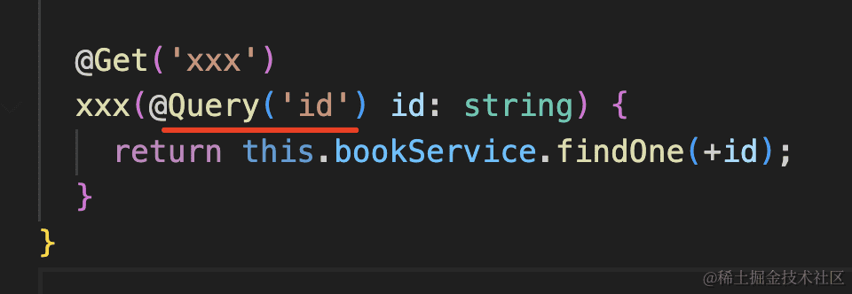

通过 @Body 取 /book/create 的请求体内容：

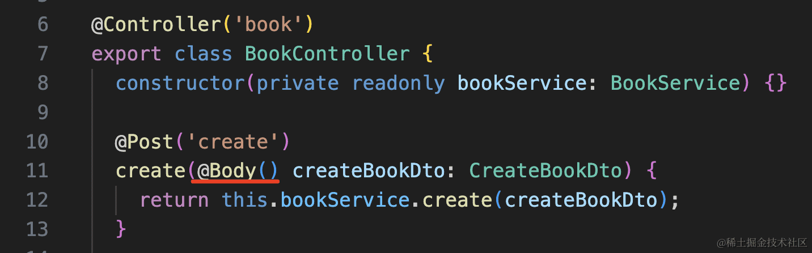


请求体一般会传递 json，比如 { username: 'xxx', password: 'xxx' }

我们会通过 dto （data transfer object）来接收。


传递到 handler 的就已经是 dto 对象了。

也就是说 **controller 是处理路由和解析请求参数的**。

请求参数解析出来了，下一步就是做业务逻辑的处理了，这些东西不写在 controller 里，而是放在 service 里。


## service 业务逻辑

**service 里做业务逻辑的具体实现，比如操作数据库等**


## Module 模块

### 介绍

/book/list、/book/create 接口是在另一个 BookController 里，它的业务逻辑实现也是在 BookService 里。

很明显，UserController 和 UserService 是一块的，BookController 和 BookService 是一块的。

所以，Nest 有了模块的划分，每个模块里都包含 controller 和 service：

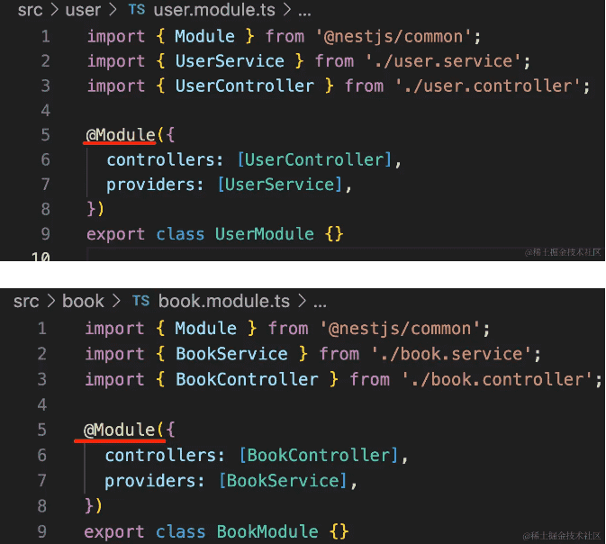

通过 @Module 声明模块，它包含 controllers 和 providers。


### import

### controllers

导入controller文件

 @Module 声明模块，其中 controllers 是控制器，只能被注入。


### providers

providers 里可以被注入，也可以注入别的对象，比如AppService。

:::info 思考

为啥不是 services 而是 providers 呢？

因为 Nest 实现了一套依赖注入机制，叫做 IoC（Inverse of Control 反转控制）。

简单说就是你只需要声明依赖了啥就行，不需要手动去 new 依赖，Nest 的 IoC 容器会自动给你创建并注入依赖。

比如这个 UserController 依赖了 JwtService，那只需要通过 @Inject 声明依赖，然后就可以在方法里用了：

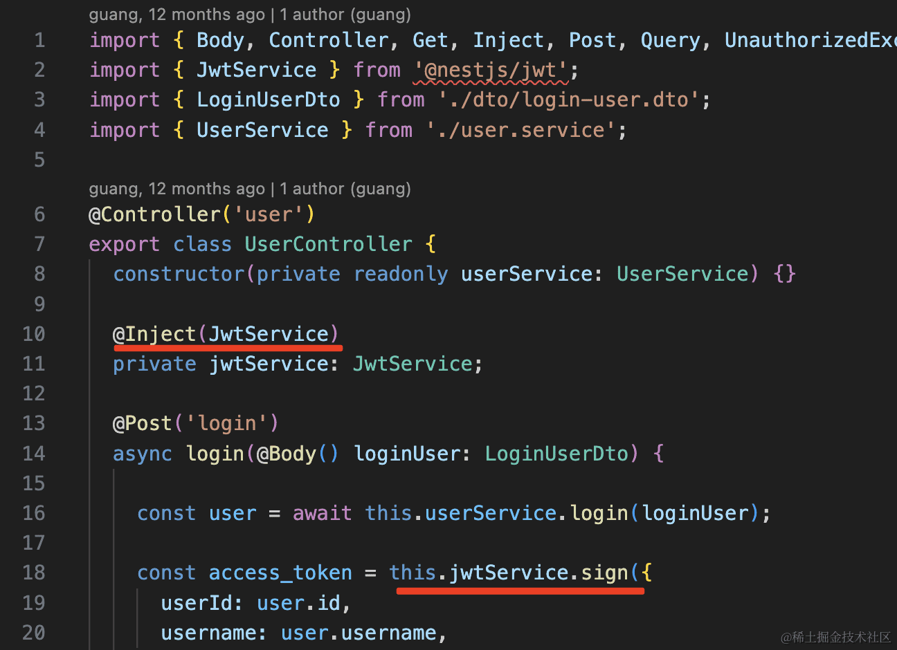

运行的时候会自动查找这个 JwtServcie 的实例来注入。

在 @Module 里的 providers 数组里，就是声明要往 IoC 容器里提供的对象，所以这里叫做 providers。

:::


provider 有很多种写法，默认的`providers: [BookService]` 只是一种简化的写法，还可以直接 useValue 创建，通过 useFactory 创建等。

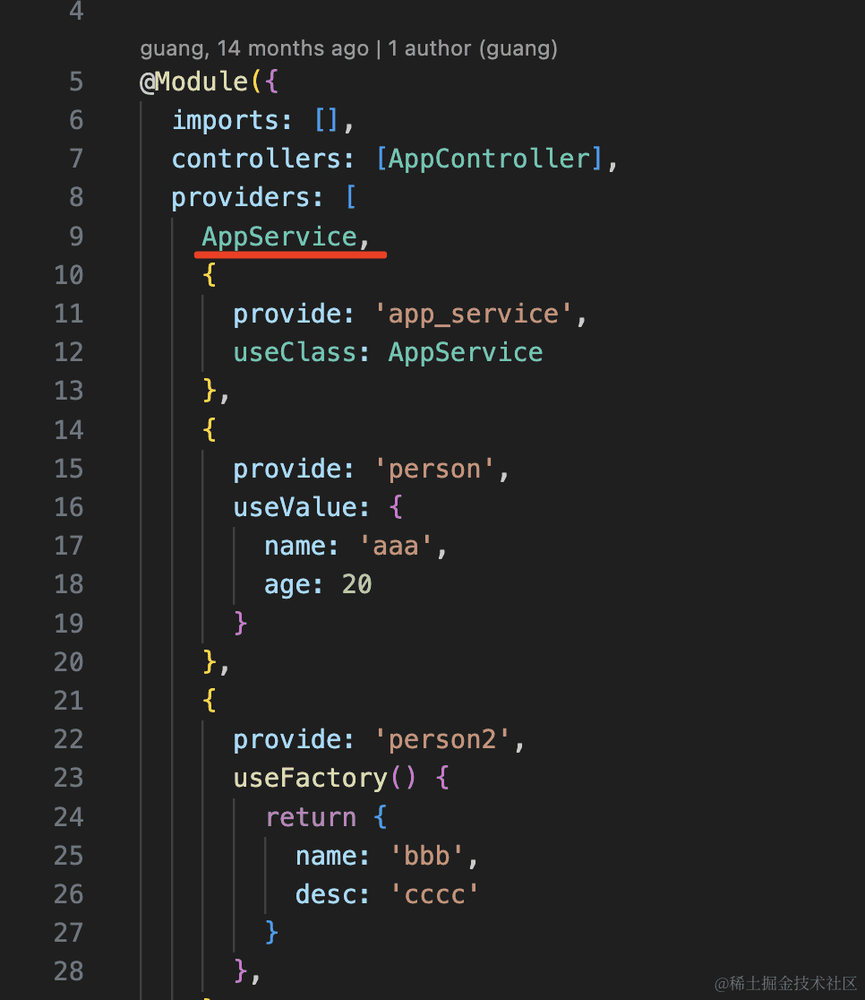


刚才提到了 IoC 会自动从容器中查找实例来注入，注入的方式有两种：属性注入和构造器注入。

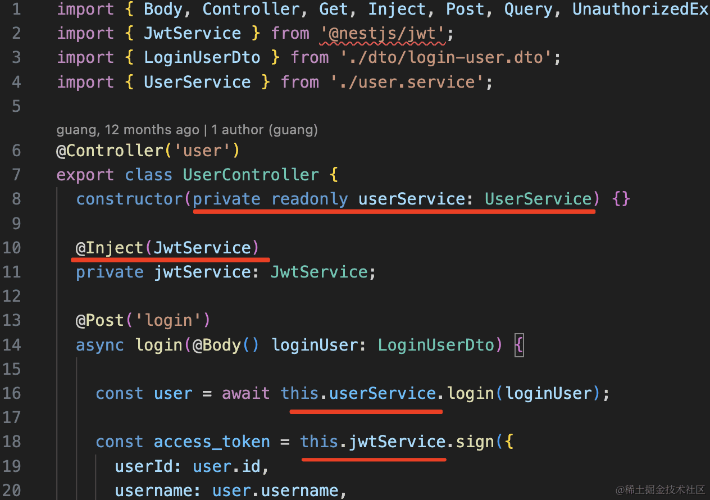


这种写在构造器里的依赖，就是构造器注入。@Inject 写在属性上的依赖，就是属性注入。效果是一样的，只是注入的时机不同。更推荐构造器注入。

:::info 对比

1. **构造函数注入（Constructor Injection）**：`constructor(private readonly userService: UserService)`
   - 这种方式通过构造函数参数直接将依赖注入到类中。
   - `userService` 是 `UserService` 的一个实例，NestJS 会自动解析并注入该依赖。
   - 使用 `private readonly` 修饰符，可以确保该属性在类的实例中是只读的，且可以直接访问。
2. **属性注入（Property Injection）**：`private jwtService: JwtService;`
   - 这种方式使用 `@Inject()` 装饰器显式地指定要注入的依赖。
   - `jwtService` 是一个属性，而不是构造函数参数。
   - 通常在这种方式中，您需要使用 `@Inject()` 来指明要注入的服务类型，这在某些情况下非常有用，比如当依赖的类型无法直接通过类型推断时。

**总结**

- **构造函数注入**更常用，适合大多数情况，因为它可以确保依赖在类的实例化时就可用。
- **属性注入**在特定情况下（如循环依赖或需要不同的注入方式时）更为灵活。

通常推荐使用构造函数注入，因为它更符合 NestJS 的设计理念和最佳实践。

:::


### exports

当我们在项目中需要使用到其他模块的service中，其他模块需要将他的service导出，我们才能使用


## 文件分类

每个模块都会包含 controller、service、module、dto、entities 这些东西：

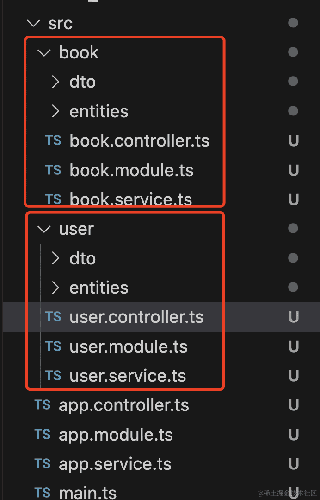

- controller 是处理路由，解析请求参数的。
- service 是处理业务逻辑的，比如操作数据库。
- dto 是封装请求参数的。
- entities 是封装对应数据库表的实体的。(用prisma也不需要这个了)


## 依赖注入

**为什么 Controller 是单独的装饰器呢？**

**因为 Service 是可以被注入也是可以注入到别的对象的，所以用 @Injectable 声明。**

**而 Controller 只需要被注入，所以 nest 单独给它加了 @Controller 的装饰器。**

- `@Gontroller()`：在controller 声明了 @Controller，代表这个 class 可以被注入，nest 也会把它放到 IoC 容器里
  - 在controller中注入依赖有两种方式：构造器参数(`constructor(private appService: AppService)`)和属性声明
    (`@Inject(AppService)/private appService: AppService`)
- `@Inject()`：
- `@Injectable()`：在service中声明，代表这个 class 可注入，那么 nest 就会把它的对象放到 IOC 容器里
- 


## Nest执行

nest 应用跑起来后，会从 AppModule 开始解析，初始化 IoC 容器，加载所有的 service 到容器里，然后解析 controller 里的路由，接下来就可以接收请求了。

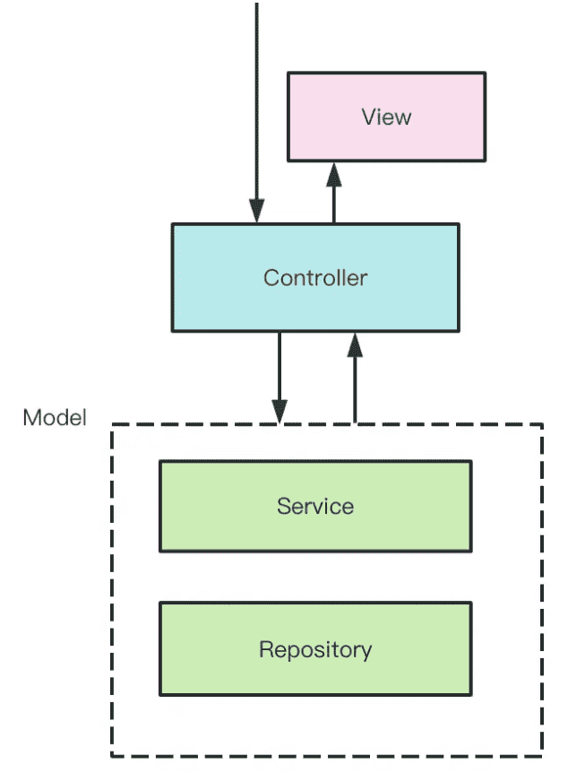


其实这种架构叫做 MVC 模式，也就是 model、view、controller。

controller 接收请求参数，交给 model 处理（model 就是处理 service 业务逻辑，处理 repository 数据库访问），然后返回 view，也就是响应。

应用中会有很多 controller、service，那如果是跨多个 controller 的逻辑呢？

这种在 Nest 提供了 AOP （Aspect Oriented Programming 面向切面编程）的机制

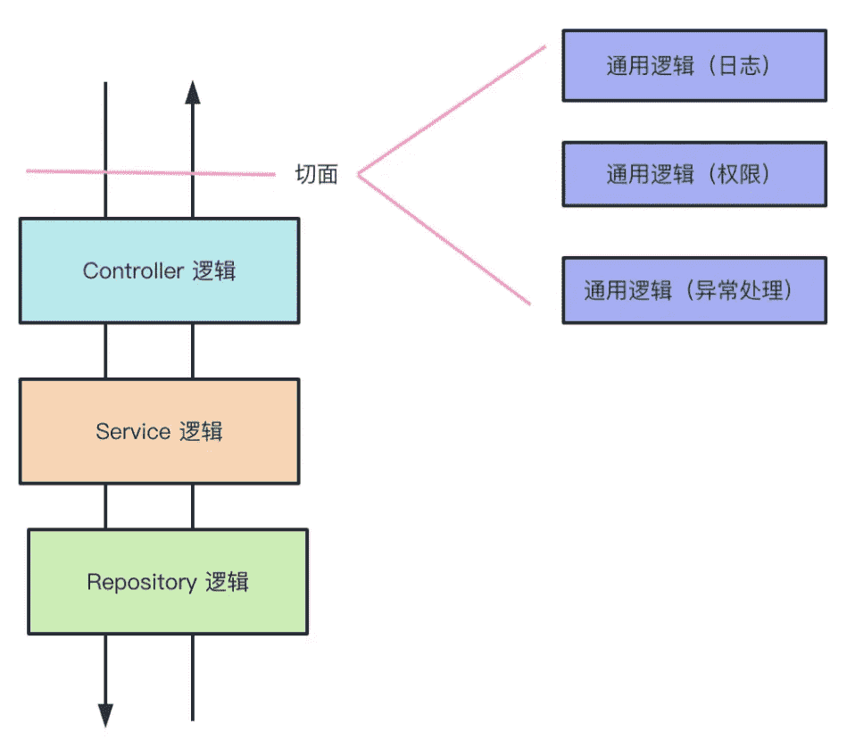


具体来说，有 Middleware、Guard、Interceptor、Pipe、Exception Filter 这五种。

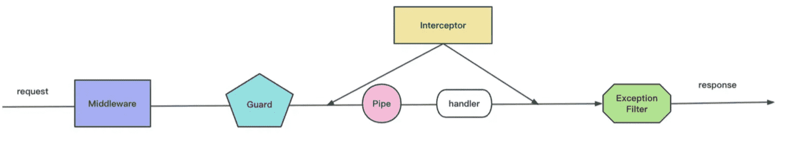

它们都是在目标 controller 的 handler 前后，额外加一段逻辑的。

比如你可以通过 interceptor 实现请求到响应的时间的记录：

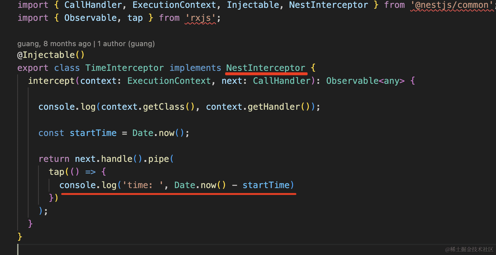


这种逻辑适合放在 controller 里么？

不适合，这种通用逻辑应该通过 interceptor 等方式抽离出来，然后需要用的时候在 controller 上声明一下：

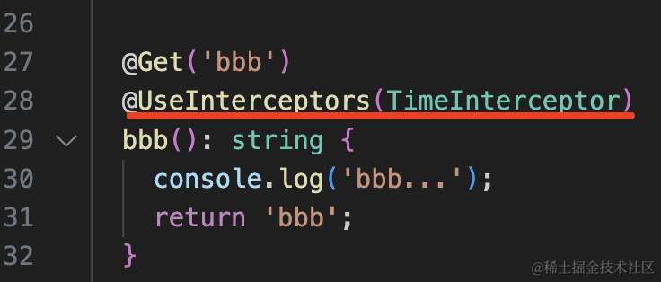

当然后续也会有全局注入的方式


## 总结

这节我们讲了很多 Nest 里的概念。

比如 controller、handler、service、dto、module、entity、ioc、aop、nest cli 等。

- **controller**：控制器，用于处理路由，解析请求参数
- **handler**：控制器里处理路由的方法
- **service**：实现业务逻辑的地方，比如操作数据库等
- **dto**：data transfer object，数据传输对象，用于封装请求体里数据的对象
- **module**：模块，包含 controller、service 等，比如用户模块、书籍模块
- **entity**：对应数据库表的实体
- **ioc**：Inverse of Controller，反转控制或者叫依赖注入，只要声明依赖，运行时 Nest 会自动注入依赖的实例
- **aop**：Aspect Oriented Programming 面向切面编程，在多个请求响应流程中可以复用的逻辑，比如日志记录等，具体包含 middleware、interceotor、guard、exception filter、pipe
- **nest cli**：创建项目、创建模块、创建 controller、创建 service 等都可以用这个 cli 工具来做

现在只要能大概理解概念就行，后面我们会深入学习这些。


