## 遇到的问题

后端系统中，会有很多对象：

- Controller 对象：接收 http 请求，调用 Service，返回响应
- Service 对象：实现业务逻辑
- Repository 对象：实现对数据库的增删改查

此外，还有数据库链接对象 DataSource，配置对象 Config 等等。

这些对象有着错综复杂的关系：

Controller 依赖了 Service 实现业务逻辑，Service 依赖了 Repository 来做增删改查，Repository 依赖 DataSource 来建立连接，DataSource 又需要从 Config 对象拿到用户名密码等信息。

这就导致了创建这些对象是很复杂的，你要理清它们之间的依赖关系，哪个先创建哪个后创建。

比如这样：

```javascript
const config = new Config({ username: 'xxx', password: 'xxx'});

const dataSource = new DataSource(config);

const repository = new Repository(dataSource);

const service = new Service(repository);

const controller = new Controller(service);
```

要经过一系列的初始化之后才可以使用 Controller 对象。

而且像 config、dataSource、repository、service、controller 等这些对象不需要每次都 new 一个新的，一直用一个就可以，也就是保持单例。

在应用初始化的时候，需要理清依赖的先后关系，创建一大堆对象组合起来，还要保证不要多次 new，是不是很麻烦？

没错，这是一个后端系统都有的痛点问题。

解决这个痛点的方式就是 IoC（Inverse of Control）。

java 的 Spring 就实现了 IoC，Nest 也同样实现了。


## IoC

那什么是 IoC 呢？

之前我们手动创建和组装对象不是很麻烦么，我能不能在 class 上声明依赖了啥，然后让工具去分析我声明的依赖关系，根据先后顺序自动把对象创建好了并组装起来呢？

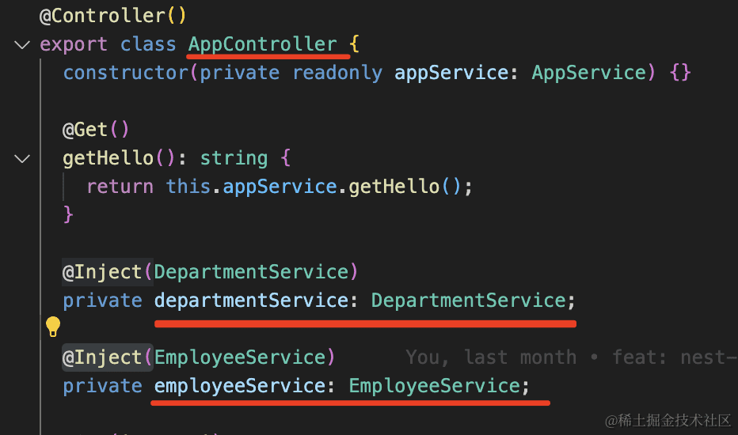

比如这样声明 AppController 依赖了这两个 Service，然后让工具分析依赖自动帮我创建好这三个对象并设置依赖关系。

这就是 IoC 的实现思路。

它有一个放对象的容器，程序初始化的时候会扫描 class 上声明的依赖关系，然后把这些 class 都给 new 一个实例放到容器里。

创建对象的时候，还会把它们依赖的对象注入进去。

这样不就完成了自动的对象创建和组装么？

这种依赖注入的方式叫做 Dependency Injection，简称 DI。

而这种方案为什么叫 IoC 也很容易理解了，本来是手动 new 依赖对象，然后组装起来，现在是声明依赖了啥，等待被注入。

从主动创建依赖到被动等待依赖注入，这就是 Inverse of Control，反转控制。

在 class 上声明依赖的方式，大家都选择了装饰器的方式（在 java 里这种语法叫做注解）。

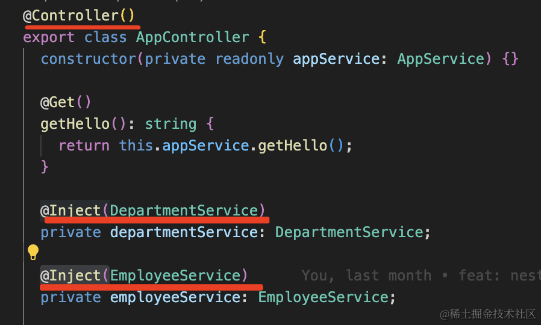

比如上面就是声明这个 class 要放到 IOC 容器里，然后它的依赖是啥。

这样 IOC 容器扫描到它就知道怎么创建它的对象了。

知道了 IOC 是啥，下面我们来看看真实的 Nest 项目里是怎么用 IoC 的(创建项目过程省略)


我们看看代码里它是怎么创建对象的：

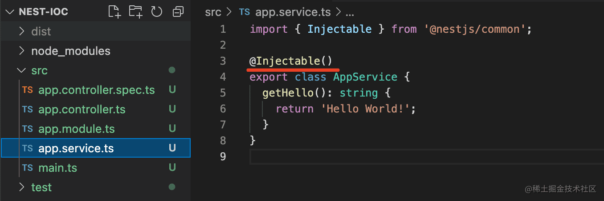

它有一个 AppService 声明了 @Injectable，代表这个 class 可注入，那么 nest 就会把它的对象放到 IOC 容器里。

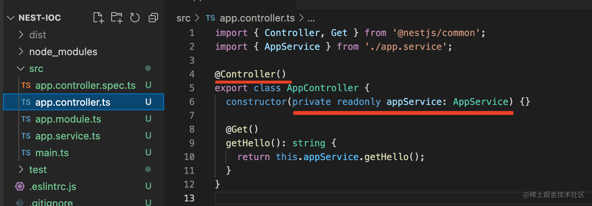

AppController 声明了 @Controller，代表这个 class 可以被注入，nest 也会把它放到 IoC 容器里。

AppController 的构造器参数依赖了 AppService。

或者这样通过属性的方式声明依赖：

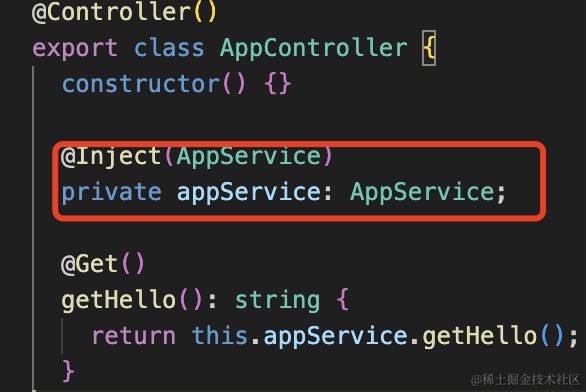

前者是构造器注入，后者是属性注入，两种都可以。

**为什么 Controller 是单独的装饰器呢？**

**因为 Service 是可以被注入也是可以注入到别的对象的，所以用 @Injectable 声明。**

**而 Controller 只需要被注入，所以 nest 单独给它加了 @Controller 的装饰器。**

然后在 AppModule 里引入：

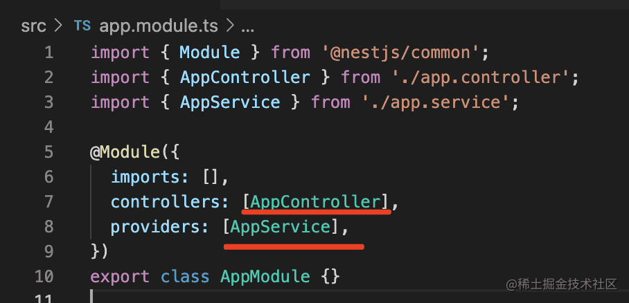

通过 @Module 声明模块，其中 controllers 是控制器，只能被注入。

providers 里可以被注入，也可以注入别的对象，比如这里的 AppService。

然后在入口模块里跑起来：

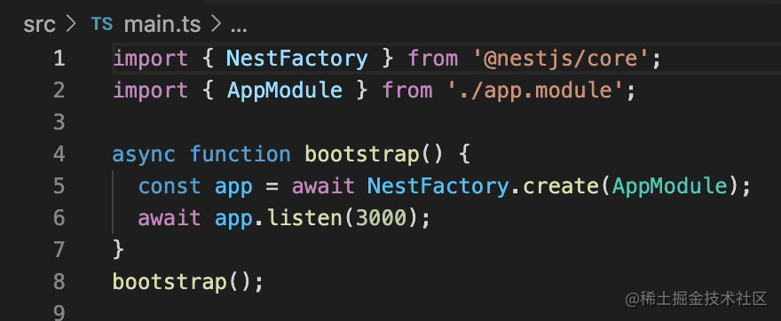

那么 nest 就会从 AppModule 开始解析 class 上通过装饰器声明的依赖信息，自动创建和组装对象。

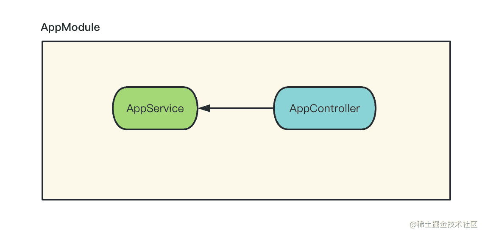

所以 AppController 只是声明了对 AppService 的依赖，就可以调用它的方法了：

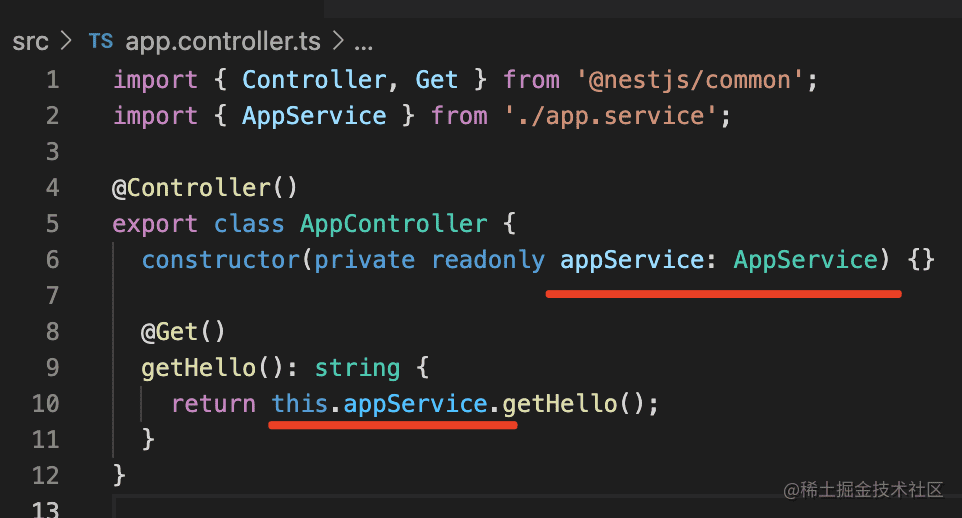

nest 在背后自动做了对象创建和依赖注入的工作。

nest 还加了模块机制，可以把不同业务的 controller、service 等放到不同模块里。

```
nest g module other
```

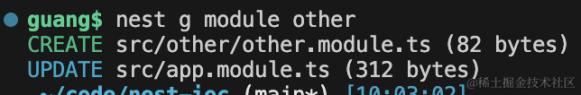

会生成如下代码：

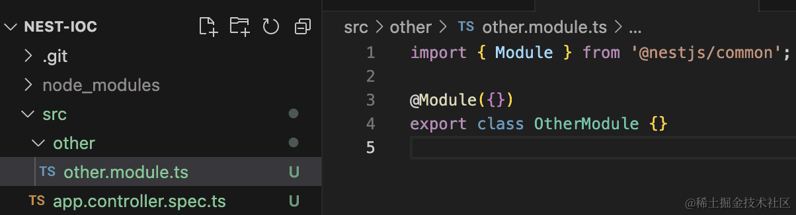

用 nest cli 的 generate 命令生成一个模块。

会在 AppModule 里自动 imports 这个模块：

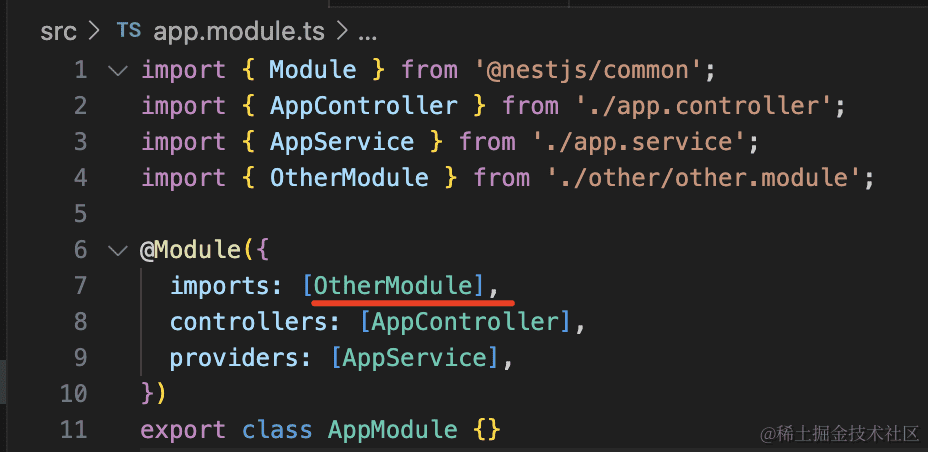

当 import 别的模块后，那个模块 exports 的 provider 就可以在当前模块注入了。

比如我们再生成 OtherService：

```
nest g service other
```

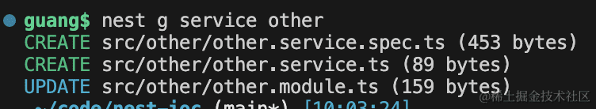

会生成 Service 的代码：

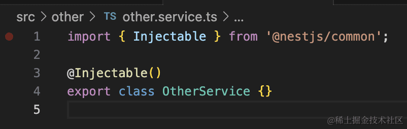

并自动添加到 OtherModule 的 providers 中：

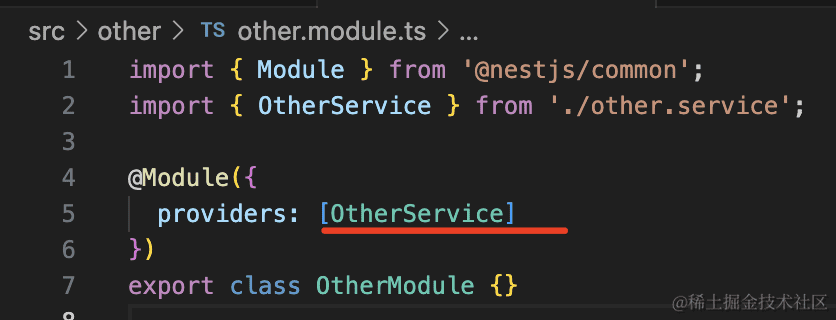

我们改下 OtherService，添加一个方法：

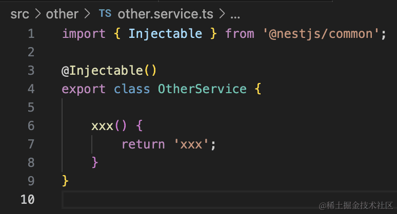

然后在 OtherModule 里 exports：

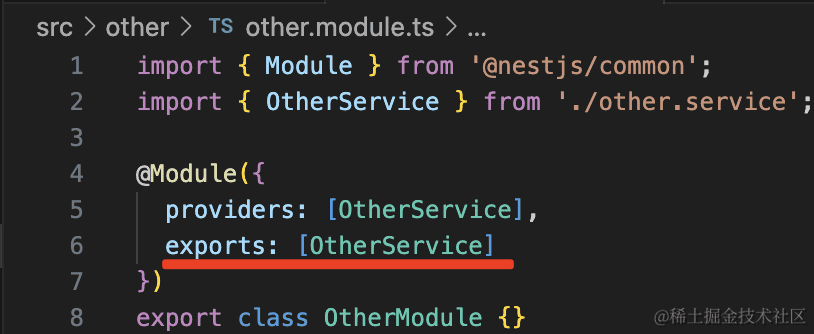

**那当 AppModule 引用了 OtherModule 之后，就可以注入它 exports 的 OtherService 了。**

**当我们在项目中需要使用到其他模块的service中，其他模块需要将他的service导出，我们才能使用**

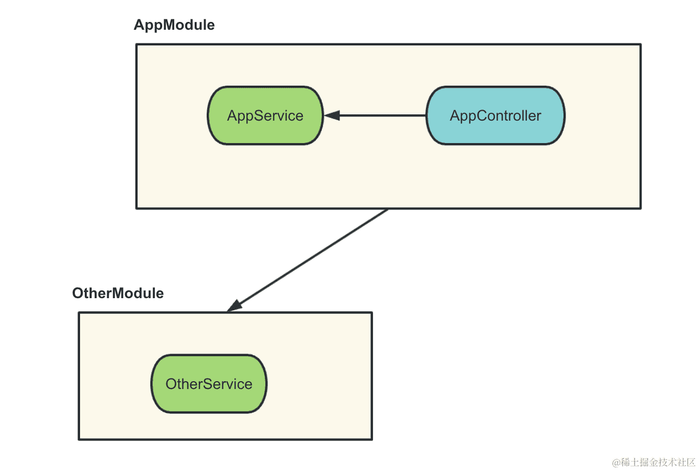

我们在 AppService 里注入下：

```javascript
import { OtherService } from './other/other.service';
import { Inject, Injectable } from '@nestjs/common';

@Injectable()
export class AppService {

  @Inject(OtherService) 
  private otherService:OtherService;

  getHello(): string {
    return 'Hello World!' + this.otherService.xxx();
  }
}

```

把服务跑起来：

```
npm run start:dev
```

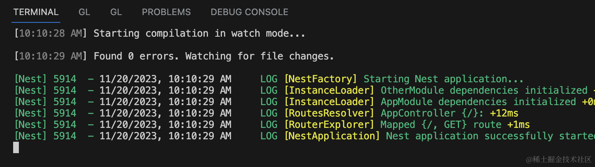


浏览器访问下，可以看到 AppModule 的 AppService 调用 OtherModule 的 OtherService 成功了：


这就是 Nest 的 IoC 机制。


如果我们没有exports导出OtherService，会报错（忽略名字）：

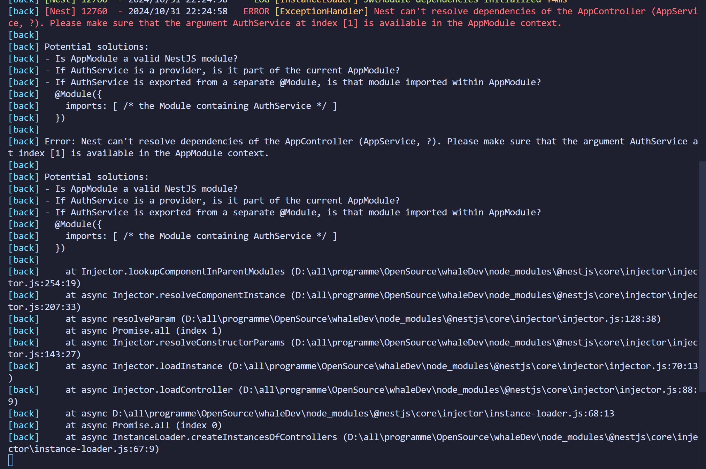


## 总结

后端系统有很多的对象，这些对象之间的关系错综复杂，如果手动创建并组装对象比较麻烦，所以后端框架一般都提供了 IoC 机制。

IoC 机制是在 class 上标识哪些是可以被注入的，它的依赖是什么，然后从入口开始扫描这些对象和依赖，自动创建和组装对象。

Nest 里通过 @Controller 声明可以被注入的 controller，通过 @Injectable 声明可以被注入也可以注入别的对象的 provider，然后在 @Module 声明的模块里引入。

并且 Nest 还提供了 Module 和 Module 之间的 import，可以引入别的模块的 provider 来注入。

虽然 Nest 这套实现了 IoC 的模块机制看起来繁琐，但是却解决了后端系统的对象依赖关系错综复杂的痛点问题。