Nest 实现了 IoC 容器，会从入口模块开始扫描，分析 Module 之间的引用关系，对象之间的依赖关系，自动把 provider 注入到目标对象。

而这个 provider 也有好几种，这节我们就来看一下。


## 简写

我们创建个 nest 项目：

可以看到 AppService 是被 @Injectable 修饰的 class：

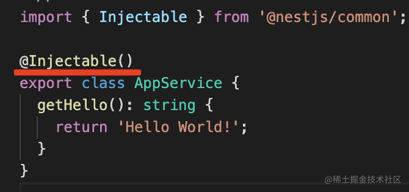

在 Module 的 providers 里声明：

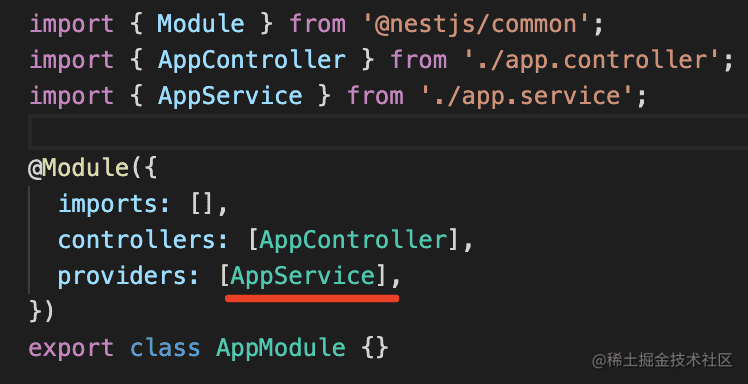

这就是 provider。


## 完整写法

### token class

其实这是一种简写，完整的写法是这样的：

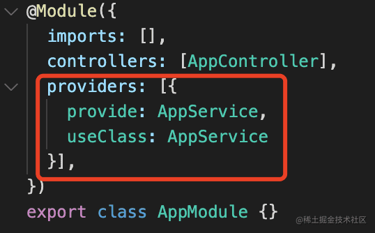

```javascript
{
  provide: AppService,
  useClass: AppService
}
```

通过 provide 指定 token，通过 useClass 指定对象的类，Nest 会自动对它做实例化后用来注入。

在 AppController 的构造器里参数里声明了 AppService 的依赖，就会自动注入：

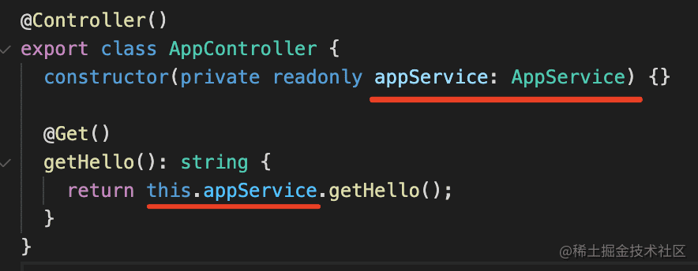

如果不想用构造器注入，也可以属性注入：

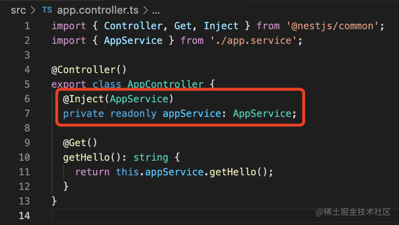

```javascript
@Inject(AppService)
private readonly appService: AppService;
```

通过 @Inject 指定注入的 provider 的 token 即可。

有的同学说，在构造器参数里指定 AppService 的依赖的时候也没指定 token 啊？

那是因为 AppService 这个 class 本身就是 token。


### token string

当然，这个 token 也可以是字符串：

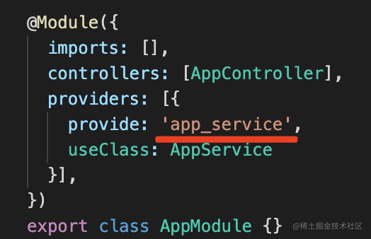

```javascript
{
    provide: 'app_service',
    useClass: AppService
}
```

如果 token 是字符串的话，注入的时候就要用 @Inject 手动指定注入对象的 token 了：

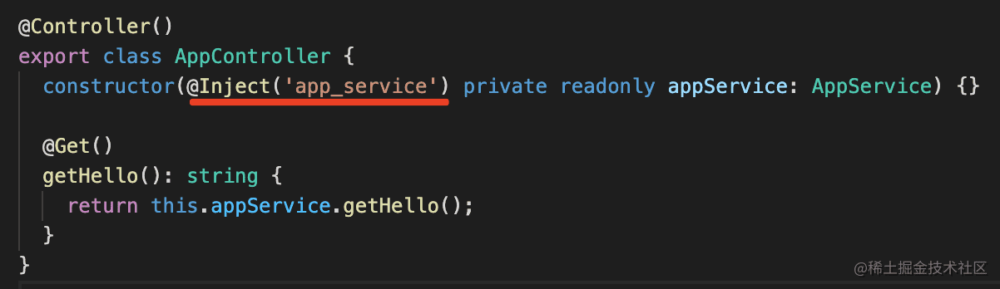

```javascript
@Inject('app_service') private readonly appService: AppService
```

我们调试下：

点击调试面板的 create launch.json file，创建调试配置文件：

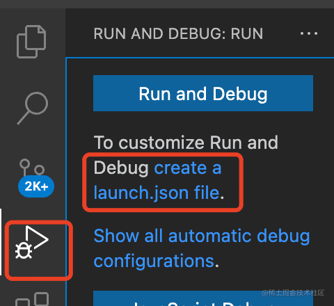

添加这样一个调试配置：

```json
{
    "type": "node",
    "request": "launch",
    "name": "debug nest",
    "runtimeExecutable": "npm",
    "args": [
        "run",
        "start:dev",
    ],
    "skipFiles": [
        "<node_internals>/**"
    ],
    "console": "integratedTerminal",
}
```

在 getHello 方法打个断点，点击调试启动：

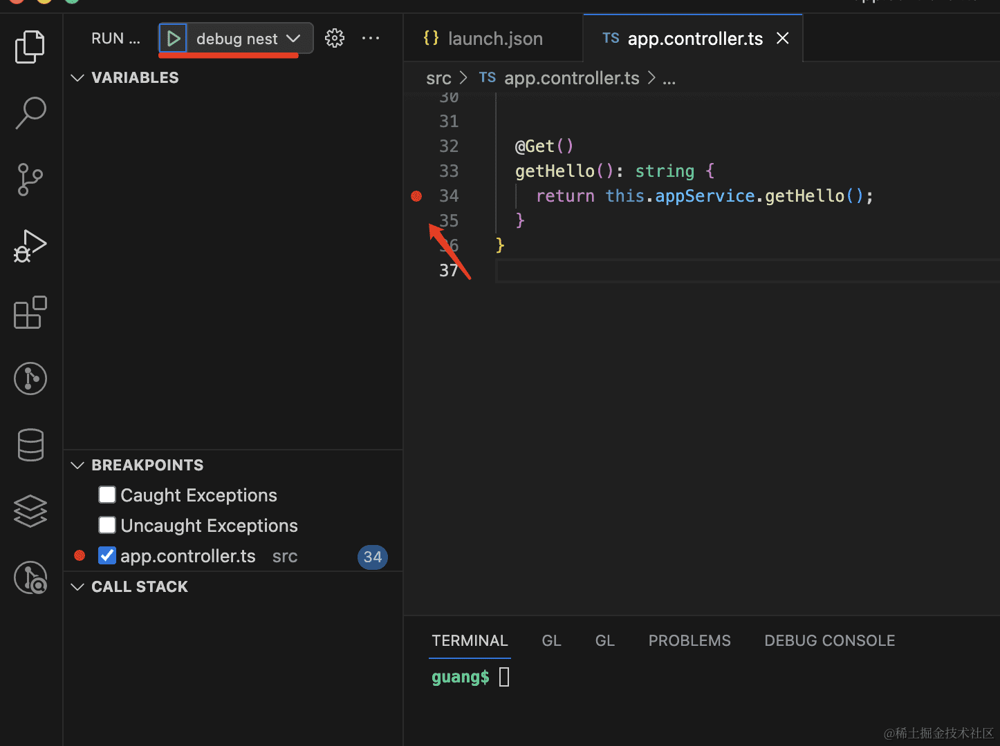

浏览器访问 http://localhost:3000 ，代码会在断点处断住。

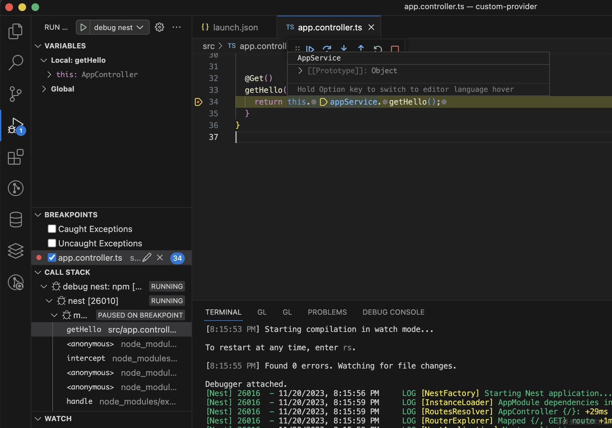

可以看到，这时候 appService 就有值了。

也就是说，用字符串或者 class 做 token 的 provider，都可以正确被注入到目标对象。

相比之下，用 class 做 token 可以省去 @Inject，比较简便。


### 固定值

除了指定 class 外，还可以直接指定一个值，让 IoC 容器来注入。

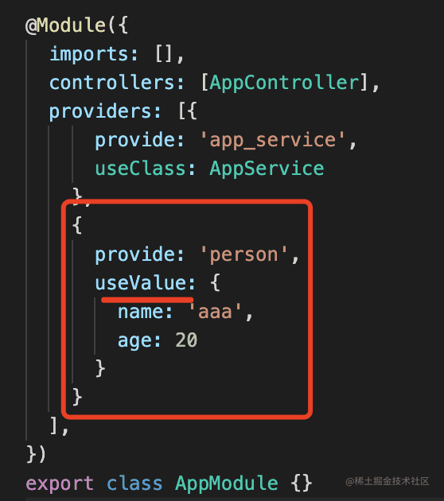

```javascript
{
    provide: 'person',
    useValue: {
        name: 'aaa',
        age: 20
    }
}
```

使用 provide 指定 token，使用 useValue 指定值。

然后在对象里注入它：

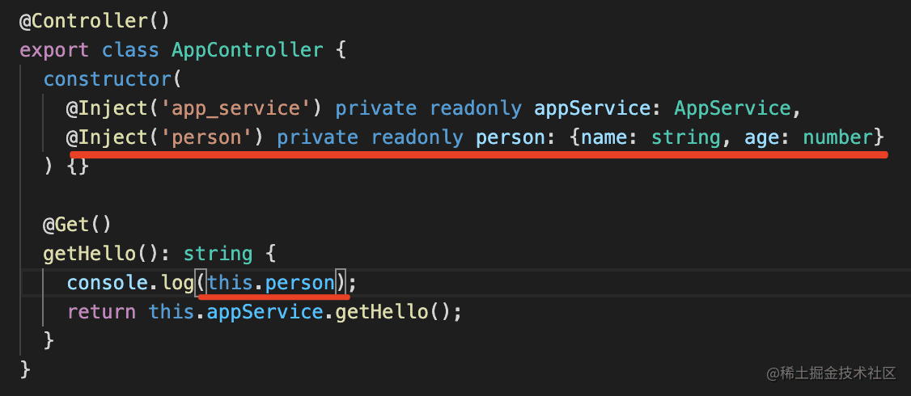

```javascript
@Inject('person') private readonly person: {name: string, age: number}
```

调试一下可以看到，确实是注入了：

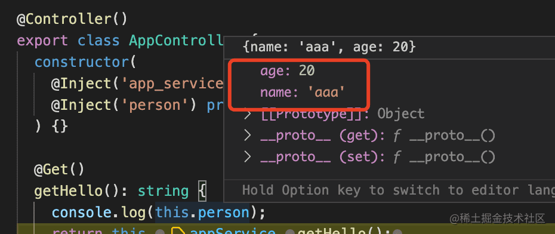

provider 的值可能是动态产生的，Nest 也同样支持：

```javascript
{
    provide: 'person2',
    useFactory() {
        return {
            name: 'bbb',
            desc: 'cccc'
        }
    }
}
```


### useFactory动态创建

我们可以使用 useFactory 来动态创建一个对象。

在对象里注入：

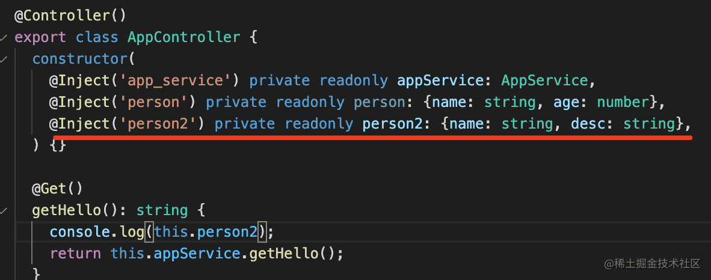

```javascript
@Inject('person2') private readonly person2: {name: string, desc: string}
```

类型是 {name: string, age: number} 。

调试下，也是可以拿到创建出的对象的：

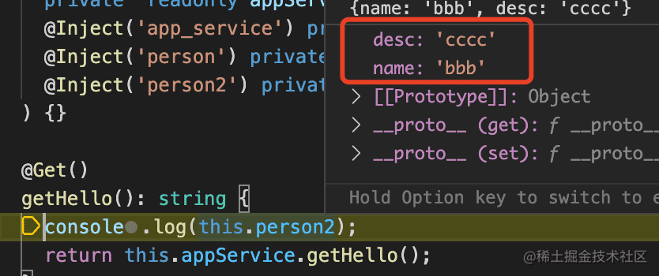

这个 useFactory 支持通过参数注入别的 provider：

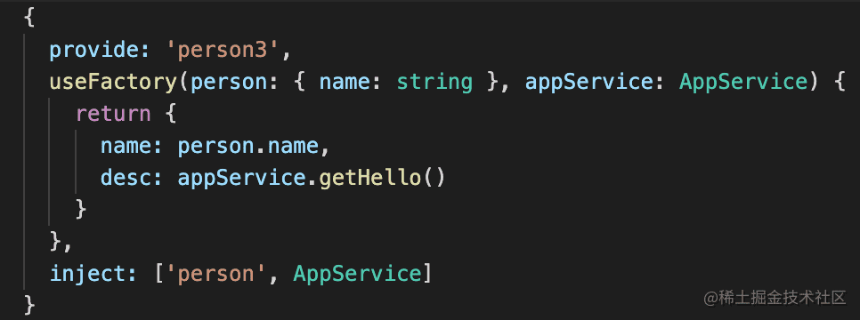

```javascript
{
  provide: 'person3',
  useFactory(person: { name: string }, appService: AppService) {
    return {
      name: person.name,
      desc: appService.getHello()
    }
  },
  inject: ['person', AppService]
}
```

通过 inject 声明了两个 token，一个是字符串 token 的 person，一个是 class token 的 AppService。

也就是注入这两个 provider：

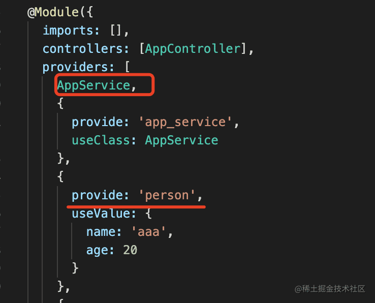

在 return 那里打个断点。

可以看到，在调用 useFactory 方法的时候，Nest 就会注入这两个对象：

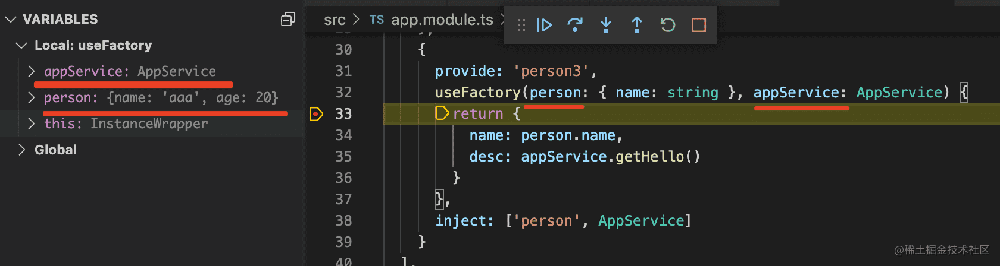

useFactory 支持异步：

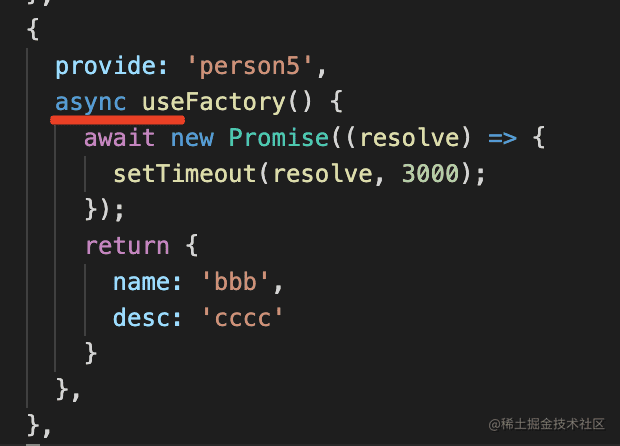

```javascript
{
  provide: 'person5',
  async useFactory() {
    await new Promise((resolve) => {
      setTimeout(resolve, 3000);
    });
    return {
      name: 'bbb',
      desc: 'cccc'
    }
  },
},
```

Nest 会等拿到异步方法的结果之后再注入：

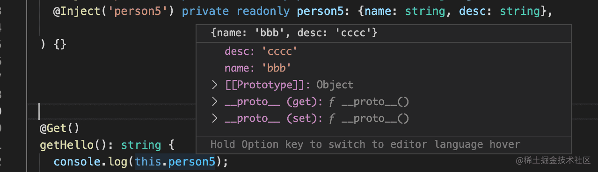

这样就可以更灵活的创建注入对象。


### useExisting

此外，provider 还可以通过 useExisting 来指定别名：

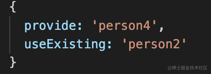

```javascript
{
  provide: 'person4',
  useExisting: 'person2'
}
```

这里就是给 person2 的 token 的 provider 起个新的 token 叫做 person4。

然后就可以用新 token 来注入了：

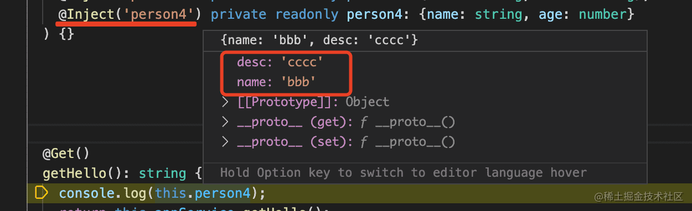

这些自定义 provider 的方式里，最常用的是 useClass，不过我们一般会用简写，也就是直接指定 class。

useClass 的方式由 IoC 容器负责实例化，我们也可以用 useValue、useFactory 直接指定对象。

useExisting 只是用来起别名的，有的场景下会用到。

比如 @nestjs/typeorm 里就用到了 useValue、useFactory、useExisting：

它用 useValue 来[注入一段字符串](https://github.com/nestjs/typeorm/blob/153da09a384fdbf797b66e4500b69a72a7a47b78/lib/typeorm-core.module.ts#L113-L116)：

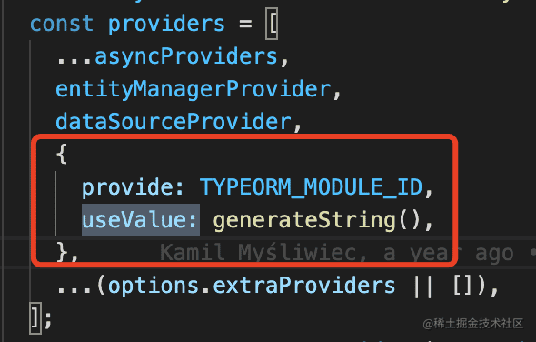

用 useFactory 根据传入的 options [动态创建数据库连接对象](https://github.com/nestjs/typeorm/blob/153da09a384fdbf797b66e4500b69a72a7a47b78/lib/typeorm-core.module.ts#L83-L101)：

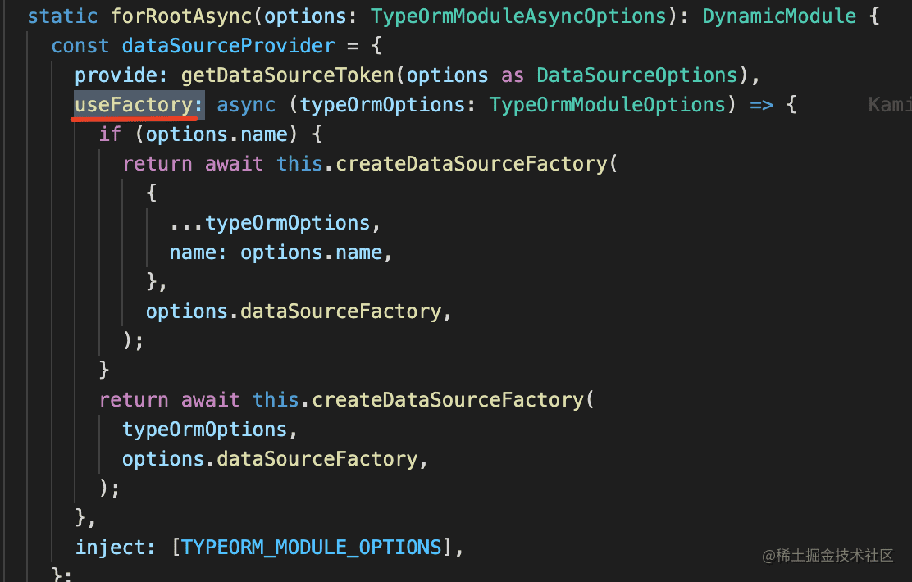

用 useExisting 给 DataSource 起了一个 Connection 的[别名](https://github.com/nestjs/typeorm/blob/153da09a384fdbf797b66e4500b69a72a7a47b78/lib/typeorm-core.module.ts#L68-L71)：

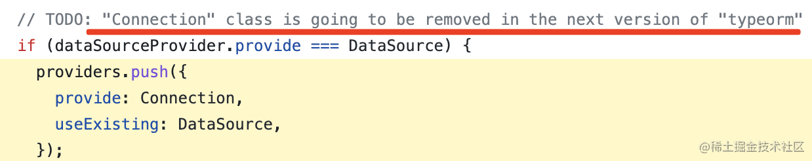

这里是一个版本用了 Connection，一个版本用了 DataSource，通过 useExisting 起别名就可以兼容两者。

此外，如果觉得构造器注入写起来不方便，可以使用属性注入，效果一样：

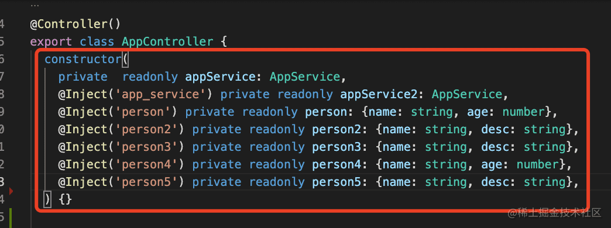

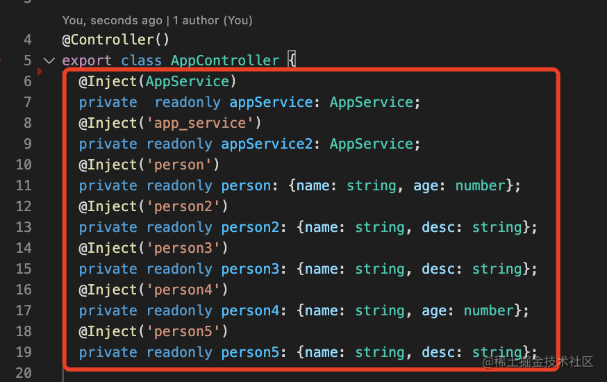

案例代码在[小册仓库](https://github.com/QuarkGluonPlasma/nestjs-course-code/tree/main/custom-provider)。


## 总结

一般情况下，provider 是通过 @Injectable 声明，然后在 @Module 的 providers 数组里注册的 class。

默认的 token 就是 class，这样不用使用 @Inject 来指定注入的 token。

但也可以用字符串类型的 token，不过注入的时候要用 @Inject 单独指定。

除了可以用 useClass 指定注入的 class，还可以用 useValue 直接指定注入的对象。

如果想动态生成对象，可以使用 useFactory，它的参数也注入 IOC 容器中的对象，然后动态返回 provider 的对象。

如果想起别名，可以用 useExisting 给已有的 token，指定一个新 token。

灵活运用这些 provider 类型，就可以利用 Nest 的 IOC 容器中注入任何对象。

