模块导出 provider，另一个模块需要 imports 它才能用这些 provider。

但如果这个模块被很多模块依赖了，那每次都要 imports 就很麻烦。

能不能设置成全局的，它导出的 provider 直接可用呢？

Module、Controller、Provider 是由 Nest 创建的，能不能在创建、销毁的时候执行一些逻辑呢？

这节我们来学习下全局模块和生命周期。

创建一个 nest 项目：


## 全局模块

### 正常使用其他模块

然后创建两个 CRUD 的模块：（--no-spec 是不生成测试文件）

```
nest g resource aaa --no-spec
nest g resource bbb --no-spec
```


在 AaaModule 里指定 exports 的 provider：

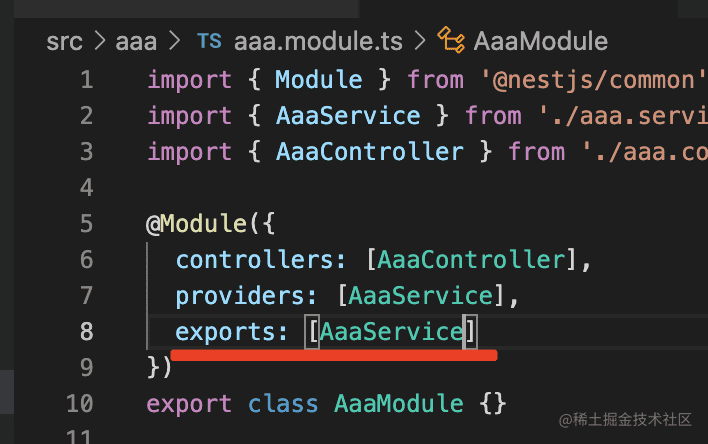

然后在 BbbModule 里 imports：

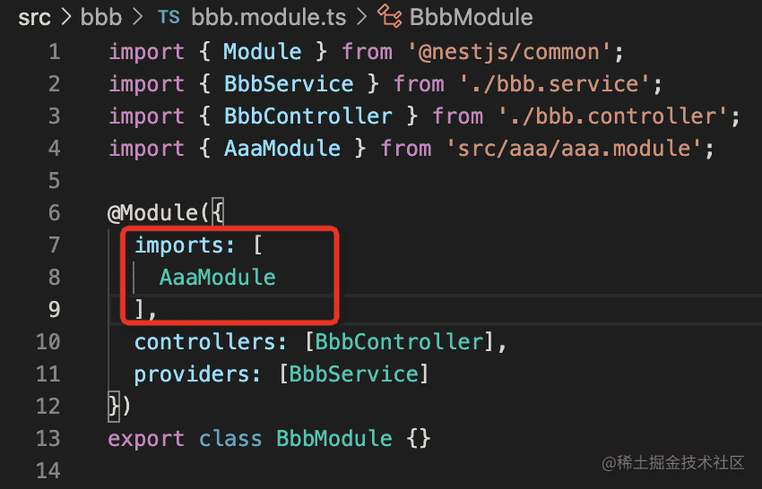

这样就可以在 BbbModule 内注入 AaaService 了：

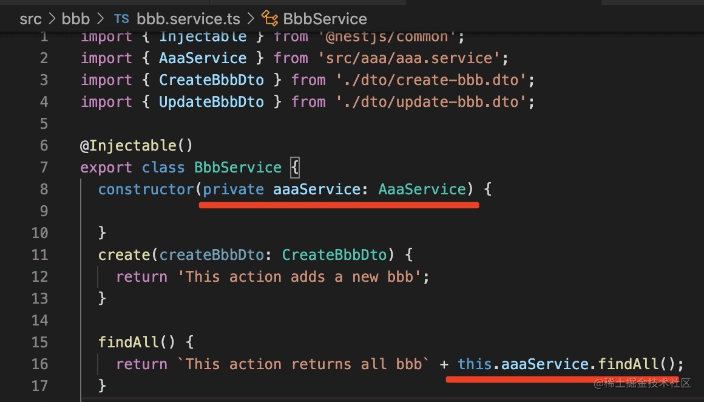

把 nest 服务跑起来：

```
npm run start:dev
```

可以看到 aaaService 生效了：


这是我们常用的引入 Module 的方式。

**但如果这个 AaaModule 被很多地方引用呢？**


### 声明全局模块

每个模块都 imports 太麻烦了，这时候就可以把它声明为全局的：

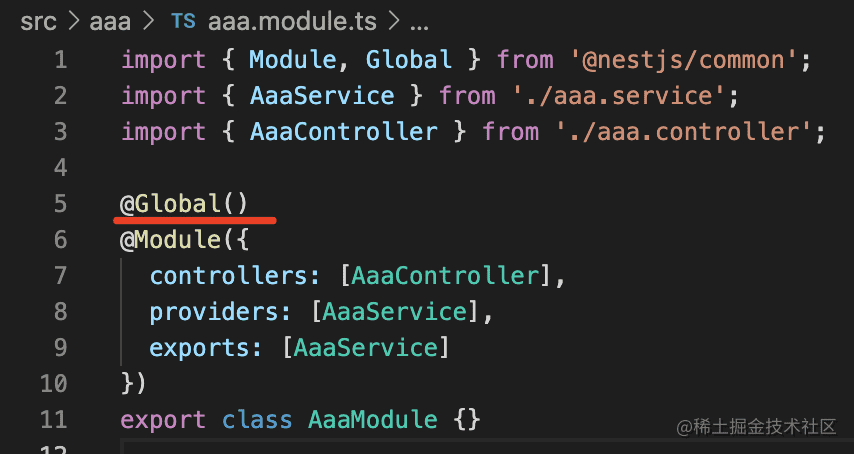

在 AaaModule 上加一个 @Global 的装饰器，然后在 BbbModule 里把 AaaModule 的 imports 去掉。

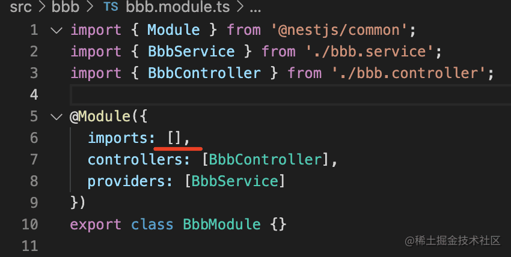

这样依然是可以注入的：

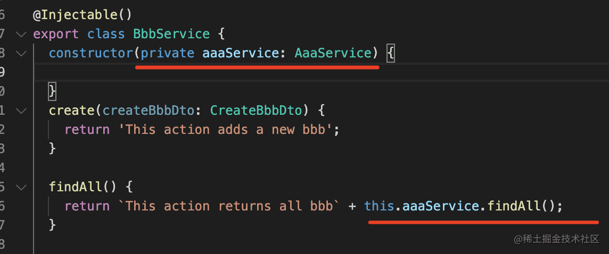


这就是全局模块。

**不过全局模块还是尽量少用，不然注入的很多 provider 都不知道来源，会降低代码的可维护性。**


## 生命周期

### 创建过程生命周期

Nest 在启动的时候，会递归解析 Module 依赖，扫描其中的 provider、controller，注入它的依赖。

全部解析完后，会监听网络端口，开始处理请求。

这个过程中，Nest 暴露了一些生命周期方法：

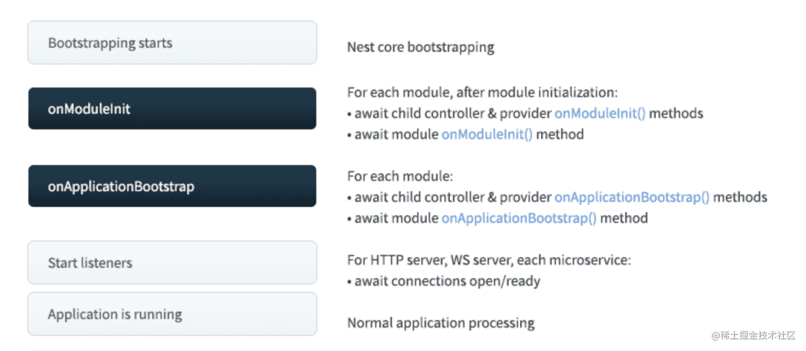

首先，递归初始化模块，会依次调用模块内的 controller、provider 的 onModuleInit 方法，然后再调用 module 的 onModuleInit 方法。

全部初始化完之后，再依次调用模块内的 controller、provider 的 onApplicationBootstrap 方法，然后调用 module 的 onApplicationBootstrap 方法

然后监听网络端口。

之后 Nest 应用就正常运行了。

这个过程中，onModuleInit、onApplicationBootstrap 都是我们可以实现的生命周期方法。

我们来试一下：

再创建两个 Module：

    nest g resource ccc --no-spec
    nest g resource ddd --no-spec

nest 提供了这样两个 interface：

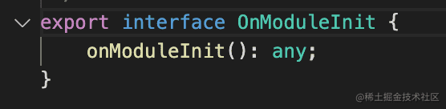

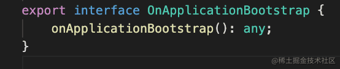

在 controller、service、module 里分别实现它：

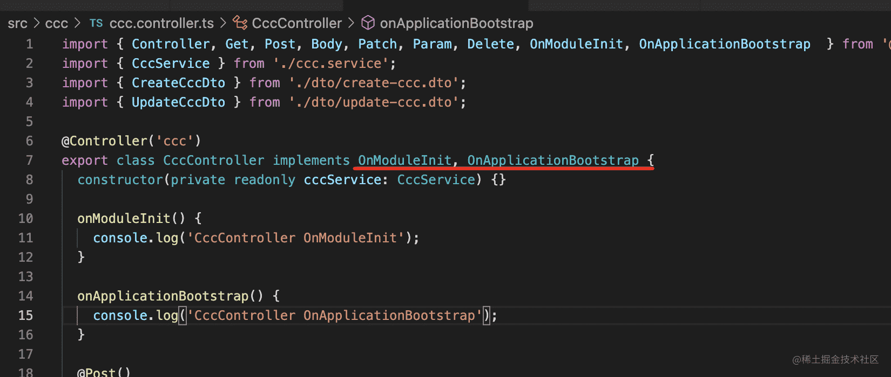

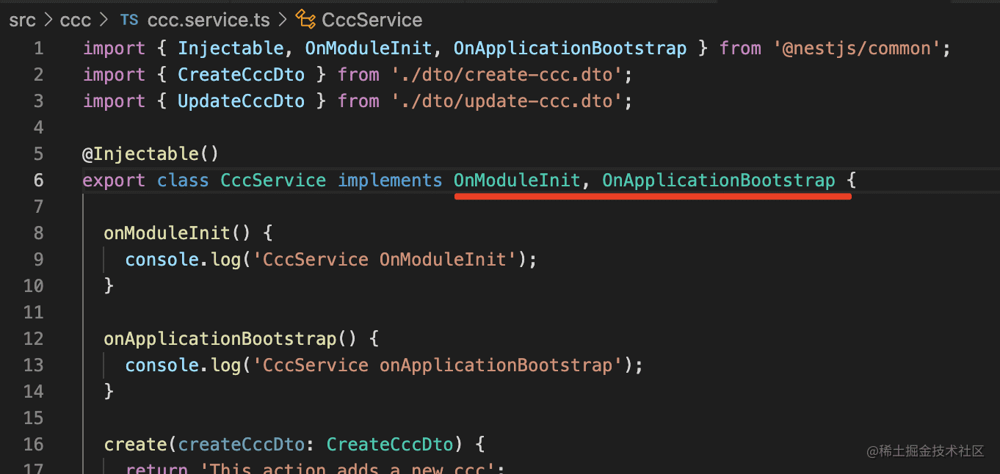


ddd 模块也是这样。

然后重新跑下服务，会看到这样的日志信息：

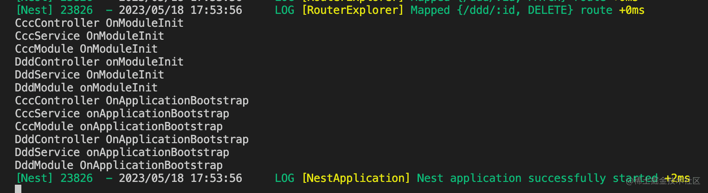

这就是 onModuleInit 和 onApplicationBootstrap 生命周期的调用顺序。


### 销毁过程生命周期

应用销毁的时候也同样有生命周期：

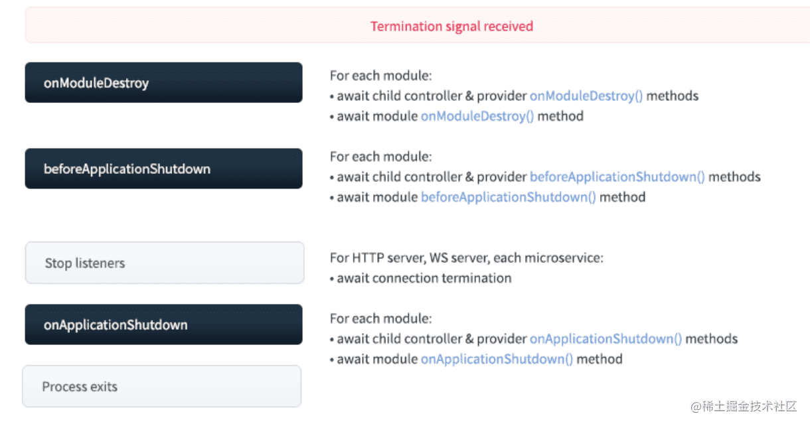

先调用每个模块的 controller、provider 的 onModuleDestroy 方法，然后调用 Module 的 onModuleDestroy 方法。

之后再调用每个模块的 controller、provider 的 beforeApplicationShutdown 方法，然后调用 Module 的 beforeApplicationShutdown 方法。

然后停止监听网络端口。

之后调用每个模块的 controller、provider 的 onApplicationShutdown 方法，然后调用 Module 的 onApplicationShutdown 方法。

之后停止进程。

是不是感觉 onModuleDestory 和 beforeApplicationShutdown 没区别呀？

其实是有区别的，可以看下对应的 interface：

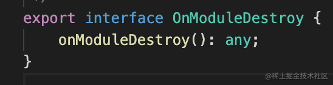

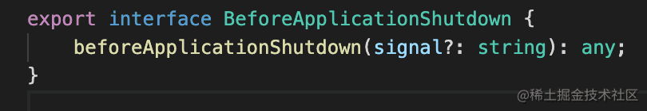

beforeApplicationShutdown 是可以拿到 signal 系统信号的，比如 SIGTERM。

这些终止信号是别的进程传过来的，让它做一些销毁的事情，比如用 k8s 管理容器的时候，可以通过这个信号来通知它。

我们分别给 CccController、CccProvider、CccModule 还有 ddd 模块的那些给加一下：

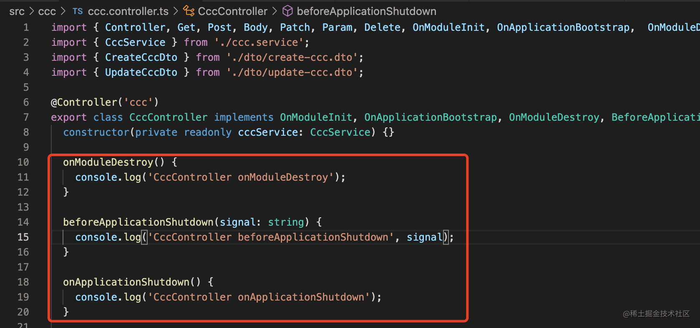

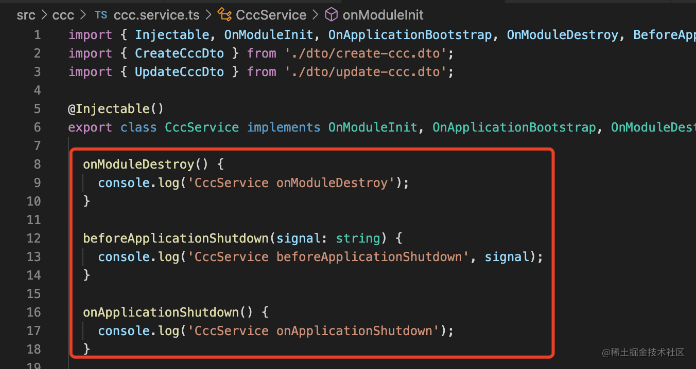

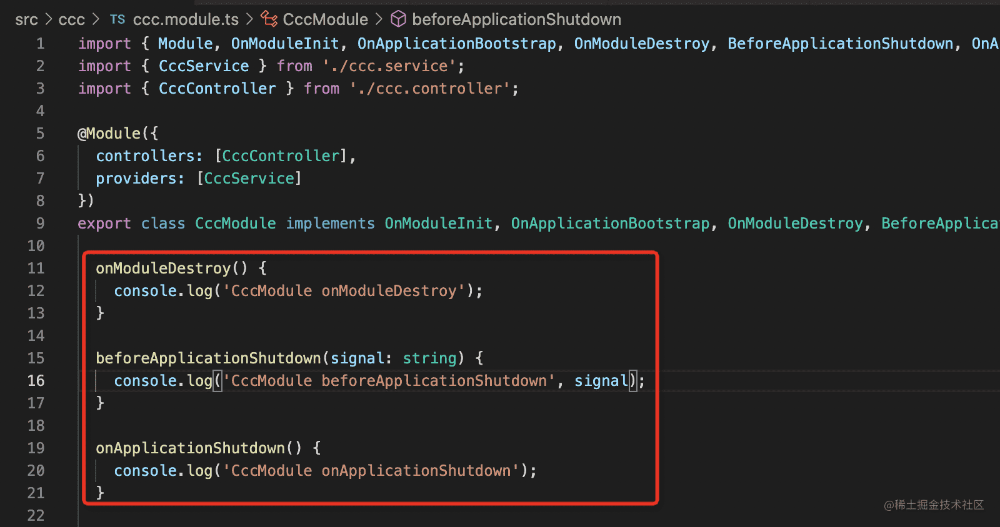

3s 后调用 app.close() 触发销毁（app.close() 只是触发销毁逻辑，但不会真正退出进程）

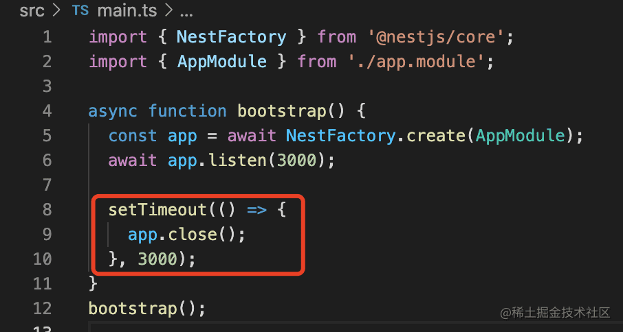

生命周期方法是这样的执行顺序：

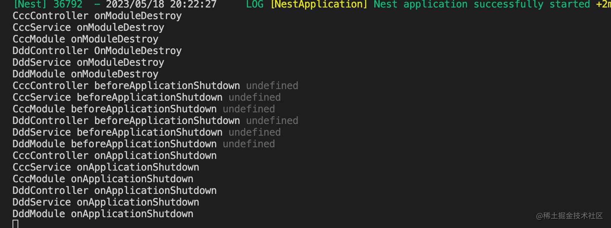

而且所有的生命周期函数都是支持 async 的。

我们来看看 @nestjs/typeorm、@nestjs/mongoose 里都是怎么用的：

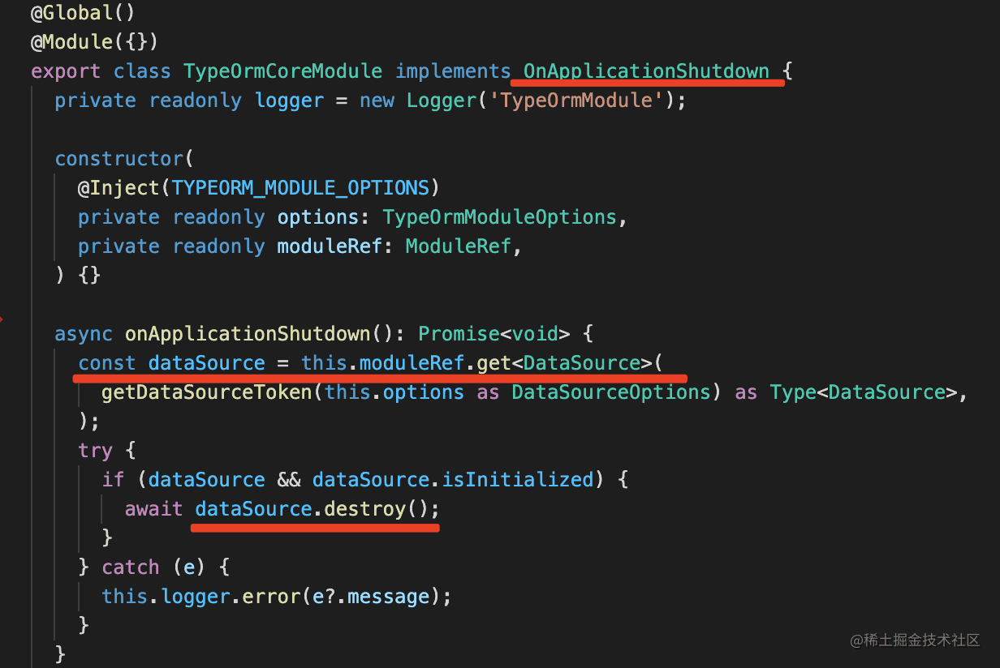

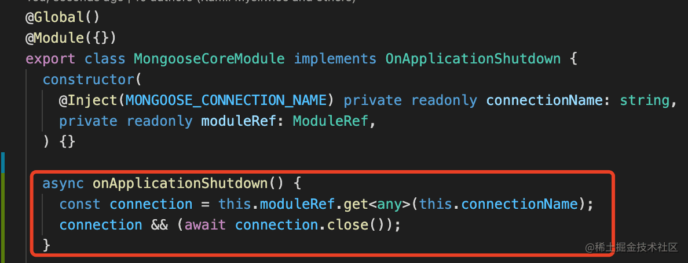

可以看到，一般都是通过 moduleRef 取出一些 provider 来销毁，比如关闭连接。

这里的 moduleRef 就是当前模块的引用。

我们来试试：


onApplicationShutdown 的生命周期里，拿到当前模块的引用 moduleRef，调用 get 方法，传入 token，取出对应的 provider 实例，然后调用它的方法。

```javascript
import { Module, OnModuleInit, OnApplicationBootstrap, OnModuleDestroy, BeforeApplicationShutdown, OnApplicationShutdown  } from '@nestjs/common';
import { ModuleRef } from '@nestjs/core';
import { CccService } from './ccc.service';
import { CccController } from './ccc.controller';

@Module({
  controllers: [CccController],
  providers: [CccService]
})
export class CccModule implements OnModuleInit, OnApplicationBootstrap, OnModuleDestroy, BeforeApplicationShutdown, OnApplicationShutdown  {


  onModuleDestroy() {
    console.log('CccModule onModuleDestroy');
  }

  beforeApplicationShutdown(signal: string) {
    console.log('CccModule beforeApplicationShutdown', signal);
  }

  onApplicationShutdown() {
    const cccService = this.moduleRef.get<CccService>(CccService);
    console.log('--------------------------', cccService.findAll());

    console.log('CccModule onApplicationShutdown');
  }

  onModuleInit() {
    console.log('CccModule OnModuleInit');
  }

  onApplicationBootstrap() {
    console.log('CccModule onApplicationBootstrap');
  }
}
```

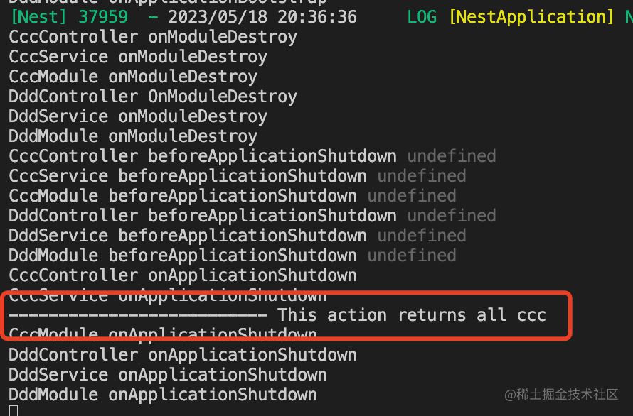

这就是 onApplicationShutdown 生命周期的常见用法。

案例代码在[小册仓库](https://github.com/QuarkGluonPlasma/nestjs-course-code/tree/main/global-and-lifecycle)。


## 总结

这节我们学习了全局模块和生命周期。

模块可以通过 @Global 声明为全局的，这样它 exports 的 provider 就可以在各处使用了，不需要 imports。

provider、controller、module 都支持启动和销毁的生命周期函数，这些生命周期函数都支持 async 的方式。

可以在其中做一些初始化、销毁的逻辑，比如 onApplicationShutwon 里通过 moduleRef.get 取出一些 provider，执行关闭连接等销毁逻辑。

全局模块、生命周期、moduleRef 都是 Nest 很常用的功能。