Nest 支持创建 HTTP 服务、WebSocket 服务，还有基于 TCP 通信的微服务。

这些不同类型的服务都需要 Guard、Interceptor、Exception Filter 功能。

那么问题来了：

不同类型的服务它能拿到的参数是不同的，比如 http 服务可以拿到 request、response 对象，而 ws 服务就没有，如何让 Guard、Interceptor、Exception Filter 跨多种上下文复用呢？

Nest 的解决方法是 ArgumentHost 和 ExecutionContext 类。

我们来看一下：


## Exception Filter

创建个项目：

然后创建一个 filter：`nest g filter aaa --flat --no-spec`


Nest 会 catch 所有未捕获异常，如果是 Exception Filter 声明的异常，那就会调用 filter 来处理。

那 filter 怎么声明捕获什么异常的呢？

我们创建一个自定义的异常类：


在 @Catch 装饰器里声明这个 filter 处理该异常：

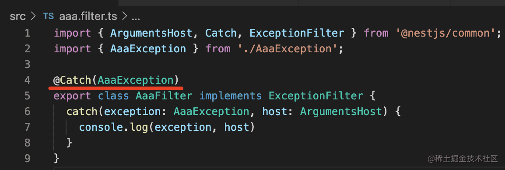

然后需要启用它：

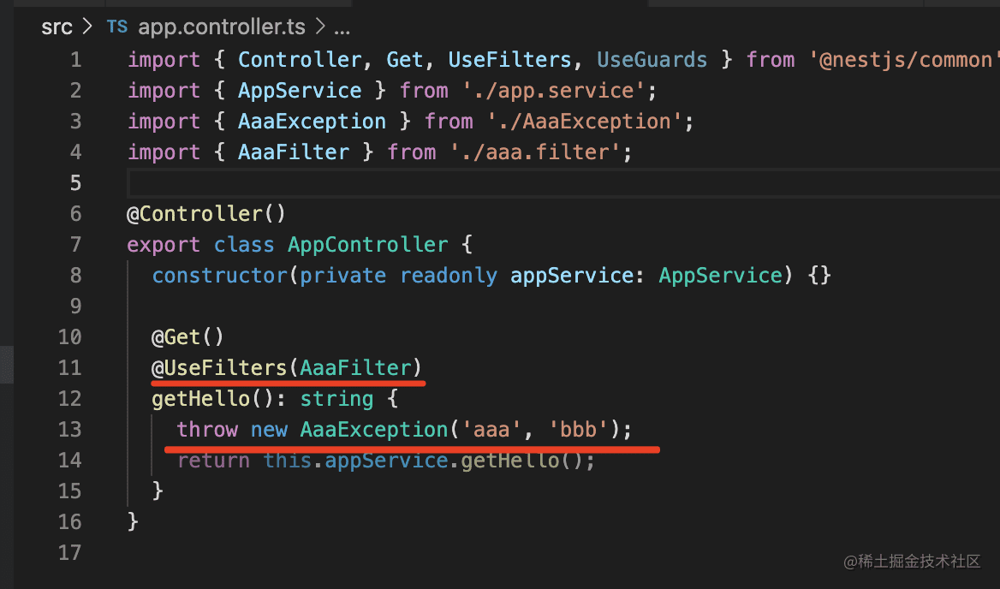

路由级别启用 AaaFilter，并且在 handler 里抛了一个 AaaException 类型的异常。

也可以全局启用：

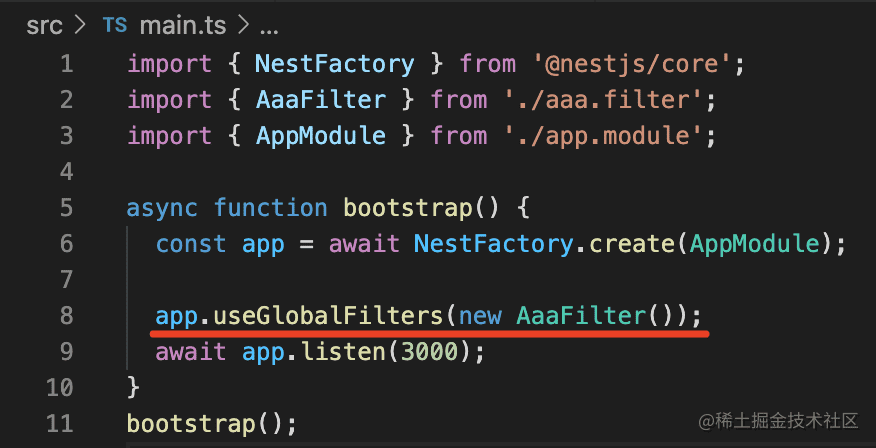

访问 <http://localhost:3000> 就可以看到 filter 被调用了。

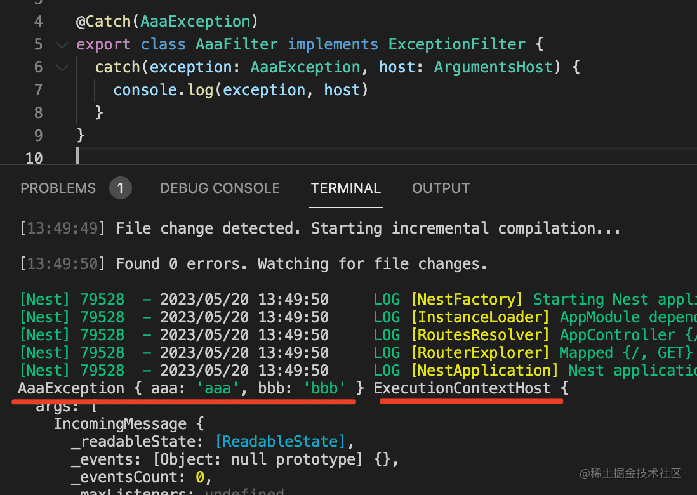

filter 的第一个参数就是异常对象，那第二个参数呢？

可以看到，它有这些方法：


我们用调试的方式跑一下：

点击 create launch.json file 创建一个调试配置文件：

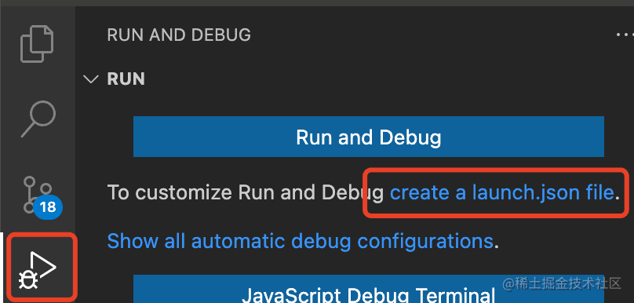

在 .vscode/launch.json 添加这样的调试配置：

```json
{
    "type": "pwa-node",
    "request": "launch",
    "name": "debug nest",
    "runtimeExecutable": "npm",
    "args": [
        "run",
        "start:dev",
    ],
    "skipFiles": [
        "<node_internals>/**"
    ],
    "console": "integratedTerminal",
}
```

点击调试启动：

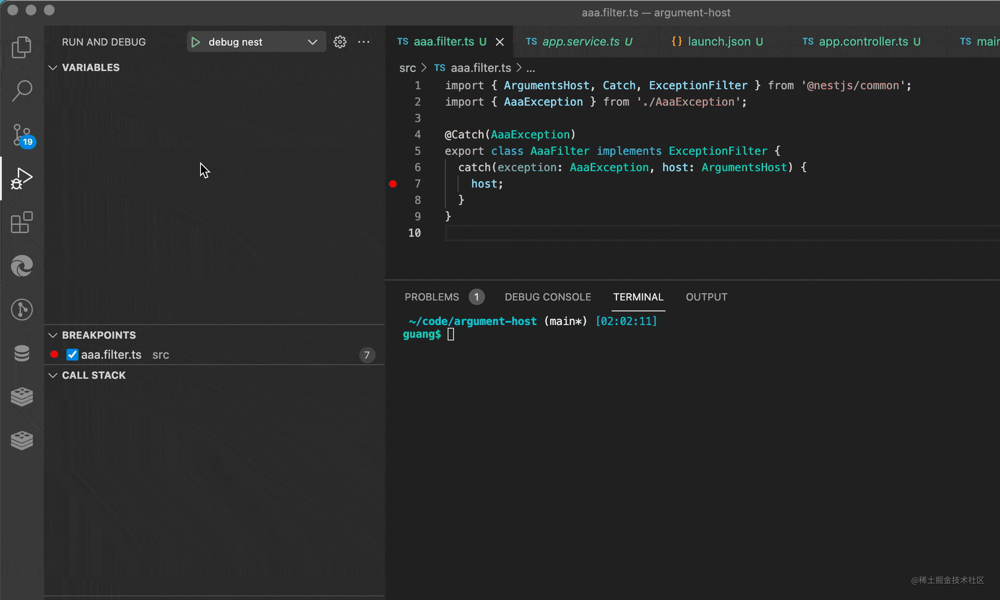

打个断点：

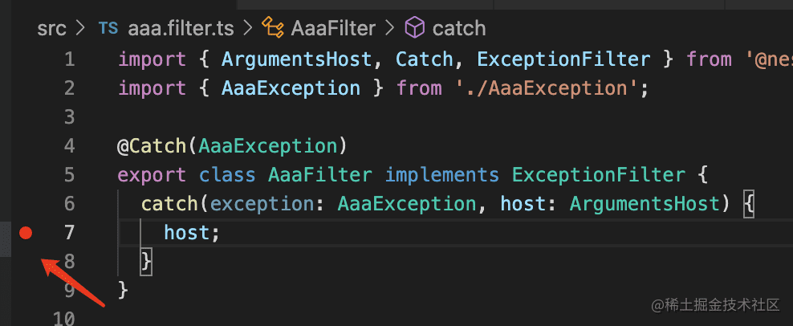

浏览器访问 <http://localhost:3000> 就可以看到它断住了：


我们分别调用下这些方法试试：

在 debug console 输入 host，可以看到它有这些属性方法：

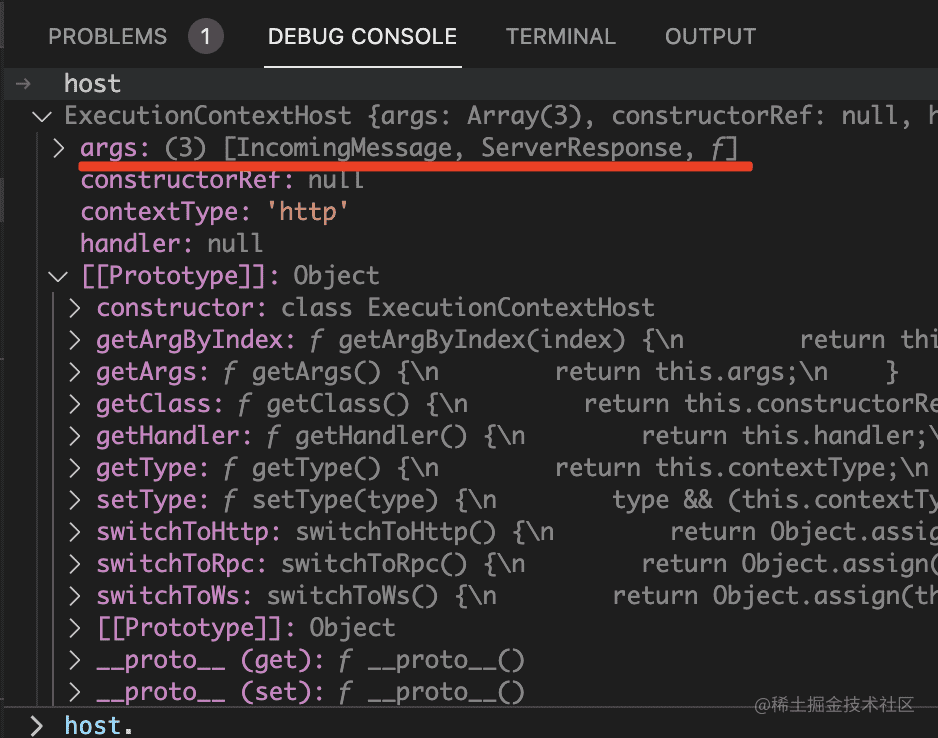

host.getArgs 方法就是取出当前上下文的 reqeust、response、next 参数。

因为当前上下文是 http。

host.getArgByIndex 方法是根据下标取参数：


这种按照下标取参数的写法不太建议用，因为不同上下文参数不同，这样写就没法复用到 ws、tcp 等上下文了。

一般是这样来用：

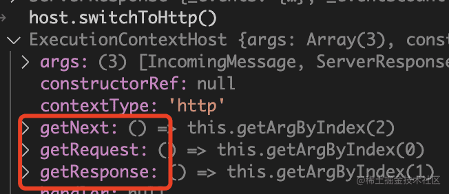

如果是 ws、基于 tcp 的微服务等上下文，就分别调用 host.swtichToWs、host.switchToRpc 方法。

这样，就可以在 filter 里处理多个上下文的逻辑，跨上下文复用 filter了。

比如这样：

```javascript
import { ArgumentsHost, Catch, ExceptionFilter } from '@nestjs/common';
import { Response } from 'express';
import { AaaException } from './AaaException';

@Catch(AaaException)
export class AaaFilter implements ExceptionFilter {
  catch(exception: AaaException, host: ArgumentsHost) {
    if(host.getType() === 'http') {
      const ctx = host.switchToHttp();
      const response = ctx.getResponse<Response>();
      const request = ctx.getRequest<Request>();

      response
        .status(500)
        .json({
          aaa: exception.aaa,
          bbb: exception.bbb
        });
    } else if(host.getType() === 'ws') {

    } else if(host.getType() === 'rpc') {

    }
  }
}
```

刷新页面，就可以看到 filter 返回的响应：


所以说，**ArgumentHost 是用于切换 http、ws、rpc 等上下文类型的，可以根据上下文类型取到对应的 argument**。

那 guard 和 interceptor 里呢？


## Guard

我们创建个 guard 试一下：`nest g filter aaa --flat --no-spec`

可以看到它传入的是 ExecutionContext：

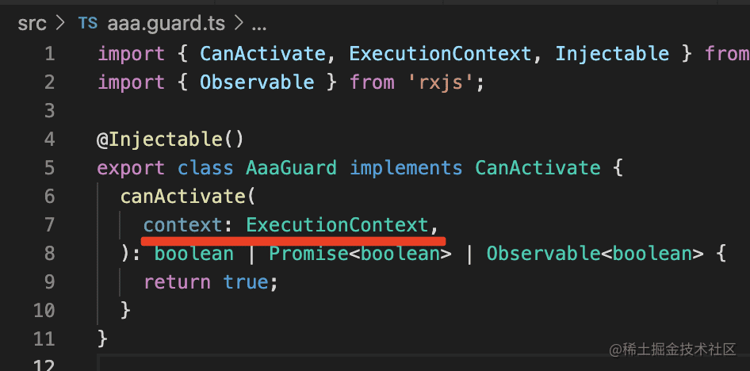

有这些方法：

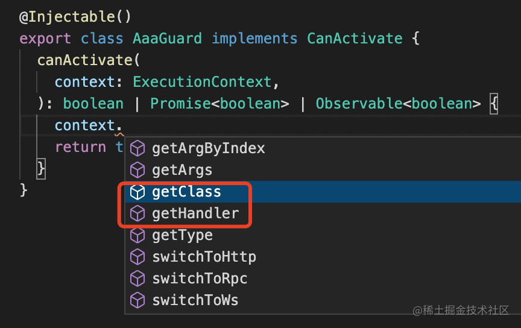

是不是很眼熟？

没错，ExecutionContext 是 ArgumentHost 的子类，扩展了 getClass、getHandler 方法。

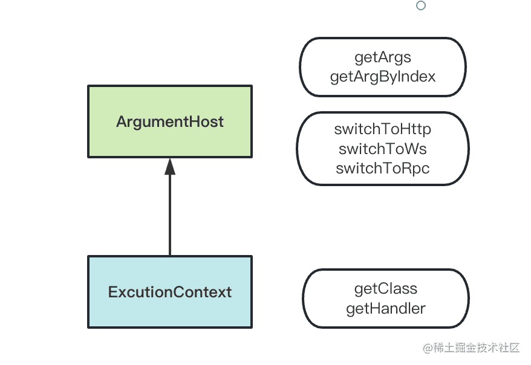

多加这两个方法是干啥的呢？

我们调试下看看：

路由级别启用 Guard：

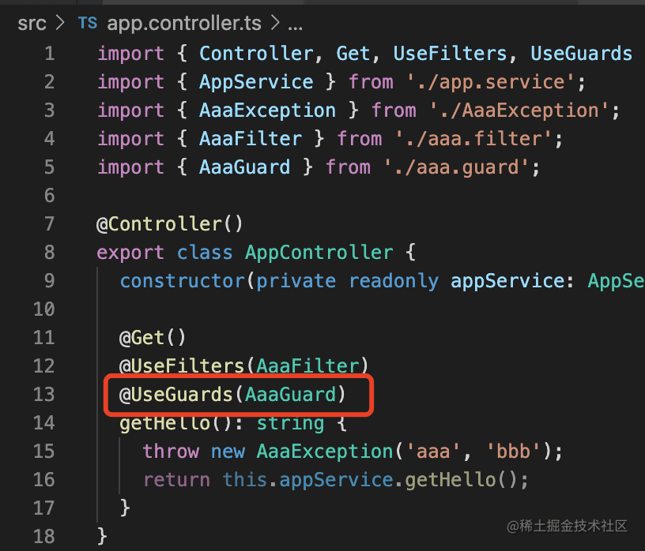

在 Guard 里打个断点：

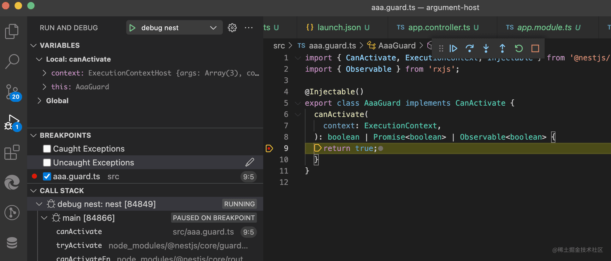

调用下 context.getClass 和 getHandler：

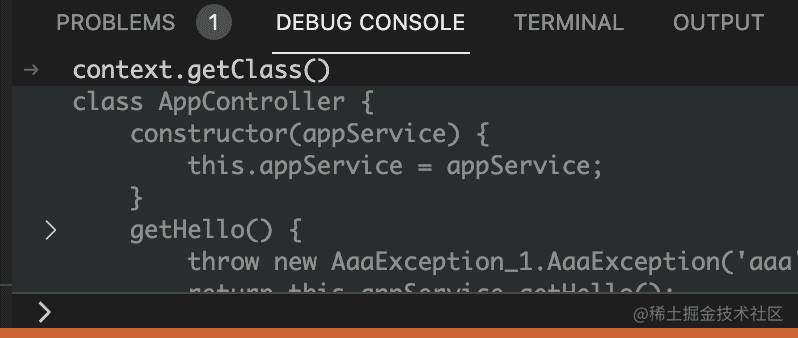


会发现这俩分别是要调用的 controller 的 class 以及要调用的方法。

为什么 ExecutionContext 里需要多出这俩方法呢？

因为 Guard、Interceptor 的逻辑可能要根据目标 class、handler 有没有某些装饰而决定怎么处理。

比如权限验证的时候，我们会先定义几个角色：

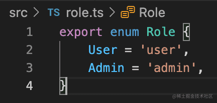

然后定义这样一个装饰器：


它的作用是往修饰的目标上添加 roles 的 metadata。

然后在 handler 上添加这个装饰器，参数为 admin，也就是给这个 handler 添加了一个 roles 为 admin 的metadata。

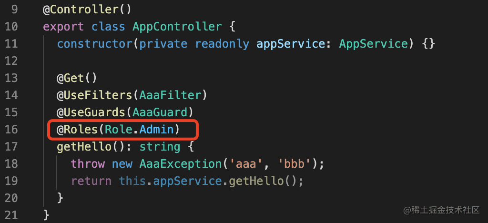

这样在 Guard 里就可以根据这个 metadata 决定是否放行了：

```javascript
import { CanActivate, ExecutionContext, Injectable } from '@nestjs/common';
import { Reflector } from '@nestjs/core';
import { Observable } from 'rxjs';
import { Role } from './role';

@Injectable()
export class AaaGuard implements CanActivate {
  constructor(private reflector: Reflector) {}

  canActivate(
    context: ExecutionContext,
  ): boolean | Promise<boolean> | Observable<boolean> {

    const requiredRoles = this.reflector.get<Role[]>('roles', context.getHandler());

    if (!requiredRoles) {
      return true;
    }

    const { user } = context.switchToHttp().getRequest();
    return requiredRoles.some((role) => user && user.roles?.includes(role));
  }
}
```

这里我需要 Nest 注入 reflector，但并不需要在模块的 provider 声明。

guard、interceptor、middleware、pipe、filter 都是 Nest 的特殊 class，当你通过 @UseXxx 使用它们的时候，Nest 就会扫描到它们，创建对象它们的对象加到容器里，就已经可以注入依赖了。

刷新页面，可以看到返回的是 403：


这说明 Guard 生效了。

这就是 Guard 里的 ExecutionContext 参数的用法。


## interceptor

同样，在 interceptor 里也有这个：`nest g interceptor aaa --no-spec --flat`


同样可以通过 reflector 取出 class 或者 handler 上的 metdadata。

案例代码在[小册仓库](https://github.com/QuarkGluonPlasma/nestjs-course-code/tree/main/argument-host)。


## 总结

为了让 Filter、Guard、Exception Filter 支持 http、ws、rpc 等场景下复用，Nest 设计了 ArgumentHost 和 ExecutionContext 类。

ArgumentHost 可以通过 getArgs 或者 getArgByIndex 拿到上下文参数，比如 request、response、next 等。

更推荐的方式是根据 getType 的结果分别 switchToHttp、switchToWs、swtichToRpc，然后再取对应的 argument。

而 ExecutionContext 还提供 getClass、getHandler 方法，可以结合 reflector 来取出其中的 metadata。

在写 Filter、Guard、Exception Filter 的时候，是需要用到这些 api 的。