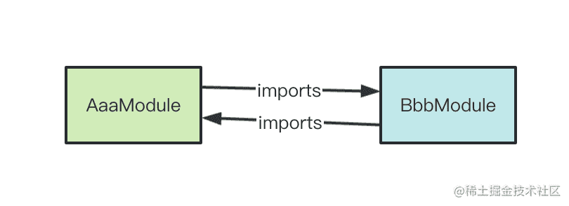

## Module循环引用

Nest 实现了一套模块系统，模块可以通过 imports 声明对其他模块的引用。

那 Module 和 Module 如果相互引用、形成循环依赖了怎么办？

这节我们就来学习下循环依赖的处理方式。

执行`nest new module-test -p npm`创建一个 nest 项目。

然后执行

```
nest g module aaa
nest g module bbb
```

创建两个 Module。


然后这两个 Module 相互引用。


这时候你执行`nest start -w`

把服务跑起来，会报这样的错误：


意思是在解析 BbbModule 的时候，它的第一个 imports 是 undefined。

这有两个原因，一个是这个值本来就是 undefined，第二个就是形成了循环依赖。

因为 Nest 创建 Module 的时候会递归创建它的依赖，而它的依赖又依赖了这个 Module，所以没法创建成功，拿到的就是 undefined。



那怎么办呢？

其实我们可以先单独创建这两个 Module，然后再让两者关联起来。

也就是用 forwardRef 的方式：


因为我们用了 nest start --watch 的方式启动的，nest 会自动重启，这时候就没有错误了：


nest 会单独创建两个 Module，之后再把 Module 的引用转发过去，也就是 forwardRef 的含义。


## provider循环引用

除了 Module 和 Module 之间会循环依赖以外，provider 之间也会。

比如 Service 里可以注入别的 Service，自身也可以用来注入。

所以也会有循环引用。

我们来测试下：

```
nest g service ccc --no-spec --flat
nest g service ddd --no-spec --flat
```

分别创建 ccc 和 ddd 两个 service，--no-spec 是不生成测试文件，--flat 是平铺。

就会创建这两个 service，并在 AppModule 引入了：


然后我们让两者相互注入：

```javascript
import { Injectable } from '@nestjs/common';
import { CccService } from './ccc.service';

@Injectable()
export class DddService {
    constructor(private cccService: CccService) {}

    ddd() {
        return this.cccService.ccc()  + 'ddd';
    }
}
```

```javascript
import { Injectable } from '@nestjs/common';
import { DddService } from './ddd.service';

@Injectable()
export class CccService {
    constructor(private dddService: DddService) {}

    ccc() {
        return 'ccc';
    }

    eee() {
        return this.dddService.ddd() + 'eee';
    }
}
```

两个 service 分别依赖了对方的方法。

在 AppService 里调用下：

```javascript
import { Injectable } from '@nestjs/common';
import { CccService } from './ccc.service';
import { DddService } from './ddd.service';

@Injectable()
export class AppService {
  constructor(private cccService: CccService, private dddService: DddService){}

  getHello(): string {
    return this.dddService.ddd() + this.cccService.eee();
  }
}
```

这时候 nest start --watch 会报错：


说是没法解析 DddService 的依赖，也是因为循环依赖导致的。

这时候也是通过 forwardRef 解决：


这时候就不能用默认的注入方式了，通过 @Inject 手动指定注入的 token，这里是 forwardRef 的方式注入。

这样报错就没了：


浏览器访问下：


两个 service 的相互调用也成功了。

这样我们就解决了循环依赖的问题。

案例代码在[小册仓库](https://github.com/QuarkGluonPlasma/nestjs-course-code/tree/main/circular-dependency)。


## 总结

Module 之间可以相互 imports，Provider 之间可以相互注入，这两者都会形成循环依赖。

解决方式就是两边都用 forwardRef 来包裹下。

它的原理就是 nest 会先创建 Module、Provider，之后再把引用转发到对方，也就是 forward ref。

