Nest 里也有中间件 Middleware 的概念，它和 Express 的 Middleware 是一个东西么？

很像，但不一样。

## Middleware使用

我们创建个项目，边写边看：`nest new middleware-test`

进入项目，执行：`nest g middleware aaa --no-spec --flat`

创建个 middleware：


因为这时候并不知道你用的 express 还是 fastify，所以 request、response 是 any，手动标注下类型就好了：

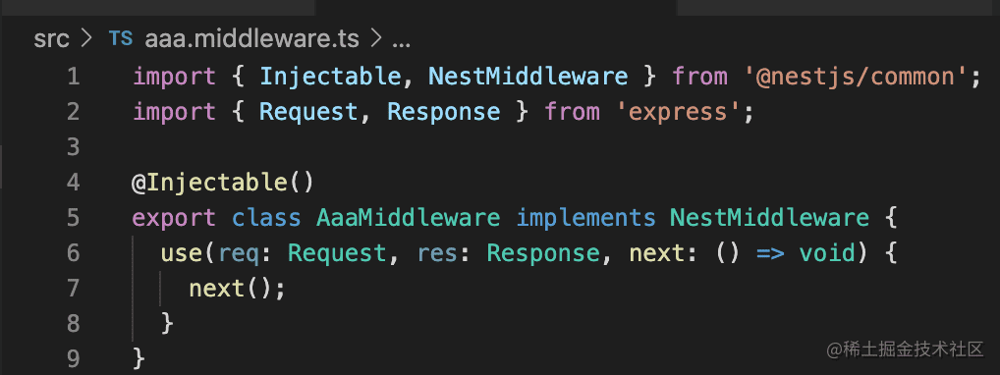

这里是 express 的 request、response。

加一下前后的的逻辑：

```javascript
import { Injectable, NestMiddleware } from '@nestjs/common';
import { Request, Response } from 'express';

@Injectable()
export class AaaMiddleware implements NestMiddleware {
  use(req: Request, res: Response, next: () => void) {
    console.log('brefore');
    next();
    console.log('after');
  }
}
```

然后在 Module 里这样使用：


```javascript
import { AaaMiddleware } from './aaa.middleware';
import { MiddlewareConsumer, Module, NestModule, RequestMethod } from '@nestjs/common';
import { AppController } from './app.controller';
import { AppService } from './app.service';

@Module({
  imports: [],
  controllers: [AppController],
  providers: [AppService],
})
export class AppModule implements NestModule{

  configure(consumer: MiddlewareConsumer) {
    consumer.apply(AaaMiddleware).forRoutes('*');
  }
}

```

实现 NestModule 接口的 configure 方法，在里面应用 AaaMiddleware 到所有路由。

然后跑起来试一下：

    nest start --watch

浏览器访问 <http://localhost:3000>


可以看到中间件的逻辑都执行了：

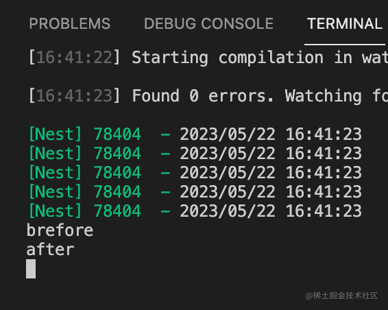

这里也可以指定更精确的路由。

我们添加几个 handler：

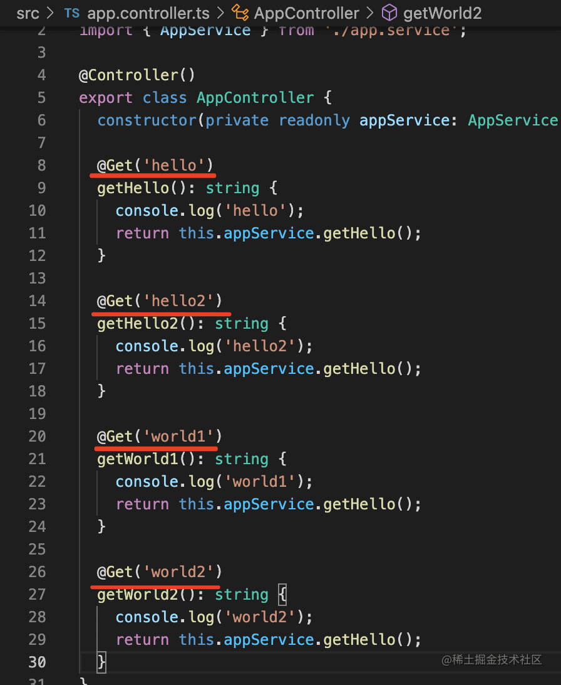

然后重新指定 Middleware 应用的路由：

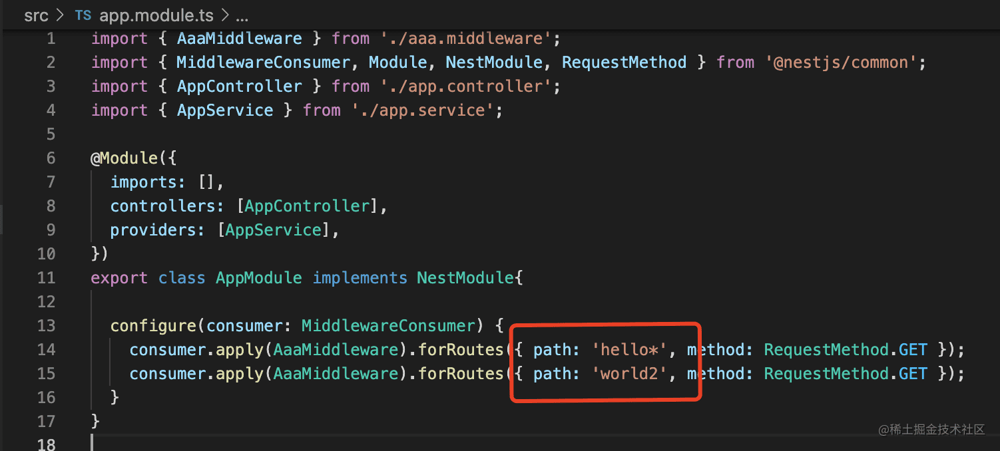

```javascript
import { AaaMiddleware } from './aaa.middleware';
import { MiddlewareConsumer, Module, NestModule, RequestMethod } from '@nestjs/common';
import { AppController } from './app.controller';
import { AppService } from './app.service';

@Module({
  imports: [],
  controllers: [AppController],
  providers: [AppService],
})
export class AppModule implements NestModule{

  configure(consumer: MiddlewareConsumer) {
    consumer.apply(AaaMiddleware).forRoutes({ path: 'hello*', method: RequestMethod.GET });
    consumer.apply(AaaMiddleware).forRoutes({ path: 'world2', method: RequestMethod.GET });
  }
}
```

可以看到，hello、hello2、world2 的路由都调用了这个中间件，而 world1 没有：

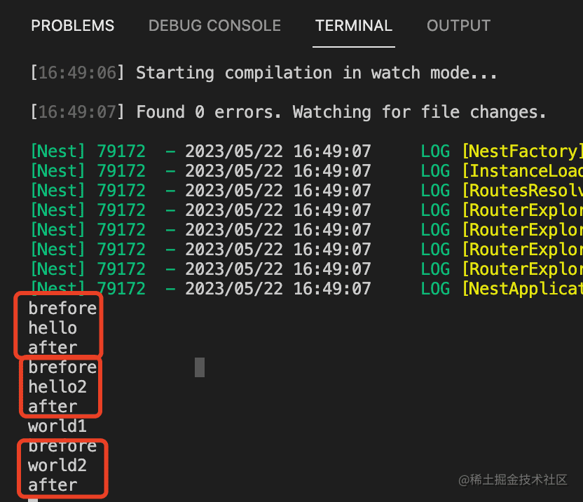

这就是 Nest 里 middleware 的用法。

如果只是这样，那和 Express 的 middleware 差别并不大，无非是变成了 class 的方式。


## Nest 为什么要把 Middleware 做成 class 呢？

当然是为了依赖注入了！

我们通过 @Inject 注入 AppService 到 middleware 里：

```javascript
import { AppService } from './app.service';
import { Inject, Injectable, NestMiddleware } from '@nestjs/common';
import { Request, Response } from 'express';

@Injectable()
export class AaaMiddleware implements NestMiddleware {
  @Inject(AppService)
  private readonly appService: AppService;

  use(req: Request, res: Response, next: () => void) {
    console.log('brefore');
    console.log('-------' + this.appService.getHello());
    next();
    console.log('after');
  }
}
```

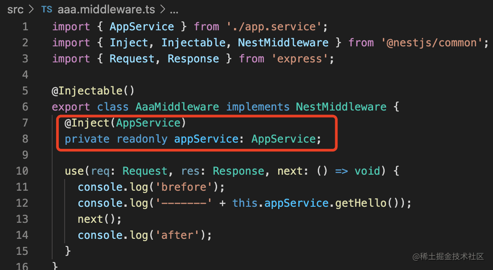

当然，这里也可以用构造器注入，这样更简洁一点：

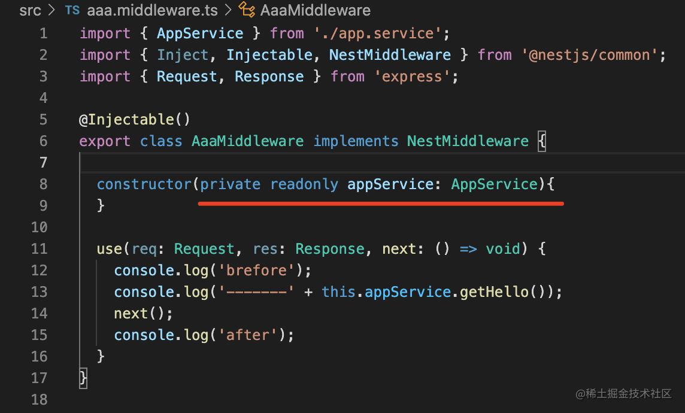

这时在访问这个路由的时候，就可以看到中间件成功调用了 AppService：

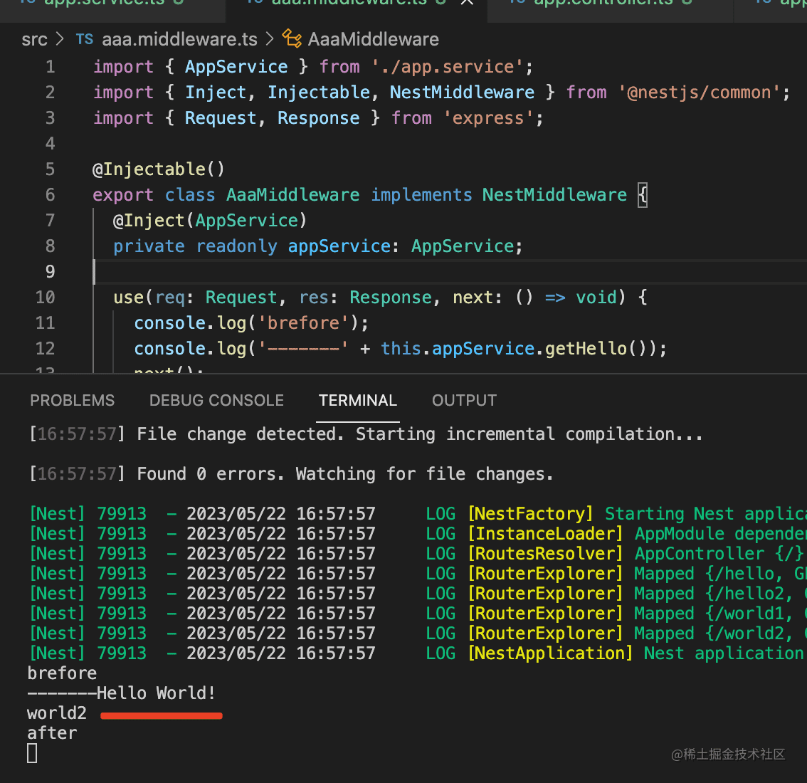

这就是 Nest 注入的依赖。

如果不注入依赖，那写函数的方式也是可以的。

看这个 apply 方法的类型声明也可以看出来：


如果不需要注入依赖，那可以写函数形式的 middleware，这时候和 Express 的 middleware 就没啥区别了。

如果需要注入依赖，那就写 class 形式的 middleware，可以用 Nest 的依赖注入能力。

当然，应用实例对象也可以 use 中间件，这个就和 express 那个一样了：

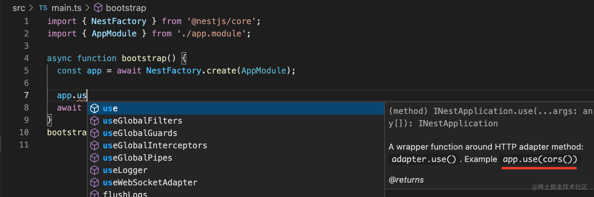

不过这种形式不能注入依赖，而且也不能配置应用到什么路由，不建议用。

app.use 等同于在 AppModule 的 configure 方法里的 forRoutes('\*')


## next参数与@Next 装饰器的区别

此外，middleware 里有个 next 参数，而 Nest 还有个 @Next 装饰器，这俩的区别是什么呢？

middleware 的 next 参数就是调用下一个 middleware 的，这个很好理解。

而 @Next 装饰器是调用下一个 handler 的：

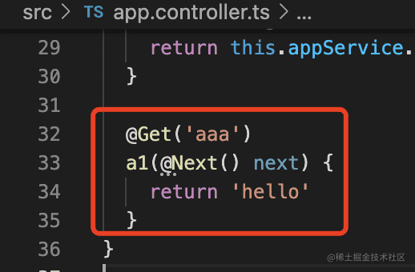

但如果是这样一个 handler，它就不返回值了：


这个和加上 @Response 装饰器的时候的效果一样。

因为 Nest 认为你会自己返回响应或者调用下个 handler，就不会处理返回值了。

如果依然想让 Nest 把函数返回值作为响应，可以这样写：


这个上节讲过。

当然，传入 Next 参数的时候，一般是不需要在这里响应的，一般是调用下个 handler 来响应：

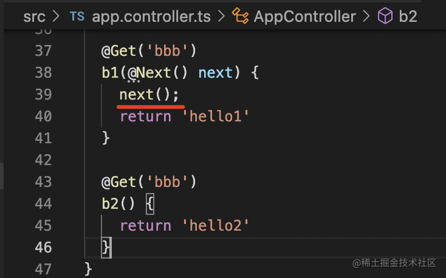


不过一般也不需要这样写，直接写在一个 handler 里就行。

有的同学可能会问：Nest 的 middleware 和 interceptor 都是在请求前后加入一些逻辑的，这俩区别是啥呢？

区别有两点：

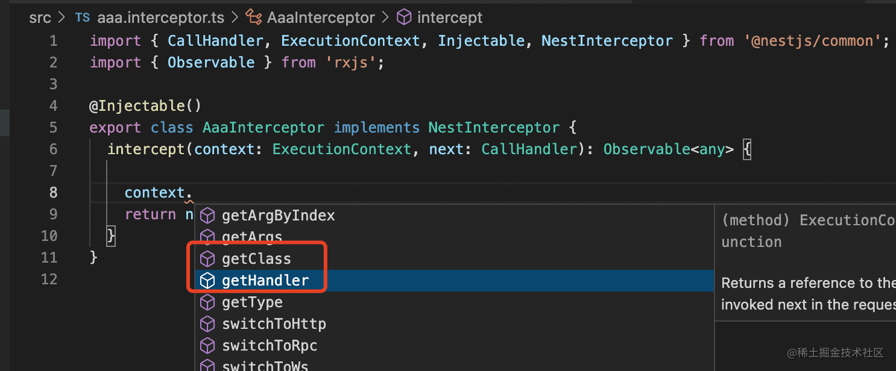

interceptor 是能从 ExecutionContext 里拿到目标 class 和 handler，进而通过 reflector 拿到它的 metadata 等信息的，这些 middleware 就不可以。

再就是 interceptor 里是可以用 rxjs 的操作符来组织响应处理流程的：

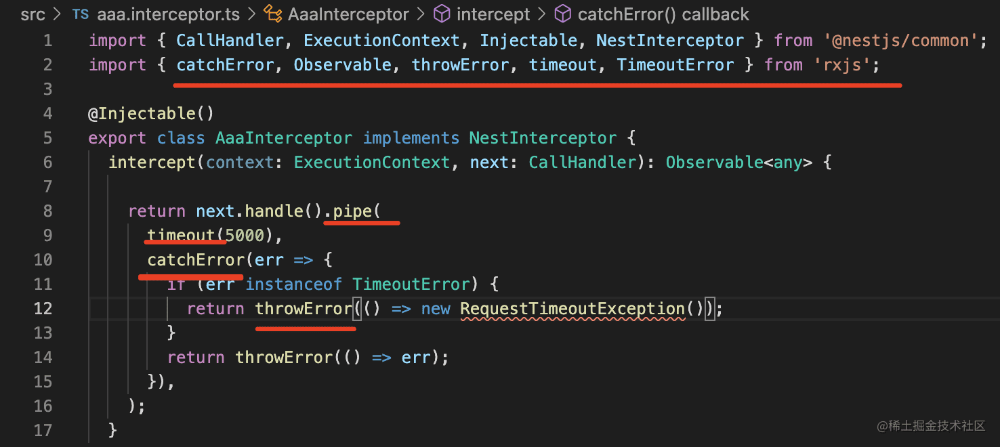

middleware 里也不可以。

它们都是 Nest AOP 思想的实现，但是 interceptor 更适合处理与具体业务相关的逻辑，而 middleware 适合更通用的处理逻辑。

案例代码在[小册仓库](https://github.com/QuarkGluonPlasma/nestjs-course-code/tree/main/midleware-test)。


## 总结

Nest 也有 middleware，但是它不是 Express 的 middleware，虽然都有 request、response、next 参数，但是它可以从 Nest 的 IOC 容器注入依赖，还可以指定作用于哪些路由。

用法是 Module 实现 NestModule 的 configure 方法，调用 apply 和 forRoutes 指定什么中间件作用于什么路由。

app.use 也可以应用中间件，但更建议在 AppModule 里的 configure 方法里指定。

Nest 还有个 @Next 装饰器，这个是用于调用下个 handler 处理的，当用了这个装饰器之后，Nest 就不会把 handler 返回值作为响应了。

middleware 和 interceptor 功能类似，但也有不同，interceptor 可以拿到目标 class、handler 等，也可以调用 rxjs 的 operator 来处理响应，更适合处理具体的业务逻辑。

middleware 更适合处理通用的逻辑。