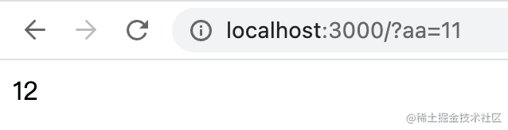
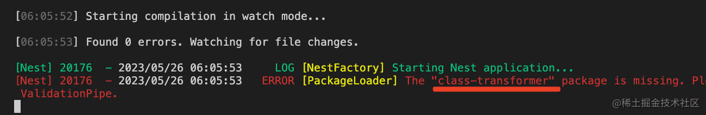
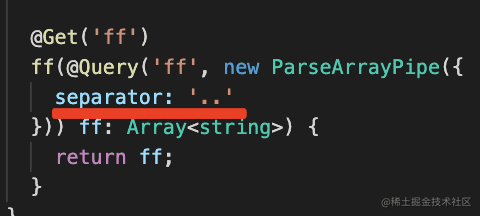
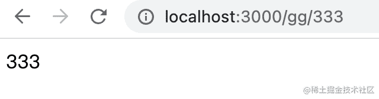
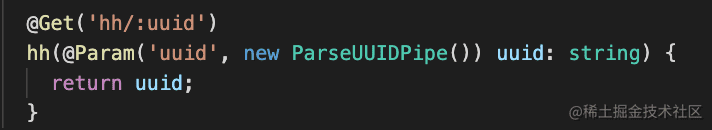
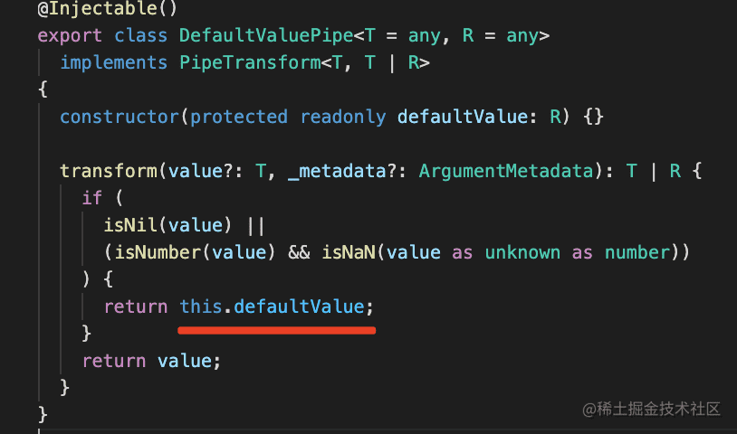

## Pipe介绍

Pipe 是在参数传给 handler 之前对参数做一些验证和转换的 class，

对应的源码如下：

对每个参数都会应用 pipe：

内置的 Pipe 有这些：

*   ValidationPipe
*   ParseIntPipe
*   ParseBoolPipe
*   ParseArrayPipe
*   ParseUUIDPipe
*   DefaultValuePipe
*   ParseEnumPipe
*   ParseFloatPipe
*   ParseFilePipe

它们都实现了 PipeTransform 接口：

比如 ParseIntPipe 的源码是这样的：

我们分别来试下内置的 Pipe 的功能吧。

创建个项目：`nest new pipe-test -p npm`

## ParseIntPipe

参数默认是 string 类型：

我们可以通过 Pipe 把它转为整数：

效果如下：

当你传入的参数不能 parse 为 int 时，会返回这样的响应：

这个也是可以修改的，但要使用 new XxxPipe 的方式：

比如我指定错误时的状态码为 404。

就会返回这样的响应。

此外，你还可以自己抛一个异常出来，然后让 exception filter 处理：

可以看到，状态码和 message 都改了：

你也可以加个 @UseFilters 来使用自己的 exception filter 处理。

## ParseFloatPipe

ParseFloatPipe 是把参数转换为 float 类型的。

它也同样可以 new ParseFloatPipe 的形式，传入 errorHttpStatusCode 和 exceptionFactory。

剩下这些与 parse 有关的 pipe 我们都试一下：

## ParseBoolPipe

ParseBoolPipe：

## ParseArrayPipe

ParseArrayPipe：

这时会提示需要 class-validator 这个包：

这是可以用装饰器和非装饰器两种方式对 class 属性做验证的库

还会提示需要 class-transformer 这个包：

它是把普通对象转换为对应的 class 实例的包：

后面我们也会用到这俩包。

安装这俩包：

    npm install -D class-validator class-transformer

然后访问下：

你会发现它确实把每一项都提取出来了，但是没有转为 number。

这时候就需要用 new XxxPipe 的方式传入参数了：

指定 item 的类型。

这样就把数组每一项处理为 number 了。

此外，你还可以指定分隔符：

当没有传参数的时候会报错：

可以把它设置为 optional：

## ParseEnumPipe

然后是 ParseEnumPipe：

假设我们有这样一个枚举：

就可以用 ParseEnumPipe 来取：

有同学说，这不是多此一举么，本来 @Param 也能把它取出来呀。

ParseEnumPipe 还是有用的：

第一个是可以限制参数的取值范围：

如果参数值不是枚举里的，就会报错。

这个错误自然也可以通过 errorHttpStatusCode 和 exceptionFactory 来定制。

第二个是帮你转换类型：

这里拿到的就直接是枚举类型了，如果有个方法的参数是这样的枚举类型，就可以直接传入。

## ParseUUIDPipe

接下来是 ParseUUIDPipe：

UUID 是一种随机生成的几乎不可能重复的字符串，可以用来做 id。

它有 v3、v4、v5 3 个版本，我们用 uuid 包可以生成这种 id：

在参数里，可以用 ParseUUIDPipe 来校验是否是 UUID：

如果不是 uuid 会抛异常：

## DefaultValuePipe

接下来是 DefaultValuePipe：

这个是设置参数默认值的：

当你没传参数的时候，会使用默认值：

它的源码也很简单：

还剩下 ValidationPipe 和 ParseFilePipe，这个我们之后再讲。

## 自定义Pipe

接下来我们自己实现个 Pipe 试一下：

    nest g pipe aaa --flat --no-spec

生成一个 pipe，打印下参数值，返回 aaa：

在 handler 里用下：

浏览器访问这个接口：

返回的值是 aaaaaa，也就是说 pipe 的返回值就是传给 handler 的参数值。

打印的 value 就是 query、param 的值，而 metadata 里包含 type、metatype、data：

type 就是 @Query、@Param、@Body 装饰器，或者自定义装饰器：

而 metatype 是参数的 ts 类型：

data 是传给 @Query、@Param、@Body 等装饰器的参数。

有了这些东西，做一下验证，抛出异常给 exception filter 处理，或者对 value 做些转换再传给 handler 就都是很简单的事情了。

案例代码在[小册仓库](https://github.com/QuarkGluonPlasma/nestjs-course-code/tree/main/pipe-test)。

## 总结

Pipe 是在参数传给 handler 之前做一些验证和转换的，有 9 个内置的 Pipe 可以直接用。

我们过了一遍内置的 ParseIntPipe、ParseBoolPipe、ParseArrayPipe、ParseUUIDPipe、ParseEnumPipe、ParseFloatPipe 还有 DefaultValuePipe。

剩下的 ValidationPipe 和 ParseFilePipe 之后的章节讲。

自己写一个 pipe 也很简单，就是实现 PipeTransform 接口的 transform 方法，它的返回值就是传给 handler 的值。

在 pipe 里可以拿到装饰器和 handler 参数的各种信息，基于这些来实现校验和转换就是很简单的事情了。