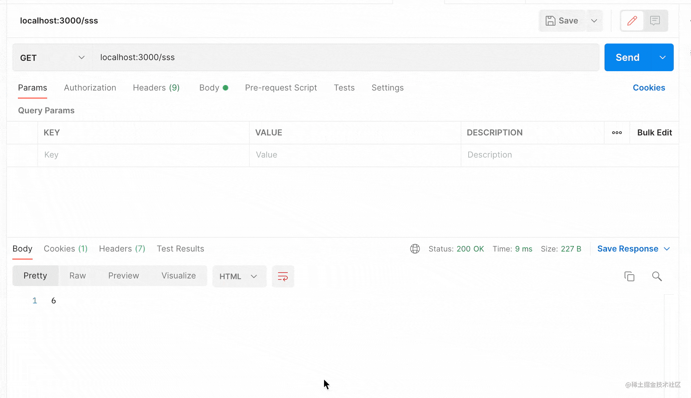
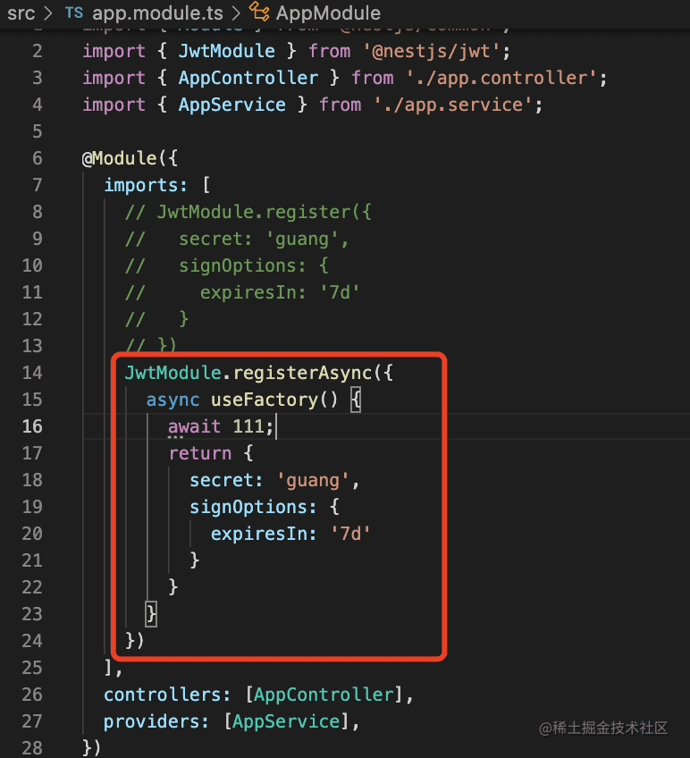
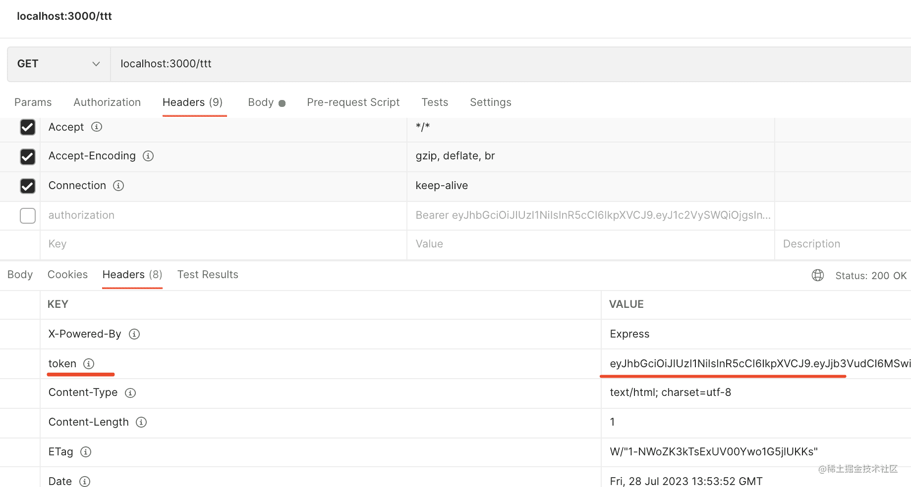
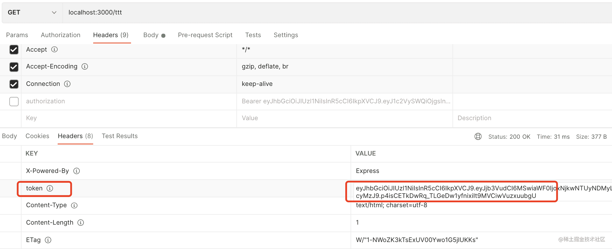
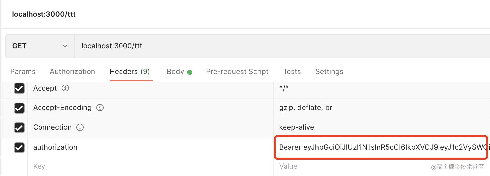
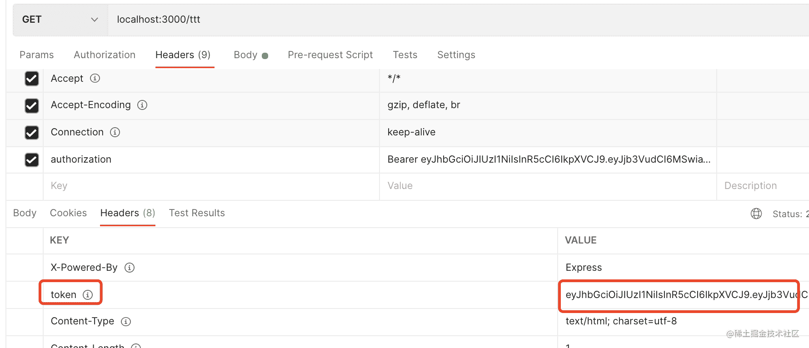
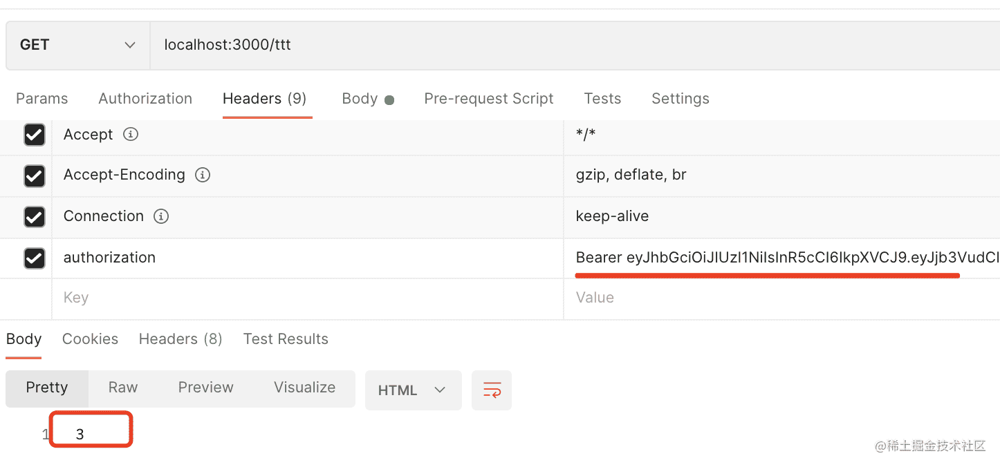
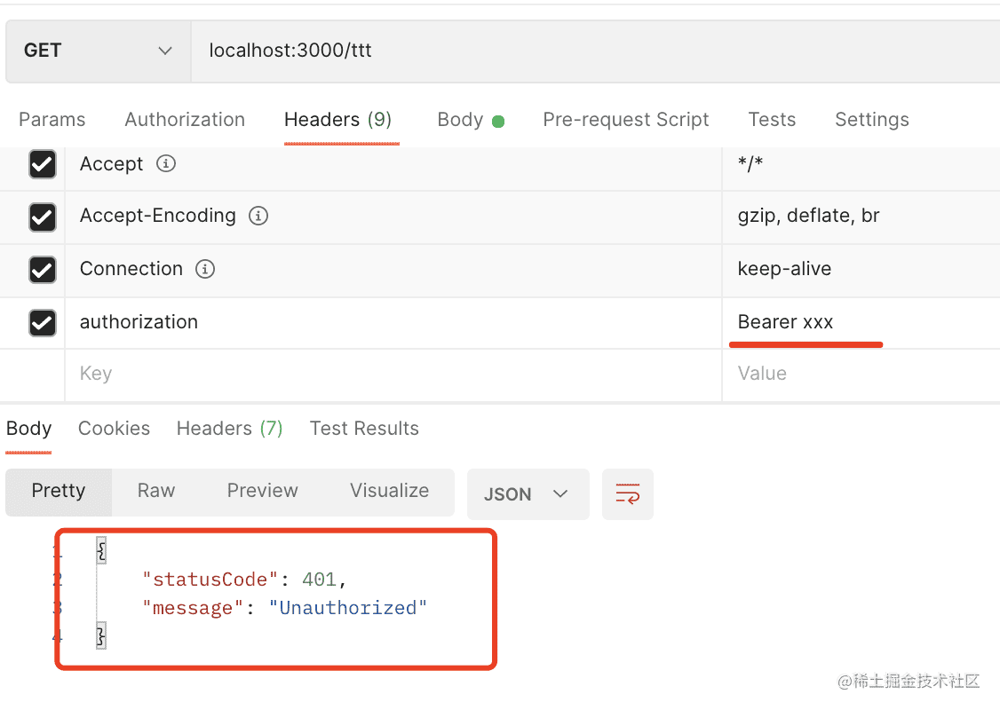
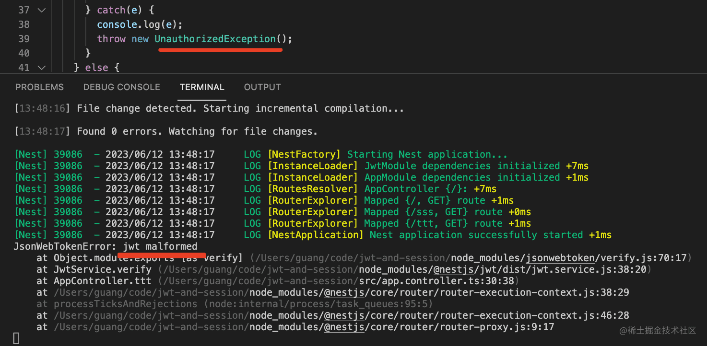

上节我们知道了保存登录状态的两种方式，session + cookie、jwt，这节我们用 Nest 来实现下吧。

首先用 @nest/cli 快速创建一个 Nest.js 项目

    nest new jwt-and-session -p npm


## session  + cookie

我们先实现 session  + cookie 的方式：

Nest 里实现 session 实现还是用的 express 的中间件 express-session。

安装 express-session 和它的 ts 类型定义：

    npm install express-session @types/express-session

然后在入口模块里启用它：

```javascript
import { NestFactory } from '@nestjs/core';
import { AppModule } from './app.module';
import * as session from 'express-session';

async function bootstrap() {
  const app = await NestFactory.create(AppModule);

  app.use(session({
    secret: 'guang',
    resave: false,
    saveUninitialized: false
  }));
  await app.listen(3000);
}
bootstrap();

```

使用 express-session 中间件，指定加密的密钥 secret。

resave 为 true 是每次访问都会更新 session，不管有没有修改 session 的内容，而 false 是只有 session 内容变了才会去更新 session。

saveUninitalized 设置为 true 是不管是否设置 session，都会初始化一个空的 session 对象。比如你没有登录的时候，也会初始化一个 session 对象，这个设置为 false 就好。

然后在 controller 里就可以注入 session 对象：

```javascript
@Get('sss')
sss(@Session() session) {
    console.log(session)
    session.count = session.count ? session.count + 1 : 1;
    return session.count;
}
```

我在 session 里放了个 count 的变量，每次访问加一，然后返回这个 count。

这样就可以判断 http 请求是否有了状态。

把它跑起来：

    nest start --watch


然后用 postman 测试下：



可以看到每次请求返回的数据都不同，而且返回了一个 cookie 是 connect.sid，这个就是对应 session 的 id。

因为 cookie 在请求的时候会自动带上，就可以实现请求的标识，给 http 请求加上状态。


## JWT

session + cookie 的方式用起来还是很简单的，我们再来看下 jwt 的方式：

jwt 需要引入 @nestjs/jwt 这个包

    npm install @nestjs/jwt

然后在 AppModule 里引入 JwtModule：

```javascript
import { Module } from '@nestjs/common';
import { JwtModule } from '@nestjs/jwt';
import { AppController } from './app.controller';
import { AppService } from './app.service';

@Module({
  imports: [
    JwtModule.register({
      secret: 'guang',
      signOptions: {
        expiresIn: '7d'
      }
    })
  ],
  controllers: [AppController],
  providers: [AppService],
})
export class AppModule {}

```

JwtModule 是一个动态模块，通过 register 传入 option。

或者是 registerAsync，然后通过 useFactory 异步拿到 option 传入：



这部分是动态模块的知识，忘了的同学可以看看动态模块那节。

指定 secret，也就是加密 jwt 的密钥，还有 token 过期时间 expiresIn，设置 7 天。

然后在 controller 里注入 JwtModule 里的 JwtService：


然后添加一个 handler：

```javascript
@Get('ttt')
ttt(@Res({ passthrough: true}) response: Response) {
    const newToken = this.jwtService.sign({
      count: 1
    });

    response.setHeader('token', newToken);
    return 'hello';
}
```

这里使用 jwtService.sign 来生成一个 jwt token，放到 response header 里。

因为注入 response 对象之后，默认不会把返回值作为 body 了，需要设置 passthrough 为 true 才可以。

然后访问下试试看：



可以看到，返回的响应确实带上了这个 header。

后面的请求需要带上这个 token，在服务端取出来，然后 +1 之后再放回去：

```javascript
@Get('ttt')
ttt(@Headers('authorization') authorization: string, @Res({ passthrough: true}) response: Response) {
    if(authorization) {
      try {
        const token = authorization.split(' ')[1];
        const data = this.jwtService.verify(token);

        const newToken = this.jwtService.sign({
          count: data.count + 1
        });
        response.setHeader('token', newToken);
        return data.count + 1
      } catch(e) {
        console.log(e);
        throw new UnauthorizedException();
      }
    } else {
      const newToken = this.jwtService.sign({
        count: 1
      });

      response.setHeader('token', newToken);
      return 1;
    }
}
```

通过 @Headers 装饰器取出 autorization 的 header，然后通过 jwtService.verify 对它做验证。

如果验证失败，那就抛出 UnauthorizedException 异常，让 Nest 内置的 Exception Filter 来处理。

验证成功就重新生成 jwt 放到 header 里返回。

如果没有 autorization 的 header，那就生成一个 jwt 放到 header 里返回。

然后我们测试下。

第一次访问，会返回 jwt token，把它复制下来：



放到请求的 header 里：



这时候响应为 2，并且返回一个新的 token：



把它复制下来放到 header 里再次请求：



这时候返回的就是 3 了。

这就是通过 jwt 保存状态的方式。

那我们带一个错误的 token 呢？



这时候 jwtService.verify 方法就会抛异常，然后我们返回了 401 错误。



这样，我们就分别用 Nest 分别实现了 session + cookie 和 jwt 两种保存 http 状态的方式。

**携带 jwt 需要加载 authorization 的 header 里，以 Bearer xxx 的格式，但是返回 jwt 可以放在任何地方，header、cookie 或者 body 里都可以。**

案例代码在[小册仓库](https://github.com/QuarkGluonPlasma/nestjs-course-code/tree/main/jwt-and-session)。


## 总结

我们分别在 nest 里实现了 session、jwt 两种给 http 添加状态的方式。

session 使用的是 express 的 express-session 中间件，通过 @Session 装饰器取出来传入 controller 里。

jwt 需要引入 @nestjs/jwt 包的 JwtModule，注入其中的 JwtService，然后通过 jwtService.sign 生成 token，通过 jwtService.verify 验证 token。

token 放在 authorization 的 header 里。

session 或者 jwt 都是非常常用的给 http 添加状态的方式，下节我们用这两种方式实现下登录注册功能。