## RABL鉴权

上节实现了基于 ACL 的权限控制，这节来实现 RBAC 权限控制。

RBAC 是 Role Based Access Control，基于角色的权限控制。

上节我们学的 ACL 是这样的：

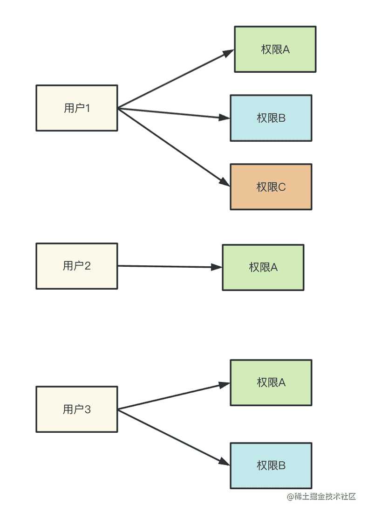

直接给用户分配权限。

而 RBAC 是这样的：

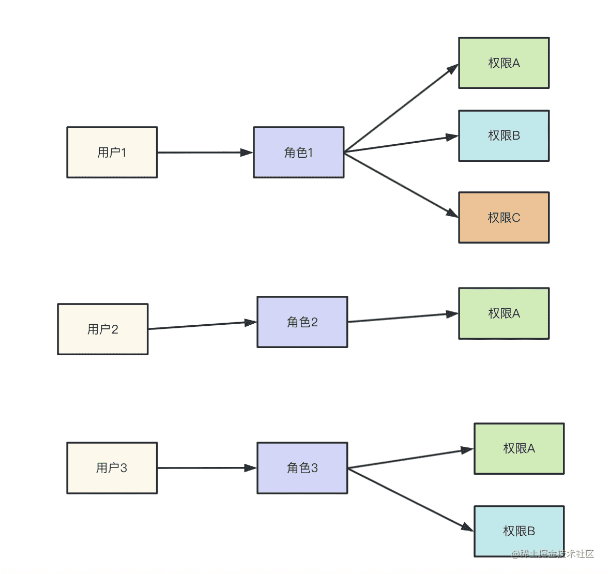

给角色分配权限，然后给用户分配角色。

这样有什么好处呢？

比如说管理员有 aaa、bbb、ccc 3 个权限，而张三、李四、王五都是管理员。

有一天想给管理员添加一个 ddd 的权限。

如果给是 ACL 的权限控制，需要给张三、李四、王五分别分配这个权限。

而 RBAC 呢？

只需要给张三、李四、王五分配管理员的角色，然后只更改管理员角色对应的权限就好了。

所以说，当用户很多的时候，给不同的用户分配不同的权限会很麻烦，这时候我们一般会先把不同的权限封装到角色里，再把角色授予用户。

下面我们就用 Nest 实现一下 RBAC 权限控制吧。

创建 rbac_test 的 database：`CREATE DATABASE rbac_test DEFAULT CHARACTER SET utf8mb4`

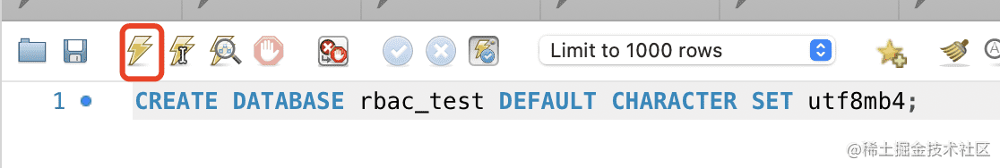

可以看到创建出的 database：

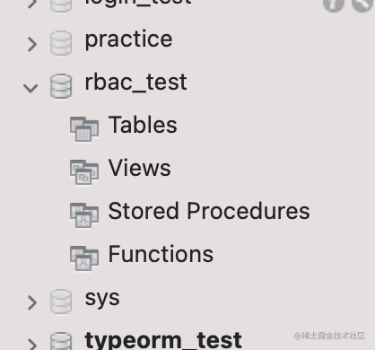

然后创建 nest 项目：`nest new rbac-test -p npm`

安装 typeorm 的依赖：`npm install --save @nestjs/typeorm typeorm mysql2`

在 AppModule 引入 TypeOrmModule：

```javascript
import { Module } from '@nestjs/common';
import { TypeOrmModule } from '@nestjs/typeorm';
import { AppController } from './app.controller';
import { AppService } from './app.service';

@Module({
  imports: [ 
    TypeOrmModule.forRoot({
      type: "mysql",
      host: "localhost",
      port: 3306,
      username: "root",
      password: "guang",
      database: "rbac_test",
      synchronize: true,
      logging: true,
      entities: [],
      poolSize: 10,
      connectorPackage: 'mysql2',
      extra: {
          authPlugin: 'sha256_password',
      }
    }),
  ],
  controllers: [AppController],
  providers: [AppService],
})
export class AppModule {}
```

然后添加创建 user 模块：`nest g resource user`

添加 User、Role、Permission 的 Entity：


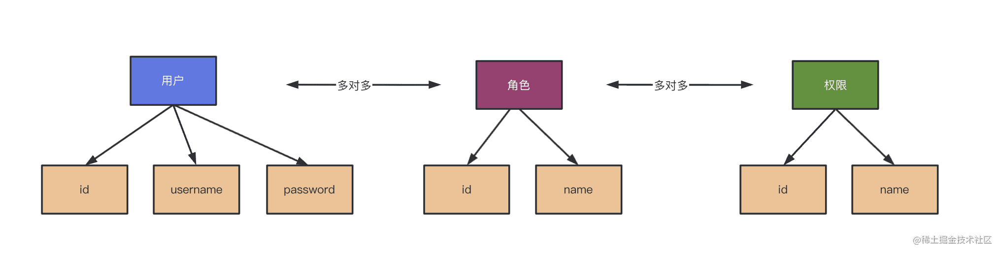

用户、角色、权限都是多对多的关系。

```javascript
import { Column, CreateDateColumn, Entity, PrimaryGeneratedColumn, UpdateDateColumn } from "typeorm";

@Entity()
export class User {
    @PrimaryGeneratedColumn()
    id: number;

    @Column({
        length: 50
    })
    username: string;

    @Column({
        length: 50
    })
    password: string;

    @CreateDateColumn()
    createTime: Date;

    @UpdateDateColumn()
    updateTime: Date;
    
    @ManyToMany(() => Role)
    @JoinTable({
        name: 'user_role_relation'
    })
    roles: Role[] 
}
```

User 有 id、username、password、createTime、updateTime 5 个字段。

通过 @ManyToMany 映射和 Role 的多对多关系，并指定中间表的名字。

然后创建 Role 的 entity：

```javascript
import { Column, CreateDateColumn, Entity,PrimaryGeneratedColumn, UpdateDateColumn } from "typeorm";

@Entity()
export class Role {
    @PrimaryGeneratedColumn()
    id: number;

    @Column({
        length: 20
    })
    name: string;

    @CreateDateColumn()
    createTime: Date;

    @UpdateDateColumn()
    updateTime: Date;
    
    @ManyToMany(() => Permission)
    @JoinTable({
        name: 'role_permission_relation'
    })
    permissions: Permission[] 
}

```

Role 有 id、name、createTime、updateTime 4 个字段。

通过 @ManyToMany 映射和 Permission 的多对多关系，并指定中间表的名字。

```javascript
import { Column, CreateDateColumn, Entity, PrimaryGeneratedColumn, UpdateDateColumn } from "typeorm";

@Entity()
export class Permission {
    @PrimaryGeneratedColumn()
    id: number;

    @Column({
        length: 50
    })
    name: string;
    
    @Column({
        length: 100,
        nullable: true
    })
    desc: string;

    @CreateDateColumn()
    createTime: Date;

    @UpdateDateColumn()
    updateTime: Date;
}
```

Permission 有 id、name、createTime、updateTime 4 个字段。

然后在 TypeOrm.forRoot 的 entities 数组加入这三个 entity：

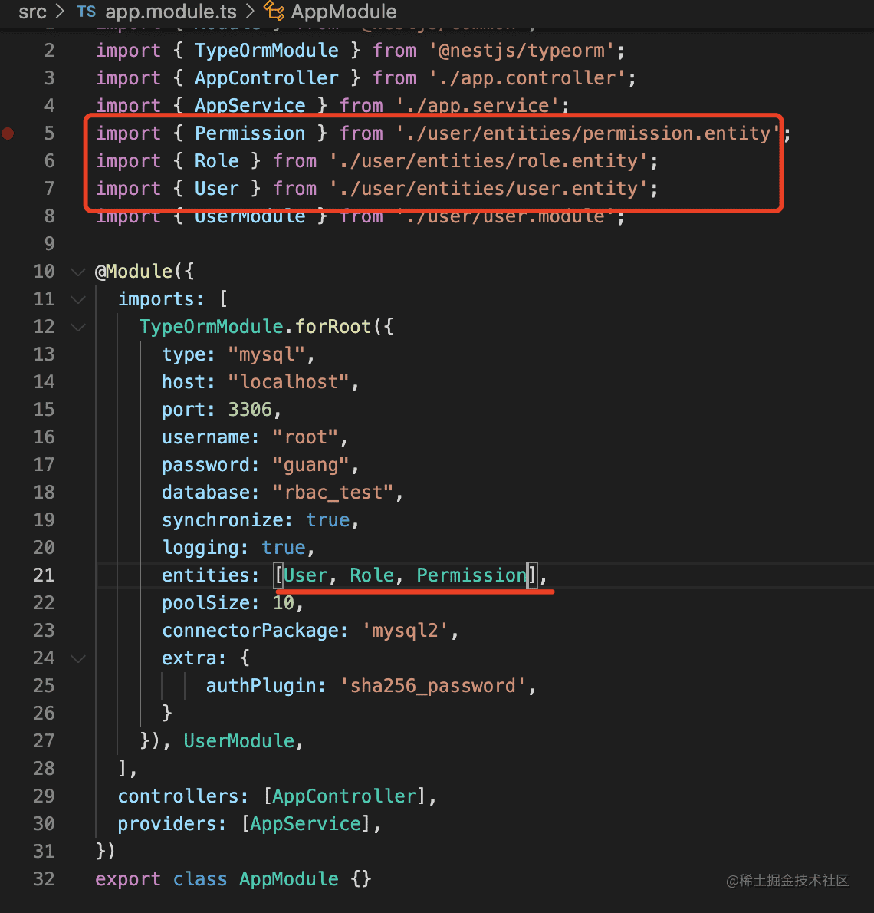

把 Nest 服务跑起来试试：`npm run start:dev`

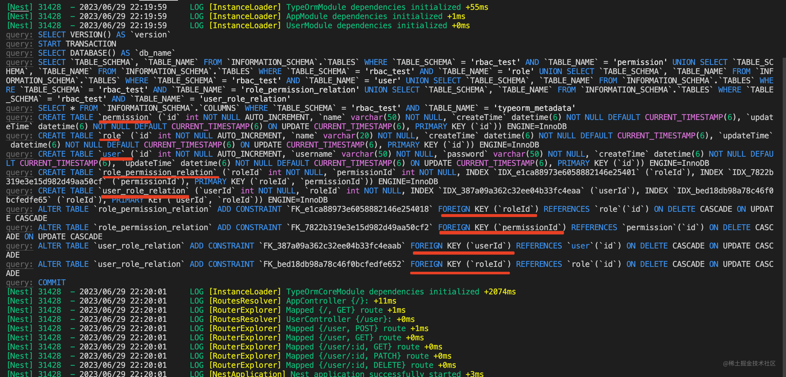

可以看到生成了 user、role、permission 这 3 个表，还有 user_roole_relation、role_permission_relation 这 2 个中间表。

两个中间表的外键约束也是对的。

在 mysql workbench 里看下这 5 个表：

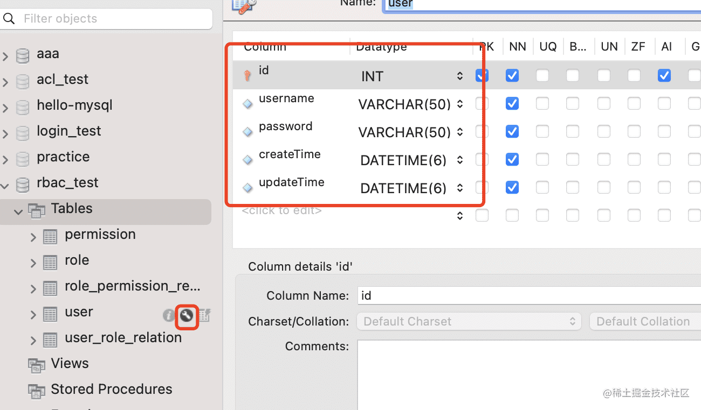

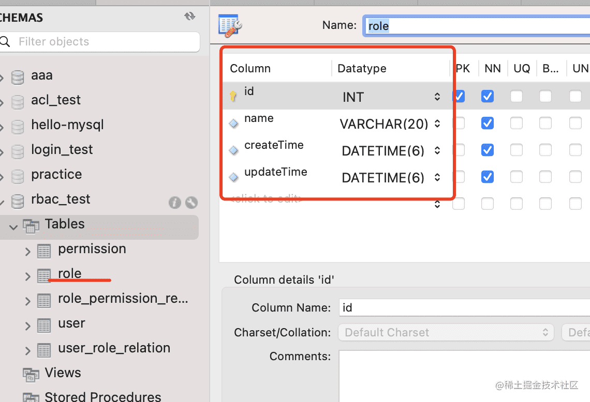

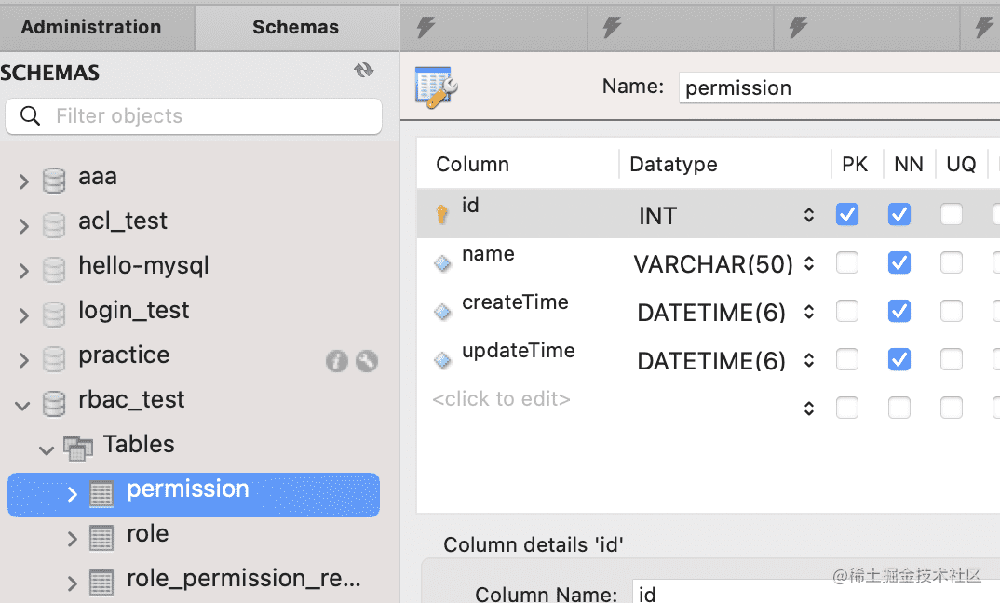

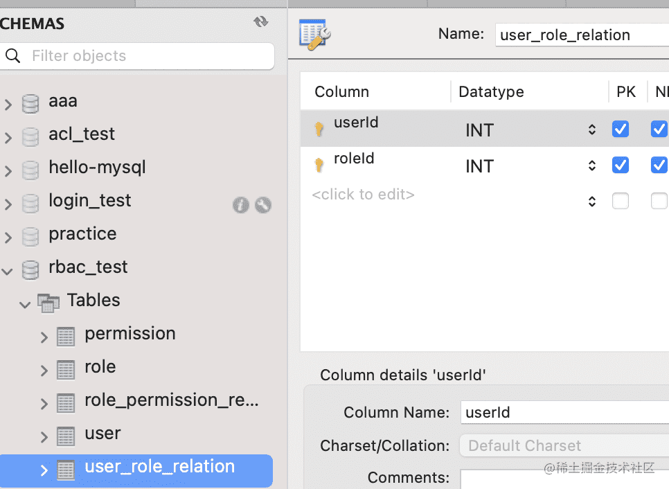

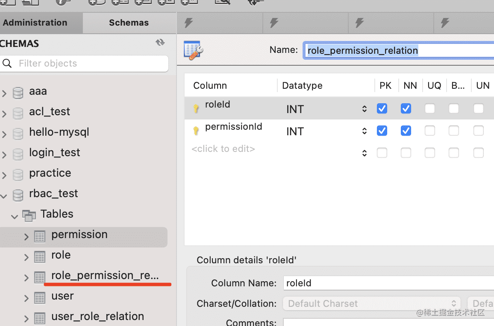

还有外键：

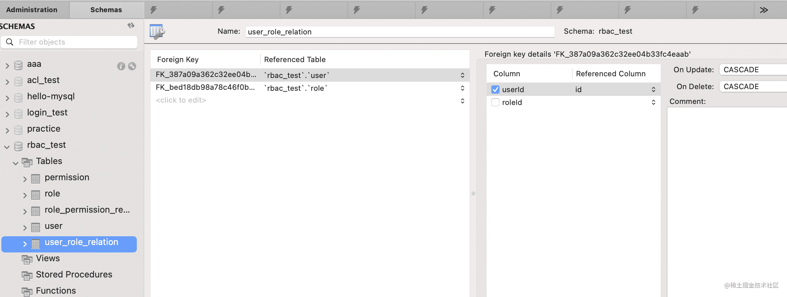

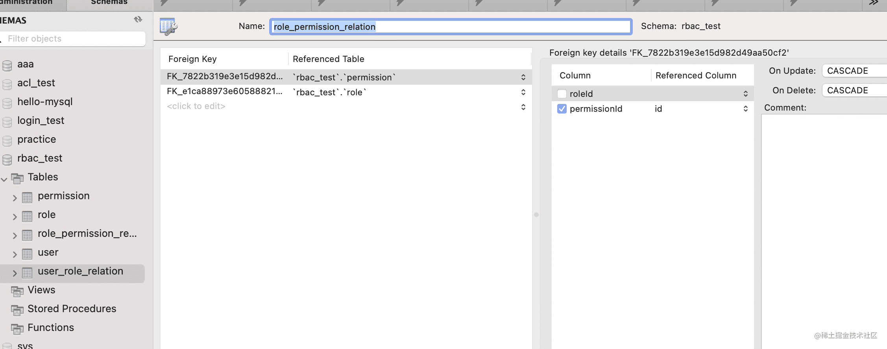

都没啥问题。

然后我们来添加一些数据，同样是用代码的方式。

修改下 UserService，添加这部分代码：


```javascript
@InjectEntityManager()
entityManager: EntityManager;

async initData() {
    const user1 = new User();
    user1.username = '张三';
    user1.password = '111111';

    const user2 = new User();
    user2.username = '李四';
    user2.password = '222222';

    const user3 = new User();
    user3.username = '王五';
    user3.password = '333333';

    const role1 = new Role();
    role1.name = '管理员';

    const role2 = new Role();
    role2.name = '普通用户';

    const permission1 = new Permission();
    permission1.name = '新增 aaa';

    const permission2 = new Permission();
    permission2.name = '修改 aaa';

    const permission3 = new Permission();
    permission3.name = '删除 aaa';

    const permission4 = new Permission();
    permission4.name = '查询 aaa';

    const permission5 = new Permission();
    permission5.name = '新增 bbb';

    const permission6 = new Permission();
    permission6.name = '修改 bbb';

    const permission7 = new Permission();
    permission7.name = '删除 bbb';

    const permission8 = new Permission();
    permission8.name = '查询 bbb';


    role1.permissions = [
      permission1,
      permission2,
      permission3,
      permission4,
      permission5,
      permission6,
      permission7,
      permission8
    ]

    role2.permissions = [
      permission1,
      permission2,
      permission3,
      permission4
    ]

    user1.roles = [role1];

    user2.roles = [role2];

    await this.entityManager.save(Permission, [
      permission1, 
      permission2,
      permission3,
      permission4,
      permission5,
      permission6,
      permission7,
      permission8
    ])

    await this.entityManager.save(Role, [
      role1,
      role2
    ])

    await this.entityManager.save(User, [
      user1,
      user2
    ])  
}
```

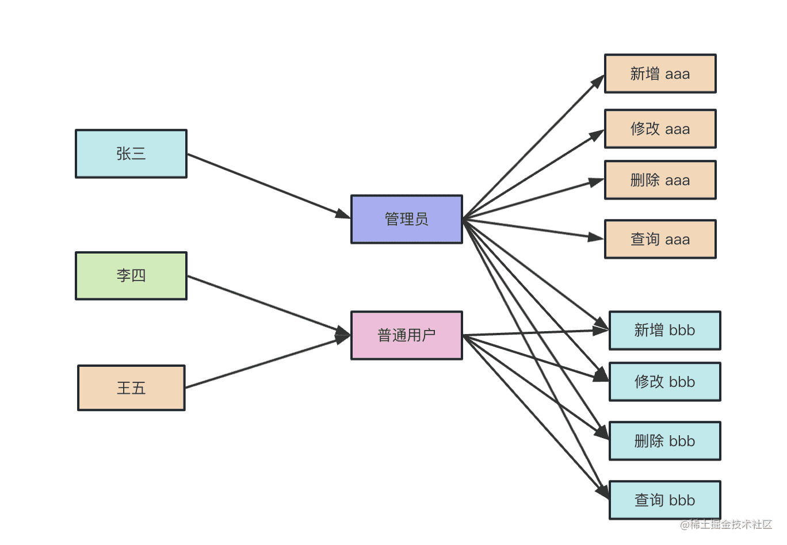

然后在 UserController 里添加一个 handler：

```javascript
@Get('init')
async initData() {
    await this.userService.initData();
    return 'done';
}
```

然后把 nest 服务跑起来：`npm run start:dev`

浏览器访问下：


服务端控制台打印了一堆 sql：

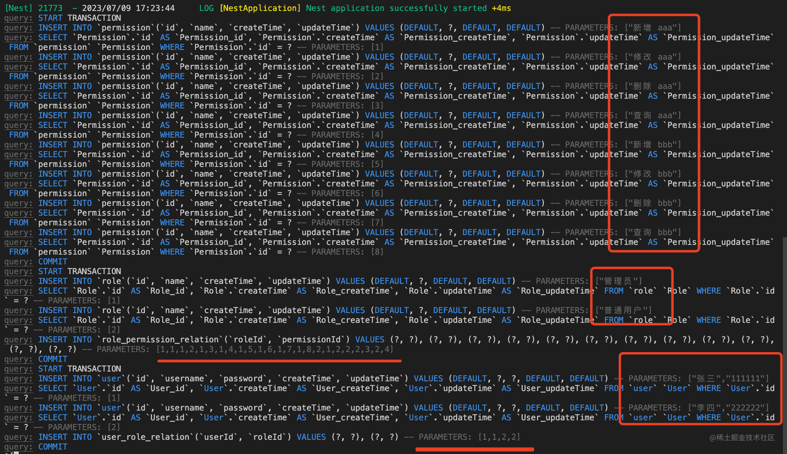

可以看到分别插入了 user、role、permission 还有 2 个中间表的数据。

在 mysql workbench 里看下：

permission 表：

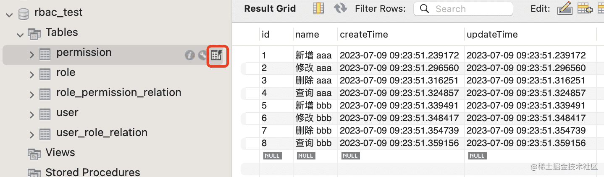

role 表：

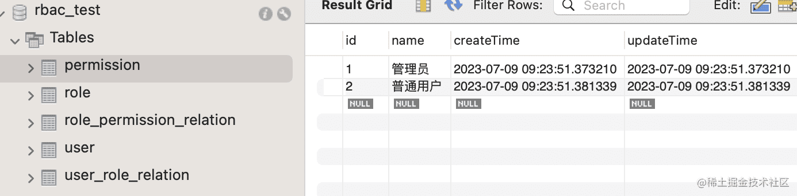

user 表：

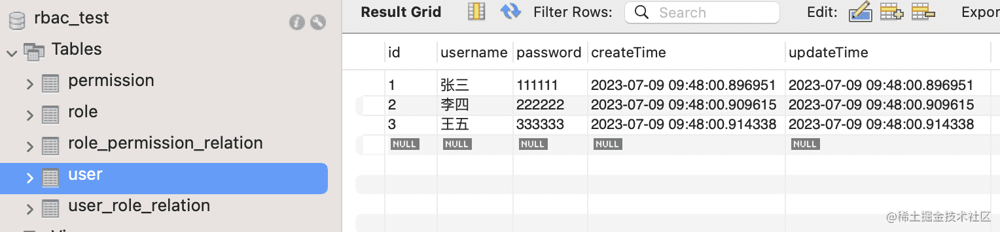

role_permission_relation 中间表：

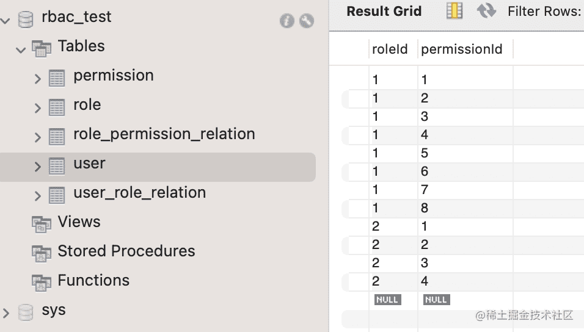

user_role_relation 中间表：

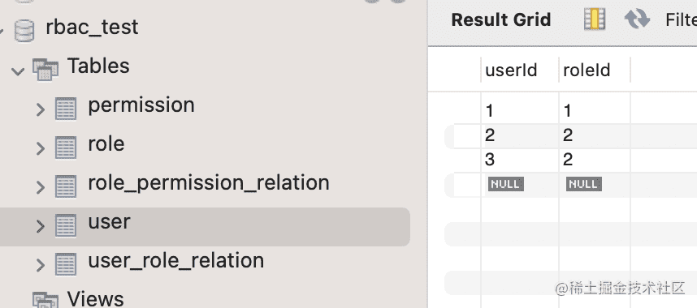

都没啥问题。

然后我们实现下登录，通过 jwt 的方式。

在 UserController 里增加一个 login 的 handler：

```javascript
@Post('login')
login(@Body() loginUser: UserLoginDto){
    console.log(loginUser)
    return 'success'
}
```

添加 user/dto/user-login.dto.ts：

```javascript
export class UserLoginDto {
    username: string;

    password: string;
}
```

安装 ValidationPipe 用到的包：

```
npm install --save class-validator class-transformer
```

然后给 dto 对象添加 class-validator 的装饰器：

```javascript
import { IsNotEmpty, Length } from "class-validator";

export class UserLoginDto {
    @IsNotEmpty()
    @Length(1, 50)
    username: string;

    @IsNotEmpty()
    @Length(1, 50)
    password: string;
}
```

全局启用 ValidationPipe：

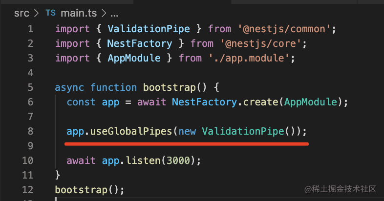

然后在 postman 里测试下：

ValidationPipe 不通过的时候，会返回错误信息：

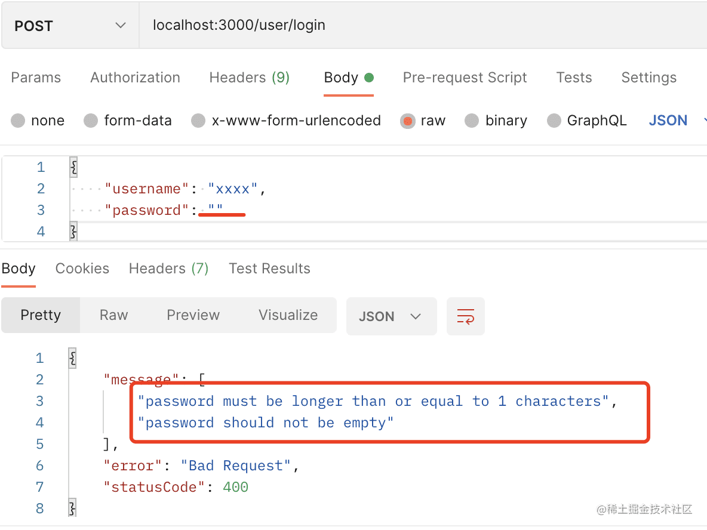

ValidationPipe 通过之后，就会执行 handler 里的方法：


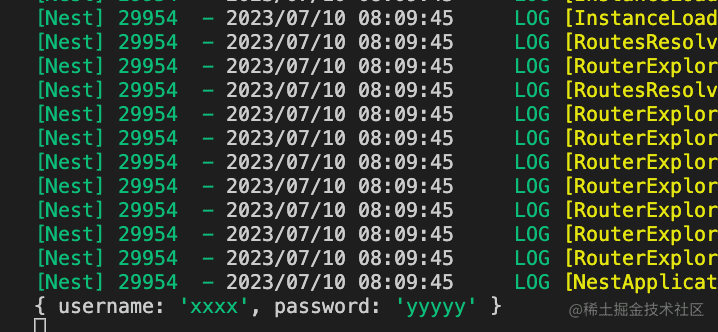

接下来实现查询数据库的逻辑，在 UserService 添加 login 方法：

```javascript
async login(loginUserDto: UserLoginDto) {
    const user = await this.entityManager.findOne(User, {
      where: {
        username: loginUserDto.username
      },
      relations: {
        roles: true
      }
    });

    if(!user) {
      throw new HttpException('用户不存在', HttpStatus.ACCEPTED);
    }

    if(user.password !== loginUserDto.password) {
      throw new HttpException('密码错误', HttpStatus.ACCEPTED);
    }

    return user;
}
```

这里把 user 的 roles 也关联查询出来。

我们在 UserController 的 login 方法里调用下试试：

```javascript
@Post('login')
async login(@Body() loginUser: UserLoginDto){
    const user = await this.userService.login(loginUser);

    console.log(user);

    return 'success'
}
```

可以看到，user 信息和 roles 信息都查询出来了：

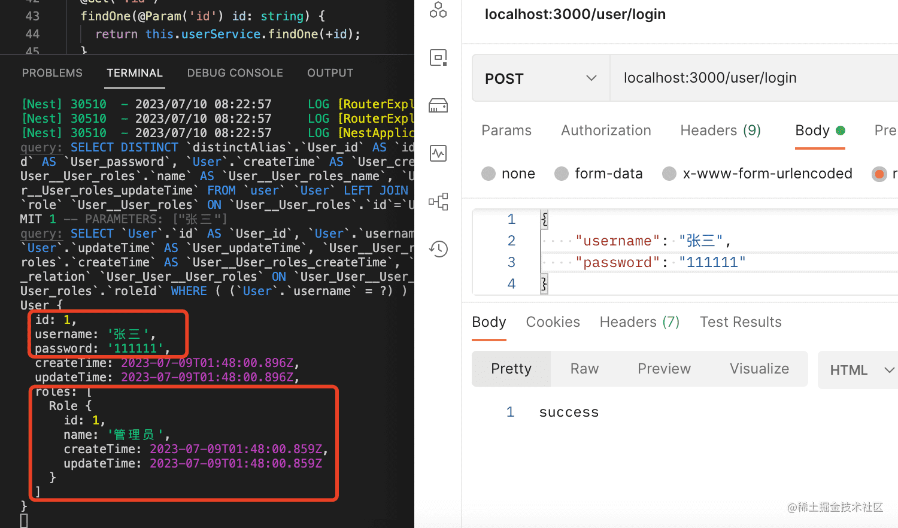

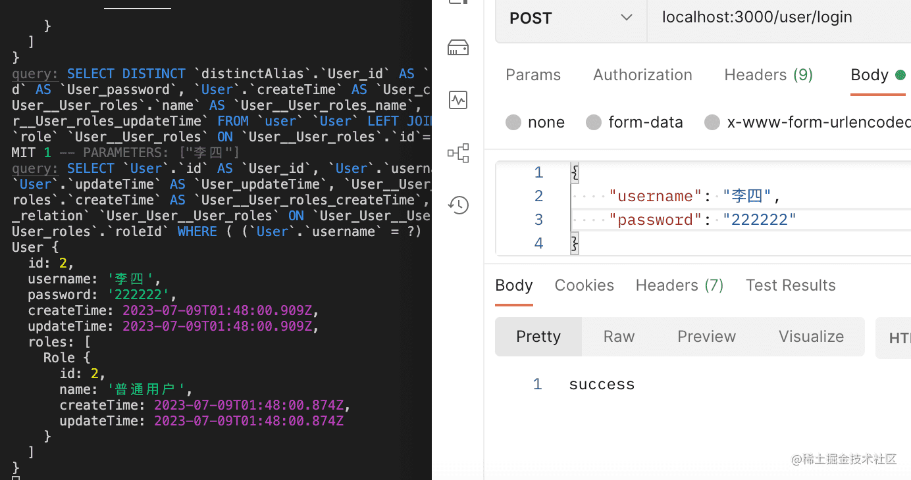

我们要把 user 信息放到 jwt 里，所以安装下相关的包：

    npm install --save @nestjs/jwt

然后在 AppModule 里引入 JwtModule：

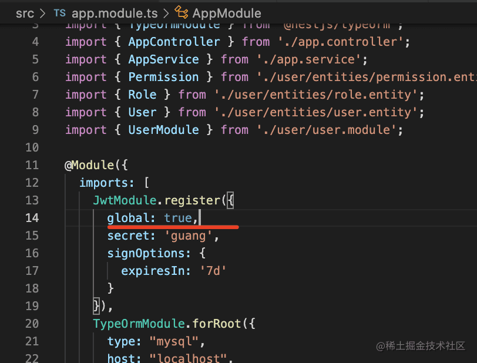

设置为全局模块，这样不用每个模块都引入。

然后在 UserController 里注入 JwtModule 里的 JwtService：

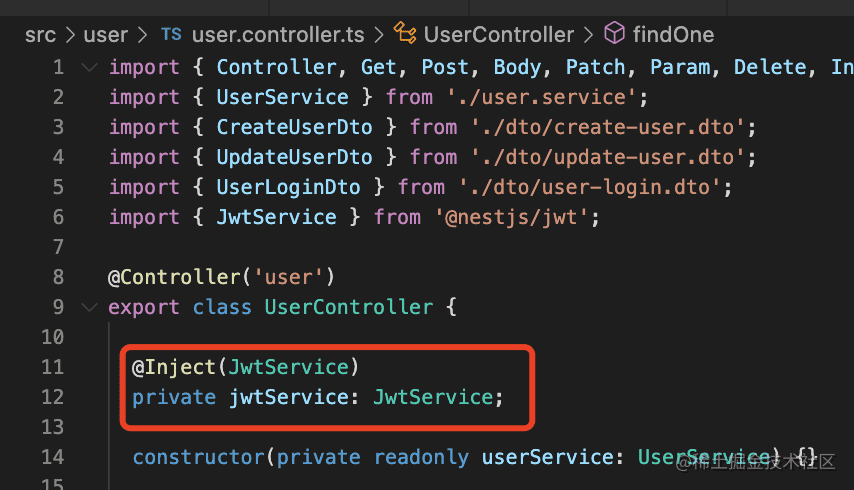

把 user 信息放到 jwt 里，然后返回：

```javascript
@Post('login')
async login(@Body() loginUser: UserLoginDto){
  const user = await this.userService.login(loginUser);

  const token = this.jwtService.sign({
    user: {
      username: user.username,
      roles: user.roles
    }
  });

  return {
      token
  }
}
```

测试下：

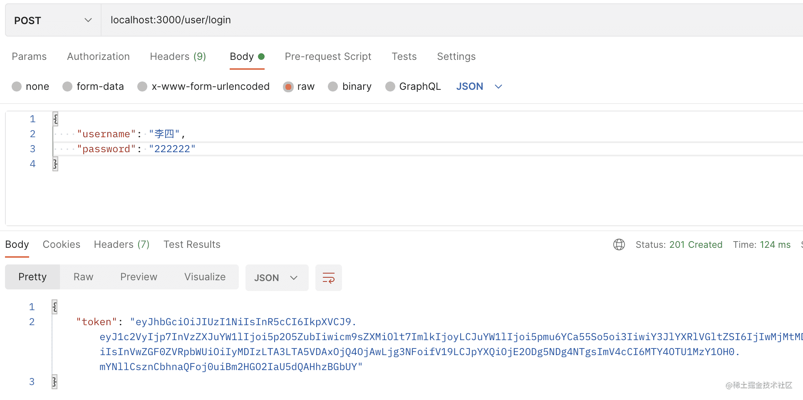

服务端在登录后返回了 jwt 的 token。

然后在请求带上这个 token 才能访问一些资源。

我们添加 aaa、bbb 两个模块，分别生成 CRUD 方法：

```
nest g resource aaa 
nest g resource bbb 
```

现在这些接口可以直接访问：

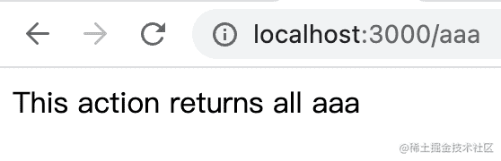

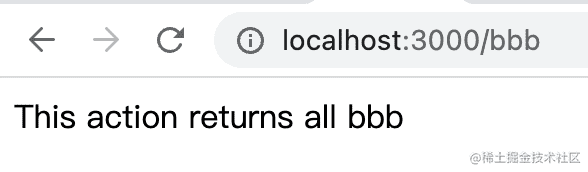

而实际上这些接口是要控制权限的。

管理员的角色有 aaa、bbb 的增删改查权限，而普通用户只有 bbb 的增删改查权限。

所以要对接口的调用做限制。

先添加一个 LoginGuard，限制只有登录状态才可以访问这些接口： 

```
nest g guard login --no-spec --flat
```

然后增加登录状态的检查：

```javascript
import { CanActivate, ExecutionContext, Inject, Injectable, UnauthorizedException } from '@nestjs/common';
import { JwtService } from '@nestjs/jwt';
import { Request } from 'express';
import { Observable } from 'rxjs';

@Injectable()
export class LoginGuard implements CanActivate {
  
  @Inject(JwtService)
  private jwtService: JwtService;
  
  canActivate(
    context: ExecutionContext,
  ): boolean | Promise<boolean> | Observable<boolean> {
    const request: Request = context.switchToHttp().getRequest();
    
    const authorization = request.headers.authorization;

    if(!authorization) {
      throw new UnauthorizedException('用户未登录');
    }

    try{
      const token = authorization.split(' ')[1];
      const data = this.jwtService.verify(token);

      return true;
    } catch(e) {
      throw new UnauthorizedException('token 失效，请重新登录');
    }
  }
}
```

这里不用查数据库了，因为 jwt 是用密钥加密的，只要 jwt 能 verify 通过就行了。

然后把它放到 request 上：

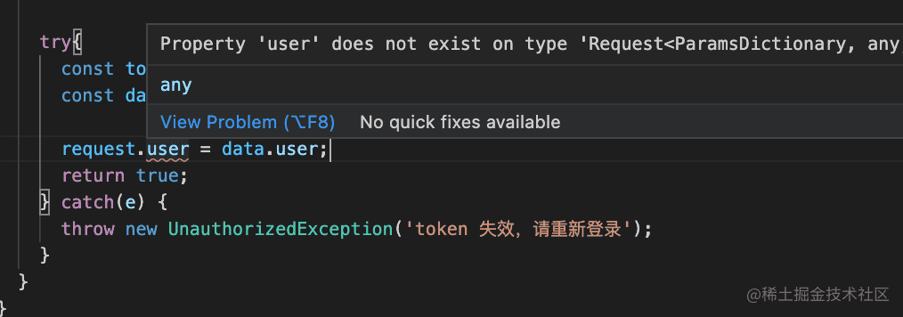

但这时候会报错 user 不在 Request 的类型上。

扩展下就好了：

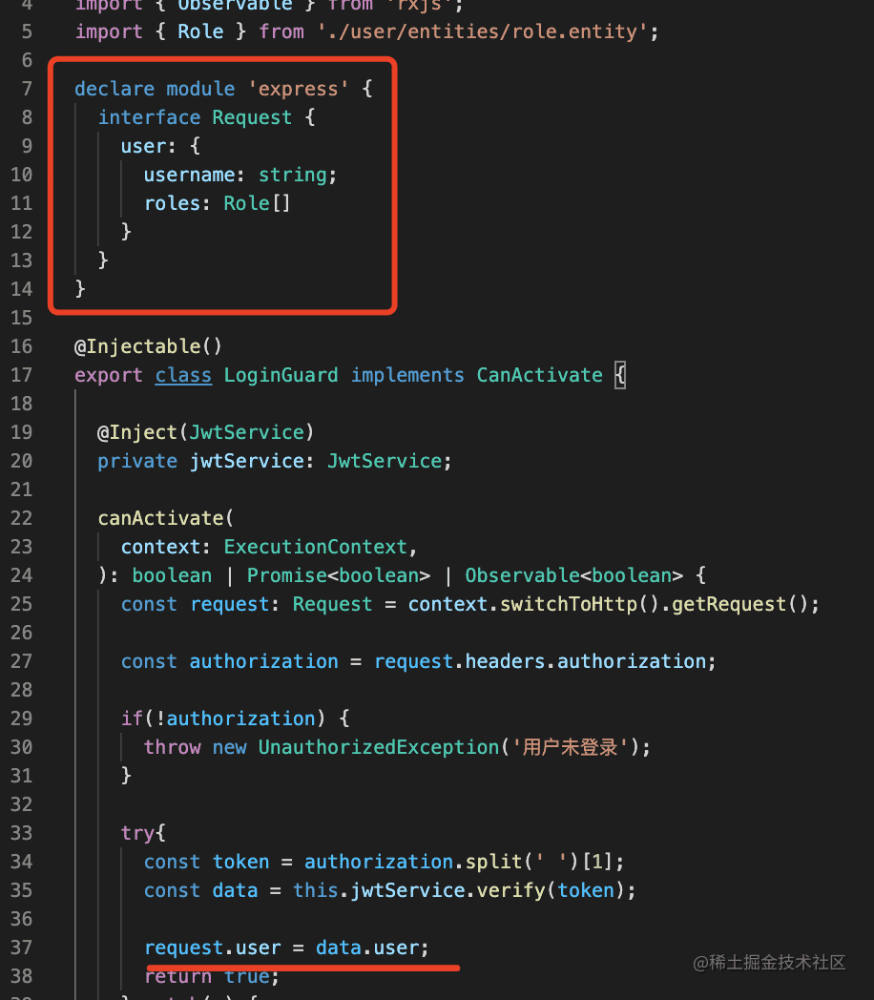

```typescript
declare module 'express' {
  interface Request {
    user: {
      username: string;
      roles: Role[]
    }
  }
}
```

因为 typescript 里同名 module 和 interface 会自动合并，可以这样扩展类型。

上节我们是一个个加的 Guard：

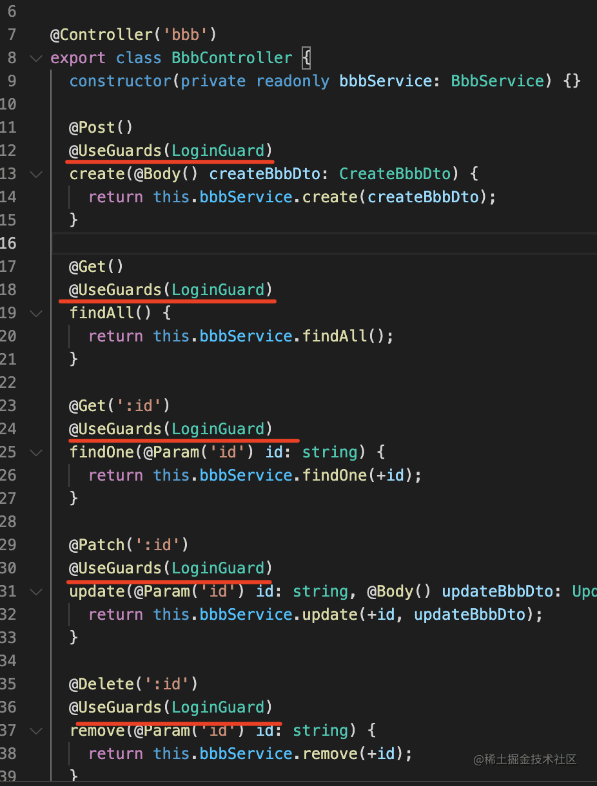

这样太麻烦了，这次我们全局加：

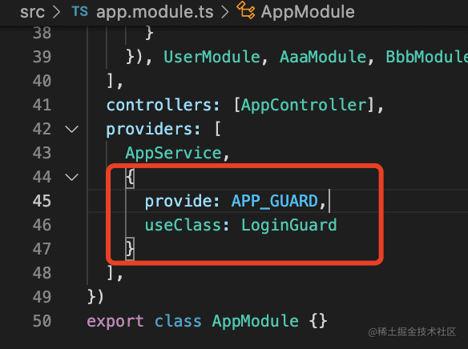

前面讲过，通过 app.userGlobalXxx 的方式不能注入 provider，可以通过在 AppModule 添加 token 为 APP_XXX 的 provider 的方式来声明全局 Guard、Pipe、Intercepter 等：

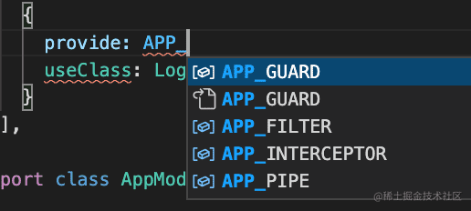

再访问下 aaa、bbb 接口：

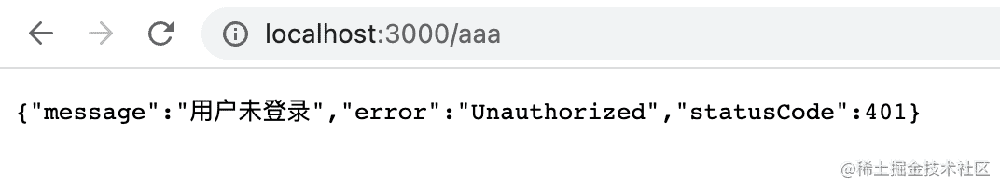

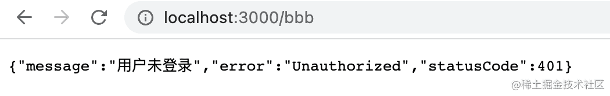

但这时候你访问 /user/login 接口也被拦截了：

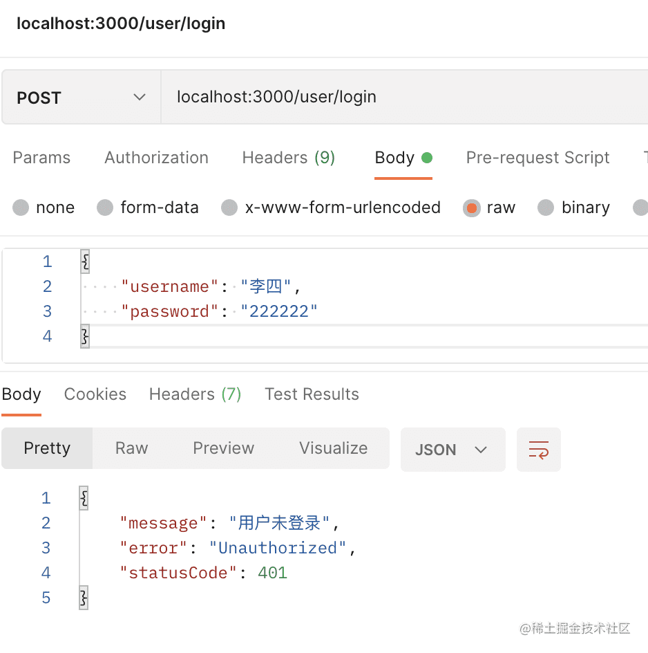

我们需要区分哪些接口需要登录，哪些接口不需要。

这时候就可以用 SetMetadata 了。

我们添加一个 custom-decorator.ts 来放自定义的装饰器：

```typescript
import { SetMetadata } from "@nestjs/common";

export const  RequireLogin = () => SetMetadata('require-login', true);
```

声明一个 RequireLogin 的装饰器。

在 aaa、bbb 的 controller 上用一下：

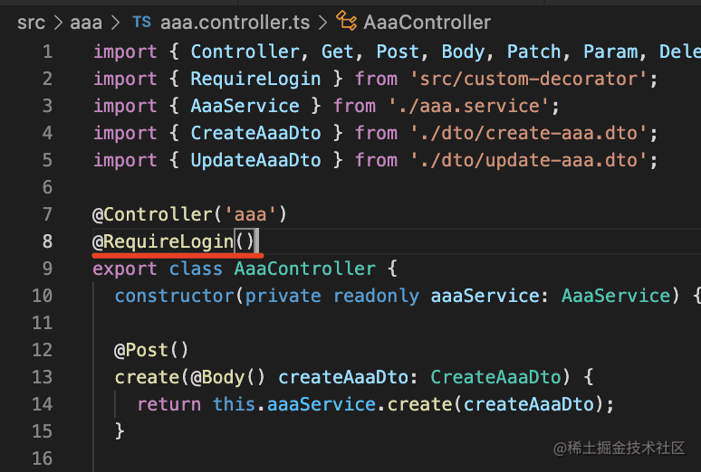

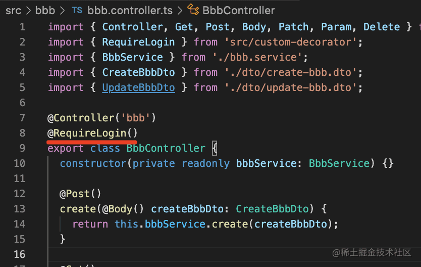

我们支持在 controller 上添加声明，不需要每个 handler 都添加，这样方便很多。

然后需要改造下 LoginGuard，取出目标 handler 的 metadata 来判断是否需要登录：

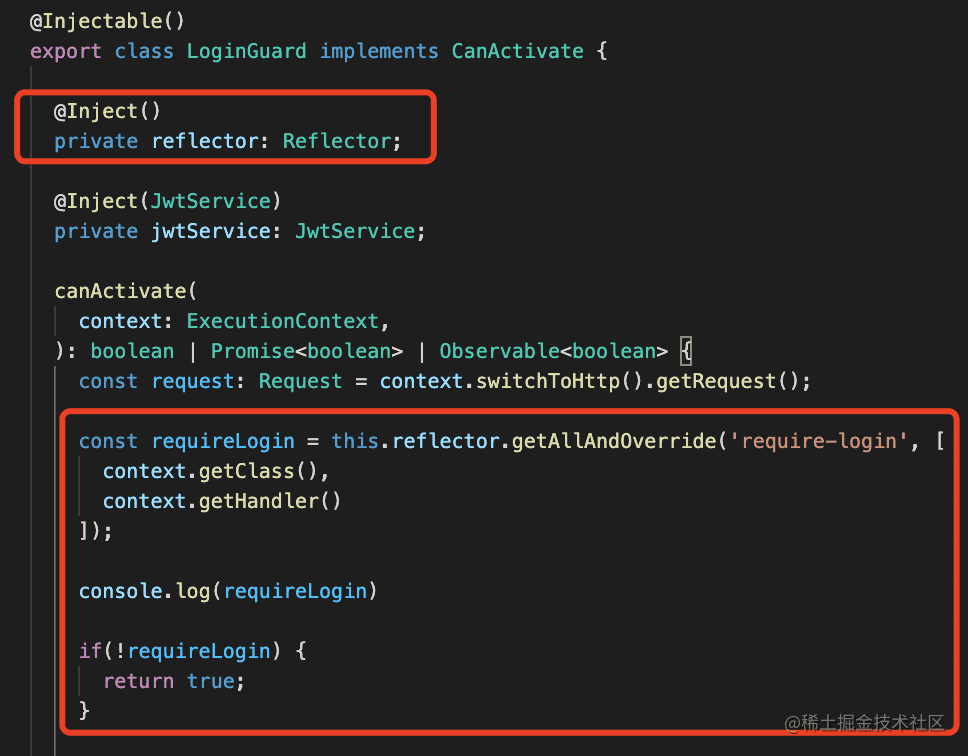

```javascript
const requireLogin = this.reflector.getAllAndOverride('require-login', [
  context.getClass(),
  context.getHandler()
]);

console.log(requireLogin)

if(!requireLogin) {
  return true;
}
```

如果目标 handler 或者 controller 不包含 require-login 的 metadata，那就放行，否则才检查 jwt。

我们再试下：

现在登录接口能正常访问了：

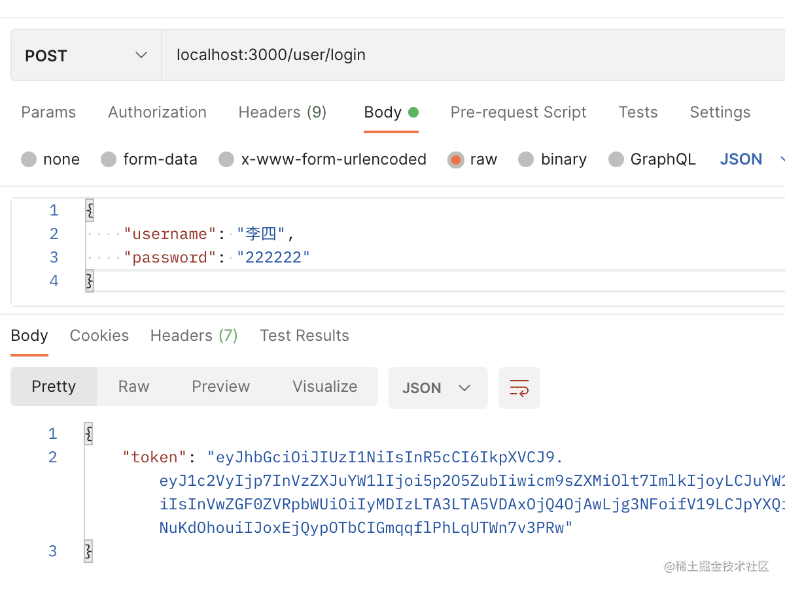

因为没有 require-login 的 metadata：


而 aaa、bbb 是需要登录的：

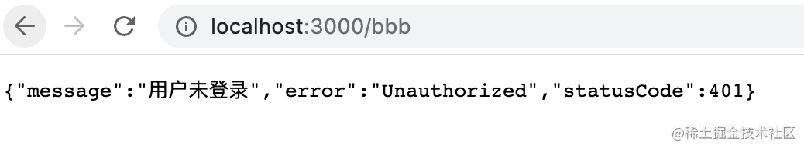

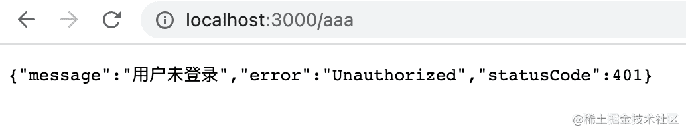

因为它们包含 require-login 的metadata：

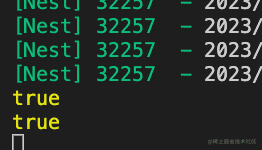

然后我们登录下，带上 token 访问试试：

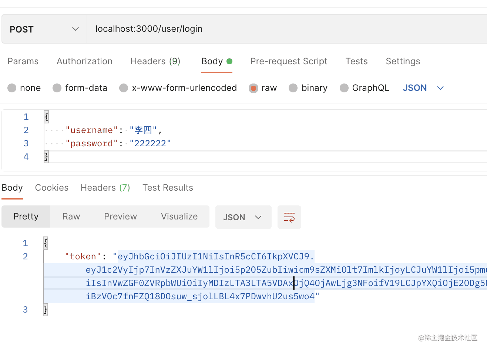

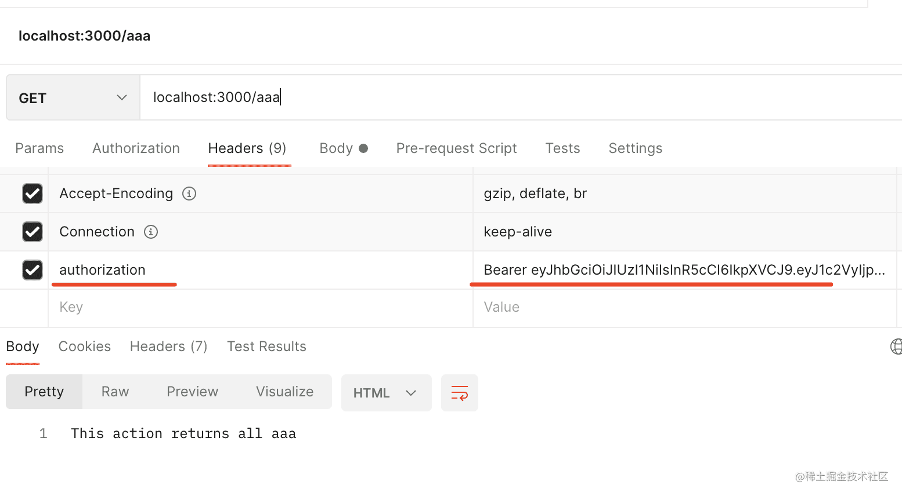

带上 token 就能正常访问了。

然后我们再进一步控制权限。

但是这样还不够，我们还需要再做登录用户的权限控制，所以再写个 PermissionGuard:

```
nest g guard permission --no-spec --flat
```

同样声明成全局 Guard：

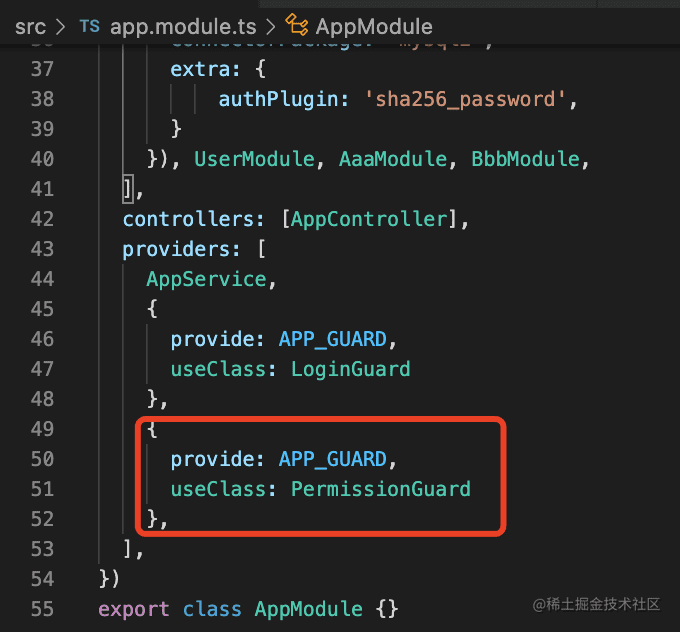

PermissionGuard 里需要用到 UserService，所以在 UserModule 里导出下 UserService：

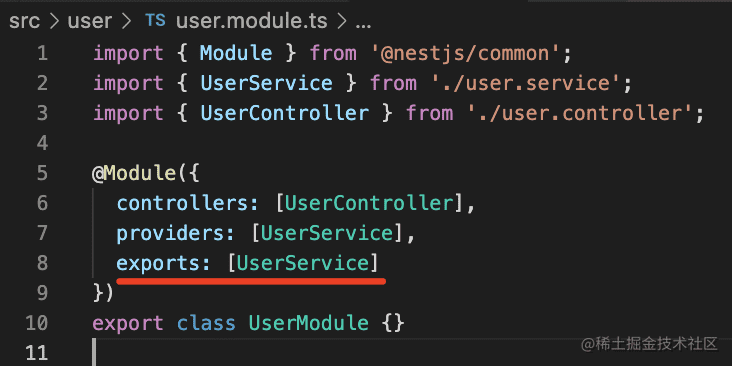

注入 UserService：

```javascript
import { CanActivate, ExecutionContext, Inject, Injectable } from '@nestjs/common';
import { Request } from 'express';
import { Observable } from 'rxjs';
import { UserService } from './user.service';

@Injectable()
export class PermissionGuard implements CanActivate {

  @Inject(UserService) 
  private userService: UserService;

  canActivate(
    context: ExecutionContext,
  ): boolean | Promise<boolean> | Observable<boolean> {

    console.log(this.userService);

    return true;
  }
}
```

然后在 userService 里实现查询 role 的信息的 service：

```typescript
async findRolesByIds(roleIds: number[]) {
    return this.entityManager.find(Role, {
      where: {
        id: In(roleIds)
      },
      relations: {
        permissions: true
      }
    });
}
```

关联查询出 permissions。

然后在 PermissionGuard 里调用下：

```typescript
import { CanActivate, ExecutionContext, Inject, Injectable } from '@nestjs/common';
import { Request } from 'express';
import { UserService } from './user/user.service';

@Injectable()
export class PermissionGuard implements CanActivate {

  @Inject(UserService) 
  private userService: UserService;

  async canActivate(
    context: ExecutionContext,
  ): Promise<boolean> {
    const request: Request = context.switchToHttp().getRequest();

    if(!request.user) {
      return true;
    }

    const roles = await this.userService.findRolesByIds(request.user.roles.map(item => item.id))

    const permissions: Permission[]  = roles.reduce((total, current) => {
      total.push(...current.permissions);
      return total;
    }, []);

    console.log(permissions);

    return true;
  }
}
```

因为这个 PermissionGuard 在 LoginGuard 之后调用（在 AppModule 里声明在 LoginGuard 之后），所以走到这里 request 里就有 user 对象了。

但也不一定，因为 LoginGuard 没有登录也可能放行，所以要判断下 request.user 如果没有，这里也放行。

然后取出 user 的 roles 的 id，查出 roles 的 permission 信息，然后合并到一个数组里。

我们试试看：

带上 token 访问：

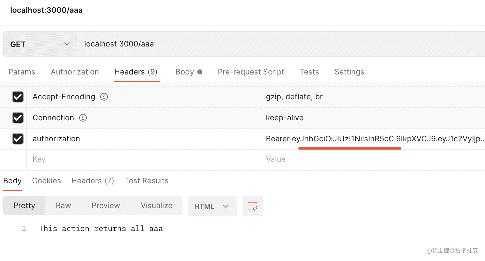

可以看到打印了这个用户拥有的角色的所有 permission 信息：

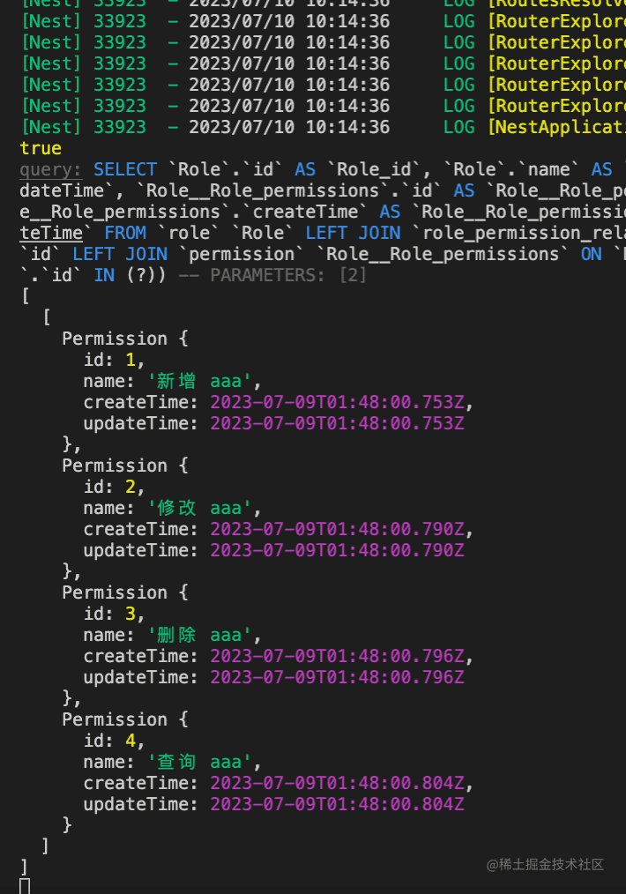

再增加个自定义 decorator：

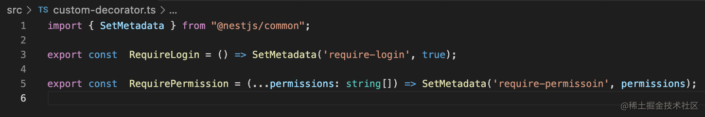

```typescript
export const  RequirePermission = (...permissions: string[]) => SetMetadata('require-permission', permissions);
```

然后我们在 BbbController 上声明需要的权限。

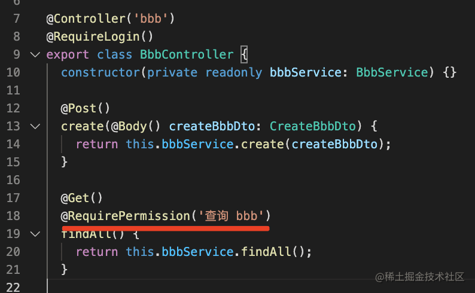

在 PermissionGuard 里取出来判断：


```javascript
const requiredPermissions = this.reflector.getAllAndOverride<string[]>('require-permission', [
  context.getClass(),
  context.getHandler()
])

console.log(requiredPermissions);
```

先打印下试试：

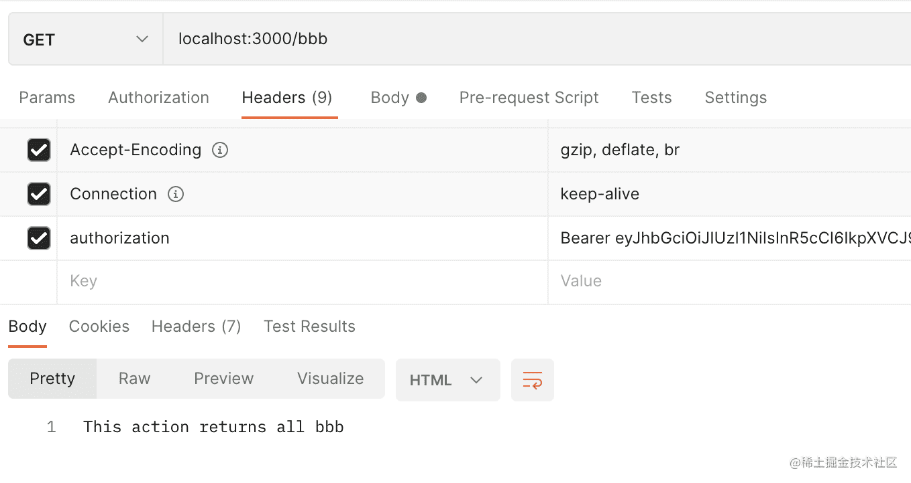

带上 token 访问：

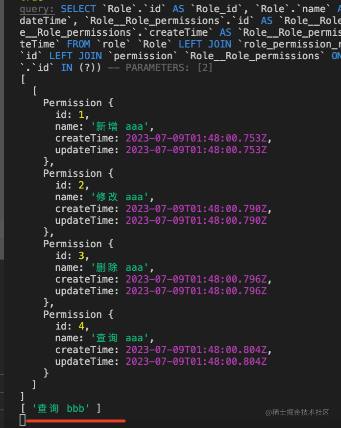

可以看到打印了用户有的 permission 还有这个接口需要的 permission。

那这两个一对比，不就知道有没有权限访问这个接口了么？

添加这样的对比逻辑：

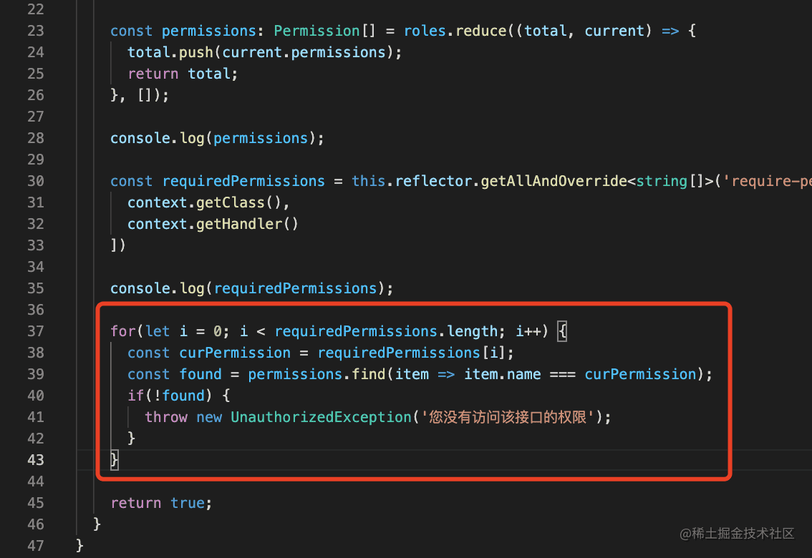

```javascript
for(let i = 0; i < requiredPermissions.length; i++) {
  const curPermission = requiredPermissions[i];
  const found = permissions.find(item => item.name === curPermission);
  if(!found) {
    throw new UnauthorizedException('您没有访问该接口的权限');
  }
}
```

测试下：

当前用户是李四，是没有访问 bbb 的权限的：

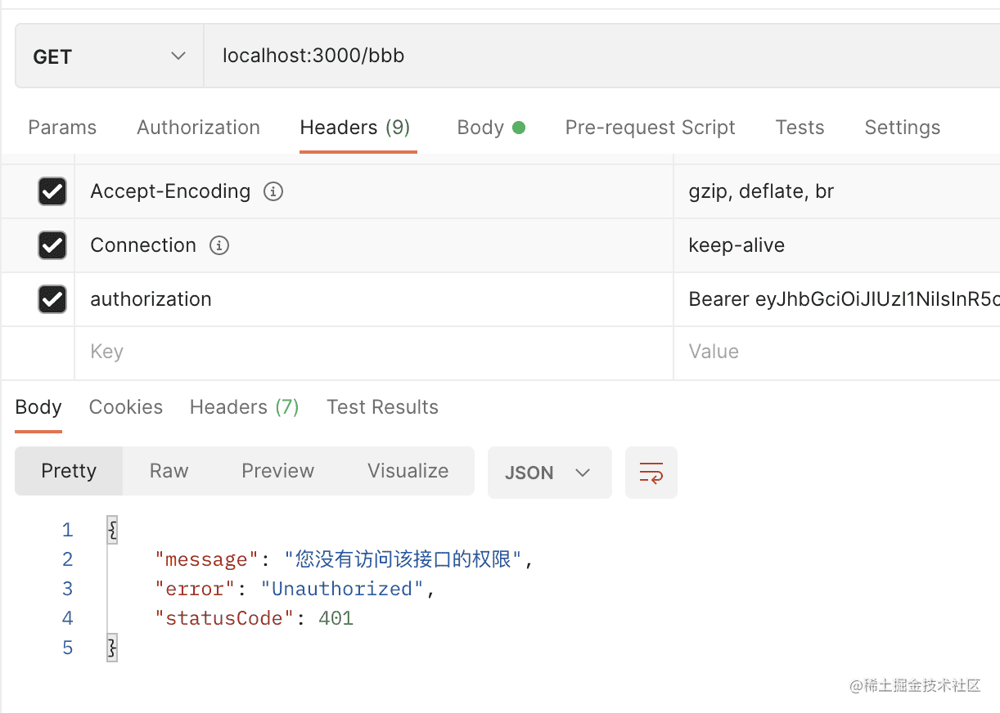

我们再登录下张三账号：

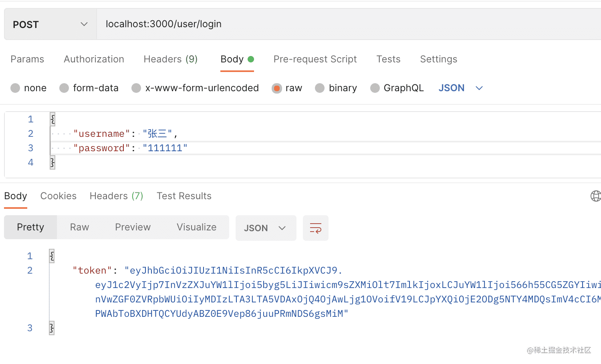

用这个 token 去访问下 bbb 接口，就能正常访问了：

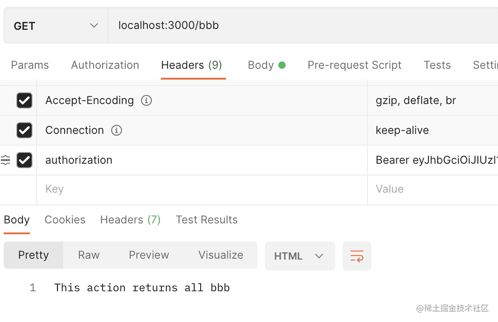

他是有这个权限的：

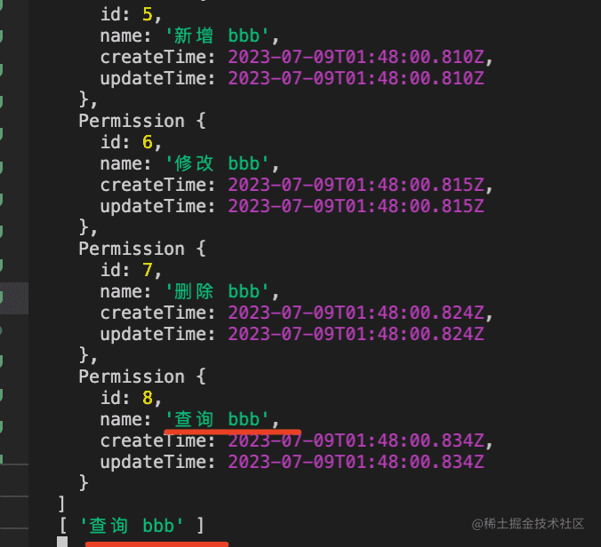

这样，我们就实现了基于 RBAC 的权限控制。

有的同学说，这和 ACL 的差别也不大呀？

检查权限的部分确实差别不大，都是通过声明的需要的权限和用户有的权限作对比。

但是分配权限的时候，是以角色为单位的，这样如果这个角色的权限变了，那分配这个角色的用户权限也就变了。

这就是 RBAC 相比 ACL 更方便的地方。

此外，这里查询角色需要的权限没必要每次都查数据库，可以通过 redis 来加一层缓存，减少数据库访问，提高性能。（具体写法参考上节）

案例代码在[小册仓库](https://github.com/QuarkGluonPlasma/nestjs-course-code/tree/main/rbac-test)。

## 总结

这节我们学了 RBAC（role based access control） 权限控制，它相比于 ACL （access control list）的方式，多了一层角色，给用户分配角色而不是直接分配权限。

当然，检查权限的时候还是要把角色的权限合并之后再检查是否有需要的权限的。

我们通过 jwt 实现了登录，把用户和角色信息放到 token 里返回。

添加了 LoginGuard 来做登录状态的检查。

然后添加了 PermissionGuard 来做权限的检查。

LoginGuard 里从 jwt 取出 user 信息放入 request，PermissionGuard 从数据库取出角色对应的权限，检查目标 handler 和 controller 上声明的所需权限是否满足。

LoginGuard 和 PermissionGuard 需要注入一些 provider，所以通过在 AppModule 里声明 APP_GUARD 为 token 的 provider 来注册的全局 Gard。

然后在 controller 和 handler 上添加 metadata 来声明是否需要登录，需要什么权限，之后在 Guard 里取出来做检查。

这种方案查询数据库也比较频繁，也应该加一层 redis 来做缓存。

这就是基于 RBAC 的权限控制，是用的最多的一种权限控制方案。

当然，这是 RBAC0 的方案，更复杂一点的权限模型，可能会用 RBAC1、RBAC2 等，那个就是多角色继承、用户组、角色之间互斥之类的概念，会了 RBAC0，那些也就是做一些变形的事情。

绝大多数系统，用 RBAC0 就足够了。


