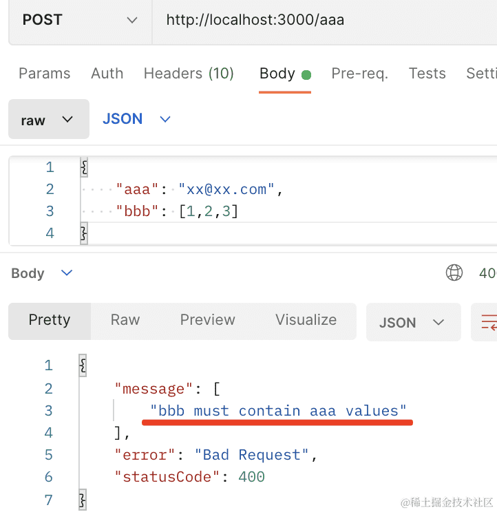
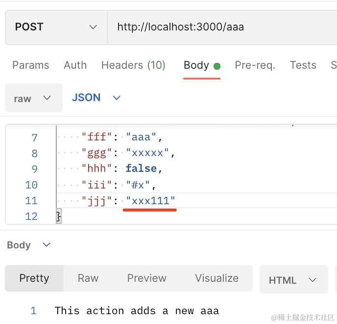

## class-validator装饰器

我们会用 class-validator 的装饰器对 dto 对象做校验。

那 class-validator 都有哪些装饰器可用呢？

这节我们来过一遍。`nest new class-validator-decorators`

创建个 CRUD 模块：`nest g resource aaa --no-spec`

全局启用 ValidationPipe，对 dto 做校验：


```javascript
import { NestFactory } from '@nestjs/core';
import { AppModule } from './app.module';
import { ValidationPipe } from '@nestjs/common';

async function bootstrap() {
  const app = await NestFactory.create(AppModule);

  app.useGlobalPipes(new ValidationPipe());

  await app.listen(3000);
}
bootstrap();
```

安装用到的 class-validator 和 class-transformer 包：

```
npm install --save class-validator class-transformer
```

然后在 create-aaa.dto.ts 加一下校验：


### IsNotEmpty/IsString/IsEmail

```javascript
import { IsEmail, IsNotEmpty, IsString } from "class-validator";

export class CreateAaaDto {

    @IsNotEmpty({message: 'aaa 不能为空'})
    @IsString({message: 'aaa 必须是字符串'})
    @IsEmail({}, {message: 'aaa 必须是邮箱'})
    aaa: string;

}
```

把服务跑起来：`npm run start:dev`

postman 里访问下：


这就是 class-validator 的装饰器的用法。

类似这种装饰器有很多。


### IsOptional

和 @IsNotEmpty 相反的是 @IsOptional：


加上之后就是可选的了：


### IsIn

@IsIn 可以限制属性只能是某些值：

```javascript
@IsNotEmpty({message: 'aaa 不能为空'})
@IsString({message: 'aaa 必须是字符串'})
@IsEmail({}, {message: 'aaa 必须是邮箱'})
@IsIn(['aaa@aa.com', 'bbb@bb.com'])
aaa: string;
```


### IsNotIn

还有 @IsNotIn，可以限制属性不能是某些值：

```javascript
@IsNotEmpty({message: 'aaa 不能为空'})
@IsString({message: 'aaa 必须是字符串'})
@IsEmail({}, {message: 'aaa 必须是邮箱'})
@IsNotIn(['aaa@aa.com', 'bbb@bb.com'])
aaa: string;
```


@IsBoolean、@IsInt、@IsNumber、@IsDate 这种就不说了。


### IsArray

@IsArray 可以限制属性是 array：

```javascript
@IsArray()
bbb:string;
```


### ArrayContains

@ArrayContains 指定数组里必须包含的值：

```javascript
@IsArray()
@ArrayContains(['aaa'])
bbb:string;
```




### 其他

类似的还有 @ArrayNotContains 就是必须不包含的值。

@ArrayMinSize 和 @ArrayMaxSize 限制数组的长度。

@ArrayUnique 限制数组元素必须唯一：

```javascript
@IsArray()
@ArrayNotContains(['aaa'])
@ArrayMinSize(2)
@ArrayMaxSize(5)
@ArrayUnique()
bbb:string;
```


前面讲过 @IsNotEmpty，和它类似的还有 @IsDefined。

@IsNotEmpty 检查值是不是 ''、undefined、null。

@IsDefined 检查值是不是 undefined、null。

当你允许传空字符串的时候就可以用 @IsDefined。

```javascript
@IsDefined()
ccc: string;
```


如果是 @IsNotEmpty，那空字符串也是不行的：

```javascript
// @IsDefined()
@IsNotEmpty()
ccc: string;
```


数字可以做更精准的校验：

```javascript
@IsPositive()
@Min(1)
@Max(10)
@IsDivisibleBy(2)
ddd:number;
```

@IsPositive 是必须是正数、@IsNegative 是必须是负数。

@Min、@Max 是限制范围。

@IsDivisibleBy 是必须被某个数整除。


@IsDateString 是 ISO 标准的日期字符串：

```javascript
@IsDateString()
eee: string;
```

也就是这种：


还有几个字符串相关的：

@IsAlpha 检查是否只有字母

@IsAlphanumeric 检查是否只有字母和数字

@Contains 是否包含某个值

```javascript
@IsAlphanumeric()
@Contains('aaa')
fff: string;
```


字符串可以通过 @MinLength、@MaxLength、@Length 来限制长度：

```javascript
@MinLength(2)
@MaxLength(6)
ggg: string;
```


也可以用 @Length：

```javascript
@Length(2, 6)
ggg: string;
```

还可以校验颜色值的格式：@IsHexColor、@IsHSL、@IsRgbColor

校验 IP 的格式：@IsIP

校验端口： @IsPort

校验 JSON 格式 @IsJSON

常用的差不多就这些，更多的可以看 [class-validator 的文档](https://www.npmjs.com/package/class-validator#validation-decorators)。

此外，如果某个属性是否校验要根据别的属性的值呢？

这样：

```javascript
@IsBoolean()
hhh: boolean;

@ValidateIf(o => o.hhh === true)
@IsNotEmpty()
@IsHexColor()
iii: string;
```

如果 hhh 传了 true，那就需要对 iii 做校验，否则不需要。


此外，如果这些内置的校验规则都不满足需求呢？


## 自定义装饰器

那就自己写！

创建 my-validator.ts

```javascript
import { ValidationArguments, ValidatorConstraint, ValidatorConstraintInterface } from "class-validator";

@ValidatorConstraint()
export class MyValidator implements ValidatorConstraintInterface {
    validate(text: string, validationArguments: ValidationArguments) {
        // text是待验证的字段的值
        // validationArguments验证时的附加信息和上下文，是个对象
        console.log(text, validationArguments)
        return true;
    }
}
```

用 @ValidatorConstraint 声明 class 为校验规则，然后实现 ValidatorConstraintInterface 接口。

用一下：

```javascript
// [11, 22] 是传递给 MyValidator 的参数数组。这些参数可以在 MyValidator 类的验证方法中使用，帮助定义验证规则，可以省略
@Validate(MyValidator, [11, 22], {
    message: 'jjj 校验失败',
})
jjj: string;
```

访问下：


第一个参数传入的字段值，第二个参数包含更多信息，比如 @Validate 指定的参数在 constraints 数组里。

这样，我们只要用这些做下校验然后返回 true、false 就好了。

比如这样：

```javascript
import { ValidationArguments, ValidatorConstraint, ValidatorConstraintInterface } from "class-validator";

@ValidatorConstraint()
export class MyValidator implements ValidatorConstraintInterface {
    validate(text: string, validationArguments: ValidationArguments) {
        // console.log(text, validationArguments)
        return text.includes(validationArguments.constraints[0]);
    }
}
```




内容包含 11 的时候才会校验通过。

那如果这个校验是异步的呢？

返回 promise 就行：

```javascript
import { ValidationArguments, ValidatorConstraint, ValidatorConstraintInterface } from "class-validator";

@ValidatorConstraint()
export class MyValidator implements ValidatorConstraintInterface {
    async validate(text: string, validationArguments: ValidationArguments) {
        // console.log(text, validationArguments)
        return new Promise<boolean>((resolve) => {
            setTimeout(() => {
                resolve(text.includes(validationArguments.constraints[0]));
            }, 3000);
        })
    }
}
```


这样用起来还是不如内置装饰器简单：


可以用我们前面学的创建自定义装饰器的方式来包装一下：

创建 my-contains.decorator.ts

```javascript
import { applyDecorators } from '@nestjs/common';
import { Validate, ValidationOptions } from 'class-validator';
import { MyValidator } from './my-validator';

export function MyContains(content: string, options?: ValidationOptions) {
  return applyDecorators(
     Validate(MyValidator, [content], options)
  )
}
```

用 applyDecorators 组合装饰器生成新的装饰器。

然后用起来就可以这样：

```javascript
@MyContains('111', {
    message: 'jjj 必须包含 111'
})
jjj: string;
```


我们封装出了 @Contains，其实内置的那些装饰器我们都可以自己封装出来。

案例代码在[小册仓库](https://github.com/QuarkGluonPlasma/nestjs-course-code/tree/main/class-validator-decorators)

## 总结

我们过了一遍 class-validator 的常用装饰器。

它们可以对各种类型的数据做精确的校验。

然后 @ValidateIf 可以根据别的字段来决定是否校验当前字段。

如果内置的装饰器不符合需求，完全可以自己实现，然后用 @Validate 来应用，用自定义装饰器 applyDecorators 包一层之后，和 class-validator 的内置装饰器就一模一样了。

所有的 class-validator 内置装饰器我们完全可以自己实现一遍。