## 请求日志

Nest 服务会不断处理用户用户的请求，如果我们想记录下每次请求的日志呢？

可以通过 interceptor 来做。

我们写一下：`nest new request-log`

进入项目，创建个 interceptor：`nest g interceptor request-log --no-spec --flat`

打印下日志：

```javascript
import { CallHandler, ExecutionContext, Injectable, Logger, NestInterceptor } from '@nestjs/common';
import { Response } from 'express';
import { Request } from 'express';
import { Observable, tap } from 'rxjs';

@Injectable()
export class RequestLogInterceptor implements NestInterceptor {
  private readonly logger = new Logger(RequestLogInterceptor.name);

  intercept(
    context: ExecutionContext,
    next: CallHandler<any>,
  ) {
    const request = context.switchToHttp().getRequest<Request>();
    const response = context.switchToHttp().getResponse<Response>();

    const userAgent = request.headers['user-agent'];

    const { ip, method, path } = request;

    this.logger.debug(
      `${method} ${path} ${ip} ${userAgent}: ${
        context.getClass().name
      } ${
        context.getHandler().name
      } invoked...`,
    );

    const now = Date.now();

    return next.handle().pipe(
      tap((res) => {
        this.logger.debug(
          `${method} ${path} ${ip} ${userAgent}: ${response.statusCode}: ${Date.now() - now}ms`,
        );
        this.logger.debug(`Response: ${JSON.stringify(res)}`);
      }),
    );
  }
}
```

这里用 nest 的 Logger 来打印日志，可以打印一样的格式。

打印下 method、path、ip、user agent，调用的目标 class、handler 等信息。

然后记录下响应的状态码和请求时间还有响应内容。

全局启用这个 interceptor：

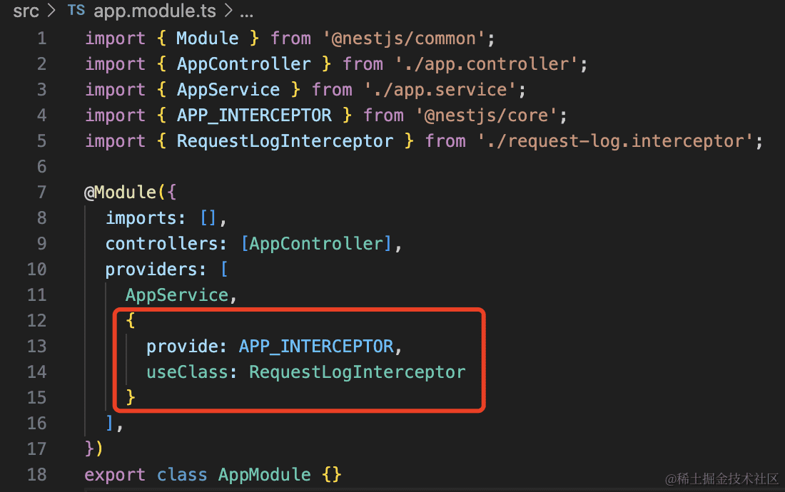

```javascript
import { Module } from '@nestjs/common';
import { AppController } from './app.controller';
import { AppService } from './app.service';
import { APP_INTERCEPTOR } from '@nestjs/core';
import { RequestLogInterceptor } from './request-log.interceptor';

@Module({
  imports: [],
  controllers: [AppController],
  providers: [
    AppService,
    {
      provide: APP_INTERCEPTOR,
      useClass: RequestLogInterceptor
    }
  ],
})
export class AppModule {}
```

把服务跑起来：`npm run start:dev`

浏览器访问下：


可以看到，打印了请求的信息，目标 class、handler，响应的内容。

但其实这个 ip 是有问题的：

如果客户端直接请求 Nest 服务，那这个 ip 是准的，但如果中间经过了 nginx 等服务器的转发，那拿到的 ip 就是 nginx 服务器的 ip 了。

这时候要取 X-Forwarded-For 这个 header，它记录着转发的客户端 ip。

当然，这种事情不用自己做，有专门的库 request-ip：

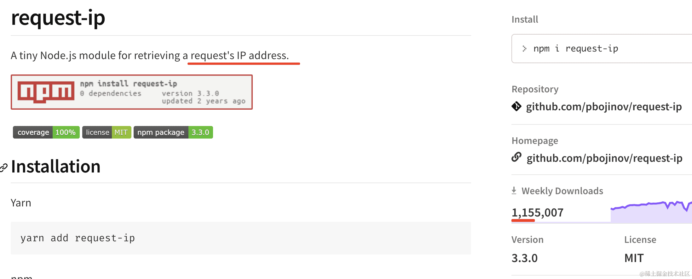

安装下：`npm install --save request-ip`

然后把打印的 ip 换一下：

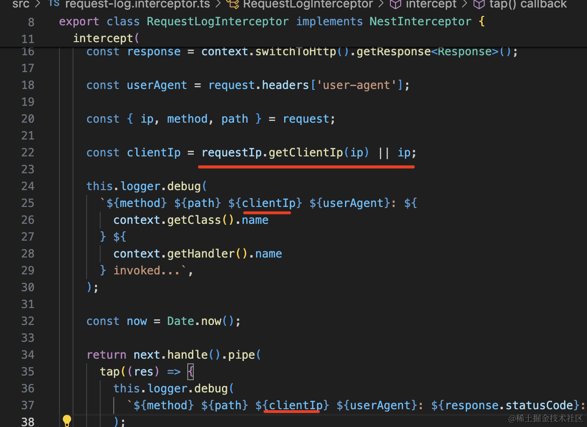

换成 X-Forwarded-For 的客户端 ip 或者是 request.ip。

```javascript
import { CallHandler, ExecutionContext, Injectable, Logger, NestInterceptor } from '@nestjs/common';
import { Response } from 'express';
import { Request } from 'express';
import { Observable, tap } from 'rxjs';
import * as requestIp from 'request-ip';

@Injectable()
export class RequestLogInterceptor implements NestInterceptor {
  private readonly logger = new Logger(RequestLogInterceptor.name);

  intercept(
    context: ExecutionContext,
    next: CallHandler<any>,
  ) {
    const request = context.switchToHttp().getRequest<Request>();
    const response = context.switchToHttp().getResponse<Response>();

    const userAgent = request.headers['user-agent'];

    const { ip, method, path } = request;

    const clientIp = requestIp.getClientIp(ip) || ip;

    this.logger.debug(
      `${method} ${path} ${clientIp} ${userAgent}: ${
        context.getClass().name
      } ${
        context.getHandler().name
      } invoked...`,
    );

    const now = Date.now();

    return next.handle().pipe(
      tap((res) => {
        this.logger.debug(
          `${method} ${path} ${clientIp} ${userAgent}: ${response.statusCode}: ${Date.now() - now}ms`,
        );
        this.logger.debug(`Response: ${JSON.stringify(res)}`);
      }),
    );
  }
}
```

访问下：


因为我们本地访问用 localhost 是拿不到真实 ip 的。

你可以查一下本地 ip，用 ip 访问：


这里的 ::ffff 是 ipv6 地址的意思：

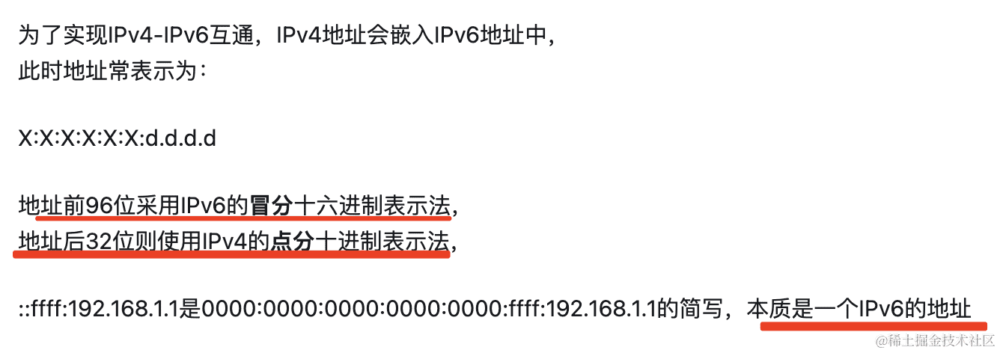

这样部署到线上之后就能拿到真实地址了。

那如果想拿到 ip 地址对应的城市呢？

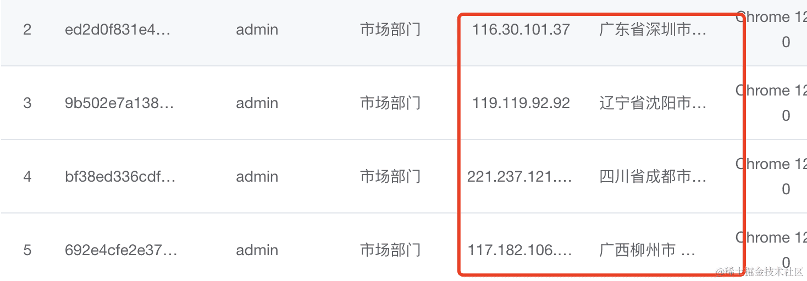

很多系统会做登录日志，每次登录的时候记录登录时的 ip 和对应的城市信息到数据库里。

如何根据 ip 拿到城市信息呢？

其实可以通过一些在线的免费接口：

https://whois.pconline.com.cn/ipJson.jsp?ip=221.237.121.165&json=true

这个就是用于查询 IP 对应的城市的。


请求三方服务用 axios 的包，

安装下：`npm install --save @nestjs/axios axios`

在 AppModule 里引入下：

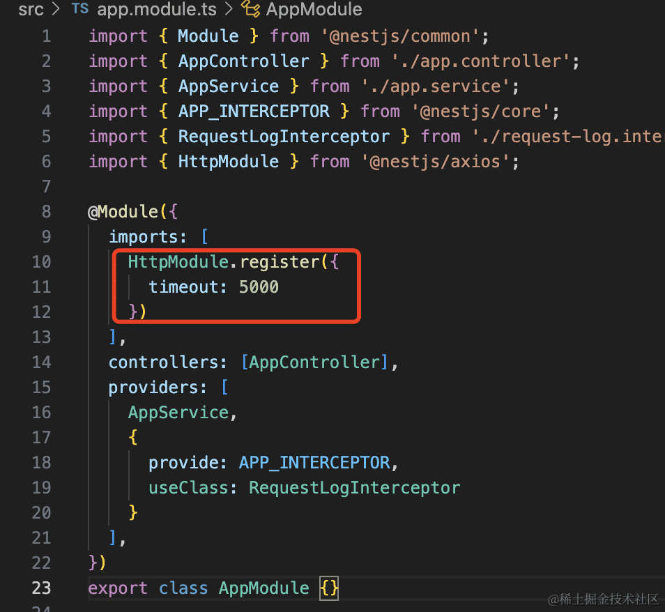

然后在 interceptor 里注入 HttpService 来发请求：


注入 HttpService，封装个 ipToCity 方法来查询，在 intercept 方法里调用下：

```javascript
import { CallHandler, ExecutionContext, Inject, Injectable, Logger, NestInterceptor } from '@nestjs/common';
import { Response } from 'express';
import { Request } from 'express';
import { Observable, tap } from 'rxjs';
import * as requestIp from 'request-ip';
import { HttpService } from '@nestjs/axios';

@Injectable()
export class RequestLogInterceptor implements NestInterceptor {
  private readonly logger = new Logger(RequestLogInterceptor.name);

  @Inject(HttpService)
  private httpService: HttpService;

  async ipToCity(ip: string) {
    const response = await this.httpService.axiosRef(`https://whois.pconline.com.cn/ipJson.jsp?ip=${ip}&json=true`);
    return response.data.addr;
  }

  async intercept(
    context: ExecutionContext,
    next: CallHandler<any>,
  ) {
    const request = context.switchToHttp().getRequest<Request>();
    const response = context.switchToHttp().getResponse<Response>();

    console.log(await this.ipToCity('221.237.121.165'))

    const userAgent = request.headers['user-agent'];

    const { ip, method, path } = request;

    const clientIp = requestIp.getClientIp(ip) || ip;

    this.logger.debug(
      `${method} ${path} ${clientIp} ${userAgent}: ${
        context.getClass().name
      } ${
        context.getHandler().name
      } invoked...`,
    );

    const now = Date.now();

    return next.handle().pipe(
      tap((res) => {
        this.logger.debug(
          `${method} ${path} ${clientIp} ${userAgent}: ${response.statusCode}: ${Date.now() - now}ms`,
        );
        this.logger.debug(`Response: ${JSON.stringify(res)}`);
      }),
    );
  }
}
```

直接用 httpService 的方法是被包装过后的，返回值是 rxjs 的 Observable，需要用 firstValueFrom 的操作符转为 promise：

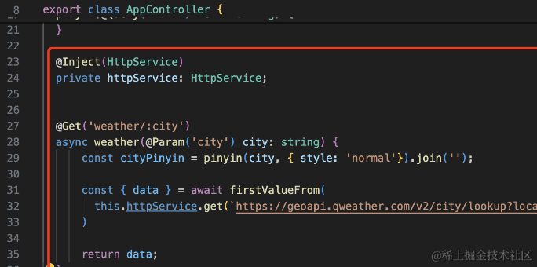

如果想用原生 axios 对象，可以直接调用 this.httpService.axiosRef.xxx，这样返回的就是 promise。

可以看到，返回的数据是没问题的，但是字符集不对：

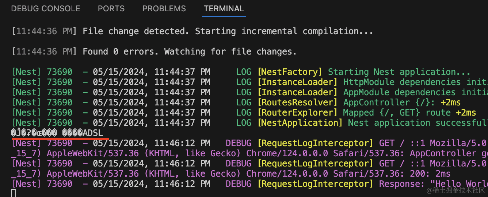


接口返回的字符集是 gbk，而我们用的是 utf-8，所以需要转换一下。

用 iconv-lite 这个包：

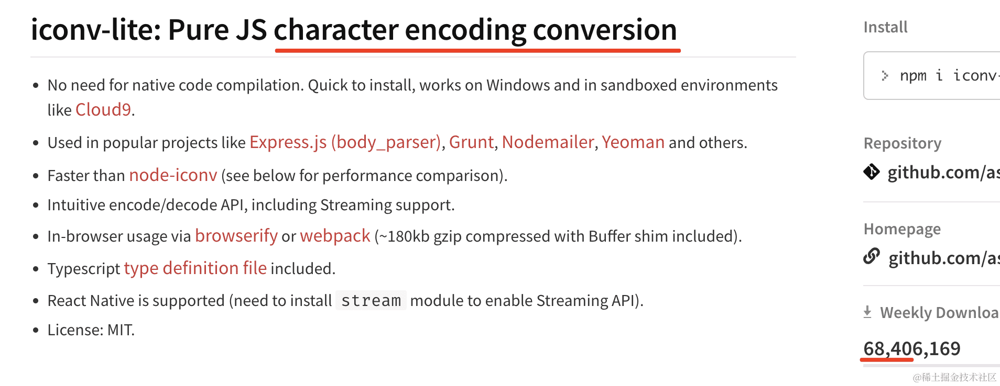

它就是用来转换字符集的。

```
npm install --save iconv
```

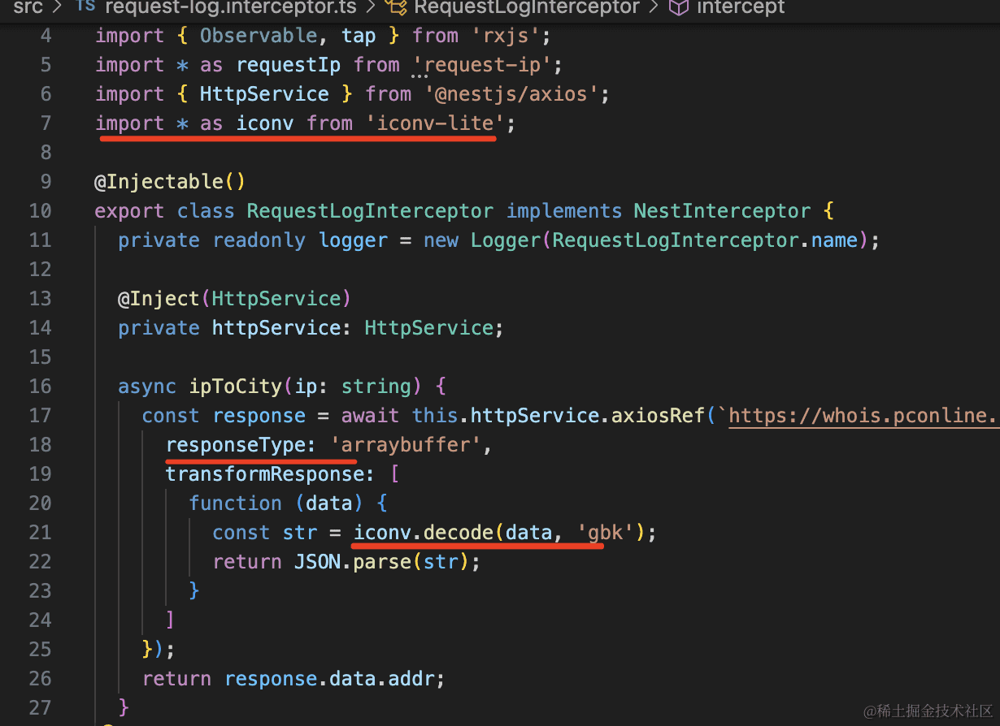

指定 responseType 为 arraybuffer，也就是二进制的数组，然后用 gbk 的字符集来解码。

```javascript
async ipToCity(ip: string) {
    const response = await this.httpService.axiosRef(`https://whois.pconline.com.cn/ipJson.jsp?ip=${ip}&json=true`, {
      responseType: 'arraybuffer',
      transformResponse: [
        function (data) {
          const str = iconv.decode(data, 'gbk');
          return JSON.parse(str);
        }
      ]
    });
    return response.data.addr;
}
```

现在，就能拿到 utf-8 编码的城市信息了：

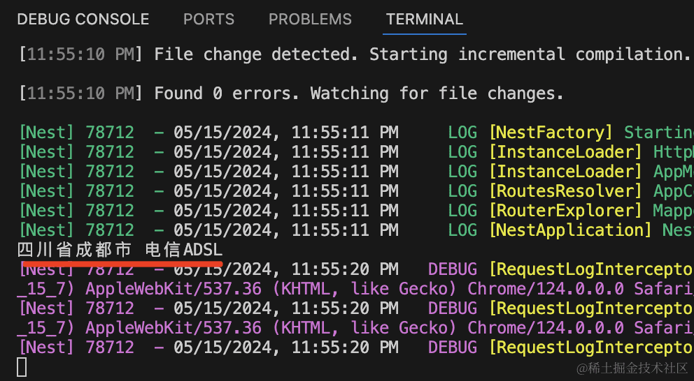

当然，这个不建议放到请求日志里，不然每次请求都调用一次接口太浪费性能了。

登录日志里可以加这个。

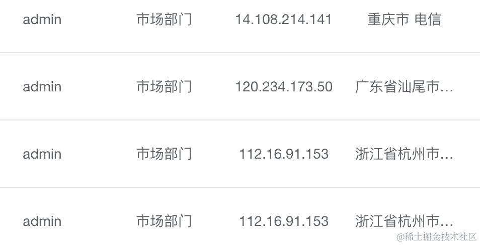

案例代码上传了[小册仓库](https://github.com/QuarkGluonPlasma/nestjs-course-code/tree/main/request-log)

## 总结

我们通过 interceptor 实现了记录请求日志的功能。

其中 ip 地址如果被 nginx 转发过，需要取 X-Forwarded-For 的 header 的值，我们直接用 request-ip 这个包来做。

如果想拿到 ip 对应的城市信息，可以用一些免费接口来查询，用 @nestjs/axios 来发送请求。当然，这个不建议放到请求日志里。

这样，就可以记录下每次请求响应的信息了。

