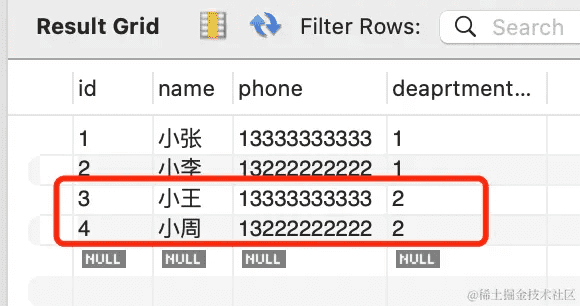
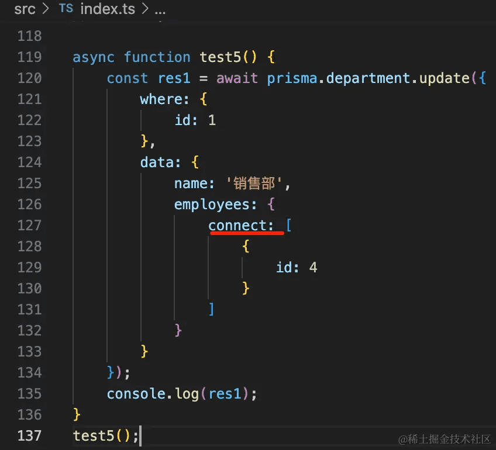

我们学了 Prisma 的命令、schema 的语法，这节来过一遍 Prisma Client 的 api。

## 单表操作

### findUnique

findUnique 是用来查找唯一的记录的，可以根据主键或者有唯一索引的列来查：

```javascript
import { PrismaClient } from '@prisma/client'

const prisma = new PrismaClient({
  log: [
    {
      emit: 'stdout',
      level: 'query'
    },
  ],
});

async function test1() {
    const aaa = await prisma.aaa.findUnique({
        where: {
            id: 1
        }
    });
    console.log(aaa);

    const bbb = await prisma.aaa.findUnique({
        where: {
            email: 'bbb@xx.com'
        }
    });
    console.log(bbb);
}

test1();
```

所以，这里的 id、email 都可以：


跑一下试试：`npx ts-node ./src/index.ts`


但是如果指定 name 就不行了：


因为通过 name 来查并不能保证记录唯一。

你还可以通过 select 指定返回的列：

```javascript
async function test1() {
    const aaa = await prisma.aaa.findUnique({
        where: {
            id: 1
        }
    });
    console.log(aaa);

    const bbb = await prisma.aaa.findUnique({
        where: {
            email: 'bbb@xx.com'
        },
        select: {
            id: true,
            email: true
        }
    });
    console.log(bbb);
}
```

比如我通过 select 指定返回 id、email：


那结果里就只包含这两个字段。


### findUniqueOrThrow

**findUniqueOrThrow 和 findUnique 的区别是它如果没找到对应的记录会抛异常，而 findUnique 会返回 null。**

先试下 findUnique：

```javascript
import { PrismaClient } from '@prisma/client'

const prisma = new PrismaClient({
  log: [
    {
      emit: 'stdout',
      level: 'query'
    },
  ],
});


async function test2() {
    const aaa = await prisma.aaa.findUnique({
        where: {
            id: 10
        }
    });
    console.log(aaa);
}

test2();
```


再换成 findUniqueOrThrow 试试：

```javascript
import { PrismaClient } from '@prisma/client'

const prisma = new PrismaClient({
  log: [
    {
      emit: 'stdout',
      level: 'query'
    },
  ],
});

async function test2() {
    const aaa = await prisma.aaa.findUniqueOrThrow({
        where: {
            id: 10
        }
    });
    console.log(aaa);
}

test2();
```

如果没找到会抛异常：


### findMany

findMany 很明显是查找多条记录的。

比如查找 email 包含 xx 的记录，按照 name 降序排列：

```javascript
import { PrismaClient } from '@prisma/client'

const prisma = new PrismaClient({
  log: [
    {
      emit: 'stdout',
      level: 'query'
    },
  ],
});

async function test3() {
    const res = await prisma.aaa.findMany({
        where: {
            email: {
                contains: 'xx'
            }
        },
        orderBy: {
            name: 'desc'
        }
    });
    console.log(res);
}

test3();

```

跑一下：`npx ts-node ./src/index.ts`


然后再加个分页，取从第 2 条开始的 3 条。

```javascript
async function test3() {
    const res = await prisma.aaa.findMany({
        where: {
            email: {
                contains: 'xx'
            }
        },
        orderBy: {
            name: 'desc'
        },
        skip: 2,
        take: 3
    });
    console.log(res);
}
```

下标是从 0 开始的，所以是这三条：


当然，你可以再加上 select 指定返回的字段：

```javascript
async function test3() {
    const res = await prisma.aaa.findMany({
        where: {
            email: {
                contains: 'xx'
            }
        },
        select: {
            id: true,
            email: true,
        },
        orderBy: {
            name: 'desc'
        },
        skip: 2,
        take: 3
    });
    console.log(res);
}
```


你会发现熟练 sql 之后，这些 api 用起来都很自然，过一遍就会了。


### findFirst

findFirst 和 findMany 的唯一区别是，这个返回第一条记录。

```javascript
async  function test4() {
    const res = await prisma.aaa.findFirst({
        where: {
            email: {
                contains: 'xx'
            }
        },
        select: {
            id: true,
            email: true,
        },
        orderBy: {
            name: 'desc'
        },
        skip: 2,
        take: 3
    });
    console.log(res);
}
test4();
```


此外，where 条件这里可以指定的更细致：


contains 是包含，endsWith 是以什么结尾

gt 是 greater than 大于，lte 是 less than or equal 大于等于

这些过滤条件都很容易理解，就不展开了。

此外，还有 findFirstOrThrow 方法，那个也是如果没找到，抛异常，参数和 FindFirst 一样。


### create

这个我们用过多次了，用来创建记录：

```javascript
async  function test5() {
    const res = await prisma.aaa.create({
        data: {
            name: 'kk',
            email: 'kk@xx.com'
        },
        select: {
            email: true
        }
    });
    console.log(res);
}
test5();
```

它同样也可以通过 select 指定插入之后再查询出来的字段。


createMany 我们用过，这里就不测了：


### update

update 明显是用来更新的。

它可以指定 where 条件，指定 data，还可以指定 select 出的字段：

```javascript
async function test6() {
    const res = await prisma.aaa.update({
        where: { id: 3 },
        data: { email: '3333@xx.com' },
        select: {
            id: true,
            email: true
        }
    });
    console.log(res);
}

test6();
```

跑一下：`npx ts-node ./src/index.ts`


可以看到，打印了 3 条 sql：

首先根据 where 条件查询出这条记录，然后 update，之后再 select 查询出更新后的记录。

updateMany 自然是更新多条记录。

比如你想更新所有邮箱包含 xx.com 的记录为 666@xx.com


用 update 会报错，它只是用来更新单条记录的，需要指定 id 或者有唯一索引的列。

这时候改成 udpateMany 就可以了。

```javascript
async function test7() {
    const res = await prisma.aaa.updateMany({
        where: { 
            email: {
                contains: 'xx.com'
            } 
        },
        data: { name: '666' },
    });
    console.log(res);
}

test7();
```


在 mysql workbench 里可以看到，确实改了：


### upsert

upsert 是 update 和 insert 的意思。

当传入的 id 有对应记录的时候，会更新，否则，会创建记录。

```javascript
async function test8() {
    const res = await prisma.aaa.upsert({
        where: { id: 11 },
        update: { email: 'yy@xx.com' },
        create: { 
            id:  11,
            name: 'xxx',
            email: 'xxx@xx.com'
        },
    });
    console.log(res);
}

test8();
```

第一次跑执行的是 insert：


第二次跑就是 update 了：


### delete

delete 就比较简单了，我们和 deleteMany 一起测试下：

```javascript
async function test9() {
    await prisma.aaa.delete({
        where: { id: 1 },
    });

    await prisma.aaa.deleteMany({
        where: {
            id: {
                in: [11, 2]
            }
        }
    });
}

test9();
```


可以看到有两条 delete 语句。


可以看到 3 条记录都被删除了。


### count

count 其实和 findMany 参数一样，只不过这里不返回具体记录，而是返回记录的条数。

比如 findMany 是这样的：

```javascript
async function test10() {
    const res = await prisma.aaa.findMany({
        where: {
            email: {
                contains: 'xx'
            }
        },
        orderBy: {
            name: 'desc'
        },
        skip: 2,
        take: 3
    });
    console.log(res);
}
test10();
```


把 findMany 改为 count 就是这样了：

```javascript
async function test10() {
    const res = await prisma.aaa.count({
        where: {
            email: {
                contains: 'xx'
            }
        },
        orderBy: {
            name: 'desc'
        },
        skip: 2,
        take: 3
    });
    console.log(res);
}
test10();
```


### aggregate 

aggregate 是统计相关的。

它除了 where、orderBy、skip、take 这些参数外，还可以指定 _count、_avg、_sum、_min、_max
这些。

不过我们现在的表里没有数字相关的列。

改一下 model：


```
model Aaa {
  id    Int     @id @default(autoincrement())
  email String  @unique
  name  String?
  age Int       @default(0)
}
```

然后创建一个新的 migration：

```
npx prisma migrate dev --name bbb
```


对应的 sql 如下：


然后我们用代码改一下：

```javascript
async function test11() {
    await prisma.aaa.update({
        where: {
            id: 3
        },
        data: {
            age: 3
        }
    });

    await prisma.aaa.update({
        where: {
            id: 5
        },
        data: {
            age: 5
        }
    });
}
test11();
```


在 mysql workbench 里刷新下，可以看到确实改了：


接下来就可以测试 aggregate 方法了：

```javascript
async function test12() {
    const res = await prisma.aaa.aggregate({
        where: {
            email: {
                contains: 'xx.com'
            }
        },
        _count: {
            _all: true,
        },
        _max: {
            age: true
        },
        _min: {
            age: true
        },
        _avg: {
            age: true
        }
    });
    console.log(res);
}
test12();
```

跑一下：


可以看到返回的最大值、最小值、计数、平均值，都是对的。


### groupBy

最后还有个 groupBy 方法，大家有 sql 基础也很容易搞懂，这个就是分组的。

```javascript
async function test13() {
    const res = await prisma.aaa.groupBy({
        by: ['email'],
        _count: {
          _all: true
        },
        _sum: {
          age: true,
        },
        having: {
          age: {
            _avg: {
              gt: 2,
            }
          },
        },
    })
    console.log(res);
}

test13();

```

就是按照 email 分组，过滤出平均年龄大于 2 的分组，计算年龄总和返回。

结果如下：


因为 age 大于 2 的就 2 条，然后算平均值、计数，就是上面的结果了：


## 多表操作

设置datasource 的 provider 为 mysql，并且添加 model

```prisma
generator client {
  provider = "prisma-client-js"
}

datasource db {
  provider = "mysql"
  url      = env("DATABASE_URL")
}

model Department {
  id        Int    @id @default(autoincrement())
  name      String  @db.VarChar(20)
  createTime DateTime @default(now())
  updateTime DateTime @updatedAt
  employees     Employee[]
}

model Employee {
  id         Int       @id @default(autoincrement())
  name      String     @db.VarChar(20)
  phone     String     @db.VarChar(30)  

  deaprtmentId Int
  department     Department      @relation(fields: [deaprtmentId], references: [id])
}
```

之后执行 migrate reset 重置下：`npx prisma migrate reset`

然后用 migrate dev 创建新的迁移：`npx prisma migrate dev --name aaa`

生成了 client 代码，还有 sql 文件。


数据库中也多了这 2 个表：


然后来写下 client 的 crud 代码。

首先安装 ts、ts-node 包：`npm install typescript ts-node @types/node --save-dev`

创建 tsconfig.json`npx tsc --init`

把注释删掉，保留这些配置就行：

```json
{
  "compilerOptions": {
    "target": "es2016",
    "module": "commonjs",
    "types": ["node"],
    "esModuleInterop": true,
    "forceConsistentCasingInFileNames": true,
    "strict": true,
    "skipLibCheck": true
  }
}
```

创建 src/index.ts

```javascript
import { PrismaClient } from '@prisma/client'

const prisma = new PrismaClient({
  log: [
    {
      emit: 'stdout',
      level: 'query'
    },
  ],
});

async function main() { 
}

main();
```

然后分别做下 CRUD


### 插入数据

首先是插入数据：

```javascript
import { PrismaClient } from '@prisma/client'

const prisma = new PrismaClient({
  log: [
    {
      emit: 'stdout',
      level: 'query'
    },
  ],
});

async function test1() {
   await prisma.department.create({
        data: {
            name: '技术部',
            employees: {
                create: [
                    {
                        name: '小张',
                        phone: '13333333333'
                    },
                    {
                        name: '小李',
                        phone: '13222222222'
                    }
                ]
            }
        }
   })
}

test1();
```

插入关联 model 的数据的时候，也是用 create 指定：


测试下：`npx ts-node ./src/index.ts`


在 mysql workbench 里看下结果：


确实，数据都被正确插入了。

当然，你也可以用这种写法：


```javascript
async function test2() {
    await prisma.department.create({
         data: {
             name: '技术部',
             employees: {
                 createMany: {
                    data: [
                        {
                            name: '小王',
                            phone: '13333333333'
                        },
                        {
                            name: '小周',
                            phone: '13222222222'
                        }
                    ],

                 }
             }
         }
    })
}

test2();
```

跑一下：


效果一样：





### 关联查询

那如何关联查询呢？

可以这样写：

```javascript
async function test3() {
    const res1 = await prisma.department.findUnique({
        where: {
            id: 1
        },
        include: {
            employees: true
        }
    });
    console.log(res1);

    const res2 = await prisma.department.findUnique({
        where: {
            id: 1
        },
        include: {
            employees: {
                where: {
                    name: '小张'
                },
                select: {
                    name: true
                }
            }
        }
    });
    console.log(res2);

    const res3 = await prisma.department.findUnique({
        where: {
            id: 1
        }
    }).employees();
    console.log(res3);
}

test3();
```

查询 department 的时候，通过 include 指定关联查询出 employees。

include 还可以指定 where 等查询的参数，进一步过滤。

此外，你也可以在查出 department 后调用 empolyees() 方法来查询。

可以看到，都能正确查出关联数据：


### 关联更新

再就是关联更新：

```javascript
async function test4() {
    const res1 = await prisma.department.update({
        where: {
            id: 1
        },
        data: {
            name: '销售部',
            employees: {
                create: [
                    {
                        name: '小刘',
                        phone: '13266666666'
                    }
                ]
            }
        }
    });
    console.log(res1);
}

test4();
```

比如我在更新 department 的时候关联插入了一条 employee 的记录。

跑一下：


在 mysql workbench 里可以看到，id 为 1 的 department 更新了：


关联插入了一条 employee 的记录：


更新 department 的时候，除了可以插入 empolyee 的数据，也可以和别的 empolyee 建立关联。

比如 id 为 4 的 empolyee：


现在他关联的是 id 为 2 的 department。

我们 update 的时候使用 connect 和它关联：

```javascript
async function test5() {
    const res1 = await prisma.department.update({
        where: {
            id: 1
        },
        data: {
            name: '销售部',
            employees: {
                connect: [
                    {
                        id: 4
                    }
                ]
            }
        }
    });
    console.log(res1);
}
test5();
```



跑一下：


刷新可以看到，id 为 4 的 employee 关联的 department 就变了：


如果是某个 id 的数据存在就 connect，不存在就 create 呢？

可以这样写：

```javascript
async function test6() {
    const res1 = await prisma.department.update({
        where: {
            id: 1
        },
        data: {
            name: '销售部',
            employees: {
                connectOrCreate: {
                    where: {
                        id: 6
                    },
                    create: {
                        id: 6,
                        name: '小张',
                        phone: '13256665555'
                    }
                }
            }
        }
    });
    console.log(res1);
}
test6();
```

第一次跑，执行的是 insert：


第二次跑，就是 update 了：


也就是说，update 的时候可以通过 create、connect、connectOrCreate 来插入新的关联 model 的记录或者关联已有的记录。

当然，create 的时候也可以这样：


效果一样，就不一个个测试了。


### 删除

再就是删除：

如果我们想删除 id 为 1 的 department 的所有 empolyee，可以这样写：

```javascript
async function test7() {
    await prisma.employee.deleteMany({
        where: {
            department: {
                id: 1
            }
        },
    });
}
test7();
```


这就是多个 model 关联时的 CRUD。


## 执行sql

此外，Prisma 还可以直接执行 sql：

```javascript
async function test8() {
    await prisma.$executeRaw`TRUNCATE TABLE Employee`;

    const res = await prisma.$queryRaw`select * from Department`;
    console.log(res);
}
test8();
```


这样，当上面的 api 都不能满足需求的时候，你就可以直接执行 sql。

案例代码在[小册仓库](https://github.com/QuarkGluonPlasma/nestjs-course-code/tree/main/prisma-client-api2)
