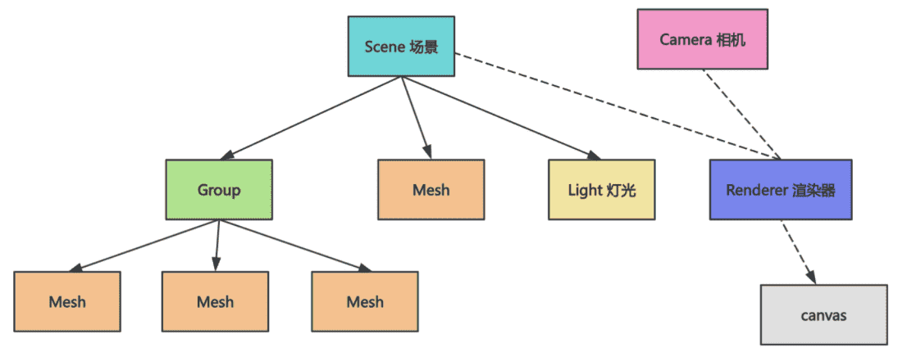
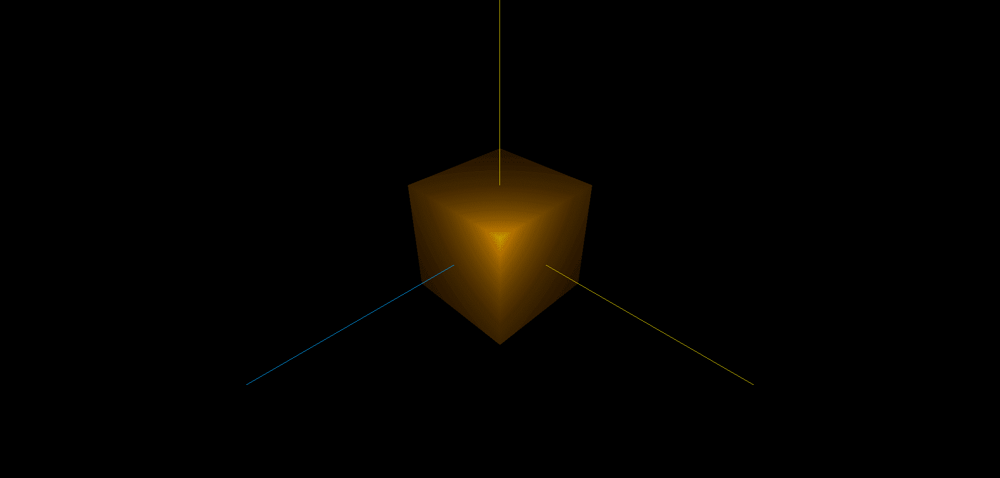

[官网](https://threejs.org/)

## 了解Three.js

Three.js 是用来创建和渲染三维世界的。

那它是怎么描述三维世界的呢？

首先，三维世界是由一个个物体组成，比如常用的 Mesh（物体）。

每一个物体都有它的形状，也就是几何体 Geometry，还有材质 Material，比如颜色、粗糙度、金属感等等。

所有物体都有 Geometry（几何） 和 Material（材料） 这两部分。

物体可以通过 Group 分组，最终构成一棵树，添加到场景 Scene 中。


是不是和 dom 树很像？

没错，3D 的世界也是有一颗树的。

但 3D 世界我们知道，从不同角度观察，看到的内容是不一样的。

所以有**相机 Camera** 的概念。

相机放在不同位置，看到的画面就是不一样的。

有相机还不行，**三维世界是有光和阴影的，可以展示不同的明暗效果**。

所以有**灯光 Light** 的概念。

最后有一个**渲染器 Renderer 负责渲染**，把**场景 Scene、相机 Camera、灯光 Light** 这些综合**渲染到 canvas 画布上**。

分工明确，Three.js 就是这样来渲染三维世界的：




## 创建场景

### 先看效果

1. `npm create vite@latest` 选择 vanilla 空框架
2. 安装three与types

```
npm i three
npm install --save-dev @types/three
```


写下three.js 代码

```js
import * as THREE from 'three';

const scene = new THREE.Scene();

{
    const geometry = new THREE.BoxGeometry(100, 100, 100);
    const material = new THREE.MeshLambertMaterial(({
        color: new THREE.Color('orange')
    }));
    const mesh = new THREE.Mesh(geometry, material);
    mesh.position.set(0, 0, 0);
    scene.add(mesh);
}

{
    const pointLight = new THREE.PointLight(0xffffff, 10000);
    pointLight.position.set(80, 80, 80);
    scene.add(pointLight);
}

{
    const width = window.innerWidth;
    const height = window.innerHeight;

    const camera = new THREE.PerspectiveCamera(60, width / height, 1, 1000);
    camera.position.set(200, 200, 200);
    camera.lookAt(0, 0, 0);

    const renderer = new THREE.WebGLRenderer();
    renderer.setSize(width, height)

    renderer.render(scene, camera);

    document.body.append(renderer.domElement);
}
```

先看效果


可以看到，页面渲染出了一个橙色的立方体，而且明显能感觉到光照的明暗变化。


### 看代码-1

```js
import * as THREE from 'three';

// 1.第一步先创建一个场景
const scene = new THREE.Scene();

// 2.然后像我们之前说的往场景里添加物品mesh和灯光light
{
    // 2.1 Mesh 的几何体是一个 BoxGeometry 立方体，它的材质是一个漫反射材质 MeshLambertMaterial，这个材质支持漫反射，我们设置了一个橙色
    const geometry = new THREE.BoxGeometry(100, 100, 100);
    const material = new THREE.MeshLambertMaterial(({
        color: new THREE.Color('orange')
    }));
    
    // 2.2 然后传入 geometry 和 material 来创建 Mesh
    const mesh = new THREE.Mesh(geometry, material);
    // 2.3 设置坐标（0,0,0），就是中心位置，在下面一章 AxesHelper 会详细的看到这个坐标位置
    mesh.position.set(0, 0, 0);
    scene.add(mesh);
}

// 3. 添加灯光
{
    // 3.1 灯光我们用了点光源，就和灯泡一样，从一个点发射光线，设置颜色为白色，光照强度 10000
    const pointLight = new THREE.PointLight(0xffffff, 10000);
    // 3.2 位置在 80,80,80 的位置，默认照向 0,0,0 的方向。
    // 3.3 那么很显然，立方体长宽高为 100，有一个角是在 50,50,50 的位置，离灯光近一点，所以有明显的高亮。
    pointLight.position.set(80, 80, 80);
    scene.add(pointLight);
}
```


### AxesHelper

为了看清我们的坐标位置添加 展示坐标系的工具 AxesHelper

```js
{
    // 参数是坐标轴的长度，设置 200
	const axesHelper = new THREE.AxesHelper(200);
	scene.add(axesHelper);
}
```



现在就可以看到坐标轴了，**红绿蓝分别对应 x、y、z 轴**，非常好记，所有的 3D 软件基本都是这样

可以看到，立方体确实是在 0,0,0 的位置。


### 看代码-2

还有一部分代码我们没有看

```js
{
    const width = window.innerWidth;
    const height = window.innerHeight;

    // 1. 创建一个透视相机，它又四个参数，四个参数我们在下面解释
    const camera = new THREE.PerspectiveCamera(60, width / height, 1, 1000);
    // 1.1 在 200,200,200 的位置看向 0,0,0
    camera.position.set(200, 200, 200);
    camera.lookAt(0, 0, 0);

    // 2. 最后，就像前面说的，用 Renderer 把 Scene 渲染到 canvas 上
    const renderer = new THREE.WebGLRenderer();
    renderer.setSize(width, height)

    // 2.1 参数是 scene、camera，就是把 camera 看到的场景 scene 的样子渲染出来
    renderer.render(scene, camera);

    document.body.append(renderer.domElement);
}
```


**PerspectiveCamera四个参数**


这叫做视椎体。相机的 4 个参数就是描述这个视椎体的。

- 第一个参数是角度（fov），也就是看的范围有多大。
- 第二个参数是宽高比，也就是这个视椎体的宽和高的比例。
- 第三个和第四个参数是展示视椎体的哪一部分，最近是哪，最远是哪。

我们设置了角度为 60，宽高比是窗口的宽高比（window.innerWidth/window.innerHeight ）。

然后最近和最远的截面距离也设置了一个比较大的范围，最终就是我们看到的这个


## 拖动3D

### 代码

很多三维软件都支持通过鼠标拖动来 360 度观察 3D 场景。这个如何实现呢？

用 Three.js 提供的轨道控制器 OrbitControls 即可

```js
import {
    OrbitControls
} from 'three/addons/controls/OrbitControls.js';
```

```js
{
    const width = window.innerWidth;
    const height = window.innerHeight;

    const camera = new THREE.PerspectiveCamera(60, width / height, 1, 1000);
    camera.position.set(200, 200, 200);
    camera.lookAt(0, 0, 0);

    const renderer = new THREE.WebGLRenderer();
    renderer.setSize(width, height)

    function render() {
        renderer.render(scene, camera); // 渲染这一帧
        // 在下一帧调用 render 函数
        requestAnimationFrame(render); // 请求下一帧继续渲染
    }

    render()

    document.body.append(renderer.domElement);

    new OrbitControls(camera, renderer.domElement);
}
```

创建 OrbitControls 的实例，传入 camera 和 canvas 元素。

这里需要把 render 改成渲染循环，用 requestAnimationFrame 来一帧帧的循环渲染。

为什么用requestAnimationFrame ？

因为requestAnimationFrame 的调用频率和显示器刷新率一致

现在就可以通过鼠标拖动来 360 度观察 3D 场景了。


> 解释代码
>
> ```js
> function render() {
>     renderer.render(scene, camera); 
>     requestAnimationFrame(render); 
> }
> 
> render()
> ```
>
> 这里的 `render` 是 **函数本身的名字**，所以这其实是一个**递归调用**，但是通过 `requestAnimationFrame` 实现的，这种写法是浏览器推荐的动画执行方式。
>
> **为什么要这么写**
>
> Three.js 通常用于创建动态的、可交互的 3D 场景，比如动画、摄像机控制、物体旋转等。所以你需要不断地 **重新渲染场景** 来反映这些变化。
>
> 这段代码实际上就是**一个渲染循环**（也叫“游戏循环”）：
>
> ```js
> // 在下一帧调用 render 函数
> function render() {
>     renderer.render(scene, camera); // 渲染这一帧
>     requestAnimationFrame(render);  // 请求下一帧继续渲染
> }
> ```


### 原理

大家想一下是啥原理？

其实很简单，就是 canvas 监听鼠标事件，然后根据鼠标的移动来修改相机 camera 的位置就可以了。

它的参数也是这俩：

```js
new OrbitControls(camera, renderer.domElement);
```

注释掉，打开 devtools 看下 canvas 元素的事件监听器：


放开注释看一下：


可以看到，监听了 canvas 元素的 pointer、contextmenu、wheel 等鼠标事件，内部修改 camara 参数就可以了。


## 总结

**在 Scene 中添加各种 Mesh，每个 Mesh 都是由几何体 Geometry 和材质 Material 构成，设置相机 Camera 的角度和可视范围，设置灯光 Light 的位置，然后通过渲染器 Renderer 渲染到 canvas 元素上，把这个 canvas 挂载到 dom。**

