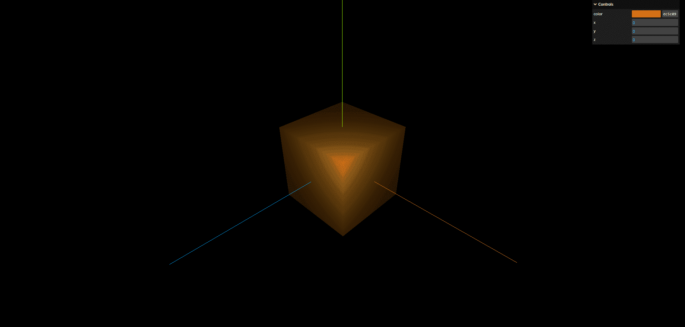
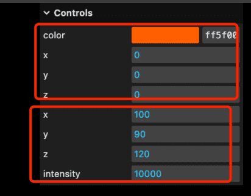
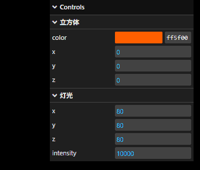
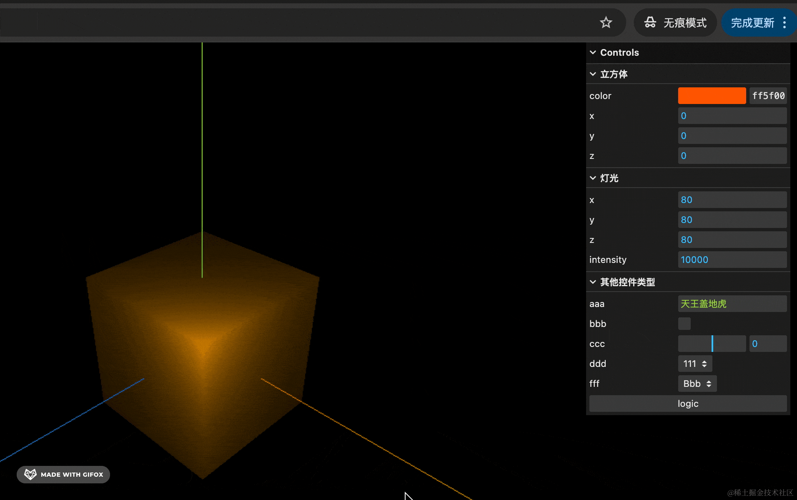
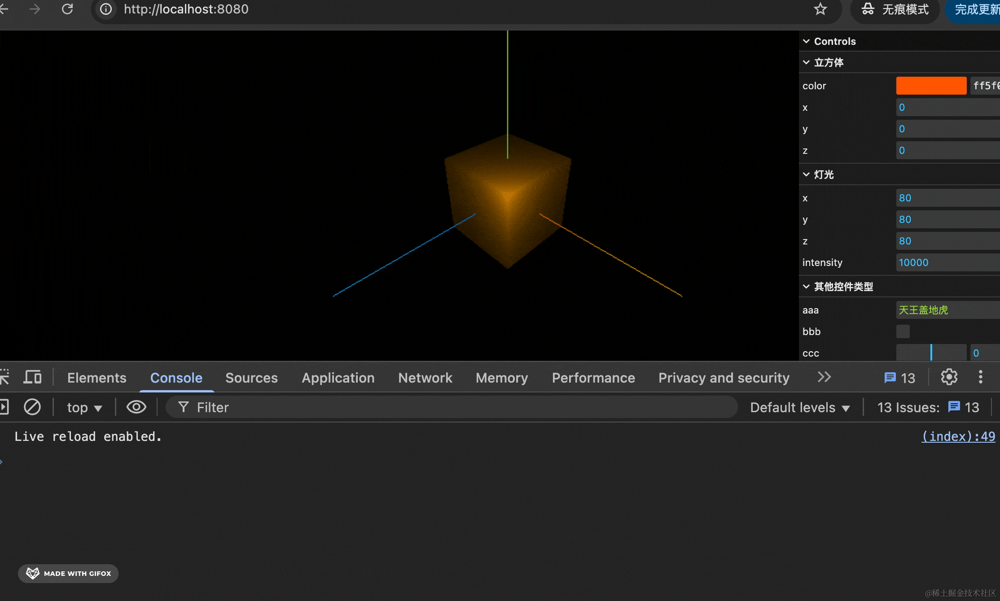

## 准备

现在还是上节的代码。

```js
import * as THREE from 'three';
import { OrbitControls } from 'three/examples/jsm/controls/OrbitControls.js';

const scene = new THREE.Scene();

const geometry = new THREE.BoxGeometry(100, 100, 100);
const material = new THREE.MeshLambertMaterial(({
    color: new THREE.Color('orange')
}));
const mesh = new THREE.Mesh(geometry, material);
mesh.position.set(0, 0, 0);
scene.add(mesh);

const pointLight = new THREE.PointLight(0xffffff, 10000);
pointLight.position.set(80, 80, 80);
scene.add(pointLight);

const axesHelper = new THREE.AxesHelper(200);
scene.add(axesHelper);

const width = window.innerWidth;
const height = window.innerHeight;

const camera = new THREE.PerspectiveCamera(60, width / height, 1, 1000);
camera.position.set(200, 200, 200);
camera.lookAt(0, 0, 0);

const renderer = new THREE.WebGLRenderer();
renderer.setSize(width, height)

function render() {
    renderer.render(scene, camera);
    requestAnimationFrame(render);
}

render();

document.body.append(renderer.domElement);

const controls = new OrbitControls(camera, renderer.domElement);
```


## 引入 dat.gui

我们引入 dat.gui

```js
import { GUI } from 'three/examples/jsm/libs/lil-gui.module.min.js'
```


## 调整mesh

调整mesh，创建 gui 对象，添加几个控件：

```js
---
scene.add(mesh);

const gui = new GUI();
gui.addColor(mesh.material, 'color');
gui.add(mesh.position, 'x').step(10);
gui.add(mesh.position, 'y').step(10);
gui.add(mesh.position, 'z').step(10);


---
```

看一下效果



右上角出现了一个控制面板，可以可视化的调节立方体的颜色、位置等，你可以在这里调完之后，再把调好的数值更新到代码里。


## 灯光

灯光的位置、光照强度等显然也应该可视化的调一下：

```js
// 调节灯光位置 light.position 和强度 light.intensity，step 是步长，也就是每条调多少
gui.add(pointLight.position, 'x').step(10);
gui.add(pointLight.position, 'y').step(10);
gui.add(pointLight.position, 'z').step(10);
gui.add(pointLight, 'intensity').step(10);
```

调整后可以很直观感受到灯光强度和灯光位置的变化。


## 优化

但现在有个问题：



调节立方体和调节灯光的控件混在一起，比较乱。我们分个组

```js
const meshFolder = gui.addFolder('立方体');
meshFolder.addColor(mesh.material, 'color');
meshFolder.add(mesh.position, 'x').step(10);
meshFolder.add(mesh.position, 'y').step(10);
meshFolder.add(mesh.position, 'z').step(10);
```

```js
const lightFolder = gui.addFolder('灯光');
lightFolder.add(pointLight.position, 'x').step(10);
lightFolder.add(pointLight.position, 'y').step(10);
lightFolder.add(pointLight.position, 'z').step(10);
lightFolder.add(pointLight, 'intensity').step(1000);
```

效果：




## 其他控件类型

首先 addFolder 添加一个分组，然后添加各种控件。

其实用法都一样，都是 add，dat.gui 内部会自己根据属性的类型使用不同的控件。

如果是枚举值，需要用数组、对象的方式在第三个参数里列出来。

```js
const otherFolder = gui.addFolder('其他控件类型');

const obj = {
    aaa: '天王盖地虎',
    bbb: false,
    ccc: 0,
    ddd: '111',
    fff: 'Bbb',
    logic: function () {
      alert('执行一段逻辑!');
    }
};

otherFolder.add(obj, 'aaa');
otherFolder.add(obj, 'bbb');
otherFolder.add(obj, 'ccc').min(-10).max(10).step(0.5);
otherFolder.add(obj, 'ddd', [ '111', '222', '333' ] );
otherFolder.add(obj, 'fff', { Aaa: 0, Bbb: 0.1, Ccc: 5 } );
otherFolder.add(obj, 'logic');
```



可以看到，分别用输入框、下拉列表、单选框、range 条等来展示。

点击 logic 按钮会执行对应的函数。

要注意的是 ccc 那个，如果没有指定范围，交互就和上面的数字输入框差不多，有了 min、max 之后，会多一个 range 条。

min、max 也可以这样写：

```javascript
otherFolder.add(obj, 'ccc', -10, 10);
```

那这些自定义的值如何与三维场景联动呢？

```js
otherFolder.add(obj, 'aaa').onChange((value) => {
    console.log(value);
})
```

可以给它添加一个 onChange 事件，在里面拿到 value 来修改三维场景的参数就可以了。




## 总结

dat.gui 是可视化调试 3D 场景中一些参数的工具。

它可以通过 add 添加控件，通过 addFolder 对这些控件分组。

用法是这样 add(obj, 'prop')，每个控件的类型是根据属性值的类型来确定的，如果是枚举值，可以在第三个参数通过数组、对象来声明。

你还可以添加一些非 3D 场景参数的控件，在 onChange 的回调函数里拿到 value 来修改 3D 场景的参数。
