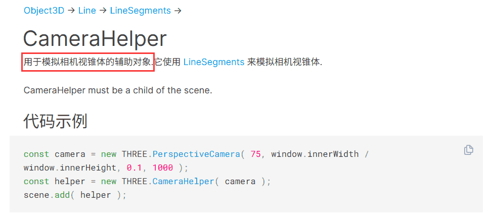

刚接触 Three.js 透视相机的视椎体确实是个比较难理解的概念。

这节我们把它可视化的在 3D 场景中展示出来，这样就容易理解了。


## 代码

不解释代码了

```js
import * as THREE from 'three';
import { OrbitControls } from 'three/examples/jsm/controls/OrbitControls.js';

const scene = new THREE.Scene();

const axesHelper = new THREE.AxesHelper(200);
scene.add(axesHelper);

const width = window.innerWidth;
const height = window.innerHeight;

const camera = new THREE.PerspectiveCamera(60, width / height, 1, 1000);
camera.position.set(200, 200, 200);
camera.lookAt(0, 0, 0);

const renderer = new THREE.WebGLRenderer();
renderer.setSize(width, height)

function render() {
    renderer.render(scene, camera);
    requestAnimationFrame(render);
}

render();

document.body.append(renderer.domElement);

const controls = new OrbitControls(camera, renderer.domElement);
```


## 开始

要看视椎体的话，我们需要创建另一个相机，用这个相机来观察：

Three.js 提供了一个 [CameraHelper](https://threejs.org/docs/index.html?q=Helper#api/zh/helpers/CameraHelper) 来画视椎体，传入 camera 就行：



我们单独创建一个 PerspectiveCamera，传入 CameraHelper：


把 AxesHelper 注释掉，不然比较乱。

```js
const camera2 = new THREE.PerspectiveCamera(20, 16 / 9, 100, 300);
const cameraHelper = new THREE.CameraHelper(camera2);
scene.add(cameraHelper);
```

现在就能看到视椎体了：


这里先顺便说下 OrbitContols 的操作：鼠标左键拖动可以上下左右旋转，鼠标右键拖动可以平移，鼠标滚轮可以缩放。

然后来说回这个视椎体：


`THREE.PerspectiveCamera(20, 16 / 9, 100, 300)`

第一个参数是角度(fov)，第二个参数是宽高比，第三个是近裁截面的距离（near），第四个参数是远裁截面的距离(far)。


这些参数是怎么影响这个视椎体的呢？

## dat.gui调试

我们用 dat.gui 来可视化调试下：

```js
import { GUI } from 'three/addons/libs/lil-gui.module.min.js';
```


```js
const camera2 = new THREE.PerspectiveCamera(20, 16 / 9, 100, 300);
let cameraHelper = new THREE.CameraHelper(camera2);
scene.add(cameraHelper);

const gui = new GUI();
function onChange() {
    camera2.updateProjectionMatrix();
    cameraHelper.update();
}
gui.add(camera2, 'fov', [30, 60, 10]).onChange(onChange);
gui.add(camera2, 'aspect', {
    '16/9': 16/9,
    '4/3': 4/3
}).onChange(onChange);
gui.add(camera2, 'near', 0, 300).onChange(onChange);
gui.add(camera2, 'far', 300, 800).onChange(onChange);
```

改了参数之后要调用 camera2 的 updateProjectionMatrix 方法来触发 camera 的更新，然后调用 cameraHelper.update 来更新 helper。

自己调节可以看到效果

我们看到的 3D 世界就是这个视椎体的 near 和 far 之间的部分。

在网页上显示的话，宽高比一般都是设置网页的宽高比也就是 window.innerWidth / window.innerHeight

而 near 一般设置 0.1，默认值也是 0.1

具体的参数：https://threejs.org/docs/?q=PerspectiveCamera#api/zh/cameras/PerspectiveCamera

near 默认值 0.1、far 默认值 2000，fov 默认值 50，aspect 默认值是 1

一般这个 aspect 是要改的。

near 设置了比较大，那离摄像机很近的一些物体就被截掉看不到了。

比如下雪的时候，离摄像机特别近的雪花会很大，这时候我们不希望看到特别大的雪花，就把近裁截面距离设置的大一点，把特别近的一些物体裁截掉。

far 就比较容易理解了，如果 far 不够大，那物体会被裁截看不到了。

所以我们经常会修改改 far 的范围，让它包含所有物体。

而 fov 角度影响的是能看的范围的多少，同时也会影响离物体的远近：


当你想物体离的远一点，除了调节相机的 position，不妨调小一些 fov 试试。


## 总结

我们通过 CameraHelper 来把视椎体可视化的画出来，然后用 dat.gui 调节了 fov、aspect、near、far 4 个参数，看了视椎体的变化。

- fov：影响可视范围角度、离物体远近
- aspect：可视范围宽高比，一般设置网页宽高比
- near：近裁截面距离，一般保持默认值 0.1，当你需要截掉一些特别近的物体的时候，把它加大
- far：远裁截面距离，如果有的物体被裁截掉看不到了，就需要调大 far 把它们包含进来

这就是透视相机的视椎体的 4 个参数，后面会经常用到，需要对它们有透彻的理解。
