前面我们用过立方体 BoxGeometry，其实 Three.js 还有很多别的几何体。

你在 [Three.js 文档](https://threejs.org/docs/index.html?q=Geometry#api/zh/geometries/BoxGeometry)搜 Geometry 就可以看到很多的几何体


## 总览

比如圆柱几何体 CylinderGeometry：

<iframe
  src="https://threejs.org/docs/scenes/geometry-browser.html#CylinderGeometry"
  width="100%"
  height="600"
  style={{  borderRadius: '8px' }}
/>

球几何体 SphereGeometry：
<iframe
  src="https://threejs.org/docs/scenes/geometry-browser.html#SphereGeometry"
  width="100%"
  height="600"
  style={{ borderRadius: '8px' }}
/>

平面几何体 PlaneGeometry：
<iframe
  src="https://threejs.org/docs/scenes/geometry-browser.html#PlaneGeometry"
  width="100%"
  height="600"
  style={{ borderRadius: '8px' }}
/>

你在左上角都可以看到它们继承自 BufferGeometry，它是所有几何体的父类。这节我们就来学下 BufferGeometry。

想一下，如果把所有的几何体抽象出来，那核心的是什么呢？是顶点。


## 顶点

比如 PlaneGeometry 有 4 个顶点：

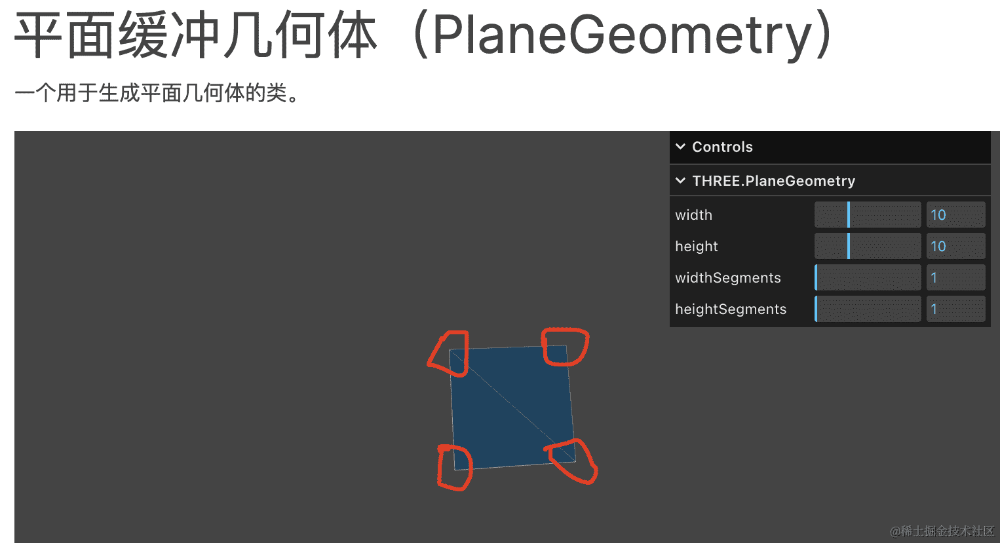

BoxGeometry 有 8 个顶点：

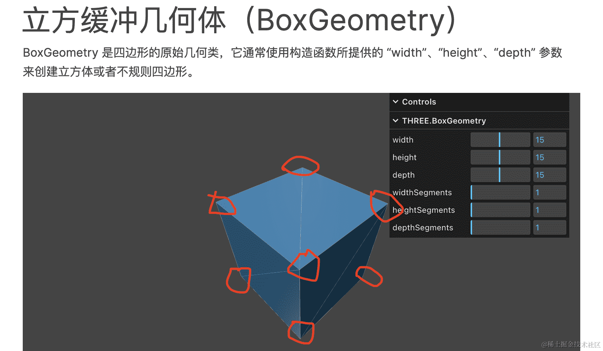

对，但不全对。

Mesh 是网格模型，网格是什么含义呢，就是三角形。

平面几何体有 2 个三角形，所以是 6 个顶点：

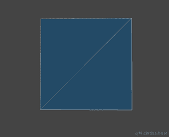

立方体有 6 个面，那就是 36 个顶点：

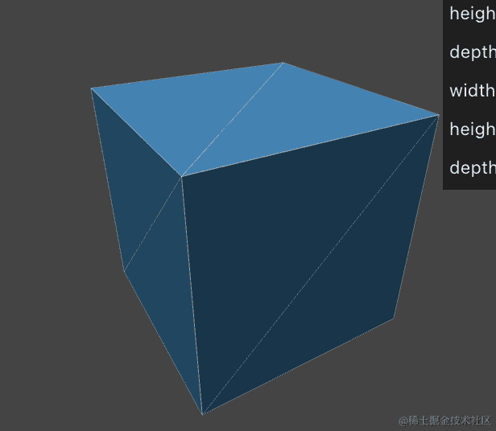

其实 **3D 里所有的物体都是三角形组成的，也就是网格模型**。

圆柱也是由多个三角形组成，当分段多了，看起来就比较圆了：

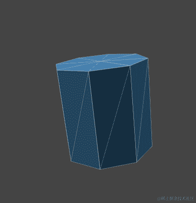

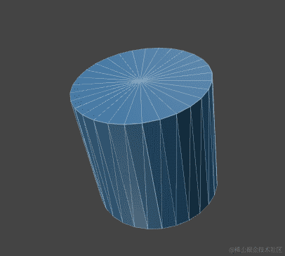

后面我们会导入外部模型：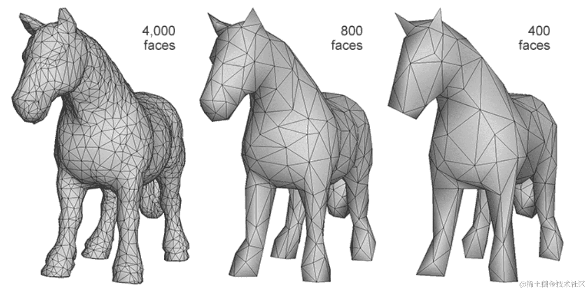

形状再复杂的网格模型也是由三角形构成。

也就是说：**所有几何体都是一堆顶点数据，构成一堆三角形，三角形构成了任何几何体。**

Three.js 内置的这些几何体都是**顶点 ——> 三角形 ——> 几何体** 这样构成的：

当你想自定义其他形状的几何体，就可以用 BufferGeometry 来自己通过顶点构造了。

接下来我们实战


## 代码

index.js：

```js
import * as THREE from 'three';
import { OrbitControls } from 'three/examples/jsm/controls/OrbitControls.js';
import mesh from './mesh.js';

const scene = new THREE.Scene();
// 自定义几何体
scene.add(mesh);

const pointLight = new THREE.PointLight(0xffffff, 10000);
pointLight.position.set(80, 80, 80);
scene.add(pointLight);

const axesHelper = new THREE.AxesHelper(200);
scene.add(axesHelper);

const width = window.innerWidth;
const height = window.innerHeight;

const camera = new THREE.PerspectiveCamera(60, width / height, 1, 1000);
camera.position.set(200, 200, 200);
camera.lookAt(0, 0, 0);

const renderer = new THREE.WebGLRenderer();
renderer.setSize(width, height)

function render() {
    renderer.render(scene, camera);
    requestAnimationFrame(render);
}

render();

document.body.append(renderer.domElement);

const controls = new OrbitControls(camera, renderer.domElement);
```

创建 Scene、Camera、Light、Renderer，添加 AxesHelper。

开启渲染循环，然后添加 OrbitControls 轨道控制器。

接下来我们创建 mesh.js，在里面实现自定义几何体：

mesh.js

```js
import * as THREE from 'three';

// 1. 创建 BufferGeometry 几何体
const geometry = new THREE.BufferGeometry();

// 2. 顶点数组，6 个顶点，也就是 2 个三角形
const vertices = new Float32Array([
    0, 0, 0,
    100, 0, 0,
    0, 100, 0,
    0, 0, 10,
    0, 0, 100,
    100, 0, 10
]);

// 3. 3 个元素为一组坐标
const attribute = new THREE.BufferAttribute(vertices, 3);
// 4. 顶点数据
geometry.attributes.position = attribute;

// 5.材质是 MeshBasicMaterial，这个不受灯光影响，设置个颜色
const material = new THREE.MeshBasicMaterial({
    color: new THREE.Color('orange')
});

const mesh = new THREE.Mesh(geometry, material);

export default mesh;
```

> 这里的 Float32Array 是 JS 提供的 [TypedArray 相关 api](https://developer.mozilla.org/zh-CN/docs/Web/JavaScript/Reference/Global_Objects/TypedArray#typedarray_%E5%AF%B9%E8%B1%A1) 中的一个
>
> JS 提供了 ArrayBuffer 用来存储二进制数据，而 TypedArray 可以用不同的类型来读写这个 ArrayBuffer，比如 Uint8Arry 是无符号整数为单位读写。
>
> 而我们这里存储顶点数据，明显需要浮点数，所以用 Float32Array。

跑出来：

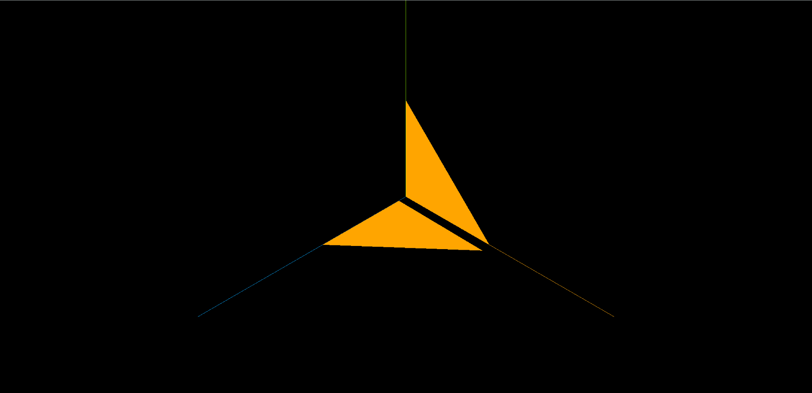

可以看到 6 个顶点构成了 2 个三角形。

Three.js 提供的各种 Geometry 就是设置不同的顶点数据来画出来的。

我们基于 BufferGeometry 也可以封装出各种几何体。


## 实现几何体 PlaneGeometry

比如试试实现下平面几何体 PlaneGeometry：

平面几何体就是 2 个三角形，也就是 6 个顶点：


我们先画一个三角形：

```js
const vertices = new Float32Array([
    0, 0, 0,
    100, 0, 0,
    0, 100, 0,
]);
```

看下效果：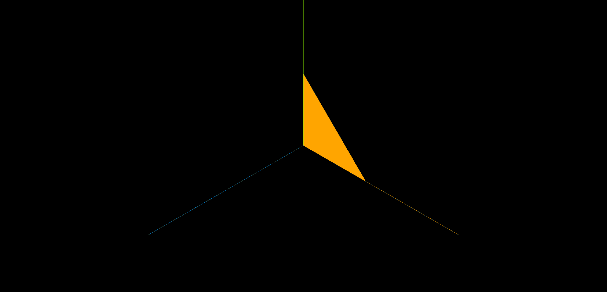

再来画一个三角形：

```js
const vertices = new Float32Array([
    0, 0, 0,
    100, 0, 0,
    0, 100, 0,

    0, 100, 0,
    100, 0, 0,
    100, 100, 0
]);
```

看下效果： 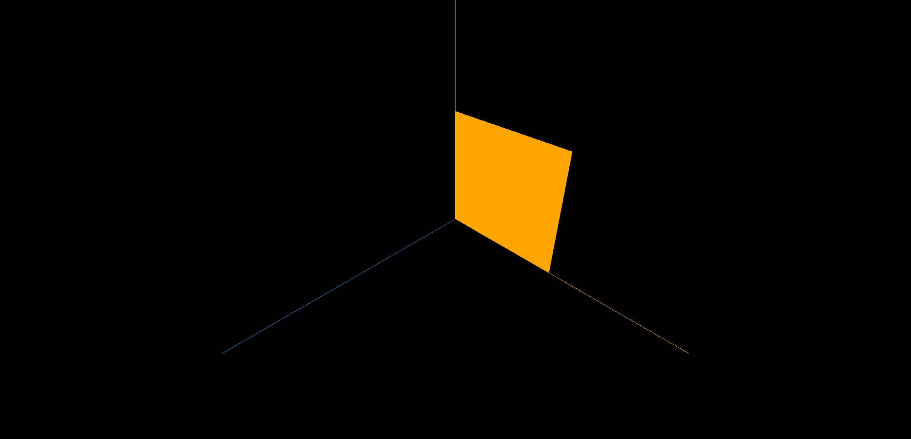

这样 PlaneGeometry 就实现了。

可以在材质里开启 wireframe，展示线框：

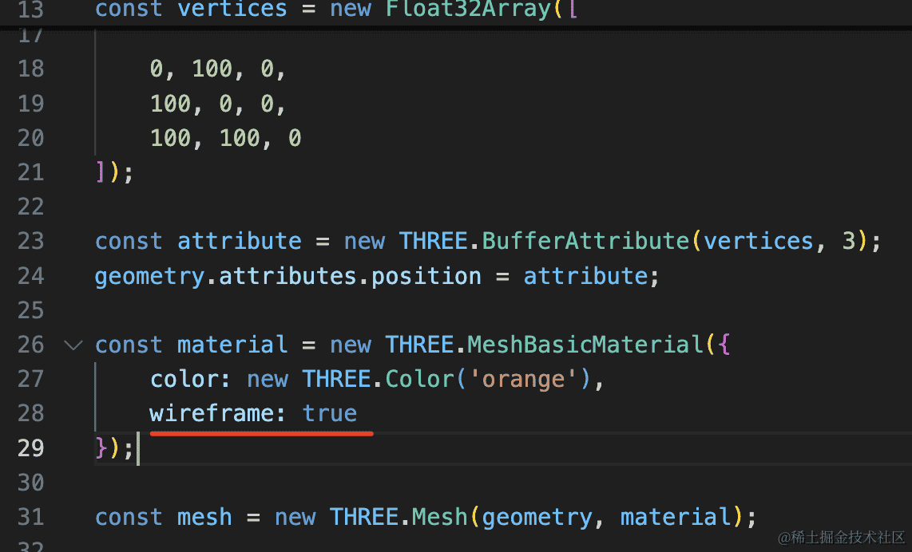

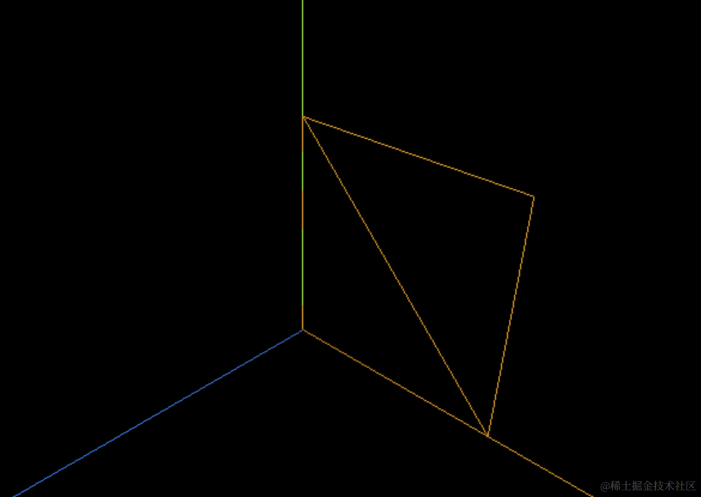

可以看到，确实是两个三角形构成的。

这两个三角形的 6 个顶点，有两个是重合的：

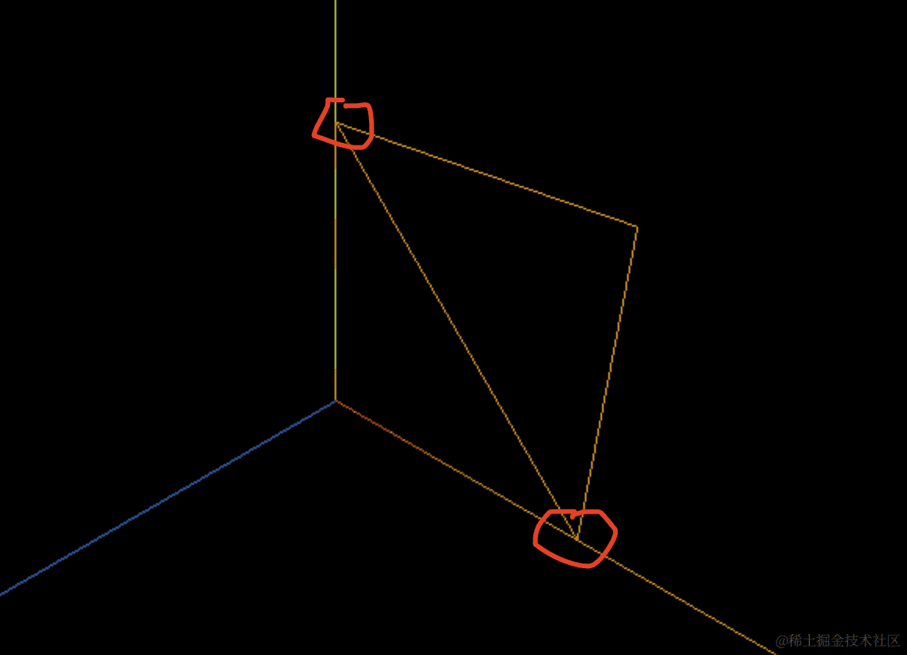

数据里也重复了两份：

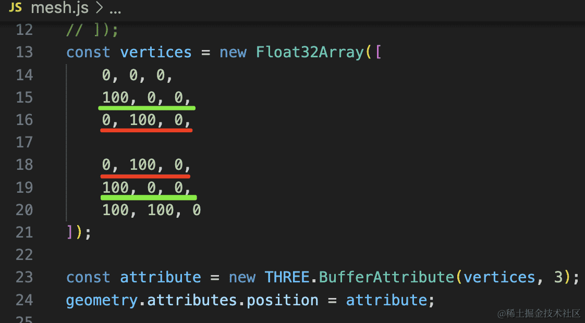

这样存的话，如果是一个很大的几何体，那是不是就重复存储了很多数据？

所以，Three.js 提供了一种优化顶点存储的方案：

存储一份不重复的顶点数据，然后存储一份顶点索引的顺序就可以了。

比如上面一共 4 个顶点，然后存一份顶点索引：0、1、2、2、1、3 就可以了

这样写：

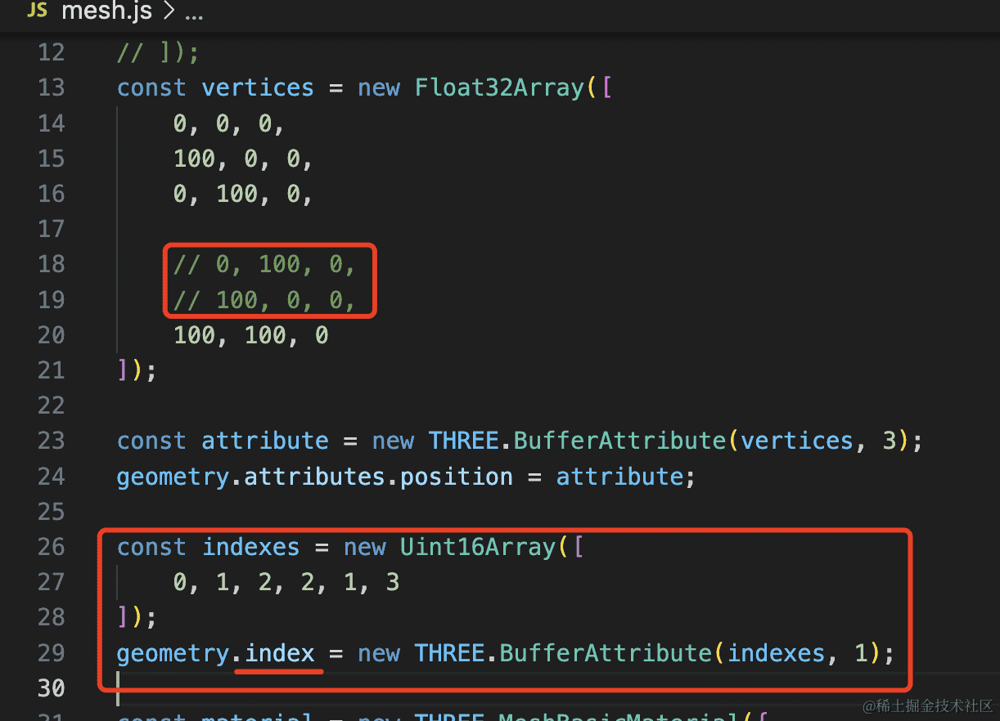

把 geometry.attributes.position 里重复的两个顶点删掉，然后加一份索引数据，设置到 geometry.index

这个 Uint16Array 也是 TypedArray，可以存无符号 16 位整数。

这个属性同样用 BufferArrtribute 封装，第二个参数是 1 ，也就是 1 个为一组。

```
const vertices = new Float32Array([
    0, 0, 0,
    100, 0, 0,
    0, 100, 0,

    // 0, 100, 0,
    // 100, 0, 0,
    100, 100, 0
]);

const attribute = new THREE.BufferAttribute(vertices, 3);
geometry.attributes.position = attribute;

const indexes = new Uint16Array([
    0, 1, 2, 2, 1, 3
]);
geometry.index = new THREE.BufferAttribute(indexes, 1);
```

得出来的效果是一样的

其实所有几何体都是这样存储顶点数据的。

我们打印一下这个`console.log(mesh)`

页面打开 devtools 看下：

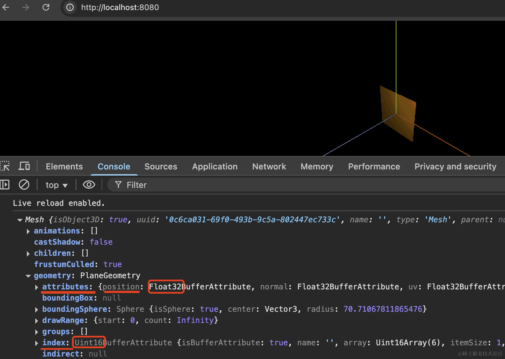

可以看到，网格模型的 geometry.attributes.position 存了顶点数据，geometry.index 存了顶点索引数据。

分别用的 Float32Array、Uint16Array，和我们刚才的一样。

然后展开看下，可以看到，geometry.attributes.position 存了 4 个顶点数据。

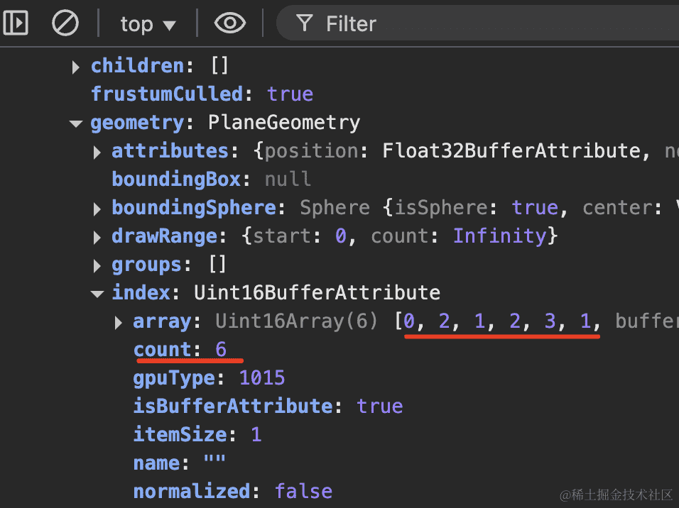

geometry.index 存了 6 个顶点索引，刚好构成 2 个三角形。

和我们自己实现的 PlaneGeometry 一模一样。

这样，我们就可以通过 BufferGeometry 和顶点数据来创建任意几何体了。


## 总结

Three.js 提供了很多几何体，它们都是基于 BufferGeometry 封装出来的。

通过 geometry.attributes.position 存储顶点数据，通过 geometry.index 存储顶点索引，每三个顶点索引构成一个三角形，所有的三角形就构成了各种几何体。

网格模型 Mesh 就是由三角形构成的，不管是简单的几何体，还是加载的复杂的外部模型，都是三角形构成。

几何体的本质就是顶点和三角形，理解了这个就理解了各种 Geometry 和网格模型。
