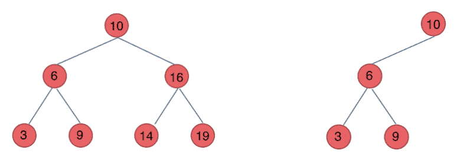
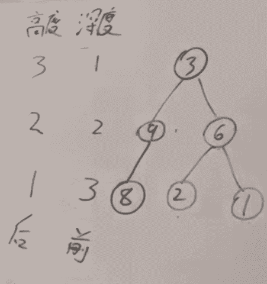
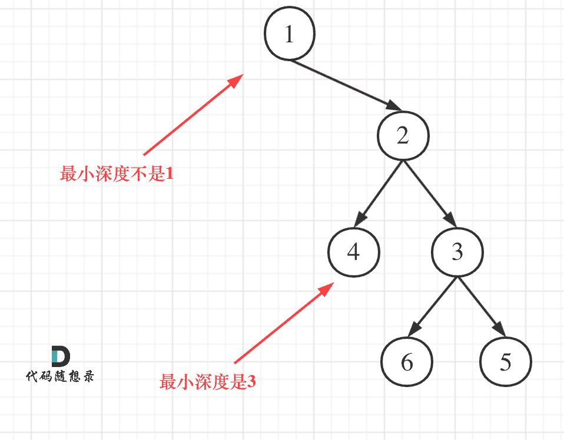

## 理论知识

### 二叉树的种类

二叉树有两种主要的形式：满二叉树和完全二叉树


#### 满二叉树

满二叉树：如果一棵二叉树只有度为0的结点和度为2的结点，并且度为0的结点在同一层上，则这棵二叉树为满二叉树。


这棵二叉树为满二叉树，也可以说**深度为k，有2^k-1个节点**的二叉树


#### 完全二叉树

完全二叉树的定义如下：在完全二叉树中，除了最底层节点可能没填满外，其余每层节点数都达到最大值，并且最下面一层的节点都集中在该层最左边的若干位置。若最底层为第 h 层（h从1开始），则包含 1 ~  2^(h-1) 个节点。


**之前我们刚刚讲过优先级队列其实是一个堆，堆就是一棵完全二叉树，同时保证父子节点的顺序关系**


#### 二叉搜索数

前面介绍的树，都没有数值的，而二叉搜索树是有数值的了，**二叉搜索树是一个有序树**。

- 若它的左子树不空，则左子树上所有结点的值均小于它的根结点的值；
- 若它的右子树不空，则右子树上所有结点的值均大于它的根结点的值；
- 它的左、右子树也分别为二叉搜索树

> 左边都比中间小，右边都比中间大

下面这两棵树都是二叉搜索树



#### 平衡二叉搜索树

> 前提：一定是一个二叉搜索树

平衡二叉搜索树：又被称为AVL（Adelson-Velsky and Landis）树，且具有以下性质：它是一棵空树或它的左右两个子树的高度差的绝对值不超过1，并且左右两个子树都是一棵平衡二叉树。


最后一棵 不是平衡二叉树，因为它的左右两个子树的高度差的绝对值超过了1。

> C++中map、set、multimap，multiset的底层实现都是平衡二叉搜索树，因为它们需要排序的特性。

> `JavaScript` 中的 `Map` 和 `Set` 并 不是基于二叉树实现的，而是根据 JavaScript 引擎的实现，大多数现代引擎（如 V8）是基于 **哈希表（Hash Table）+ 链表** 或 其他优化的数据结构 实现的。
>
>  因为JavaScript 的 `Map` 和 `Set` 并不具备自动排序能力（插入顺序是唯一的顺序），所以不需要使用二叉树结构。


### 二叉树的存储方式

**二叉树可以链式存储，也可以顺序存储（线性存储）。**

那么链式存储方式就用指针， 顺序存储的方式就是用数组。

顾名思义就是顺序存储的元素在内存是连续分布的，而链式存储则是通过指针把分布在各个地址的节点串联一起。

链式存储如图：

链式存储是大家很熟悉的一种方式，那么我们来看看如何顺序存储呢？

其实就是用数组来存储二叉树，顺序存储的方式如图：

用数组来存储二叉树如何遍历的呢？

**如果父节点的数组下标是 i，那么它的左孩子就是 i \* 2 + 1，右孩子就是 i \* 2 + 2。**

但是用链式表示的二叉树，更有利于我们理解，所以一般我们都是用链式存储二叉树。

**所以大家要了解，用数组依然可以表示二叉树。**


### 二叉树的遍历方式

关于二叉树的遍历方式，要知道二叉树遍历的基本方式都有哪些。

一些同学用做了很多二叉树的题目了，可能知道前中后序遍历，可能知道层序遍历，但是却没有框架。

我这里把二叉树的几种遍历方式列出来，大家就可以一一串起来了。

二叉树主要有两种遍历方式：

1. 深度优先遍历：先往深走，遇到叶子节点再往回走。
2. 广度优先遍历：一层一层的去遍历。

**这两种遍历是图论中最基本的两种遍历方式**，后面在介绍图论的时候 还会介绍到。

那么从深度优先遍历和广度优先遍历进一步拓展，才有如下遍历方式：

- 深度优先遍历（从上到下）
  - 前序遍历（递归法，迭代法）
  - 中序遍历（递归法，迭代法）
  - 后序遍历（递归法，迭代法）
- 广度优先遍历（从左到右）
  - 层次遍历（迭代法）

在深度优先遍历中：有三个顺序，前中后序遍历， 有同学总分不清这三个顺序，经常搞混，我这里教大家一个技巧。

**这里前中后，其实指的就是中间节点的遍历顺序**，只要大家记住 前中后序指的就是中间节点的位置就可以了。

看如下中间节点的顺序，就可以发现，中间节点的顺序就是所谓的遍历方式

- 前序遍历：中左右
- 中序遍历：左中右
- 后序遍历：左右中

大家可以对着如下图，看看自己理解的前后中序有没有问题。


最后再说一说二叉树中深度优先和广度优先遍历实现方式，我们做二叉树相关题目，经常会使用递归的方式来实现深度优先遍历，也就是实现前中后序遍历，使用递归是比较方便的。

**之前我们讲栈与队列的时候，就说过栈其实就是递归的一种实现结构**，也就说前中后序遍历的逻辑其实都是可以借助**栈**使用递归的方式来实现的。

而广度优先遍历的实现一般使用队列来实现，这也是**队列**先进先出的特点所决定的，因为需要先进先出的结构，才能一层一层的来遍历二叉树。


### 二叉树的定义

刚刚我们说过了二叉树有两种存储方式顺序存储，和链式存储，顺序存储就是用数组来存，这个定义没啥可说的，我们来看看链式存储的二叉树节点的定义方式。

JS代码如下：

```js
function TreeNode(val, left, right) {
    this.val = (val===undefined ? 0 : val)
    this.left = (left===undefined ? null : left)
    this.right = (right===undefined ? null : right)
}
```

大家会发现二叉树的定义 和链表是差不多的，相对于链表 ，二叉树的节点里多了一个指针， 有两个指针，指向左右孩子。

这里要提醒大家要注意二叉树节点定义的书写方式。

**在现场面试的时候 面试官可能要求手写代码，所以数据结构的定义以及简单逻辑的代码一定要锻炼白纸写出来。**


## 二叉树的递归遍历

https://programmercarl.com/%E4%BA%8C%E5%8F%89%E6%A0%91%E7%9A%84%E9%80%92%E5%BD%92%E9%81%8D%E5%8E%86.html#%E7%AE%97%E6%B3%95%E5%85%AC%E5%BC%80%E8%AF%BE


### 思路

**本篇将介绍前后中序的递归写法，一些同学可能会感觉很简单，其实不然，我们要通过简单题目把方法论确定下来，有了方法论，后面才能应付复杂的递归。**

这里帮助大家确定下来递归算法的三个要素。**每次写递归，都按照这三要素来写，可以保证大家写出正确的递归算法！**

1. **确定递归函数的参数和返回值：** 确定哪些参数是递归的过程中需要处理的，那么就在递归函数里加上这个参数， 并且还要明确每次递归的返回值是什么进而确定递归函数的返回类型。
2. **确定终止条件：** 写完了递归算法, 运行的时候，经常会遇到栈溢出的错误，就是没写终止条件或者终止条件写的不对，操作系统也是用一个栈的结构来保存每一层递归的信息，如果递归没有终止，操作系统的内存栈必然就会溢出。
3. **确定单层递归的逻辑：** 确定每一层递归需要处理的信息。在这里也就会重复调用自己来实现递归的过程。


### 前序遍历

https://leetcode.cn/problems/binary-tree-preorder-traversal/description/

```js
function preorderTraversal(root) {
  const result = [];

  function dfs(node) {
    if (!node) return;
    result.push(node.val); // 访问根节点
    dfs(node.left);        // 遍历左子树
    dfs(node.right);       // 遍历右子树
  }

  dfs(root);
  return result;
}
```

当然可以吧dfs函数抽离出去：

```js
function preorderTraversal(root) {
  const result = [];
  dfs(root, result);
  return result;
}

function dfs(node, result) {
  if (!node) return;
  result.push(node.val);   
  dfs(node.left, result); 
  dfs(node.right, result);
}
```


### 中序遍历

https://leetcode.cn/problems/binary-tree-inorder-traversal/description/

```js
var inorderTraversal = function(root) {
    const result = []
    dfs(root, result)
    return result
};

function dfs(node, arr){
    if(!node) return
    dfs(node.left, arr)
    arr.push(node.val)
    dfs(node.right, arr)
}
```


### 后序遍历

https://leetcode.cn/problems/binary-tree-postorder-traversal/description/

```js
var postorderTraversal = function(root) {
    const result = []
    dfs(root, result)
    return result
};

function dfs(node, arr){
    if(!node) return
    dfs(node.left, arr)
    dfs(node.right, arr)
    arr.push(node.val)
}
```


## 二叉树的迭代遍历

https://programmercarl.com/%E4%BA%8C%E5%8F%89%E6%A0%91%E7%9A%84%E8%BF%AD%E4%BB%A3%E9%81%8D%E5%8E%86.html


### 前序遍历

https://leetcode.cn/problems/binary-tree-preorder-traversal/description/

前序遍历是中左右，每次先处理的是中间节点，那么先将根节点放入栈中，然后将右孩子加入栈，再加入左孩子。


```js
var preorderTraversal = function(root) {
    const stack = []
    const result = []

    stack.push(root)

    while(stack.length > 0){
        const node = stack.pop()
        // 为什么要加这个判断：node也不是一直是根节点，需要为后序做处理
        if(node !== null){
            result.push(node.val)
        }else{
            continue
        }

        // 先入栈右边，在放入左边
        stack.push(node.right)
        stack.push(node.left)   
        
    }

    return result
};
```

:::info 为什么要先加入右在加入左

因为我们使用的是栈，左后加入，才能先出

:::


那么后续遍历也是很简单的，在我们前序遍历的基础上改一下就可以


### 后序遍历

https://leetcode.cn/problems/binary-tree-postorder-traversal/description/

思路是什么呢

首先我们的前序遍历是什么：`中 —> 左 —> 右`（代码里是先加入中，在加入右，最后加入做），

那我们我们后续遍历是什么，先加入左，在加入右，变成了：`中 —> 右 —> 左`，最后将我们的数组翻转一下就是后续遍历：`左 —> 右 —> 中`

```js
var preorderTraversal = function(root) {
    const stack = []
    const result = []

    stack.push(root)

    while(stack.length > 0){
        const node = stack.pop()
        // 为什么要加这个判断：node也不是一直是根节点，需要为后序做处理
        if(node !== null){
            result.push(node.val)
        }else{
            continue
        }

        stack.push(node.left) 
        stack.push(node.right)  
        
    }

    return result.reverse()
};
```


### 中序遍历

https://leetcode.cn/problems/binary-tree-inorder-traversal/description/


## 二叉树的统一迭代法

## 二叉树的层序遍历

类似于广度优先搜索

https://programmercarl.com/0102.%E4%BA%8C%E5%8F%89%E6%A0%91%E7%9A%84%E5%B1%82%E5%BA%8F%E9%81%8D%E5%8E%86.html

https://leetcode.cn/problems/binary-tree-level-order-traversal/description/


### 思路

层序遍历一个二叉树。就是从左到右一层一层的去遍历二叉树。这种遍历的方式和我们之前讲过的都不太一样。

需要借用一个辅助数据结构即队列来实现，**队列先进先出，符合一层一层遍历的逻辑，而用栈先进后出适合模拟深度优先遍历也就是递归的逻辑。**

**而这种层序遍历方式就是图论中的广度优先遍历，只不过我们应用在二叉树上。**

使用队列实现二叉树广度优先遍历，动画如下：


### 代码

```js
var levelOrder = function(root) {
    const quere = []
    const result = []

    if(!root) return []
    quere.push(root)

    while(quere.length > 0){
        let size = quere.length
        const arr = []

        while(size--){
            const node = quere.shift()
            if(!node) continue
            arr.push(node.val)
            node.left && quere.push(node.left)
            node.right && quere.push(node.right)
        }

        result.push(arr)
    }

    return result
};
```


### 拓展

#### 二叉树的层序遍历 II

https://leetcode.cn/problems/binary-tree-level-order-traversal-ii/

就是将二叉树的层序遍历翻转一下即可

```js

var levelOrderBottom = function(root) {
    const quere = []
    const result = []

    if(!root) return []

    quere.push(root)

    while(quere.length > 0){
        let size = quere.length
        const arr = []

        while(size--){
            const node = quere.shift()
            if(node){
                arr.push(node.val)
            }else{
                continue
            }

            node.left && quere.push(node.left)
            node.right && quere.push(node.right)
        }

        result.push(arr)
    }

    return result.reverse()
};
```


#### 二叉树的右视图

https://leetcode.cn/problems/binary-tree-right-side-view/description/

也是比较简单的，取数组最后一个即可

```js
var rightSideView = function(root) {
    const quere = []
    const result = []

    if(root) quere.push(root)

    while(quere.length){
        let size = quere.length
        const arr = []

        while(size--){
            const node = quere.shift()
            if(!node){
                continue
            }else{
                arr.push(node.val)
            }

            node.left && quere.push(node.left)
            node.right && quere.push(node.right)
        }

        result.push(arr[arr.length - 1])
    }

    return result
};
```


#### 二叉树的层平均值

https://leetcode.cn/problems/average-of-levels-in-binary-tree/description/

```js
var averageOfLevels = function(root) {
    const quere = []
    const result = []

    if(root) quere.push(root)

    while(quere.length){
        const length = quere.length
        let size = quere.length
        let sum = 0

        while(size--){
            const node = quere.shift()
            if(!node){
                continue
            }else{
                sum += node.val
            }

            node.left && quere.push(node.left)
            node.right && quere.push(node.right)
        }

        result.push(sum/length)
    }

    return result
};
```


#### N叉树的层序遍历

https://leetcode.cn/problems/n-ary-tree-level-order-traversal/description/

```js
var levelOrder = function (root) {
    const quere = []
    const result = []

    if (root !== null) {
        quere.push(root)
    }

    while (quere.length > 0) {
        let size = quere.length
        const arr = []

        while (size--) {
            const node = quere.shift()
            if (!node) continue
            arr.push(node.val)


            for (let item of node.children) {
                item && quere.push(item);
            }

        }

        result.push(arr)
    }


    return result
};
```


#### 在每个树行中找最大值

https://leetcode.cn/problems/find-largest-value-in-each-tree-row/description/

```js
var largestValues = function(root) {
    const quere = []
    const result = []

    if(!root) return []
    quere.push(root)

    while(quere.length > 0){
        let size = quere.length
        let max = quere[0].val

        while(size--){
            const node = quere.shift()
            if(!node) continue
            max = node.val > max ? node.val : max
            node.left && quere.push(node.left)
            node.right && quere.push(node.right)
        }

        result.push(max)
    }

    return result
};
```


#### 二叉树的最大深度

https://leetcode.cn/problems/maximum-depth-of-binary-tree/description/

```js
var maxDepth = function(root) {
    const quere = []
    let result = 0

    if(!root) return result
    quere.push(root)

    while(quere.length > 0){
        let size = quere.length
        let arr = []

        while(size--){
            const node = quere.shift()
            if(!node) continue
            arr.push(node.val)
            node.left && quere.push(node.left)
            node.right && quere.push(node.right)
        }

        result++
    }

    return result
};
```


#### 二叉树的最小深度

https://leetcode.cn/problems/minimum-depth-of-binary-tree/description/

当左右孩子都为空的时候，说明到了遍历的最低点了。如果其中一个孩子为空则不是最低点

```js
var minDepth = function(root) {
    let min = 0
    if(!root) return min
    
    const quere = [root]

    while(quere.length){
        let size = quere.length
        min++
        while(size--){
            const node = quere.shift()
            if(!node) continue

            if(!node.left && !node.right){
                return min
            }

            node.left && quere.push(node.left)
            node.right && quere.push(node.right)
        }
    }
};
```


## 翻转二叉树

https://programmercarl.com/0226.%E7%BF%BB%E8%BD%AC%E4%BA%8C%E5%8F%89%E6%A0%91.html

https://leetcode.cn/problems/invert-binary-tree/description/


### 思路

### 代码

```js
var invertTree = function(root) {
    reverseNode(root)
    return root  
};

function reverseNode(node, arr){
    if(!node) return 

    [ node.left, node.right ] = [ node.right, node.left ]

    reverseNode(node.left)
    reverseNode(node.right)
}
```


## 对称二叉树

https://programmercarl.com/0101.%E5%AF%B9%E7%A7%B0%E4%BA%8C%E5%8F%89%E6%A0%91.html

https://leetcode.cn/problems/symmetric-tree/description/


### 代码

```js
var isSymmetric = function(root) {
    if(!root) return true

    return isSome(root.left, root.right)
};

function isSome(node1, node2){
    if(!node1 && !node2)return true

    if(!node1 || !node2) return false

    if (node1.val !== node2.val) return false

    return isSome(node1.left, node2.right) && isSome(node1.right, node2.left)
}
```


## 二叉树的最大深度

https://programmercarl.com/0104.%E4%BA%8C%E5%8F%89%E6%A0%91%E7%9A%84%E6%9C%80%E5%A4%A7%E6%B7%B1%E5%BA%A6.html

https://leetcode.cn/problems/maximum-depth-of-binary-tree/description/


### 思路



本题可以使用前序（中左右），也可以使用后序遍历（左右中），使用**前序求的就是深度**，使用**后序求的是高度**。

- 二叉树节点的深度：指从根节点到该节点的最长简单路径边的条数或者节点数（取决于深度从0开始还是从1开始）（从根节点到叶子节点）
- 二叉树节点的高度：指从该节点到叶子节点的最长简单路径边的条数或者节点数（取决于高度从0开始还是从1开始）（从叶子节点到根节点）

**而根节点的高度就是二叉树的最大深度**，所以本题中我们通过后序求的根节点高度来求的二叉树最大深度。


### 递归法

```js
// 使用的是后续遍历，返回的是最大高度，这里的最大高度就是等于最大深度
var maxDepth = function(root) {
    if(!root) return 0
    let leftHeight = maxDepth(root.left)
    let rightHeight = maxDepth(root.right)

    return 1 + Math.max(leftHeight, rightHeight)
};
```

:::info `为什么最后要+1`

我们递归地计算：

- `maxDepth(node.left)`：左子树的最大深度
- `maxDepth(node.right)`：右子树的最大深度

那么，从当前 `node` 出发到最深叶子的路径，要么走左子树，要么走右子树。我们取**较深的那个路径**，然后：

> 当前节点的最大深度 = 1（当前节点本身）+ 子树中较大的深度

:::


### 层序遍历法

```js
var maxDepth = function(root) {
    let max = 0
    if(!root) return max

    const quere = [root]

    while(quere.length > 0){
        let size = quere.length

        while(size--){
            const node = quere.shift()
            if(!node) continue
            node.left && quere.push(node.left)
            node.right && quere.push(node.right)
        }

        max++
    }

    return max
};
```


## 二叉树的最小深度

https://programmercarl.com/0111.%E4%BA%8C%E5%8F%89%E6%A0%91%E7%9A%84%E6%9C%80%E5%B0%8F%E6%B7%B1%E5%BA%A6.html

https://leetcode.cn/problems/minimum-depth-of-binary-tree/description/


### 思路

审题：最小深度是从根节点到**最近的叶子节点**的路径上的节点数。

本题还有一个误区，在处理节点的过程中，最大深度很容易理解，最小深度就不那么好理解，如图：



这就重新审题了，题目中说的是：**最小深度是从根节点到最近叶子节点的最短路径上的节点数量。\**注意是\**叶子节点**。

什么是叶子节点，左右孩子都为空的节点才是叶子节点！


### 递归法

```js
var minDepth = function(root) {
    if(!root) return 0

    let leftHeight = minDepth(root.left)
    let rightHeight = minDepth(root.right)

    // 这边是一个误区
    if(!root.left && root.right) return 1 + rightHeight
    if(root.left && !root.right) return 1 + leftHeight

    return 1 + Math.min(leftHeight, rightHeight)
};
```


### 层序遍历法

```js
var minDepth = function(root) {
    let min = 0
    if(!root) return min
    
    const quere = [root]

    while(quere.length){
        let size = quere.length
        min++ // 每进入一层，深度加一
        while(size--){
            const node = quere.shift()
            if(!node) continue

            if(!node.left && !node.right){
                return min // 当前节点是叶子节点，直接返回当前深度，不理解可以看思路
            }

            node.left && quere.push(node.left)
            node.right && quere.push(node.right)
        }
    }
};
```


## 完全二叉树的节点个数


