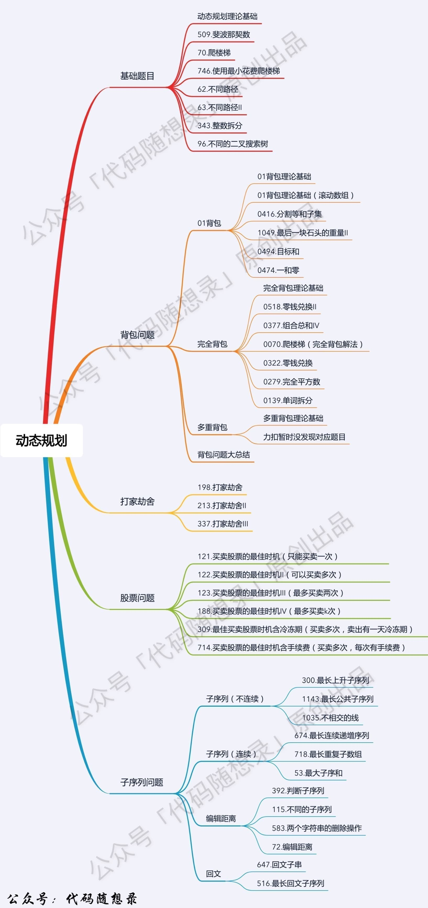
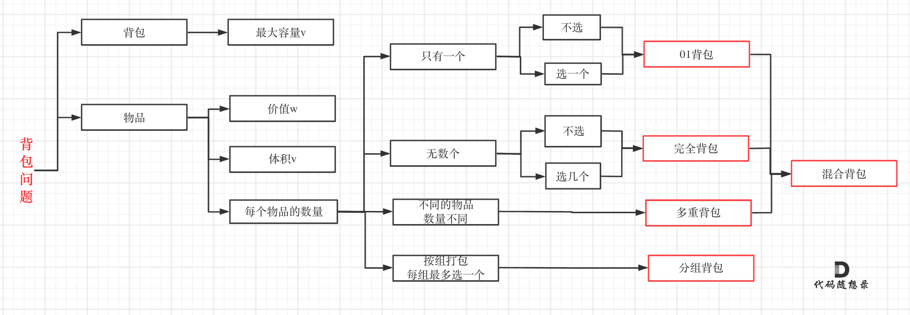
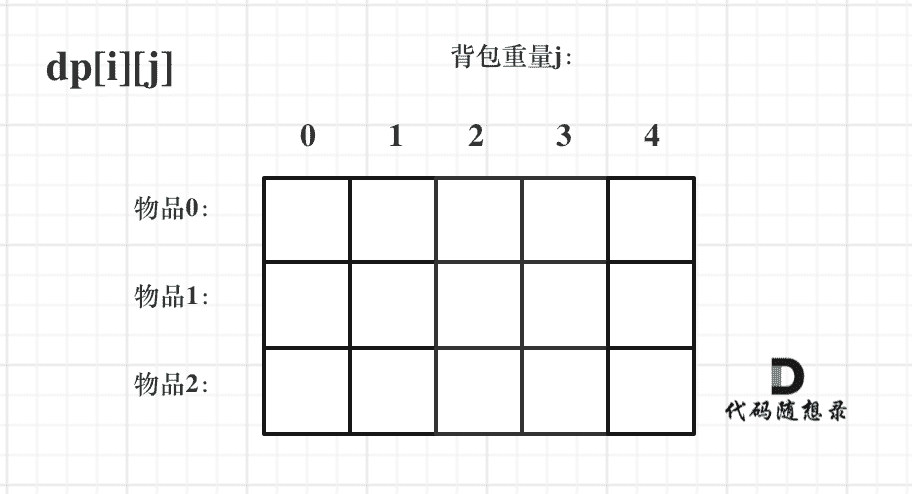
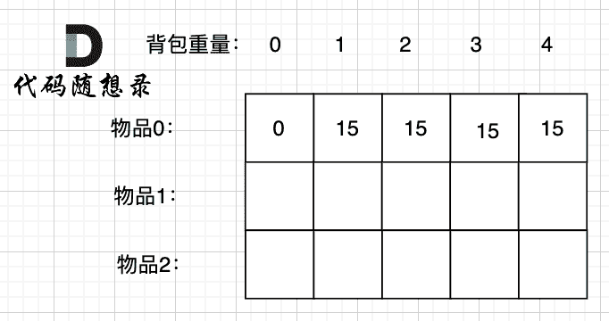
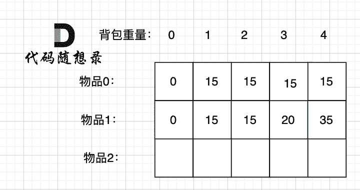
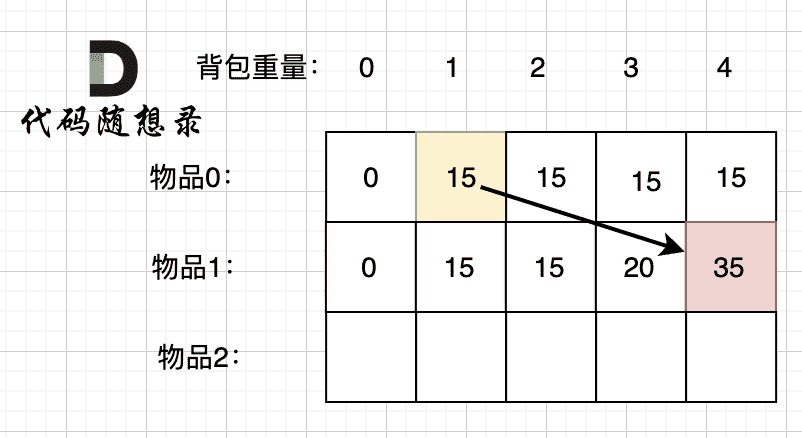
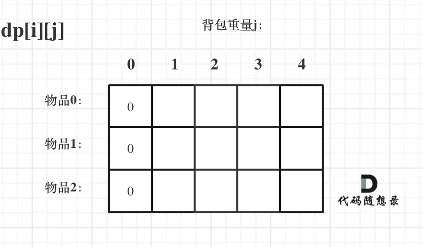
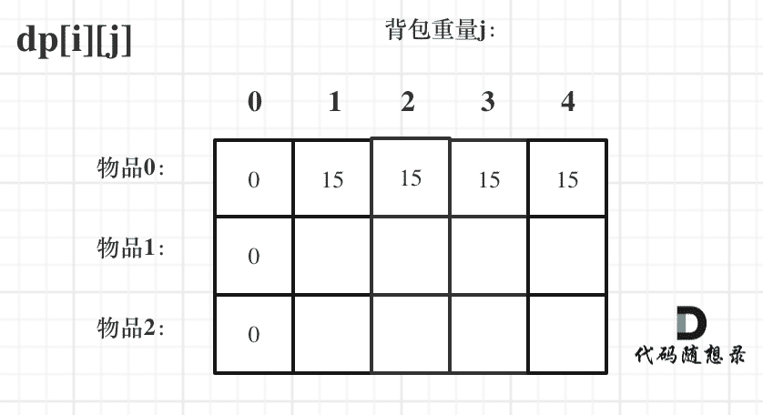
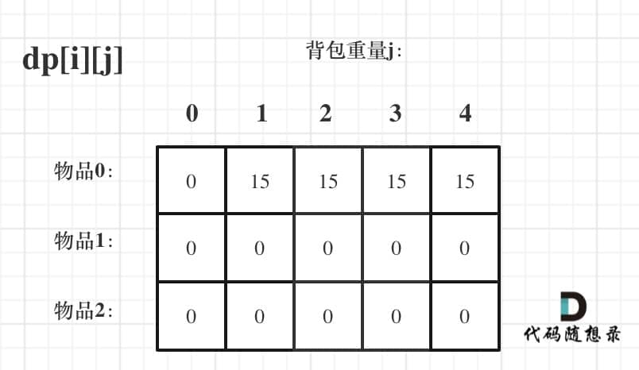
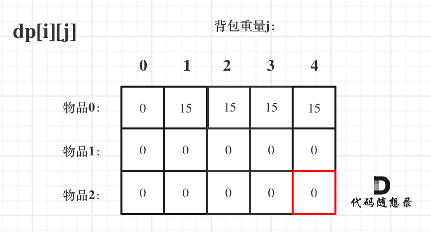

## 理论知识

动态规划掌握着几类问题就行




### 什么是动态规划

动态规划，英文：Dynamic Programming，简称DP，如果某一问题有很多重叠子问题，使用动态规划是最有效的。

所以动态规划中每一个状态一定是由上一个状态推导出来的，**这一点就区分于贪心**，贪心没有状态推导，而是从局部直接选最优的，

例如：有N件物品和一个最多能背重量为W 的背包。第i件物品的重量是weight[i]，得到的价值是value[i] 。**每件物品只能用一次**，求解将哪些物品装入背包里物品价值总和最大。

动态规划中dp[j]是由dp[j-weight[i]]推导出来的，然后取max(dp[j], dp[j - weight[i]] + value[i])。

但如果是贪心呢，每次拿物品选一个最大的或者最小的就完事了，和上一个状态没有关系。

所以贪心解决不了动态规划的问题。


### 动态规划的解题步骤

做动规题目的时候，很多同学会陷入一个误区，就是以为把状态转移公式背下来，照葫芦画瓢改改，就开始写代码，甚至把题目AC之后，都不太清楚dp[i]表示的是什么。

**这就是一种朦胧的状态，然后就把题给过了，遇到稍稍难一点的，可能直接就不会了，然后看题解，然后继续照葫芦画瓢陷入这种恶性循环中**。

状态转移公式（递推公式）是很重要，但动规不仅仅只有递推公式。

**对于动态规划问题，我将拆解为如下五步曲，这五步都搞清楚了，才能说把动态规划真的掌握了！**

1. 确定dp数组（dp table）以及下标的含义
2. 确定递推公式
3. dp数组如何初始化
4. 确定遍历顺序
5. 打印dp数组

一些同学可能想为什么要先确定递推公式，然后在考虑初始化呢？

**因为一些情况是递推公式决定了dp数组要如何初始化！**

后面的讲解中我都是围绕着这五点来进行讲解。

可能刷过动态规划题目的同学可能都知道递推公式的重要性，感觉确定了递推公式这道题目就解出来了。

其实 确定递推公式 仅仅是解题里的一步而已！

一些同学知道递推公式，但搞不清楚dp数组应该如何初始化，或者正确的遍历顺序，以至于记下来公式，但写的程序怎么改都通过不了。


### 动态规划五部曲

1. 确定dp[i]的含义极其下标的含义
2. 确定递推公式


## 斐波那契数

https://programmercarl.com/0509.%E6%96%90%E6%B3%A2%E9%82%A3%E5%A5%91%E6%95%B0.html

https://leetcode.cn/problems/fibonacci-number/description/


### 思路

1. 确定dp数组以及下标的含义：`dp[i]`表示第i个下标的值
2. 确定递推公式：`dp[i] = dp[i-1] + dp[i-2]`
3. dp数组如何初始化： `dp[0] = 0,dp[1] = 1`
4. 确定遍历顺序：从前向后遍历
5. 打印dp数组：


### 代码

```js
// 递归
var fib = function(n) {
    if(n === 0 || n === 1) return n
    return fib(n-1) + fib(n-2)
};
```

```js
// 动态规划的方法:使用动态规划五部曲
var fib = function(n) {
    const dp = [0, 1]
    for(let i = 2;i<=n;i++){
        dp[i] = dp[i-1] + dp[i-2]
    }

    return dp[n]
};
```

:::info 为什么遍历是到`i<=n`

因为我们的i是需要取到n的

:::


## 爬楼梯

https://programmercarl.com/0070.%E7%88%AC%E6%A5%BC%E6%A2%AF.html

https://leetcode.cn/problems/climbing-stairs/description/


### 思路

1. 确定dp数组极其下标的含义
2. 确定递推公式
3. 确定初始化值
4. 确定遍历顺序
5. 打印dp数组


### 代码

```js
// 递归，可以实现但是效率较低
var climbStairs = function(n) {
    // 当前fn(n) = fn(n-1) + fn(n-2)
    if(n===1 || n===2) return n
    return climbStairs(n-1) + climbStairs(n-2)
};
```

```js
// 动态规划
var climbStairs = function(n) {
   const dp = [0, 1, 2]

   for(let i = 3;i<=n;i++){
     dp[n] = dp[n-1] + dp[n-2]
   }

   return dp[n]
};
```

```js
// 压缩
var climbStairs = function (n) {
    if (n === 1 || n === 2) return n
    let dp1 = 1, dp2 = 2
    for (let i = 3; i <= n; i++) {
        let sum = dp1 + dp2
        dp1 = dp2
        dp2 = sum
    }

    return dp2
};
```


## 使用最小花费爬楼梯

https://programmercarl.com/0746.%E4%BD%BF%E7%94%A8%E6%9C%80%E5%B0%8F%E8%8A%B1%E8%B4%B9%E7%88%AC%E6%A5%BC%E6%A2%AF.html

https://leetcode.cn/problems/min-cost-climbing-stairs/description/


### 思路

1. 确定dp数组及下标值的含义
2. 确定递推公式
3. 确定初始化值
4. 确定遍历顺序
5. 打印dp数组


### 代码

```js
var minCostClimbingStairs = function(cost) {
    const dp = [0, 0]

    for(let i = 2;i<=cost.length;i++){
        dp[i] = Math.min(dp[i-1] + cost[i-1], dp[i-2] + cost[i-2])
    }

    return dp[cost.length]
};
```

```js
// 压缩状态
var minCostClimbingStairs = function(cost) {
    const len = cost.length
    if(len === 0 || len === 1) return 0

    let dp1 = 0, dp2 = 0
    for(let i = 2;i<=len;i++){
        let temp = Math.min(dp1 + cost[i-2], dp2 + cost[i-1])
        dp1 = dp2
        dp2 = temp
    }

    return dp2
};
```


## 不同路径

https://programmercarl.com/0062.%E4%B8%8D%E5%90%8C%E8%B7%AF%E5%BE%84.html

https://leetcode.cn/problems/unique-paths/description/


### 思路

1. 明确dp数组极其下标值的含义
2. 确定递推公式
3. 确定初始化值
4. 确定遍历顺序
5. 打印dp数组


### 代码

```js
var uniquePaths = function(m, n) {
    const dp = new Array(m).fill(1).map(() => new Array(n).fill(1));

    for(let i = 1;i<m;i++){
        for(let j = 1;j<n;j++){
            dp[i][j] = dp[i-1][j] + dp[i][j-1]
        }
    }

    return dp[m-1][n-1]
};
```


## 不同路径 II

https://programmercarl.com/0063.%E4%B8%8D%E5%90%8C%E8%B7%AF%E5%BE%84II.html

https://leetcode.cn/problems/unique-paths-ii/description/


### 思路

### 代码

```js
// 初始思路代码
var uniquePathsWithObstacles = function(obstacleGrid) {
    let m = obstacleGrid.length
    let n = obstacleGrid[0].length

    const dp = new Array(m).fill(1).map(()=> new Array(n).fill(1))

    for(let i = 1;i<m;i++){
        for(let j = 1;j<n;j++){
            if(obstacleGrid[i][j] === 1){
                dp[i][j] = 0
            }else{
                dp[i][j] = dp[i-1][j] + dp[i][j-1]
            }
        }
    }

    return dp[m-1][n-1]
};
```

> 但是这样有很多的问题
>
> 问题1：这样初始化：`const dp = new Array(m).fill(1).map(() => new Array(n).fill(1))`
>
> 默认所有路径数都是 `1`，但**如果起点（0,0）就是障碍物，或者第一行/列中有障碍物，就不能这样初始化**，否则计算就会出错。
>
> 问题 2：没有处理第一行、第一列的障碍物传播
>
> 从 (1,1) 开始循环，只考虑了内部格子，但第一行和第一列也是路径的组成部分，一旦某个格子是障碍，后面的路径都应为 0。

所以我们要考虑一下边界问题，也就是第一行和第一列的情况

```js
var uniquePathsWithObstacles = function(obstacleGrid) {
    let m = obstacleGrid.length
    let n = obstacleGrid[0].length

    let dp = new Array(m).fill(1).map(()=> new Array(n).fill(1))

    // 处理第一个位置
    dp[0][0] = obstacleGrid[0][0] === 0 ? 1 : 0

    // 处理第一列
    for(let i = 1;i<m;i++){
        dp[i][0] = ( obstacleGrid[i][0] === 0 && dp[i-1][0] === 1 ) ? 1 : 0 
    }

    // 处理第一行
    for(let i = 1;i<n;i++){
        dp[0][i] = ( obstacleGrid[0][i] === 0 && dp[0][i-1] === 1 ) ? 1 : 0
    }

    for(let i = 1;i<m;i++){
        for(let j = 1;j<n;j++){
            if(obstacleGrid[i][j] === 0){
                dp[i][j] = dp[i-1][j] + dp[i][j-1]
            }else{
                dp[i][j] = 0
            }
        }
    }

    return dp[m-1][n-1]
};
```


## 整数拆分


## 不同的二叉搜索树


## 01背包问题理论基础

对于面试的话，其实掌握01背包和完全背包，就够用了，最多可以再来一个多重背包。

如果这几种背包，分不清，我这里画了一个图，如下：



除此以外其他类型的背包，面试几乎不会问，都是竞赛级别的了，leetcode上连多重背包的题目都没有，所以题库也告诉我们，01背包和完全背包就够用了。

而完全背包又是也是01背包稍作变化而来，即：完全背包的物品数量是无限的。

**所以背包问题的理论基础重中之重是01背包，一定要理解透**！


### 01背包

有n件物品和一个最多能背重量为w 的背包。第i件物品的重量是weight[i]，得到的价值是value[i] 。**每件物品只能用一次**，求解将哪些物品装入背包里物品价值总和最大。

这是标准的背包问题，以至于很多同学看了这个自然就会想到背包，甚至都不知道暴力的解法应该怎么解了。

这样其实是没有从底向上去思考，而是习惯性想到了背包，那么暴力的解法应该是怎么样的呢？

每一件物品其实只有两个状态，取或者不取，所以可以使用回溯法搜索出所有的情况，那么时间复杂度就是O(2^n)，这里的n表示物品数量。

**所以暴力的解法是指数级别的时间复杂度。进而才需要动态规划的解法来进行优化！**

在下面的讲解中，我举一个例子：背包最大重量为4，物品为：

|       | 重量 | 价值 |
| ----- | ---- | ---- |
| 物品0 | 1    | 15   |
| 物品1 | 3    | 20   |
| 物品2 | 4    | 30   |

问背包能背的物品最大价值是多少？

以下讲解和图示中出现的数字都是以这个例子为例。

（为了方便表述，下面描述 统一用 容量为XX的背包，放下容量（重量）为XX的物品，物品的价值是XX）


### 二维dp数组01背包

1. 确定dp数组以及下标的含义

我们需要使用二维数组，为什么呢？

因为有两个维度需要分别表示：物品 和 背包容量

如图，二维数组为 `dp[i][j]`



那么这里 i 、j、`dp[i][j]` 分别表示什么呢？

i 来表示物品、j表示背包容量。（如果想用j 表示物品，i 表示背包容量 行不行？ 都可以的，个人习惯而已）

我们来尝试把上面的 二维表格填写一下。

动态规划的思路是根据子问题的求解推导出整体的最优解。

我们先看把物品0 放入背包的情况：



背包容量为0，放不下物品0，此时背包里的价值为0。

背包容量为1，可以放下物品0，此时背包里的价值为15.

背包容量为2，依然可以放下物品0 （注意 01背包里物品只有一个），此时背包里的价值为15。

以此类推。

再看把物品1 放入背包：



背包容量为 0，放不下物品0 或者物品1，此时背包里的价值为0。

背包容量为 1，只能放下物品0，背包里的价值为15。

背包容量为 2，只能放下物品0，背包里的价值为15。

背包容量为 3，上一行同一状态，背包只能放物品0，这次也可以选择物品1了，背包可以放物品1 或者 物品0，物品1价值更大，背包里的价值为20。

背包容量为 4，上一行同一状态，背包只能放物品0，这次也可以选择物品1了，背包可以放下物品0 和 物品1，背包价值为35。

以上举例，是比较容易看懂，我主要是通过这个例子，来帮助大家明确dp数组的含义。

上图中，我们看 `dp[1][4]` 表示什么意思呢。

任取 物品0，物品1 放进容量为4的背包里，最大价值是 dp[1][4]。

通过这个举例，我们来进一步明确dp数组的含义。

即**dp[i][j] 表示从下标为[0-i]的物品里任意取，放进容量为j的背包，价值总和最大是多少**。

**要时刻记着这个dp数组的含义，下面的一些步骤都围绕这dp数组的含义进行的**，如果哪里看懵了，就来回顾一下i代表什么，j又代表什么。

2. 确定递推公式

这里在把基本信息给出来：

|       | 重量 | 价值 |
| ----- | ---- | ---- |
| 物品0 | 1    | 15   |
| 物品1 | 3    | 20   |
| 物品2 | 4    | 30   |

对于递推公式，首先我们要明确有哪些方向可以推导出 dp[i][j]。

这里我们`dp[1][4]`的状态来举例：

求取 `dp[1][4]` 有两种情况：

1. 放物品1
2. 还是不放物品1

如果不放物品1， 那么背包的价值应该是 `dp[0][4]` 即 容量为4的背包，只放物品0的情况。

推导方向如图：

如果放物品1， **那么背包要先留出物品1的容量**，目前容量是4，物品1 的容量（就是物品1的重量）为3，此时背包剩下容量为1。

容量为1，只考虑放物品0 的最大价值是 `dp[0][1]`，这个值我们之前就计算过。

所以 `放物品1 的情况 = dp[0][1] + 物品1` 的价值，推导方向如图：



两种情况，分别是放物品1 和 不放物品1，我们要取最大值（毕竟求的是最大价值）

`dp[1][4] = max(dp[0][4], dp[0][1] + 物品1 的价值)`

以上过程，抽象化如下：

- **不放物品i**：背包容量为j，里面不放物品i的最大价值是`dp[i - 1][j]`。
- **放物品i**：背包空出物品i的容量后，背包容量为`j - weight[i]`，`dp[i - 1][j - weight[i]]` 为背包容量为`j - weight[i]且不放物品i`的最大价值，那么`dp[i - 1][j - weight[i]] + value[i]` （物品i的价值），就是背包放物品i得到的最大价值

递归公式： `dp[i][j] = max(dp[i - 1][j], dp[i - 1][j - weight[i]] + value[i]);`


3. dp数组如何初始化

**关于初始化，一定要和dp数组的定义吻合，否则到递推公式的时候就会越来越乱**。

首先从dp[i][j]的定义出发，如果背包容量j为0的话，即dp[i][0]，无论是选取哪些物品，背包价值总和一定为0。如图：



在看其他情况。

状态转移方程 `dp[i][j] = max(dp[i - 1][j], dp[i - 1][j - weight[i]] + value[i]);` 可以看出i 是由 i-1 推导出来，那么i为0的时候就一定要初始化。

`dp[0][j]`，即：i为0，存放编号0的物品的时候，各个容量的背包所能存放的最大价值。

那么很明显当 `j < weight[0]`的时候，`dp[0][j]` 应该是 0，因为背包容量比编号0的物品重量还小。

当`j >= weight[0]`时，`dp[0][j]` 应该是value[0]，因为背包容量放足够放编号0物品。

```js
// 补充，初始二维数组：const dp = new Array(m).fill(0).map(()=> new Array(n).fill(0))
for (let i = 1; i < weight.length; i++) {  // 当然这一步，如果把dp数组预先初始化为0了，这一步就可以省略，但很多同学应该没有想清楚这一点。
    dp[i][0] = 0;
}
// 正序遍历
for (let j = weight[0]; j <= bagweight; j++) {
    dp[0][j] = value[0];
}
```

此时dp数组初始化情况如图所示：

`dp[0][j]` 和 `dp[i][0]`都已经初始化了，那么其他下标应该初始化多少呢？

其实从递归公式： `dp[i][j] = max(dp[i - 1][j], dp[i - 1][j - weight[i]] + value[i])`; 可以看出dp[i][j] 是由左上方数值推导出来了，那么 其他下标初始为什么数值都可以，因为都会被覆盖。



4. 确定遍历顺序

在如下图中，可以看出，有两个遍历的维度：物品与背包重量



那么问题来了，**先遍历 物品还是先遍历背包重量呢？**

**其实都可以！！ 但是先遍历物品更好理解**。那么我先给出先遍历物品，然后遍历背包重量的代码。

```js
for(let i = 1; i < weight.length; i++) { // 遍历物品
    for(let j = 0; j <= bagweight; j++) { // 遍历背包容量
        if (j < weight[i]) dp[i][j] = dp[i - 1][j];
        else dp[i][j] = max(dp[i - 1][j], dp[i - 1][j - weight[i]] + value[i]);
    }
}
```


5. 举例推导dp数组


### 01背包问题状态压缩

对于背包问题其实状态都是可以压缩的。

在使用二维数组的时候，递推公式：`dp[i][j] = max(dp[i - 1][j], dp[i - 1][j - weight[i]] + value[i])`

**其实可以发现如果把dp[i - 1]那一层拷贝到dp[i]上，表达式完全可以是：`dp[i][j] = max(dp[i][j], dp[i][j - weight[i]] + value[i])`;**

**与其把dp[i - 1]这一层拷贝到dp[i]上，不如只用一个一维数组了**，只用dp[j]（一维数组，也可以理解是一个滚动数组）。

这就是滚动数组的由来，需要满足的条件是上一层可以重复利用，直接拷贝到当前层。

读到这里估计大家都忘了 dp[i][j]里的i和j表达的是什么了，i是物品，j是背包容量。

**`dp[i][j]` 表示从下标为[0-i]的物品里任意取，放进容量为j的背包，价值总和最大是多少**。

一定要时刻记住这里i和j的含义，要不然很容易看懵了。

动规五部曲分析如下：

1. 确定dp数组的定义

在一维dp数组中，dp[j]表示：容量为j的背包，所背的物品价值可以最大为dp[j]。

2. 一维dp数组的递推公式

二维dp数组的递推公式为： `dp[i][j] = max(dp[i - 1][j], dp[i - 1][j - weight[i]] + value[i]);`

一维dp数组，其实就是上一层 dp[i-1] 这一层 拷贝的 dp[i]来。

所以在 上面递推公式的基础上，去掉i这个维度就好。

递推公式为：`dp[j] = max(dp[j], dp[j - weight[i]] + value[i]);`

以下为分析：

dp[j]为 容量为j的背包所背的最大价值。

dp[j]可以通过dp[j - weight[i]]推导出来，dp[j - weight[i]]表示容量为j - weight[i]的背包所背的最大价值。

`dp[j - weight[i]] + value[i]` 表示 容量为 [j - 物品i重量] 的背包 加上 物品i的价值。（也就是容量为j的背包，放入物品i了之后的价值即：dp[j]）

此时dp[j]有两个选择，一个是取自己dp[j] 相当于 二维dp数组中的`dp[i-1][j]`，即不放物品i，一个是取`dp[j - weight[i]] + value[i]`，即放物品i，指定是取最大的，毕竟是求最大价值，

所以递归公式为：`dp[j] = max(dp[j], dp[j - weight[i]] + value[i]);`

可以看出相对于二维dp数组的写法，就是把dp[i][j]中i的维度去掉了。

3. 初始化

**关于初始化，一定要和dp数组的定义吻合，否则到递推公式的时候就会越来越乱**。

dp[j]表示：容量为j的背包，所背的物品价值可以最大为dp[j]，那么dp[0]就应该是0，因为背包容量为0所背的物品的最大价值就是0。

那么dp数组除了下标0的位置，初始为0，其他下标应该初始化多少呢？

看一下递归公式：dp[j] = max(dp[j], dp[j - weight[i]] + value[i]);

dp数组在推导的时候一定是取价值最大的数，如果题目给的价值都是正整数那么非0下标都初始化为0就可以了。

**这样才能让dp数组在递归公式的过程中取的最大的价值，而不是被初始值覆盖了**。

那么我假设物品价值都是大于0的，所以dp数组初始化的时候，都初始为0就可以了。


4. 一维dp数组遍历顺序

```js
for(let i = 0; i < weight.length; i++) { // 遍历物品
    // 只有当当前背包容量 j ≥ 当前物品重量 weight[i]，才有可能「装得下」这个物品。
    for(let j = bagWeight; j >= weight[i]; j--) { // 遍历背包容量
        dp[j] = max(dp[j], dp[j - weight[i]] + value[i]);
    }
}
```

**这里大家发现和二维dp的写法中，遍历背包的顺序是不一样的！**

二维dp遍历的时候，背包容量是从小到大，而一维dp遍历的时候，背包是从大到小。

为什么呢？**倒序遍历是为了保证物品i只被放入一次！**。但如果一旦正序遍历了，那么物品0就会被重复加入多次！

举一个例子：物品0的重量weight[0] = 1，价值value[0] = 15

如果正序遍历

dp[1] = dp[1 - weight[0]] + value[0] = 15

dp[2] = dp[2 - weight[0]] + value[0] = 30

此时dp[2]就已经是30了，意味着物品0，被放入了两次，所以不能正序遍历。

为什么倒序遍历，就可以保证物品只放入一次呢？

倒序就是先算dp[2]

dp[2] = dp[2 - weight[0]] + value[0] = 15 （dp数组已经都初始化为0）

dp[1] = dp[1 - weight[0]] + value[0] = 15

所以从后往前循环，每次取得状态不会和之前取得状态重合，这样每种物品就只取一次了。

**那么问题又来了，为什么二维dp数组遍历的时候不用倒序呢？**

因为对于二维dp，`dp[i][j]`都是通过上一层即d`p[i - 1][j]`计算而来，本层的dp[i][j]并不会被覆盖！

**再来看看两个嵌套for循环的顺序，代码中是先遍历物品嵌套遍历背包容量，那可不可以先遍历背包容量嵌套遍历物品呢？**

不可以！

因为一维dp的写法，背包容量一定是要倒序遍历（原因上面已经讲了），如果遍历背包容量放在上一层，那么每个dp[j]就只会放入一个物品，即：背包里只放入了一个物品。

**所以一维dp数组的背包在遍历顺序上和二维其实是有很大差异的！**，这一点大家一定要注意。


5. 举例推导dp数组


## 01背包问题 二维 

https://programmercarl.com/%E8%83%8C%E5%8C%85%E7%90%86%E8%AE%BA%E5%9F%BA%E7%A1%8001%E8%83%8C%E5%8C%85-1.html

https://kamacoder.com/problempage.php?pid=1046


```js
const readline = require('readline')
const dl = readline.createInterface({
    input: process.stdin,
    output: process.stdout
})

function main() {
    let inputline = []
    dl.on('line', (line)=> {
        inputline.push(line.trim())
    })

    dl.on('close', ()=> {
        const a = inputline[0].split(" ")

        const m = Number(a[0])
        const maxWeight = Number(a[1])
        const weight = inputline[1].split(" ").map(Number)
        const value = inputline[2].split(" ").map(Number)
        
        const dp = new Array(m).fill(0).map(() => new Array(maxWeight + 1).fill(0))

        for (let j = 0; j <= maxWeight; j++){
            if (j >= weight[0]) {
                dp[0][j] = value[0]
            }
        }

        for (let i = 1; i < m; i++){
            for (let j = 0; j <= maxWeight; j++){
                if (j < weight[i]) {
                    dp[i][j] = dp[i-1][j]
                } else {
                    dp[i][j] = Math.max(dp[i-1][j], dp[i-1][j - weight[i]] + value[i])
                }
            }
        }

        console.log(dp[m - 1][maxWeight])
    })
}

main()
```


## 01背包问题 状态压缩

https://programmercarl.com/%E8%83%8C%E5%8C%85%E7%90%86%E8%AE%BA%E5%9F%BA%E7%A1%8001%E8%83%8C%E5%8C%85-2.html#%E7%AE%97%E6%B3%95%E5%85%AC%E5%BC%80%E8%AF%BE

https://kamacoder.com/problempage.php?pid=1046

```js
const readline = require('readline')
const dl = readline.createInterface({
    input: process.stdin,
    output: process.stdout
})

function main() {
    let inputline = []
    dl.on('line', (line)=> {
        inputline.push(line.trim())
    })

    dl.on('close', ()=> {
        const a = inputline[0].split(" ")

        const m = Number(a[0])
        const maxWeight = Number(a[1])
        const weight = inputline[1].split(" ").map(Number)
        const value = inputline[2].split(" ").map(Number)

        const dp = new Array(maxWeight + 1).fill(0)

        for (let i = 0; i < m; i++){
            for (let j = maxWeight; j >= weight[i]; j--){
                dp[j] = Math.max(dp[j], dp[j - weight[i]] + value[i])
            }
        }

        console.log(dp[maxWeight])
    })
}

main()
```


## 分割等和子集

https://programmercarl.com/0416.%E5%88%86%E5%89%B2%E7%AD%89%E5%92%8C%E5%AD%90%E9%9B%86.html

https://leetcode.cn/problems/partition-equal-subset-sum/description/


### 思路

本题的本质是，能否把容量为 sum / 2的背包装满。


### 代码

```js
// 二维
var canPartition = function(nums) {
    let sum = nums.reduce((a,b)=> a + b, 0)
    if(sum % 2 === 1) return false

    const len = nums.length
    const maxValue = sum / 2
    const space = nums
    const value = nums

    const dp = new Array(len).fill(0).map(()=> new Array(maxValue+1).fill(0))

    for(let i = space[0];i<=maxValue;i++){
        dp[0][i] = value[0]
    }

    for(let i = 1;i<len;i++){
        for(let j = 0;j<=maxValue;j++){
            if(j < space[i]){
                dp[i][j] = dp[i-1][j]
            }else{
                dp[i][j] = Math.max(dp[i-1][j], dp[i-1][j - space[i]] + value[i])
            }
        }
    }

    return dp[len-1][maxValue] === maxValue
};
```

```js
// 一维
var canPartition = function(nums) {
    let sum = nums.reduce((a, b) => a + b, 0)
    if(sum % 2 === 1) return false

    let maxValue = sum / 2

    let len = nums.length

    let weight = nums
    let value = nums

    const dp = new Array(maxValue + 1).fill(0)

    for(let i = 0;i<weight.length;i++){
        for(let j = maxValue;j >= value[i];j--){
            dp[j] = Math.max(dp[j], dp[j - weight[i]] + value[i])
        }
    }

    return dp[maxValue] === maxValue
};
```


## 最后一块石头的重量II

https://programmercarl.com/1049.%E6%9C%80%E5%90%8E%E4%B8%80%E5%9D%97%E7%9F%B3%E5%A4%B4%E7%9A%84%E9%87%8D%E9%87%8FII.html

https://leetcode.cn/problems/last-stone-weight-ii/description/


### 思路

一堆的石头重量是sum，那么我们就尽可能拼成 重量为 sum / 2 的石头堆。 这样剩下的石头堆也是 尽可能接近 sum/2 的重量。 那么此时问题就是有一堆石头，每个石头都有自己的重量，是否可以 装满 最大重量为 sum / 2的背包。


最后dp[target]里是容量为target的背包所能背的最大重量。

那么分成两堆石头，一堆石头的总重量是dp[target]，另一堆就是sum - dp[target]。


### 代码

```js
var lastStoneWeightII = function (stones) {
    const sum = stones.reduce((a, b) => a + b, 0)

    const maxValue = Math.floor(sum / 2)
    const m = stones.length
    const weight = stones
    const value = stones


    const dp = new Array(maxValue + 1).fill(0)

    for (let i = 0; i < m; i++) {
        for (let j = maxValue; j >= weight[i]; j--) {
            dp[j] = Math.max(dp[j], dp[j - weight[i]] + value[i])
        }
    }

    return sum - dp[maxValue] - dp[maxValue]
};
```


## 目标和

https://programmercarl.com/0494.%E7%9B%AE%E6%A0%87%E5%92%8C.html

https://leetcode.cn/problems/target-sum/description/


### 思路

### 代码


## 一和零

https://programmercarl.com/0474.%E4%B8%80%E5%92%8C%E9%9B%B6.html

https://leetcode.cn/problems/ones-and-zeroes/description/


### 思路

### 代码


