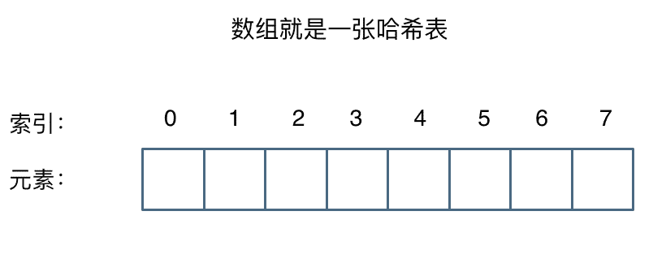
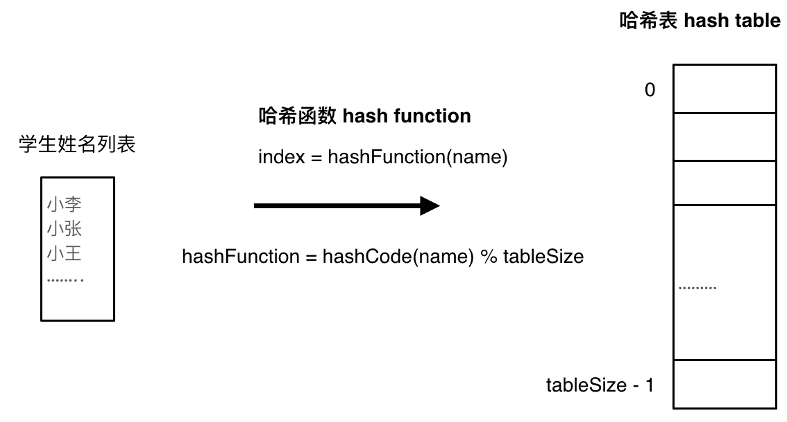
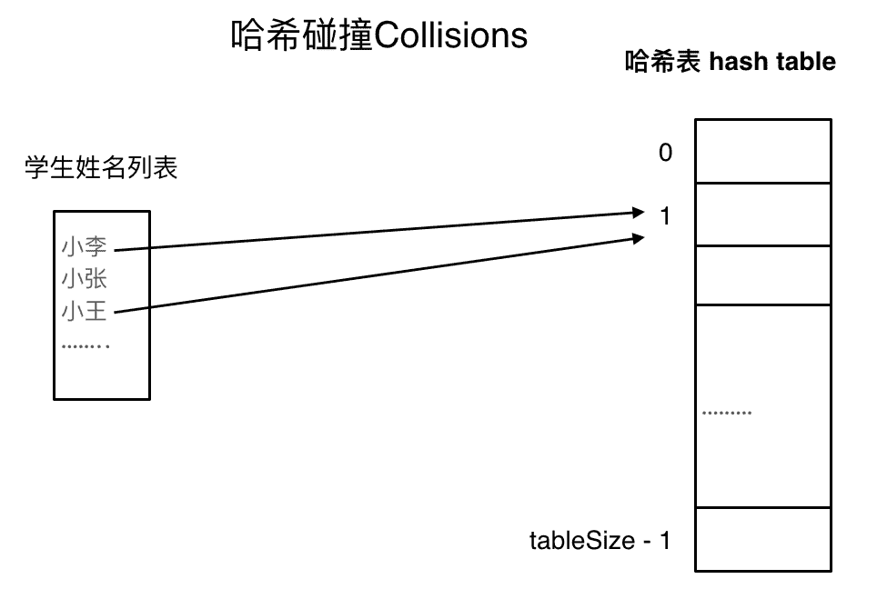
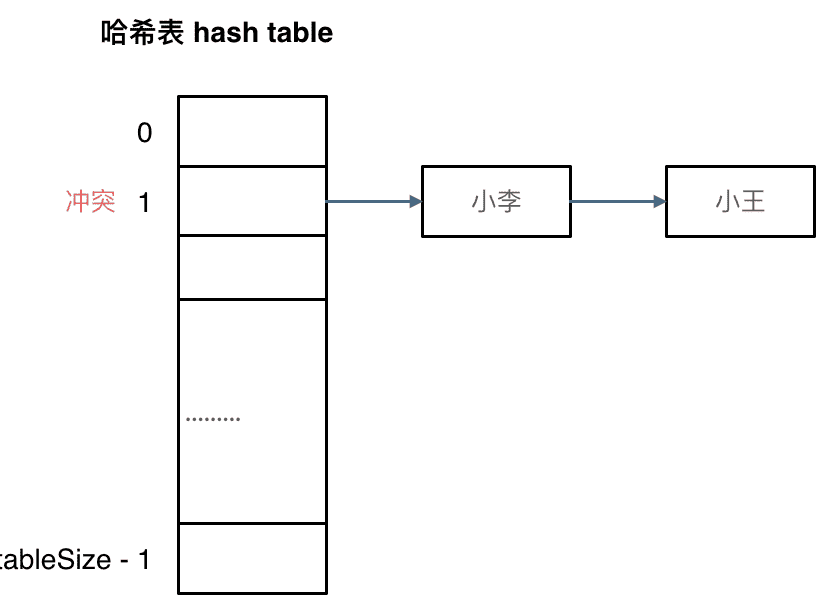
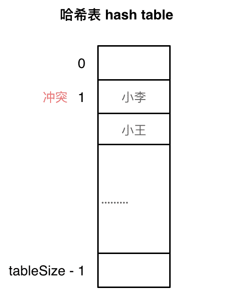

## 理论知识

### 哈希表

首先什么是哈希表，哈希表是根据关键码的值而直接进行访问的数据结构。

这么官方的解释可能有点懵，其实直白来讲其实数组就是一张哈希表。

哈希表中关键码就是数组的索引下标，然后通过下标直接访问数组中的元素，如下图所示：



那么哈希表能解决什么问题呢，**一般哈希表都是用来快速判断一个元素是否出现集合里。**

例如要查询一个名字是否在这所学校里。

要枚举的话时间复杂度是O(n)，但如果使用哈希表的话， 只需要O(1)就可以做到。

我们只需要初始化把这所学校里学生的名字都存在哈希表里，在查询的时候通过索引直接就可以知道这位同学在不在这所学校里了。

将学生姓名映射到哈希表上就涉及到了**hash function ，也就是哈希函数**


### 哈希函数

哈希函数，把学生的姓名直接映射为哈希表上的索引，然后就可以通过查询索引下标快速知道这位同学是否在这所学校里了。

哈希函数如下图所示，通过hashCode把名字转化为数值，一般hashcode是通过特定编码方式，可以将其他数据格式转化为不同的数值，这样就把学生名字映射为哈希表上的索引数字了。



如果hashCode得到的数值大于 哈希表的大小了，也就是大于tableSize了，怎么办呢？

此时为了保证映射出来的索引数值都落在哈希表上，我们会在再次对数值做一个取模的操作（`hashCode(name % tableSize)`），这样我们就保证了学生姓名一定可以映射到哈希表上了。

此时问题又来了，哈希表我们刚刚说过，就是一个数组。

如果学生的数量大于哈希表的大小怎么办，此时就算哈希函数计算的再均匀，也避免不了会有几位学生的名字同时映射到哈希表 同一个索引下标的位置。

接下来**哈希碰撞**登场


### 哈希碰撞

如图所示，小李和小王都映射到了索引下标 1 的位置，**这一现象叫做哈希碰撞**。

一般哈希碰撞有两种解决方法， 拉链法和线性探测法。


#### 拉链法

刚刚小李和小王在索引1的位置发生了冲突，发生冲突的元素都被存储在链表中。 这样我们就可以通过索引找到小李和小王了



（数据规模是dataSize， 哈希表的大小为tableSize）

其实拉链法就是要选择适当的哈希表的大小，这样既不会因为数组空值而浪费大量内存，也不会因为链表太长而在查找上浪费太多时间。


#### 线性探测法

使用线性探测法，一定要保证tableSize大于dataSize。 我们需要依靠哈希表中的空位来解决碰撞问题。

例如冲突的位置，放了小李，那么就向下找一个空位放置小王的信息。所以要求tableSize一定要大于dataSize ，要不然哈希表上就没有空置的位置来存放 冲突的数据了。如图所示：



### 常见的三种哈希结构

当我们想使用哈希法来解决问题的时候，我们一般会选择如下三种数据结构。

- 数组
- set （集合）
- map（映射）


### 总结

总结一下，**当我们遇到了要快速判断一个元素是否出现集合里的时候，就要考虑哈希法**。

但是哈希法也是**牺牲了空间换取了时间**，因为我们要使用额外的数组，set或者是map来存放数据，才能实现快速的查找。

如果在做面试题目的时候遇到需要判断一个元素是否出现过的场景也应该第一时间想到哈希法！


## 有效的字母异位词

https://programmercarl.com/0242.%E6%9C%89%E6%95%88%E7%9A%84%E5%AD%97%E6%AF%8D%E5%BC%82%E4%BD%8D%E8%AF%8D.html

https://leetcode.cn/problems/valid-anagram/description/


### 思路


### 代码

```js
/**
 * @param {string} s
 * @param {string} t
 * @return {boolean}
 */
var isAnagram = function(s, t) {
    
    if(s.length !== t.length) return false

    const map = new Map()

    for(let i = 0;i< s.length; i++){
        if(map.has(s[i])){
            map.set(s[i], map.get(s[i]) + 1)
        }else{
            map.set(s[i], 1)
        }
    }

    for(let i = 0 ;i < t.length; i++){
        if(map.has(t[i])){
            map.set(t[i], map.get(t[i])-  1)
            
            // 删除
            // if(map.get(t[i]) == 0){
            //     map.delete(t[i])
            // }
        }else{
            return false
        }

        // 或者不判断这个，在上面删除也可以
        if (map.get(t[i]) < 0) return false;
    }

    return true
};
```


## 两个数组的交集

https://programmercarl.com/0349.%E4%B8%A4%E4%B8%AA%E6%95%B0%E7%BB%84%E7%9A%84%E4%BA%A4%E9%9B%86.html

https://leetcode.cn/problems/intersection-of-two-arrays/description/


### 思路


### 代码


