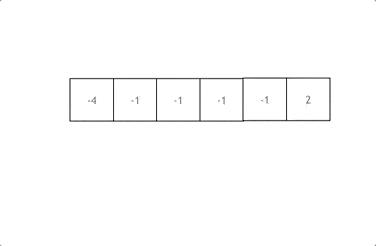

## 理论知识

### 哈希表

首先什么是哈希表，哈希表是根据关键码的值而直接进行访问的数据结构。

这么官方的解释可能有点懵，其实直白来讲其实数组就是一张哈希表。

哈希表中关键码就是数组的索引下标，然后通过下标直接访问数组中的元素，如下图所示：


那么哈希表能解决什么问题呢，**一般哈希表都是用来快速判断一个元素是否出现集合里。**

例如要查询一个名字是否在这所学校里。

要枚举的话时间复杂度是O(n)，但如果使用哈希表的话， 只需要O(1)就可以做到。

我们只需要初始化把这所学校里学生的名字都存在哈希表里，在查询的时候通过索引直接就可以知道这位同学在不在这所学校里了。

将学生姓名映射到哈希表上就涉及到了**hash function ，也就是哈希函数**


### 哈希函数

哈希函数，把学生的姓名直接映射为哈希表上的索引，然后就可以通过查询索引下标快速知道这位同学是否在这所学校里了。

哈希函数如下图所示，通过hashCode把名字转化为数值，一般hashcode是通过特定编码方式，可以将其他数据格式转化为不同的数值，这样就把学生名字映射为哈希表上的索引数字了。


如果hashCode得到的数值大于 哈希表的大小了，也就是大于tableSize了，怎么办呢？

此时为了保证映射出来的索引数值都落在哈希表上，我们会在再次对数值做一个取模的操作（`hashCode(name % tableSize)`），这样我们就保证了学生姓名一定可以映射到哈希表上了。

此时问题又来了，哈希表我们刚刚说过，就是一个数组。

如果学生的数量大于哈希表的大小怎么办，此时就算哈希函数计算的再均匀，也避免不了会有几位学生的名字同时映射到哈希表 同一个索引下标的位置。

接下来**哈希碰撞**登场


### 哈希碰撞

如图所示，小李和小王都映射到了索引下标 1 的位置，**这一现象叫做哈希碰撞**。

一般哈希碰撞有两种解决方法， 拉链法和线性探测法。


#### 拉链法

刚刚小李和小王在索引1的位置发生了冲突，发生冲突的元素都被存储在链表中。 这样我们就可以通过索引找到小李和小王了


（数据规模是dataSize， 哈希表的大小为tableSize）

其实拉链法就是要选择适当的哈希表的大小，这样既不会因为数组空值而浪费大量内存，也不会因为链表太长而在查找上浪费太多时间。


#### 线性探测法

使用线性探测法，一定要保证tableSize大于dataSize。 我们需要依靠哈希表中的空位来解决碰撞问题。

例如冲突的位置，放了小李，那么就向下找一个空位放置小王的信息。所以要求tableSize一定要大于dataSize ，要不然哈希表上就没有空置的位置来存放 冲突的数据了。如图所示：


### 常见的三种哈希结构

当我们想使用哈希法来解决问题的时候，我们一般会选择如下三种数据结构。

- 数组
- set （集合）
- map（映射）


### 总结

总结一下，**当我们遇到了要快速判断一个元素是否出现集合里的时候，就要考虑哈希法**。

但是哈希法也是**牺牲了空间换取了时间**，因为我们要使用额外的数组，set或者是map来存放数据，才能实现快速的查找。

如果在做面试题目的时候遇到需要判断一个元素是否出现过的场景也应该第一时间想到哈希法！


## 有效的字母异位词

https://programmercarl.com/0242.%E6%9C%89%E6%95%88%E7%9A%84%E5%AD%97%E6%AF%8D%E5%BC%82%E4%BD%8D%E8%AF%8D.html

https://leetcode.cn/problems/valid-anagram/description/


### 思路

### 代码

```js
/**
 * @param {string} s
 * @param {string} t
 * @return {boolean}
 */
var isAnagram = function(s, t) {
    
    if(s.length !== t.length) return false

    const map = new Map()

    for(let i = 0;i< s.length; i++){
        if(map.has(s[i])){
            map.set(s[i], map.get(s[i]) + 1)
        }else{
            map.set(s[i], 1)
        }
    }

    for(let i = 0 ;i < t.length; i++){
        if(map.has(t[i])){
            map.set(t[i], map.get(t[i])-  1)
            
            // 删除
            // if(map.get(t[i]) == 0){
            //     map.delete(t[i])
            // }
        }else{
            return false
        }

        // 或者不判断这个，在上面删除也可以
        if (map.get(t[i]) < 0) return false;
    }

    return true
};
```


## 两个数组的交集

https://programmercarl.com/0349.%E4%B8%A4%E4%B8%AA%E6%95%B0%E7%BB%84%E7%9A%84%E4%BA%A4%E9%9B%86.html

https://leetcode.cn/problems/intersection-of-two-arrays/description/


### 思路

### 代码

```js
var intersection = function(nums1, nums2) {
    let set = new Set()

    for(let item of nums1){
        set.add(item)
    }

    const arr = []

    for(let item of nums2){
        if(set.has(item) && !arr.includes(item)){
            arr.push(item)
        }
    }

    return arr
};
```

时间复杂度：`O(n * m)`

```js
var intersection = function(nums1, nums2) {
    let set = new Set()

    for(let item of nums1){
        set.add(item)
    }

    const result = new Set()

    for(let item of nums2){
        if(set.has(item)){
            result.add(item)
        }
    }

    return Array.from(result)
};
```


## 快乐数

https://programmercarl.com/0202.%E5%BF%AB%E4%B9%90%E6%95%B0.html

https://leetcode.cn/problems/happy-number/description/


### 思路

题目中说了会 **无限循环**，那么也就是说**求和的过程中，sum会重复出现，这对解题很重要！**（如果一个数字重复出现，说明已经进入循环）

**当我们遇到了要快速判断一个元素是否出现集合里的时候，就要考虑哈希法了。**

所以这道题目使用哈希法，来判断这个sum是否重复出现，如果重复了就是return false， 否则一直找到sum为1为止。


### 代码

```js
var isHappy = function(n) {
    const seen = new Set()

    // 辅助函数：计算各位平方和
    const getSumOfSquares = (num) => {
        let sum = 0
        while (num > 0) {
            let digit = num % 10
            sum += digit * digit
            num = Math.floor(num / 10)
        }
        return sum
    }

    while (!seen.has(n)) {
        if(n === 1) return true
        seen.add(n)
        n = getSumOfSquares(n)
    }

    return false
}
```

:::info 辅助函数

这个函数的目标是：**计算一个整数 `num` 的每一位数字的平方和**。


分析步骤（假设 num = 82）：

1. `digit = num % 10`：取出个位数字。例如 `82 % 10 = 2`
2. `sum += digit * digit`：把这个数字平方后加到总和中：`sum = 0 + 2² = 4`
3. `num = Math.floor(num / 10)`：把 `num` 除以 10 去掉最后一位：`Math.floor(82 / 10) = 8`
4. 下一轮：
   - `digit = 8 % 10 = 8`
   - `sum += 8² = 64`，现在 `sum = 4 + 64 = 68`
   - `Math.floor(8 / 10) = 0`，循环结束

最终返回 `68`，即 8² + 2² = 64 + 4。

:::


## 两数之和

https://programmercarl.com/0001.%E4%B8%A4%E6%95%B0%E4%B9%8B%E5%92%8C.html

https://leetcode.cn/problems/two-sum/description/


### 思路

再强调一下 **什么时候使用哈希法**，当我们需要查询一个元素是否出现过，或者一个元素是否在集合里的时候，就要第一时间想到哈希法。

本题呢，我就需要一个集合来存放我们遍历过的元素，然后在遍历数组的时候去询问这个集合，某元素是否遍历过，也就是 是否出现在这个集合。

那么我们就应该想到使用哈希法了。

因为本题，我们不仅要知道元素有没有遍历过，还要知道这个元素对应的下标，**需要使用 key value结构来存放，key来存元素，value来存下标，那么使用map正合适**。

接下来需要明确两点：

- **map用来做什么**
- **map中key和value分别表示什么**

map目的用来存放我们访问过的元素，因为遍历数组的时候，需要记录我们之前遍历过哪些元素和对应的下标，这样才能找到与当前元素相匹配的（也就是相加等于target）

接下来是map中key和value分别表示什么。

这道题 我们需要 给出一个元素，判断这个元素是否出现过，如果出现过，返回这个元素的下标。

那么判断元素是否出现，这个元素就要作为key，所以数组中的元素作为key，有key对应的就是value，value用来存下标。

所以 map中的存储结构为 {key：数据元素，value：数组元素对应的下标}。

在遍历数组的时候，只需要向map去查询是否有和目前遍历元素匹配的数值，如果有，就找到的匹配对，如果没有，就把目前遍历的元素放进map中，因为map存放的就是我们访问过的元素。


### 代码

暴力解法这里就不写了很简单的，这里我们用哈希表来做

```js
var twoSum = function(nums, target) {
    let map = new Map();

    for (let i = 0; i < nums.length; i++) {
        let n = target - nums[i];
        if (map.has(n)) {
            return [map.get(n), i];
        }
        map.set(nums[i], i);
    }
};

```


## 四数相加 II

https://programmercarl.com/0454.%E5%9B%9B%E6%95%B0%E7%9B%B8%E5%8A%A0II.html

https://leetcode.cn/problems/4sum-ii/description/


### 思路

1. 首先定义 一个unordered_map，key放a和b两数之和，value 放a和b两数之和出现的次数。
2. 遍历大A和大B数组，统计两个数组元素之和，和出现的次数，放到map中。
3. 定义int变量count，用来统计 a+b+c+d = 0 出现的次数。
4. 再遍历大C和大D数组，找到如果 0-(c+d) 在map中出现过的话，就用count把map中key对应的value也就是出现次数统计出来。
5. 最后返回统计值 count 就可以了


### 代码

```js
var fourSumCount = function(nums1, nums2, nums3, nums4) {
    let map12 = new Map()

    for(let i = 0;i<nums1.length; i++){
        for(let j = 0;j<nums2.length;j++){
            let num = nums1[i] + nums2[j]

            map12.set(num, ( map12.get(num) || 0 ) + 1)
        }
    }
    
    let n = 0
    for(let i = 0;i<nums3.length; i++){
        for(let j = 0;j<nums4.length;j++){
            let num = nums3[i] + nums4[j]
            let target = -num

            if(map12.has(target)){
                n += map12.get(target)
            }
        }
    }

    return n

};
```

:::info 为什么不能在`n += map12.get(target)`后`map12.delete(target)`

因为 `nums3 + nums4` 的组合可能多次出现同一个 `target` 值

:::


## 赎金信

https://programmercarl.com/0383.%E8%B5%8E%E9%87%91%E4%BF%A1.html

https://leetcode.cn/problems/ransom-note/description/


### 思路

### 代码

```js
var canConstruct = function(ransomNote, magazine) {
    let map = new Map()

    for(let i = 0;i<magazine.length;i++){
        map.set(magazine[i], ( map.get( magazine[i])  || 0  ) + 1)
    }

    for(let i = 0;i<ransomNote.length;i++){
        if( map.has( ransomNote[i] ) ){
            map.set(ransomNote[i], map.get(ransomNote[i]) - 1)

            if(map.get(ransomNote[i]) === 0){
                map.delete(ransomNote[i])
            }
        }else{
            return false
        }
    }

    return true
};
```


## 三数之和

https://programmercarl.com/0015.%E4%B8%89%E6%95%B0%E4%B9%8B%E5%92%8C.html

https://leetcode.cn/problems/3sum/description/


### 思路

**哈希法**

两层for循环就可以确定 两个数值，可以使用哈希法来确定 第三个数 0-(a+b) 或者 0 - (a + c) 是否在 数组里出现过，其实这个思路是正确的，但是我们有一个非常棘手的问题，就是题目中说的不可以包含重复的三元组。

把符合条件的三元组放进vector中，然后再去重，这样是非常费时的，很容易超时，也是这道题目通过率如此之低的根源所在。

去重的过程不好处理，有很多小细节，如果在面试中很难想到位。

时间复杂度可以做到O(n^2)，但还是比较费时的，因为不好做剪枝操作。


**双指针**

**其实这道题目使用哈希法并不十分合适**，因为在去重的操作中有很多细节需要注意，在面试中很难直接写出没有bug的代码。

而且使用哈希法 在使用两层for循环的时候，能做的剪枝操作很有限，虽然时间复杂度是O(n^2)，也是可以在leetcode上通过，但是程序的执行时间依然比较长 。

接下来介绍另一个解法：双指针法，**这道题目使用双指针法 要比哈希法高效一些**，那么来讲解一下具体实现的思路。

动画效果如下：

拿这个nums数组来举例，首先将数组排序，然后有一层for循环，i从下标0的地方开始，同时定一个下标left 定义在i+1的位置上，定义下标right 在数组结尾的位置上。

依然还是在数组中找到 abc 使得a + b +c =0，我们这里相当于 a = nums[i]，b = nums[left]，c = nums[right]。

接下来如何移动left 和right呢， 如果nums[i] + nums[left] + nums[right] > 0 就说明 此时三数之和大了，因为数组是排序后了，所以right下标就应该向左移动，这样才能让三数之和小一些。

如果 nums[i] + nums[left] + nums[right] < 0 说明 此时 三数之和小了，left 就向右移动，才能让三数之和大一些，直到left与right相遇为止。

时间复杂度：O(n^2)。


### 代码

```js
var threeSum = function(nums) {
    nums.sort((a, b) => a-b)
    
    let n = nums.length

    if(nums[0] > 0 || nums[n - 1] < 0) return []

    const arr = []

    for(let i = 0;i<n;i++){
        // 对 i 进行去重
        if(i > 0 && nums[i] === nums[i-1]) continue

        let left = i + 1
        let right = n - 1

        while( left < right ){
            let sum = nums[i] + nums[left] + nums[right]

            if(sum === 0){
                // 还要在去一次重
                arr.push([nums[i], nums[left], nums[right]])

                // 去重 left 和 right
                while (left < right && nums[left] === nums[left + 1]) left++
                while (left < right && nums[right] === nums[right - 1]) right--

                left++
                right--
            }else if(sum > 0){
                right--
            }else{
                left++
            }
        }
    }


    return arr
    
};
```

:::info 为什么`i`去重是将`i`与`i-1`进行比较

如果将i与i+1进行比较，那不就是i与left进行比较了吗

:::


## 四数之和

https://programmercarl.com/0018.%E5%9B%9B%E6%95%B0%E4%B9%8B%E5%92%8C.html

https://leetcode.cn/problems/4sum/description/


### 思路

四数之和，和三数之和是一个思路，都是使用双指针法, 基本解法就是在三数之和的基础上再套一层for循环。


### 代码

```js
var fourSum = function(nums, target) {
    nums.sort((a, b) => a - b)

    let n = nums.length

    const arr = []

    for(let i = 0;i < n;i++){
        if(i > 0 && nums[i] === nums[i-1]) continue

        for(let j = i + 1;j < n;j++){

            // 注意这里的剪枝操作，如果没有j > i + 1，就和三数之和为什么要判断i与i-1 而不是 i与i+1 一样的原因了
            if(j > i + 1 && nums[j] === nums[j-1]) continue

            let left = j + 1
            let right = n - 1

            while( left < right ){
                const num = nums[i] + nums[j] + nums[left] + nums[right]
                if( num  === target ){
                    arr.push( [ nums[i], nums[j], nums[left], nums[right] ] )

                    while( left < right && nums[left] === nums[left+1] ) left++
                    while( left < right && nums[right] === nums[right-1] ) right--

                    left++
                    right--
                }else if( num > target){
                    right--
                }else{
                    left++
                }
            }
        }
    }

    return arr
};
```


:::info 为什么没有`if(n > 0 && (nums[n -1] < target || nums[0] > target)) return []` 的操作了

因为target可能为负数

:::


