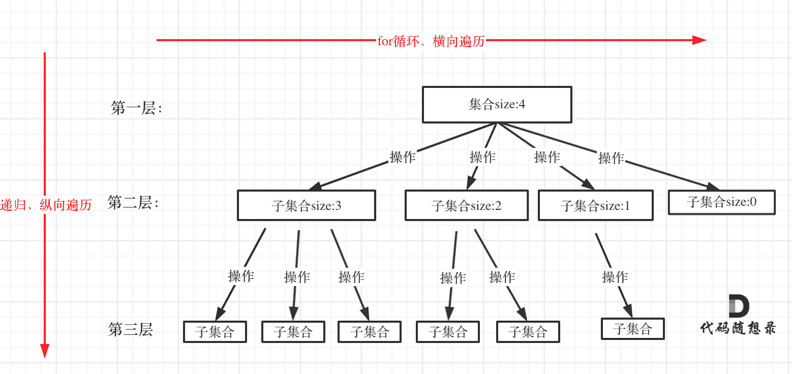

## 理论知识

### 什么是回溯法

回溯法也可以叫做回溯搜索法，它是一种搜索的方式。回溯是递归的副产品，只要有递归就会有回溯。


### 回溯法的效率

回溯法的性能如何呢，这里要和大家说清楚了，**虽然回溯法很难，很不好理解，但是回溯法并不是什么高效的算法**。

**因为回溯的本质是穷举，穷举所有可能，然后选出我们想要的答案**，如果想让回溯法高效一些，可以加一些剪枝的操作，但也改不了回溯法就是穷举的本质。

那么既然回溯法并不高效为什么还要用它呢？

因为没得选，一些问题能暴力搜出来就不错了，撑死了再剪枝一下，还没有更高效的解法。


### 回溯法解决的问题

回溯法，一般可以解决如下几种问题：

- 组合问题：N个数里面按一定规则找出k个数的集合
- 切割问题：一个字符串按一定规则有几种切割方式
- 子集问题：一个N个数的集合里有多少符合条件的子集
- 排列问题：N个数按一定规则全排列，有几种排列方式
- 棋盘问题：N皇后，解数独等等

**相信大家看着这些之后会发现，每个问题，都不简单！**

另外，会有一些同学可能分不清什么是组合，什么是排列？

**组合是不强调元素顺序的，排列是强调元素顺序**。

例如：{1, 2} 和 {2, 1} 在组合上，就是一个集合，因为不强调顺序，而要是排列的话，{1, 2} 和 {2, 1} 就是两个集合了。

记住组合无序，排列有序，就可以了。


### 如何理解回溯法

**回溯法解决的问题都可以抽象为树形结构**，是的，我指的是所**有回溯法的问题都可以抽象为树形结构**！

因为回溯法解决的都是在集合中递归查找子集，**集合的大小就构成了树的宽度（一般for循环来处理），递归的深度就构成了树的深度（一般递归来处理）**。

递归就要有终止条件，所以必然是一棵高度有限的树（N叉树）。


### 回溯法模板

这里给出Carl总结的回溯算法模板。回溯三部曲：

1. 回溯函数模板返回值以及参数

   - 因为回溯算法需要的参数可不像二叉树递归的时候那么容易一次性确定下来，所以一般是先写逻辑，然后需要什么参数，就填什么参数

2. 回溯函数终止条件

   - 什么时候达到了终止条件，树中就可以看出，一般来说搜到叶子节点了，也就找到了满足条件的一条答案，把这个答案存放起来，并结束本层递归。

3. 回溯搜索的遍历过程

   - 回溯法一般是在集合中递归搜索，集合的大小构成了树的宽度，递归的深度构成的树的深度。
   - 

   - for循环就是遍历集合区间，可以理解一个节点有多少个孩子，这个for循环就执行多少次。
   - backtracking这里自己调用自己，实现递归。
   - 大家可以从图中看出**for循环可以理解是横向遍历，backtracking（递归）就是纵向遍历**，这样就把这棵树全遍历完了，一般来说，搜索叶子节点就是找的其中一个结果了。


```js
void backtracking(参数){
    if(终止条件){
        // 一般情况下，终止条件就到了我们收集结果的时候了，大部分情况下都是会在叶子节点的时候去收集结果，有的会在每个节点就去收集结果
        收集结果
        return;
    }
    
    // 进入单层搜索的逻辑，一般情况下是一个for循环，用来处理这个集合中的每一个元素
    for(集合的元素集){
        处理节点（处理满足条件的节点）
        递归函数（进入递归的过程）
        回溯操作（撤销处理节点的情况）
    }
}
```


## 组合

https://programmercarl.com/0077.%E7%BB%84%E5%90%88.html

https://leetcode.cn/problems/combinations/description/


### 思路

从下图中红线部分可以看出，在集合[1,2,3,4]取1之后，下一层递归，就要在[2,3,4]中取数了，那么下一层递归如何知道从[2,3,4]中取数呢，靠的就是startIndex。所以需要startIndex来记录下一层递归，搜索的起始位置。


### 代码

**未剪枝**

```js
var combine = function(n, k) {
    
    const arr = []
    const result = []

    function backtracking(startIndex){
        if(arr.length === k){
            result.push([...arr])
            return
        }

        for(let i = startIndex;i<=n;i++){
            arr.push(i)
            backtracking(i+1)
            arr.pop()
        }
    }

    backtracking(1)

    return result

};
```

注意点：

- 不能直接`result.push(arr)`，要使用浅拷贝保存当前组件`result.push([...arr])`
- 递归调用的是`backtracking(i+1)`，如果使用`i`会导致重复使用相同的数字，无法确保组合中数字是递增且不重复的


**剪枝优化**


