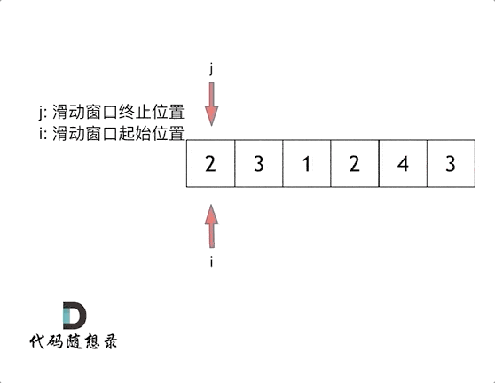

## 理论知识

- 数组下标都是从0开始的。
- 数组内存空间的地址是连续的

正是因为数组在内存空间的地址是连续的，所以我们在删除或者增添元素的时候，就难免要移动其他元素的地址。


## 二分查找

https://programmercarl.com/0704.%E4%BA%8C%E5%88%86%E6%9F%A5%E6%89%BE.html

https://leetcode.cn/problems/binary-search/

### 思路

明确好区间的定义，是左闭右闭即[left, right]，还是左闭右开即[left, right)


### 方法一：左闭右闭即[left, right]

**定义target在[left, right]区间，所以有如下两点**：

- while (left <= right) 要使用 <= ，因为left == right是有意义的，所以使用 <=
- if (nums[middle] > target) right 要赋值为 middle - 1，因为当前这个nums[middle]一定不是target，那么接下来要查找的左区间结束下标位置就是 middle - 1

```typescript
function search(nums: number[], target: number): number {
    
    let left = 0
    let right = nums.length - 1

    while(left <= right){
        let i  = Math.floor((left + right) / 2)
        if(nums[i] === target){
            return i
        }else{
            if( nums[i] > target ){
                right = i - 1
            }else{
                left = i + 1
            }
        }
    }


    return -1
};
```


:::info 为什么要用 `Math.floor` 而不是 `Math.ceil`

如果使用 `Math.ceil`，在某些情况下，`left` 和 `right` 很靠近，`mid` 会更偏向右边，可能导致死循环。

举例：

- 如果 `left = 1`, `right = 2`
  - `floor((1 + 2)/2) = 1`，下一步可能设置 `left = 2` 或 `right = 0`，总能跳出循环；
  - 但 `ceil((1 + 2)/2) = 2`，如果逻辑不当，就会卡在 `left = 1, right = 2` 的循环中。
- 使用 `Math.floor` 是为了避免死循环，让中间值偏向左边更稳定；
- 使用 `Math.ceil` 理论上也可，但需要更严格地处理边界，容易出错；

:::


### 方法二：左闭右开即[left, right)

如果说定义 target 是在一个在左闭右开的区间里，也就是[left, right) ，那么二分法的边界处理方式则截然不同。

有如下两点：

- while (left < right)，这里使用 < ,因为left == right在区间[left, right)是没有意义的
- if (nums[middle] > target) right 更新为 middle，因为当前nums[middle]不等于target，去左区间继续寻找，而寻找区间是左闭右开区间，所以right更新为middle，即：下一个查询区间不会去比较nums[middle]

```typescript
function search(nums: number[], target: number): number {
    
    let left = 0
    let right = nums.length

    while(left < right){
        let i  = Math.floor((left + right) / 2)
        if(nums[i] === target){
            return i
        }else{
            if( nums[i] > target ){
                right = i
            }else{
                left = i + 1
            }
        }
    }


    return -1
};
```


:::info 补充

这个相较于左闭右闭不好理解

- 首先是`let right = nums.length`，因为定义target在左闭右开的区间里，即：[left, right)
- while (left < right) ， 因为left == right的时候，在[left, right)是无效的空间，所以使用 <
- right = middle，因为target 在左区间，在[left, middle)中

:::


## 移除元素

https://programmercarl.com/0027.%E7%A7%BB%E9%99%A4%E5%85%83%E7%B4%A0.html

https://leetcode.cn/problems/remove-element/description/

### 思路

题目要求：需要**原地**移除

因为元素在内存地址中是连续的，不能单独删除数组中的某个元素，所以只能覆盖


### 暴力解法

暴力的解法就是两层for循环，一个for循环遍历数组元素 ，第二个for循环更新数组。

```typescript
function removeElement(nums: number[], val: number): number {
    let n = nums.length

    for(let i = 0; i <n; i++){
        if( nums[i] === val ){
            for(let j = i+1; j<n; j++){
                nums[j - 1] = nums[j]
            }
            i--
            n--
        }
    }

    return n
};
```


:::info 为什么要 `i--`

因为当前 `i` 位置又是新元素了，必须重新检查这个位置！所以 `i--`

:::


### 双指针法

双指针法（快慢指针法）： **通过一个快指针和慢指针在一个for循环下完成两个for循环的工作。**

定义快慢指针

- 快指针：寻找新数组的元素 ，新数组就是不含有目标元素的数组
- 慢指针：指向更新 新数组下标的位置

```
function removeElement(nums: number[], val: number): number {
    let slowIndex = 0

    for(let fastIndex = 0; fastIndex < nums.length; fastIndex++){
        if(nums[fastIndex] !== val){
            nums[slowIndex] = nums[fastIndex] // 保留有效值
            slowIndex++
        }
    }

    return slowIndex
};
```


### 其他解决方法

这种方式是我自己想到的，定义两个指针，一个从开头，一个从结尾开始交换

```typescript

function removeElement(nums: number[], val: number): number {
    let i = 0
    let j = nums.length - 1

    for(;i<=j;i++){
        if(nums[i] === val){
            nums[i] = nums[j]
            j--
            i-- // 这里的i为什么要--需要理解
        }
    }

    return i
};
```


## 有序数的平方

https://programmercarl.com/0977.%E6%9C%89%E5%BA%8F%E6%95%B0%E7%BB%84%E7%9A%84%E5%B9%B3%E6%96%B9.html

https://leetcode.cn/problems/squares-of-a-sorted-array/description/

### 思路


### 暴力解法

先平方在排序

```typescript
function sortedSquares(nums: number[]): number[] {
    return nums.map(item => item * item).sort((a, b) => a - b)
};
```


### 双指针

数组其实是有序的， 只不过负数平方之后可能成为最大数了。

那么数组平方的最大值就在数组的两端，不是最左边就是最右边，不可能是中间。

此时可以考虑双指针法了，i指向起始位置，j指向终止位置。

```typescript
function sortedSquares(nums: number[]): number[] {
    let arr = []

    let i = 0
    let j = nums.length - 1

    while(i <= j){
        let a = nums[i] * nums[i]
        let b = nums[j] * nums[j]
        if( a >= b){
            arr.unshift(a)
            i++
        }else{
            arr.unshift(b)
            j--
        }
    }

    return arr
};
```


## 长度最小的子数组

https://www.programmercarl.com/0209.%E9%95%BF%E5%BA%A6%E6%9C%80%E5%B0%8F%E7%9A%84%E5%AD%90%E6%95%B0%E7%BB%84.html

https://leetcode.cn/problems/minimum-size-subarray-sum/description/


### 思路

### 暴力解法

暴力解法当然是 两个for循环，然后不断的寻找符合条件的子序列

```typescript
function minSubArrayLen(target: number, nums: number[]): number {
    let n = Infinity

    for(let i= 0;i<nums.length;i++){
        let s = 0
        for(let j = i;j<nums.length;j++){
            s += nums[j]
            if(s >= target){
                n = Math.min(n, j - i + 1)
                break
            }
        }
    }

    return n === Infinity ? 0 : n
};
```

时间复杂度是O(n^2)

:::info 为什么比较的是 `i - j + 1`

`j` 和 `i` 是你当前找到的**子数组的起点和终点索引**

比如子数组是从 `nums[2]` 到 `nums[4]`，那么长度是多少？

- 索引 `j = 4`，`i = 2`
- 长度 = `4 - 2 + 1 = 3` ✅

:::


### 滑动窗口

所谓滑动窗口，**就是不断的调节子序列的起始位置和终止位置，从而得出我们要想的结果**。

在暴力解法中，是一个for循环滑动窗口的起始位置，一个for循环为滑动窗口的终止位置，用两个for循环 完成了一个不断搜索区间的过程。

那么滑动窗口如何用一个for循环来完成这个操作呢。

首先要思考 如果用一个for循环，那么应该表示 滑动窗口的起始位置，还是终止位置。

如果只用一个for循环来表示 滑动窗口的起始位置，那么如何遍历剩下的终止位置？

此时难免再次陷入 暴力解法的怪圈。

所以 只用一个for循环，那么这个循环的索引，一定是表示 滑动窗口的终止位置。

那么问题来了， 滑动窗口的起始位置如何移动呢？

滑动窗口也可以理解为双指针法的一种！只不过这种解法更像是一个窗口的移动，所以叫做滑动窗口更适合一些。

这里还是以题目中的示例来举例，s=7， 数组是 2，3，1，2，4，3，来看一下查找的过程：



```typescript
// 我思考的过程
function minSubArrayLen(target: number, nums: number[]): number {
    let n = Infinity
    let slowIndex = 0
    let all = 0

    for(let fastIndex = 0;fastIndex < nums.length; fastIndex++){
        all += nums[fastIndex]

        // 配合动画理解更好
        if(all >= target){
            n = Math.min(n, fastIndex - slowIndex + 1)
            // all 将最后一个和第一个剪掉，slow向前，fast后退一个
            all = all -  nums[slowIndex] - nums[fastIndex]
            fastIndex--
            slowIndex++
        }
    }

    return n === Infinity ? 0 : n
};
```

```typescript
// 其实用while来移动左窗口更好
function minSubArrayLen(target: number, nums: number[]): number {
    let n = Infinity
    let slowIndex = 0
    let all = 0

    for(let fastIndex = 0;fastIndex < nums.length; fastIndex++){
        all += nums[fastIndex]

        while(all >= target){
            n = Math.min(n, fastIndex - slowIndex + 1)
            all = all -  nums[slowIndex]
            slowIndex++
        }
    }

    return n === Infinity ? 0 : n
};
```

- 时间复杂度：O(n)

:::info 为什么要使用 `while` 而不是 `if`

因为使用 `while` 是为了 **尽可能缩小窗口的大小**，而 `if` 只能缩一次，不能连续缩。

**类比一下 if 和 while 的区别**：

- 用 `if`：

```typescript
if (sum >= target) {
  // 只缩一次
  minLen = Math.min(minLen, right - left + 1)
  sum -= nums[left]
  left++
}
```

只判断了一次：如果这次 `sum >= target`，就缩一下。但可能**缩一次还不够**，还可以继续缩，得到更短的子数组。

- `while` 可以不断缩：

```typescript
while (sum >= target) {
  // 一直缩，直到 sum < target
  minLen = Math.min(minLen, right - left + 1)
  sum -= nums[left]
  left++
}
```

**只要总和还满足 `sum >= target`，我就不停地缩小窗口左边界，直到再缩就不满足为止。**

:::


## 螺旋矩阵

## 区间和

https://www.programmercarl.com/kamacoder/0058.%E5%8C%BA%E9%97%B4%E5%92%8C.html#%E6%80%9D%E8%B7%AF

https://kamacoder.com/problempage.php?pid=1070


### 思路

数组上常用的解题技巧：前缀和


### 代码

```js
// 导入 readline 模块
const readline = require('readline');

// 创建 readline 接口实例
const rl = readline.createInterface({
    input: process.stdin, // 从标准输入读取
    output: process.stdout, // 输出到标准输出（主要用于提示，这里可以省略）
    terminal: false // 表明这不是一个交互式终端
});

function main(){
    let inputlines = []
    rl.on("line", (line) => {
        inputlines.push(line.trim())
    })
    
    rl.on("close", () => {
        let length = Number(inputlines[0])
        let arr = inputlines.slice(1, length + 1).map(item => Number(item))
        let numArr = []
        let n = 0

        for (let i = 0; i < length; i++){
            n += arr[i]
            numArr[i] = n
        }

        let sumArr = inputlines.slice(length + 1, inputlines.length)

        for (let i = 0; i < sumArr.length; i++){
            let [a, b] = sumArr[i].split(' ').map(item => Number(item))
            if (a === 0) {
                console.log(numArr[b]);
            } else {
                console.log(numArr[b] - numArr[a - 1]);
            }
        }
    })
}

main()
```


:::info 为什么是`numArr[b] - numArr[a - 1]`

假设有一个数组 `arr = [1, 2, 3, 4, 5]`，我们构建它的前缀和数组 `prefixSum`，如下：

```
复制编辑prefixSum[0] = arr[0] = 1
prefixSum[1] = arr[0] + arr[1] = 3
prefixSum[2] = arr[0] + arr[1] + arr[2] = 6
prefixSum[3] = arr[0] + arr[1] + arr[2] + arr[3] = 10
prefixSum[4] = arr[0] + arr[1] + arr[2] + arr[3] + arr[4] = 15
```

即：

```js
arr        = [1, 2, 3, 4, 5]
prefixSum  = [1, 3, 6, 10, 15]
```

```js
sum[a, b] = prefixSum[b] - prefixSum[a - 1]
```

例子：

- 区间 `[1, 3]`：`2 + 3 + 4 = 9`
   => `prefixSum[3] - prefixSum[0] = 10 - 1 = 9`
- 区间 `[0, 2]`：`1 + 2 + 3 = 6`
   => `prefixSum[2] - prefixSum[-1]` ❌ 这不合法！

:::


## 开发商购买土地


## 补充

### ACM输入输出模式

```js
// 导入 readline 模块
const readline = require('readline');

// 创建 readline 接口实例
const rl = readline.createInterface({
    input: process.stdin, // 从标准输入读取
    output: process.stdout, // 输出到标准输出（主要用于提示，这里可以省略）
    terminal: false // 表明这不是一个交互式终端
});

function main(){
    let inputlines = []
    rl.on("line", (line) => {
        inputlines.push(line.trim())
    })
    
    rl.on("close", () => {
        // 输出输入的值，根据输入的值，来先获取的你所需要的参数
        console.log(inputlines)
    })
}

main()
```

**举例**

> ###### 题目描述
>
> 给定一个整数数组 Array，请计算该数组在每个指定区间内元素的总和。
>
> ###### 输入描述
>
> 第一行输入为整数数组 Array 的长度 n，接下来 n 行，每行一个整数，表示数组的元素。随后的输入为需要计算总和的区间下标：a，b （b > = a），直至文件结束。
>
> ###### 输出描述
>
> 输出每个指定区间内元素的总和。
>
> ###### 输入示例
>
> ```
> 5
> 1
> 2
> 3
> 4
> 5
> 0 1
> 1 3
> ```
>
> ###### 输出示例
>
> ```
> 3
> 9
> ```

```js
// 导入 readline 模块
const readline = require('readline');

// 创建 readline 接口实例
const rl = readline.createInterface({
    input: process.stdin, // 从标准输入读取
    output: process.stdout, // 输出到标准输出（主要用于提示，这里可以省略）
    terminal: false // 表明这不是一个交互式终端
});

function main(){
    let inputlines = []
    rl.on("line", (line) => {
        inputlines.push(line.trim())
    })
    
    rl.on("close", () => {
        // 数组长度
        const length = Number(inputlines[0])
        // 拿到数组
        const arr = inputlines.slice(1, length + 1).map(item => Number(item))
        // 拿到需要计算的数组
        const sumArr = inputlines.slice(length + 1, inputlines.length)
        
        for (let i = 0; i < sumArr.length; i++){
            const [a, b] = sumArr[i].split(' ').map(item => Number(item))
            // 开始计算(当然这里可以这么做但不是最好的)
            // 开始计算
            const newArr = arr.slice(a, b + 1)
            let n = 0
            for (const item of newArr) {
                n += item
            }
            // 最后的结果console.log 即可
            console.log(n)
        }
    })
}

main()
```


