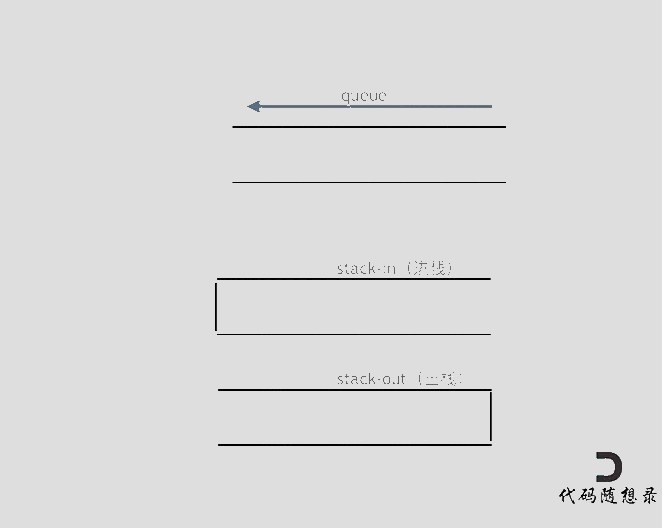

## 理论知识

队列是先进先出，栈是先进后出。


## 用栈实现队列

https://programmercarl.com/0232.%E7%94%A8%E6%A0%88%E5%AE%9E%E7%8E%B0%E9%98%9F%E5%88%97.html

https://leetcode.cn/problems/implement-queue-using-stacks/description/


### 思路

使用栈来模拟队列的行为，如果仅仅用一个栈，是一定不行的，所以需要两个栈**一个输入栈，一个输出栈**，这里要注意输入栈和输出栈的关系。

下面动画模拟以下队列的执行过程：

执行语句：
```js
queue.push(1);
queue.push(2);
queue.pop(); **注意此时的输出栈的操作**
queue.push(3);
queue.push(4);
queue.pop();
queue.pop();**注意此时的输出栈的操作**
queue.pop();
queue.empty();
```



在push数据的时候，只要数据放进输入栈就好，**但在pop的时候，操作就复杂一些，输出栈如果为空，就把进栈数据全部导入进来（注意是全部导入）**，再从出栈弹出数据，如果输出栈不为空，则直接从出栈弹出数据就可以了。

最后如何判断队列为空呢？**如果进栈和出栈都为空的话，说明模拟的队列为空了。**


### 代码

```js

var MyQueue = function() {
    this.inArr = []
    this.outArr = []
};

/** 
 * @param {number} x
 * @return {void}
 */
MyQueue.prototype.push = function(x) {
    this.inArr.push(x)
};

/**
 * @return {number}
 */
MyQueue.prototype.pop = function() {

    const n = this.outArr.length

    if(n){
        return this.outArr.pop()
    }

    while(this.inArr.length){
        this.outArr.push(this.inArr.pop())
    }

    return this.outArr.pop()
};

/**
 * @return {number}
 */
MyQueue.prototype.peek = function() {
    const x = this.pop()
    this.outArr.push(x)
    return x
};

/**
 * @return {boolean}
 */
MyQueue.prototype.empty = function() {
    return !this.outArr.length && !this.inArr.length
};
```


## 用队列实现栈

https://programmercarl.com/0225.%E7%94%A8%E9%98%9F%E5%88%97%E5%AE%9E%E7%8E%B0%E6%A0%88.html

https://leetcode.cn/problems/implement-stack-using-queues/description/


### 思路

其实这道题目就是用一个队列就够了。

**一个队列在模拟栈弹出元素的时候只要将队列头部的元素（除了最后一个元素外） 重新添加到队列尾部，此时再去弹出元素就是栈的顺序了。**


### 代码

```js

var MyStack = function() {
    this.arr = []
};

/** 
 * @param {number} x
 * @return {void}
 */
MyStack.prototype.push = function(x) {
    this.arr.unshift(x)
};

/**
 * @return {number}
 */
MyStack.prototype.pop = function() {
    let n = this.arr.length - 1
    while(n){
        this.push(this.arr.shift())
        n--
    }

    return this.arr.shift()
};

/**
 * @return {number}
 */
MyStack.prototype.top = function() {
    return this.arr[0]
};

/**
 * @return {boolean}
 */
MyStack.prototype.empty = function() {
    return !this.arr.length
};
```


## 有效括号

https://programmercarl.com/0020.%E6%9C%89%E6%95%88%E7%9A%84%E6%8B%AC%E5%8F%B7.html

https://leetcode.cn/problems/valid-parentheses/description/


### 思路

### 代码

```js
var isValid = function (s) {
  const stack = [];
  for (let i = 0; i < s.length; i++) {
    let c = s[i];
    switch (c) {
      case '(':
        stack.push(')');
        break;
      case '[':
        stack.push(']');
        break;
      case '{':
        stack.push('}');
        break;
      default:
        if (c !== stack.pop()) {
          return false;
        }
    }
  }
  return stack.length === 0;
};
```


## 删除字符串中的所有相邻的重复项

https://programmercarl.com/1047.%E5%88%A0%E9%99%A4%E5%AD%97%E7%AC%A6%E4%B8%B2%E4%B8%AD%E7%9A%84%E6%89%80%E6%9C%89%E7%9B%B8%E9%82%BB%E9%87%8D%E5%A4%8D%E9%A1%B9.html

https://leetcode.cn/problems/remove-all-adjacent-duplicates-in-string/description/


### 思路

### 代码

```js
var removeDuplicates = function(s) {
    let arr = []

    for(let i = 0; i < s.length; i++){
        const a = arr[arr.length - 1]
        if(a === s[i]){
            arr.pop()
        }else{
            arr.push(s[i])
        }
    }

    return arr.join("")
};
```


## 逆波兰表达式求值

https://programmercarl.com/0150.%E9%80%86%E6%B3%A2%E5%85%B0%E8%A1%A8%E8%BE%BE%E5%BC%8F%E6%B1%82%E5%80%BC.html

https://leetcode.cn/problems/evaluate-reverse-polish-notation/description/


### 思路

逆波兰表达式是一种后缀表达式，所谓后缀就是指算符写在后面。

- 平常使用的算式则是一种中缀表达式，如 `( 1 + 2 ) * ( 3 + 4 )` 。
- 该算式的逆波兰表达式写法为 `( ( 1 2 + ) ( 3 4 + ) * )` 。

逆波兰表达式主要有以下两个优点：

- 去掉括号后表达式无歧义，上式即便写成 `1 2 + 3 4 + * `也可以依据次序计算出正确结果。
- **适合用栈操作运算：遇到数字则入栈；遇到算符则取出栈顶两个数字进行计算，并将结果压入栈中**


### 代码

```js
var evalRPN = function(tokens) {
    const arr = []

    for(let i = 0;i<tokens.length;i++){
        if( ["+", "-", "*", "/"].includes(tokens[i]) ){
            const a = arr.pop()
            const b = arr.pop()
            
            let result;

            switch(tokens[i]) {
                case "+":
                    result = b + a;
                    break;
                case "-":
                    result = b - a;
                    break;
                case "*":
                    result = b * a;
                    break;
                case "/":
                    // 注意点：正数和负数向零阶段是不一样的
                    result = b / a > 0 ? Math.floor(b / a) : Math.ceil(b / a);
                    break;
            }

            arr.push(result);
        }else{
            arr.push(Number(tokens[i]))
        }
    }

    return arr[0]
};
```

:::info 补充

`result = b / a > 0 ? Math.floor(b / a) : Math.ceil(b / a)` 我们可以使用 `result = b / a | 0`

解释：使用了**按位或运算符 `|` 来实现取整（截断）**

举个例子说明：

```js
console.log(5 / 2);        // 2.5
console.log(5 / 2 | 0);    // 2（向 0 截断）

console.log(-5 / 2);       // -2.5
console.log(-5 / 2 | 0);   // -2（仍然向 0 截断）
```

注意事项：

- `| 0` 只适用于整数范围内的运算。
- 对于非常大的浮点数，它可能会失去精度。

:::


## 滑动窗口最大值

https://programmercarl.com/0239.%E6%BB%91%E5%8A%A8%E7%AA%97%E5%8F%A3%E6%9C%80%E5%A4%A7%E5%80%BC.html

https://leetcode.cn/problems/sliding-window-maximum/description/


### 代码

### 思路

首先暴力解法是不行的，超出时间限制

然后这是我最开始的思路

```js
var maxSlidingWindow = function(nums, k) {
    const n = nums.length 
    if( n <= 1) return nums

    if(n <= k) return [ getMaxValue(nums) ]

    const arr = []
    
    for(let i = 0; i < k;i++){
        arr.push(nums[i])
    }

    const newArr = [getMaxValue(arr)]

    for(let i = k; i < nums.length;i++){
        arr.push(nums[i])
        arr.shift()
        newArr.push(getMaxValue(arr))
    }

    return newArr
};


function getMaxValue(arr){
    return Math.max(...arr)
}
```

代码是没有问题的，但是还是超出时间限制，整个算法是 `O((n - k + 1) * k)`

思路：为了保证队列头部始终是当前窗口的最大值下标。

```js
var maxSlidingWindow = function(nums, k) {
    // 存储的是下标
    const deque = []
    // 存放最大值
    const result = []

    for (let i = 0; i < nums.length; i++) {
        // 判断队头的元素（最左边的下标）是否已经滑出窗口
        // 如果 deque[0] <= i - k，说明该元素已经不在当前窗口范围 [i - k + 1, i] 中了，需将其移除
        if (deque.length && deque[0] <= i - k) {
            deque.shift()
        }

        // 这个循环做两件事：
		//   保证 deque 中的下标对应的 nums 值是从大到小的顺序
		//   如果当前值 nums[i] 更大，说明前面的元素不可能是窗口最大值了，可以直接弹出
        while (deque.length && nums[deque[deque.length - 1]] < nums[i]) {
            deque.pop()
        }

        // 将当前下标加入队列
        deque.push(i)

        // 当窗口形成（即 i >= k - 1），将当前窗口的最大值（即队头的元素）加入结果数组。
        if (i >= k - 1) {
            result.push(nums[deque[0]])
        }
    }

    return result
}
```

:::info 为什么`如果 deque[0] <= i - k，说明该元素已经不在当前窗口范围 [i - k + 1, i] 中了`

:::

:::info 为什么`nums[deque[deque.length - 1]] < nums[i]`

:::


## 前 K 个高频元素

https://programmercarl.com/0347.%E5%89%8DK%E4%B8%AA%E9%AB%98%E9%A2%91%E5%85%83%E7%B4%A0.html

https://leetcode.cn/problems/top-k-frequent-elements/description/


### 思路


### 哈希表 + 排序

```js
function topKFrequent(nums, k) {
  const freqMap = new Map();

  // 1. 统计频率
  for (const num of nums) {
    freqMap.set(num, (freqMap.get(num) || 0) + 1);
  }

  // 2. 把频率映射转为数组并按频率排序
  const sorted = Array.from(freqMap.entries())
    .sort((a, b) => b[1] - a[1]); // 按照频率降序排序

  // 3. 提取前 k 个元素的 key
  return sorted.slice(0, k).map(item => item[0]);
}
```


### 哈希表 + 最小堆

```js
class MinHeap {
  constructor() {
    this.heap = [];
  }

  // 插入元素
  push(item) {
    this.heap.push(item);
    this._bubbleUp();
  }

  // 移除堆顶
  pop() {
    const top = this.heap[0];
    const bottom = this.heap.pop();
    if (this.heap.length > 0) {
      this.heap[0] = bottom;
      this._sinkDown(0);
    }
    return top;
  }

  // 返回堆顶元素
  peek() {
    return this.heap[0];
  }

  size() {
    return this.heap.length;
  }

  _bubbleUp() {
    let index = this.heap.length - 1;
    const element = this.heap[index];

    while (index > 0) {
      let parentIndex = Math.floor((index - 1) / 2);
      let parent = this.heap[parentIndex];
      if (element[1] >= parent[1]) break;
      this.heap[index] = parent;
      index = parentIndex;
    }
    this.heap[index] = element;
  }

  _sinkDown(index) {
    const length = this.heap.length;
    const element = this.heap[index];

    while (true) {
      let leftIdx = 2 * index + 1;
      let rightIdx = 2 * index + 2;
      let smallest = index;

      if (leftIdx < length && this.heap[leftIdx][1] < this.heap[smallest][1]) {
        smallest = leftIdx;
      }
      if (rightIdx < length && this.heap[rightIdx][1] < this.heap[smallest][1]) {
        smallest = rightIdx;
      }
      if (smallest === index) break;

      [this.heap[index], this.heap[smallest]] = [this.heap[smallest], this.heap[index]];
      index = smallest;
    }
  }
}

// 主函数
function topKFrequent(nums, k) {
  const freqMap = new Map();

  // 1. 统计频率
  for (const num of nums) {
    freqMap.set(num, (freqMap.get(num) || 0) + 1);
  }

  // 2. 使用最小堆维护前 k 个频率最高的元素
  const heap = new MinHeap();

  for (const [num, freq] of freqMap.entries()) {
    heap.push([num, freq]);
    if (heap.size() > k) {
      heap.pop();
    }
  }

  // 3. 提取堆中元素
  const result = [];
  while (heap.size() > 0) {
    result.push(heap.pop()[0]);
  }

  return result.reverse(); // 因为堆是最小堆，输出时反转
}
```


