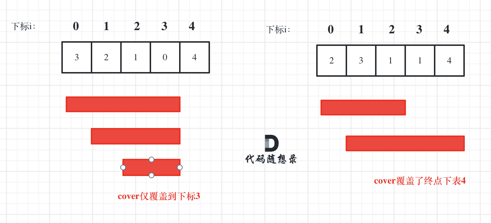

## 理论知识

### 什么是贪心

**贪心的本质是选择每一阶段的局部最优，从而达到全局最优**。

这么说有点抽象，来举一个例子：

例如，有一堆钞票，你可以拿走十张，如果想达到最大的金额，你要怎么拿？

指定每次拿最大的，最终结果就是拿走最大数额的钱。

每次拿最大的就是局部最优，最后拿走最大数额的钱就是推出全局最优。

再举一个例子如果是 有一堆盒子，你有一个背包体积为n，如何把背包尽可能装满，如果还每次选最大的盒子，就不行了。这时候就需要动态规划。动态规划的问题在下一个系列会详细讲解。


### 贪心的套路（什么时候用贪心）

很多同学做贪心的题目的时候，想不出来是贪心，想知道有没有什么套路可以一看就看出来是贪心。

**说实话贪心算法并没有固定的套路**。所以唯一的难点就是如何通过局部最优，推出整体最优。

那么如何能看出局部最优是否能推出整体最优呢？有没有什么固定策略或者套路呢？

**不好意思，也没有！** 靠自己手动模拟，如果模拟可行，就可以试一试贪心策略，如果不可行，可能需要动态规划。

有同学问了如何验证可不可以用贪心算法呢？

**最好用的策略就是举反例，如果想不到反例，那么就试一试贪心吧**。

可有有同学认为手动模拟，举例子得出的结论不靠谱，想要严格的数学证明。

一般数学证明有如下两种方法：

- 数学归纳法
- 反证法

看教课书上讲解贪心可以是一堆公式，估计大家连看都不想看，所以数学证明就不在我要讲解的范围内了，大家感兴趣可以自行查找资料。

**面试中基本不会让面试者现场证明贪心的合理性，代码写出来跑过测试用例即可，或者自己能自圆其说理由就行了**。

举一个不太恰当的例子：我要用一下1+1 = 2，但我要先证明1+1 为什么等于2。严谨是严谨了，但没必要。

虽然这个例子很极端，但可以表达这么个意思：**刷题或者面试的时候，手动模拟一下感觉可以局部最优推出整体最优，而且想不到反例，那么就试一试贪心**。

**例如刚刚举的拿钞票的例子，就是模拟一下每次拿做大的，最后就能拿到最多的钱，这还要数学证明的话，其实就不在算法面试的范围内了，可以看看专业的数学书籍！**

所以这也是为什么很多同学通过（accept）了贪心的题目，但都不知道自己用了贪心算法，**因为贪心有时候就是常识性的推导，所以会认为本应该就这么做！**

**那么刷题的时候什么时候真的需要数学推导呢？**


### 贪心一般解题步骤

贪心算法一般分为如下四步：

- 将问题分解为若干个子问题
- 找出适合的贪心策略
- 求解每一个子问题的最优解
- 将局部最优解堆叠成全局最优解

这个四步其实过于理论化了，我们平时在做贪心类的题目时，如果按照这四步去思考，真是有点“鸡肋”。

做题的时候，只要想清楚 局部最优 是什么，如果推导出全局最优，其实就够了。


### 总结

**贪心没有套路，说白了就是常识性推导加上举反例**。


## 分发饼干

https://programmercarl.com/0455.%E5%88%86%E5%8F%91%E9%A5%BC%E5%B9%B2.html

https://leetcode.cn/problems/assign-cookies/description/


### 思路

### 代码

```js
var findContentChildren = function(g, s) {
    g.sort((a, b) => a - b)
    s.sort((a, b) => a - b)

    let result = 0
    let i = g.length - 1
    let j = s.length - 1

    while (i >= 0 && j >= 0) {
        if (s[j] >= g[i]) {
            result++
            j--
        }
        i--
    }

    return result
};
```

```js
// 或者遍历孩子，来对比饼干
var findContentChildren = function(g, s) {
    g.sort((a, b) => a - b)
    s.sort((a, b) => a - b)
    let result = 0

    let index = s.length - 1

    for(let i = g.length - 1;i >= 0;i--){
        if(index >= 0 && s[index] >= g[i] ){
            result++
            index--
        }
    }

    return result
};
```


## 摆动序列

https://programmercarl.com/0376.%E6%91%86%E5%8A%A8%E5%BA%8F%E5%88%97.html

https://leetcode.cn/problems/wiggle-subsequence/description/


### 思路

**局部最优：删除单调坡度上的节点（不包括单调坡度两端的节点），那么这个坡度就可以有两个局部峰值**。

**整体最优：整个序列有最多的局部峰值，从而达到最长摆动序列**。

局部最优推出全局最优，并举不出反例，那么试试贪心！

（为方便表述，以下说的峰值都是指局部峰值）

**实际操作上，其实连删除的操作都不用做，因为题目要求的是最长摆动子序列的长度，所以只需要统计数组的峰值数量就可以了（相当于是删除单一坡度上的节点，然后统计长度）**

**这就是贪心所贪的地方，让峰值尽可能的保持峰值，然后删除单一坡度上的节点**

在计算是否有峰值的时候，大家知道遍历的下标 i ，计算 prediff（nums[i] - nums[i-1]） 和 curdiff（nums[i+1] - nums[i]），如果`prediff < 0 && curdiff > 0` 或者 `prediff > 0 && curdiff < 0` 此时就有波动就需要统计。

这是我们思考本题的一个大体思路，但本题要考虑三种情况：

1. 情况一：上下坡中有平坡
2. 情况二：数组首尾两端
3. 情况三：单调坡中有平坡


### 代码

```js
var wiggleMaxLength = function(nums) {
    if(nums.length <= 1) return nums.length
    let result = 1
    let preDiff = 0
    let curDiff = 0
    for(let i = 0; i < nums.length - 1; i++) {
        curDiff = nums[i + 1] - nums[i]
        if((curDiff > 0 && preDiff <= 0) || (curDiff < 0 && preDiff >= 0)) {
            result++
            preDiff = curDiff
        }
    }
    return result
};
```

:::info 为什么`let result = 1`，`for(let i = 0; i < nums.length - 1; i++)`

因为我们默认最后一个是有坡度的，所以result从1开始，那么遍历的时候最后一个也不用遍历了

:::


## 最大子序列和

https://programmercarl.com/0053.%E6%9C%80%E5%A4%A7%E5%AD%90%E5%BA%8F%E5%92%8C.html

https://leetcode.cn/problems/maximum-subarray/description/


### 思路

如果 -2 1 在一起，计算起点的时候，一定是从 1 开始计算，因为负数只会拉低总和，这就是贪心贪的地方！

局部最优：当前“连续和”为负数的时候立刻放弃，从下一个元素重新计算“连续和”，因为负数加上下一个元素 “连续和”只会越来越小。

全局最优：选取最大“连续和”

**局部最优的情况下，并记录最大的“连续和”，可以推出全局最优**。

从代码角度上来讲：遍历 nums，从头开始用 count 累积，如果 count 一旦加上 nums[i]变为负数，那么就应该从 nums[i+1]开始从 0 累积 count 了，因为已经变为负数的 count，只会拖累总和。

**这相当于是暴力解法中的不断调整最大子序和区间的起始位置**。

**那有同学问了，区间终止位置不用调整么？ 如何才能得到最大“连续和”呢？**

区间的终止位置，其实就是如果 count 取到最大值了，及时记录下来了。

**这样相当于是用 result 记录最大子序和区间和（变相的算是调整了终止位置）**。


### 代码

```js
var maxSubArray = function(nums) {
    let sum = nums[0]
    let result = nums[0]

    for(let i = 1;i<nums.length;i++){
        sum = Math.max(nums[i], sum + nums[i])
        result = Math.max(result, sum)
    }

    return result
};
```


## 买卖股票的最佳时机 II

https://programmercarl.com/0122.%E4%B9%B0%E5%8D%96%E8%82%A1%E7%A5%A8%E7%9A%84%E6%9C%80%E4%BD%B3%E6%97%B6%E6%9C%BAII.html

https://leetcode.cn/problems/best-time-to-buy-and-sell-stock-ii/description/


### 思路

### 代码

```js
var maxProfit = function(prices) {
    let result = 0

    for(let i = 1;i<prices.length;i++){
        result += Math.max(prices[i] - prices[i - 1], 0)
    }

    return result
};
```


## 跳跃游戏

https://leetcode.cn/problems/jump-game/

https://leetcode.cn/problems/jump-game/description/


### 思路

刚看到本题一开始可能想：当前位置元素如果是 3，我究竟是跳一步呢，还是两步呢，还是三步呢，究竟跳几步才是最优呢？

其实跳几步无所谓，关键在于可跳的覆盖范围！

不一定非要明确一次究竟跳几步，每次取最大的跳跃步数，这个就是可以跳跃的覆盖范围。

这个范围内，别管是怎么跳的，反正一定可以跳过来。

**那么这个问题就转化为跳跃覆盖范围究竟可不可以覆盖到终点！**

每次移动取最大跳跃步数（得到最大的覆盖范围），每移动一个单位，就更新最大覆盖范围。

**贪心算法局部最优解：每次取最大跳跃步数（取最大覆盖范围），整体最优解：最后得到整体最大覆盖范围，看是否能到终点**。



i 每次移动只能在 cover 的范围内移动，每移动一个元素，cover 得到该元素数值（新的覆盖范围）的补充，让 i 继续移动下去。

而 cover 每次只取 max(该元素数值补充后的范围, cover 本身范围)。

如果 cover 大于等于了终点下标，直接 return true 就可以了。


### 代码

```js
var canJump = function(nums) {
    if (nums.length === 1) return true;
    let result = nums[0]
    
    for(let i = 1;i<nums.length;i++){
        if (i > result) return false // 位置无法到达
        result = Math.max(result, nums[i] + i)
        if(result >= nums.length - 1) return true
    }

    return false
};
```

:::info 边界`if (i > result) return false`

遍历中，如果某个下标 `i` 都到不了（`i > result`），说明肯定过不去了

:::


## 跳跃游戏 II

https://programmercarl.com/0045.%E8%B7%B3%E8%B7%83%E6%B8%B8%E6%88%8FII.html

https://leetcode.cn/problems/jump-game-ii/description/


### 思路

### 代码


## K次取反后最大化的数组和

https://programmercarl.com/1005.K%E6%AC%A1%E5%8F%96%E5%8F%8D%E5%90%8E%E6%9C%80%E5%A4%A7%E5%8C%96%E7%9A%84%E6%95%B0%E7%BB%84%E5%92%8C.html

https://leetcode.cn/problems/maximize-sum-of-array-after-k-negations/description/


### 代码

### 思路

```js
// 开始的思路
var largestSumAfterKNegations = function (nums, k) {
    nums.sort((a, b) => a - b)
    let i = 0
    while (k--) {
        if (nums[i] >= 0) {
            nums[i] = -nums[i]
        } else {
            nums[i] = -nums[i]
            i++
        }
    }

    let result = 0
    for (let item of nums) {
        result += item
    }
    return result
};
```


但是这个时候忽略了如果数组全是负数呢？？

```js
// 正确的代码
var largestSumAfterKNegations = function (nums, k) {
    nums.sort((a, b) => a - b);

    let i = 0;

    // 先尽量把负数变成正数
    while (k > 0 && i < nums.length && nums[i] < 0) {
        nums[i] = -nums[i];
        i++;
        k--;
    }

    // 如果还有剩余 k 且是奇数，就反转最小值（不管正负）
    if (k % 2 === 1) {
        nums.sort((a, b) => a - b); // 找当前最小值
        nums[0] = -nums[0];
    }

    return nums.reduce((sum, num) => sum + num, 0);
};
```


## 加油站

https://programmercarl.com/0134.%E5%8A%A0%E6%B2%B9%E7%AB%99.html

https://leetcode.cn/problems/gas-station/description/


### 思路

### 代码

```js
var canCompleteCircuit = function(gas, cost) {
    let curSum = 0
    let totalSum = 0
    let start = 0

    for(let i = 0;i<gas.length;i++){
        const a = gas[i] - cost[i]
        curSum+=a
        totalSum+=a

        if(curSum < 0){
            start = i + 1
            curSum = 0
        }
    }

    if(totalSum < 0) return -1
    return start
};
```


## 分发糖果

## 柠檬水找零

https://programmercarl.com/0860.%E6%9F%A0%E6%AA%AC%E6%B0%B4%E6%89%BE%E9%9B%B6.html

https://leetcode.cn/problems/lemonade-change/description/


### 思路

### 代码

```js
var lemonadeChange = function(bills) {
    let five = 0, ten = 0;

    for (let bill of bills) {
        if (bill === 5) {
            five++;
        } else if (bill === 10) {
            if (five === 0) return false;
            five--;
            ten++;
        } else {
            if (ten > 0 && five > 0) {
                ten--;
                five--;
            } else if (five >= 3) {
                five -= 3;
            } else {
                return false;
            }
        }
    }

    return true;
};
```


## 根据身高重建队列


## 用最少数量的箭引爆气球

https://programmercarl.com/0452.%E7%94%A8%E6%9C%80%E5%B0%91%E6%95%B0%E9%87%8F%E7%9A%84%E7%AE%AD%E5%BC%95%E7%88%86%E6%B0%94%E7%90%83.html

https://leetcode.cn/problems/minimum-number-of-arrows-to-burst-balloons/description/


### 思路

如果真实的模拟射气球的过程，应该射一个，气球数组就remove一个元素，这样最直观，毕竟气球被射了。

但仔细思考一下就发现：如果把气球排序之后，从前到后遍历气球，被射过的气球仅仅跳过就行了，没有必要让气球数组remove气球，只要记录一下箭的数量就可以了。

以上为思考过程，已经确定下来使用贪心了，那么开始解题。

**为了让气球尽可能的重叠，需要对数组进行排序**。

那么按照气球起始位置排序，还是按照气球终止位置排序呢？

其实都可以！只不过对应的遍历顺序不同，我就按照气球的起始位置排序了。

既然按照起始位置排序，那么就从前向后遍历气球数组，靠左尽可能让气球重复。

从前向后遍历遇到重叠的气球了怎么办？

**如果气球重叠了，重叠气球中右边边界的最小值 之前的区间一定需要一个弓箭**。


### 代码

```js
var findMinArrowShots = function(points) {
    if(points.length === 0) return 0
    points.sort((a, b) => a[0] - b[0])

    let result = 1
    for(let i = 1;i<points.length;i++){
        // 当前的左边大于前一个的右边，一定不重叠
        if(points[i][0] > points[i-1][1]){
            result++
        }else{
            // 更新取最小右边接
            points[i][1] = Math.min(points[i - 1][1], points[i][1])
        }
    }

    return result
};
```


## 无重叠区间

https://programmercarl.com/0435.%E6%97%A0%E9%87%8D%E5%8F%A0%E5%8C%BA%E9%97%B4.html

https://leetcode.cn/problems/non-overlapping-intervals/description/


### 思路

### 代码

```js
var eraseOverlapIntervals = function(intervals) {
    if(intervals.length === 0) return 0
    intervals.sort((a, b) => a[0] - b[0])

    let result = 0
    for(let i = 1;i<intervals.length;i++){
        if(intervals[i][0] < intervals[i-1][1]){
            if(intervals[i][1] < intervals[i-1][1]){
                // 相当于剔除了前一个
            }else{
                intervals[i][1] = intervals[i-1][1]
            }
            result++
        }
    }

    return result
}
```


## 划分字母区间

https://programmercarl.com/0763.%E5%88%92%E5%88%86%E5%AD%97%E6%AF%8D%E5%8C%BA%E9%97%B4.html

https://leetcode.cn/problems/partition-labels/description/


### 思路

### 代码

```js
```


