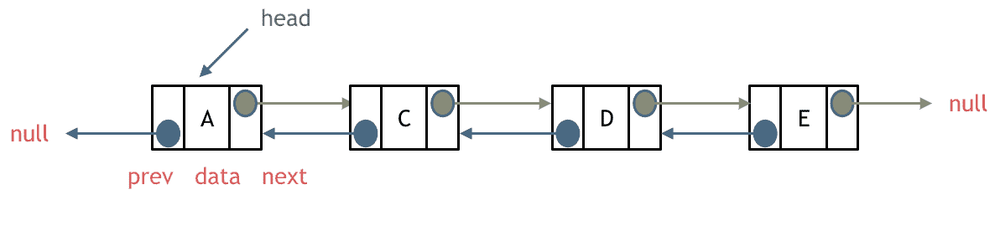
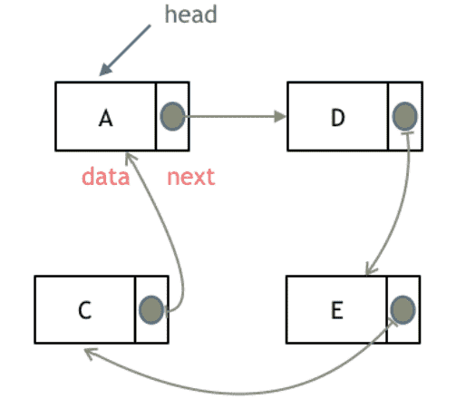
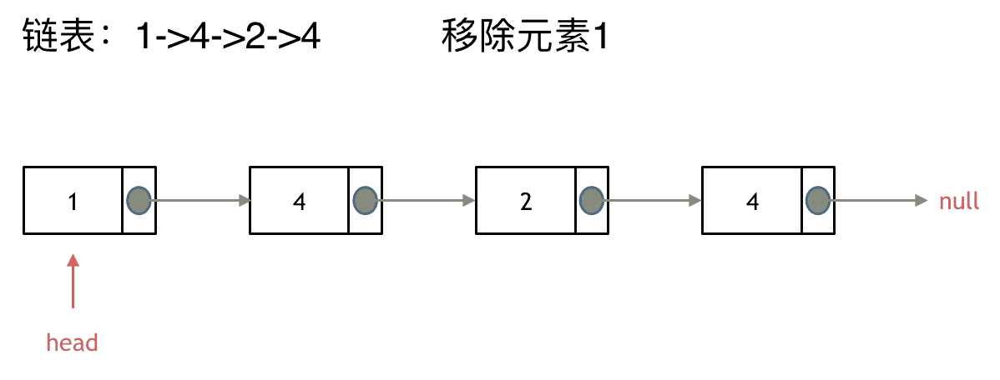
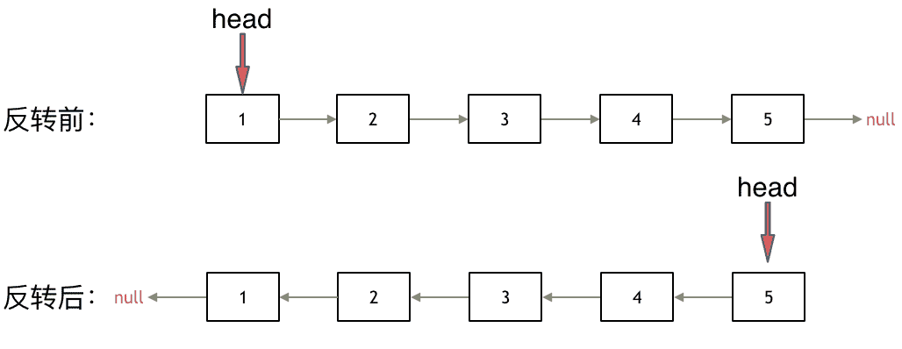

## 理论知识

### 什么是链表

什么是链表，链表是一种通过指针串联在一起的线性结构，每一个节点由两部分组成，一个是数据域一个是指针域（存放指向下一个节点的指针），最后一个节点的指针域指向null（空指针的意思）。

链表的入口节点称为链表的头结点也就是head。

如图所示：

### 链表的类型

#### 单链表

上面描述的就是单链表


#### 双链表

单链表中的指针域只能指向节点的下一个节点。

双链表：每一个节点有两个指针域，一个指向下一个节点，一个指向上一个节点。

双链表 既可以向前查询也可以向后查询。

如图所示：

#### 循环链表

循环链表，顾名思义，就是链表首尾相连。

循环链表可以用来解决约瑟夫环问题。



### 链表的存储方式

了解完链表的类型，再来说一说链表在内存中的存储方式。

数组是在内存中是连续分布的，但是链表在内存中可不是连续分布的。

链表是通过指针域的指针链接在内存中各个节点。

所以链表中的节点在内存中不是连续分布的 ，而是散乱分布在内存中的某地址上，分配机制取决于操作系统的内存管理。

如图所示：

这个链表起始节点为2， 终止节点为7， 各个节点分布在内存的不同地址空间上，通过指针串联在一起。


###  链表的定义


### 链表的操作

#### 删除节点

删除D节点，如图所示：

只要将C节点的next指针 指向E节点就可以了。


#### 添加节点

如图所示：


#### 时间复杂度

可以看出链表的增添和删除都是O(1)操作，也不会影响到其他节点。

但是要注意，要是删除第五个节点，需要从头节点查找到第四个节点通过next指针进行删除操作，查找的时间复杂度是O(n)。

数组在定义的时候，长度就是固定的，如果想改动数组的长度，就需要重新定义一个新的数组。

链表的长度可以是不固定的，并且可以动态增删， 适合数据量不固定，频繁增删，较少查询的场景。


## 移除链表元素

https://programmercarl.com/0203.%E7%A7%BB%E9%99%A4%E9%93%BE%E8%A1%A8%E5%85%83%E7%B4%A0.html

https://leetcode.cn/problems/remove-linked-list-elements/description/


### 思路

> 链表操作中，可以使用原链表来直接进行删除操作，也可以设置一个虚拟头结点再进行删除操作，接下来看一看哪种方式更方便。

这里以链表 1 4 2 4 来举例，移除元素4。

这种情况下的移除操作，就是让节点next指针直接指向下下一个节点就可以了，

那么因为单链表的特殊性，只能指向下一个节点，刚刚删除的是链表的中第二个，和第四个节点，那么如果删除的是头结点又该怎么办呢？

这里就涉及如下链表操作的两种方式：

- **直接使用原来的链表来进行删除操作。**
- **设置一个虚拟头结点在进行删除操作。**

来看第一种操作：直接使用原来的链表来进行移除。



移除头结点和移除其他节点的操作是不一样的，因为链表的其他节点都是通过前一个节点来移除当前节点，而头结点没有前一个节点。

所以头结点如何移除呢，其实只要将头结点向后移动一位就可以，这样就从链表中移除了一个头结点。


这样移除了一个头结点，是不是发现，在单链表中移除头结点 和 移除其他节点的操作方式是不一样，其实在写代码的时候也会发现，需要单独写一段逻辑来处理移除头结点的情况。

那么可不可以 以一种统一的逻辑来移除 链表的节点呢。

其实**可以设置一个虚拟头结点**，这样原链表的所有节点就都可以按照统一的方式进行移除了。

来看看如何设置一个虚拟头。依然还是在这个链表中，移除元素1。


这里来给链表添加一个虚拟头结点为新的头结点，此时要移除这个旧头结点元素1。

这样是不是就可以使用和移除链表其他节点的方式统一了呢？

来看一下，如何移除元素1 呢，还是熟悉的方式，然后从内存中删除元素1。

最后呢在题目中，return 头结点的时候，别忘了 `return dummyNode->next;`， 这才是新的头结点


### 直接移除

```js
/**
 * function ListNode(val, next) {
 *     this.val = (val===undefined ? 0 : val)
 *     this.next = (next===undefined ? null : next)
 * }
 */
/**
 * @param {ListNode} head
 * @param {number} val
 * @return {ListNode}
 */
var removeElements = function(head, val) {
    // 删除头节点
    while(head !== null && head.val === val){
        head = head.next
    }
    
    if(head === null) return head

    // 删除其他节点
    let pre = head
    let cur = head.next

    while(cur){
        if(cur.val === val){
            pre.next = cur.next
        }else{
            pre = pre.next
        }

        cur = cur.next
    }

    return head
};
```

:::info 为什么要先删除头节点在判断`head === null`

在处理 `head` 后，若 `head` 变为 `null`，则会报错

:::

:::info 为什么要这样写`let pre = head;let cur = head.next`

作用：**使用两个指针（`pre` 和 `cur`）来遍历链表并处理删除节点的操作**。

当你遍历链表时，如果你要删除某个节点 `cur`，你就需要能访问它的上一个节点 `pre`，因为：`pre.next = cur.next`

这是删除节点 `cur` 的关键语句 —— 你需要“跳过” `cur`，将前一个节点 `pre` 的 `next` 指向 `cur.next`，才能把它从链表中断开。

**所以这么写的逻辑是**：

- `pre`：当前处理节点的“前一个节点”
- `cur`：当前正在检查的节点

:::


### 虚拟头节点

这种方法就与我们的直接移除的类似，定义了pre与cur，对cur进行操作

```js
/**
 * function ListNode(val, next) {
 *     this.val = (val===undefined ? 0 : val)
 *     this.next = (next===undefined ? null : next)
 * }
 */
/**
 * @param {ListNode} head
 * @param {number} val
 * @return {ListNode}
 */
var removeElements = function(head, val) {
    // 定义虚拟头节点
    let data  = new ListNode(0, head)
    let pre = data
    let cur = pre.next

    while( cur ){
        if( cur.val === val ){
            pre.next = cur.next
        }else{
            pre = pre.next
        }
        
        cur = cur.next
    }

    return data.next

};
```


而这种方法，则是对`cur.next` 进行操作，所以只需要定义一个即可

```js
var removeElements = function(head, val) {
    // 定义虚拟头节点
    let data  = new ListNode(0, head)
    let cur = data

    while(cur.next){
        if(cur.next.val === val){
            cur.next = cur.next.next
        }else{
            cur = cur.next
        }
    }

    return data.next

};
```

:::info 为什么要创建一个值为 `0` 的节点当作虚拟头节点？

`new ListNode(0, head)`

这里的 `0` 是**随便填的一个值**，它其实**不会被用到**，你可以填任何值，比如 `null`、`-1`、`'data'` 都可以。

:::


## 设计链表

https://programmercarl.com/0707.%E8%AE%BE%E8%AE%A1%E9%93%BE%E8%A1%A8.html

https://leetcode.cn/problems/design-linked-list/description/


## 反转链表

https://programmercarl.com/0206.%E7%BF%BB%E8%BD%AC%E9%93%BE%E8%A1%A8.html

https://leetcode.cn/problems/reverse-linked-list/description/


### 思路

如果再定义一个新的链表，实现链表元素的反转，其实这是对内存空间的浪费。

其实只需要改变链表的next指针的指向，直接将链表反转 ，而不用重新定义一个新的链表，如图所示:



之前链表的头节点是元素1， 反转之后头结点就是元素5 ，这里并没有添加或者删除节点，仅仅是改变next指针的方向。

那么接下来看一看是如何反转的呢？

首先定义一个cur指针，指向头结点，再定义一个pre指针，初始化为null。

然后就要开始反转了，首先要把 cur->next 节点用tmp指针保存一下，也就是保存一下这个节点。

为什么要保存一下这个节点呢，因为接下来要改变 cur->next 的指向了，将cur->next 指向pre ，此时已经反转了第一个节点了。

接下来，就是循环走如下代码逻辑了，继续移动pre和cur指针。

最后，cur 指针已经指向了null，循环结束，链表也反转完毕了。 此时我们return pre指针就可以了，pre指针就指向了新的头结点。


### 代码

```js
var reverseList = function(head) {
    let pre = null
    let cur = head

    while(cur){
        let temp = cur.next

        cur.next = pre
        pre = cur
        cur = temp

    }

    return pre
};
```

迭代过程：

1. 保存当前节点的下一个节点：`temp = cur.next`
2. 当前节点指向前一个节点：`cur.next = pre`
3. 前一个节点移动到当前节点：`pre = cur`
4. 当前节点移动到下一个节点：`cur = temp`

循环直到 `cur == null`，说明所有节点都已反转。


:::info 为什么while结束条件是`cur`

**反转链表时的遍历逻辑**：

我们从 `head` 开始，沿着 `.next` 一个个往下走，直到遇到 `null`（即链表末尾）为止。

所以：

- 当 `cur` 是一个有效的节点对象时，继续反转；
- 当 `cur == null` 时，说明遍历完毕，停止循环；

比如链表是：`1 → 2 → 3 → null`

每次迭代后：

- 第一次：`cur = 1` → 执行循环
- 第二次：`cur = 2` → 执行循环
- 第三次：`cur = 3` → 执行循环
- 第四次：`cur = null` → 跳出循环，完成反转

:::


## 两两交换链表中的节点

https://programmercarl.com/0024.%E4%B8%A4%E4%B8%A4%E4%BA%A4%E6%8D%A2%E9%93%BE%E8%A1%A8%E4%B8%AD%E7%9A%84%E8%8A%82%E7%82%B9.html

https://leetcode.cn/problems/swap-nodes-in-pairs/description/

### 思路

建议使用虚拟头结点，这样会方便很多，要不然每次针对头结点（没有前一个指针指向头结点），还要单独处理。

接下来就是交换相邻两个元素了，**此时一定要画图，不画图，操作多个指针很容易乱，而且要操作的先后顺序**

初始时，cur指向虚拟头结点，然后进行如下三步：

操作之后，链表如下：

看这个可能就更直观一些了：


### 代码

```js
var swapPairs = function(head) {
    let data = new ListNode(0, head)
    let cur = data

    while(cur.next && cur.next.next){
        let temp1 = cur.next
        let temp2 = cur.next.next
        let temp3 = cur.next.next.next

        cur.next = temp2
        temp2.next = temp1
        temp1.next = temp3

        // 思考点
        cur = temp1
    }

    return data.next
};
```


:::info 为什么`cur`是指向`temp1`，而不是`temp2`

因为链表反转后，`temp1`是在后面的，想操作节点1和节点2，cur就需要到节点1的前一个节点，

或者改为 `cur = cur.next.next`

:::


## 删除链表的倒数第N个节点

https://programmercarl.com/0019.%E5%88%A0%E9%99%A4%E9%93%BE%E8%A1%A8%E7%9A%84%E5%80%92%E6%95%B0%E7%AC%ACN%E4%B8%AA%E8%8A%82%E7%82%B9.html

https://leetcode.cn/problems/remove-nth-node-from-end-of-list/description/


### 思路

双指针的经典应用，如果要删除倒数第n个节点，让fast移动n步，然后让fast和slow同时移动，直到fast指向链表末尾。删掉slow所指向的节点就可以了。


### 代码

```js
var removeNthFromEnd = function(head, n) {
    let data = new ListNode(0, head)

    let fast = data
    let slow = data

    while(n > 0 ){
        fast = fast.next
        n--
    }

    while(fast.next){
        fast = fast.next
        slow = slow.next
    }

    slow.next = slow.next.next

    return data.next
};
```


:::info 为什么是走`n`步为不是`n-1`步

**先让 fast 走 `n` 步（不是 `n - 1`），这样 slow 停在目标节点的前一个位置**

因为我们要让 **快慢指针之间保持 n 的距离**。

当快指针走到链表末尾时：

- 慢指针正好距离末尾 n 个节点
- 所以它正好停在“倒数第 n 个节点的前一个节点”

从而：可以轻松通过 `slow.next = slow.next.next` 删除目标节点

:::


## 链表相交

https://programmercarl.com/%E9%9D%A2%E8%AF%95%E9%A2%9802.07.%E9%93%BE%E8%A1%A8%E7%9B%B8%E4%BA%A4.html

https://leetcode.cn/problems/intersection-of-two-linked-lists/description/


### 思路

简单来说，就是求两个链表交点节点的**指针**。 这里同学们要注意，交点不是数值相等，而是指针相等。

为了方便举例，假设节点元素数值相等，则节点指针相等。

看如下两个链表，目前curA指向链表A的头结点，curB指向链表B的头结点：


我们求出两个链表的长度，并求出两个链表长度的差值，然后让curA移动到，和curB 末尾对齐的位置，如图：


此时我们就可以比较curA和curB是否相同，如果不相同，同时向后移动curA和curB，如果遇到curA == curB，则找到交点。

否则循环退出返回空指针。


### 代码

```js
var getIntersectionNode = function(headA, headB) {
    let n = 0
    let m = 0
    let curA = headA
    let curB = headB

    while(curA){
        n++
        curA = curA.next
    }

    while(curB){
        m++
        curB = curB.next
    }

    curA = headA
    curB = headB

    if(n >= m){
        while( n > m ){
            curA = curA.next
            n--
        }
    }else{
        while(n < m){
            curB = curB.next
            m--
        }
    }

    while(curA && curB){
        if(curA === curB){
            break
        }else{
            curA = curA.next
            curB = curB.next
        }
    }

    return curA

};
```

:::info 为什么用 `n > m` 而不是 `n >= m`

我们希望**两个链表剩下的节点数相同时就停止对齐**，也就是说：

- 当 `n === m` 的时候，就已经对齐了，不需要再前进了。
- 如果写成 `n >= m`，当 `n === m` 时还会再执行一次 `curA = curA.next`，那就**多走了一步，错过了交点！**

:::


## 环形链表II


