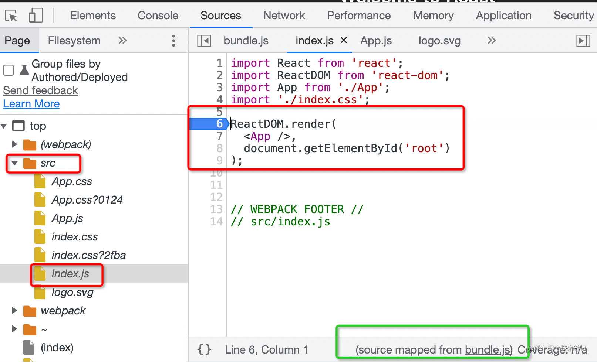
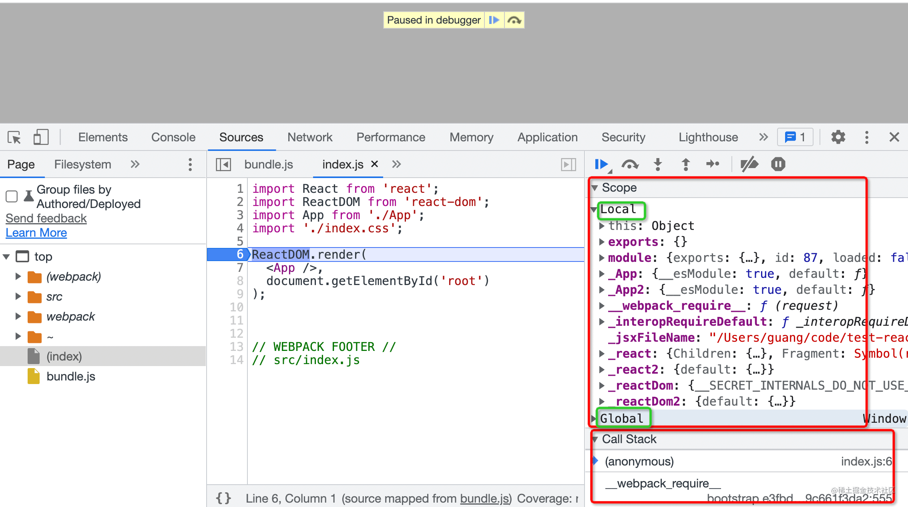
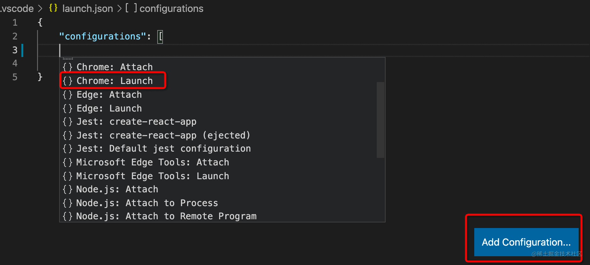
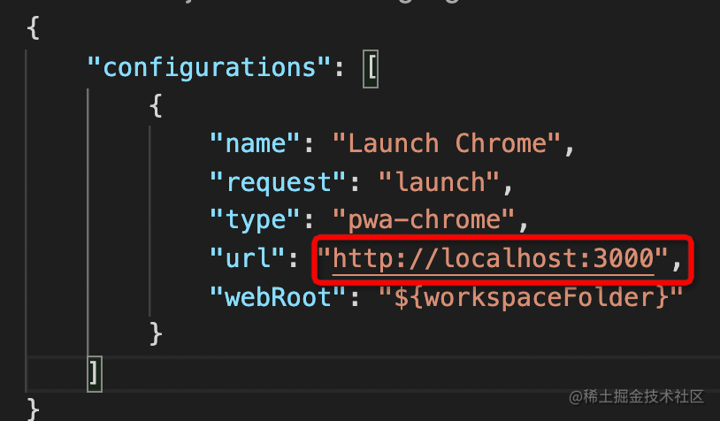
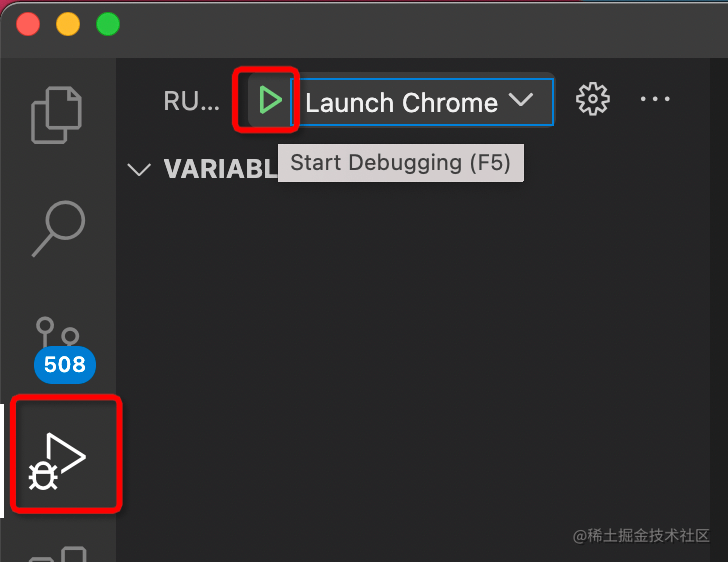
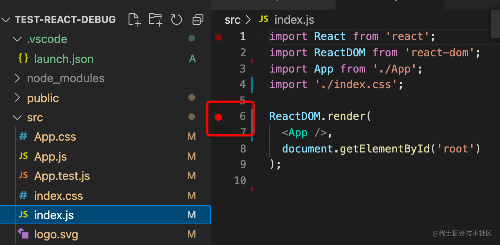
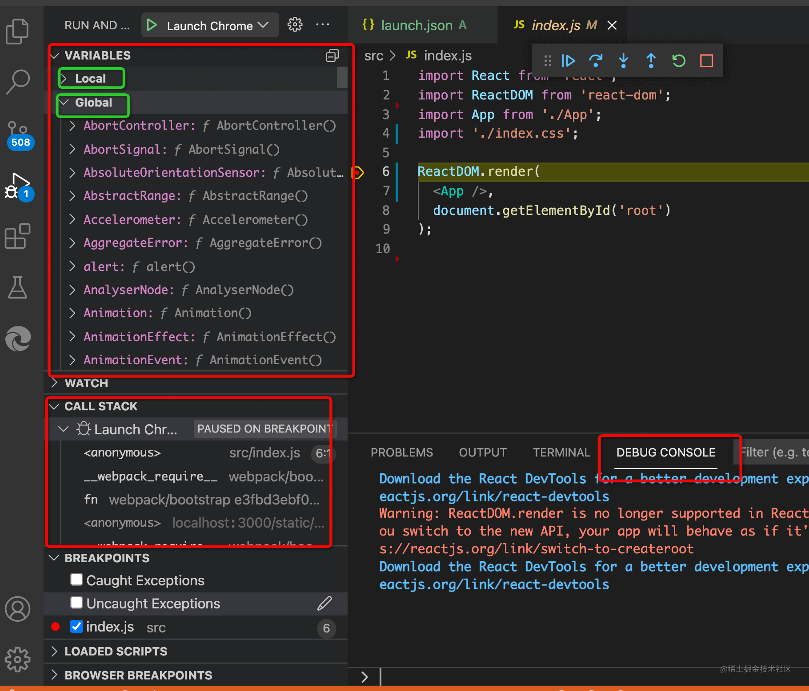
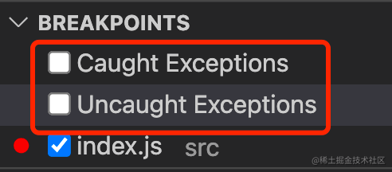
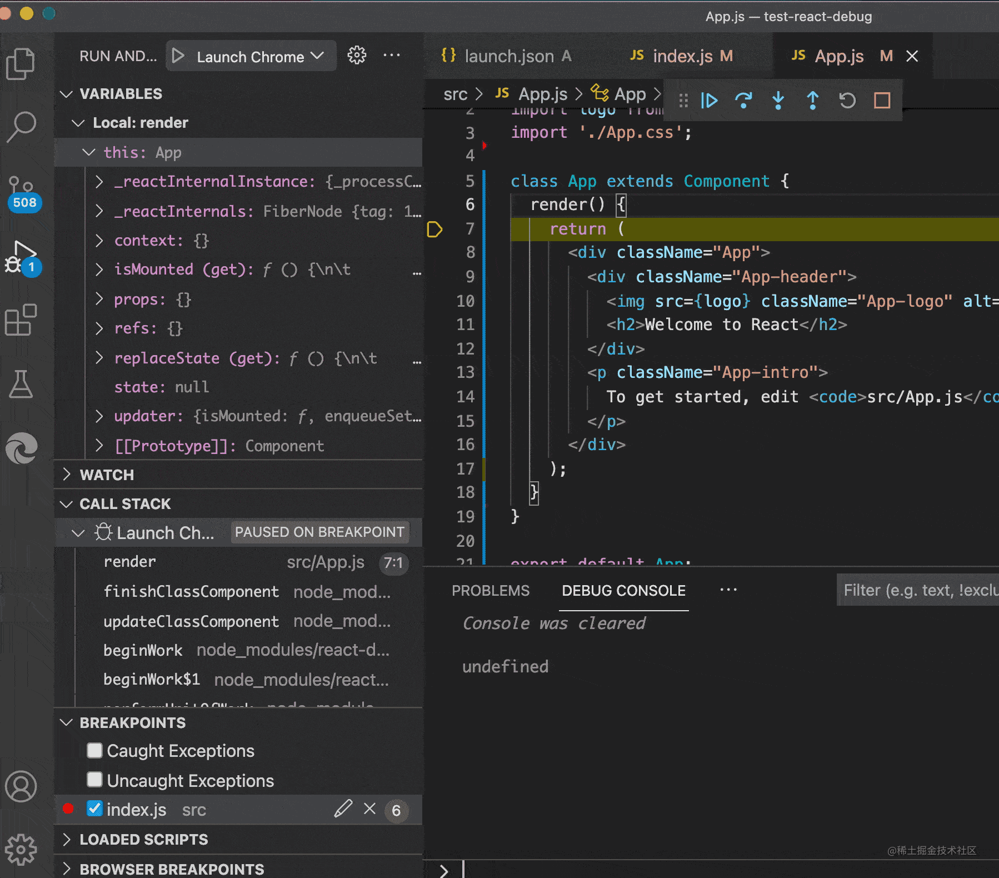

## 网页调试

上节我们知道了什么是调试、调试的原理，这节我们开始学习调试工具的使用。

首先从网页的 JS 调试开始。

启动一个React项目，打开 Chrome DevTools，在 Sources 面板找到 src/index.js，打上个断点：

然后刷新就可以开始调试了：

代码会在断点处断住，右边会显示当前 local 作用域的变量，global 作用域的变量，还有调用栈 call stack。

上面有几个控制执行的按钮，分别是：

 恢复执行

 单步执行

 进入函数调用

 跳出函数调用

 让断点失效

 在异常处断住

**可以控制代码的执行，可以看到每一步的调用栈和作用域的变量，那理清代码的逻辑，或者排查代码中的问题不就很容易了么？**

其实调试网页的 JS，除了 Chrome DevTools 外，还有一种更好用的调试方式： VSCode Debugger。

## VSCode调试

用 VSCode 打开项目目录，创建 .vscode/launch.json 文件：

点击右下角的 Add Configuration... 按钮，选择 Chrome: Launch（启动）

把访问的 url 改为开发服务器启动的地址：

然后进入 Debug 窗口，点击启动：

你会发现它启动了浏览器，并打开了这个 url。

VSCode 里还会有一排控制执行的按钮：

在代码打个断点，然后点击 
 刷新：

代码会执行到断点处断住，本地和全局作用域的变量，调用栈等都会展示在左边：

上面的控制按钮分别对应恢复执行、单步执行、进入函数调用、跳出函数调用，这个和 Chrome DevTools 一样：

还多了刷新和停止的按钮。

异常断点的按钮被移到了这里：

可以在被 catch 的异常处断住，也可以在没有被 catch 的异常处断住。

看起来和 Chrome DevTools 里调试差不多呀，在 VSCode Debugger 里调试有啥好处么？

好处是不用切换工具呀，之前是调试在 Chrome DevTools，写代码在 VSCode，而现在写代码和调试都可以在 VSCode 里，可以边调试边写代码。

比如我想访问 this 的某个属性，可以在 Debug Console 里输入 this 看下它的值，然后再来写代码：

如果你用了 TypeScript 可能会有属性名的提示、属性值类型的提示，但并不知道属性的值是啥。

而边调试边写代码，能直接知道属性值是什么，有哪些函数可以调用。

**边调试边写代码是我推荐的写代码方式。**

## 思考

知道了怎么用，我们再来思考下：为什么 Chrome DevTools 和 VSCode Debugger 都可以调试网页呢？

这是因为调试协议是一样的，都是 CDP。Chrome DevTools 可以对接 CDP 来调试网页，VSCode Debugger 也可以。只不过 VSCode Debugger 会多一层 Debug Adapter Protocol 的转换。

这也是为什么两个调试工具的功能大同小异。

## 总结

Chrome DevTools 和 VSCode Debugger 都能调试网页的 JS，可以打断点，单步执行，可以看到本地和全局作用域的变量，还有函数调用栈。

但我更推荐使用 VSCode Debugger 来调试，这样写代码和调试都用同一个工具，不用切换，而且还可以边调试边写代码。

这俩原理都是对接了 Chrome DevTools Protocol，用自己的 UI 来做展示和交互。

如果你还没用过 VSCode Debugger，不妨就从今天开始用起来吧。