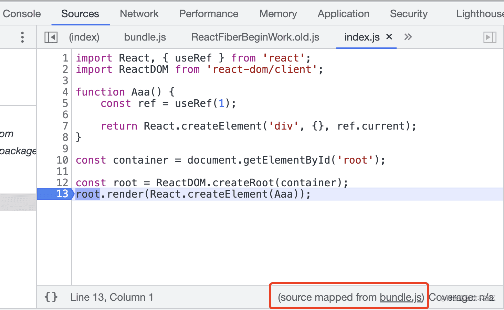
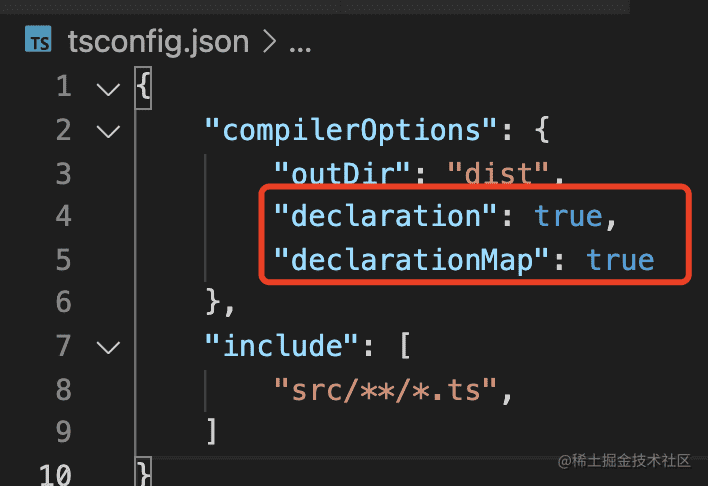
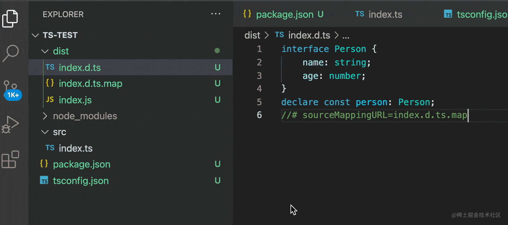
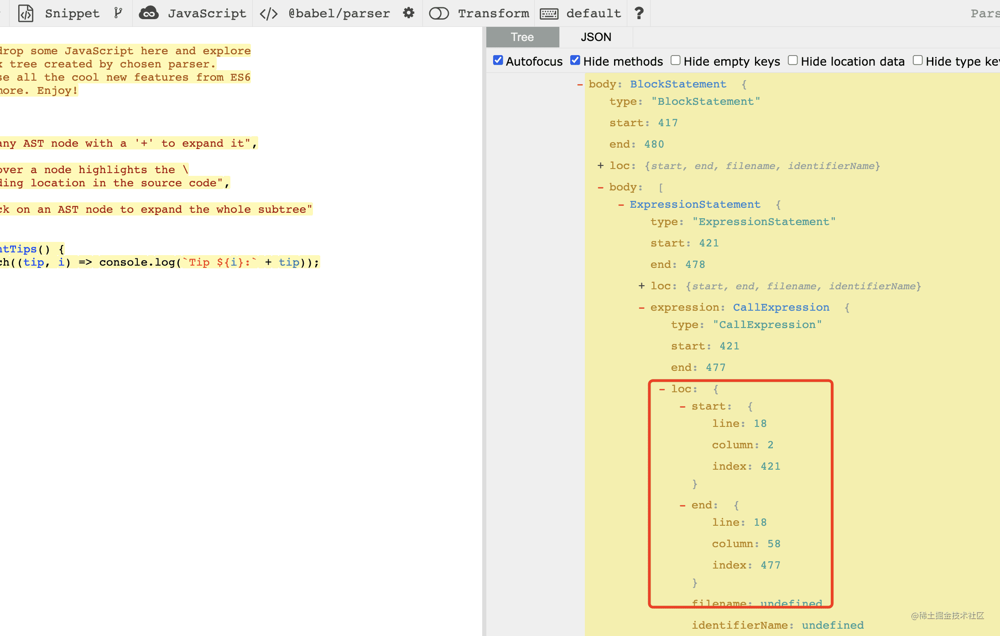
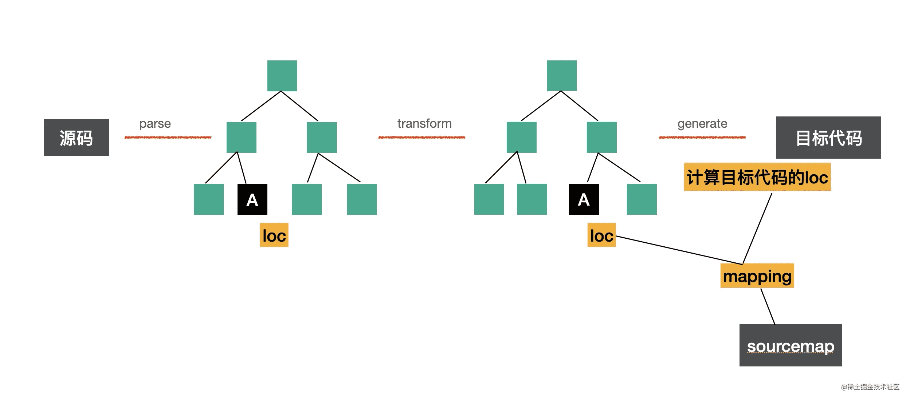
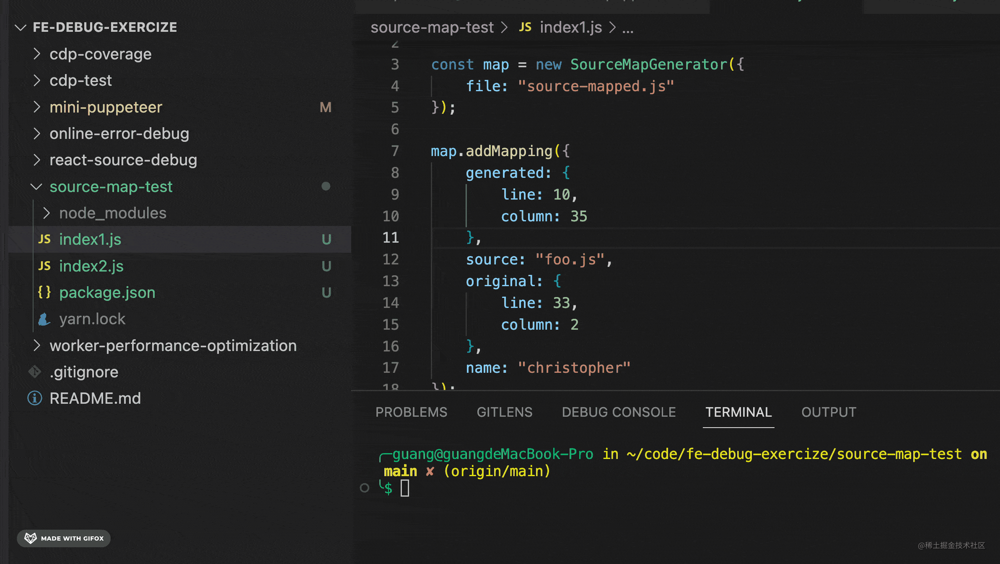
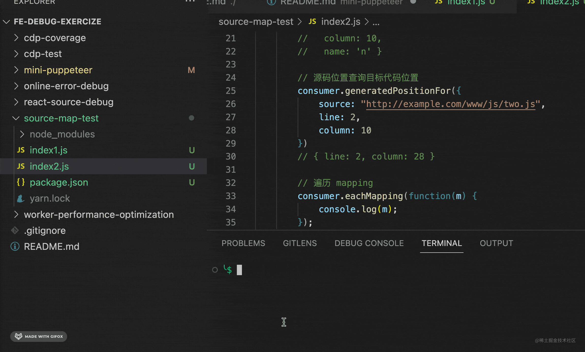

学习调试，sourcemap 是绕不开的概念，有了它才能直接调试源码。

这一节，我们就来探究下 sourcemap：


## 什么是 sourcemap

**sourcemap 是关联编译后的代码和源码的，通过一个个行列号的映射。**

比如编译后代码的第 3 行第 4 列，对应着源码里的第 8 行第 5 列这种，这叫做一个 mapping。

sourcemap 的格式如下：

```javascript
{
　　　　version : 3,
　　　　file: "out.js",
　　　　sourceRoot : "",
　　　　sources: ["foo.js", "bar.js"],
　　　　names: ["a", "b"],
　　　　mappings: "AAgBC,SAAQ,CAAEA;AAAEA",
      sourcesContent: ['const a = 1; console.log(a)', 'const b = 2; console.log(b)']
}
```

- version：sourcemap 的版本，一般为 3
- file：编译后的文件名
- sourceRoot：源码根目录
- names：转换前的变量名
- sources：源码文件名
- sourcesContent：每个 sources 对应的源码的内容
- mappings：一个个位置映射

为什么 sources 可以有多个呢？

因为可能编译产物是多个源文件合并的，比如打包，一个 bundle.js 就对应了 n 个 sources 源文件。

重点是 mappings 部分：

mappings 部分是通过分号`;` 和逗号 `,` 分隔的：

```
mappings:"AAAAA,BBBBB;CCCCC"
```

一个分号就代表一行，这样就免去了行的映射。

然后每一行可能有多个位置的映射，用 `,` 分隔。

那具体的每一个 mapping 都是啥呢？

比如 AAAAA 一共五位，分别有不同的含义：

- 转换后代码的第几列（行数通过分号 ; 来确定）
- 转换前的哪个源码文件，保存在 sources 里的，这里通过下标索引
- 转换前的源码的第几行
- 转换前的源码的第几列
- 转换前的源码的哪个变量名，保存在 names 里的，这里通过下标索引

然后经过编码之后，就成了 AAAAA 这种，这种编码方式叫做 VLQ 编码。

sourcemap 的格式还是很容易理解的，就是一一映射编译后代码的位置和源码的位置。

各种调试工具一般都支持 sourcemap 的解析，只要在文件末尾加上这样一行：

```javascript
//@ sourceMappingURL=/path/to/source.js.map
```

运行时就会关联到源码：



除了调试的时候会使用 sourcemap，线上报错定位源码也需要用到：

开发时会使用 sourcemap 来调试，但是生产可不会，但是线上报错的时候确实也需要定位到源码，这种情况一般都是单独上传 sourcemap 到错误收集平台。

比如 sentry 就提供了一个 [@sentry/webpack-plugin](https://www.npmjs.com/package/@sentry/webpack-plugin) 支持在打包完成后把 sourcemap 自动上传到 sentry 后台，然后把本地 sourcemap 删掉。还提供了 [@sentry/cli](https://www.npmjs.com/package/@sentry/cli) 让用户可以手动上传。

平时我们至少在这两个场景（**开发时调试源码，生产时定位错误的源码位置**）下会用到 sourcemap。

sourcemap 只是位置的映射，可以用在任何代码上，比如 JS、TS、CSS 等，而且 TS 的类型也支持 sourcemap：



指定了 declaration 会生成 d.ts 的声明文件，还可以指定 declarationMap 来生成 sourcemap：



这样在 VSCode 里我们就可以直接点击某个类型来跳转到源码里对应的地方了。

这也算 sourcemap 应用的另一个场景，用于**生成的类型和源码中定义的关联**。

知道了什么是 sourcemap，那 sourcemap 是怎么生成的呢？


## sourcemap 的生成

编译工具在生成代码的时候也会生成 sourcemap：


其实 sourcemap 就是由一个个位置的映射组成的，关键就是要知道源码的哪个位置对应到了编译后代码的哪个位置：

通过 [astexplorer.net](https://astexplorer.net/#/gist/19042bfa06784d0e1b2dcb2ecd3559d5/50898c658d8129dbe520cc515af169331082036b) 可以看到，AST 中保留了源码中的位置，这是 parser 在 parse 源码的时候记录的。



然后进行 AST 的各种转换之后会打印成目标代码，打印的时候是一行行一列列的拼接字符串，这时候就有了目标代码中的位置。


这两个位置一关联，那不就是一个 mapping 么？



这样就生成了 sourcemap。

当然 sourcemap 有对应的格式和编码，自己生成还是挺麻烦的，我们会用 [source-map](https://www.npmjs.com/package/source-map) 这个包：

[source-map](https://www.npmjs.com/package/source-map) 可以用于生成和解析 sourcemap，它暴露了 SourceMapConsumer、SourceMapGenerator、SourceNode 3个类，分别用于消费 sourcemap、生成 sourcemap、创建源码节点。

生成 sourcemap 的流程是：

1.  创建一个 SourceMapGenerator 对象
1.  通过 addMapping 方法添加一个映射
1.  通过 toString 转为 sourcemap 字符串

```javascript
const { SourceMapGenerator } = require('source-map');

const map = new SourceMapGenerator({
    file: "source-mapped.js"
});
  
map.addMapping({
    generated: {
        line: 10,
        column: 35
    },
    source: "foo.js",
    original: {
        line: 33,
        column: 2
    },
    name: "christopher"
});
  
console.log(map.toString());
```



消费 sourcemap 用 SourceMapConsumer 的 api。

可以调用 originalPositionFor 和 generatedPositionFor 分别用目标代码位置查源码位置和用源码位置查目标代码位置

还可以通过 eachMapping 遍历所有 mapping，对每个进行处理。

```javascript
const { SourceMapConsumer } = require('source-map');

const rawSourceMap = {
    version: 3,
    file: "min.js",
    names: ["bar", "baz", "n"],
    sources: ["one.js", "two.js"],
    sourceRoot: "http://example.com/www/js/",
    mappings: "CAAC,IAAI,IAAM,SAAUA,GAClB,OAAOC,IAAID;CCDb,IAAI,IAAM,SAAUE,GAClB,OAAOA"
};

(async function() {
    await SourceMapConsumer.with(rawSourceMap, null, consumer => {
        // 目标代码位置查询源码位置
        consumer.originalPositionFor({
            line: 2,
            column: 28
        })
        // { source: 'http://example.com/www/js/two.js',
        //   line: 2,
        //   column: 10,
        //   name: 'n' }
    
        // 源码位置查询目标代码位置
        consumer.generatedPositionFor({
            source: "http://example.com/www/js/two.js",
            line: 2,
            column: 10
        })
        // { line: 2, column: 28 }
    
        // 遍历 mapping
        consumer.eachMapping(function(m) {
            console.log(m);
        });    
    });
})();
```



这些 api 还是很容易理解的。

知道了位置从哪里来，知道了怎么用 source-map 的包生成 sourcemap，那就知道了平时我们用的 sourcemap 是怎么来的了。

我们用到的 webpack、babel 等等工具的 sourcemap 的生成和消费都是用的 source-map 这个包，大家也可以把[小册仓库的代码](https://github.com/QuarkGluonPlasma/fe-debug-exercize)下下来跑跑试试。

更详细的介绍可以看 source-map 这个包的[文档](https://www.npmjs.com/package/source-map#consuming-a-source-map)。


## 总结

这节我们学习了 sourcemap，它是通过一个个行列号的映射来关联编译后的代码和源码的。

- 调试的时候会使用 sourcemap，这样可以直接在源码打断点调试。

- 线上报错的时候会使用 sourcemap 来映射到源码，我们会把 sourcemap 单独上传 sentry 等错误收集平台。

- 生成的类型也可以通过 sourcemap 关联到对应的源码中的定义

sourcemap 是挺常见的，并且用途也很多。

它的生成可以通过 source-map 包的 api，而 mapping 的位置来源可能是源码 parse 后的 AST 中的位置信息和打印代码时计算出的位置信息的关联。

理解了 sourcemap 的作用，就知道为什么调试离不开 sourcemap 了。

