上节我们学习了什么是 sourcemap，这还不够，webpack 对 sourcemap 做了很多封装。

想彻底掌握 sourcemap，还要搞懂 webpack 的 sourcemap 配置。

webpack 的 sourcemap 配置是比较麻烦的，比如这两个配置的区别：

- eval-nosources-cheap-module-source-map
- hidden-source-map

是不是分不清楚？

其实它是有规律的。

你把配置写错的时候，webpack 会提示你一个正则：

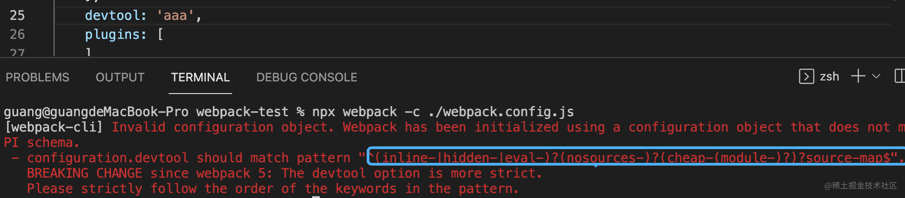

`^(inline-|hidden-|eval-)?(nosources-)?(cheap-(module-)?)?source-map$`

这个就是配置的规律，是几种基础配置的组合。

搞懂了每一种基础配置，比如 eval、nosources、cheap、module，按照规律组合起来，也就搞懂了整体的配置。

那这每一种配置都是什么意思呢？

我们分别来看一下。

(可以用[后面一节的项目代码](https://github.com/QuarkGluonPlasma/fe-debug-exercize/tree/main/react-source-debug)来测试)

## eval

eval 的 api 是动态执行 JS 代码的。比如：

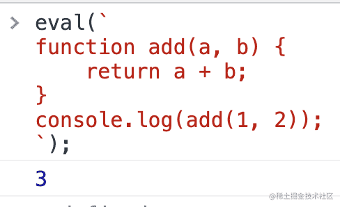

但有个问题，eval 的代码打不了断点。

怎么解决这个问题呢？

浏览器支持了这样一种特性，只要在 eval 代码的最后加上 //# sourceURL=xxx，那就会以 xxx 为名字把这段代码加到 sources 里。那不就可以打断点了么？

比如这样：

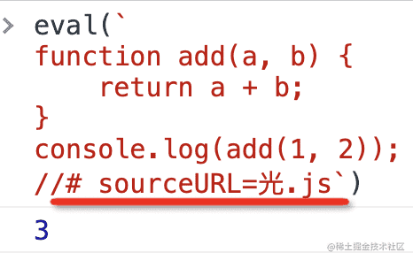

执行以后，你会发现 sources 多了`光.js`的文件：

它是可以打断点的，比如在 add 里打个断点，然后再执行 eval。

你会发现它断住了！

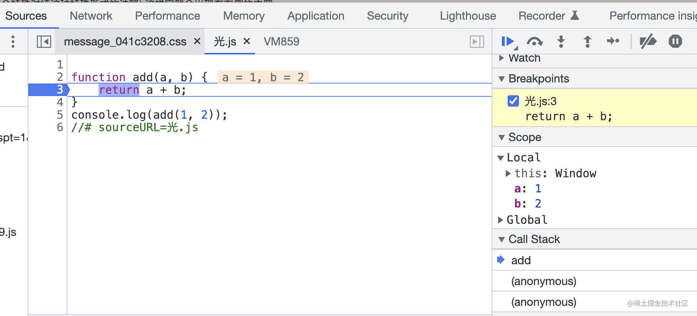

除了指定 source 文件外，还可以进一步指定 sourcemap 来映射到源码：

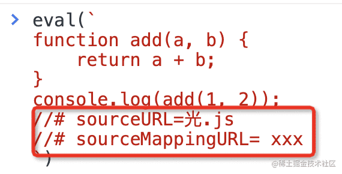

这样，动态 eval 的代码也能关联到源码，并且能打断点了！

webpack 就利用了 eval 这个特性来优化的 sourcemap 生成的性能，比如你可以指定 devtool 为 eval：

生成的代码就是每个模块都被 eval 包裹的，并且有 sourceUrl 来指定文件名：

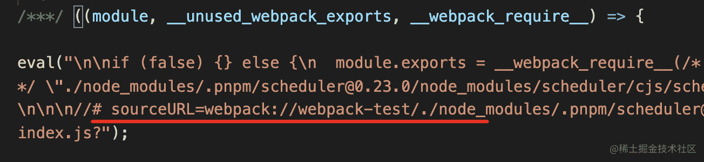

这样有啥好处呢？

快呀，因为只要指定个文件名就行，不用生成 sourcemap。sourcemap 的生成还是很慢的，要一个个 mapping 的处理，做编码之类的。

每个模块的代码都被 eval 包裹，那么执行的时候就会在 sources 里生成对应的文件，这样就可以打断点了：

不过这样只是把每个模块的代码分了出去，并没有做源码的关联，如果相关联源码，可以再开启 sourcemap：

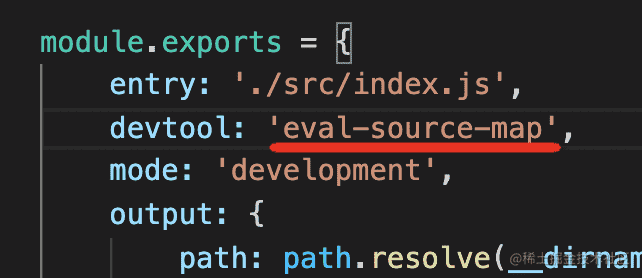

你会发现生成的代码也是用 eval 包裹的，但除了 sourceUrl 外，还有 sourceMappingUrl：

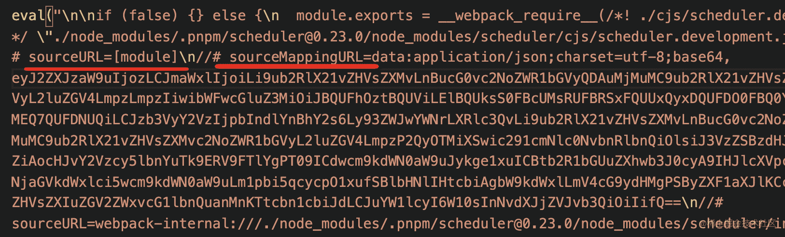

再运行的时候除了 eval 的代码会生成文件放在 sources 外，还会做 sourcemap 的映射：

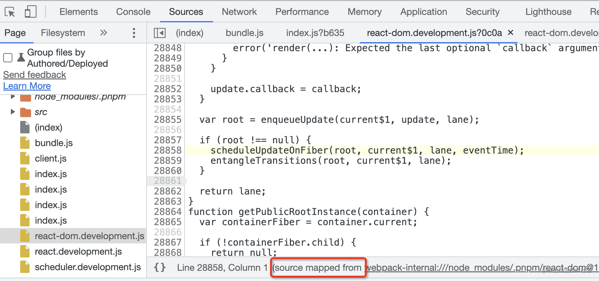

webpack 的 sourcemap 的配置就利用了浏览器对 eval 代码的调试支持。

所以为什么这个配置项不叫 sourcemap 而叫 devtool 呢？

因为不只是 sourcemap 呀，eval 的方式也行。

再来看下一个基础配置：

## source-map

source-map 的配置是生成独立的 sourcemap 文件：

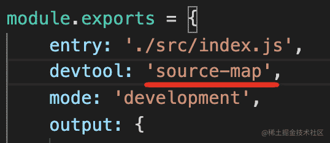

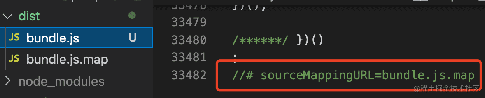

可以关联，也可以不关联，比如加上 hidden，就是生成 sourcemap 但是不关联：

生产环境就不需要关联 sourcemap，但是可能要生成 sourcemap 文件，把它上传到错误管理平台之类的，用来映射线上代码报错位置到对应的源码。

此外，还可以配置成 inline 的：

这个就是通过 dataUrl 的方式内联在打包后的文件里：

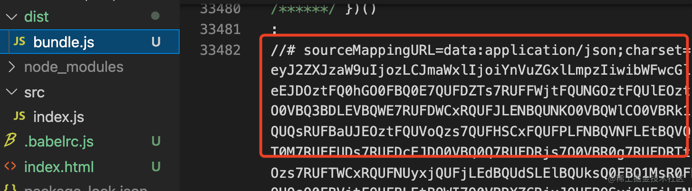

这几个配置还是很好懂的，我们来看下一个基础配置：

## cheap

sourcemap 慢主要是处理映射比较慢，很多情况下我们不需要映射到源码的行和列，只要精确到行就行，这时候就可以用 cheap。

不精确到列能提升 souremap 生成速度，但是会牺牲一些精准度：

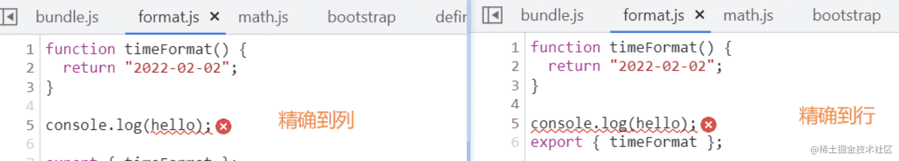

我们再来看下一个基础配置：

## module

webpack 中对一个模块会进行多次处理，比如经过 loader A 做一次转换，再用 loader B 做一次转换，之后打包到一起。

每次转换都会生成 sourcemap，那也就是有多个 sourcemap：

默认 sourcemap 只是能从 bundle 关联到模块的代码，也就是只关联了最后那个 sourcemap。

那如果你想调试最初的源码怎么办呢？

那就把每一次的 loader 的 sourcemap 也关联起来，这就是 module 配置的作用。这样就能一次性映射回最初的源码：

当你想调试最初的源码的时候，module 的配置就很有用了。

接下来还有最后一个基础配置：

## nosources

sourcemap 里是有 sourceContent 部分的，也就是直接把源码贴在这里，这样的好处是根据文件路径查不到文件也可以映射，但这样会增加 sourcemap 的体积。

如果你确定根据文件路径能查找到源文件，那不生成 sourceContent 也行。

比如 devtool 配置为 source-map，生成的 sourcemap 是这样的：

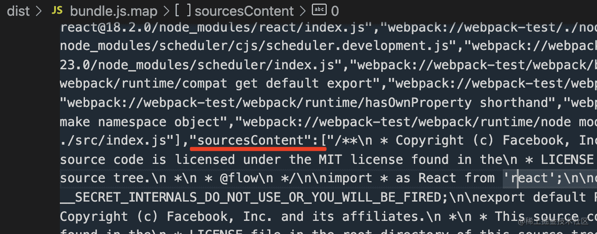

当你加上 nosources 之后，生成的 sourcemap 就没有 sourceContent 部分了：

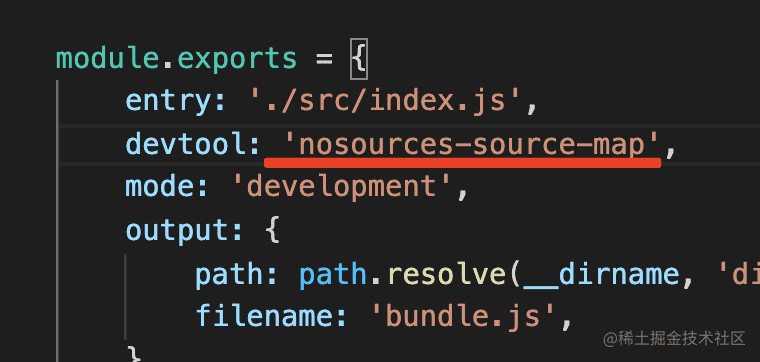

sourcemap 文件大小会小很多。

基础配置讲完了，接下来就是各种组合了，这个就比较简单了，就算组合错了，webpack 也会提示你应该按照什么顺序来组合。

它是按照这个正则来校验的：^(inline-|hidden-|eval-)?(nosources-)?(cheap-(module-)?)?source-map$

不知道有没有同学会觉得这样写比较麻烦，能不能每个基础配置用 true、false 的方式配置呢？

确实可以，有这样一个插件： SourceMapDevToolPlugin

它有很多 option，比如 module、columns、noSources 等：

相当于是 devtool 的另一种配置方式，启用它需要把 devtool 设置为 false。

而且它可以控制更多东西，比如修改 sourcemap 的 url 和文件名等：

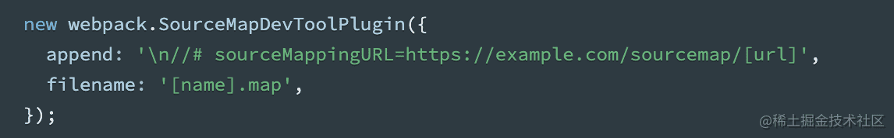

当你需要做更多的 sourcemap 生成方式的控制的时候，可以使用这个 webpack 插件。

## 总结

想要彻底搞懂 sourcemap，还需要掌握 webpack 的 sourcemap 配置。

webpack 的 sourcemap 配置比较麻烦，但也是有规律的。

它是对一些基础配置按照一定顺序的组合，理解了每个基础配置，知道了怎么组合就理解了各种 devtool 配置。

- **eval**：浏览器 devtool 支持通过 sourceUrl 来把 eval 的内容单独生成文件，还可以进一步通过 sourceMappingUrl 来映射回源码，webpack 利用这个特性来简化了 sourcemap 的处理，可以直接从模块开始映射，不用从 bundle 级别。
- **cheap**：只映射到源代码的某一行，不精确到列，可以提升 sourcemap 生成速度
- **source-map**：生成 sourcemap 文件，可以配置 inline，会以 dataURL 的方式内联，可以配置 hidden，只生成 sourcemap，不和生成的文件关联
- **nosources**：不生成 sourceContent 内容，可以减小 sourcemap 文件的大小
- **module**： sourcemap 生成时会关联每一步 loader 生成的 sourcemap，可以映射回最初的源码

理解了这些基础配置项，根据 ^(inline-|hidden-|eval-)?(nosources-)?(cheap-(module-)?)?source-map$ 的规律来进行组合，就可以实现各种需求下的 sourcemap 配置。

当然，这种 sourcemap 配置还不够细致，比如 sourcemap 的 url 怎么生成，文件名是什么。如果想对这些做配置，可以关掉 devtool，启用 SourceMapDevToolPlugin 来配置。

虽然 webapck 的 sourcemap 配置方式比较多，但最底层也就是浏览器支持的文件级别的 sourcemap 还有 eval 代码的 source 映射和 sourcemap 这两种机制。其余的方式都是基于这两种机制的封装。

理解了 webpack 封装出的基础配置，知道了组合规则，就可以应对各种需求的 sourcemap 配置。