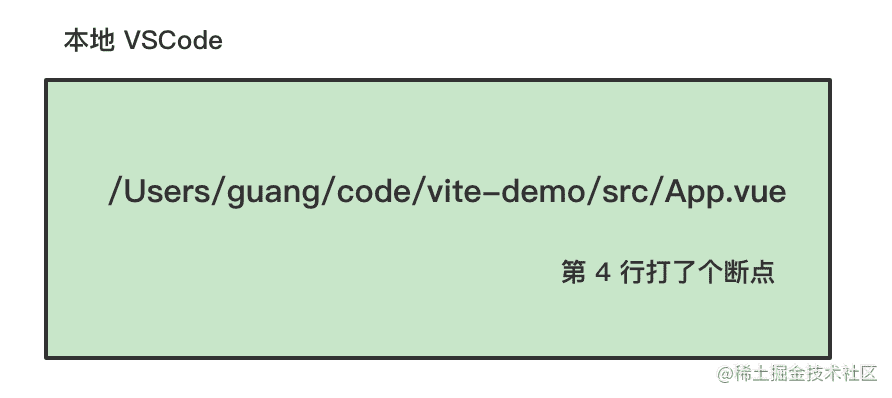
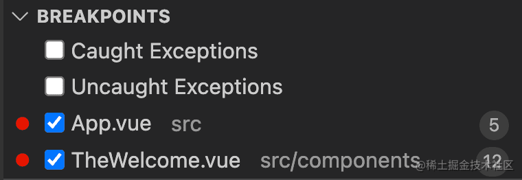
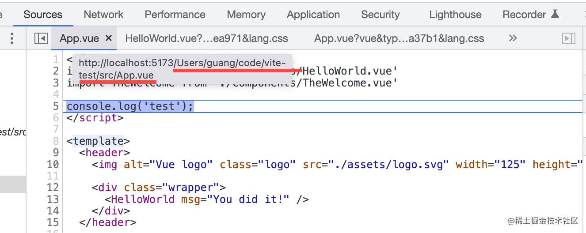
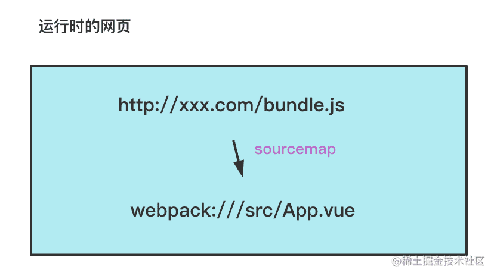
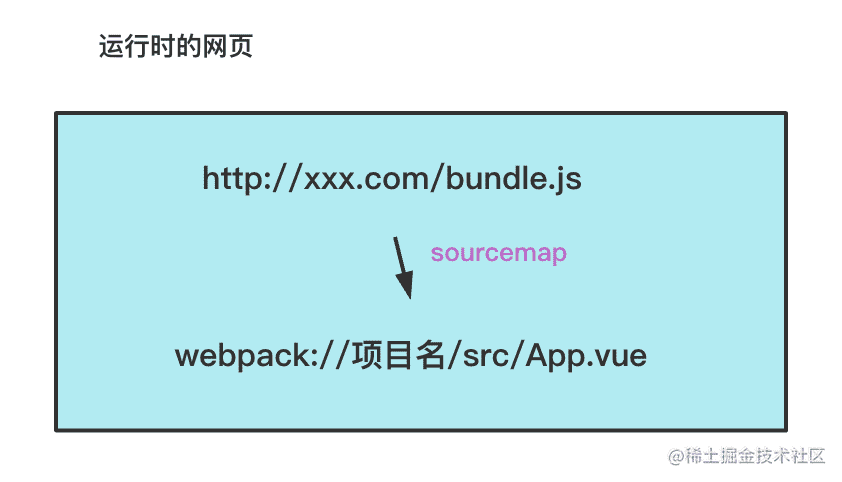
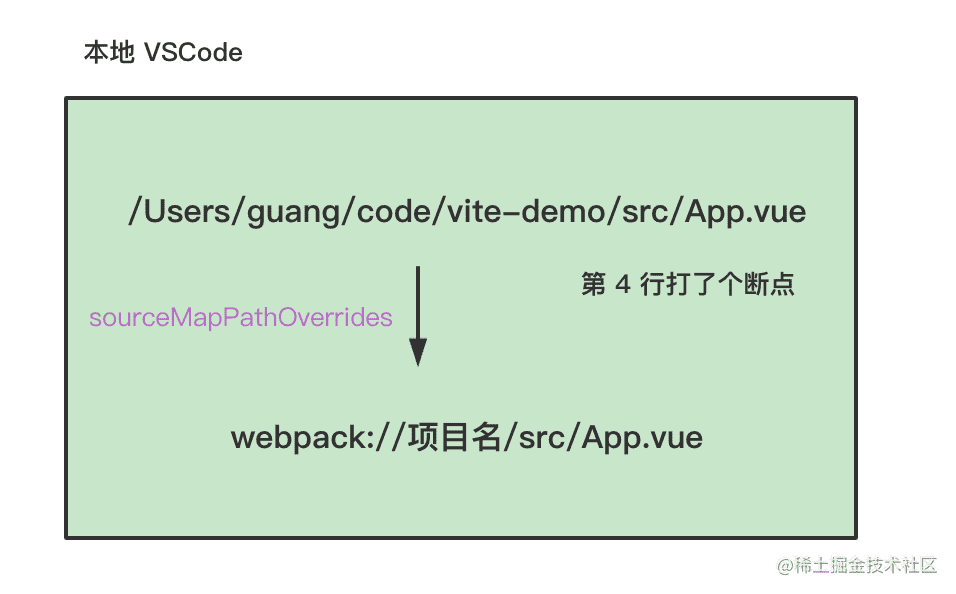
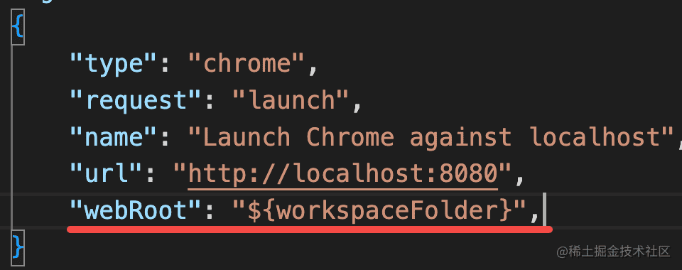
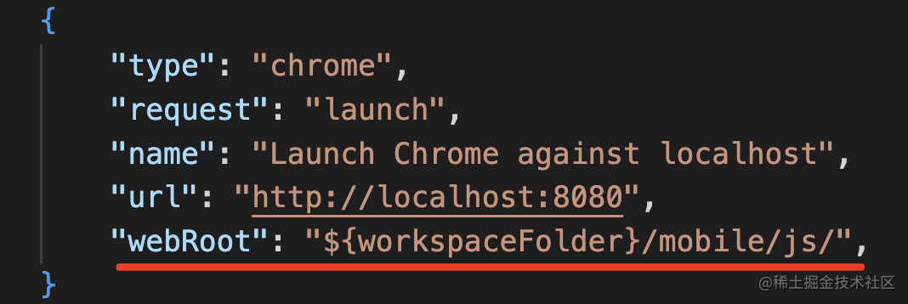
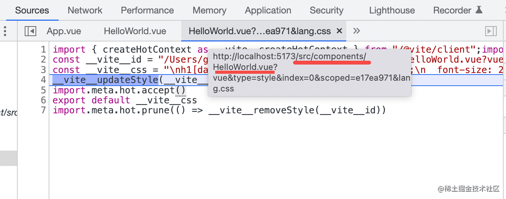

前面几节讲了用 VSCode Debugger 调试 Vue 和 React 项目，但同学们经常会遇到一些断点相关的问题，比如：

- 在文件里打的断点是灰的，一直不生效
- 断点断在了奇怪的文件和位置

不知道什么原因导致的，该怎么解决。

这是因为不清楚 VSCode Debugger 里打的断点是怎么在网页里生效的。

这节就来讲下这个：

## 断点映射的原理

我们在 VSCode 里打的断点是这样的：

VSCode 会记录你在哪个文件哪行打了个断点。

在 breakpoints 这里可以看到：

代码经过编译打包之后，可能会产生一个 bundle.js，网页里运行的是这个 js 文件：

我们打的断点最终还是在代码的运行时，也就是网页里断住的，所以在 VSCode 里打的断点会被传递给浏览器，通过 CDP 调试协议。

但是问题来了，我们本地打的断点是一个绝对路径，也就是包含 \${workspaceFolder} 的路径，而网页里根本没有这个路径，那怎么断住的呢？

这是因为有的文件是关联了 sourcemap 的，也就是文件末尾的这行注释：

它会把文件路径映射到源码路径。

如果映射到的源码路径直接就是本地的文件路径，那不就对上了么，那断点就生效了：

vite 的项目，sourcemap 都是这种绝对路径，所以断点直接就生效了。

但是 webpack 的项目，sourcemap 到的路径不是绝对路径，而是这种：

或者这种：

那怎么办呢？本地打的断点都是绝对路径，而 sourcemap 到的路径不是绝对路径，根本打不上呀！

所以 VSCode Chrome Debugger 支持了 sourceMapPathOverrides 的配置：

这是默认生成的三个配置，最后一个就是映射 webpack 路径的，其实是把以 \${workspaceFolder} 开头的本地路径映射成了 webpack:// 开头的路径传给浏览器。

这样就和浏览器里的 sourcemap 后的文件路径对上了，那断点也就生效了。

这就是为什么调试 webpack 项目的时候要配置 sourceMapPathOverrides。

具体怎么配，你可以加个 debugger 看看 Chrome DevTools 里是啥路径，然后映射到本地的路径就行。

React 和 Vue3 项目不用单独配置这个，用默认的那个配置就行。

Vue2 项目需要配一下这样的配置：

或者这样的配置：

都是为了让打断点的文件路径和 sourcemap 之后的文件路径对上。

但上面都是把项目根目录（workspaceFolder） 映射到 url 的 / 的，有的时候映射的不是 /，会出现这种情况：

这就需要 webRoot 的配置了，默认是 workspaceFolder：

也就是把项目根目录映射到 url 的 /。

如果出现这种情况，说明要把 /mobile/js/ 这个路径映射到项目根目录：

所以要配置下 webRoot

综上，**如果 sourcemap 到的文件路径不是本地路径，那就映射不到本地文件，导致断点打不上，这时候可以配置下 sourceMapPathOverrides。如果映射之后路径开头多了几层目录，那就要配置下 webRoot。**

那上节讲 vite + vue 项目的调试的时候，我们配置了 webRoot 为 \${workspaceFolder}/aaa，aaa 可以是任意一个本地不存在的目录，这是为什么呢？

因为 Vite 项目有一些热更的文件，这些临时文件没有对应的本地文件，但路径刚好是 VSCode Debugger 传递过去的打断点的文件路径，就断住了，所以你就会发现断点断在了奇怪的文件：

为了避免这种情况，我们配置了 webRoot，那实际上传过去的断点信息就是 /aaa/src/App.vue。

这样热更的文件和这个路径就不一样了，也就不会断住。

而有 sourcemap 的文件，因为 sourcemap 到的是绝对路径，不受 webRoot 的影响，依然能映射到本地，所以那些断点能生效。

这就是为什么调试 vite 项目要配置下 webRoot，加上一个本地不存在的目录。

## 总结

这节我们学习了 VSCode Chrome Debugger 断点映射的原理：

在本地文件打的断点会通过 CDP 传给 Chrome，如果路径和 sourcemap 到的文件匹配，那断点就能生效。

如果不匹配，可以设置下 sourceMapPathOverrides 做下映射。

如果前面多了一段路径，可以配置下 webRoot。

在 vite 项目里，热更文件也会在本地文件打断点的那行断住，为了避免这种情况，我们配了下 webRoot。

理解了 VSCode Chrome Debugger 断点映射的原理，就能解释为什么有时候断点没生效，有时候断点断在奇怪的位置了。

