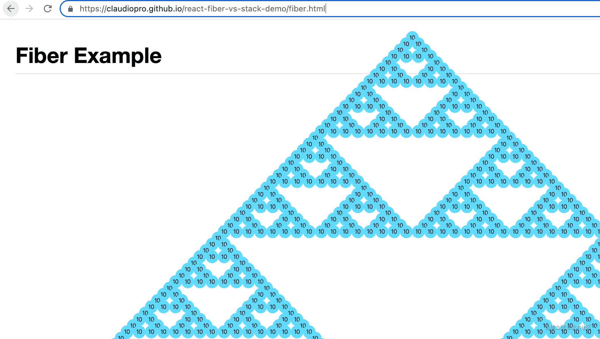
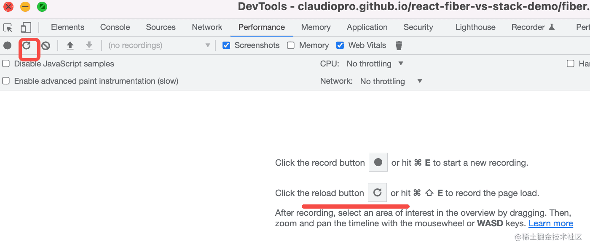
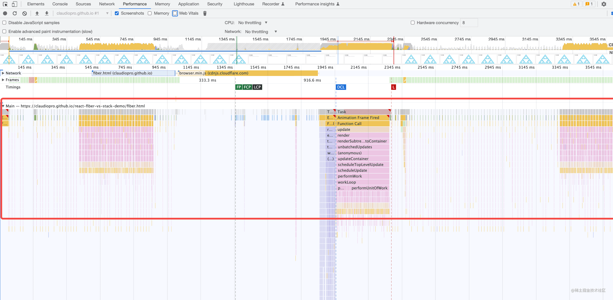
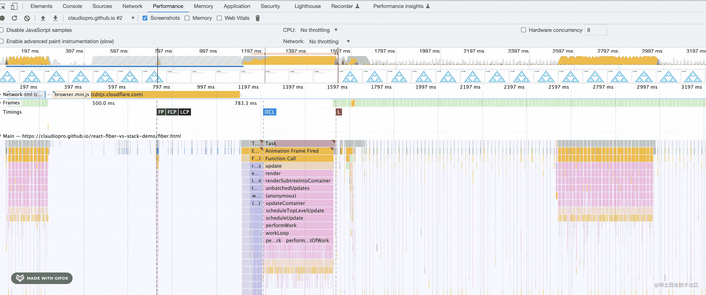
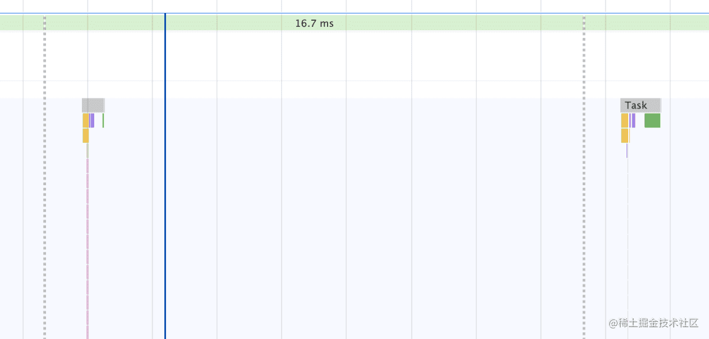
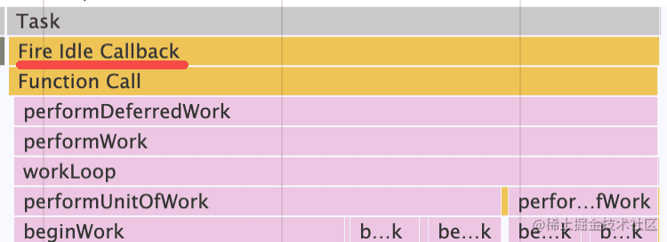
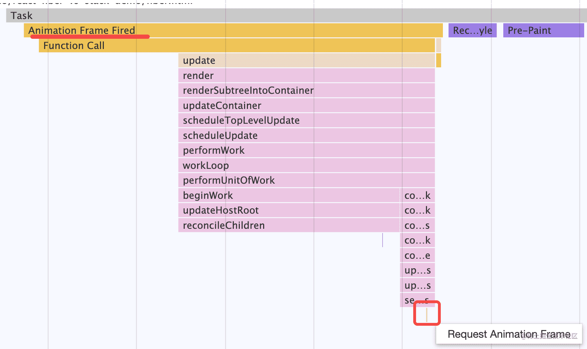
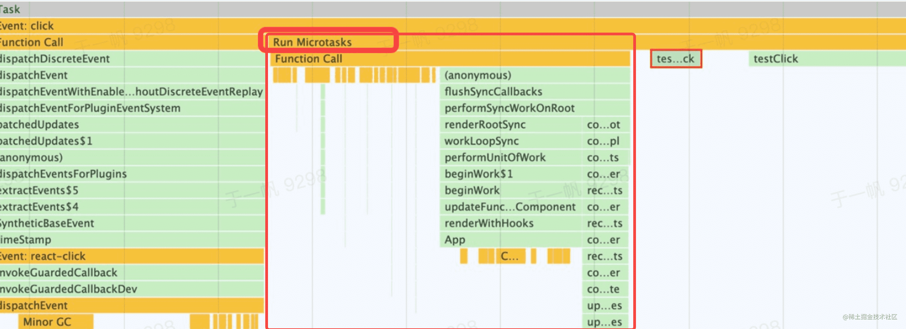

## 学习使用Performance

网页加载后，浏览器会解析 html、执行 js、渲染 css，这些工作都是在 Event Loop 里完成的，理解了 Event Loop 就能理解网页的运行流程。

但很多人对 Event Loop 的理解只是停留在概念层面，并没看过真实的 Event Loop 是怎样的。

其实在 Performance 工具里就可以看到，今天我们一起来看一下：

首先我们需要一个网页，我这里用的是 react 测试 fiber 用的网页：

[https://claudiopro.github.io/react-fiber-vs-stack-demo/fiber.html](https://claudiopro.github.io/react-fiber-vs-stack-demo/fiber.html)



点击 Performance 面板的 reload，录制 3 s 的数据：



其中 Main 这部分就是网页的主线程，也就是执行 Event Loop 的部分：



这块区域包含了所有 task 执行的流程，每个 task 的调用栈，因为像燃烧的火焰，所以也叫做火焰图。

鼠标划到想看的部分，向下拖动，就可以放大那个区域：



左右上下拖动可以调整看的位置：


展示的信息中很多种颜色，这些颜色代表着不同的含义：

灰色就代表宏任务 task：


蓝色的是 html 的 parse，橙色的是浏览器内部的 JS：


紫色是样式的 reflow、repaint，绿色的部分就是渲染：


其余的颜色都是用户 JS 的执行了，那些可以不用区分。

怎么从 Performance 中看出 Event Loop 执行的流程呢？

我们一起来看一下：

你会发现每隔一段时间就会有一个这种任务：


放大一下是这样的：


执行了 Animation Frame 的回调，然后执行了回流重绘，最后执行渲染。

这种任务每隔 16.7 ms 就会执行一次（因为我电脑是 60HZ 的刷新率，一秒 60 次，也就是 1s / 60 = 16.7ms 刷新一次）：



这就是网页里怎么执行渲染的。

所以说 requestAnimationFrame 的回调是在渲染前执行的，rAF 和渲染构成了一个宏任务。

为什么有的时候会掉帧、卡顿，就是因为阻塞的渲染的宏任务的执行：


在 Performance 中宽度代表时间，超过 50ms 就被认为是 Long Task，会被标红。因为如果 16.7 ms 渲染一帧，那 50ms 就跨了 3、4 帧了。

我们做性能分析，就是要找到这些 Long Task，然后优化掉它。

那除了 rAF 和渲染，还有哪些是宏任务呢？

看下分析的结果就知道了：

可以看到 requestIdleCallback 的回调是宏任务：



垃圾回收 GC 是宏任务：


requestAnimationFrame 的回调是宏任务：


html 中直接执行的 script 也是宏任务：


这些需要记么？

不需要，用 Performance 工具看下就知道了。

在 rAF 调用栈末尾有个 requestAnimationFrame 的调用，是橙色的，也就是浏览器的 api，会把下次 rAF 的回调加入 Event Loop。



大家可能知道 requestIdleCallback 是在空闲时执行代码，那什么时候算空闲呢？


这些渲染任务之间的没有执行 task 的时间就是空闲，或者执行完了任务，离渲染任务执行还有一段时间的时候。可以通过参数 deadline 的 timeRemaining 的 api 来获取剩余的空闲时间：

```javascript
requestIdleCallback((deadline) => {
    if(deadline.timeRemaining() > 某段时间) {
        // 执行任务
    }
})
```

如果一直得不到执行，还可以指定个过期时间，到了时间会插队执行，这时候会再传一个 didTimeout 的参数为 true，代表是过期了执行的：

```javascript
requestIdleCallback((deadline) => {
    if(deadline.timeRemaining() > 某段时间 || deadline.didTimeout) {
        // 执行任务
    }
}, { timeout: 1000} )
```

那微任务是怎么执行的呢？




有的 task 中包含 Run Microtasks，也就是说 micro task 只是 task 的一部分。

这就是这个网页的 Event Loop 执行过程。

当你对这些熟悉了之后，看到下面的火焰图，你就能分析出一些东西来了：


中间比较宽的标红的就是 Long Task，是性能优化的主要目标。

一些比较窄的周期性的 Task 就是 requestAnimationFrame 回调以及 reflow、rapaint 和渲染。

比较长的那个调用栈一般是递归，而且递归层数特别多。

当你展开看的时候，它也能展示完整的代码运行流程：


而如果你打断点调试，只能看到其中的一个调用栈，这是用 Performance 工具分析代码流程比 debugger 断点调试更好的地方。

当你阅读源码的时候，也可以通过 Performance 看执行流程的全貌，然后再 debugger 某些具体的流程。


## 总结

Performance 工具能够看到网页的 Event Loop 是怎么运行的，不同的颜色代表不同的含义：

- 灰色：task
- 橙色：浏览器内部的 JS
- 蓝色：html parse
- 紫色：reflow、repaint
- 绿色：渲染

其余的颜色都是用户自己的 JS。

宽度代表了执行的时间，超过 50ms 就被任务是长任务，需要优化。

长度代表了调用栈深度，一般特别长的都是有递归在。

用 Performance 工具可以分析出很多东西：

- rAF 回调和 reflow、repaint 还有渲染构成一个宏任务，每 16.7 ms（与刷新率有关） 执行一次。
- rAF 回调、rIC 回调、GC、html 中的 script 等都是宏任务
- 在任务执行完后，浏览器会执行所有微任务，也就是 runAllMicroTasks 部分

Performance 可以看到代码执行全貌，而断点调试的调用栈只能看到某一条流程。所以调试代码的时候可以 Performance 和 Debugger 结合来看。

总之，会用 Performance 工具，你就能深入理解 Event Loop，理清网页执行的全流程。