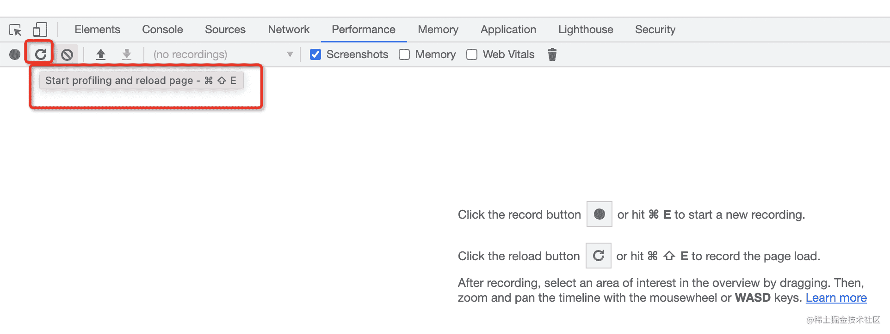
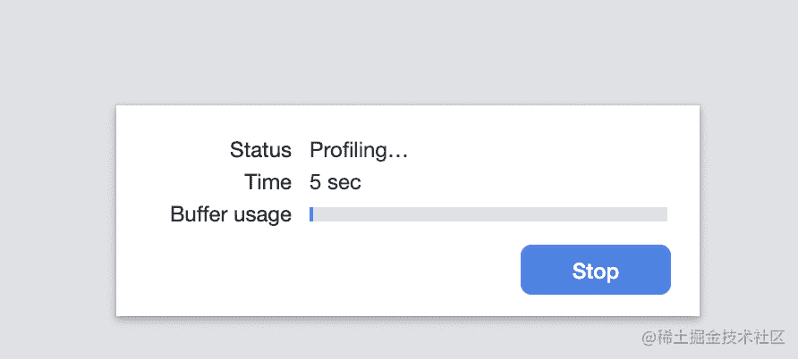
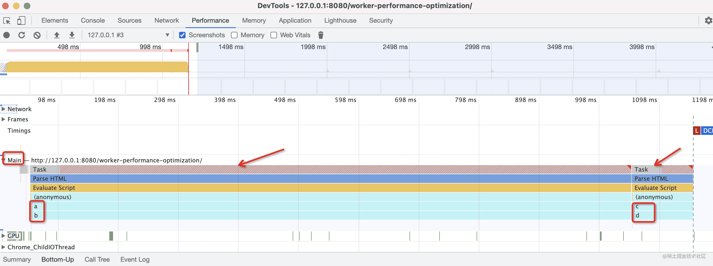
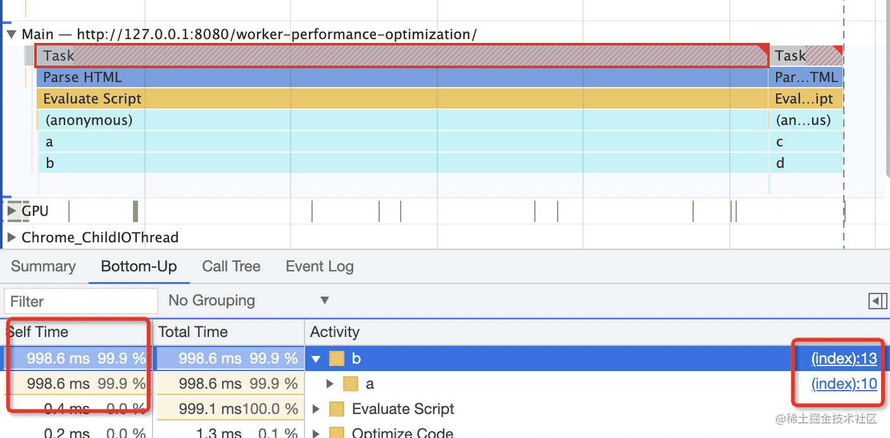
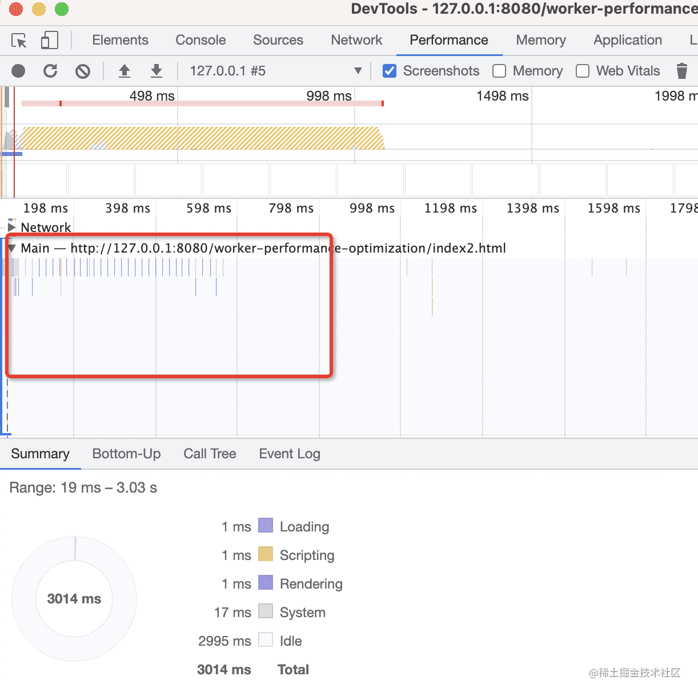
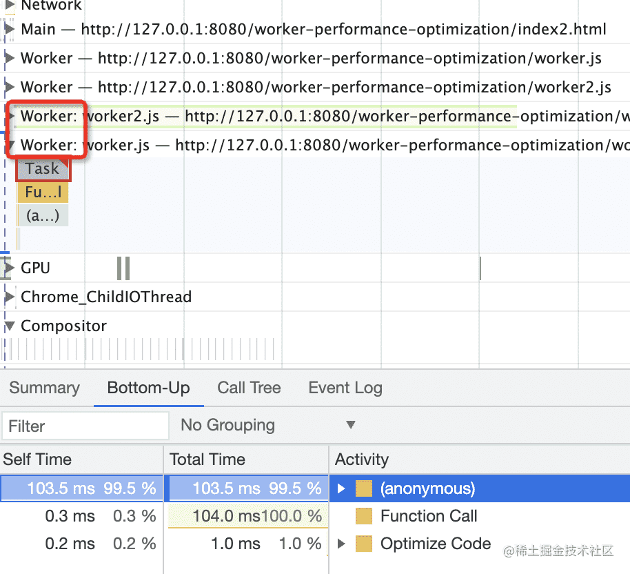

Chrome DevTools 的 Performance 工具是性能分析和优化的利器，因为它可以记录每一段代码的耗时，进而分析出性能瓶颈，然后做针对性的优化。

这么强大的工具肯定是要好好掌握的，今天我们就来做一个性能优化的案例来快速上手 Performance 吧。

## 性能分析

首先，我们准备这样一段代码：

```html
<!DOCTYPE html>
<html lang="en">
<head>
    <meta charset="UTF-8">
    <title>worker performance optimization</title>
</head>
<body>
    <script>
        function a() {
           b();
        }
        function b() {
            let total = 0;
            for(let i = 0; i< 10*10000*10000; i++) {
                total += i;
            }
            console.log('b:', total);
        }

        a();
    </script>
    <script>
        function c() {
            d();
        }
        function d() {
            let total = 0;
            for(let i = 0; i< 1*10000*10000; i++) {
                total += i;
            }
            console.log('c:', total);
        }
        c();
    </script>
</body>
</html>
```

很明显，两个 script 标签是两个宏任务，第一个宏任务的调用栈是 a、b，第二个宏任务的调用栈是 c、d。

我们用 Performance 来看一下是不是这样：

首先用无痕模式打开 chrome，无痕模式下没有插件，分析性能不会受插件影响。

打开 chrome devtools 的 Performance 面板，点击 reload 按钮，会重新加载页面并开始记录耗时：



过几秒点击结束。



这时候界面就会展示出记录的信息：



图中标出的 Main 就是主线程。其余的 Frames、Network 等是浏览器的其他线程。

主线程是不断执行 Event Loop 的，可以看到有两个 Task（宏任务），调用栈分别是 a、b 和 c、d，和我们分析的对上了。（当然，还有一些浏览器内部的函数，比如 parseHtml、evaluateScript 等，这些可以忽略）

**Performance 工具最重要的是分析主线程的 Event Loop，分析每个 Task 的耗时、调用栈等信息。**

当你点击某个宏任务的时候，在下面的面板会显示调用栈的详情（选择 bottom-up 是列表展示， call tree 是树形展示）



每个函数的耗时也都显示在左侧，右侧有源码地址，点击就可以跳到 Sources 对应的代码。


直接展示了每行代码的耗时，太方便了！

工具介绍完了，我们来分析下代码哪里有性能问题。

很明显， b 和 d 两个函数的循环累加耗时太高了。

在 Performance 中也可以看到 Task 被标红了，下面的 summary 面板也显示了 long task 的警告。


有同学可能会问：为什么要优化 long task 呢？

**因为渲染和 JS 执行都在主线程，在一个 Event Loop 中，会相互阻塞，如果 JS 有长时间执行的 Task，就会阻塞渲染，导致页面卡顿。所以，性能分析主要的目的是找到 long task，之后消除它。**

找到了要优化的代码，也知道了优化的目标（消除 long task），那么就开始优化吧。


## 性能优化

我们优化的目标是把两个 long task 中的耗时逻辑（循环累加）给去掉或者拆分成多个 task。

关于拆分 task 这点，可以参考 React 从递归渲染 vdom 转为链表的可打断的渲染 vdom 的优化，也就是 fiber 的架构，它的目的也是为了拆分 long task。

但明显我们这里的逻辑没啥好拆分的，它就是一个大循环。

那么能不能不放在主线程跑，放到其他线程跑呢？浏览器的 web worker 好像就是做耗时计算的性能优化的。

我们来试一下：

封装这样一个函数，传入 url 和数字，函数会创建一个 worker 线程，通过 postMessage 传递 num 过去，并且监听 message 事件来接收返回的数据。

```javascript
function runWorker(url, num) {
    return new Promise((resolve, reject) => {
        const worker = new Worker(url);
        worker.postMessage(num);
        worker.addEventListener('message', function (evt) {
            resolve(evt.data);
        });
        worker.onerror = reject;
    });
};
```

然后 b 和 c 函数就可以改成这样了：

```javascript
function b() {
    runWorker('./worker.js', 10*10000*10000).then(res => {
        console.log('b:', res);
    });
}
```

耗时逻辑移到了 worker 线程：

```javascript
addEventListener('message', function(evt) {
    let total = 0;
    let num = evt.data;
    for(let i = 0; i< num; i++) {
        total += i;
    }
    postMessage(total);
});
```

完美。我们再跑一下试试：



哇，long task 一个都没有了！

然后你还会发现 Main 线程下面多了两个 Worker 线程：



虽然 Worker 还有 long task，但是不重要，毕竟计算量在那，只要主线程没有 long task 就行。

这样，我们通过把计算量拆分到 worker 线程，充分利用了多核 cpu 的能力，解决了主线程的 long task 问题，界面交互会很流畅。

我们再看下 Sources 面板：


对比下之前的：


这优化力度，肉眼可见！

就这样，我们一起完成了一次网页的性能优化，通过 Peformance 分析出 long task，定位到耗时代码，然后通过 worker 拆分计算量进行优化，成功消除了主线程的 long task。

代码在[小册仓库](https://github.com/QuarkGluonPlasma/fe-debug-exercize/)里。


## 总结

Chrome DevTools 的 Performance 工具是网页性能分析的利器，它可以记录一段时间内的代码执行情况，比如 Main 线程的 Event Loop、每个 Event loop 的 Task，每个 Task 的调用栈，每个函数的耗时等，还可以定位到 Sources 中的源码位置。

性能优化的目标就是找到 Task 中的 long task，然后消除它。因为网页的渲染是一个宏任务，和 JS 的宏任务在同一个 Event Loop 中，是相互阻塞的。

我们做了一个真实的优化案例，通过 Performance 分析出了代码中的耗时部分，发现是计算量大导致的，所以我们把计算逻辑拆分到了 worker 线程以充分利用多核 cpu 的并行处理能力，消除了主线程的 long task。

做完这个性能优化的案例之后，是不是觉得 Peformance 工具用起来也不难呢？

其实会分析主线程的 Event Loop，会分析 Task 和 Task 的调用栈，找出 long task，并能定位到耗时的代码，Performance 工具就算是掌握了大部分了，常用的功能也就是这些。