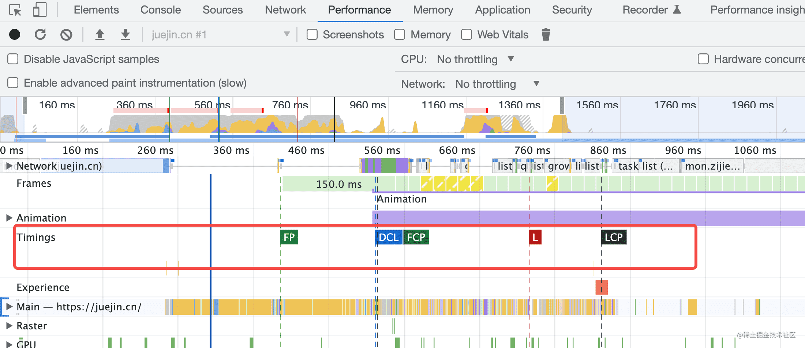
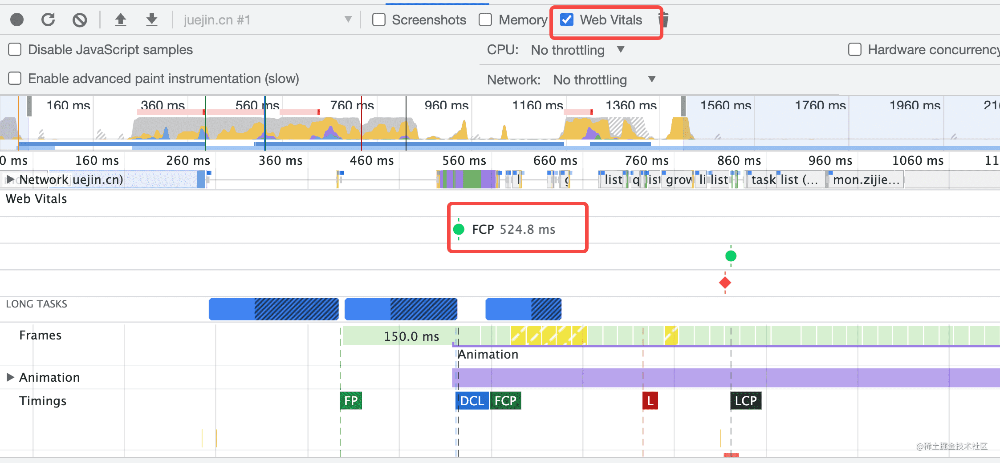
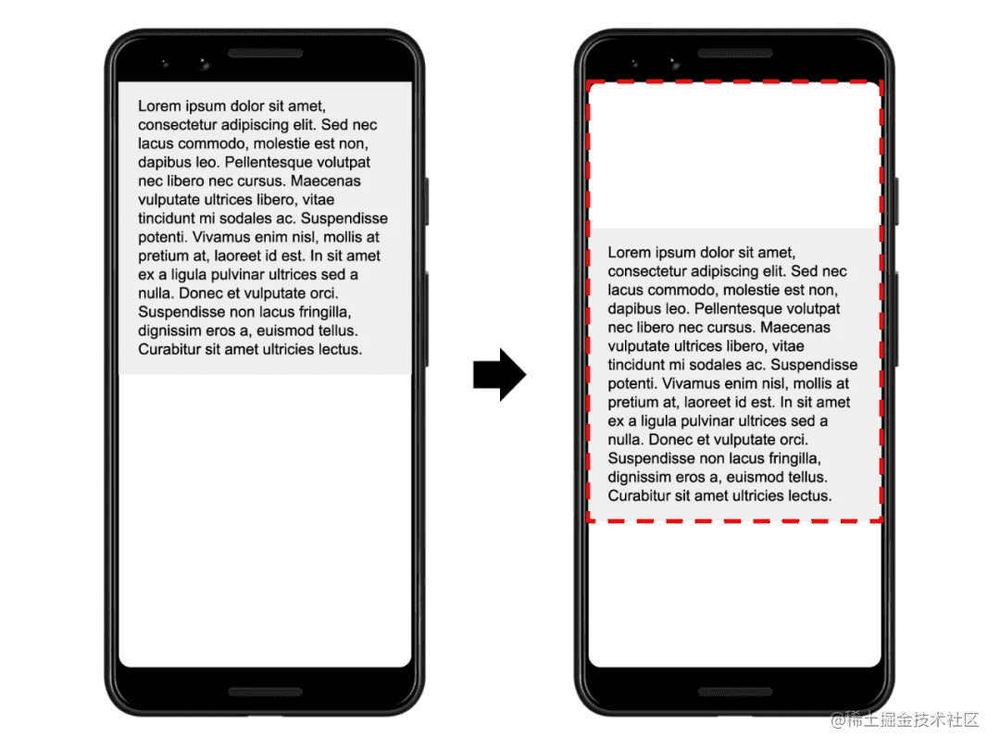
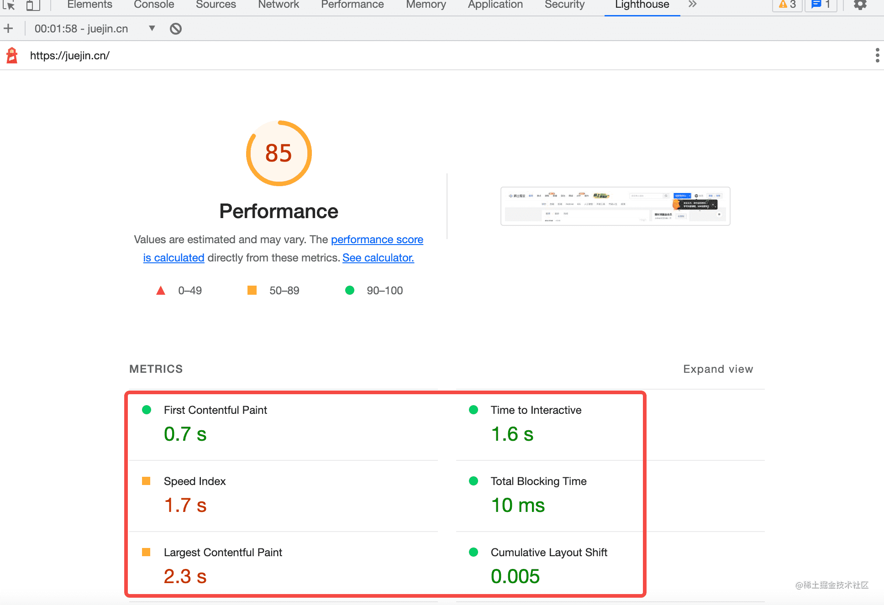
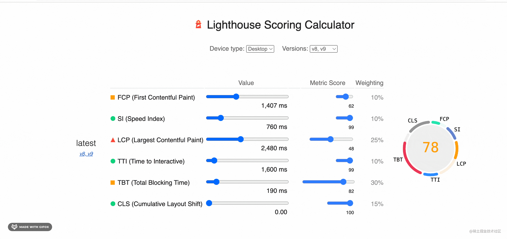

用 Performance 工具分析网页的时候，你可能会看到 FP、DCL、FCP、L、LCP 这些东西：



勾选 web vitals 的话，还能看到具体的时间：



这是什么呢？

这叫做 web vitals，网页性能指标，这其中还有 3 个核心的，叫做 web core vitals。

我们分别来看下它们的含义：


## Web Vitals

### [TTFB](https://web.dev/ttfb) （首字节到达）

Time To First Byte，从开始加载网页到接收到第一个字节的网页内容之间的耗时，用来衡量网页加载体验。

可以通过 performance api 计算出来：

```javascript
const { responseStart, requestStart } = performance.timing
const TTFB = responseStart - requestStart
```

或者通过 PerformanceObserver api：

```javascript
new PerformanceObserver((entryList) => {  
    const entries = entryList.getEntries();  
  
    for (const entry of entries) {  
        if (entry.responseStart > 0) {  
            console.log(`TTFB: ${entry.responseStart}`, entry.name);  
        }  
    }  
}).observe({  
    type: 'resource',  
    buffered: true  
});
```


### FP （首次绘制）

First Paint，第一个像素绘制到页面上的时间

```javascript
const paint = performance.getEntriesByType('paint')
const FP = paint[0].startTime
```


### [FCP](https://web.dev/fcp) （首次内容绘制）

First Contentful Paint，从开始加载网页到第一个文本、图像、svg、非白色的 canvas 渲染完成之间的耗时。

可以通过 performance 的 api 计算出来：

```javascript
const paint = performance.getEntriesByType('paint')
const FCP = paint[1].startTime
```

也可以通过 PerformanceObserver 的 api 拿到：

```javascript
new PerformanceObserver((entryList) => {  
    for (const entry of entryList.getEntriesByName('first-contentful-paint')) {  
        console.log('FCP candidate:', entry.startTime, entry);  
    }  
}).observe({type: 'paint', buffered: true});
```


### [LCP](https://web.dev/lcp) （最大内容绘制）

Largest Contentful Paint，最大的内容（文字/图片）渲染的时间。

计算方式是从网页开始渲染到渲染完成，每次渲染内容都对比下大小，如果是更大的内容，就更新下 LCP 的值：


可以通过 PerformanceObserver 的 api 来拿到计算结果：

```javascript
let LCP = 0

const performanceObserver = new PerformanceObserver((entryList, observer) => {
  const entries = entryList.getEntries()
  observer.disconnect()
  
  LCP = entries[entries.length - 1].startTime
})

performanceObserver.observe({ entryTypes: ['largest-contentful-paint'] })
```


### FMP （首次有意义的绘制）

First Meaningful Paint，首次有意义的绘制。

前面的 FCP、LCP 记录的是内容、最大内容的渲染，但这些内容并不一定关键，比如视频网站，渲染视频最关键，别的内容的渲染不是最重要的。

FMP 就是记录关键内容渲染的时间。

计算它的话我们可以手动给元素加一个标识：

```html
<video elementtiming="meaningful" />
```

然后通过 PerformanceObserver 的 api 拿到它的渲染时间，就是 FMP 的值：

```javascript
let FMP = 0

const performanceObserver = new PerformanceObserver((entryList, observer) => {
  const entries = entryList.getEntries()
  observer.disconnect()

  FMP = entries[0].startTime
})

performanceObserver.observe({ entryTypes: ['element'] })
```


### DCL（DOM内容加载完成）

DomContentloaded，html 文档被完全加载和解析完之后，DOMContentLoaded 事件被触发，无需等待 stylesheet、img 和 iframe 的加载完成。

```javascript
const { domContentLoadedEventEnd, fetchStart } = performance.timing
const DCL = domContentLoadedEventEnd - fetchStart
```


### L（加载完成）

Load， html 加载和解析完，它依赖的资源（iframe、img、stylesheet）也加载完触发。

```javascript
const { loadEventEnd, fetchStart } = performance.timing
const L = loadEventEnd - fetchStart
```


### [TTI](https://web.dev/tti) （可交互时间）

Time to Interactive，可交互时间。

计算方式为：

- 从 FCP 后开始计算
- 持续 5 秒内无长任务（大于 50ms） 且无两个以上正在进行中的 GET 请求
- 往前回溯至 5 秒前的最后一个长任务结束的时间，没有长任务的话就是 FCP 的时间

```javascript
const { domInteractive, fetchStart } = performance.timing
const TTI = domInteractive - fetchStart
```


### [FID](https://web.dev/fid) （首次输入延迟）

First Input Delay，用户第一次与网页交互（点击按钮、点击链接、输入文字等）到网页响应事件的时间。

记录在 FCP 和 TTI 之间用户首次与页面交互时响应的延迟。

```javascript
let FID = 0

const performanceObserver = new PerformanceObserver((entryList, observer) => {
  const entries = entryList.getEntries()
  observer.disconnect()

  FID = entries[0].processingStart - entries[0].startTime
})

performanceObserver.observe({ type: ['first-input'], buffered: true })
```


### [TBT](https://web.dev/tbt) （阻塞总时长）

Total Blocking Time，记录在首次内容渲染（FCP）到可以处理交互（TTI）之间所有长任务（超过 50ms 的 longtask）的阻塞时间总和。


### [CLS](https://web.dev/cls) （累积布局偏移）

Cumulative Layout Shift，累计布局偏移，记录了页面上非预期的位移波动。计算方式为：位移影响的面积 * 位移距离（完整计算过程感兴趣可以看[官方文档](https://web.dev/cls/#%E5%B8%83%E5%B1%80%E5%81%8F%E7%A7%BB%E5%88%86%E6%95%B0)）



举个例子，比如一个图片没加载完的时候是 50 * 50 的大小，但是加载完之后变为了 100 * 100，这就是布局的波动，会影响体验。

这时候 lighthouse 等工具给出的优化建议是给 img 设置固定的 width 和 height。


### [SI](https://web.dev/si) （速度指数）

Speed Index，页面可见部分的显示速度, 单位是时间

这个指标也有快、适度、慢的区间，用性能测试工具测量时会转为相应的分数：


指标这么多，哪些指标是要重点关注的呢？谷歌选出了 3 个核心指标：


## Core Web Vitals

谷歌从上面的 Web Vitals 里选出了 3 个核心的，分别是 LCP、FID、CLS。

LCP 是最大内容渲染时间，代表页面已经完成了主要内容的渲染，这个指标可以用来衡量加载到渲染的性能。（FMP 是有意义的渲染，那个比较难定义）

FID 是衡量页面内容首次渲染（FCP）之后，到可交互（TTI）的这段时间内，用户点击按钮或者输入内容到页面响应的时间。是从用户交互角度衡量页面性能的指标。

CLS 是布局稳定性，是能反应用户体验的一个指标。

这三个核心指标分别代表了**加载性能、交互性能、视觉稳定性**。比较有代表性。

我们可以通过 LightHouse 工具来测量性能指标：


点击 analyze page load 就会开始测量。

会给出 FCP、LCP、SI、TTI、TBT、CLS 性能指标的值，并根据值的区间计算得分：



下面还会给出针对不同指标的优化建议：

比如我们前面提到的图片设置 width 和 height 来优化 CLS：


有的同学可能会说怎么没有 Core Web Vitals 的 FID，确实，LighoutHouse 的指标里没这个，但是可以用 TBT 代替。

FID 是首次输入延迟，是从首次内容渲染（FCP）到可交互（TTI）之间，用户输入到页面响应的时间。

TBT 是阻塞总时长，是从首次内容渲染（FCP）到可交互（TTI）之间，所有 longtask 的总时长。

这俩指标很接近，所以可以用 TBT 代替 FID。

至于为什么没有 FID，lighouthouse 的文档里有解释：


至于得分是怎么算出来的，什么时候标红、标绿、标黄，自然是有区间的：


比如 LCP 小于 2.5s 是 good，标绿，大于 4s 标红等。

LightHouse 还提供了一个[可视化的计算器](https://googlechrome.github.io/lighthouse/scorecalc/#FCP=780&SI=1743&FMP=723&TTI=1600&FCI=6500&LCP=2324&TBT=14&CLS=0&device=desktop&version=9)：

可以看到指标在不同值的时候的分数和颜色，或者看达到多少分数需要把指标优化到多少：



当你有优化目标的时候，可以通过这个计算器看看要达到多少分需要把指标优化到什么程度。


## 总结

Google 定义了一系列性能指标，叫做 Web Vitals：

- [TTFB](https://web.dev/ttfb) 首字节到达
- FP 首次绘制
- [FCP](https://web.dev/fcp) 首次内容绘制
- [LCP](https://web.dev/lcp) 最大内容绘制
- FMP 首次有意义的绘制
- DCL DOM内容加载完成
- L 加载完成
- [TTI](https://web.dev/tti) 可交互时间
- [FID](https://web.dev/fid) 首次输入延迟
- [TBT](https://web.dev/tbt) 阻塞总时长
- [CLS](https://web.dev/cls) 累积布局偏移
- [SI](https://web.dev/si) 速度指数

又从其中选出了 3 个作为核心指标，也就是 LCP、FID、CLS，分别用来衡量加载性能、交互性能、视觉稳定性。

可以用 LightHouse 测量这些指标的值，LighoutHouse 会给出分数和红绿黄的标识，也会给出每个指标的优化建议。

有时需要自己计算并上报这些指标，可以通过 performance api 来算，或者通过 PerformanceObserver api 拿到计算后的指标值。

当我们谈网页性能的时候，会具体到这些性能指标。要记住这些指标的含义，比如别人提起 LCP 你要知道指的是加载性能。

