## console.log内存泄漏

很多前端都喜欢用 console.log 调试，先不谈调试效率怎么样，首先 **console.log 有个致命的问题：会导致内存泄漏。**

为什么这么说呢？

用 Performance 和 Memory 工具分析下就知道了。

我们准备这样一段代码：


一个按钮，点击之后创建一个数组，执行一些计算。

很常见的逻辑。

我们最后加了一个 console.log 打印了下这个数组。

起个静态服务：


浏览器访问：


点击 performance 下的垃圾回收按钮，手动触发一次 GC：


勾选 Memory，然后开始录制，点击 3 次按钮，再执行一次 GC：

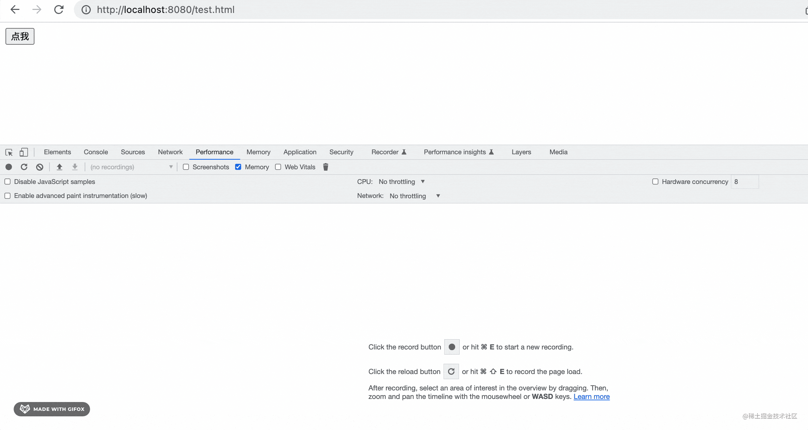

你会发现内存是这样的：


内存占用有三次增长，因为我们点击三次按钮的时候会创建 3 次大数组。

但是最后我们手动 GC 之后并没有回落下去，也就是这个大数组没有被回收。

按理来说，代码执行完，那用的内存就要被释放，然后再执行别的代码，结果这段代码执行完之后大数组依然占据着内存，这样别的代码再执行的时候可用内存就少了。

这就是发生了**内存泄漏，也就是代码执行完了不释放内存的流氓行为。**

有同学说，只是这么一点内存问题不大呀，反正可用内存还很多。

但如果你的代码要跑很长时间，这段代码要执行很多次呢？

每次执行都会占据一部分内存不释放，慢慢的内存就不够用了，甚至会导致程序崩溃。

比如当这段代码执行个 9 次，内存占用就增长了 9 个大数组的内存：


再多执行几次呢？

是不是就有崩溃的隐患了。

那为啥说是 console.log 导致的呢？

我们来看看不用 console.log 是什么样的：


注释掉 console.log，重新跑。

你会发现现在的内存分配情况是这样的：


分配了三次内存，但是 GC 后又会落下去了。

这才是没有内存泄漏的好代码。

那为啥 console.log 会导致内存泄漏呢？

因为控制台打印的对象，你是不是有可能展开看？那如果这个对象在内存中没有了，是不是就看不到了？

所以有这个引用在，浏览器不会把你打印的对象的内存释放掉。

当然，也不只是 console.log 会导致内存泄漏，还有别的 4 种情况：

- 定时器用完了没有清除，那每次执行都会多一个定时器的内存占用，这就是内存泄漏
- 元素从 dom 移除了，但是还有一个变量引用着他，这样的游离的 dom 元素也不会被回收。每执行一次代码，就会多出游离的 dom 元素的内存，这也是内存泄漏
- 闭包引用了某个变量，这个变量不会被回收，如果这样的闭包比较多，那每次执行都会多出这些被引用变量的内存占用。这样引用大对象的闭包多了之后，也会导致内存问题
- 全局变量，这个本来就不会被 GC，要注意全局变量的使用

总之，**全局变量、闭包引用的变量、被移除的 dom 依然被引用、定时器用完了没清除、console.log 都会发生代码执行完了，但是还占用着一部分内存的流氓行为，也就是内存泄漏。**

注意，这里指的是使用完毕后没有回收，在使用期间的内存增长是正常的。

那怎么排查呢？

performance 工具就可以：

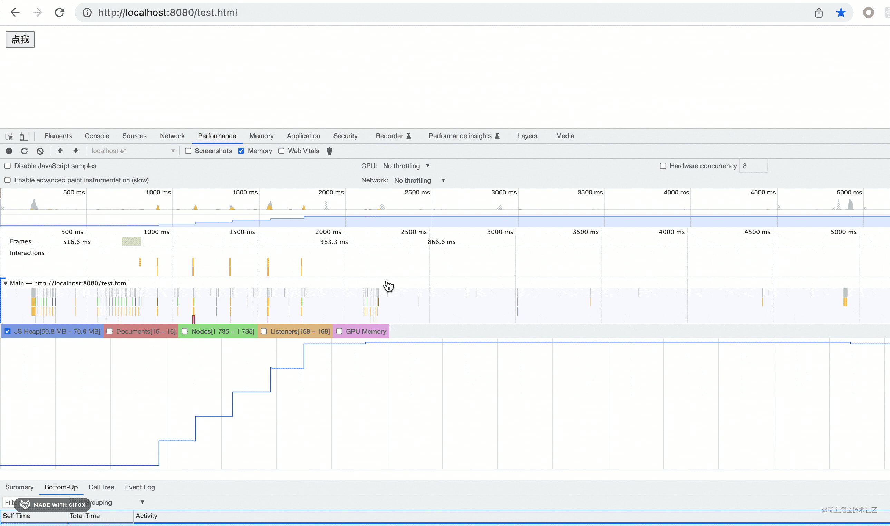

点击内存分配情况的某个点，就会定位到 performance 中的某个任务的代码，点击可以在下面看到详情：

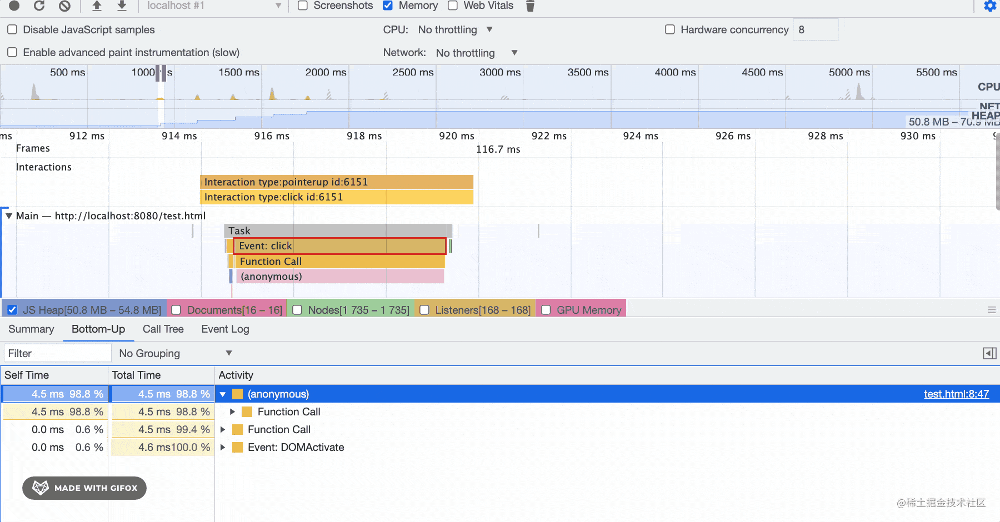

这样就定位到了分配内存的代码，分析一下哪里会有问题即可。

当然，前提还是要执行先 GC，再做一些操作，再 GC 的这个流程。

这是从代码角度来分析内存泄漏，其实还可以从内存中对象的角度，这个是通过 Memory 工具：

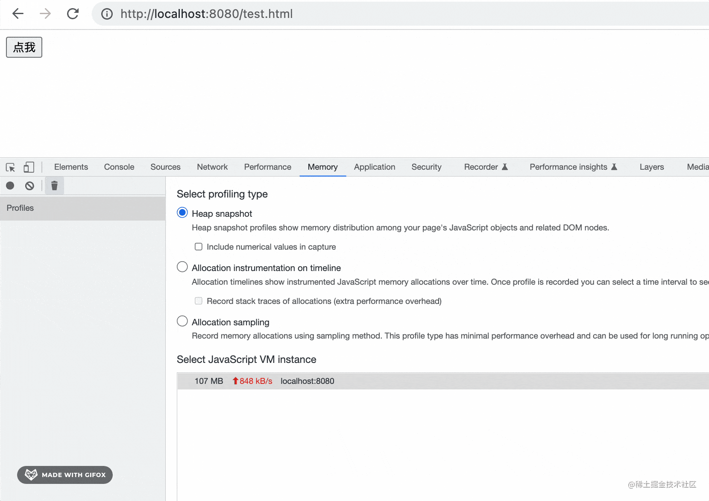

先 GC，录制一次内存快照，再点击几次按钮，然后 GC，再录制一次内存快照。

流程和用 performance 分析的时候一样。

拿到两次内存快照也是可以分析出有内存泄漏的：


可以看到 GC 后内存占用依然增长了。

快照记录着这个时刻内存中所有对象的状态：


对比两次快照，就可以找到变化的部分：

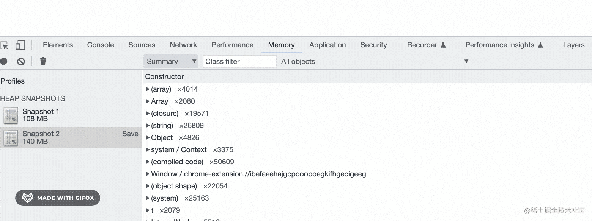

比如这时候可以看到最大的内存增长是 array 对象：

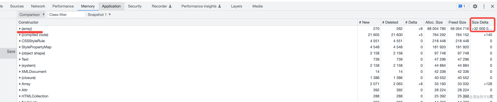

然后就可以从 array 的角度去思考是什么导致的内存泄漏了。

此外，memory 还有实时分析的工具：

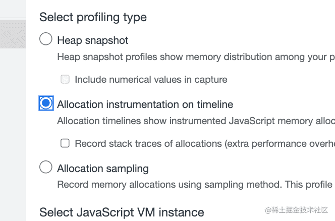

选择第二个，然后点几次按钮：

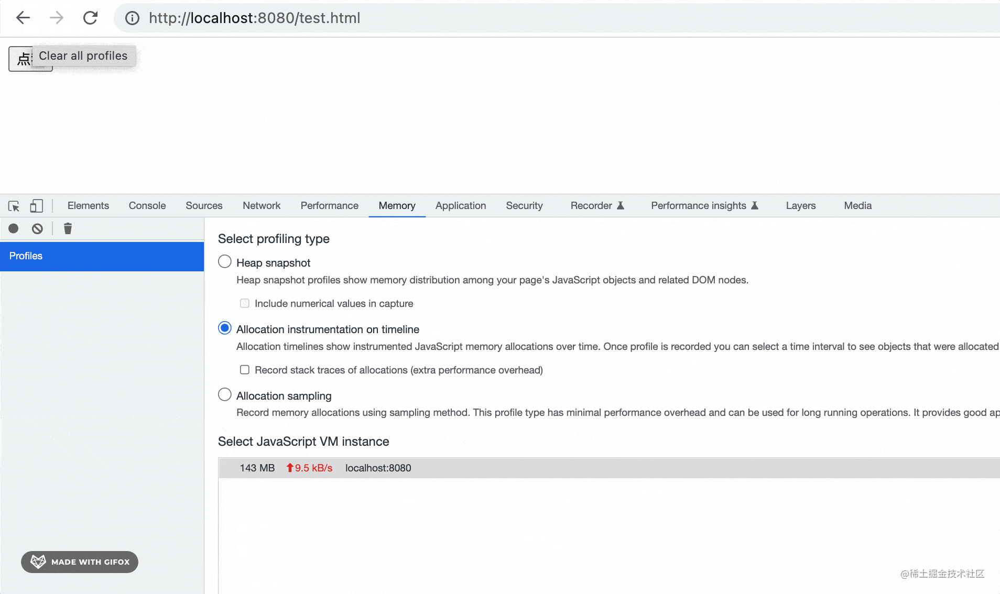

其实不用手动 GC，JS 引擎会做 GC。

去掉 console.log 再录制是这样的：


除了最开始全局变量会分配一些内存以外，点击按钮之后的内存变蓝后又变灰了，也就是被 GC 了。

这样你点多少次按钮，内存占用都没有增长。

这就是代码执行完，会回收所有用到的内存的好代码。

而前面的那个是每次代码执行，都会占用一部分内存不释放的内存泄漏代码。

你还可以看到每一次内存分配的对象是啥：

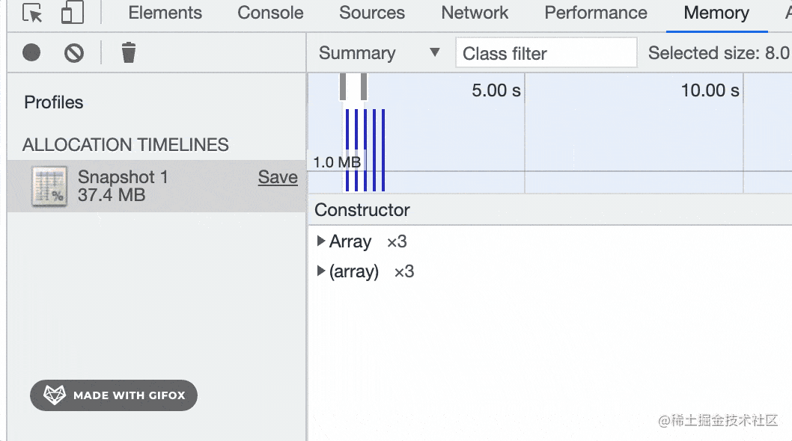

不管是用 Performance 工具还是 Memory 工具，都可以发现 console.log 有内存泄漏的问题。所以还是尽量不要用这个来调试了。

那应该用什么呢？

用 debugger 呀，不管是 vscode debugger 还是 chrome devtools 的都可以：

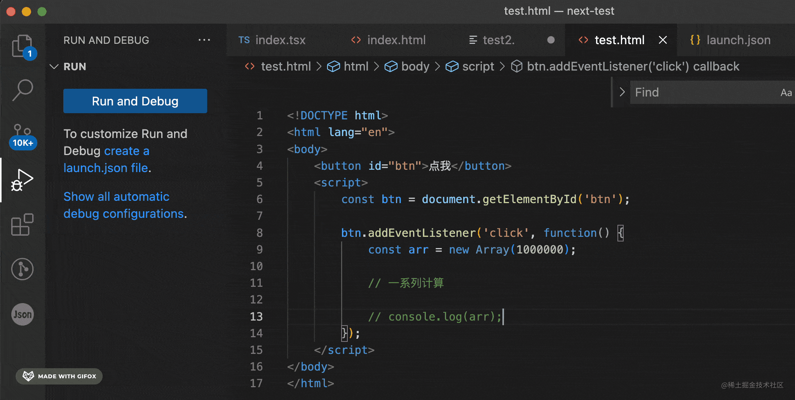

你可以添加一个 logpoint 来代替 console.log 打印：


代码执行到这里就会打印：


而你的代码里不需要写 console.log。


此外，很多地方可以用断点代替打印：


可以看到代码执行路线和作用域，岂不是更高效？


## 打开 devtools导致内存泄漏

有 console.log 的时候，内存是这样的：

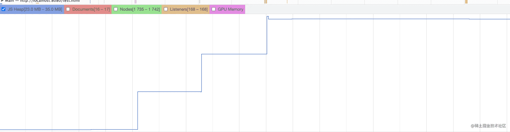

去掉之后是这样的：


我们得出结论，console.log 会导致内存泄漏。

这点没错。

但很多同学会有疑问，是不是因为打开 devtools 才有内存泄漏，不打开就不会呢？

不打开 devtools 怎么确定内存泄漏问题呢？

看下内存大小就知道了。

通过 performance.memory.totalJSHeapSize 是可以拿到堆内存大小的。

我们通过分析 console.log 的代码执行后的堆内存大小变化就行。

也就是这样：

```html
<!DOCTYPE html>
<html lang="en">
<body>
    <button id="btn">点我</button>
    <div id="box"></div>  
    <script>
        const btn = document.getElementById('btn');
        const box = document.getElementById('box');

        btn.addEventListener('click', function() {
            const MB = 1024 * 1024;
            log();

            function log() {
                const memory = performance.memory.totalJSHeapSize;
                const usagedMemory = Math.floor(memory / MB);
                box.insertAdjacentHTML('beforeend', `<span>${usagedMemory} </span>`);

                const obj = {usagedMemory, str: 'g'.repeat(50 * MB)};
                console.log(obj); 

                setTimeout(() => log(), 50);
            }
        });
    </script>
</body>
</html>
```

按钮点击的时候，拿到当前堆内存的大小。然后打印一个大字符串和堆内存大小。

因为我们看不到控制台，所以也会加到 dom 中来显示。

通过定时器不断的执行这样的操作。

我们先打开 devtools 测试下：


可以看到每次打印后内存都在增长，并且在内存达到 4G 的时候就崩溃了。

说明 console.log 确实存在内存泄漏。

那我们再关掉 devtools 测试下：


内存一直稳定不变，说明函数执行完之后，作用域销毁，打印的对象就被销毁了，没有内存泄漏。

我们过程中打开 devtools 测试下：


可以看到一打开 devtools，再次执行 console.log 的时候，内存就增长了，说明这时候内存泄漏了。

那如果我先打开 devtools，然后再关掉呢？

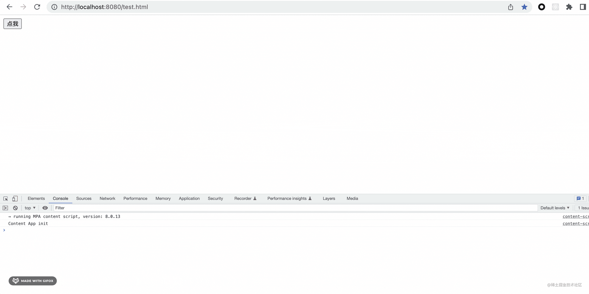

可以看到，只要关闭了 devtools，内存就稳定了。但之前打印的对象依然被引用着，那部分内存不会被释放。

这样，我们就可以得出结论：**不打开 devtools 的时候，console.log 不会内存泄漏。**

还有同学问，那如果直接打印字符串呢？

我们直接打印字符串试一下：

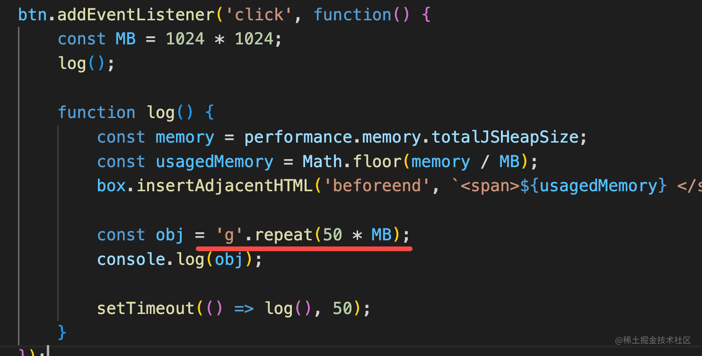


可以看到，内存也是平稳的。

为什么呢？字符串不也是对象、可以看到详情的吗？

这是因为字符串比较特殊，有个叫做常量池的东西。

录制一下内存快照：

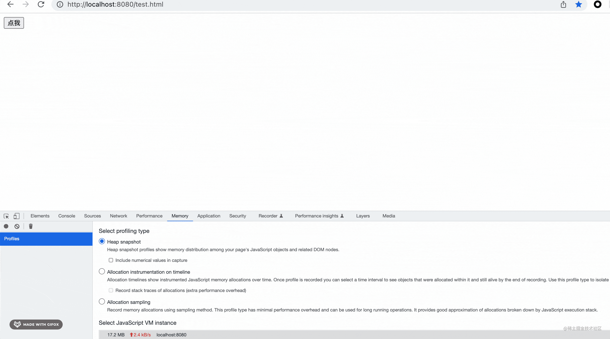

看一下字符串占用的内存：

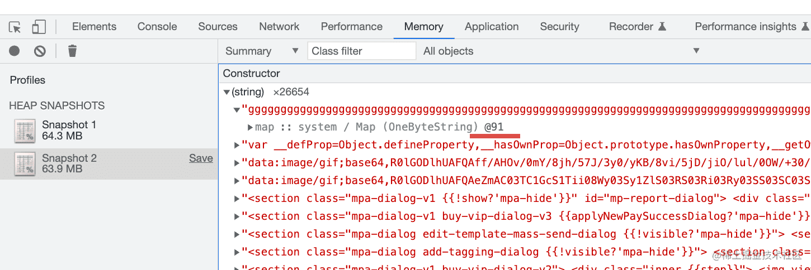

是 @91 的地址。

我过了一段时间再录制了一次快照，依然只有一个字符串，地址是 @91。

这就是字符串常量池的作用，同样的字符串只会创建一次，减少了相同字符串的内存占用。

但 string 还有另一种创建方式：new String

这种方式就不一样了：


这时候创建的是一个堆中的对象，然后引用了常量池中的 string。


这也是为啥字符串字面量是 string，而 new String 是 object：

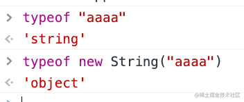

因为会不断在堆中创建对象，所以这时候 console.log 的内存泄漏依然会使堆内存上升：

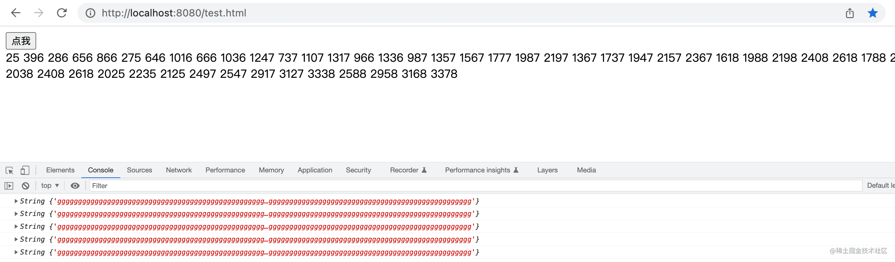

那 node.js 的 console.log 有没有内存泄漏呢？

我们也用同样的方式测试下就好了，只是这时候拿到内存数据是用 progress.memoryUsage() 的 api：

```javascript
const MB = 1024 * 1024;

log();

function log() {
    const memory = process.memoryUsage().heapUsed
    const usagedMemory = Math.floor(memory / MB);

    const obj = { usagedMemory, obj: 'g'.repeat(50 * MB) };
    console.log(obj); 

    setTimeout(() => log(), 50);
}
```

执行一下：


可以看到内存是稳定的，并不会内存泄漏。

这是因为 node 打印的是序列化以后的对象，并不是对象引用。


## 总结

console.log 会导致内存泄漏，也就是代码执行完了，但还占据着一部分内存的流氓行为。

除了 console.log，游离的 dom 被变量引用、全局变量、变量被闭包引用、定时器没清除也会导致内存泄漏。

我们可以用 Performance 工具和 Memory 工具分析内存泄漏。

先手动 GC，然后执行一些操作，再 GC，如果内存没有回到执行前，就说明这段代码有内存泄漏，可以再用 Performance 定位到代码位置分析代码。

Memory 工具是从内存对象的角度分析，可以对两次快照做 diff，看下是啥对象泄漏了。

也可以实时检测内存占用情况，看看是否存在内存泄漏，对象是啥。

console.log 调试效率也不高，可以换成 logpoint，或者打断点。

console.log 在 devtools 打开的时候是有内存泄漏的，因为控制台打印的是对象引用。但是不打开 devtools 是不会有内存泄漏的。

我们通过打印内存占用大小的方式来证明了这一点。

string 因为常量池的存在，同样的字符串只会创建一次。new String 的话才会在堆中创建一个对象，然后指向常量池中的字符串字面量。

此外，nodejs 打印的是序列化以后的对象，所以是没有内存泄漏的。

当你一打开 devtools 网页就崩了，不打开没事，这时候一般就是因为 console.log 导致的内存泄漏了。

