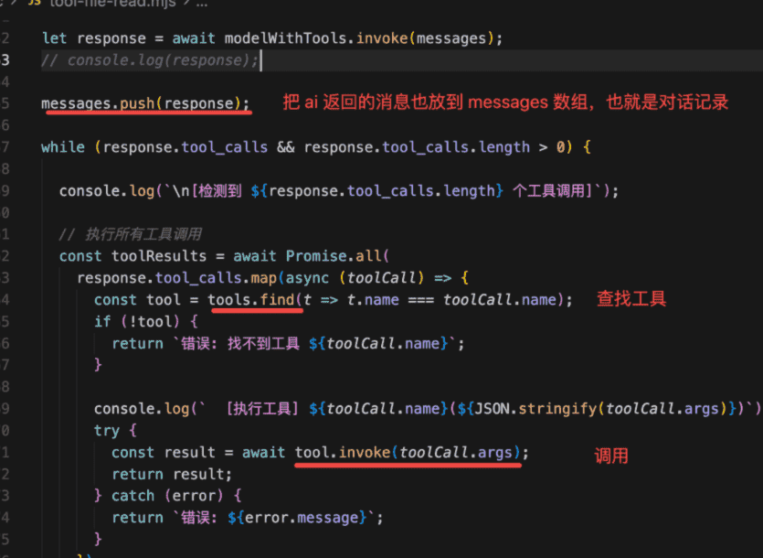
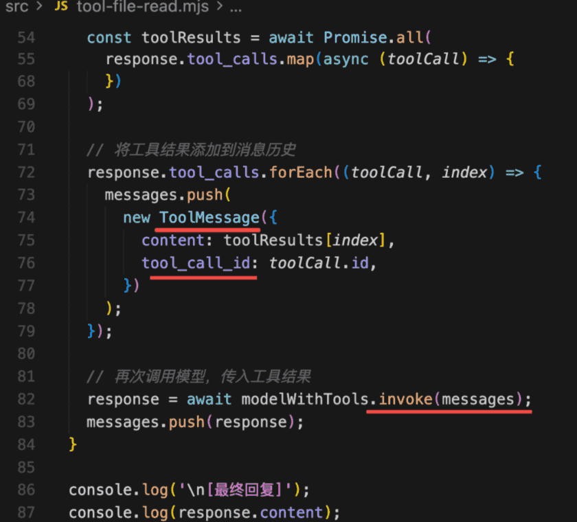

## 1

我们和大模型聊天，可以问它一些问题，它告诉你怎么做。

但是大模型没法帮你去做。

比如你想创建一个 react + vite 的 todolist 项目，你直接问大模型，它只能告诉你应该创建哪些文件，代码是什么，但是不能帮你读写文件、执行命令。

但是 cursor 是可以的，你让它创建一个 todolist 项目，它会直接给你写入文件。你还可以让它安装依赖，把项目跑起来。

这是怎么实现的呢？

开发一些 tool 交给 agent 调用就可以了。

比如读文件、写文件、读取目录、创建目录、执行命令

这节我们来学下 tool


## 2

### 模型

首先，我们找个大模型来用，这里我们用阿里的千问

登录一下：https://bailian.console.aliyun.com/?tab=api#/api，然后获取APIkey

然后找一个和编码有关的模型，这里我们用`qwen-coder-turbo`


### 准备

创建项目

```
mkdir tool-test
cd tool-test
npm init -y

pnpm install @langchain/openai
pnpm install dotenv
```

创建一个文件：`src/hello-langchain.mjs`

dotenv 的作用就是读取 .env 文件，设置到环境变量里

mjs 是 es module 格式的 js 文件的意思，可以用 import、export 语法

```js
import dotenv from'dotenv';
import { ChatOpenAI } from'@langchain/openai';

dotenv.config();

const model = new ChatOpenAI({ 
    modelName: process.env.MODEL_NAME || "qwen-coder-turbo",
    apiKey: process.env.OPENAI_API_KEY,
    configuration: {
        baseURL: process.env.OPENAI_BASE_URL,
    },
});

const response = await model.invoke("介绍下自己");
console.log(response.content);
```

所以我们在 .env 文件里配置这些变量，代码里动态读取：

```
# OpenAI API 配置
OPENAI_API_KEY=你的 api key
OPENAI_BASE_URL=https://dashscope.aliyuncs.com/compatible-mode/v1

# 模型配置（可选，默认为 qwen-coder-turbo）
MODEL_NAME=qwen-coder-turbo
```


### 开始

好了，准备工作结束！

接下来开发 tool：其实也很简单，我们先写一个读文件的 tool：

创建 src/tool-file-read.mjs

```js
import "dotenv/config";
import { ChatOpenAI } from "@langchain/openai";
import { tool } from "@langchain/core/tools";
import {
  HumanMessage,
  SystemMessage,
  ToolMessage,
} from "@langchain/core/messages";
import fs from "node:fs/promises";
import { z } from "zod";

const model = new ChatOpenAI({
  modelName: process.env.MODEL_NAME || "qwen-coder-turbo",
  apiKey: process.env.OPENAI_API_KEY,
  temperature: 0,
  configuration: {
    baseURL: process.env.OPENAI_BASE_URL,
  },
});

const readFileTool = tool(
  async ({ filePath }) => {
    const content = await fs.readFile(filePath, "utf-8");
    console.log(
      `  [工具调用] read_file("${filePath}") - 成功读取 ${content.length} 字节`
    );
    return `文件内容:\n${content}`;
  },
  {
    name: "read_file",
    description:
      "用此工具来读取文件内容。当用户要求读取文件、查看代码、分析文件内容时，调用此工具。输入文件路径（可以是相对路径或绝对路径）。",
    schema: z.object({
      filePath: z.string().describe("要读取的文件路径"),
    }),
  }
);

const tools = [readFileTool];

const modelWithTools = model.bindTools(tools);

const messages = [
  new SystemMessage(`你是一个代码助手，可以使用工具读取文件并解释代码。

工作流程：
1. 用户要求读取文件时，立即调用 read_file 工具
2. 等待工具返回文件内容
3. 基于文件内容进行分析和解释

可用工具：
- read_file: 读取文件内容（使用此工具来获取文件内容）
`),
  new HumanMessage("请读取 src/tool-file-read.mjs 文件内容并解释代码"),
];

let response = await modelWithTools.invoke(messages);
console.log(response);

```

这里需要用到 langchain 的核心包，以及 zod：`pnpm install @langchain/core zod`

首先，创建一个模型 model，temperature 是温度，也就是 ai 的创造性，设置为 0，让它严格按照指令来做事情，不要自己发挥

我们没有调用 dotenv.configure，引入了这个模块就行：`import 'dotenv/config'`


然后创建一个 tool，调用 tool 的 api

```js
const readFileTool = tool(
  async ({ filePath }) => {
    const content = await fs.readFile(filePath, "utf-8");
    console.log(
      `  [工具调用] read_file("${filePath}") - 成功读取 ${content.length} 字节`
    );
    return `文件内容:\n${content}`;
  },
  {
    name: "read_file",
    description:
      "用此工具来读取文件内容。当用户要求读取文件、查看代码、分析文件内容时，调用此工具。输入文件路径（可以是相对路径或绝对路径）。",
    schema: z.object({
      filePath: z.string().describe("要读取的文件路径"),
    }),
  }
);
```

这个很容易看懂，就是函数以及它的名字、描述、参数格式。因为要给大模型用，你要描述下这个工具是干什么的。

描述下参数的格式。这里用 zod 包来描述，就是传入一个 object，里面的 filePath 是一个 string

之后把这个 tool 传给大模型：`const modelWithTools = model.bindTools(tools);`


具体的消息有四种：SystemMessage、HumanMessage、AIMessage、ToolMessage

* **SystemMessage**：设置 AI 是谁，可以干什么，有什么能力，以及一些回答、行为的规范等

* **HumanMessage**：用户输入的信息

* **AIMessage**：AI 的回复信息

* **ToolMessage**：调用工具的结果返回


我们用 system message 告诉 ai，它是一个代码助手，可以读取文件并解释代码内容，给出建议

跑下试试：`node ./src/tool-file-read.mjs`

可以看到，它返回了这个信息，是 AIMessage 实例

```
AIMessage {
  "id": "chatcmpl-6d1cf55d-260f-9d5b-b7c3-e7cb41c86f05",
  "content": "好的，请稍等，我将读取 `src/tool-file-read.mjs` 文件的内容并为您解释代码。",
  "additional_kwargs": {
    "tool_calls": [
      {
        "function": "[Object]",
        "id": "call_d09ffbf1929342a88b5883",
        "index": 0,
        "type": "function"
      }
    ]
  },
  "response_metadata": {
    "tokenUsage": {
      "promptTokens": 329,
      "completionTokens": 46,
      "totalTokens": 375
    },
    "finish_reason": "tool_calls",
    "model_provider": "openai",
    "model_name": "qwen-coder-turbo"
  },
  "tool_calls": [
    {
      "name": "read_file",
      "args": {
        "filePath": "src/tool-file-read.mjs"
      },
      "type": "tool_call",
      "id": "call_d09ffbf1929342a88b5883"
    }
  ],
  "invalid_tool_calls": [],
  "usage_metadata": {
    "output_tokens": 46,
    "input_tokens": 329,
    "total_tokens": 375,
    "input_token_details": {},
    "output_token_details": {}
  }
}
```

这个就是解析出来我们给的路径，拼接了调用工具的参数

```
"tool_calls": [
    {
      "name": "read_file",
      "args": {
        "filePath": "src/tool-file-read.mjs"
      },
      "type": "tool_call",
      "id": "call_d09ffbf1929342a88b5883"
    }
  ],
```


接下来我们基于这个参数调用下工具不就行了？



根据 tool\_calls 的数组，分别从 tools 数组里找到对应的工具，取出来 invoke，传入大模型解析出的参数，最后把工具调用结果作为 ToolMessage 传给大模型，让它继续回答：




注意，这里要用 toolCall 对应的 id 来关联执行结果，也就是告诉大模型，你让我调用的哪个工具，返回的结果是什么

```

let response = await modelWithTools.invoke(messages);
// console.log(response);

messages.push(response);

while (response.tool_calls && response.tool_calls.length > 0) {

console.log(`\n[检测到 ${response.tool_calls.length} 个工具调用]`);

// 执行所有工具调用
const toolResults = awaitPromise.all(
    response.tool_calls.map(async (toolCall) => {
      const tool = tools.find(t => t.name === toolCall.name);
      if (!tool) {
        return`错误: 找不到工具 ${toolCall.name}`;
      }
      
      console.log(`  [执行工具] ${toolCall.name}(${JSON.stringify(toolCall.args)})`);
      try {
        const result = await tool.invoke(toolCall.args);
        return result;
      } catch (error) {
        return`错误: ${error.message}`;
      }
    })
  );

// 将工具结果添加到消息历史
  response.tool_calls.forEach((toolCall, index) => {
    messages.push(
      new ToolMessage({
        content: toolResults[index],
        tool_call_id: toolCall.id,
      })
    );
  });

// 再次调用模型，传入工具结果
  response = await modelWithTools.invoke(messages);
}

console.log('\n[最终回复]');
console.log(response.content);
```

执行返回的结果：
```
PS C:\X\program\study\ai> node .\src\tool-file-read.mjs

[检测到 1 个工具调用]
  [执行工具] read_file({"filePath":"src/tool-file-read.mjs"})
  [工具调用] read_file("src/tool-file-read.mjs") - 成功读取 2426 字节

[最终回复]
这段代码定义了一个用于读取文件内容的工具，并将其集成到一个聊天模型中。具体步骤如下：

1. **导入必要的模块**：
   - `dotenv/config` 用于加载环境变量。
   - `ChatOpenAI` 用于与 OpenAI 的 GPT 模型交互。
   - `tool` 和相关消息类型用于创建工具和消息。
   - `fs/promises` 用于异步文件操作。
   - `zod` 用于数据验证。

2. **配置模型**：
   - 使用 `process.env` 加载环境变量中的模型名称、API 密钥和基础 URL。
   - 创建一个 `ChatOpenAI` 实例，并设置模型名称、API 密钥和温度。

3. **定义 `readFileTool` 工具**：
   - 使用 `tool` 函数创建一个名为 `read_file` 的工具。
   - 该工具接受一个包含 `filePath` 属性的对象作为参数。
   - 在工具内部，使用 `fs.readFile` 异步读取指定路径的文件内容，并打印成功信息。
   - 返回文件内容。

4. **创建工具列表**：
   - 将 `readFileTool` 添加到工具列表中。

5. **绑定工具到模型**：
   - 使用 `model.bindTools` 方法将工具列表绑定到模型实例上。

6. **初始化消息历史**：
   - 创建一个系统消息，介绍工作流程和可用工具。
   - 创建一个用户消息，请求读取 `src/tool-file-read.mjs` 文件内容并解释代码。

7. **循环处理工具调用**：
   - 初始化响应消息，包括系统消息和用户消息。
   - 当响应中存在工具调用时，执行这些工具调用。
   - 将工具结果添加到消息历史中，并再次调用模型以更新响应。

8. **输出最终回复**：
   - 打印模型的最终回复内容。

这个代码的主要目的是展示如何使用工具扩展聊天模型的功能，使其能够读取和解释文件内容。通过这种 
方式，可以实现更复杂的任务自动化和交互式编程体验。
```


## 总结

我们用 tool 创建了一个工具，写一下函数，以及加下名字、描述、参数的格式（用 zod 声明）就可以了。

用 model.bindTools 传给大模型，在 system message 告诉它这个工具的信息，以及规范下它的回答流程。

message 分为 SystemMessage、HumanMessage、AIMessage、ToolMessage 四种

之后，直接问大模型某个代码的信息，它就会调用工具读取文件，然后来解答了。

实现了第一个 tool 之后，你可以想一下 cursor 怎么实现，后面我们实现一个简易版 cursor！


## 完整代码

```js
import "dotenv/config";
import { ChatOpenAI } from "@langchain/openai";
import { tool } from "@langchain/core/tools";
import {
  HumanMessage,
  SystemMessage,
  ToolMessage,
} from "@langchain/core/messages";
import fs from "node:fs/promises";
import { z } from "zod";

const model = new ChatOpenAI({
  modelName: process.env.MODEL_NAME || "qwen-coder-turbo",
  apiKey: process.env.OPENAI_API_KEY,
  temperature: 0,
  configuration: {
    baseURL: process.env.OPENAI_BASE_URL,
  },
});

const readFileTool = tool(
  async ({ filePath }) => {
    const content = await fs.readFile(filePath, "utf-8");
    console.log(
      `  [工具调用] read_file("${filePath}") - 成功读取 ${content.length} 字节`
    );
    return `文件内容:\n${content}`;
  },
  {
    name: "read_file",
    description:
      "用此工具来读取文件内容。当用户要求读取文件、查看代码、分析文件内容时，调用此工具。输入文件路径（可以是相对路径或绝对路径）。",
    schema: z.object({
      filePath: z.string().describe("要读取的文件路径"),
    }),
  }
);

const tools = [readFileTool];

const modelWithTools = model.bindTools(tools);

const messages = [
  new SystemMessage(`你是一个代码助手，可以使用工具读取文件并解释代码。

工作流程：
1. 用户要求读取文件时，立即调用 read_file 工具
2. 等待工具返回文件内容
3. 基于文件内容进行分析和解释

可用工具：
- read_file: 读取文件内容（使用此工具来获取文件内容）
`),
  new HumanMessage("请读取 src/tool-file-read.mjs 文件内容并解释代码"),
];

let response = await modelWithTools.invoke(messages);
// console.log(response);

messages.push(response);

while (response.tool_calls && response.tool_calls.length > 0) {
  console.log(`\n[检测到 ${response.tool_calls.length} 个工具调用]`);

  // 执行所有工具调用
  const toolResults = await Promise.all(
    response.tool_calls.map(async (toolCall) => {
      const tool = tools.find((t) => t.name === toolCall.name);
      if (!tool) {
        return `错误: 找不到工具 ${toolCall.name}`;
      }

      console.log(
        `  [执行工具] ${toolCall.name}(${JSON.stringify(toolCall.args)})`
      );
      try {
        const result = await tool.invoke(toolCall.args);
        return result;
      } catch (error) {
        return `错误: ${error.message}`;
      }
    })
  );

  // 将工具结果添加到消息历史
  response.tool_calls.forEach((toolCall, index) => {
    messages.push(
      new ToolMessage({
        content: toolResults[index],
        tool_call_id: toolCall.id,
      })
    );
  });

  // 再次调用模型，传入工具结果
  response = await modelWithTools.invoke(messages);
}

console.log("\n[最终回复]");
console.log(response.content);
```

