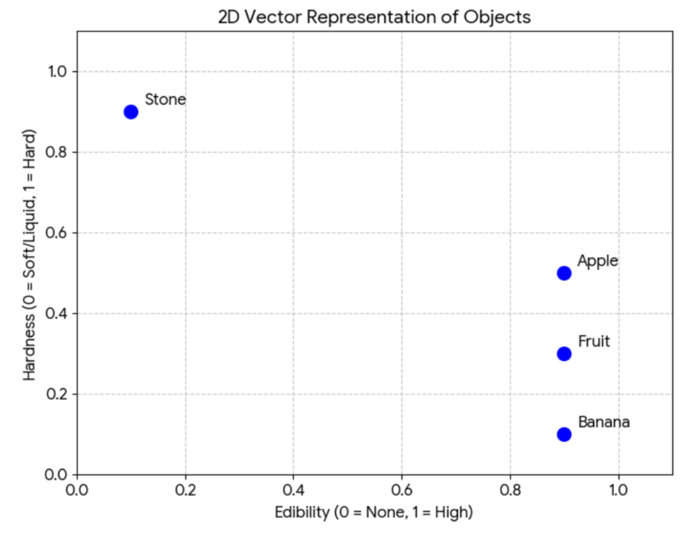
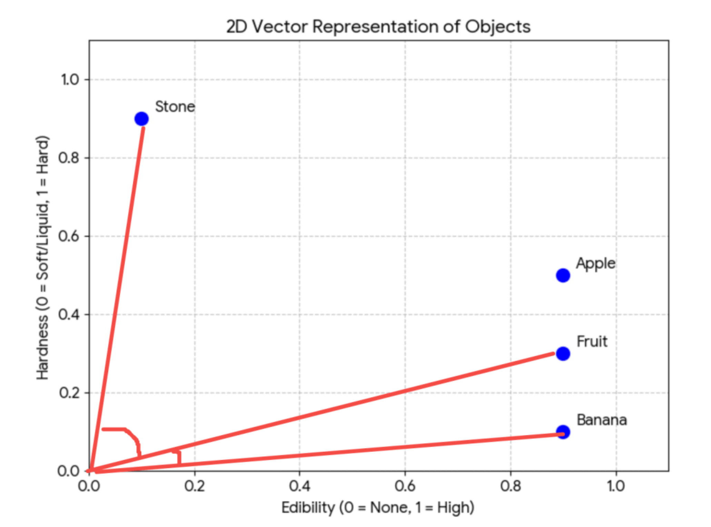
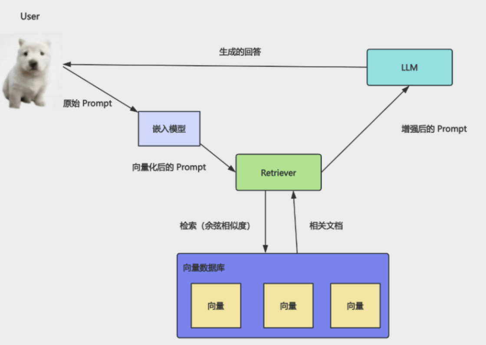

## 1
### 大模型幻觉
大模型所知道的知识，取决于在训练的时候给它的数据集。

如果你问它最近发生的事情，或者你企业内部私有文档的一些事情，它是不知道的。

但它很可能不会说自己不知道，而是会胡乱回答，也就是所谓的**幻觉**（以为自己知道）。

如何解决大模型的幻觉呢？

其实也很容易想到：

用户要查询的内容，我们先去内部知识库里查一下，把它放到 prompt 里再给大模型。

这样大模型通过这些文档知道了背景知识，就可以回答响应的问题了。

这就是`RAG`：`Retrieval 检索 - Augmented 增强 - Generation 生成`

去知识库里**检索**用户问的知识的相关文档片段，作为背景知识加到 prompt 里**增强**它，让大模型根据这些来**生成**回答。

### 向量计算实现语义检索
但有个问题：

用户问了一个问题，你怎么把相关的文档片段查出来呢？

比如用户查水果的信息，你要把苹果、香蕉、草莓的相关文档查出来。

想想怎么做？关键词搜索可以么？

很明显不行。

这种语义搜索就需要向量（Vector）了。

比如如果按照两个维度存储信息，分为可食用性、硬度：

* 维度 1： 食用性（0 = 无，1 = 高）

* 维度 2： 硬度（0 = 软/液体，1 = 硬）

那这几个概念大概是这样的向量：

* 水果：\[0.9, 0.3] 极高食用性，中低硬度

* 苹果：\[0.9, 0.5] 高食用性，硬度适中

* 香蕉：\[0.9, 0.1] 高食用性，非常软

* 石头：\[0.1, 0.9] 几乎不可食用，非常硬

可视化一下是这样：



明显可以看出来，苹果、水果、香蕉，这三个概念相关性很大，而水果和石头相关性就不大。

计算的话，可以通过夹角判断相似度，夹角越小相似度越高：



也就是**余弦相似度**（两个向量夹角的余弦值）。

当然，具体的向量数据肯定不会只有二维，可能会是几百维。

虽然高纬度没法可视化，但是原理是一样的。

我们都是通过两个概念对应的向量的余弦相似度来判断相关性。

也就是说**通过向量计算实现语义检索！**

是不是很巧妙！

这就是为啥 RAG 一般都结合向量化来做，虽然基于关键词来做也是 RAG，但是那种没法语义搜索，意义不大。

有的同学可能会问，那给你一个概念，怎么计算它的向量值呢？

这个需要用到专门的模型，叫**嵌入模型（Embedding Model）**。

### 嵌入模型（Embedding Model）

它和大语言模型（LLM）是不一样的，它的功能就只有把知识转成向量。

这个知识可以是文本、图片、语音等，向量化之后，就都可以实现语义搜索了！

我们写代码会用专门的嵌入模型，收费比大模型便宜很多很多。

那加上向量化之后的 RAG 流程是什么样的呢？



用户的 prompt 会通过嵌入模型转成向量，然后 retriever 基于这个向量去向量数据库中检索，找到相似的向量，把对应的文档块返回，加到 prompt 里作为背景知识，给大模型。

:::info retriever 是什么？
Retriever = 检索器

它的作用就是：根据用户问题的向量，从向量数据库中找到“最相关的文档块”。

在 RAG 里的完整流程：

1. 用户输入问题（prompt）
2. 用 embedding 模型转成向量
3. retriever 拿着这个向量
4. 去向量数据库做相似度搜索
5. 找到 TopK 相似文档
6. 把这些文档拼接进 prompt
7. 再交给 LLM 生成回答
:::

存的不是向量么？怎么记录向量关联的文档？

文档在向量化的时候，会在向量的元信息里记录来源文档。

综上，我们可以**在原始 prompt 给到大模型之前，查询下知识库，把相关的文档作为背景知识加入到 Prompt 里，再让大模型回答，这就是 RAG。**

RAG 要实现语义查询，需要基于向量来做，把文档向量化存储到向量数据，查询的时候也把 Prompt 向量化，去数据库中做相似度检索，这样就可以找到语义相近的文档块。

知道了什么是 RAG，安装一下用到的包：`pnpm install @langchain/classic`
我们来写代码试一下：
```js
import "dotenv/config";
import { ChatOpenAI, OpenAIEmbeddings } from "@langchain/openai";
import { Document } from "@langchain/core/documents";
import { MemoryVectorStore } from "@langchain/classic/vectorstores/memory";

const model = new ChatOpenAI({
  temperature: 0,
  model: process.env.MODEL_NAME,
  apiKey: process.env.OPENAI_API_KEY,
  configuration: {
    baseURL: process.env.OPENAI_BASE_URL,
  },
});

const embeddings = new OpenAIEmbeddings({
  apiKey: process.env.OPENAI_API_KEY,
  model: process.env.EMBEDDINGS_MODEL_NAME,
  configuration: {
    baseURL: process.env.OPENAI_BASE_URL,
  },
});

const documents = [
  new Document({
    pageContent: `光光是一个活泼开朗的小男孩，他有一双明亮的大眼睛，总是带着灿烂的笑容。光光最喜欢的事情就是和朋友们一起玩耍，他特别擅长踢足球，每次在球场上奔跑时，就像一道阳光一样充满活力。`,
    metadata: {
      chapter: 1,
      character: "光光",
      type: "角色介绍",
      mood: "活泼",
    },
  }),
  new Document({
    pageContent: `东东是光光最好的朋友，他是一个安静而聪明的男孩。东东喜欢读书和画画，他的画总是充满了想象力。虽然性格不同，但东东和光光从幼儿园就认识了，他们一起度过了无数个快乐的时光。`,
    metadata: {
      chapter: 2,
      character: "东东",
      type: "角色介绍",
      mood: "温馨",
    },
  }),
  new Document({
    pageContent: `有一天，学校要举办一场足球比赛，光光非常兴奋，他邀请东东一起参加。但是东东从来没有踢过足球，他担心自己会拖累光光。光光看出了东东的担忧，他拍着东东的肩膀说："没关系，我们一起练习，我相信你一定能行的！"`,
    metadata: {
      chapter: 3,
      character: "光光和东东",
      type: "友情情节",
      mood: "鼓励",
    },
  }),
  new Document({
    pageContent: `接下来的日子里，光光每天放学后都会教东东踢足球。光光耐心地教东东如何控球、传球和射门，而东东虽然一开始总是踢不好，但他从不放弃。东东也用自己的方式回报光光，他画了一幅画送给光光，画上是两个小男孩在球场上一起踢球的场景。`,
    metadata: {
      chapter: 4,
      character: "光光和东东",
      type: "友情情节",
      mood: "互助",
    },
  }),
  new Document({
    pageContent: `比赛那天终于到了，光光和东东一起站在球场上。虽然东东的技术还不够熟练，但他非常努力，而且他用自己的观察力帮助光光找到了对手的弱点。在关键时刻，东东传出了一个漂亮的球，光光接球后射门得分！他们赢得了比赛，更重要的是，他们的友谊变得更加深厚了。`,
    metadata: {
      chapter: 5,
      character: "光光和东东",
      type: "高潮转折",
      mood: "激动",
    },
  }),
  new Document({
    pageContent: `从那以后，光光和东东成为了学校里最要好的朋友。光光教东东运动，东东教光光画画，他们互相学习，共同成长。每当有人问起他们的友谊，他们总是笑着说："真正的朋友就是互相帮助，一起变得更好的人！"`,
    metadata: {
      chapter: 6,
      character: "光光和东东",
      type: "结局",
      mood: "欢乐",
    },
  }),
  new Document({
    pageContent: `多年后，光光成为了一名职业足球运动员，而东东成为了一名优秀的插画师。虽然他们走上了不同的道路，但他们的友谊从未改变。东东为光光设计了球衣上的图案，光光在每场比赛后都会给东东打电话分享喜悦。他们证明了，真正的友情可以跨越时间和距离，永远闪闪发光。`,
    metadata: {
      chapter: 7,
      character: "光光和东东",
      type: "尾声",
      mood: "温馨",
    },
  }),
];

const vectorStore = await MemoryVectorStore.fromDocuments(
  documents,
  embeddings
);

const retriever = vectorStore.asRetriever({ k: 3 });

const questions = ["东东和光光是怎么成为朋友的？"];

for (const question of questions) {
  console.log("=".repeat(80));
  console.log(`问题: ${question}`);
  console.log("=".repeat(80));

  // 使用 retriever 获取文档
  const retrievedDocs = await retriever.invoke(question);

  // 使用 similaritySearchWithScore 获取相似度评分
  const scoredResults = await vectorStore.similaritySearchWithScore(
    question,
    3
  );

  // 打印用到的文档和相似度评分
  console.log("\n【检索到的文档及相似度评分】");
  retrievedDocs.forEach((doc, i) => {
    // 找到对应的评分
    const scoredResult = scoredResults.find(
      ([scoredDoc]) => scoredDoc.pageContent === doc.pageContent
    );
    const score = scoredResult ? scoredResult[1] : null;
    const similarity = score !== null ? (1 - score).toFixed(4) : "N/A";

    console.log(`\n[文档 ${i + 1}] 相似度: ${similarity}`);
    console.log(`内容: ${doc.pageContent}`);
    console.log(
      `元数据: 章节=${doc.metadata.chapter}, 角色=${doc.metadata.character}, 类型=${doc.metadata.type}, 心情=${doc.metadata.mood}`
    );
  });

  // 构建 prompt
  const context = retrievedDocs
    .map((doc, i) => `[片段${i + 1}]\n${doc.pageContent}`)
    .join("\n\n━━━━━\n\n");

  const prompt = `你是一个讲友情故事的老师。基于以下故事片段回答问题，用温暖生动的语言。如果故事中没有提到，就说"这个故事里还没有提到这个细节"。

故事片段:
${context}

问题: ${question}

老师的回答:`;

  console.log("\n【AI 回答】");
  const response = await model.invoke(prompt);
  console.log(response.content);
  console.log("\n");
}
```

这里我们用到了大语言模型 LLM，还有嵌入模型 OpenAIEmbeddings：`import { ChatOpenAI, OpenAIEmbeddings } from "@langchain/openai"`

具体的 model name 在 .env 里配置下：`EMBEDDINGS_MODEL_NAME=text-embedding-v3`

这几个 Document 比较容易理解。这个故事直接问大模型，显然它是不知道的

知识库里存的就是这些文档，可以加一些元数据。

用嵌入模型把这些文档向量化之后存入向量数据库。

并且返回一个 retriever，k 是 3 就是返回余弦相似度最大的 3 个 Document。

用 retriever 把 query 传入，通过向量的余弦相似度，找到语义最相关的 3 个文档片段，传入 prompt


这就是增强后的 Prompt 了，之后问大模型问题的时候，它就有背景知识了。

跑一下：
```
mac@macdeMacBook-Air-3 aiagent % pnpm run hello-rag             

> ai@1.0.0 hello-rag /Users/mac/jiuci/github/aiagent
> node src/6/hello-rag.mjs

================================================================================
问题: 东东和光光是怎么成为朋友的？
================================================================================

【检索到的文档及相似度评分】

[文档 1] 相似度: 0.2206
内容: 东东是光光最好的朋友，他是一个安静而聪明的男孩。东东喜欢读书和画画，他的画总是充满了想象力。虽然性格不同，但东东和光光从幼儿园就认识了，他们一起度过了无数个快乐的时光。
元数据: 章节=2, 角色=东东, 类型=角色介绍, 心情=温馨

[文档 2] 相似度: 0.2428
内容: 从那以后，光光和东东成为了学校里最要好的朋友。光光教东东运动，东东教光光画画，他们互相学习，共同成长。每当有人问起他们的友谊，他们总是笑着说："真正的朋友就是互相帮助，一起变得更好的人！"
元数据: 章节=6, 角色=光光和东东, 类型=结局, 心情=欢乐

[文档 3] 相似度: 0.2933
内容: 比赛那天终于到了，光光和东东一起站在球场上。虽然东东的技术还不够熟练，但他非常努力，而且他用自己的观察力帮助光光找到了对手的弱点。在关键时刻，东东传出了一个漂亮的球，光光接球后射门得分！他们赢得了比赛，更重要的是，他们的友谊变得更加深厚了。
元数据: 章节=5, 角色=光光和东东, 类型=高潮转折, 心情=激动

【AI 回答】
东东和光光是在幼儿园的时候就认识的，他们一起度过了无数个快乐的时光。从那时起，他们便开始了一段深厚的友谊。
```

可以看到，根据你的问题，查询到了 3 个文档，然后大模型基于这些做了回答。

这样我们就跑通了 RAG 的流程！

回过头来再看下这张图：


是不是就很清楚了！

我们对 query 通过嵌入模型向量化，然后查询出了余弦相似度最大的 3 个文档，用它增强 Prompt 后再问大模型，大模型基于这个生成回答。

这就是 RAG。

## 总结
大模型训练完后，知识就不再更新了，它没法知道最新的一些信息，以及一些非互联网上公开的信息。

所以对于它不知道的东西，会胡乱回答，也就是幻觉问题。

解决这个问题的方式就是 RAG。

RAG 是检索、增强、生成，会基于用户的 query 去检索知识库，拿到相关文档后放到 Prompt 里增强它，之后给大大模型来生成回答。

检索肯定是要语义检索，但是关键词检索做不到这点，我们需要用向量来做，通过嵌入模型把知识向量化，这样就可以通过向量的余弦相似度（也就是夹角大小）来计算出两个知识的相关性，从而根据用户的 query 查询出相关的文档。

我们基于 LangChain 写了 RAG 的代码：

* fromDocuments api 基于 embeddings 模型把文档向量化存入数据库。

* asRetriever 指定查询相似度最大的几个文档。

* similaritySearchWithScore 相似度评分

* retriever.invoke 来查询文档。

只要你理解了 RAG 的流程，这些 api 自然也就会用了。

想一下，如果你要做公司内部文档的智能助手，是不是就可以用 RAG 来实现呢？

## 完整代码解释
```js
import "dotenv/config";
import { ChatOpenAI, OpenAIEmbeddings } from "@langchain/openai";
import { Document } from "@langchain/core/documents";
import { MemoryVectorStore } from "@langchain/classic/vectorstores/memory";

const model = new ChatOpenAI({
  temperature: 0,
  model: process.env.MODEL_NAME,
  apiKey: process.env.OPENAI_API_KEY,
  configuration: {
    baseURL: process.env.OPENAI_BASE_URL,
  },
});

// 初始化 Embedding 模型，用于将文本转换为向量
// 比如："光光喜欢踢足球" 会变成 [0.0231, -0.8123, 0.3312, ...] 这样的向量
// 向量的核心作用：用数学方式表达语义相似度
const embeddings = new OpenAIEmbeddings({
  apiKey: process.env.OPENAI_API_KEY,
  model: process.env.EMBEDDINGS_MODEL_NAME,
  configuration: {
    baseURL: process.env.OPENAI_BASE_URL,
  },
});

// 构建文档集合
const documents = [
  new Document({
    pageContent: `光光是一个活泼开朗的小男孩，他有一双明亮的大眼睛，总是带着灿烂的笑容。光光最喜欢的事情就是和朋友们一起玩耍，他特别擅长踢足球，每次在球场上奔跑时，就像一道阳光一样充满活力。`,
    metadata: {
      chapter: 1,
      character: "光光",
      type: "角色介绍",
      mood: "活泼",
    },
  }),
  new Document({
    pageContent: `东东是光光最好的朋友，他是一个安静而聪明的男孩。东东喜欢读书和画画，他的画总是充满了想象力。虽然性格不同，但东东和光光从幼儿园就认识了，他们一起度过了无数个快乐的时光。`,
    metadata: {
      chapter: 2,
      character: "东东",
      type: "角色介绍",
      mood: "温馨",
    },
  }),
  new Document({
    pageContent: `有一天，学校要举办一场足球比赛，光光非常兴奋，他邀请东东一起参加。但是东东从来没有踢过足球，他担心自己会拖累光光。光光看出了东东的担忧，他拍着东东的肩膀说："没关系，我们一起练习，我相信你一定能行的！"`,
    metadata: {
      chapter: 3,
      character: "光光和东东",
      type: "友情情节",
      mood: "鼓励",
    },
  }),
  new Document({
    pageContent: `接下来的日子里，光光每天放学后都会教东东踢足球。光光耐心地教东东如何控球、传球和射门，而东东虽然一开始总是踢不好，但他从不放弃。东东也用自己的方式回报光光，他画了一幅画送给光光，画上是两个小男孩在球场上一起踢球的场景。`,
    metadata: {
      chapter: 4,
      character: "光光和东东",
      type: "友情情节",
      mood: "互助",
    },
  }),
  new Document({
    pageContent: `比赛那天终于到了，光光和东东一起站在球场上。虽然东东的技术还不够熟练，但他非常努力，而且他用自己的观察力帮助光光找到了对手的弱点。在关键时刻，东东传出了一个漂亮的球，光光接球后射门得分！他们赢得了比赛，更重要的是，他们的友谊变得更加深厚了。`,
    metadata: {
      chapter: 5,
      character: "光光和东东",
      type: "高潮转折",
      mood: "激动",
    },
  }),
  new Document({
    pageContent: `从那以后，光光和东东成为了学校里最要好的朋友。光光教东东运动，东东教光光画画，他们互相学习，共同成长。每当有人问起他们的友谊，他们总是笑着说："真正的朋友就是互相帮助，一起变得更好的人！"`,
    metadata: {
      chapter: 6,
      character: "光光和东东",
      type: "结局",
      mood: "欢乐",
    },
  }),
  new Document({
    pageContent: `多年后，光光成为了一名职业足球运动员，而东东成为了一名优秀的插画师。虽然他们走上了不同的道路，但他们的友谊从未改变。东东为光光设计了球衣上的图案，光光在每场比赛后都会给东东打电话分享喜悦。他们证明了，真正的友情可以跨越时间和距离，永远闪闪发光。`,
    metadata: {
      chapter: 7,
      character: "光光和东东",
      type: "尾声",
      mood: "温馨",
    },
  }),
];

// 构建向量数据库
/**
 * 内部做了什么：
 * 1. 遍历 documents
 * 2. 调用 embeddings.embedDocuments()
 * 3. 得到每个文档的向量
 * 4. 存入内存数组
 */

// MemoryVectorStore 是纯内存存储，不持久化，进程结束就消失
// 真实项目会用：Pinecone、Milvus、Weaviate、pgvector
const vectorStore = await MemoryVectorStore.fromDocuments(
  documents,
  embeddings
);

// 构建 retriever 检索器
// 内部做了什么：
// 1. 调用 vectorStore.similaritySearch()
// 2. 得到相似度最高的 k 个文档
// 3. 返回文档集合
const retriever = vectorStore.asRetriever({ k: 3 });

const questions = ["东东和光光是怎么成为朋友的？"];

for (const question of questions) {
  console.log("=".repeat(80));
  console.log(`问题: ${question}`);
  console.log("=".repeat(80));

  // 使用 retriever 获取文档
  /**
   * 内部做了什么：
   * 1. 把 question 转成向量
   * 2. 和所有文档向量算距离
   * 3. 排序
   * 4. 取前 k 条
   */
  const retrievedDocs = await retriever.invoke(question);

  // 使用 similaritySearchWithScore 获取相似度评分
  const scoredResults = await vectorStore.similaritySearchWithScore(
    question,
    3
  );

  // 打印用到的文档和相似度评分
  console.log("\n【检索到的文档及相似度评分】");
  retrievedDocs.forEach((doc, i) => {
    // 找到对应的评分
    const scoredResult = scoredResults.find(
      ([scoredDoc]) => scoredDoc.pageContent === doc.pageContent
    );
    const score = scoredResult ? scoredResult[1] : null;
    // 相似度计算
    // 为什么是 1 - score？LangChain 的 MemoryVectorStore 默认使用：余弦距离（cosine distance）
    // 1 - score 表示相似度，score 越小，相似度越高
    const similarity = score !== null ? (1 - score).toFixed(4) : "N/A";

    console.log(`\n[文档 ${i + 1}] 相似度: ${similarity}`);
    console.log(`内容: ${doc.pageContent}`);
    console.log(
      `元数据: 章节=${doc.metadata.chapter}, 角色=${doc.metadata.character}, 类型=${doc.metadata.type}, 心情=${doc.metadata.mood}`
    );
  });

  // 构建 prompt
  const context = retrievedDocs
    .map((doc, i) => `[片段${i + 1}]\n${doc.pageContent}`)
    .join("\n\n━━━━━\n\n");

  const prompt = `你是一个讲友情故事的老师。基于以下故事片段回答问题，用温暖生动的语言。如果故事中没有提到，就说"这个故事里还没有提到这个细节"。

故事片段:
${context}

问题: ${question}

老师的回答:`;

  console.log("\n【AI 回答】");
  const response = await model.invoke(prompt);
  console.log(response.content);
  console.log("\n");
}
```