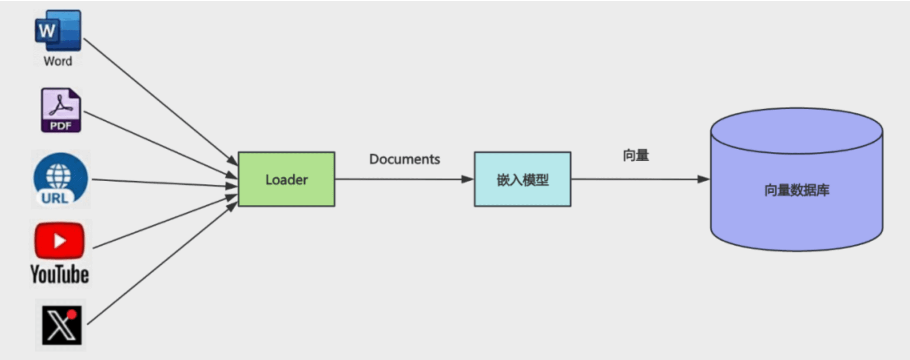
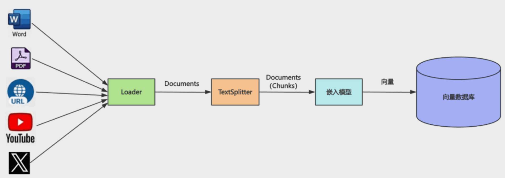

## 1
上节我们学了 RAG，它可以解决大模型的幻觉问题。

幻觉就是大模型对于它不知道的知识，会以为自己知道，然后胡乱回答。

解决方案 RAG 就是根据用户的 prompt，去知识库查询相关文档，加到 prompt 里给到大模型作为背景知识来回答。

这种相关文档的检索，要根据 prompt 的语义来搜，所以一般要结合向量来实现：

基于嵌入模型把文档向量化，存入向量数据库，查询的时候把 prompt 向量化，根据余弦相似度，来检索最相近的向量，然后把相关文档放到 prompt 里。

上节我们跑通了这个流程：prompt -> 向量 -> 检索 -> 相关文档 -> prompt + 相关文档 -> RAG

会查询出几个相似度最高的文档放到 prompt 里，大模型基于这些来回答。

但上节我们是直接创建的 Document 对象，然后用嵌入模型存入了向量数据库：`new Document` `MemoryVectorStore.fromDocuments`

实际上知识的来源可能有很多：

一个 word 文档、一个 pdf 文件、一个 youtube 视频、一个 url、一个 x 的推文等。

这种显然就不是直接创建 Document 对象了，而是要用各种 loader 来转换：



经过对应的 loader 处理后，变成 Document，之后再由嵌入模型向量化后存入知识库。

知识有各种来源，所以对应的各种 loader 也很多：

现在 langchain 文档里有 180+ loader：

https://docs.langchain.com/oss/python/integrations/document_loaders

你可以把各种知识来源通过 loader 转化为文档存入知识库。

当然，有的文档可能会很大，比如一个 pdf 文件可能是一本书的大小。

这种很明显不能直接把转化后的 Document 向量化，需要先拆分文档。

也就是需要 Splitter

## Splitter



大的文档经过 TextSplitter 分割后，变成一个个小文档，再给到嵌入模型做向量化。

分割最简单的就是按照字符，比如换行符 \n

但并不是每一行一个 Document，而是要设置一个 chunk size，按照换行符分割好的内容加入到这个 Chunk，当达到 chunk size 后，再继续生成下个 Chunk。

这个 Chunk 也是 Document 对象，只是文档内容是分割好的一个个大小合适的块。

我们写代码来跑一边这个流程。

创建 src/loader-and-splitter.mjs
```js
import "dotenv/config";
import "cheerio";
import { CheerioWebBaseLoader } from "@langchain/community/document_loaders/web/cheerio";

// 查找这边文章下面的.main-area 所有 p 标签
const cheerioLoader = new CheerioWebBaseLoader(
  "https://juejin.cn/post/7299346799211315212",
  {
    selector: ".main-area p",
  }
);

const documents = await cheerioLoader.load();

console.log(documents);
```

我们用 CheerioWebBaseLoader 这个 loader 来加载一个网页。

安装下用到的包：`pnpm install cheerio @langchain/community`

各种 loader 显然是社区维护，所以在 @langchain/community 这个包下。

这里我们用 loader 加载网页，取出 .main-area 下所有 p 标签的内容。

跑一下：
```
[
  Document {
    pageContent: '回家自由职业有一个半月了，这段时间确实过的挺开心的。虽然收入不稳定，但小册和公众号广告的收入也足够生活。我算过，在小县城的家里，早饭 10 元，午饭 60元（按照偶尔改善生活，买份酸菜鱼来算），晚饭 10 元，牛奶零食等 20 元，一天是 100 元。一年就是 36500 元。加上其他的支出，一年生活费差不多 5w 元。10 年是 50w，40 年就是 200 万元。而且还有利息，也就是说，我这辈子有 200 万就能正常活到去世了。我不会结婚，因为我喜欢一个人的状态，看小说、打游戏、自己想一些事情，不用迁就另一个人的感受，可以完全按照自己的想法来生活。并不是说我现在有 200 万了，我的意思是只要在二三十年内赚到这些就够了。我在大城市打工，可能一年能赚 50 万，在家里自由职业估计一年也就 20 万，但这也足够了。而且自由职业能赚到最宝贵的东西：时间。一方面是我自己的时间，我早上可以晚点起、晚上可以晚点睡、下午困了可以睡个午觉，可以写会东西打一会游戏，不想干的时候可以休息几天。而且我有大把的时间可以来做自己想做的事情，创造自己的东西。一方面是陪家人的时间，自从长大之后，明显感觉回家时间很少了，每年和爸妈也就见几天。前段时间我爸去世，我才发觉我和他最多的回忆还是在小时候在家里住的时候。我回家这段时间，每天都陪着我妈，一起做饭、吃饭，一起看电视，一起散步，一起经历各种事情。我买了个投影仪，很好用：这段时间我们看完了《皓镧传》、《锦绣未央》、《我的前半生》等电视剧，不得不说，和家人一起看电视剧确实很快乐、很上瘾。再就是我还养了只猫，猫的寿命就十几年，彼此陪伴的时间多一点挺好的：这些时间值多少钱？没法比较。回家这段时间我可能接广告多了一点，因为接一个广告能够我好多天的生活费呢。大家不要太排斥这个，可以忽略。其实我每次发广告总感觉对不起关注我的人，因为那些广告标题都要求起那种博人眼球的，不让改，就很难受。小册的话最近在写 Nest.js 的，但不只是 nest。就像学 java，我们除了学 spring 之外，还要学 mysql、redis、mongodb、rabbitmq、kafka、elasticsearch 等中间件，还有 docker、docker compose、k8s 等容器技术。学任何别的后端语言或框架，也是这一套，Nest.js 当然也是。所以我会在 Nest.js 小册里把各种后端中间件都讲一遍，然后会做一些全栈项目。写完估计得 200 节，大概会占据我半年到一年的时间。这段时间也经历过不爽的事情：这套房子是我爸还在的时候，他看邻居在青岛买的房子一周涨几十多万，而且我也提到过可能回青岛工作，然后他就非让我妈去买一套。当时 18 年青岛限购，而即墨刚撤市划区并入青岛，不限购，于是正好赶上房价最高峰买的。然而后来并没有去住。这套房子亏了其实不止 100 万。因为银行定存利息差不多 4%，200 万就是每年 8万利息，5年就是 40万。但我也看开了，少一百万多一百万对我影响大么？并不大，我还是每天花那些钱。相比之下，我爸的去世对我的打击更大，这对我的影响远远大于 100 万。我对钱没有太大的追求，对很多别人看重的东西也没啥追求。可能有的人有了钱，有了时间会选择环游中国，环游世界，我想我不会。我就喜欢宅在家里，写写东西、看看小说、打打游戏，这样活到去世我也不会有遗憾。我所追求的事情，在我小时候可能是想学医，一直觉得像火影里的纲手那样很酷，或者像大蛇丸那样研究一些东西也很酷。但近些年了解了学医其实也是按照固定的方法来治病，可能也是同样的东西重复好多年，并不是我想的那样。人这一辈子能把一件事做好就行。也就是要找到自己一生的使命，我觉得我找到了：我想写一辈子的技术文章。据说最高级的快乐有三种来源：自律、爱、创造。写文章对我来说就很快乐，我想他就是属于创造的那种快乐。此外，我还想把我的故事写下来，我成长的故事，我和东东的故事，那些或快乐或灰暗的日子，今生我一定会把它们写下来，只是现在时机还不成熟。世界那么大，我并不想去看看。我只想安居一隅，照顾好家人，写一辈子的技术文章，也写下自己的故事。这就是我的平凡之路。',
    metadata: {
      source: 'https://juejin.cn/post/7233327509919547452',
      title: '世界那么大，我并不想去看看回家自由职业有一个半月了，这段时间确实过的挺开心的。 虽然收入不稳定，但小册和公众号广告的收入 - 掘金'
    },
    id: undefined
  }
]
```

可以看到，网页内容中选择器的部分被取出来了，放入了 Document 对象。

现在的 Document 太大了，我们使用splitter分割一下

splitter 在 @langchain/textsplitters 这个包下，安装下：`pnpm install @langchain/textsplitters`

```js
import "dotenv/config";
import "cheerio";
import { ChatOpenAI, OpenAIEmbeddings } from "@langchain/openai";
import { RecursiveCharacterTextSplitter } from "@langchain/textsplitters";
import { MemoryVectorStore } from "@langchain/classic/vectorstores/memory";
import { CheerioWebBaseLoader } from "@langchain/community/document_loaders/web/cheerio";

const model = new ChatOpenAI({
  temperature: 0,
  model: process.env.MODEL_NAME,
  apiKey: process.env.OPENAI_API_KEY,
  configuration: {
    baseURL: process.env.OPENAI_BASE_URL,
  },
});

const embeddings = new OpenAIEmbeddings({
  apiKey: process.env.OPENAI_API_KEY,
  model: process.env.EMBEDDINGS_MODEL_NAME,
  configuration: {
    baseURL: process.env.OPENAI_BASE_URL,
  },
});

const cheerioLoader = new CheerioWebBaseLoader(
  "https://juejin.cn/post/7233327509919547452",
  {
    selector: ".main-area p",
  }
);

const documents = await cheerioLoader.load();

console.assert(documents.length === 1);
console.log(`Total characters: ${documents[0].pageContent.length}`);

const textSplitter = new RecursiveCharacterTextSplitter({
  chunkSize: 500, // 每个分块的字符数
  chunkOverlap: 50, // 分块之间的重叠字符数
  separators: ["。", "！", "？"], // 分割符，优先使用段落分隔
});

const splitDocuments = await textSplitter.splitDocuments(documents);

console.log(`文档分割完成，共 ${splitDocuments.length} 个分块\n`);

console.log("正在创建向量存储...");
const vectorStore = await MemoryVectorStore.fromDocuments(
  splitDocuments,
  embeddings
);
console.log("向量存储创建完成\n");

const retriever = vectorStore.asRetriever({ k: 2 });

const questions = ["父亲的去世对作者的人生态度产生了怎样的根本性逆转？"];

// RAG 流程：对每个问题进行检索和回答
for (const question of questions) {
  console.log("=".repeat(80));
  console.log(`问题: ${question}`);
  console.log("=".repeat(80));

  // 使用 retriever 获取相关文档
  const retrievedDocs = await retriever.invoke(question);

  // 使用 similaritySearchWithScore 获取相似度评分
  const scoredResults = await vectorStore.similaritySearchWithScore(
    question,
    2
  );

  // 打印检索到的文档和相似度评分
  console.log("\n【检索到的文档及相似度评分】");
  retrievedDocs.forEach((doc, i) => {
    // 找到对应的评分
    const scoredResult = scoredResults.find(
      ([scoredDoc]) => scoredDoc.pageContent === doc.pageContent
    );
    const score = scoredResult ? scoredResult[1] : null;
    const similarity = score !== null ? (1 - score).toFixed(4) : "N/A";

    console.log(`\n[文档 ${i + 1}] 相似度: ${similarity}`);
    console.log(`内容: ${doc.pageContent}`);
    if (doc.metadata && Object.keys(doc.metadata).length > 0) {
      console.log(`元数据:`, doc.metadata);
    }
  });

  // 构建 prompt
  const context = retrievedDocs
    .map((doc, i) => `[片段${i + 1}]\n${doc.pageContent}`)
    .join("\n\n━━━━━\n\n");

  const prompt = `你是一个文章辅助阅读助手，根据文章内容来解答：

文章内容：
${context}

问题: ${question}

你的回答:`;

  console.log("\n【AI 回答】");
  const response = await model.invoke(prompt);
  console.log(response.content);
  console.log("\n");
}
```

我们指定了 chunkSize 是 400 个字符，然后前后重复 50 个字符。

分割符是优先 。 其次 ！？

跑一下：
```
mac@macdeMacBook-Air-3 aiagent % pnpm run loader-and-splitter         

> ai@1.0.0 loader-and-splitter /Users/mac/jiuci/github/aiagent
> node src/7/loader-and-splitter.mjs

Total characters: 1732
文档分割完成，共 4 个分块

正在创建向量存储...
向量存储创建完成

================================================================================
问题: 父亲的去世对作者的人生态度产生了怎样的根本性逆转？
================================================================================

【检索到的文档及相似度评分】

[文档 1] 相似度: 0.4021
内容: 。但我也看开了，少一百万多一百万对我影响大么？并不大，我还是每天花那些钱。相比之下，我爸的去世对我的打击更大，这对我的影响远远大于 100 万。我对钱没有太大的追求，对很多别人看重的东西也没啥追求。可能有的人有了钱，有了时间会选择环游中国，环游世界，我想我不会。我就喜欢宅在家里，写写东西、看看小说、打打游戏，这样活到去世我也不会有遗憾。我所追求的事情，在我小时候可能是想学医，一直觉得像火影里的纲手那样很酷，或者像大蛇丸那样研究一些东西也很酷。但近些年了解了学医其实也是按照固定的方法来治病，可能也是同样的东西重复好多年，并不是我想的那样。人这一辈子能把一件事做好就行。也就是要找到自己一生的使命，我觉得我找到了：我想写一辈子的技术文章。据说最高级的快乐有三种来源：自律、爱、创造。写文章对我来说就很快乐，我想他就是属于创造的那种快乐。此外，我还想把我的故事写下来，我成长的故事，我和东东的故事，那些或快乐或灰暗的日子，今生我一定会把它们写下来，只是现在时机还不成熟。世界那么大，我并不想去看看。我只想安居一隅，照顾好家人，写一辈子的技术文章，也写下自己的故事。这就是我的平凡之路。
元数据: {
  source: 'https://juejin.cn/post/7233327509919547452',
  title: '世界那么大，我并不想去看看回家自由职业有一个半月了，这段时间确实过的挺开心的。 虽然收入不稳定，但小册和公众号广告的收入 - 掘金',
  loc: { lines: { from: 1, to: 1 } }
}

[文档 2] 相似度: 0.5217
内容: 。而且我有大把的时间可以来做自己想做的事情，创造自己的东西。一方面是陪家人的时间，自从长大之后，明显感觉回家时间很少了，每年和爸妈也就见几天。前段时间我爸去世，我才发觉我和他最多的回忆还是在小时候在家里住的时候。我回家这段时间，每天都陪着我妈，一起做饭、吃饭，一起看电视，一起散步，一起经历各种事情。我买了个投影仪，很好用：这段时间我们看完了《皓镧传》、《锦绣未央》、《我的前半生》等电视剧，不得不说，和家人一起看电视剧确实很快乐、很上瘾。再就是我还养了只猫，猫的寿命就十几年，彼此陪伴的时间多一点挺好的：这些时间值多少钱？没法比较。回家这段时间我可能接广告多了一点，因为接一个广告能够我好多天的生活费呢。大家不要太排斥这个，可以忽略。其实我每次发广告总感觉对不起关注我的人，因为那些广告标题都要求起那种博人眼球的，不让改，就很难受。小册的话最近在写 Nest.js 的，但不只是 nest
元数据: {
  source: 'https://juejin.cn/post/7233327509919547452',
  title: '世界那么大，我并不想去看看回家自由职业有一个半月了，这段时间确实过的挺开心的。 虽然收入不稳定，但小册和公众号广告的收入 - 掘金',
  loc: { lines: { from: 1, to: 1 } }
}

【AI 回答】
父亲的去世对作者的人生态度产生了根本性的逆转。原本作者对金钱和物质生活有着较高的追求，甚至梦想着环游中国和世界。然而，父亲的离世使他对生活的看法发生了深刻的变化。他认为相比于物质财富，家庭和亲情的重要性远超一切。因此，他决定放弃对物质的追求，选择更加简单和充实的生活方式，比如宅在家里写技术文章、与家人共度时光等。这种转变体现了他对生命意义的重新思考和对家庭责任的重视。
```

整体流程和上节一样：用嵌入模型把文档存入向量数据库，先检索和用户的问题相似度最高的 2 个文档，把它加入 prompt，然后调用大模型基于文档回答。

可以看到，loader 加载了文档，用 splitter 分成了 4 个分块（chunk）。

回答的时候检索了相似度最高的 2 个文档块，基于这个做了回答。

## 总结
这节我们学了 loader 和 splitter。

loader 可以从各种地方加载内容作为 Document，比如 word、pdf、网页、youtube、x 的推文等等。

现在有 180+ 的 loader，社区维护，所以是在 @langchain/community 这个包。

加载后的 Document 可能会很大，需要分割成一个个小的文档，所以需要 Splitter。

splitter 在 @langchain/text-splitters 这个包。

我们写了一个读取网页里的文章内容作为文档，分割后放入知识库的 RAG 案例。

这节只要理解这俩概念就行，具体 loader 和 splitter 有很多类型，下节我们详细过一遍
