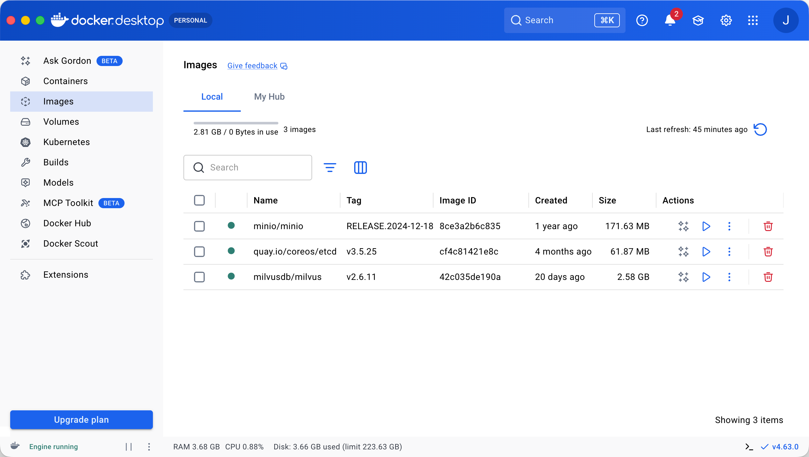
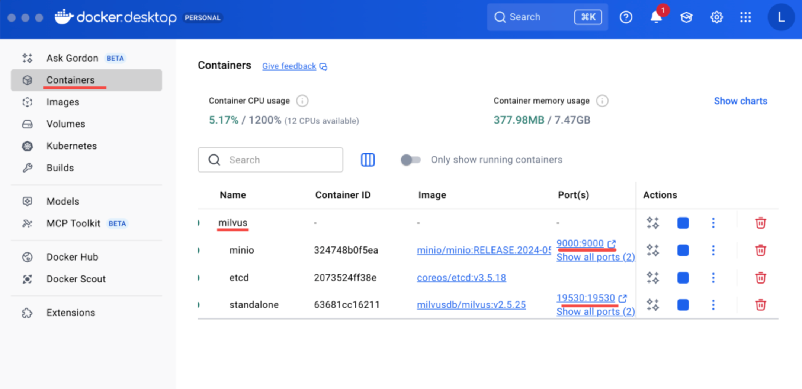

## 前言

前面我们实现了 RAG，文档向量化放到向量数据库，每次查询根据向量化的 query 去数据库做相似度匹配，查出相关文档放到 prompt 里给大模型，大模型来生成回答。

但之前向量数据库是放在内存里的：`import { MemoryVectorStore } from "@langchain/classic/vectorstores/memory"`

而实际上 AI Agent 产品都会用 Milvus 这种向量数据库。

就像 web 应用会把数据存在 mysql 里，基于对数据的增删改查实现各种业务功能。然后根据 id 或者关键词去关联查询一系列表的数据。

而 AI Agent 应用会把知识、记忆放在 Milvus 数据库中，基于对知识的检索、增删改实现各种功能。

不同的是这里涉及到向量化，就需要嵌入模型，比如检索、新增、修改。但是删除直接根据 id，不需要嵌入模型。

那把数据存在 MySQL 里，和现在存在 Milvus 里有什么不同么？

你在 MySQL 里查询数据，只能用 id、关键词匹配。

而在 Milvus 里查询知识，是根据语义匹配的，你可以用自然语言来检索。

这两种功能一般都需要。

比如你做了一个 AI 日记本：

- 查询日记列表可以从 MySQL 来查，不走 AI
- 查询“我哪几天的日记心情比较好”，就要去 Milvus 做向量相似度检索，然后交给 AI 生成回答

所以一般会做 mysql 和 milvus 的双写，也就是同时对两个数据库做增删改，保持数据同步。

这节我们先学下 Milvus，做下增删改查，跑通基于 Mivlus 的 RAG 流程。

## Milvus

### docker 下载

本地跑 Milvus 需要安装 docker：https://www.docker.com/

点击 do'wnload docker desktop，选择电脑的系统下载

下载后安装，会有桌面端和命令行工具。

打开命令行输入docker，如果命令可用了，就代表装好了。(先安装再输入)

打开桌面端：

- images 是下载的镜像列表。
- containers 是镜像跑起来的容器列表。

这里对 docker 不熟也没关系，下节会讲，这节重点是 mivlus。

电脑中创建一个目录用来放 milvus 的 docker 配置文件和数据：

```
mkdir milvus
cd milvus
```

从这里下载 milvus 的 docker compose 配置文件：https://github.com/milvus-io/milvus/releases，点击Assets，找到milvus-standalone-docker-compose.yml点击下载

把配置文件拿到刚才这个目录，跑一下 docker compose：`docker compose -f ./milvus-standalone-docker-compose.yml up -d`

用到的镜像根据配置文件自动下载。

下载的镜像：

跑起来的容器：

milvus 数据库是跑在 19530 这个端口。

访问这个 url 可以做健康度检查：http://localhost:9091/healthz，打开显示 ok 就是正常的

然后我们用 node 来连接 milvus 服务做增删改查。

### 使用 milvus

安装 milvus 的 node sdk：`pnpm install @zilliz/milvus2-sdk-node`

创建 src/insert-milvus.mjs：

```js
import 'dotenv/config'
import {
  MilvusClient,
  DataType,
  MetricType,
  IndexType,
} from '@zilliz/milvus2-sdk-node'
import { OpenAIEmbeddings } from '@langchain/openai'

const COLLECTION_NAME = 'ai_diary'
const VECTOR_DIM = 1024

const embeddings = new OpenAIEmbeddings({
  apiKey: process.env.OPENAI_API_KEY,
  model: process.env.EMBEDDINGS_MODEL_NAME,
  configuration: {
    baseURL: process.env.OPENAI_BASE_URL,
  },
  dimensions: VECTOR_DIM,
})

const client = new MilvusClient({
  address: 'localhost:19530',
})

async function getEmbedding(text) {
  const result = await embeddings.embedQuery(text)
  return result
}

async function main() {
  try {
    console.log('Connecting to Milvus...')
    await client.connectPromise
    console.log('✓ Connected\n')

    // 创建集合
    console.log('Creating collection...')
    await client.createCollection({
      collection_name: COLLECTION_NAME,
      fields: [
        {
          name: 'id',
          data_type: DataType.VarChar,
          max_length: 50,
          is_primary_key: true,
        },
        { name: 'vector', data_type: DataType.FloatVector, dim: VECTOR_DIM },
        { name: 'content', data_type: DataType.VarChar, max_length: 5000 },
        { name: 'date', data_type: DataType.VarChar, max_length: 50 },
        { name: 'mood', data_type: DataType.VarChar, max_length: 50 },
        {
          name: 'tags',
          data_type: DataType.Array,
          element_type: DataType.VarChar,
          max_capacity: 10,
          max_length: 50,
        },
      ],
    })

    console.log('Collection created')

    // 创建索引
    console.log('\nCreating index...')
    await client.createIndex({
      collection_name: COLLECTION_NAME,
      field_name: 'vector',
      index_type: IndexType.IVF_FLAT,
      metric_type: MetricType.COSINE,
      params: { nlist: 1024 },
    })
    console.log('Index created')

    // 加载集合
    console.log('\nLoading collection...')
    await client.loadCollection({ collection_name: COLLECTION_NAME })
    console.log('Collection loaded')

    // 插入日记数据
    console.log('\nInserting diary entries...')
    const diaryContents = [
      {
        id: 'diary_001',
        content:
          '今天天气很好，去公园散步了，心情愉快。看到了很多花开了，春天真美好。',
        date: '2026-01-10',
        mood: 'happy',
        tags: ['生活', '散步'],
      },
      {
        id: 'diary_002',
        content:
          '今天工作很忙，完成了一个重要的项目里程碑。团队合作很愉快，感觉很有成就感。',
        date: '2026-01-11',
        mood: 'excited',
        tags: ['工作', '成就'],
      },
      {
        id: 'diary_003',
        content:
          '周末和朋友去爬山，天气很好，心情也很放松。享受大自然的感觉真好。',
        date: '2026-01-12',
        mood: 'relaxed',
        tags: ['户外', '朋友'],
      },
      {
        id: 'diary_004',
        content:
          '今天学习了 Milvus 向量数据库，感觉很有意思。向量搜索技术真的很强大。',
        date: '2026-01-12',
        mood: 'curious',
        tags: ['学习', '技术'],
      },
      {
        id: 'diary_005',
        content:
          '晚上做了一顿丰盛的晚餐，尝试了新菜谱。家人都说很好吃，很有成就感。',
        date: '2026-01-13',
        mood: 'proud',
        tags: ['美食', '家庭'],
      },
    ]

    console.log('Generating embeddings...')
    const diaryData = await Promise.all(
      diaryContents.map(async diary => ({
        ...diary,
        vector: await getEmbedding(diary.content),
      })),
    )

    const insertResult = await client.insert({
      collection_name: COLLECTION_NAME,
      data: diaryData,
    })
    console.log(`✓ Inserted ${insertResult.insert_cnt} records\n`)
  } catch (error) {
    console.error('Error:', error.message)
  }
}

main()
```

在 milvus 里是这样存储数据的：

Milvus 中可以创建多个 database，每个 database 下有多个 collection。

每个 collection 必须定义 schema。

插入的数据（entity）必须符合 schema。

如果希望高效快速检索相似度，需要对向量字段创建 index。

:::info 补充

**Database** 主要用于：

- 多租户隔离
- 项目隔离
- 逻辑命名空间

类似于 mysql 的 Database，存多张表的

**Collection** ≈ 表

Collection 里存的是“行数据”，每一行叫 **entity**，每个 entity 必须符合 schema 定义。

**Schema** 定义的是：

- 主键字段（必须）
- 向量字段（必须）
- 标量字段（可选）

例如：

```json
{
  id: Int64,
  embedding: FloatVector(1536),
  title: VarChar,
  category: VarChar
}
```

然后你插入：

```json
{
  id: 1,
  embedding: [...],
  title: "Milvus原理",
  category: "AI"
}
```

这条就是 entity。

**索引**

Milvus 即使不建索引也能查

如果你不建 index：

- 会使用 FLAT（暴力搜索）
- 速度慢
- 适合小数据量

索引是为了“加速”，不是为了“能不能查”

:::

就是这样：

```js
await client.createCollection({
  collection_name: COLLECTION_NAME,
  fields: [
    {
      name: 'id',
      data_type: DataType.VarChar,
      max_length: 50,
      is_primary_key: true,
    },
    { name: 'vector', data_type: DataType.FloatVector, dim: VECTOR_DIM },
    { name: 'content', data_type: DataType.VarChar, max_length: 5000 },
    { name: 'date', data_type: DataType.VarChar, max_length: 50 },
    { name: 'mood', data_type: DataType.VarChar, max_length: 50 },
    {
      name: 'tags',
      data_type: DataType.Array,
      element_type: DataType.VarChar,
      max_capacity: 10,
      max_length: 50,
    },
  ],
})
```

这就是 schema，创建 collection 集合的时候需要指定。

具体字段包含 id、vector、content、date、mode、tags

其实和 mysql 的表差不多，唯一的区别是 vector 这个字段，我们设置了 FloatVector 类型，也就是向量，指定维度是 1024 维。这样我们后面插入数据，也要把嵌入模型指定为 1024 的维度。

```js
const VECTOR_DIM = 1024

const embeddings = new OpenAIEmbeddings({
  apiKey: process.env.OPENAI_API_KEY,
  model: process.env.EMBEDDINGS_MODEL_NAME,
  configuration: {
    baseURL: process.env.OPENAI_BASE_URL,
  },
  dimensions: VECTOR_DIM,
})
```

这个集合名是 ai_diary，用来放日记数据的：`const COLLECTION_NAME = "ai_diary";`

向量字段需要建立索引：

```js
await client.createIndex({
  collection_name: COLLECTION_NAME,
  field_name: 'vector',
  index_type: IndexType.IVF_FLAT,
  metric_type: MetricType.COSINE,
  params: { nlist: 1024 },
})
```

metric_type 指定用余弦相似度作为距离度量：`metric_type: MetricType.COSINE`

之后就可以插入数据了：

```js
const diaryData = await Promise.all(
  diaryContents.map(async diary => ({
    ...diary,
    vector: await getEmbedding(diary.content),
  })),
)

const insertResult = await client.insert({
  collection_name: COLLECTION_NAME,
  data: diaryData,
})
```

插入数据比较简单，就是调用 insert 方法，指定 collection name 和 data

只不过这里的 vector 字段需要用嵌入模型来向量化一下：`await embeddings.embedQuery(text)`

使用 node 运行一下这段代码

```
mac@macdeMacBook-Air-3 aiagent % pnpm run insert-milvus

> ai@1.0.0 insert-milvus /Users/mac/jiuci/github/aiagent
> node src/09/insert-milvus.mjs

Connecting to Milvus...
✓ Connected

Creating collection...
Collection created

Creating index...
Index created

Loading collection...
Collection loaded

Inserting diary entries...
Generating embeddings...
✓ Inserted 5 records
```

### 查询

接下来做一下查询。

先不着急用代码写，我们可以安装一个 GUI 工具：https://github.com/zilliztech/attu?tab=readme-ov-file#quick-start

下载安装，用默认配置连接就行

链接之后可以看到所有的集合，集合下所有的 Entity


可以看到我们刚创建的 ai_diary 的 collection，以及下面的 5 条数据

vector 是向量，用来做语义检索的。

其他字段是元信息，会一并查出来返回。

我们写下查询，创建 src/query-milvus.mjs

```js
import 'dotenv/config'
import { MilvusClient, MetricType } from '@zilliz/milvus2-sdk-node'
import { OpenAIEmbeddings } from '@langchain/openai'

const COLLECTION_NAME = 'ai_diary'
const VECTOR_DIM = 1024

const embeddings = new OpenAIEmbeddings({
  apiKey: process.env.OPENAI_API_KEY,
  model: process.env.EMBEDDINGS_MODEL_NAME,
  configuration: {
    baseURL: process.env.OPENAI_BASE_URL,
  },
  dimensions: VECTOR_DIM,
})

const client = new MilvusClient({
  address: 'localhost:19530',
})

async function getEmbedding(text) {
  const result = await embeddings.embedQuery(text)
  return result
}

async function main() {
  try {
    console.log('Connecting to Milvus...')
    await client.connectPromise
    console.log('✓ Connected\n')

    // 向量搜索
    console.log('Searching for similar diary entries...')
    const query = '我想看看关于户外活动的日记'
    console.log(`Query: "${query}"\n`)

    const queryVector = await getEmbedding(query)
    const searchResult = await client.search({
      collection_name: COLLECTION_NAME,
      vector: queryVector,
      limit: 2,
      metric_type: MetricType.COSINE,
      output_fields: ['id', 'content', 'date', 'mood', 'tags'],
    })

    console.log(`Found ${searchResult.results.length} results:\n`)
    searchResult.results.forEach((item, index) => {
      console.log(`${index + 1}. [Score: ${item.score.toFixed(4)}]`)
      console.log(`   ID: ${item.id}`)
      console.log(`   Date: ${item.date}`)
      console.log(`   Mood: ${item.mood}`)
      console.log(`   Tags: ${item.tags?.join(', ')}`)
      console.log(`   Content: ${item.content}\n`)
    })
  } catch (error) {
    console.error('Error:', error.message)
  }
}

main()
```

是把 query 向量化，做余弦相似度的检索：

```js
const query = '我想看看关于户外活动的日记'
console.log(`Query: "${query}"\n`)

const queryVector = await getEmbedding(query)
const searchResult = await client.search({
  collection_name: COLLECTION_NAME,
  vector: queryVector,
  limit: 2,
  metric_type: MetricType.COSINE,
  output_fields: ['id', 'content', 'date', 'mood', 'tags'],
})
```

node 运行一下：

```
mac@macdeMacBook-Air-3 aiagent % pnpm run query-milvus

> ai@1.0.0 query-milvus /Users/mac/jiuci/github/aiagent
> node src/09/query-milvus.mjs

Connecting to Milvus...
✓ Connected

Searching for similar diary entries...
Query: "我想看看关于户外活动的日记"

Found 2 results:

1. [Score: 0.6575]
   ID: diary_003
   Date: 2026-01-12
   Mood: relaxed
   Tags: 户外, 朋友
   Content: 周末和朋友去爬山，天气很好，心情也很放松。享受大自然的感觉真好。

2. [Score: 0.5789]
   ID: diary_001
   Date: 2026-01-10
   Mood: happy
   Tags: 生活, 散步
   Content: 今天天气很好，去公园散步了，心情愉快。看到了很多花开了，春天真美好。
```

你用 MySQL 做关键词搜索可以做到么？

很明显不能，这就是为啥用向量数据库！

### 与 RAG 结合

然后我们把它和 RAG 流程结合来跑一下完整流程

创建 src/rag.mjs：

```js
import 'dotenv/config'
import { MilvusClient, MetricType } from '@zilliz/milvus2-sdk-node'
import { ChatOpenAI, OpenAIEmbeddings } from '@langchain/openai'

const COLLECTION_NAME = 'ai_diary'
const VECTOR_DIM = 1024

// 初始化 OpenAI Chat 模型
const model = new ChatOpenAI({
  temperature: 0.7,
  model: process.env.MODEL_NAME,
  apiKey: process.env.OPENAI_API_KEY,
  configuration: {
    baseURL: process.env.OPENAI_BASE_URL,
  },
})

// 初始化 Embeddings 模型
const embeddings = new OpenAIEmbeddings({
  apiKey: process.env.OPENAI_API_KEY,
  model: process.env.EMBEDDINGS_MODEL_NAME,
  configuration: {
    baseURL: process.env.OPENAI_BASE_URL,
  },
  dimensions: VECTOR_DIM,
})

// 初始化 Milvus 客户端
const client = new MilvusClient({
  address: 'localhost:19530',
})

/**
 * 获取文本的向量嵌入
 */
async function getEmbedding(text) {
  const result = await embeddings.embedQuery(text)
  return result
}

/**
 * 从 Milvus 中检索相关的日记条目
 */
async function retrieveRelevantDiaries(question, k = 2) {
  try {
    // 生成问题的向量
    const queryVector = await getEmbedding(question)

    // 在 Milvus 中搜索相似的日记
    const searchResult = await client.search({
      collection_name: COLLECTION_NAME,
      vector: queryVector,
      limit: k,
      metric_type: MetricType.COSINE,
      output_fields: ['id', 'content', 'date', 'mood', 'tags'],
    })

    return searchResult.results
  } catch (error) {
    console.error('检索日记时出错:', error.message)
    return []
  }
}

/**
 * 使用 RAG 回答关于日记的问题
 */
async function answerDiaryQuestion(question, k = 2) {
  try {
    console.log('='.repeat(80))
    console.log(`问题: ${question}`)
    console.log('='.repeat(80))

    // 1. 检索相关日记
    console.log('\n【检索相关日记】')
    const retrievedDiaries = await retrieveRelevantDiaries(question, k)

    if (retrievedDiaries.length === 0) {
      console.log('未找到相关日记')
      return '抱歉，我没有找到相关的日记内容。'
    }

    // 2. 打印检索到的日记及相似度
    retrievedDiaries.forEach((diary, i) => {
      console.log(`\n[日记 ${i + 1}] 相似度: ${diary.score.toFixed(4)}`)
      console.log(`日期: ${diary.date}`)
      console.log(`心情: ${diary.mood}`)
      console.log(`标签: ${diary.tags?.join(', ')}`)
      console.log(`内容: ${diary.content}`)
    })

    // 3. 构建上下文
    const context = retrievedDiaries
      .map((diary, i) => {
        return `[日记 ${i + 1}]
日期: ${diary.date}
心情: ${diary.mood}
标签: ${diary.tags?.join(', ')}
内容: ${diary.content}`
      })
      .join('\n\n━━━━━\n\n')

    // 4. 构建 prompt
    const prompt = `你是一个温暖贴心的 AI 日记助手。基于用户的日记内容回答问题，用亲切自然的语言。

请根据以下日记内容回答问题：
${context}

用户问题: ${question}

回答要求：
1. 如果日记中有相关信息，请结合日记内容给出详细、温暖的回答
2. 可以总结多篇日记的内容，找出共同点或趋势
3. 如果日记中没有相关信息，请温和地告知用户
4. 用第一人称"你"来称呼日记的作者
5. 回答要有同理心，让用户感到被理解和关心

AI 助手的回答:`

    // 5. 调用 LLM 生成回答
    console.log('\n【AI 回答】')
    const response = await model.invoke(prompt)
    console.log(response.content)
    console.log('\n')

    return response.content
  } catch (error) {
    console.error('回答问题时出错:', error.message)
    return '抱歉，处理您的问题时出现了错误。'
  }
}

async function main() {
  try {
    console.log('连接到 Milvus...')
    await client.connectPromise
    console.log('✓ 已连接\n')

    await answerDiaryQuestion('我最近做了什么让我感到快乐的事情？', 2)
  } catch (error) {
    console.error('错误:', error.message)
  }
}

main()
```

这次把温度调高点，让 AI 可以发挥创造性回答：`temperature: 0.7`

我们先把 query 向量化，去 Milvus 里查出相关数据：

```js
async function retrieveRelevantDiaries(question, k = 2) {
  try {
    // 生成问题的向量
    const queryVector = await getEmbedding(question)

    // 在 Milvus 中搜索相似的日记
    const searchResult = await client.search({
      collection_name: COLLECTION_NAME,
      vector: queryVector,
      limit: k,
      metric_type: MetricType.COSINE,
      output_fields: ['id', 'content', 'date', 'mood', 'tags'],
    })

    return searchResult.results
  } catch (error) {
    console.error('检索日记时出错:', error.message)
    return []
  }
}
```

跑一下：

```
mac@macdeMacBook-Air-3 aiagent % pnpm run rag

> ai@1.0.0 rag /Users/mac/jiuci/github/aiagent
> node src/09/rag.mjs

连接到 Milvus...
✓ 已连接

================================================================================
问题: 我最近做了什么让我感到快乐的事情？
================================================================================

【检索相关日记】

[日记 1] 相似度: 0.6315
日期: 2026-01-11
心情: excited
标签: 工作, 成就
内容: 今天工作很忙，完成了一个重要的项目里程碑。团队合作很愉快，感觉很有成就感。

[日记 2] 相似度: 0.6185
日期: 2026-01-13
心情: proud
标签: 美食, 家庭
内容: 晚上做了一顿丰盛的晚餐，尝试了新菜谱。家人都说很好吃，很有成就感。

【AI 回答】
你最近确实做了很多让自己感到快乐的事情！在2026年1月11日的工作日，你完成了重要项目的里程碑，团队合作愉快，这让你感到非常有成就感。而在2026年1月13日晚上，你做了一顿丰盛的晚餐，并且尝试了新的菜谱，家人对你的厨艺赞不绝口，这也让你感到非常骄傲和满足。这两件事情都充分展示了你在工作和家庭生活中的积极表现，让你的心情充满了快乐和满足感。继续保持这种积极向上的态度吧！
```

可以看到，大模型基于我们的问题，查询了相关的日记，然后做了回答。

完全是根据语义检索的！

实际的 AI Agent 里就是这样来做 RAG 的。

### 更新

最后，我们做了 query、insert，自然要把 update 和 delete 也测一下：

创建 src/update-milvus.mjs

```js
import 'dotenv/config'
import { MilvusClient } from '@zilliz/milvus2-sdk-node'
import { OpenAIEmbeddings } from '@langchain/openai'

const COLLECTION_NAME = 'ai_diary'
const VECTOR_DIM = 1024

const embeddings = new OpenAIEmbeddings({
  apiKey: process.env.OPENAI_API_KEY,
  model: process.env.EMBEDDINGS_MODEL_NAME,
  configuration: {
    baseURL: process.env.OPENAI_BASE_URL,
  },
  dimensions: VECTOR_DIM,
})

const client = new MilvusClient({
  address: 'localhost:19530',
})

async function getEmbedding(text) {
  const result = await embeddings.embedQuery(text)
  return result
}

async function main() {
  try {
    console.log('Connecting to Milvus...')
    await client.connectPromise
    console.log('✓ Connected\n')

    // 更新数据（Milvus 通过 upsert 实现更新）
    console.log('Updating diary entry...')
    const updateId = 'diary_001'
    const updatedContent = {
      id: updateId,
      content:
        '今天下了一整天的雨，心情很糟糕。工作上遇到了很多困难，感觉压力很大。一个人在家，感觉特别孤独。',
      date: '2026-01-10',
      mood: 'sad',
      tags: ['生活', '散步', '朋友'],
    }

    console.log('Generating new embedding...')
    const vector = await getEmbedding(updatedContent.content)
    const updateData = { ...updatedContent, vector }

    const result = await client.upsert({
      collection_name: COLLECTION_NAME,
      data: [updateData],
    })

    console.log(`✓ Updated diary entry: ${updateId}`)
    console.log(`  New content: ${updatedContent.content}`)
    console.log(`  New mood: ${updatedContent.mood}`)
    console.log(`  New tags: ${updatedContent.tags.join(', ')}\n`)
  } catch (error) {
    console.error('Error:', error.message)
  }
}

main()
```

因为要向量化，所以也要嵌入模型。

调用 upsert 方法，数据里带上 id 即可。

```
mac@macdeMacBook-Air-3 aiagent % pnpm run update-milvus

> ai@1.0.0 update-milvus /Users/mac/jiuci/github/aiagent
> node src/09/update-milvus.mjs

Connecting to Milvus...
✓ Connected

Updating diary entry...
Generating new embedding...
✓ Updated diary entry: diary_001
  New content: 今天下了一整天的雨，心情很糟糕。工作上遇到了很多困难，感觉压力很大。一个人在家，感觉特别孤独。
  New mood: sad
  New tags: 生活, 散步, 朋友
```

### 删除

创建 src/delete-milvus.mjs

```js
import 'dotenv/config'
import { MilvusClient } from '@zilliz/milvus2-sdk-node'

const COLLECTION_NAME = 'ai_diary'

const client = new MilvusClient({
  address: 'localhost:19530',
})

async function main() {
  try {
    console.log('Connecting to Milvus...')
    await client.connectPromise
    console.log('✓ Connected\n')

    // 删除单条数据
    console.log('Deleting diary entry...')
    const deleteId = 'diary_005'

    const result = await client.delete({
      collection_name: COLLECTION_NAME,
      filter: `id == "${deleteId}"`,
    })

    console.log(`✓ Deleted ${result.delete_cnt} record(s)`)
    console.log(`  ID: ${deleteId}\n`)

    // 批量删除
    console.log('Batch deleting diary entries...')
    const deleteIds = ['diary_002', 'diary_003']
    const idsStr = deleteIds.map(id => `"${id}"`).join(', ')

    const batchResult = await client.delete({
      collection_name: COLLECTION_NAME,
      filter: `id in [${idsStr}]`,
    })

    console.log(`✓ Batch deleted ${batchResult.delete_cnt} record(s)`)
    console.log(`  IDs: ${deleteIds.join(', ')}\n`)

    // 条件删除
    console.log('Deleting by condition...')
    const conditionResult = await client.delete({
      collection_name: COLLECTION_NAME,
      filter: `mood == "sad"`,
    })

    console.log(
      `✓ Deleted ${conditionResult.delete_cnt} record(s) with mood="sad"\n`,
    )
  } catch (error) {
    console.error('Error:', error.message)
  }
}

main()
```

这个不用向量化数据，也就不用嵌入模型。

这里用了 filter

根据条件来删除，或者 id in \[1,2,3] 这样来批量删除。

我们这里删了一个 mood 为 sad 的，一个 id 为 2、3 的，一个 id 为 5 的

跑一下：

```js
import 'dotenv/config'
import { MilvusClient } from '@zilliz/milvus2-sdk-node'

const COLLECTION_NAME = 'ai_diary'

const client = new MilvusClient({
  address: 'localhost:19530',
})

async function main() {
  try {
    console.log('Connecting to Milvus...')
    await client.connectPromise
    console.log('✓ Connected\n')

    // 删除单条数据
    console.log('Deleting diary entry...')
    const deleteId = 'diary_005'

    const result = await client.delete({
      collection_name: COLLECTION_NAME,
      filter: `id == "${deleteId}"`,
    })

    console.log(`✓ Deleted ${result.delete_cnt} record(s)`)
    console.log(`  ID: ${deleteId}\n`)

    // 批量删除
    console.log('Batch deleting diary entries...')
    const deleteIds = ['diary_002', 'diary_003']
    const idsStr = deleteIds.map(id => `"${id}"`).join(', ')

    const batchResult = await client.delete({
      collection_name: COLLECTION_NAME,
      filter: `id in [${idsStr}]`,
    })

    console.log(`✓ Batch deleted ${batchResult.delete_cnt} record(s)`)
    console.log(`  IDs: ${deleteIds.join(', ')}\n`)

    // 条件删除
    console.log('Deleting by condition...')
    const conditionResult = await client.delete({
      collection_name: COLLECTION_NAME,
      filter: `mood == "sad"`,
    })

    console.log(
      `✓ Deleted ${conditionResult.delete_cnt} record(s) with mood="sad"\n`,
    )
  } catch (error) {
    console.error('Error:', error.message)
  }
}

main()
```

跑一下：

```
mac@macdeMacBook-Air-3 aiagent % pnpm run delete-milvus

> ai@1.0.0 delete-milvus /Users/mac/jiuci/github/aiagent
> node src/09/delete-milvus.mjs

Connecting to Milvus...
✓ Connected

Deleting diary entry...
✓ Deleted 1 record(s)
  ID: diary_005

Batch deleting diary entries...
✓ Batch deleted 2 record(s)
  IDs: diary_002, diary_003

Deleting by condition...
✓ Deleted 1 record(s) with mood="sad"
```

可以看到，数据都被正确删除了。

这样我们就完成了对 Milvus 数据的增删改查。

## 总结

这节我们学了 Milvus 向量数据库。

MySQL 数据库只能根据 id、关键词去检索，涉及到语义检索的，我们都会存到 Milvus 里。

我们用 docker compose 跑了 Milvus 数据库，然后在 attu （GUI 工具） 和 node 代码里连上，并做了增删改查。

Milvus 分为 database、collection、entity 这三级，collection 要指定数据结构也就是 schema。

vector 向量字段需要做索引，用来快速检索。

我们把 Milvus 接入了 RAG 流程，实现了 AI 日记本的功能。可以根据自然语言去做语义检索，查出最相关的日记。

MySQL 和 Milvus 分别用于不同的场景，一个是做精确查询，可以关联查出很多表的数据，一个是做语义检索，可以用自然语言来查询。

实际上一般会做双写，同时对两者做增删改查。

后面项目里我们也会同时用 MySQL 和 Milvus。

做 AI Agent 项目，Milvus 向量数据库是是必备技术，可以写到简历上，围绕这个聊很多功能的实现，比如知识、记忆等，需要重点掌握。

## 代码解释

### insert-milvus.mjs

```js
import 'dotenv/config'
import {
  MilvusClient,
  DataType,
  MetricType,
  IndexType,
} from '@zilliz/milvus2-sdk-node'
import { OpenAIEmbeddings } from '@langchain/openai'

// 集合名
const COLLECTION_NAME = 'ai_diary'
// 1024 是向量维度，必须和 embedding 模型输出维度一致
const VECTOR_DIM = 1024
// 怎么知道 embedding 模型输出维度？下面代码打印一下即可
// const result = await embeddings.embedQuery("测试一下");
// console.log(result.length);

// 初始化 Embedding 模型，用于将文本转换为向量
// 向量的核心作用：用数学方式表达语义相似度
const embeddings = new OpenAIEmbeddings({
  apiKey: process.env.OPENAI_API_KEY,
  model: process.env.EMBEDDINGS_MODEL_NAME,
  configuration: {
    baseURL: process.env.OPENAI_BASE_URL,
  },
  dimensions: VECTOR_DIM,
})

// 连接 Milvus 数据库
const client = new MilvusClient({
  address: 'localhost:19530',
})

// 把文本变成向量
// 比如："今天天气很好，去公园散步了，心情愉快。看到了很多花开了，春天真美好。" 会变成 [0.0231, -0.8123, 0.3312, ...] 这样的向量
async function getEmbedding(text) {
  const result = await embeddings.embedQuery(text)
  return result
}

async function main() {
  try {
    console.log('Connecting to Milvus...')
    await client.connectPromise
    console.log('✓ Connected\n')

    // 创建集合（类似于创建mysql数据库表）
    console.log('Creating collection...')
    await client.createCollection({
      collection_name: COLLECTION_NAME,
      fields: [
        {
          name: 'id',
          data_type: DataType.VarChar,
          max_length: 50,
          is_primary_key: true, // 主键
        },
        // 核心字段，类型：FloatVector，维度：1024
        { name: 'vector', data_type: DataType.FloatVector, dim: VECTOR_DIM }, // 向量
        // 非核心字段，类型：VarChar，最大长度：5000
        { name: 'content', data_type: DataType.VarChar, max_length: 5000 }, // 内容
        // 非核心字段，类型：VarChar，最大长度：50
        { name: 'date', data_type: DataType.VarChar, max_length: 50 }, // 日期
        // 非核心字段，类型：VarChar，最大长度：50
        { name: 'mood', data_type: DataType.VarChar, max_length: 50 }, // 心情
        // 非核心字段，类型：Array，元素类型：VarChar，最大容量：10，最大长度：50
        {
          name: 'tags',
          data_type: DataType.Array,
          element_type: DataType.VarChar,
          max_capacity: 10,
          max_length: 50,
        },
      ],
    })

    console.log('Collection created')

    // 创建索引（类似于创建mysql索引）,性能优化的关键
    console.log('\nCreating index...')
    await client.createIndex({
      collection_name: COLLECTION_NAME,
      field_name: 'vector',
      index_type: IndexType.IVF_FLAT, // 索引类型，常用的有：IVF_FLAT（倒排文件索引）、IVF_SQ8、IVF_PQ
      metric_type: MetricType.COSINE, // 相似度计算方式，常用的有：COSINE（余弦相似度）、L2（欧氏距离）、IP（内积）
      params: { nlist: 1024 }, // 表示聚类数量，越大越精确，但查询速度越慢
    })
    console.log('Index created')

    // 加载集合，这一步很重要，milvus 只有 load 进内存才能搜索
    console.log('\nLoading collection...')
    await client.loadCollection({ collection_name: COLLECTION_NAME })
    console.log('Collection loaded')

    // 插入日记数据
    console.log('\nInserting diary entries...')
    const diaryContents = [
      {
        id: 'diary_001',
        content:
          '今天天气很好，去公园散步了，心情愉快。看到了很多花开了，春天真美好。',
        date: '2026-01-10',
        mood: 'happy',
        tags: ['生活', '散步'],
      },
      {
        id: 'diary_002',
        content:
          '今天工作很忙，完成了一个重要的项目里程碑。团队合作很愉快，感觉很有成就感。',
        date: '2026-01-11',
        mood: 'excited',
        tags: ['工作', '成就'],
      },
      {
        id: 'diary_003',
        content:
          '周末和朋友去爬山，天气很好，心情也很放松。享受大自然的感觉真好。',
        date: '2026-01-12',
        mood: 'relaxed',
        tags: ['户外', '朋友'],
      },
      {
        id: 'diary_004',
        content:
          '今天学习了 Milvus 向量数据库，感觉很有意思。向量搜索技术真的很强大。',
        date: '2026-01-12',
        mood: 'curious',
        tags: ['学习', '技术'],
      },
      {
        id: 'diary_005',
        content:
          '晚上做了一顿丰盛的晚餐，尝试了新菜谱。家人都说很好吃，很有成就感。',
        date: '2026-01-13',
        mood: 'proud',
        tags: ['美食', '家庭'],
      },
    ]

    // 把文本变成向量
    console.log('Generating embeddings...')
    const diaryData = await Promise.all(
      diaryContents.map(async diary => ({
        ...diary,
        vector: await getEmbedding(diary.content),
      })),
    )

    // 插入数据
    const insertResult = await client.insert({
      collection_name: COLLECTION_NAME,
      data: diaryData,
    })
    console.log(`✓ Inserted ${insertResult.insert_cnt} records\n`)
  } catch (error) {
    console.error('Error:', error.message)
  }
}

main()
```

### query-milvus.mjs

```js
import 'dotenv/config'
import { MilvusClient, MetricType } from '@zilliz/milvus2-sdk-node'
import { OpenAIEmbeddings } from '@langchain/openai'

const COLLECTION_NAME = 'ai_diary'
const VECTOR_DIM = 1024

const embeddings = new OpenAIEmbeddings({
  apiKey: process.env.OPENAI_API_KEY,
  model: process.env.EMBEDDINGS_MODEL_NAME,
  configuration: {
    baseURL: process.env.OPENAI_BASE_URL,
  },
  dimensions: VECTOR_DIM,
})

const client = new MilvusClient({
  address: 'localhost:19530',
})

async function getEmbedding(text) {
  const result = await embeddings.embedQuery(text)
  return result
}

async function main() {
  try {
    console.log('Connecting to Milvus...')
    await client.connectPromise
    console.log('✓ Connected\n')

    // 向量搜索
    console.log('Searching for similar diary entries...')
    const query = '我想看看关于户外活动的日记'
    console.log(`Query: "${query}"\n`)

    const queryVector = await getEmbedding(query)
    // 搜索
    const searchResult = await client.search({
      collection_name: COLLECTION_NAME, // 集合名
      vector: queryVector, // 向量
      limit: 2, // 取前 2 条最相似的
      metric_type: MetricType.COSINE, // 相似度计算方式，这里的 type 需要和创建索引时候的 type 一致否则会报错
      output_fields: ['id', 'content', 'date', 'mood', 'tags'], // 返回哪些字段
    })

    console.log(`Found ${searchResult.results.length} results:\n`)
    searchResult.results.forEach((item, index) => {
      console.log(`${index + 1}. [Score: ${item.score.toFixed(4)}]`)
      console.log(`   ID: ${item.id}`)
      console.log(`   Date: ${item.date}`)
      console.log(`   Mood: ${item.mood}`)
      console.log(`   Tags: ${item.tags?.join(', ')}`)
      console.log(`   Content: ${item.content}\n`)
    })
  } catch (error) {
    console.error('Error:', error.message)
  }
}

main()
```

### rag.mjs

目前看是不需要解释的，都能看懂

```js
import 'dotenv/config'
import { MilvusClient, MetricType } from '@zilliz/milvus2-sdk-node'
import { ChatOpenAI, OpenAIEmbeddings } from '@langchain/openai'

const COLLECTION_NAME = 'ai_diary'
const VECTOR_DIM = 1024

// 初始化 OpenAI Chat 模型
const model = new ChatOpenAI({
  temperature: 0.7,
  model: process.env.MODEL_NAME,
  apiKey: process.env.OPENAI_API_KEY,
  configuration: {
    baseURL: process.env.OPENAI_BASE_URL,
  },
})

// 初始化 Embeddings 模型
const embeddings = new OpenAIEmbeddings({
  apiKey: process.env.OPENAI_API_KEY,
  model: process.env.EMBEDDINGS_MODEL_NAME,
  configuration: {
    baseURL: process.env.OPENAI_BASE_URL,
  },
  dimensions: VECTOR_DIM,
})

// 初始化 Milvus 客户端
const client = new MilvusClient({
  address: 'localhost:19530',
})

/**
 * 获取文本的向量嵌入
 */
async function getEmbedding(text) {
  const result = await embeddings.embedQuery(text)
  return result
}

/**
 * 从 Milvus 中检索相关的日记条目
 */
async function retrieveRelevantDiaries(question, k = 2) {
  try {
    // 生成问题的向量
    const queryVector = await getEmbedding(question)

    // 在 Milvus 中搜索相似的日记
    const searchResult = await client.search({
      collection_name: COLLECTION_NAME,
      vector: queryVector,
      limit: k,
      metric_type: MetricType.COSINE,
      output_fields: ['id', 'content', 'date', 'mood', 'tags'],
    })

    return searchResult.results
  } catch (error) {
    console.error('检索日记时出错:', error.message)
    return []
  }
}

/**
 * 使用 RAG 回答关于日记的问题
 */
async function answerDiaryQuestion(question, k = 2) {
  try {
    console.log('='.repeat(80))
    console.log(`问题: ${question}`)
    console.log('='.repeat(80))

    // 1. 检索相关日记
    console.log('\n【检索相关日记】')
    const retrievedDiaries = await retrieveRelevantDiaries(question, k)

    if (retrievedDiaries.length === 0) {
      console.log('未找到相关日记')
      return '抱歉，我没有找到相关的日记内容。'
    }

    // 2. 打印检索到的日记及相似度
    retrievedDiaries.forEach((diary, i) => {
      console.log(`\n[日记 ${i + 1}] 相似度: ${diary.score.toFixed(4)}`)
      console.log(`日期: ${diary.date}`)
      console.log(`心情: ${diary.mood}`)
      console.log(`标签: ${diary.tags?.join(', ')}`)
      console.log(`内容: ${diary.content}`)
    })

    // 3. 构建上下文
    const context = retrievedDiaries
      .map((diary, i) => {
        return `[日记 ${i + 1}]
日期: ${diary.date}
心情: ${diary.mood}
标签: ${diary.tags?.join(', ')}
内容: ${diary.content}`
      })
      .join('\n\n━━━━━\n\n')

    // 4. 构建 prompt
    const prompt = `你是一个温暖贴心的 AI 日记助手。基于用户的日记内容回答问题，用亲切自然的语言。

请根据以下日记内容回答问题：
${context}

用户问题: ${question}

回答要求：
1. 如果日记中有相关信息，请结合日记内容给出详细、温暖的回答
2. 可以总结多篇日记的内容，找出共同点或趋势
3. 如果日记中没有相关信息，请温和地告知用户
4. 用第一人称"你"来称呼日记的作者
5. 回答要有同理心，让用户感到被理解和关心

AI 助手的回答:`

    // 5. 调用 LLM 生成回答
    console.log('\n【AI 回答】')
    const response = await model.invoke(prompt)
    console.log(response.content)
    console.log('\n')

    return response.content
  } catch (error) {
    console.error('回答问题时出错:', error.message)
    return '抱歉，处理您的问题时出现了错误。'
  }
}

async function main() {
  try {
    console.log('连接到 Milvus...')
    await client.connectPromise
    console.log('✓ 已连接\n')

    await answerDiaryQuestion('几个人去爬山了', 2)
  } catch (error) {
    console.error('错误:', error.message)
  }
}

main()
```

### update-milvus.mjs

不解释

```js
import 'dotenv/config'
import { MilvusClient } from '@zilliz/milvus2-sdk-node'
import { OpenAIEmbeddings } from '@langchain/openai'

const COLLECTION_NAME = 'ai_diary'
const VECTOR_DIM = 1024

const embeddings = new OpenAIEmbeddings({
  apiKey: process.env.OPENAI_API_KEY,
  model: process.env.EMBEDDINGS_MODEL_NAME,
  configuration: {
    baseURL: process.env.OPENAI_BASE_URL,
  },
  dimensions: VECTOR_DIM,
})

const client = new MilvusClient({
  address: 'localhost:19530',
})

async function getEmbedding(text) {
  const result = await embeddings.embedQuery(text)
  return result
}

async function main() {
  try {
    console.log('Connecting to Milvus...')
    await client.connectPromise
    console.log('✓ Connected\n')

    // 更新数据（Milvus 通过 upsert 实现更新）
    console.log('Updating diary entry...')
    const updateId = 'diary_001'
    const updatedContent = {
      id: updateId,
      content:
        '今天下了一整天的雨，心情很糟糕。工作上遇到了很多困难，感觉压力很大。一个人在家，感觉特别孤独。',
      date: '2026-01-10',
      mood: 'sad',
      tags: ['生活', '散步', '朋友'],
    }

    console.log('Generating new embedding...')
    const vector = await getEmbedding(updatedContent.content)
    const updateData = { ...updatedContent, vector }

    const result = await client.upsert({
      collection_name: COLLECTION_NAME,
      data: [updateData],
    })

    console.log(`✓ Updated diary entry: ${updateId}`)
    console.log(`  New content: ${updatedContent.content}`)
    console.log(`  New mood: ${updatedContent.mood}`)
    console.log(`  New tags: ${updatedContent.tags.join(', ')}\n`)
  } catch (error) {
    console.error('Error:', error.message)
  }
}

main()
```

### delete-milvus.mjs

不解释

```js
import 'dotenv/config'
import { MilvusClient } from '@zilliz/milvus2-sdk-node'

const COLLECTION_NAME = 'ai_diary'

const client = new MilvusClient({
  address: 'localhost:19530',
})

async function main() {
  try {
    console.log('Connecting to Milvus...')
    await client.connectPromise
    console.log('✓ Connected\n')

    // 删除单条数据
    console.log('Deleting diary entry...')
    const deleteId = 'diary_005'

    const result = await client.delete({
      collection_name: COLLECTION_NAME,
      filter: `id == "${deleteId}"`,
    })

    console.log(`✓ Deleted ${result.delete_cnt} record(s)`)
    console.log(`  ID: ${deleteId}\n`)

    // 批量删除
    console.log('Batch deleting diary entries...')
    const deleteIds = ['diary_002', 'diary_003']
    const idsStr = deleteIds.map(id => `"${id}"`).join(', ')

    const batchResult = await client.delete({
      collection_name: COLLECTION_NAME,
      filter: `id in [${idsStr}]`,
    })

    console.log(`✓ Batch deleted ${batchResult.delete_cnt} record(s)`)
    console.log(`  IDs: ${deleteIds.join(', ')}\n`)

    // 条件删除
    console.log('Deleting by condition...')
    const conditionResult = await client.delete({
      collection_name: COLLECTION_NAME,
      filter: `mood == "sad"`,
    })

    console.log(
      `✓ Deleted ${conditionResult.delete_cnt} record(s) with mood="sad"\n`,
    )
  } catch (error) {
    console.error('Error:', error.message)
  }
}

main()
```

## 补充

### insert-milvus.mjs 的一些建议

#### 先判断后建表

```js
// 建议先判断是否存在这个表后再创建，这样永远不会因为重复建表炸掉
const has = await client.hasCollection({
  collection_name: COLLECTION_NAME,
});

if (!has.value) {
  await client.createCollection(...)
}
```

#### 插入后有时需要 flush

插入：`await client.insert(...)`

但 Milvus 是“异步持久化”的。什么意思？

Milvus 插入流程是：`insert   ->   写入内存 buffer   ->   后台异步刷盘`

它不是立刻写磁盘。所以有时你会遇到，insert 成功但是 search 查不到

原因是：数据还没真正落盘 / build segment

这个时候就需要：

```js
await client.flushSync({
  collection_names: [COLLECTION_NAME],
})
```

作用是：强制把数据从内存写到持久存储

什么时候需要 flush

- 批量插入后马上搜索
- 测试阶段
- 对一致性要求高

生产环境一般：

- 大批量插入
- 自动 flush

#### 先插入再建索引

因为索引是针对“已有数据”构建的。

如果：

你先建索引 → 再插入

那会发生：

- 新插入的数据会慢慢被索引
- 或触发自动 rebuild
- 性能没那么好
