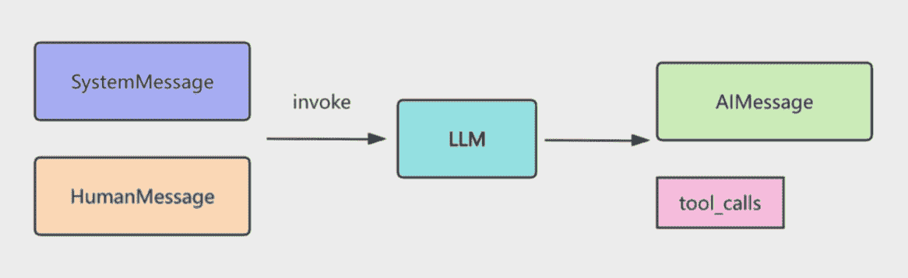
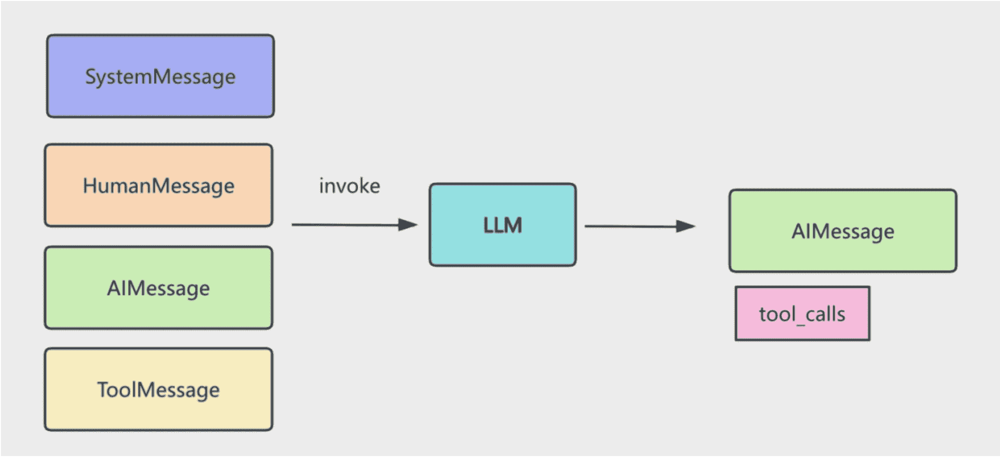
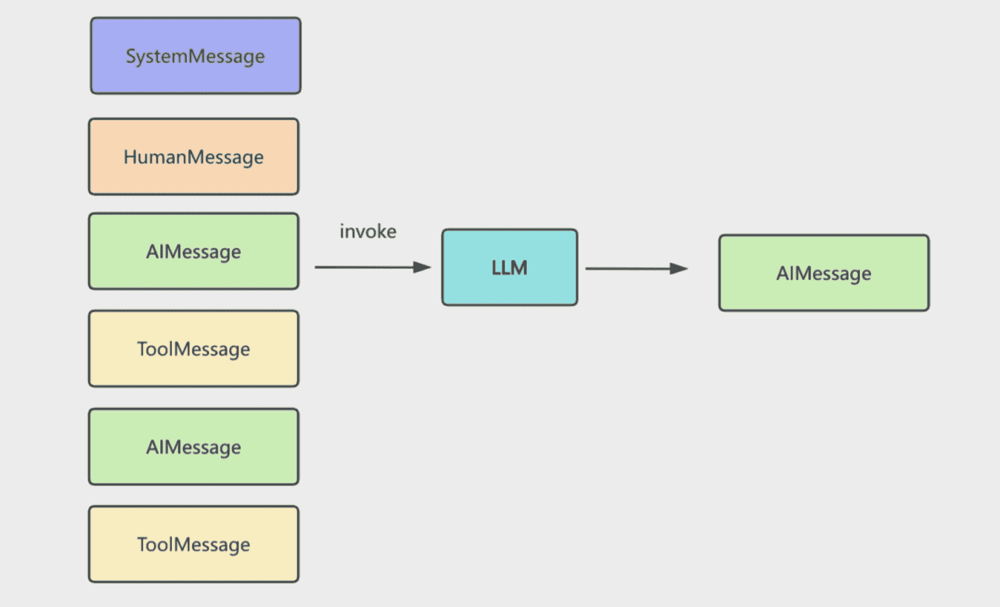
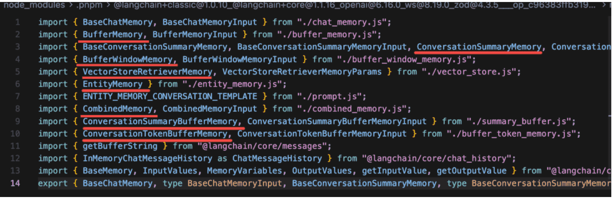

## 前言

我们给大模型扩展了 tool，让它可以做一些事情而不只是回答问题。给大模型扩展了 RAG，基于 query 获取向量数据库里相关的知识放入 prompt。但这些其实都依赖一个东西：Memory

大模型是无状态的，你这次调用和下次调用没区别，它并不知道之前你问了什么，回答了什么。

有的同学说，不对啊，我明明可以基于上次的回答继续问。

这是因为你已经做了 Memory 管理。

记得我们之前写的这个循环么：

```js
async function runAgentWithTools(query, maxIterations = 30) {
  const messages = [
    new SystemMessage(`你是一个项目管理助手，使用工具完成任务。

当前工作目录: ${process.cwd()}

工具：
1. read_file: 读取文件
2. write_file: 写入文件
3. execute_command: 执行命令（支持 workingDirectory 参数）
4. list_directory: 列出目录

重要规则 - execute_command：
- workingDirectory 参数会自动切换到指定目录
- 当使用 workingDirectory 时，绝对不要在 command 中使用 cd
- 错误示例: { command: "cd react-todo-app && pnpm install", workingDirectory: "react-todo-app" }
这是错误的！因为 workingDirectory 已经在 react-todo-app 目录了，再 cd react-todo-app 会找不到目录
- 正确示例: { command: "pnpm install", workingDirectory: "react-todo-app" }
这样就对了！workingDirectory 已经切换到 react-todo-app，直接执行命令即可

回复要简洁，只说做了什么`),
    new HumanMessage(query),
  ];

  // Agent loop，最多执行 30 轮，超过就停止
  for (let i = 0; i < maxIterations; i++) {
    console.log(chalk.bgGreen(`⏳ 正在等待 AI 思考...`));
    const response = await modelWithTools.invoke(messages);
    messages.push(response);

    // response 是模型返回的响应，包括：
    // - content: 模型返回的文本内容
    // - tool_calls: 模型调用的工具列表

    // 检查是否有工具调用
    if (!response.tool_calls || response.tool_calls.length === 0) {
      console.log(`\n✨ AI 最终回复:\n${response.content}\n`);
      return response.content;
    }

    // 执行工具调用
    for (const toolCall of response.tool_calls) {
      const foundTool = tools.find((t) => t.name === toolCall.name);
      if (foundTool) {
        const toolResult = await foundTool.invoke(toolCall.args);
        messages.push(
          new ToolMessage({
            content: toolResult,
            tool_call_id: toolCall.id,
          }),
        );
      }
    }
  }

  return messages[messages.length - 1].content;
}
```


我们在 messages 数组放入了 SystemMessage，告诉大模型它的角色、功能，然后放入了 HumanMessage，也就是用户问的问题。

然后 invoke 大模型，这是第一次调用。

大模型返回了 AIMessage 和 tool_calls 信息。



我们基于 tool_calls 去调用工具，然后把结果封装成 ToolMessage 也放入 messages 数组。

这样 messages 数组里就有了 SystemMessage、HumanMessage、AIMessage、ToolMessage

循环继续调用大模型，这是第二次调用。



直到不再有 tool_calls，就把那个 AIMessage 返回，这就是最终回复。



这个过程我们循环调用了多次大模型。

你觉得大模型是怎么知道之前问过什么、回答过什么的？

就是基于 messages 数组，也就是 Memory。

如果不做 Memory 管理，大模型根本不知道之前回答过什么，所以说它是无状态的。

但这种 messages 数组不断 push 的 Memory 管理机制显然不靠谱。

因为大模型的上下文大小是有限的，比如 GPT-4o 大概是 200k token

不管这个限制是多大，当你无限往 memory 里增加 message 的时候，总是会超的。

所以我们要学一些 Memory 的管理策略。

先不看有哪些方案，你自己考虑下，应该怎么做呢？

- 有同学说，可以只保留最近的几条 message，之前的舍弃掉啊。
- 有同学说，直接舍弃之前的也不好，可以对之前的做一些总结，保留这个总结和最近的几条 message。
- 有同学说可以用我们刚学的向量数据库啊，根据语义检索之前的 message

没错，主流的也就是这三种思路，截断、总结、检索

其实你每天都在用 memory 的这些策略：

你用 cursor 或者 claude code 的时候，会有一个 token 的计数，当达到的时候，会触发总结，然后开始新的一轮计数，达到上下文限制，会自动触发总结。

还有一个问题，就是 messages 存在哪，现在都是存在内存中的，而实际上可以做持久化，存在文件、redis、数据库等。

所以之前 memory 一共有两个维度的 api：

一个是 ChatMessageHistory 相关的：

```js
																inMemoryChatMessageHistory    		存内存里

																RedisChatMessageHistory						存到 redis

BaseChatMessageHistory 

																FileSystemChatMessageHistory			存文件

																TypeORMChatMessageHistory					通过 typeorm 存在 mysql 等数据库
```

它是存储层，也就是 messages 存在哪，可以是内存、文件、数据库等。

然后是逻辑层，也就是截断、总结、向量数据库这些：

```
													BufferMemory    											全量保存 message

													BufferWindowMemory										保留最近 k 条

													ConversationSummaryMemory							每轮对话都总结

BaseMemory 								ConversationSummaryBufferMemory				maxToekn 内保存，超出后总结

													VectorStoreRetrieverMemory						通过向量数据库做语义检索

													EntityMemory													实体维度记录
							
													CombinedMeMory												组合多种 memory
```


每个 xxMemory 类都有一个 chatHistory 属性，关联着存储层。

但是，这些 memory 的 api，已经全部被废弃了。

移到了 @langchain/classic 这个包：

可以看到，刚才提到的所有 Memory api 都被废弃了：




