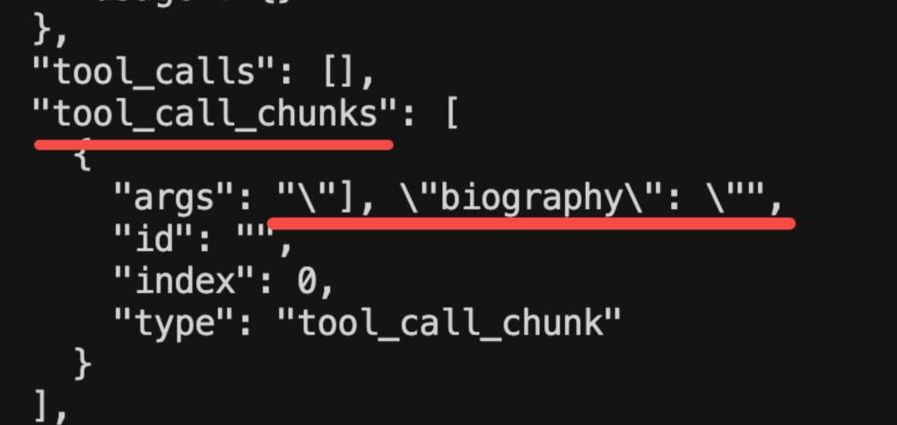
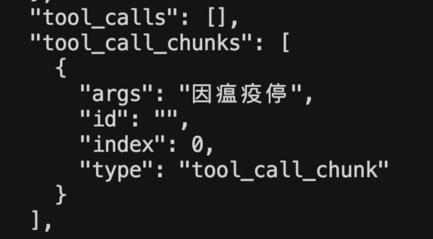

## 前言

我们已经调用大模型完成过很多功能了，但输出一直没做控制，都是自然语言的形式。

而很多情况下，我们希望大模型按照我们的格式要求，返回一个 json

这就需要用到 Output Parser 的 api 了。

有同学说，这个不就是在 prompt 里描述下要什么格式，然后按照这种格式解析大模型返回的结果字符串么？

没错，就是这种思路，只不过 output parser 对这个思路做了一下封装。


## Output Parser

我们直接写代码来试一下，创建src/normal.mjs

```js
import "dotenv/config";
import { ChatOpenAI } from "@langchain/openai";

// 初始化模型
const model = new ChatOpenAI({
  modelName: process.env.MODEL_NAME,
  apiKey: process.env.OPENAI_API_KEY,
  temperature: 0,
  configuration: {
    baseURL: process.env.OPENAI_BASE_URL,
  },
});

// 简单的问题，要求 JSON 格式返回
const question =
  "请介绍一下爱因斯坦的信息。请以 JSON 格式返回，包含以下字段：name（姓名）、birth_year（出生年份）、nationality（国籍）、major_achievements（主要成就，数组）、famous_theory（著名理论）。";

try {
  console.log("🤔 正在调用大模型...\n");

  const response = await model.invoke(question);

  console.log("✅ 收到响应:\n");
  console.log(response.content);

  // 解析 JSON
  const jsonResult = JSON.parse(response.content);
  console.log("\n📋 解析后的 JSON 对象:");
  console.log(jsonResult);
} catch (error) {
  console.error("❌ 错误:", error.message);
}

```

跑一下：

````
mac@macdeMacBook-Air-3 aiagent % pnpm run normal

> ai@1.0.0 normal /Users/mac/jiuci/github/aiagent
> node src/12/normal.mjs

🤔 正在调用大模型...

✅ 收到响应:

```json
{
  "name": "阿尔伯特·爱因斯坦",
  "birth_year": 1879,
  "nationality": "德国-美国",
  "major_achievements": [
    "相对论",
    "光电效应的解释",
    "质能等价公式 E=mc²"
  ],
  "famous_theory": "相对论"
}
```
❌ 错误: Unexpected token '`', "```json
{
"... is not valid JSON
````

返回的内容带了额外的 markdown 语法，解析失败了。

这是我们经常遇到的一个问题。

我们用 Output Parser 试一下


### JsonOutputParser

创建 src/json-output-parser.mjs

```js
import "dotenv/config";
import { ChatOpenAI } from "@langchain/openai";
import { JsonOutputParser } from "@langchain/core/output_parsers";

// 初始化模型
const model = new ChatOpenAI({
  modelName: process.env.MODEL_NAME,
  apiKey: process.env.OPENAI_API_KEY,
  temperature: 0,
  configuration: {
    baseURL: process.env.OPENAI_BASE_URL,
  },
});

const parser = new JsonOutputParser();

const question = `请介绍一下爱因斯坦的信息。请以 JSON 格式返回，包含以下字段：name（姓名）、birth_year（出生年份）、nationality（国籍）、major_achievements（主要成就，数组）、famous_theory（著名理论）。

${parser.getFormatInstructions()}`;

console.log("question:", question);
try {
  console.log("🤔 正在调用大模型（使用 JsonOutputParser）...\n");

  const response = await model.invoke(question);

  console.log("📤 模型原始响应:\n");
  console.log(response.content);

  const result = await parser.parse(response.content);

  console.log("✅ JsonOutputParser 自动解析的结果:\n");
  console.log(result);
  console.log(`姓名: ${result.name}`);
  console.log(`出生年份: ${result.birth_year}`);
  console.log(`国籍: ${result.nationality}`);
  console.log(`著名理论: ${result.famous_theory}`);
  console.log(`主要成就:`, result.major_achievements);
} catch (error) {
  console.error("❌ 错误:", error.message);
}
```

用了 JsonOutputParser，顾名思义，它就是用来解析 json 结果的。

就像前面说的，在 prompt 里放一段格式的提示词

然后对返回的结果按照格式来 parse

分别对应 parser.getFormatInstructions 和 parser.parse 方法

跑一下：

````
mac@macdeMacBook-Air-3 aiagent % pnpm run json-output-parser

> ai@1.0.0 json-output-parser /Users/mac/jiuci/github/aiagent
> node src/12/json-output-parser.mjs

question: 请介绍一下爱因斯坦的信息。请以 JSON 格式返回，包含以下字段：name（姓名）、birth_year（出生年份）、nationality（国籍）、major_achievements（主要成就，数组）、famous_theory（著名理论）。


🤔 正在调用大模型（使用 JsonOutputParser）...

📤 模型原始响应:

```json
{
  "name": "阿尔伯特·爱因斯坦",
  "birth_year": 1879,
  "nationality": "德国/美国",
  "major_achievements": [
    "相对论的提出",
    "光电效应的发现",
    "质能等价公式 E=mc² 的推导"
  ],
  "famous_theory": "相对论"
}
```
✅ JsonOutputParser 自动解析的结果:

{
  name: '阿尔伯特·爱因斯坦',
  birth_year: 1879,
  nationality: '德国/美国',
  major_achievements: [ '相对论的提出', '光电效应的发现', '质能等价公式 E=mc² 的推导' ],
  famous_theory: '相对论'
}
姓名: 阿尔伯特·爱因斯坦
出生年份: 1879
国籍: 德国/美国
著名理论: 相对论
主要成就: [ '相对论的提出', '光电效应的发现', '质能等价公式 E=mc² 的推导' ]
````

可以看到，虽然大模型返回的还是带了 markdown 语法，但是 JsonOutputParser 能够解析其中的 json。

因为它做了这种常见情况的处理。

有的同学说，getFormatInstructions 好像没内容啊。

确实，JsonOutputParser 比较简单，不需要提示词。

我们换一个 output parser


### StructuredOutputParser

创建 src/structured-output-parser.mjs

```js
import "dotenv/config";
import { ChatOpenAI } from "@langchain/openai";
import { StructuredOutputParser } from "@langchain/core/output_parsers";

// 初始化模型
const model = new ChatOpenAI({
  modelName: process.env.MODEL_NAME,
  apiKey: process.env.OPENAI_API_KEY,
  temperature: 0,
  configuration: {
    baseURL: process.env.OPENAI_BASE_URL,
  },
});

// 定义输出结构
const parser = StructuredOutputParser.fromNamesAndDescriptions({
  name: "姓名",
  birth_year: "出生年份",
  nationality: "国籍",
  major_achievements: "主要成就，用逗号分隔的字符串",
  famous_theory: "著名理论",
});

const question = `请介绍一下爱因斯坦的信息。

${parser.getFormatInstructions()}`;

console.log("question:", question);

try {
  console.log("🤔 正在调用大模型（使用 StructuredOutputParser）...\n");

  const response = await model.invoke(question);

  console.log("📤 模型原始响应:\n");
  console.log(response.content);

  const result = await parser.parse(response.content);

  console.log("\n✅ StructuredOutputParser 自动解析的结果:\n");
  console.log(result);
  console.log(`姓名: ${result.name}`);
  console.log(`出生年份: ${result.birth_year}`);
  console.log(`国籍: ${result.nationality}`);
  console.log(`著名理论: ${result.famous_theory}`);
  console.log(`主要成就: ${result.major_achievements}`);
} catch (error) {
  console.error("❌ 错误:", error.message);
}
```

这里我们用了 StructuredOutputParser，它可以指定具体的 json 结构

我们用 fromNamesAndDescriptions 指定了字段和描述

跑一下：

````
mac@macdeMacBook-Air-3 aiagent % pnpm run structured-output-parser

> ai@1.0.0 structured-output-parser /Users/mac/jiuci/github/aiagent
> node src/12/structured-output-parser.mjs

question: 请介绍一下爱因斯坦的信息。

You must format your output as a JSON value that adheres to a given "JSON Schema" instance.

"JSON Schema" is a declarative language that allows you to annotate and validate JSON documents.

For example, the example "JSON Schema" instance {{"properties": {{"foo": {{"description": "a list of test words", "type": "array", "items": {{"type": "string"}}}}}}, "required": ["foo"]}}
would match an object with one required property, "foo". The "type" property specifies "foo" must be an "array", and the "description" property semantically describes it as "a list of test words". The items within "foo" must be strings.
Thus, the object {{"foo": ["bar", "baz"]}} is a well-formatted instance of this example "JSON Schema". The object {{"properties": {{"foo": ["bar", "baz"]}}}} is not well-formatted.

Your output will be parsed and type-checked according to the provided schema instance, so make sure all fields in your output match the schema exactly and there are no trailing commas!

Here is the JSON Schema instance your output must adhere to. Include the enclosing markdown codeblock:
```json
{"type":"object","properties":{"name":{"type":"string","description":"姓名"},"birth_year":{"type":"string","description":"出生年份"},"nationality":{"type":"string","description":"国籍"},"major_achievements":{"type":"string","description":"主要成就，用逗号分隔的字符串"},"famous_theory":{"type":"string","description":"著名理论"}},"required":["name","birth_year","nationality","major_achievements","famous_theory"],"additionalProperties":false,"$schema":"http://json-schema.org/draft-07/schema#"}
```

🤔 正在调用大模型（使用 StructuredOutputParser）...

📤 模型原始响应:

```json
{
  "name": "阿尔伯特·爱因斯坦",
  "birth_year": "1879",
  "nationality": "德国/美国",
  "major_achievements": "相对论, 光量子假说",
  "famous_theory": "E=mc²"
}
```

✅ StructuredOutputParser 自动解析的结果:

{
  name: '阿尔伯特·爱因斯坦',
  birth_year: '1879',
  nationality: '德国/美国',
  major_achievements: '相对论, 光量子假说',
  famous_theory: 'E=mc²'
}
姓名: 阿尔伯特·爱因斯坦
出生年份: 1879
国籍: 德国/美国
著名理论: E=mc²
主要成就: 相对论, 光量子假说
````

解析出的对象依然是正确的。但是多了一大段提示词。

这就是 output parser 的原理：在 prompt 里加入格式描述，根据这个格式来解析响应。

当然，就像我们之前用 zod 来描述 tool 的参数格式一样

StructuredOutputParser 也可以用 zod 来描述复杂的对象格式。


### StructuredOutputParser 使用 zod 描述

创建 src/structured-output-parser2.mjs

```js
import "dotenv/config";
import { ChatOpenAI } from "@langchain/openai";
import { StructuredOutputParser } from "@langchain/core/output_parsers";
import { z } from "zod";

// 初始化模型
const model = new ChatOpenAI({
  modelName: process.env.MODEL_NAME,
  apiKey: process.env.OPENAI_API_KEY,
  temperature: 0,
  configuration: {
    baseURL: process.env.OPENAI_BASE_URL,
  },
});

// 使用 zod 定义复杂的输出结构
const scientistSchema = z.object({
  name: z.string().describe("科学家的全名"),
  birth_year: z.number().describe("出生年份"),
  death_year: z.number().optional().describe("去世年份，如果还在世则不填"),
  nationality: z.string().describe("国籍"),
  fields: z.array(z.string()).describe("研究领域列表"),
  awards: z
    .array(
      z.object({
        name: z.string().describe("奖项名称"),
        year: z.number().describe("获奖年份"),
        reason: z.string().optional().describe("获奖原因"),
      })
    )
    .describe("获得的重要奖项列表"),
  major_achievements: z.array(z.string()).describe("主要成就列表"),
  famous_theories: z
    .array(
      z.object({
        name: z.string().describe("理论名称"),
        year: z.number().optional().describe("提出年份"),
        description: z.string().describe("理论简要描述"),
      })
    )
    .describe("著名理论列表"),
  education: z
    .object({
      university: z.string().describe("主要毕业院校"),
      degree: z.string().describe("学位"),
      graduation_year: z.number().optional().describe("毕业年份"),
    })
    .optional()
    .describe("教育背景"),
  biography: z.string().describe("简短传记，100字以内"),
});

// 从 zod schema 创建 parser
const parser = StructuredOutputParser.fromZodSchema(scientistSchema);

const question = `请介绍一下居里夫人（Marie Curie）的详细信息，包括她的教育背景、研究领域、获得的奖项、主要成就和著名理论。

${parser.getFormatInstructions()}`;

console.log("📋 生成的提示词:\n");
console.log(question);

try {
  console.log("🤔 正在调用大模型（使用 Zod Schema）...\n");

  const response = await model.invoke(question);

  console.log("📤 模型原始响应:\n");
  console.log(response.content);

  const result = await parser.parse(response.content);

  console.log("✅ StructuredOutputParser 自动解析并验证的结果:\n");
  console.log(JSON.stringify(result, null, 2));

  console.log("📊 格式化展示:\n");
  console.log(`👤 姓名: ${result.name}`);
  console.log(`📅 出生年份: ${result.birth_year}`);
  if (result.death_year) {
    console.log(`⚰️  去世年份: ${result.death_year}`);
  }
  console.log(`🌍 国籍: ${result.nationality}`);
  console.log(`🔬 研究领域: ${result.fields.join(", ")}`);

  console.log(`\n🎓 教育背景:`);
  if (result.education) {
    console.log(`   院校: ${result.education.university}`);
    console.log(`   学位: ${result.education.degree}`);
    if (result.education.graduation_year) {
      console.log(`   毕业年份: ${result.education.graduation_year}`);
    }
  }

  console.log(`\n🏆 获得的奖项 (${result.awards.length}个):`);
  result.awards.forEach((award, index) => {
    console.log(`   ${index + 1}. ${award.name} (${award.year})`);
    if (award.reason) {
      console.log(`      原因: ${award.reason}`);
    }
  });

  console.log(`\n💡 著名理论 (${result.famous_theories.length}个):`);
  result.famous_theories.forEach((theory, index) => {
    console.log(
      `   ${index + 1}. ${theory.name}${theory.year ? ` (${theory.year})` : ""}`
    );
    console.log(`      ${theory.description}`);
  });

  console.log(`\n🌟 主要成就 (${result.major_achievements.length}个):`);
  result.major_achievements.forEach((achievement, index) => {
    console.log(`   ${index + 1}. ${achievement}`);
  });

  console.log(`\n📖 传记:`);
  console.log(`   ${result.biography}`);
} catch (error) {
  console.error("❌ 错误:", error.message);
  if (error.name === "ZodError") {
    console.error("验证错误详情:", error.errors);
  }
}
```

我们用 zod 描述了一个复杂的对象结构，然后用 StructuredOutputParser 生成提示词，以及 parse

跑一下：

````js
mac@macdeMacBook-Air-3 aiagent % pnpm run structured-output-parser2

> ai@1.0.0 structured-output-parser2 /Users/mac/jiuci/github/aiagent
> node src/12/structured-output-parser2.mjs

📋 生成的提示词:

请介绍一下居里夫人（Marie Curie）的详细信息，包括她的教育背景、研究领域、获得的奖项、主要成就和著名理论。

You must format your output as a JSON value that adheres to a given "JSON Schema" instance.

"JSON Schema" is a declarative language that allows you to annotate and validate JSON documents.

For example, the example "JSON Schema" instance {{"properties": {{"foo": {{"description": "a list of test words", "type": "array", "items": {{"type": "string"}}}}}}, "required": ["foo"]}}
would match an object with one required property, "foo". The "type" property specifies "foo" must be an "array", and the "description" property semantically describes it as "a list of test words". The items within "foo" must be strings.
Thus, the object {{"foo": ["bar", "baz"]}} is a well-formatted instance of this example "JSON Schema". The object {{"properties": {{"foo": ["bar", "baz"]}}}} is not well-formatted.

Your output will be parsed and type-checked according to the provided schema instance, so make sure all fields in your output match the schema exactly and there are no trailing commas!

Here is the JSON Schema instance your output must adhere to. Include the enclosing markdown codeblock:
```json
{"$schema":"https://json-schema.org/draft/2020-12/schema","type":"object","properties":{"name":{"type":"string","description":"科学家的全名"},"birth_year":{"type":"number","description":"出生年份"},"death_year":{"description":"去世年份，如果还在世则不填","type":"number"},"nationality":{"type":"string","description":"国籍"},"fields":{"type":"array","items":{"type":"string"},"description":"研究领域列表"},"awards":{"type":"array","items":{"type":"object","properties":{"name":{"type":"string","description":"奖项名称"},"year":{"type":"number","description":"获奖年份"},"reason":{"description":"获奖原因","type":"string"}},"required":["name","year"],"additionalProperties":false},"description":"获得的重要奖项列表"},"major_achievements":{"type":"array","items":{"type":"string"},"description":"主要成就列表"},"famous_theories":{"type":"array","items":{"type":"object","properties":{"name":{"type":"string","description":"理论名称"},"year":{"description":"提出年份","type":"number"},"description":{"type":"string","description":"理论简要描述"}},"required":["name","description"],"additionalProperties":false},"description":"著名理论列表"},"education":{"description":"教育背景","type":"object","properties":{"university":{"type":"string","description":"主要毕业院校"},"degree":{"type":"string","description":"学位"},"graduation_year":{"description":"毕业年份","type":"number"}},"required":["university","degree"],"additionalProperties":false},"biography":{"type":"string","description":"简短传记，100字以内"}},"required":["name","birth_year","nationality","fields","awards","major_achievements","famous_theories","biography"],"additionalProperties":false}
```

🤔 正在调用大模型（使用 Zod Schema）...

📤 模型原始响应:

```json
{
  "name": "Marie Curie",
  "birth_year": 1867,
  "death_year": 1934,
  "nationality": "French",
  "fields": ["Physics", "Chemistry"],
  "awards": [
    {
      "name": "Nobel Prize in Physics",
      "year": 1903,
      "reason": "For their services in the discovery of new radioactive elements"
    },
    {
      "name": "Nobel Prize in Chemistry",
      "year": 1911,
      "reason": "For her work on radioactivity"
    }
  ],
  "major_achievements": [
    "Discovered radium and polonium",
    "Developed techniques for isolating radioactive isotopes",
    "Established the theory of radioactivity"
  ],
  "famous_theories": [
    {
      "name": "Radioactivity",
      "year": 1896,
      "description": "Curie's groundbreaking research led to the understanding of radioactivity, a fundamental concept in nuclear physics."
    }
  ],
  "education": {
    "university": "University of Paris",
    "degree": "Ph.D.",
    "graduation_year": 1895
  },
  "biography": "Marie Curie was a pioneering physicist and chemist who conducted pioneering research on radioactivity, discovering two new elements: radium and polonium. She developed techniques for isolating radioactive isotopes and established the theory of radioactivity."
}
```
✅ StructuredOutputParser 自动解析并验证的结果:

{
  "name": "Marie Curie",
  "birth_year": 1867,
  "death_year": 1934,
  "nationality": "French",
  "fields": [
    "Physics",
    "Chemistry"
  ],
  "awards": [
    {
      "name": "Nobel Prize in Physics",
      "year": 1903,
      "reason": "For their services in the discovery of new radioactive elements"
    },
    {
      "name": "Nobel Prize in Chemistry",
      "year": 1911,
      "reason": "For her work on radioactivity"
    }
  ],
  "major_achievements": [
    "Discovered radium and polonium",
    "Developed techniques for isolating radioactive isotopes",
    "Established the theory of radioactivity"
  ],
  "famous_theories": [
    {
      "name": "Radioactivity",
      "year": 1896,
      "description": "Curie's groundbreaking research led to the understanding of radioactivity, a fundamental concept in nuclear physics."
    }
  ],
  "education": {
    "university": "University of Paris",
    "degree": "Ph.D.",
    "graduation_year": 1895
  },
  "biography": "Marie Curie was a pioneering physicist and chemist who conducted pioneering research on radioactivity, discovering two new elements: radium and polonium. She developed techniques for isolating radioactive isotopes and established the theory of radioactivity."
}
📊 格式化展示:

👤 姓名: Marie Curie
📅 出生年份: 1867
⚰️  去世年份: 1934
🌍 国籍: French
🔬 研究领域: Physics, Chemistry

🎓 教育背景:
   院校: University of Paris
   学位: Ph.D.
   毕业年份: 1895

🏆 获得的奖项 (2个):
   1. Nobel Prize in Physics (1903)
      原因: For their services in the discovery of new radioactive elements
   2. Nobel Prize in Chemistry (1911)
      原因: For her work on radioactivity

💡 著名理论 (1个):
   1. Radioactivity (1896)
      Curie's groundbreaking research led to the understanding of radioactivity, a fundamental concept in nuclear physics.

🌟 主要成就 (3个):
   1. Discovered radium and polonium
   2. Developed techniques for isolating radioactive isotopes
   3. Established the theory of radioactivity

📖 传记:
   Marie Curie was a pioneering physicist and chemist who conducted pioneering research on radioactivity, discovering two new elements: radium and polonium. She developed techniques for isolating radioactive isotopes and established the theory of radioactivity.
````

可以看到，StructuredOutputParser 根据格式生成了一大段提示词，并且解析也是正确的。

有同学说，tool 可以指定参数的对象格式，能不能直接用 tool 来获取结构化的结果呢？

当然可以的。


### tool 来获取结构化的结果

试一下，创建 src/tool-call-args.mjs

```js
import "dotenv/config";
import { ChatOpenAI } from "@langchain/openai";
import { z } from "zod";

const model = new ChatOpenAI({
  modelName: process.env.MODEL_NAME,
  apiKey: process.env.OPENAI_API_KEY,
  temperature: 0,
  configuration: {
    baseURL: process.env.OPENAI_BASE_URL,
  },
});

// 定义结构化输出的 schema
const scientistSchema = z.object({
  name: z.string().describe("科学家的全名"),
  birth_year: z.number().describe("出生年份"),
  nationality: z.string().describe("国籍"),
  fields: z.array(z.string()).describe("研究领域列表"),
});

const modelWithTool = model.bindTools([
  {
    name: "extract_scientist_info",
    description: "提取和结构化科学家的详细信息",
    schema: scientistSchema,
  },
]);

// 调用模型
const response = await modelWithTool.invoke("介绍一下爱因斯坦");

console.log("response.tool_calls:", response.tool_calls);
// 获取结构化结果
const result = response.tool_calls[0].args;

console.log("结构化结果:", JSON.stringify(result, null, 2));
console.log(`\n姓名: ${result.name}`);
console.log(`出生年份: ${result.birth_year}`);
console.log(`国籍: ${result.nationality}`);
console.log(`研究领域: ${result.fields.join(", ")}`);
```

这里没定义 tool 的实现逻辑，因为我们只是告诉大模型有这个 tool、参数是什么格式，不需要执行

跑一下：

```js
mac@macdeMacBook-Air-3 aiagent % pnpm run tool-call-args

> ai@1.0.0 tool-call-args /Users/mac/jiuci/github/aiagent
> node src/12/tool-call-args.mjs

response.tool_calls: [
  {
    name: 'extract_scientist_info',
    args: {
      name: '阿尔伯特·爱因斯坦',
      birth_year: 1879,
      nationality: '德国/美国',
      fields: [Array]
    },
    type: 'tool_call',
    id: 'call_b8b3297e208a4f7f898c58'
  }
]
结构化结果: {
  "name": "阿尔伯特·爱因斯坦",
  "birth_year": 1879,
  "nationality": "德国/美国",
  "fields": [
    "物理学",
    "相对论"
  ]
}

姓名: 阿尔伯特·爱因斯坦
出生年份: 1879
国籍: 德国/美国
研究领域: 物理学, 相对论
```


可以看到，通过返回的 tool_calls 信息，也能拿到结构化的数据。

而且，这种方式比 output parser 更好。

因为模型训练的时候就保证了生成 tool calls 的参数一定是符合格式要求的，如果不符合，会重新生成。

那岂不是没必要用 output parser 了？

确实，如果只是要求结构化返回数据，用 tool 就行了。

所以，现在获取结构化数据一般会用 withStructuredOutput 这个 api

它会判断模型是否支持 tool calls，支持的话就用 tool 的方式获取结构化数据，否则用 output parser 的方式，不用我们自己去处理。


### withStructuredOutput

创建src/with-structured-output.mjs

```js
import "dotenv/config";
import { ChatOpenAI } from "@langchain/openai";
import { z } from "zod";

const model = new ChatOpenAI({
  modelName: process.env.MODEL_NAME,
  apiKey: process.env.OPENAI_API_KEY,
  temperature: 0,
  configuration: {
    baseURL: process.env.OPENAI_BASE_URL,
  },
});

// 定义结构化输出的 schema
const scientistSchema = z.object({
  name: z.string().describe("科学家的全名"),
  birth_year: z.number().describe("出生年份"),
  nationality: z.string().describe("国籍"),
  fields: z.array(z.string()).describe("研究领域列表"),
});

// 使用 withStructuredOutput 方法
const structuredModel = model.withStructuredOutput(scientistSchema);

// 调用模型
const result = await structuredModel.invoke("介绍一下爱因斯坦");

console.log("结构化结果:", JSON.stringify(result, null, 2));
console.log(`\n姓名: ${result.name}`);
console.log(`出生年份: ${result.birth_year}`);
console.log(`国籍: ${result.nationality}`);
console.log(`研究领域: ${result.fields.join(", ")}`);
```

跑一下：

```js
mac@macdeMacBook-Air-3 aiagent % pnpm run with-structured-output

> ai@1.0.0 with-structured-output /Users/mac/jiuci/github/aiagent
> node src/12/with-structured-output.mjs

结构化结果: {
  "name": "阿尔伯特·爱因斯坦",
  "birth_year": 1879,
  "nationality": "德国→瑞士→美国（归化）",
  "fields": [
    "理论物理学",
    "哲学",
    "科学哲学"
  ]
}

姓名: 阿尔伯特·爱因斯坦
出生年份: 1879
国籍: 德国→瑞士→美国（归化）
研究领域: 理论物理学, 哲学, 科学哲学
```

:::info 补充

我们在使用`qwen-coder-turbo`模型运行这个代码的时候，会报错：

```
mac@macdeMacBook-Air-3 aiagent % pnpm run with-structured-output    

> ai@1.0.0 with-structured-output /Users/mac/jiuci/github/aiagent
> node src/12/with-structured-output.mjs

file:///Users/mac/jiuci/github/aiagent/node_modules/.pnpm/openai@6.18.0_ws@8.19.0_zod@4.3.6/node_modules/openai/core/error.mjs:41
            return new BadRequestError(status, error, message, headers);
                   ^

BadRequestError: 400 <400> InternalError.Algo.InvalidParameter: 'messages' must contain the word 'json' in some form, to use 'response_format' of type 'json_object'.
    at APIError.generate (file:///Users/mac/jiuci/github/aiagent/node_modules/.pnpm/openai@6.18.0_ws@8.19.0_zod@4.3.6/node_modules/openai/core/error.mjs:41:20)
    at OpenAI.makeStatusError (file:///Users/mac/jiuci/github/aiagent/node_modules/.pnpm/openai@6.18.0_ws@8.19.0_zod@4.3.6/node_modules/openai/client.mjs:162:32)
    at OpenAI.makeRequest (file:///Users/mac/jiuci/github/aiagent/node_modules/.pnpm/openai@6.18.0_ws@8.19.0_zod@4.3.6/node_modules/openai/client.mjs:330:30)
    at process.processTicksAndRejections (node:internal/process/task_queues:95:5)
    at async file:///Users/mac/jiuci/github/aiagent/node_modules/.pnpm/@langchain+openai@1.2.5_@langchain+core@1.1.19_@opentelemetry+api@1.9.0_openai@6.18.0_ws@8.19.0_zod@4.3.6___ws@8.19.0/node_modules/@langchain/openai/dist/chat_models/completions.js:219:54
    at async pRetry (file:///Users/mac/jiuci/github/aiagent/node_modules/.pnpm/@langchain+core@1.1.19_@opentelemetry+api@1.9.0_openai@6.18.0_ws@8.19.0_zod@4.3.6_/node_modules/@langchain/core/dist/utils/p-retry/index.js:123:19)
    at async run (/Users/mac/jiuci/github/aiagent/node_modules/.pnpm/p-queue@6.6.2/node_modules/p-queue/dist/index.js:163:29) {
  status: 400,
  headers: Headers {},
  requestID: 'f32bc808-887b-98f6-968f-669e9b2a7df1',
  error: {
    message: "<400> InternalError.Algo.InvalidParameter: 'messages' must contain the word 'json' in some form, to use 'response_format' of type 'json_object'.",
    type: 'invalid_request_error',
    param: null,
    code: 'invalid_parameter_error'
  },
  code: 'invalid_parameter_error',
  param: null,
  type: 'invalid_request_error'
}
```

具体原因问了 ai 说是，为了防止模型输出乱格式，会要求：如果使用 json_object，prompt 必须包含 json

但测试在提示词中加了 json 还是会报错

解决方法就是把模型换成 qwen-plus 就行

:::

那岂不是说 output parser 一般用不到了？

也不是，如果流式打印返回数据的场景，还是需要 output parser 的。


### 流式

#### stream 方法

创建 src/stream-normal.mjs

```js
import "dotenv/config";
import { ChatOpenAI } from "@langchain/openai";

const model = new ChatOpenAI({
  modelName: process.env.MODEL_NAME,
  apiKey: process.env.OPENAI_API_KEY,
  temperature: 0,
  configuration: {
    baseURL: process.env.OPENAI_BASE_URL,
  },
});

const prompt = `详细介绍莫扎特的信息。`;

console.log("🌊 普通流式输出演示（无结构化）\n");

try {
  const stream = await model.stream(prompt);

  let fullContent = "";
  let chunkCount = 0;

  console.log("📡 接收流式数据:\n");

  for await (const chunk of stream) {
    chunkCount++;
    const content = chunk.content;
    fullContent += content;

    process.stdout.write(content); // 实时显示流式文本
  }

  console.log(`\n\n✅ 共接收 ${chunkCount} 个数据块\n`);
  console.log(`📝 完整内容长度: ${fullContent.length} 字符`);
} catch (error) {
  console.error("\n❌ 错误:", error.message);
}
```

把 invoke 换成 stream 方法就可以了，用 for await 打印异步返回的 chunk

跑一下：

```
mac@macdeMacBook-Air-3 aiagent % pnpm run stream-normal

> ai@1.0.0 stream-normal /Users/mac/jiuci/github/aiagent
> node src/12/stream-normal.mjs

🌊 普通流式输出演示（无结构化）

📡 接收流式数据:

沃尔夫冈·阿马多斯·莫扎特（Wolfgang Amadeus Mozart，1756年1月27日—1791年12月5日），是欧洲古典音乐的代表人物之一，被誉为“音乐神童”。他出生于奥地利萨尔茨堡，一生短暂但成就卓著，被誉为“音乐天才”。

### 生平

1. **童年时期**：莫扎特在出生后不久便展现出了惊人的音乐天赋。3岁时开始学习钢琴，4岁就能创作简单的旋律和和声，5岁开始作曲。他的父亲菲利普·莫扎特是一位宫廷乐师，对儿子的音乐才能非常重视。

2. **早期职业生涯**：莫扎特从8岁起就随父母亲赴意大利、法国、德国等地演出，展现了他在音乐上的非凡才华。这段旅行极大地开阔了他的视野，也为他积累了丰富的音乐素材。

3. **成熟期**：大约在10岁左右，莫扎特开始独立创作作品，并逐渐形成了自己独特的音乐风格。他的作品包括歌剧、交响曲、室内乐、钢琴协奏曲等，涵盖了音乐的所有主要领域。

4. **最后几年**：尽管莫扎特在音乐上取得了巨大的成功，但他个人的生活却充满了波折。他与妻子康斯坦丁娜的爱情生活并不幸福，还因债务问题而苦恼。这些因素最终导致了莫扎特的健康状况急剧恶化，他在病痛中度过最后的日子。

### 主要作品

莫扎特的作品数量庞大，风格多样，主要包括：

- **歌剧**：如《费加罗的婚礼》、《唐吉诃德》、《魔笛》等。
- **交响曲**：共41部，其中最著名的是第40号和第41号交响曲。
- **室内乐**：如小夜曲、弦乐四重奏、钢琴三重奏等。
- **钢琴协奏曲**：共27首，如《A大调钢琴协奏曲》、《K. 488钢琴协奏曲》等。
- **键盘作品**：包括钢琴奏鸣曲、钢琴变奏曲、钢琴前奏曲等。

### 影响

莫扎特的音乐风格清新脱俗，旋律优美动听，结构严谨，深受世界各地听众的喜爱。他的作品不仅对古典音乐的发展产生了深远的影响，而且对后来的浪漫主义音乐家也产生了重要启示。

### 死亡

莫扎特于1791年12月5日在维也纳去世，当时只有35岁。尽管他的生命如此短暂，但他的音乐遗产却跨越了时空，继续影响着世界音乐界。莫扎特的逝世被认为是古典音乐史上的一个巨大损失，但也标志着他音乐生涯的辉煌结束。

总的来说，莫扎特不仅是音乐史上的一位巨匠，也是人类文化宝库中的瑰宝。

✅ 共接收 162 个数据块

📝 完整内容长度: 962 字符
```


#### withStructuredOutput

我们再用 withStructuredOutput 做一下流式的结构化输出：

src/stream-with-structured-output.mjs

```js
import "dotenv/config";
import { ChatOpenAI } from "@langchain/openai";
import { z } from "zod";

const model = new ChatOpenAI({
  modelName: process.env.MODEL_NAME,
  apiKey: process.env.OPENAI_API_KEY,
  temperature: 0,
  configuration: {
    baseURL: process.env.OPENAI_BASE_URL,
  },
});

// 使用 zod 定义结构化输出格式
const schema = z.object({
  name: z.string().describe("姓名"),
  birth_year: z.number().describe("出生年份"),
  death_year: z.number().describe("去世年份"),
  nationality: z.string().describe("国籍"),
  occupation: z.string().describe("职业"),
  famous_works: z.array(z.string()).describe("著名作品列表"),
  biography: z.string().describe("简短传记"),
});

const structuredModel = model.withStructuredOutput(schema);

const prompt = `详细介绍莫扎特的信息。`;

console.log("🌊 流式结构化输出演示（withStructuredOutput）\n");

try {
  const stream = await structuredModel.stream(prompt);

  let chunkCount = 0;
  let result = null;

  console.log("📡 接收流式数据:\n");

  for await (const chunk of stream) {
    chunkCount++;
    result = chunk;

    console.log(`[Chunk ${chunkCount}]`);
    console.log(JSON.stringify(chunk, null, 2));
  }

  console.log(`\n✅ 共接收 ${chunkCount} 个数据块\n`);

  if (result) {
    console.log("📊 最终结构化结果:\n");
    console.log(JSON.stringify(result, null, 2));

    console.log("\n📝 格式化输出:");
    console.log(`姓名: ${result.name}`);
    console.log(`出生年份: ${result.birth_year}`);
    console.log(`去世年份: ${result.death_year}`);
    console.log(`国籍: ${result.nationality}`);
    console.log(`职业: ${result.occupation}`);
    console.log(`著名作品: ${result.famous_works.join(", ")}`);
    console.log(`传记: ${result.biography}`);
  }
} catch (error) {
  console.error("\n❌ 错误:", error.message);
}
```

可以看到，虽然我们是用的 stream 的流式方式打印的

但是用了 withStructuredOutput 之后，它会在 json 生成完通过校验后再返回（底层是 tool calls）。

所以只有一个 chunk 包含完整 json

这样明显不是真的流式啊。


#### Structured output parser

我们换 output parser 试试：

src/stream-structured-partial.mjs

```js
import "dotenv/config";
import { ChatOpenAI } from "@langchain/openai";
import { StructuredOutputParser } from "@langchain/core/output_parsers";
import { z } from "zod";

const model = new ChatOpenAI({
  modelName: process.env.MODEL_NAME,
  apiKey: process.env.OPENAI_API_KEY,
  temperature: 0,
  configuration: {
    baseURL: process.env.OPENAI_BASE_URL,
  },
});

// 使用 zod 定义结构化输出格式
const schema = z.object({
  name: z.string().describe("姓名"),
  birth_year: z.number().describe("出生年份"),
  death_year: z.number().describe("去世年份"),
  nationality: z.string().describe("国籍"),
  occupation: z.string().describe("职业"),
  famous_works: z.array(z.string()).describe("著名作品列表"),
  biography: z.string().describe("简短传记"),
});

const parser = StructuredOutputParser.fromZodSchema(schema);

const prompt = `详细介绍莫扎特的信息。\n\n${parser.getFormatInstructions()}`;

console.log("🌊 流式结构化输出演示\n");

try {
  const stream = await model.stream(prompt);

  let fullContent = "";
  let chunkCount = 0;

  console.log("📡 接收流式数据:\n");

  for await (const chunk of stream) {
    chunkCount++;
    const content = chunk.content;
    fullContent += content;

    process.stdout.write(content); // 实时显示流式文本
  }

  console.log(`\n\n✅ 共接收 ${chunkCount} 个数据块\n`);

  // 解析完整内容为结构化数据
  const result = await parser.parse(fullContent);

  console.log("📊 解析后的结构化结果:\n");
  console.log(JSON.stringify(result, null, 2));

  console.log("\n📝 格式化输出:");
  console.log(`姓名: ${result.name}`);
  console.log(`出生年份: ${result.birth_year}`);
  console.log(`去世年份: ${result.death_year}`);
  console.log(`国籍: ${result.nationality}`);
  console.log(`职业: ${result.occupation}`);
  console.log(`著名作品: ${result.famous_works.join(", ")}`);
  console.log(`传记: ${result.biography}`);
} catch (error) {
  console.error("\n❌ 错误:", error.message);
}
```

我们用 StructuredOutputParser 解析结果，过程做了流式打印。

跑一下，可以看到，现在是边生成边打印，最后再 parse。

所以流式的情况下，用 output parser 还是更适合的。

那如果我们就是想用 tool calls 来做结构化输出，但还是想要流式的打印，怎么办呢？

其实流式输出的情况下，如果你用了 tool call，是这样返回的：




#### tool\_call\_chunks

tool\_call\_chunks 里保存了 tool 参数的部分内容，我们可以用这个来实现流式打印效果

试一下：src/stream-tool-calls-raw.mjs

```js
import "dotenv/config";
import { ChatOpenAI } from "@langchain/openai";
import { z } from "zod";

const model = new ChatOpenAI({
  modelName: process.env.MODEL_NAME,
  apiKey: process.env.OPENAI_API_KEY,
  temperature: 0,
  configuration: {
    baseURL: process.env.OPENAI_BASE_URL,
  },
});

// 定义结构化输出的 schema
const scientistSchema = z.object({
  name: z.string().describe("科学家的全名"),
  birth_year: z.number().describe("出生年份"),
  death_year: z.number().optional().describe("去世年份，如果还在世则不填"),
  nationality: z.string().describe("国籍"),
  fields: z.array(z.string()).describe("研究领域列表"),
  achievements: z.array(z.string()).describe("主要成就"),
  biography: z.string().describe("简短传记"),
});

// 绑定工具到模型
const modelWithTool = model.bindTools([
  {
    name: "extract_scientist_info",
    description: "提取和结构化科学家的详细信息",
    schema: scientistSchema,
  },
]);

console.log("🌊 流式 Tool Calls 演示 - 直接打印原始 tool_calls_chunk\n");

try {
  // 开启流式输出
  const stream = await modelWithTool.stream("详细介绍牛顿的生平和成就");

  console.log("📡 实时输出流式 tool_calls_chunk:\n");

  let chunkIndex = 0;

  for await (const chunk of stream) {
    chunkIndex++;
    // 直接打印每个 chunk 的 tool_calls 信息
    if (chunk.tool_call_chunks && chunk.tool_call_chunks.length > 0) {
      process.stdout.write(chunk.tool_call_chunks[0].args);
    }
  }

  console.log("\n\n✅ 流式输出完成");
} catch (error) {
  console.error("\n❌ 错误:", error.message);
  console.error(error);
}
```

打印 tool\_call\_chunks 片段，就可以实现流式打印效果

基于这个可以实现流式打印效果，但是看下 chunk 内容：



这时候是不能调用 tool 的，因为参数还不完整，没有 tool\_calls 信息。

如果我想参数不完整的时候，也能拿到 tool\_call 参数的 json 呢？

这种就可以用 JsonOutputToolsParser 了

它的作用就是解析 tool\_call\_chunks 中的内容，拼接成符合 json 格式规范的对象，就算 chunk 还没传输完的时候，也能拿到 json 对象


#### JsonOutputToolsParser

试一下：

src/stream-tool-calls-parser.mjs

```js
import "dotenv/config";
import { ChatOpenAI } from "@langchain/openai";
import { JsonOutputToolsParser } from "@langchain/core/output_parsers/openai_tools";
import { z } from "zod";

const model = new ChatOpenAI({
  modelName: process.env.MODEL_NAME,
  apiKey: process.env.OPENAI_API_KEY,
  temperature: 0,
  configuration: {
    baseURL: process.env.OPENAI_BASE_URL,
  },
});

// 定义结构化输出的 schema
const scientistSchema = z.object({
  name: z.string().describe("科学家的全名"),
  birth_year: z.number().describe("出生年份"),
  death_year: z.number().optional().describe("去世年份，如果还在世则不填"),
  nationality: z.string().describe("国籍"),
  fields: z.array(z.string()).describe("研究领域列表"),
  achievements: z.array(z.string()).describe("主要成就"),
  biography: z.string().describe("简短传记"),
});

// 绑定工具到模型
const modelWithTool = model.bindTools([
  {
    name: "extract_scientist_info",
    description: "提取和结构化科学家的详细信息",
    schema: scientistSchema,
  },
]);

// 1. 绑定工具并挂载解析器
const parser = new JsonOutputToolsParser();
const chain = modelWithTool.pipe(parser);

try {
  // 2. 开启流
  const stream = await chain.stream("详细介绍牛顿的生平和成就");

  let lastContent = ""; // 记录已打印的完整内容
  let finalResult = null; // 存储最终的完整结果

  console.log("📡 实时输出流式内容:\n");

  for await (const chunk of stream) {
    if (chunk.length > 0) {
      const toolCall = chunk[0];

      // 获取当前工具调用的完整参数内容
      // const currentContent = JSON.stringify(toolCall.args || {}, null, 2);

      // if (currentContent.length > lastContent.length) {
      //     const newText = currentContent.slice(lastContent.length);
      //     process.stdout.write(newText); // 实时输出到控制台
      //     lastContent = currentContent; // 更新已读进度
      // }

      console.log(toolCall.args);
    }
  }

  console.log("\n\n✅ 流式输出完成");
} catch (error) {
  console.error("\n❌ 错误:", error.message);
  console.error(error);
}

```

JsonOutputToolsParser 会试试解析 tool\_call\_chunks 生成完整的 tool\_calls 信息

我们跑下试试

可以看到，就算是流式返回的 tool\_call\_chunks 还不完整，也会拼成正确格式的 tool\_calls

这样你可以实时调用工具，传入部分参数了。

此外，我们前面说 withStructuredOutput 不适合的场景有两个：

- 流式打印内容，这种还是需要 Output Parser

- XML、YAML 等非 json 格式，也需要 Output Parser


我们来试一下 XML 的 output parser


#### XML 的 output parser

创建 src/xml-output-parser.mjs

```js
import "dotenv/config";
import { ChatOpenAI } from "@langchain/openai";
import { XMLOutputParser } from "@langchain/core/output_parsers";

// 初始化模型
const model = new ChatOpenAI({
  modelName: process.env.MODEL_NAME,
  apiKey: process.env.OPENAI_API_KEY,
  temperature: 0,
  configuration: {
    baseURL: process.env.OPENAI_BASE_URL,
  },
});

const parser = new XMLOutputParser();

const question = `请提取以下文本中的人物信息：阿尔伯特·爱因斯坦出生于 1879 年，是一位伟大的物理学家。

${parser.getFormatInstructions()}`;

console.log("question:", question);

try {
  console.log("🤔 正在调用大模型（使用 XMLOutputParser）...\n");

  const response = await model.invoke(question);

  console.log("📤 模型原始响应:\n");
  console.log(response.content);

  const result = await parser.parse(response.content);

  console.log("\n✅ XMLOutputParser 自动解析的结果:\n");
  console.log(result);
} catch (error) {
  console.error("❌ 错误:", error.message);
}
```

跑一下：

````
mac@macdeMacBook-Air-3 aiagent % pnpm run xml-output-parser    

> ai@1.0.0 xml-output-parser /Users/mac/jiuci/github/aiagent
> node src/12/xml-output-parser.mjs

question: 请提取以下文本中的人物信息：阿尔伯特·爱因斯坦出生于 1879 年，是一位伟大的物理学家。

The output should be formatted as a XML file.
1. Output should conform to the tags below. 
2. If tags are not given, make them on your own.
3. Remember to always open and close all the tags.

As an example, for the tags ["foo", "bar", "baz"]:
1. String "<foo>
   <bar>
      <baz></baz>
   </bar>
</foo>" is a well-formatted instance of the schema. 
2. String "<foo>
   <bar>
   </foo>" is a badly-formatted instance.
3. String "<foo>
   <tag>
   </tag>
</foo>" is a badly-formatted instance.

Here are the output tags:
```
{tags}
```
🤔 正在调用大模型（使用 XMLOutputParser）...

📤 模型原始响应:

```xml
<person>
   <name>阿尔伯特·爱因斯坦</name>
   <birth_year>1879</birth_year>
   <profession>物理学家</profession>
</person>
```

✅ XMLOutputParser 自动解析的结果:

{
  person: [
    { name: '阿尔伯特·爱因斯坦' },
    { birth_year: '1879' },
    { profession: '物理学家' }
  ]
}
````

可以看到提示词里加入了一些格式信息，返回的也是 xml 格式，并且正确 parse 了出来。

这种也用不了 withStructuredOutput（也就是 tool call）来做结构化，还是得用 output parser。


## 总结

我们经常需要对大模型输出做一些结构化的限制，这时候就需要 output parser 的 api

它的原理就是在提示词里加入格式信息，然后对结果做一下 parse

比如 JsonOutputParser、StructuredOutputParser、XMLOutputParser 等

当然，用 tool call 的方式也完全可以实现结构化限制，而且可靠性更高，是模型训练的时候就保证的

所以，如果是做结构化，直接用 withStructuredOutput 这个 api 就行，它底层就是根据模型来决定是用 tool call 还是 output parser。

但它有两个不适合的场景：

- 流式打印，这种需要用 output parser

- xml 等非 json 格式，也需要 output parser

此外，如果流式打印 tool 参数的过程中，想实时拿到 tool\_calls 的 json 对象来调用 tool，可以用 JsonOutputToolsParser 这个 output parser

综上，如果你需要做大模型的输出做结构化，就可以考虑 withStructuredOutput 和 output parser 这两者二选一了。


## 解释代码

### normal.mjs

### json-output-parser.mjs

### structured-output-parser.mjs

### structured-output-parser2.mjs

### tool-call-args.mjs

### with-structured-output.mjs

### stream-normal.mjs

### stream-with-structured-output.mjs

### stream-structured-partial.mjs

### stream-tool-calls-raw.mjs

### stream-tool-calls-parser.mjs

### xml-output-parser.mjs
