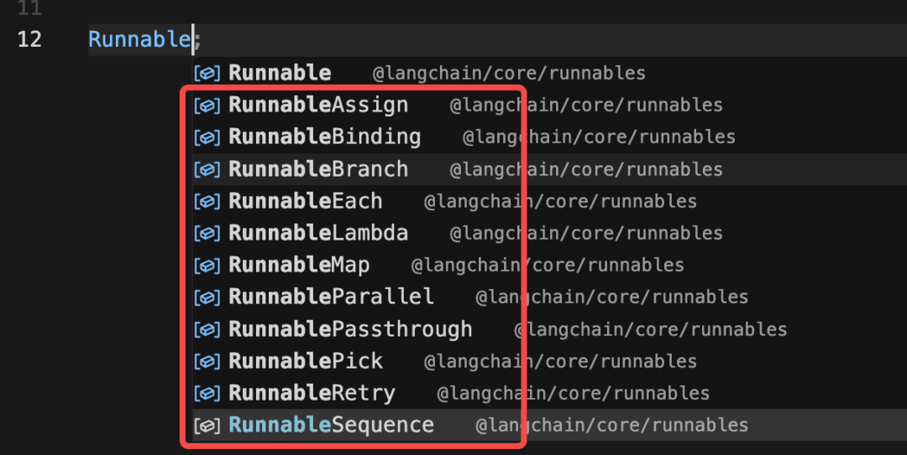
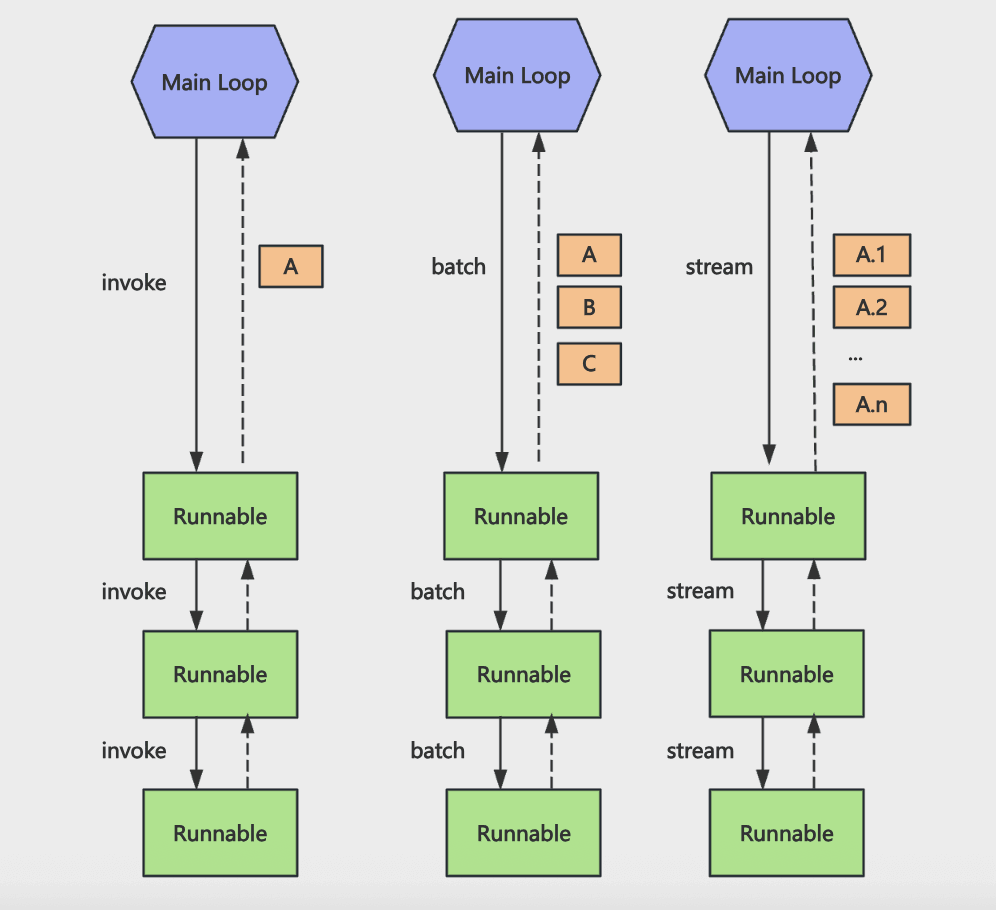

## 前言

LangChain 很多 api 都实现了 Runnable 接口，比如 PromptTemplate、OutputParser、ChatOpenAI 等。

而且 Runnable 相关的 api 也有很多：




那 Runnable 都是干什么的呢？

它可以**让我们声明式的写代码，从写逻辑变成组装 chain。**


## Runnable

### RunnableSequence

之前我们这么写

src/before.mjs

```js
import "dotenv/config";
import { StructuredOutputParser } from "@langchain/core/output_parsers";
import { PromptTemplate } from "@langchain/core/prompts";
import { ChatOpenAI } from "@langchain/openai";
import { z } from "zod";

const model = new ChatOpenAI({
  modelName: process.env.MODEL_NAME,
  apiKey: process.env.OPENAI_API_KEY,
  temperature: 0,
  configuration: {
    baseURL: process.env.OPENAI_BASE_URL,
  },
});

// 定义输出结构 schema
const schema = z.object({
  translation: z.string().describe("翻译后的英文文本"),
  keywords: z.array(z.string()).length(3).describe("3个关键词"),
});

const outputParser = StructuredOutputParser.fromZodSchema(schema);

const promptTemplate = PromptTemplate.fromTemplate(
  "将以下文本翻译成英文，然后总结为3个关键词。\n\n文本：{text}\n\n{format_instructions}"
);

const input = {
  text: "LangChain 是一个强大的 AI 应用开发框架",
  format_instructions: outputParser.getFormatInstructions(),
};

// 步骤 1: 格式化 prompt
const formattedPrompt = await promptTemplate.format(input);
// 步骤 2: 调用模型
const response = await model.invoke(formattedPrompt);
// 步骤 3: 解析输出
const result = await outputParser.invoke(response);
console.log("✅ 最终结果:");
console.log(result);
```


用 PromptTemplate 管理 prompt，调用 format 传入占位符的值。

调用 ChatOpenAI 的大模型，通过 invoke 方法

用 StructuredOutputParser 做结构化解析，调用 invoke

有了 Runnable 可以这么写：

src/runnable.mjs

```js
import "dotenv/config";
import { StructuredOutputParser } from "@langchain/core/output_parsers";
import { PromptTemplate } from "@langchain/core/prompts";
import { ChatOpenAI } from "@langchain/openai";
import { RunnableSequence } from "@langchain/core/runnables";
import { z } from "zod";

const model = new ChatOpenAI({
  modelName: process.env.MODEL_NAME,
  apiKey: process.env.OPENAI_API_KEY,
  temperature: 0,
  configuration: {
    baseURL: process.env.OPENAI_BASE_URL,
  },
});

// 定义输出结构 schema
const schema = z.object({
  translation: z.string().describe("翻译后的英文文本"),
  keywords: z.array(z.string()).length(3).describe("3个关键词"),
});

const outputParser = StructuredOutputParser.fromZodSchema(schema);

const promptTemplate = PromptTemplate.fromTemplate(
  "将以下文本翻译成英文，然后总结为3个关键词。\n\n文本：{text}\n\n{format_instructions}"
);

const chain = RunnableSequence.from([promptTemplate, model, outputParser]);

const input = {
  text: "LangChain 是一个强大的 AI 应用开发框架",
  format_instructions: outputParser.getFormatInstructions(),
};

const result = await chain.invoke(input);

console.log("✅ 最终结果:");
console.log(result);
```

用 RunnableSequence 声明这三个顺序执行，然后直接执行这条 chain 就好了。

了 RunnableSequence 声明，还可以直接 pipe：`const chain = promptTemplate.pipe(model).pipe(outputParser)`

跑一下发现和 before.mjs 是一样的


pipe 的源码里，也是返回 RunnableSequence，这俩本质一样

明显用了 Runnable 之后，代码简洁了很多。

实现了 Runnable api 后，就可以声明式的组合执行的 chain，然后统一执行。

这种声明式的写法叫做 LCEL（Lang Chain Expression Language，LangChain 表达式语言）

LCEL 就是实现了 Runnbale 接口的一些 api 组合成 chain，然后统一执行。

Runnable 都有 invoke、stream、batch 方法。

这样你调用 invoke，就会依次调用这个链条上每个组件的 invoke

batch 是批量，也就是并发进行多个单独的 invoke

调用 stream 就是调用这个链条上每个组件的 stream，不断返回数据。




串联起来的 Runnable 的 chain 就自然可以支持同步调用、批量调用、流式返回。

那我们就只需要考虑怎么组装这个 chain 了。

这就是用 LCEL 的方式写代码的好处，你不需要依次调用每个组件，只需要声明这个 chain，然后统一调用。

前面用了 RunnableSequence，它是顺序执行，我们再来用一下其余的 Runnable api


### RunnableLambda

首先是 RunnableLambda，这个是把普通函数封装成 Runnable 对象

src/runnables/RunnableLambda.mjs

然后通过 RunnableSequence 来顺序调用。这样，普通函数就可以在这个 chain 里调用了。

```js
import "dotenv/config";
import { RunnableLambda, RunnableSequence } from "@langchain/core/runnables";

const addOne = RunnableLambda.from((input) => {
  console.log(`输入: ${input}`);
  return input + 1;
});

const multiplyTwo = RunnableLambda.from((input) => {
  console.log(`输入: ${input}`);
  return input * 2;
});

const chain = RunnableSequence.from([addOne, multiplyTwo, addOne]);

const result = await chain.invoke(5);
console.log("✅ 最终结果:", result);
```

跑一下：

```
mac@macdeMacBook-Air-3 aiagent % pnpm run runnable-lambda

> ai@1.0.0 runnable-lambda /Users/mac/jiuci/github/aiagent
> node src/15/RunnableLambda.mjs

输入: 5
输入: 6
输入: 12
✅ 最终结果: 13

// 输入 5，先走addOne，变成 6，走multiplyTwo变成 12，在走addOne变成 13
```


### RunnableMap

然后是 RunnableMap，它可以并行执行多个 Runnable：

src/runnables/RunnableMap.mjs

```js
import "dotenv/config";
import { RunnableMap, RunnableLambda } from "@langchain/core/runnables";
import { PromptTemplate } from "@langchain/core/prompts";

const addOne = RunnableLambda.from((input) => input.num + 1);
const multiplyTwo = RunnableLambda.from((input) => input.num * 2);
const square = RunnableLambda.from((input) => input.num * input.num);

const greetTemplate = PromptTemplate.fromTemplate("你好，{name}！");
const weatherTemplate = PromptTemplate.fromTemplate("今天天气{weather}。");

// 创建 RunnableMap，并行执行多个 runnable
// key 可以随便命名
const runnableMap = RunnableMap.from({
  // 数学运算
  add: addOne,
  multiply: multiplyTwo,
  square: square,

  // prompt 格式化
  greeting: greetTemplate,
  weather: weatherTemplate,
});

// 测试输入
// key 是匹配输入的不能随便起
const input = {
  name: "神光",
  weather: "多云",
  num: 5,
};

// 执行 RunnableMap
const result = await runnableMap.invoke(input);
console.log("✅ 最终结果:", result);
```

这里我们输入的 input 会并行经过 5 个 Runnable 处理，结果放到对象的对应属性上

```js
mac@macdeMacBook-Air-3 aiagent % pnpm run runnable-map

> ai@1.0.0 runnable-map /Users/mac/jiuci/github/aiagent
> node src/15/RunnableMap.mjs

✅ 最终结果: {
  add: 6,
  multiply: 10,
  square: 25,
  greeting: StringPromptValue {
    lc_serializable: true,
    lc_kwargs: { value: '你好，神光！' },
    lc_namespace: [ 'langchain_core', 'prompt_values' ],
    value: '你好，神光！'
  },
  weather: StringPromptValue {
    lc_serializable: true,
    lc_kwargs: { value: '今天天气多云。' },
    lc_namespace: [ 'langchain_core', 'prompt_values' ],
    value: '今天天气多云。'
  }
}
```

:::info 那为什么 `num` 需要 `input.num`，而`name`不需要呢

这是因为 **两种 Runnable 的输入方式不同**：

- `RunnableLambda` → 你自己写函数，需要 **手动从 input 取值**
- `PromptTemplate` → LangChain **自动根据变量名取值**

:::


### RunnableBranch

接下来是 RunnableBranch，它就是 if else 逻辑

src/runnable/RunnableBranch.mjs

```js
import 'dotenv/config';
import { RunnableBranch, RunnableLambda } from"@langchain/core/runnables";

// 创建条件判断函数
const isPositive = RunnableLambda.from((input) => input > 0);
const isNegative = RunnableLambda.from((input) => input < 0);
const isEven = RunnableLambda.from((input) => input % 2 === 0);

// 创建分支处理函数
const handlePositive = RunnableLambda.from((input) =>`正数: ${input} + 10 = ${input + 10}`);
const handleNegative = RunnableLambda.from((input) =>`负数: ${input} - 10 = ${input - 10}`);
const handleEven = RunnableLambda.from((input) =>`偶数: ${input} * 2 = ${input * 2}`);

// 当所有条件都不满足时的兜底分支
const handleDefault = RunnableLambda.from((input) =>`默认: ${input}`);

// 创建 RunnableBranch
const branch = RunnableBranch.from([
    [isPositive, handlePositive],
    [isNegative, handleNegative],
    [isEven, handleEven],
    handleDefault
]);

// 测试不同的输入
const testCases = [5, -3, 4, 0, "abc"];

for (const testCase of testCases) {
    const result = await branch.invoke(testCase);
    console.log(`输入: ${testCase} => ${result}`);
}
```

这里分别对正数、负数、偶数等做不同处理，也就是 if else 的逻辑。

跑一下：

```
mac@macdeMacBook-Air-3 aiagent % pnpm run runnable-branch

> ai@1.0.0 runnable-branch /Users/mac/jiuci/github/aiagent
> node src/15/RunnableBranch.mjs

输入: 5 => 正数: 5 + 10 = 15
输入: -3 => 负数: -3 - 10 = -13
输入: 4 => 正数: 4 + 10 = 14
输入: 0 => 偶数: 0 * 2 = 0
输入: abc => 默认: abc
```

:::info `RunnableBranch.from`的顺序可以改变吗

可以改变，但**顺序非常重要**，因为 **LangChain 的 `RunnableBranch` 是按顺序匹配的**。

`RunnableBranch` 从上到下依次判断，命中第一个条件就停止，不会再继续判断。

```js
RunnableBranch.from([
  [condition1, runnable1],
  [condition2, runnable2],
  [condition3, runnable3],
  defaultRunnable
])
```

执行逻辑

```
从上到下判断：

if condition1 === true → runnable1
else if condition2 === true → runnable2
else if condition3 === true → runnable3
else → defaultRunnable
```

代码

```js
const branch = RunnableBranch.from([
  [isPositive, handlePositive],
  [isNegative, handleNegative],
  [isEven, handleEven],
  handleDefault,
]);
```

等价于

```js
if (input > 0) {
  handlePositive
} else if (input < 0) {
  handleNegative
} else if (input % 2 === 0) {
  handleEven
} else {
  handleDefault
}
```

:::


### RouterRunnable

然后是 RouterRunnable，它相当于 switch case

src/runnables/RouterRunnable.mjs

```js
import "dotenv/config";
import { RouterRunnable, RunnableLambda } from "@langchain/core/runnables";

// 创建两个简单的 RunnableLambda
const toUpperCase = RunnableLambda.from((text) => text.toUpperCase());
const reverseText = RunnableLambda.from((text) =>
  text.split("").reverse().join("")
);

// 创建 RouterRunnable，根据 key 选择要调用的 runnable
const router = new RouterRunnable({
  runnables: {
    toUpperCase,
    reverseText,
  },
});

// 测试：调用 reverseText
const result1 = await router.invoke({
  key: "reverseText", // 根据 key 选择要调用的 runnable
  input: "Hello World",
});
console.log("reverseText 结果:", result1);

// 测试：调用 toUpperCase
const result2 = await router.invoke({
  key: "toUpperCase", // 根据 key 选择要调用的 runnable
  input: "Hello World",
});
console.log("toUpperCase 结果:", result2);
```

根据 key 匹配对应的 chain 来执行。


### RunnablePassthrough

然后是 RunnablePassthrough，它是传入的最初的值：

```js
import "dotenv/config";
import {
  RunnablePassthrough,
  RunnableLambda,
  RunnableSequence,
  RunnableMap,
} from "@langchain/core/runnables";

const chain = RunnableSequence.from([
  // 将输入转换为对象，为{ concept: "teSta" }
  RunnableLambda.from((input) => ({ concept: input + "a" })),
  // 将对象转换为另一个对象
  RunnableMap.from({
    // 将输入原封不动地传递下去
    original: new RunnablePassthrough(),
    processed: RunnableLambda.from((obj) => ({
      // 这里的 obj 是上面 RunnableLambda.from((input) => ({ concept: input + "a" })) 的输出
      concept: obj.concept,
      upper: obj.concept.toUpperCase(),
      length: obj.concept.length,
    })),
  }),
]);

const input = "teSt";
const result = await chain.invoke(input);
console.log("✅ 最终结果:", result);
```

跑一下：
```js
mac@macdeMacBook-Air-3 aiagent % pnpm run runnable-passthrough

> ai@1.0.0 runnable-passthrough /Users/mac/jiuci/github/aiagent
> node src/15/RunnablePassthrough.mjs

✅ 最终结果: {
  original: { concept: 'teSta' },
  processed: { concept: 'teSta', upper: 'TESTA', length: 5 }
}
```

我们先用 RunnableLambda 对输入做了转换，然后用 RunnableMap 并行处理。

orinal 用 RunnablePassthrough 拿到原始值

processed 部分用 RunnableLambda 处理。

可以看到 original 部分就是通过 RunnablePassthrough 拿到了原始值。

这段代码还可以简化：

```js
const chain = RunnableSequence.from([
  (input) => ({ concept: input + "a" }),
  (obj) => ({
    concept: obj.concept,
    upper: obj.concept.toUpperCase(),
    length: obj.concept.length,
  }),
]);
```

只保留函数、对象即可，LangChain 会把函数转为 RunnableLambda，把对象转为 RunnableMap

如果是想保留原始属性，只是扩展一些属性，用 RunnablePassthrough.assign，它的作用不改变原来的对象，只是在对象上新增属性。

类似于 js 的：

```js
{
  ...obj,
  newField: value
}
```

```js
const chain = RunnableSequence.from([
  (input) => ({ concept: input + "a" }),
  RunnablePassthrough.assign({
    original: new RunnablePassthrough(),
    processed: (obj) => ({
      concept: obj.concept,
      upper: obj.concept.toUpperCase(),
      length: obj.concept.length,
    }),
  }),
]);
```

跑一下：

```
mac@macdeMacBook-Air-3 aiagent % pnpm run runnable-passthrough

> ai@1.0.0 runnable-passthrough /Users/mac/jiuci/github/aiagent
> node src/15/RunnablePassthrough.mjs

✅ 最终结果: {
  concept: 'teSta',
  original: { concept: 'teSta' },
  processed: { concept: 'teSta', upper: 'TESTA', length: 5 }
}
```

现在之前的属性也保留着，只是合并了新的属性，就像 Object.assign 一样


### RunnableEach

接下来是 RunnableEach，这个显然就是循环：

src/runnables/RunnableEach.mjs

```js
import "dotenv/config";
import {
  RunnableEach,
  RunnableLambda,
  RunnableSequence,
} from "@langchain/core/runnables";

const toUpperCase = RunnableLambda.from((input) => input.toUpperCase());
const addGreeting = RunnableLambda.from((input) => `你好，${input}！`);

const processItem = RunnableSequence.from([toUpperCase, addGreeting]);

// 使用 RunnableEach 对数组中的每个元素应用这个链
const chain = new RunnableEach({
  bound: processItem,
});

const input = ["alice", "bob", "carol"];
const result = await chain.invoke(input);

console.log("✅ RunnableEach - 数组元素处理:");
console.log("输入:", input);
console.log("输出:", result);
```

```
mac@macdeMacBook-Air-3 aiagent % pnpm run runnable-each       

> ai@1.0.0 runnable-each /Users/mac/jiuci/github/aiagent
> node src/15/RunnableEach.mjs

✅ RunnableEach - 数组元素处理:
输入: [ 'alice', 'bob', 'carol' ]
输出: [ '你好，ALICE！', '你好，BOB！', '你好，CAROL！' ]
```


### RunnablePick

再就是 RunnablePick，这个就是从对象里取一些属性：

src/runnables/RunablePick.mjs

```js
import "dotenv/config";
import { RunnablePick, RunnableSequence } from "@langchain/core/runnables";

const inputData = {
  name: "神光",
  age: 30,
  city: "北京",
  country: "中国",
  email: "shenguang@example.com",
  phone: "+86-13800138000",
};

const chain = RunnableSequence.from([
  (input) => ({
    ...input,
    fullInfo: `${input.name}，${input.age}岁，来自${input.city}`,
  }),
  new RunnablePick(["name", "fullInfo", "phone"]),
]);

const result = await chain.invoke(inputData);
console.log("✅ 最终结果:", result);
```

```
mac@macdeMacBook-Air-3 aiagent % pnpm run runnable-pick

> ai@1.0.0 runnable-pick /Users/mac/jiuci/github/aiagent
> node src/15/RunablePick.mjs

✅ 最终结果: { name: '神光', fullInfo: '神光，30岁，来自北京', phone: '+86-13800138000' }
```


### RunnableWithMessageHistory

最后是 RunnableWithMessageHistory，它是给 chain 加上 memory 的功能

src/runnables/RunnableWithMessageHistory.mjs

```js
import "dotenv/config";
import { RunnableWithMessageHistory } from "@langchain/core/runnables";
import { InMemoryChatMessageHistory } from "@langchain/core/chat_history";
import { ChatOpenAI } from "@langchain/openai";
import {
  ChatPromptTemplate,
  MessagesPlaceholder,
} from "@langchain/core/prompts";
import { StringOutputParser } from "@langchain/core/output_parsers";

const model = new ChatOpenAI({
  modelName: process.env.MODEL_NAME,
  apiKey: process.env.OPENAI_API_KEY,
  temperature: 0.3,
  configuration: {
    baseURL: process.env.OPENAI_BASE_URL,
  },
});

const prompt = ChatPromptTemplate.fromMessages([
  [
    "system",
    "你是一个简洁、有帮助的中文助手，会用 1-2 句话回答用户问题，重点给出明确、有用的信息。",
  ],
  // 这里用 MessagesPlaceholder 来承载「之前的多轮对话」,会被历史消息占位替换。
  new MessagesPlaceholder("history"),
  ["human", "{question}"],
]);

// 用 Prompt 生成 LLM 输入。
// .pipe(StringOutputParser()) → 将模型输出解析为纯字符串。
const simpleChain = prompt.pipe(model).pipe(new StringOutputParser());

const messageHistories = new Map();

const getMessageHistory = (sessionId) => {
  if (!messageHistories.has(sessionId)) {
    messageHistories.set(sessionId, new InMemoryChatMessageHistory());
  }
  return messageHistories.get(sessionId);
};

// 创建带消息历史的链
const chain = new RunnableWithMessageHistory({
  // 实际问答链，负责输出回答。
  runnable: simpleChain,
  // 根据 sessionId 获取历史消息。
  getMessageHistory: (sessionId) => getMessageHistory(sessionId),
  // 输入消息的 key。
  inputMessagesKey: "question",
  // 历史消息的 key。
  historyMessagesKey: "history",
});

// 测试：第一次对话
console.log("--- 第一次对话（提供信息） ---");
const result1 = await chain.invoke(
  {
    question: "我的名字是神光，我来自山东，我喜欢编程、写作、金铲铲。",
  },
  {
    configurable: {
      sessionId: "user-123",
    },
  }
);
console.log("问题: 我的名字是神光，我来自山东，我喜欢编程、写作、金铲铲。");
console.log("回答:", result1);
console.log();

// 测试：第二次对话
console.log("--- 第二次对话（询问之前的信息） ---");
const result2 = await chain.invoke(
  {
    question: "我刚才说我来自哪里？",
  },
  {
    configurable: {
      sessionId: "user-123",
    },
  }
);
console.log("问题: 我刚才说我来自哪里？");
console.log("回答:", result2);
console.log();

// 测试：第三次对话
console.log("--- 第三次对话（继续询问） ---");
const result3 = await chain.invoke(
  {
    question: "我的爱好是什么？",
  },
  {
    configurable: {
      sessionId: "user-123",
    },
  }
);
console.log("问题: 我的爱好是什么？");
console.log("回答:", result3);
console.log();

// 测试：第四次对话
console.log("--- 第四次对话（继续询问） ---");
const result4 = await chain.invoke(
  {
    question: "我的邮箱是什么？",
  },
  {
    configurable: {
      sessionId: "user-1231",
    },
  }
);
console.log("问题: 我的邮箱是什么？");
console.log("回答:", result4);
```

我们用 ChatPromptTemplate 创建 prompt，其中 history 对话历史用 MessagesPlaceholder 插入。

在 map 里管理每个 sessionId 对应的 ChatMessageHistory

然后创建 RunnableWithMessageHistory 的 chain，告诉它问题、回答都是从哪个字段取

跑一下：

```
mac@macdeMacBook-Air-3 aiagent % pnpm run runnable-with-message-history

> ai@1.0.0 runnable-with-message-history /Users/mac/jiuci/github/aiagent
> node src/15/RunnableWithMessageHistory.mjs

--- 第一次对话（提供信息） ---
问题: 我的名字是神光，我来自山东，我喜欢编程、写作、金铲铲。
回答: 你好，神光！山东人+编程+写作+金铲铲，这组合太有辨识度了～欢迎随时交流代码、分享文章，或者聊聊金铲铲上分心得 😄

--- 第二次对话（询问之前的信息） ---
问题: 我刚才说我来自哪里？
回答: 你来自山东。

--- 第三次对话（继续询问） ---
问题: 我的爱好是什么？
回答: 你的爱好是编程、写作和玩金铲铲。

--- 第四次对话（继续询问） ---
问题: 我的邮箱是什么？
回答: 我无法查看或获取你的邮箱信息。请检查你常用的邮箱应用（如QQ邮箱、163邮箱、Gmail等）或设备设置中的账户信息。
```

这样就可以给一段 Chain 加上 memory。


## 总结

LangChain 的很多组件都继承了 Runnable 抽象类，而且也提供了很多 Runnable 的 api

基于 Runnable 的 api 可以很简洁的组装好一条 chain，不用再写很多逻辑

这个叫做 LangChain 表达式语言（LCEL）

我们学了很多 Runnable 的 api：

- RunnableSequence：顺序执行
- RunnableLambda：把函数包装成 Runnable
- RunnableMap：并行执行多个 chain，结果放在对象属性上
- RunnableBranch：if else 逻辑
- RouterRunnable：switch case 逻辑，根据 key 决定执行哪个 chain
- RunnableEach：循环数组每个元素来调用 chain
- RunnablePassthrough：拿到原始输入
- RunnablePick：取输入对象的某些属性返回
- RunnableWithMessageHistory：给 chain 加上 memory

有了这些 Runnable 的 api，我们可以轻松组装出各种 chain。

并且 Runnable 提供了 invoke、stream、batch 方法，可以做同步调用、流式返回、批量调用等。

学完 Runnable 的 api 后，我们再写之前的逻辑，就都可以用 chain 的方式写了，这样更简洁。


