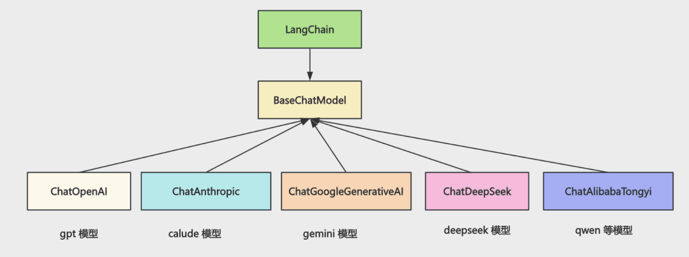
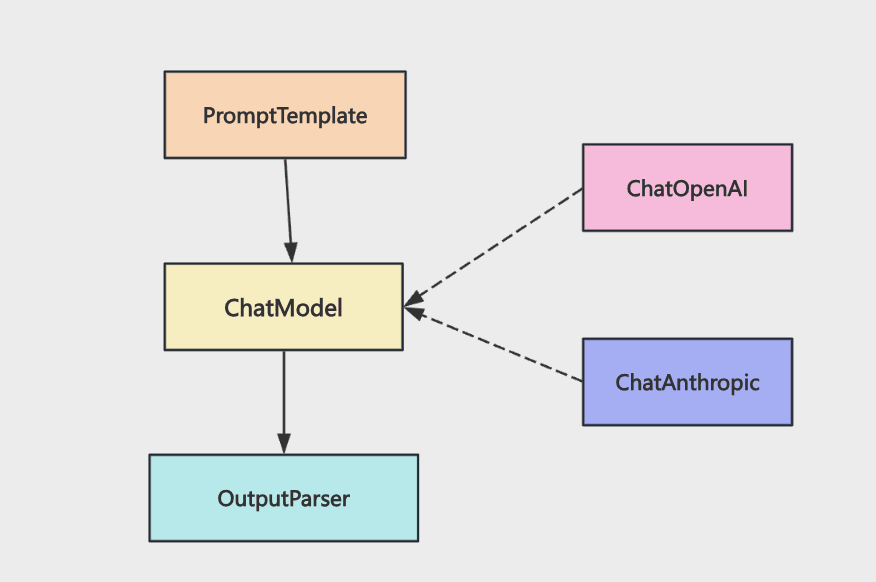
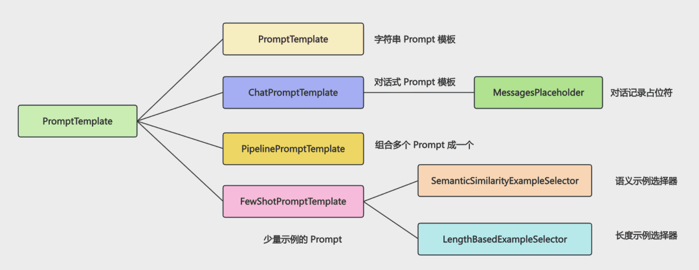
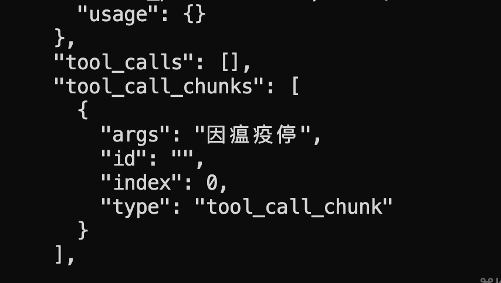
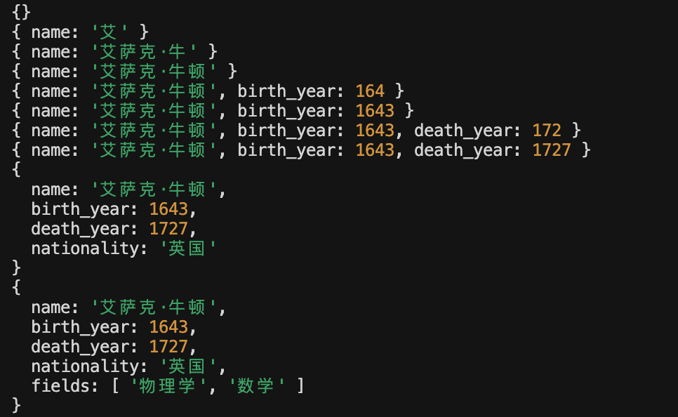
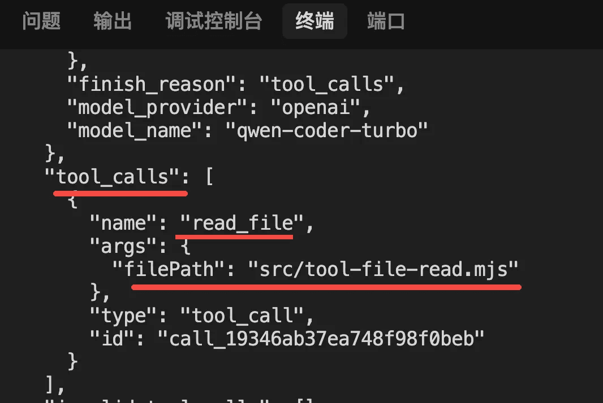
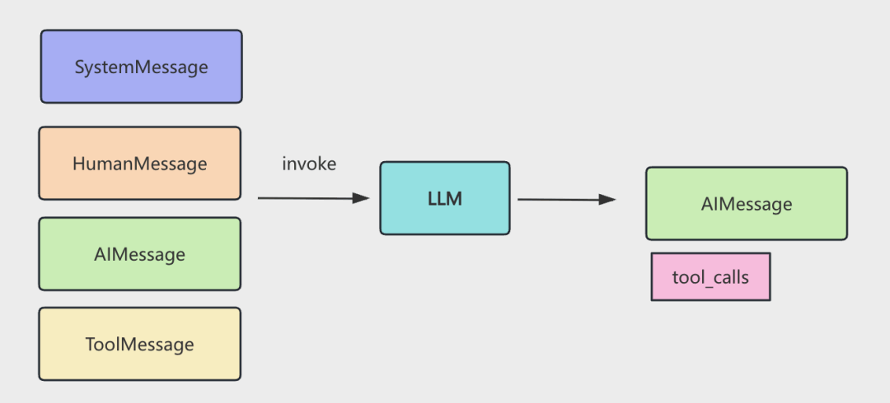
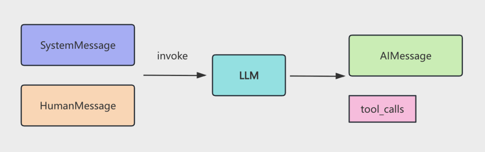

## 为什么要用 LangChain

LangChain 部分学完了，我们来整体总结一下。

首先，我们为什么要用 LangChain 这种 AI Agent 开发框架？

市面上有很多大模型，它们的 api  格式整体分为三类：

- OpenAI
- Anthropic（Claude）
- Google Gemini

国产大模型的 api 都兼容 OpenAI 格式

举个例子，比如 system 消息怎么传。

OpenAI 格式是这样：

```js
{
  "model": "gpt-3.5-turbo",
  "messages": [
    {"role": "system", "content": "你是代码助手"},
    {"role": "user", "content": "你好"}
  ]
}
```

放在 messages 数组里。

Anthropic 格式是这样：

```js
{
  "model": "claude-4.5-opus",
  "system": "你是一个代码助手",
  "messages": [
    {
      "role": "user", 
      "content": [{"type": "text", "text": "分析这段代码"}]
    }
  ]
}
```

放在单独的 system 字段

Gemini 的格式是这样：

```js
{
  "contents": [{
    "role": "user",
    "parts": [{ "text": "解释下这段代码" }]
  }],
  "system_instruction": { // 系统指令又是另一种写法
    "parts": [{ "text": "你是一个代码专家" }]
  }
}
```

放在 sytem_instruction 字段。

类似这样的差异挺多，如果直接和具体大模型耦合，那你的代码就没法切换其他模型了。

所以需要一个统一的写法，然后适配不同的大模型。


你如果用 LangChain，就是这样：



所有大模型的 api 都实现 BaseChatModel

这样调用的时候，api 一样。

细节由 ChatXxx 去实现。

它们在不同的包里：

- https://www.npmjs.com/package/@langchain/google-genai
- https://www.npmjs.com/package/@langchain/deepseek
- https://www.npmjs.com/package/@langchain/anthropic


也可能是在 @langchain/community 包：

有同学说，不对啊，不是说国产大模型都支持 OpenAI 格式么？之前我们也是直接用 ChatOpenAI 调用的 qwen-plus 之类的模型，为啥还有单独的 ChatModel

是的，虽然这些模型兼容 OpenAI 格式，但是每个大模型都有一些自己独有的细节，如果想用全部特性，还是要用专门的 ChatModel 类。

所以，为什么要用 LangChain？

它可以用统一的 ChatModel api 来调用各种大模型，屏蔽了底层差异。

基于 LangChain 可以做到切换各种大模型，代码不变。

所以，我们是基于 Langchain 的 api 来学习大模型的特性，而不是直接学某个大模型的特定 api。


## 输入控制

通过 BaseChatModel 屏蔽了大模型底层差异后，再就是对输入、输出做控制：



这就用到了 PromptTemplate 和 OutputParser 的 api

我们基于 prompt 来调用大模型

prompt 可能会很复杂，而且会长期迭代，这就需要组件化管理，用的时候组合，而且 prompt 里还需要加少量案例（Few Shot）。

所以 LangChain 提供了 PromptTemplate 的 api。


### ChatPromptTemplate

通过 ChatPromptTemplate 创建 prompt 模板：

```js
const chatPrompt = ChatPromptTemplate.fromMessages([
  [
    "system",
    `你是一名资深工程团队负责人，擅长用结构化、易读的方式写技术周报。
写作风格要求：{tone}。

请根据后续用户提供的信息，帮他生成一份适合给老板和团队同时抄送的周报草稿。`,
  ],
  [
    "human",
    `本周信息如下：

公司名称：{company_name}
团队名称：{team_name}
直接汇报对象：{manager_name}
本周时间范围：{week_range}

本周团队核心目标：
{team_goal}

本周开发数据（Git 提交 / Jira 任务等）：
{dev_activities}

请据此输出一份 Markdown 周报，结构建议包含：
1. 本周概览（2-3 句话）
2. 详细拆分（按项目或模块分段）
3. 关键指标表格（字段示例：模块 / 亮点 / 风险 / 下周计划）

语气专业但有人情味。`,
  ],
]);

const chatMessages = await chatPrompt.formatMessages({
  tone: "专业、清晰、略带鼓励",
  company_name: "星航科技",
  team_name: "智能应用平台组",
  manager_name: "王总",
  week_range: "2025-05-05 ~ 2025-05-11",
  team_goal: "完成内部 AI 助手灰度上线，并确保核心链路稳定。",
  dev_activities:
    "- 小李：完成 AI 助手工单流转能力，对接客服系统，提交 25 次\n" +
    "- 小张：接入日志检索和知识库查询，提交 19 次\n" +
    "- 小王：完善监控、告警与埋点，新增 10 条核心告警规则\n" +
    "- 实习生小陈：补充使用文档和 FAQ，支持 3 个内部试点团队",
});
```

其中的占位符用的时候传入。


### MessagePlaceHolder

**如果是对话记录，是通过 MessagePlaceHolder 传入**：

```js
const chatPromptWithHistory = ChatPromptTemplate.fromMessages([
  [
    "system",
    `你是一名资深工程效率顾问，善于在多轮对话的上下文中给出具体、可执行的建议。`,
  ],
  // 定义的 history
  new MessagesPlaceholder("history"),
  [
    "human",
    `这是用户本轮的新问题：{current_input}

请结合上面的历史对话，一并给出你的建议。`,
  ],
]);

const historyMessages = [
  {
    role: "human",
    content: "我们团队最近在做一个内部的周报自动生成工具。",
  },
  {
    role: "ai",
    content:
      "听起来不错，可以先把数据源（Git / Jira / 运维）梳理清楚，再考虑 Prompt 模块化设计。",
  },
  {
    role: "human",
    content: "我们已经把 Prompt 拆成了「人设」「背景」「任务」「格式」四块。",
  },
  {
    role: "ai",
    content:
      "很好，接下来可以考虑把这些模块做成可复用的 PipelinePromptTemplate，方便在不同场景复用。",
  },
];

const formattedMessages = await chatPromptWithHistory.formatPromptValue({
  // 传入
  history: historyMessages,
  current_input: "现在我们想再优化一下多人协同编辑周报的流程，有什么建议？",
});
```


### PipelinePromptTemplate

多个 PromptTemplate 可以用 PipelinePromptTemplate 组合

```js
const finalWeeklyPrompt = PromptTemplate.fromTemplate(
  `{persona_block}
{context_block}
{task_block}
{format_block}

现在请生成本周的最终周报：`
);

const pipelinePrompt = new PipelinePromptTemplate({
  // 定义 Prompt 模块流水线
  // name 与 finalWeeklyPrompt 中的 {persona_block}、{context_block}、{task_block}、{format_block} 对应
  pipelinePrompts: [
    { name: "persona_block", prompt: personaPrompt },
    { name: "context_block", prompt: contextPrompt },
    { name: "task_block", prompt: taskPrompt },
    { name: "format_block", prompt: formatPrompt },
  ],
  // 最终的 Prompt 模板
  finalPrompt: finalWeeklyPrompt,
  // 输入变量
  inputVariables: [
    "tone",
    "company_name",
    "team_name",
    "manager_name",
    "week_range",
    "team_goal",
    "dev_activities",
    "company_values",
  ],
});
```

比如指定多个 pipelinePrompts，然后指定最终的 finalPrompt，这样就是多个 PromptTemplate 合成一个。


### FewShotPromptTemplate

有时还需要加入一些示例，用 FewShotPromptTemplate

```js
const fewShotPrompt = new FewShotPromptTemplate({
  examples,
  examplePrompt,
  prefix: `下面是几条已经写好的【周报示例】，你可以从中学习语气、结构和信息组织方式：\n`,
  suffix:
    `\n基于上面的示例风格，请帮我写一份新的周报。` +
    `\n如果用户有额外要求，请在满足要求的前提下，尽量保持示例中的结构和条理性。`,
  inputVariables: [],
});
```

指定模板和填入的值就可以了：

```js
const examplePrompt = PromptTemplate.fromTemplate(
  `用户输入：{user_requirement}
期望周报结构：{expected_style}
模型示例输出片段：
{report_snippet}
---`
);

// 3. 准备几条示例数据（few-shot examples）
const examples = [
  {
    user_requirement:
      "重点突出稳定性治理，本周主要在修 Bug 和清理技术债，适合发给偏关注风险的老板。",
    expected_style: "语气稳健、偏保守，多强调风险识别和已做的兜底动作。",
    report_snippet:
      `- 支付链路本周共处理线上 P1 Bug 2 个、P2 Bug 3 个，全部在 SLA 内完成修复；\n` +
      `- 针对历史高频超时问题，完成 3 个核心接口的超时阈值和重试策略优化；\n` +
      `- 清理 12 条重复/噪音告警，减少值班同学 30% 的告警打扰。`,
  },
  {
    user_requirement:
      "偏向对外展示成果，希望多写一些亮点，适合发给更大范围的跨部门同学。",
    expected_style: "语气积极、突出成果，对技术细节做适度抽象。",
    report_snippet:
      `- 新上线「订单实时看板」，业务侧可以实时查看核心转化漏斗；\n` +
      `- 首次打通埋点 → 数据仓库 → 实时服务链路，为后续精细化运营提供基础能力；\n` +
      `- 和产品、运营一起完成 2 场内部分享，会后收到 15 条正向反馈。`,
  },
];
```

生成的就是这种带少量示例（Few Shot）的 prompt


### SemanticSimilarityExampleSelector / LengthBasedExampleSelector

而且还可以根据长度、语义来做示例选择

```js
const exampleSelector = new SemanticSimilarityExampleSelector({
  vectorStore,
  k: 2, // 每次只选出语义上最相近的 2 条示例
});
```

```js
const exampleSelector = await LengthBasedExampleSelector.fromExamples(
  examples,
  {
    examplePrompt,
    // 这里简单地用字符长度近似控制，真实项目中可以配合 token 估算
    maxLength: 700,
    getTextLength: (text) => text.length,
  }
);
```

这些就是 Prompt Template 的核心 api 了




## 输出控制

然后是输出部分，也就是 OutputParsr：

我们希望大模型按照我们指定的格式输出，比如某个 json 结构。

这依赖两种机制：tool_call、json schema


### tool_call

```js
// 定义
const scientistSchema = z.object({
  name: z.string().describe("科学家的全名"),
  birth_year: z.number().describe("出生年份"),
  nationality: z.string().describe("国籍"),
  fields: z.array(z.string()).describe("研究领域列表"),
});

// 核心：bindTools
const modelWithTool = model.bindTools([
  {
    name: "extract_scientist_info",
    description: "提取和结构化科学家的详细信息",
    schema: scientistSchema,
  },
]);

const response = await modelWithTool.invoke("介绍一下爱因斯坦");

console.log("response.tool_calls:", response.tool_calls);
```

```js
response.tool_calls: [
  {
    name: 'extract_scientist_info',
    args: {
      name: '阿尔伯特·爱因斯坦',
      birth_year: 1879,
      nationality: '德国/美国',
      fields: [Array]
    },
    type: 'tool_call',
    id: 'call_b8b3297e208a4f7f898c58'
  }
]
```

大模型训练的时候就强制 tool_call、json schema 只能输出符合格式的 json。

所以能保证返回的一定是符合格式要求的。

如果都不支持，也可以用 OutputParser，也就是在 prompt 里带上格式要求，然后按照这个格式解析：

```js
const parser = StructuredOutputParser.fromNamesAndDescriptions({
  name: "姓名",
  birth_year: "出生年份",
  nationality: "国籍",
  major_achievements: "主要成就，用逗号分隔的字符串",
  famous_theory: "著名理论",
});

const question = `请介绍一下爱因斯坦的信息。

${parser.getFormatInstructions()}`;
```

但不用自己区分用哪种方式，直接调用 model.withStructuredOutput 就可以了，LangChain 会根据调用的模型来选择用哪种（优先 tool call）。

```js
const scientistSchema = z.object({
  name: z.string().describe("科学家的全名"),
  birth_year: z.number().describe("出生年份"),
  nationality: z.string().describe("国籍"),
  fields: z.array(z.string()).describe("研究领域列表"),
});

// 使用 withStructuredOutput 方法
const structuredModel = model.withStructuredOutput(scientistSchema);
```

:::info 解释

`const structuredModel = model.withStructuredOutput(scientistSchema)`

表面看：让模型按这个 schema 输出 JSON

实际发生的是：

LangChain 在背后做了这一步：判断模型能力 ——> 选择实现方式 ——> 帮你封装调用

可以理解为一个策略：

```
if (模型支持 tool call) {
  👉 用 tool call（最稳定）
} else if (支持 JSON mode) {
  👉 用 JSON schema
} else {
  👉 fallback：prompt + parser
}
```


情况 1：模型支持 Tool Call

LangChain 会偷偷帮你变成：

```
model.bindTools([
  {
    name: "output_formatter",
    schema: scientistSchema
  }
])
```

然后强制模型：调用这个 tool 来输出结果

返回其实是：

```
{
  "tool_calls": [
    {
      "name": "output_formatter",
      "args": {
        "name": "爱因斯坦",
        ...
      }
    }
  ]
}
```

最后 LangChain 再帮你提取：`return args`


情况2：模型支持 JSON mode

有些模型支持：`{ "type": "json_object" }`

LangChain 会：

- 设置 response_format
- 强制输出 JSON


情况3：都不支持（兜底）

才会退回你之前那种：`StructuredOutputParser`

:::


### json schema

一般用 model.withStructuredOutput 就可以了，但在一些场景下，还是需要 OutputParser 的：

- 流式打印
- 非 json 格式

比如我们做的流式版 mini cursor

就是用的 JsonOutputToolsParser 解析了流式的内容

之前流式返回的内容是这样的：



参数片段在 tool_call_chunks 里

用了 JsonOutputToolsParser 是这样的：



这时候的片段信息不完整，比如少了大括号，少了一半引号等

如果自己解析 json 还是挺麻烦的，就可以直接用这个 OutputParser

类似这种 OutputParser 我们也学了一些：

- **StringOutputParser**：从各种格式里取出内容，返回字符串
- **StructuredOutputParser**：按照某种 JSON 格式返回内容并解析成对象
- **XMLOutputParser**：按照 xml 格式返回内容并解析成对象
- **JsonOutputToolsParser**：解析 tool_call 的信息，支持流式

在大模型的输出控制方面，model.withStructuredOutput 加上 OutputParser 就够用了。


### 对比`tool_call` 和 `json schema`

想让大模型输出指定 JSON，本质有两种机制：

1. **Tool Call（函数调用）**：强约束（结构最稳定）

 2. **JSON Schema（结构化输出）**：弱约束（更灵活，但可能出错）


#### Tool Call

本质：让模型**不是“输出 JSON”**，而是：调用一个函数，并传参数

模型返回的不是文本，而是：

```json
{
  "tool_calls": [
    {
      "name": "getHotels",
      "args": {
        "city": "北京",
        "count": 3
      }
    }
  ]
}
```


优点：

- 结构**100%可靠**
- 不需要 parse JSON
- 天然支持多工具调用
- 可直接执行（你现在就是）


本质理解（非常重要）

> Tool Call ≠ 输出 JSON
>  Tool Call = **让模型生成“函数参数 AST”**


在 LangChain 里的体现：`model.bindTools(tools)`

模型就会：

- 自动决定是否调用 tool
- 自动生成参数（符合 schema）


#### JSON Schema

本质

告诉模型：你必须输出这个 JSON 结构


示例

```js
const schema = z.object({
  name: z.string(),
  age: z.number(),
});
```

模型输出：

```
{
  "name": "张三",
  "age": 18
}
```

在 LangChain：`model.withStructuredOutput(schema)`


优点

- 简单
- 不需要 tool
- 适合“纯数据生成”


问题

- 可能输出：

```
{
  "name": "张三",
  "age": "十八岁" ❌
}
```

- 或者：

```
这是结果：
{
 ...
}
```

需要 parser / retry


#### 两者核心区别

| 维度           | Tool Call                                                | JSON Schema                                                  |
| -------------- | -------------------------------------------------------- | ------------------------------------------------------------ |
| 本质           | 调函数                                                   | 生成文本                                                     |
| 可靠性         | ✅ 极高                                                   | ⚠️ 中等                                                       |
| 是否可执行     | ✅ 可以直接执行                                           | ❌ 需要解析                                                   |
| 是否支持多步骤 | ✅ 天然支持                                               | ❌ 不支持                                                     |
| 适合场景       | - 调 MCP<br />- 调用 API<br />- 控浏览器<br />- 做 Agent | - 数据生成<br />- 输出结构化结果<br />- 不需要执行<br /><br />可以用`withStructuredOutput` |


## 输出格式控制

输出格式控制用到了 tool_call，这是我们最先学的特性

```js
const readFileTool = tool(
  async ({ filePath }) => {
    const content = await fs.readFile(filePath, "utf-8");
    console.log(
      `  [工具调用] read_file("${filePath}") - 成功读取 ${content.length} 字节`
    );
    return `文件内容:\n${content}`;
  },
  {
    name: "read_file",
    description:
      "用此工具来读取文件内容。当用户要求读取文件、查看代码、分析文件内容时，调用此工具。输入文件路径（可以是相对路径或绝对路径）。",
    schema: z.object({
      filePath: z.string().describe("要读取的文件路径"),
    }),
  }
);

const tools = [readFileTool];

const modelWithTools = model.bindTools(tools);
```

定义 tool，加一下 name、description、参数 schema

然后 model.bindTools 绑定到大模型

只要描述写的清楚，那大模型就会在需要调用 tool 的时候返回 tool_calls 信息：



并且按照你指定的 schema 来填充参数。



这样我们根据 tool_calls 去调用工具，然后把结果封装成 ToolMessage 也放入 messages 数组。

之后继续循环调用：



直到没有新的 tool_call ，循环结束

当然，不是所有的 tool 都要自己写，有很多 MCP，也就是可跨进程调用的 tool 可以直接复用

如果 MCP Server 跑在本地进程，就是用 stdio 进程通信，否则就是 http 通信

比如高德 MCP 是用了 http 通信，而 Chrome Devtools 的 MCP 用了 stdio 本地进程通信

在 cursor 等编辑器里配置好 MCP Server 后就可以看到 MCP 提供的所有的 tools

代码里是用 @langchain/mcp-adapters 这个包来和 MCP Server 通信

client.getTools 拿到所有 tool，然后绑定到大模型就好了，其余的和自己定义的 tool 没区别。

```js
const mcpClient = new MultiServerMCPClient({
  mcpServers: {
    "my-mcp-server": {
      command: "node",
      args: ["/Users/mac/jiuci/github/aiagent/src/4/my-mcp-server.mjs"],
    },
  },
});

const tools = await mcpClient.getTools();
const modelWithTools = model.bindTools(tools);
```


## 上下文超出处理

如果聊的多了，这样可能会超过大模型上下文限制，就需要做一些 memory 的处理。

比如你用 cursor、claude code 的时候，token 到了上限就会触发总结：

当然，messages 数组的写法太原始，一般用 ChatMessageHistory 的 api：

```
                                     inMemoryChatMessageHistory          存内存里

                                     RedisChatMessageHistory          存到 redis

BaseChatMessageHistory 

                                     FileSystemChatMessageHistory            存文件

                                     TypeORMChatMessageHistory       通过 typeorm 存在 mysql 等数据库
```


它可以把 messages 存到内存、redis、文件、数据库等。

memory 的管理策略也有三种：

- **截断**，去掉之前的一些 message

- **总结**，调用大模型对之前的 messages 生成摘要
- **检索**，基于向量数据库根据 query 检索之前聊的内容来继续聊


## RAG

长时记忆基本都是要用向量数据库检索的。

检索涉及到 RAG，这基本也是 Agent 必备的功能。

把一段内容向量化，在坐标空间内就可以通过夹角来判断相似度：

也就是余弦相似度。

当然实际上向量的维度很大，比如 1024

基于 Milvus 之类的向量数据库，可以快速根据向量的余弦相似度，检索出相关文档。

RAG 的流程是这样的：

- 首先内容存入向量数据库
- 各种来源的内容，通过 loader 加载，用 Splitter 分割后再用嵌入模型向量化，存到 Milvus 之类的向量数据库。
- 之后根据 query 向量化之后去做余弦相似度匹配，就可以检索出相关文档，让大模型生成回答


当然，我们是直接用的 @zilliz/milvus2-sdk-node 这个 Milvus 的包

实际上 LangChain 有一层封装，在 @langchin/comunity 包下，用这层封装是更好的，就像前面讲 ChatModel 一样，它也是屏蔽了底层差异。调用 similaritySearchVectorWithScore 做相似度检索。


## LCEL

至此，我们 LangChain 的各个组件就都过了一遍：

ChatModel、PromptTemplate、OutputParser、tool、mcp、memory、RAG

但如果硬编码的方式组合这些组件不好管理，每个人写法都不一样。

而且如果你想加一下监测某个组件输入输出、执行耗时、token 消耗等逻辑，也得硬编码。

所以 LangChain 提供了一种声明式的编码方式：LCEL。

LCEL 就是：

每个组件都实现了 Runnable 接口，比如 ChatModel、OutputParser、PromptTemplate 等。

并且提供了一系列 Runnable 的 api 可以连接不同的组件：


这样组装出一条 chain 之后，统一执行。

而且调用方式有 invoke（同步调用）、stream（流式）、batch（批量调用） 三种：


通过 LCEL 的写法，把各个组件用声明式的方式连接起来，可以动态加一些逻辑。

而且每个节点自带了重试、备选方案、配置等功能，开箱即用

当然，这种写法要学一些 api：

- **RunnableSequence**：顺序执行
- **RunnableLambda**：把函数包装成 Runnable
- **RunnableMap**：并行执行多个 chain，结果放在对象属性上
- **RunnableBranch**：if else 逻辑
- **RouterRunnable**：switch case 逻辑，根据 key 决定执行哪个 chain
- **RunnableEach**：循环数组每个元素来调用 chain
- **RunnablePassthrough**：拿到原始输入
- **RunnablePick**：取输入对象的某些属性返回
- **RunnableWithMessageHistory**：给 chain 加上 memory

刚开始可能不大习惯，但是多练习写几个 chain  就会了。


## 总结

LangChain 通过 ChatModel 屏蔽了各种大模型的差异，可以用同样的 api 来写代码，可以切换大模型。

我们过了一遍各种组件 ChatModel、PromptTemplate、tool & mcp、OutputParser、memory、RAG 等

然后是 LCEL 组合各种组件，编排 chain，它可以给节点动态增删逻辑，而且还内置了一些功能。

学完组件可以说 LangChain 是工具集，学完 LCEL 就可以说 LangChain 是工业流水线了。

把这两方面都掌握好，LangChain 就学的差不多了。

学到这里，AI Agent 学习整体告一段落，你也可以自己总结回顾下了。


