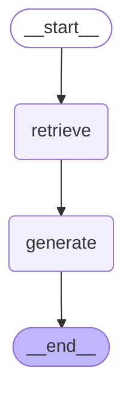
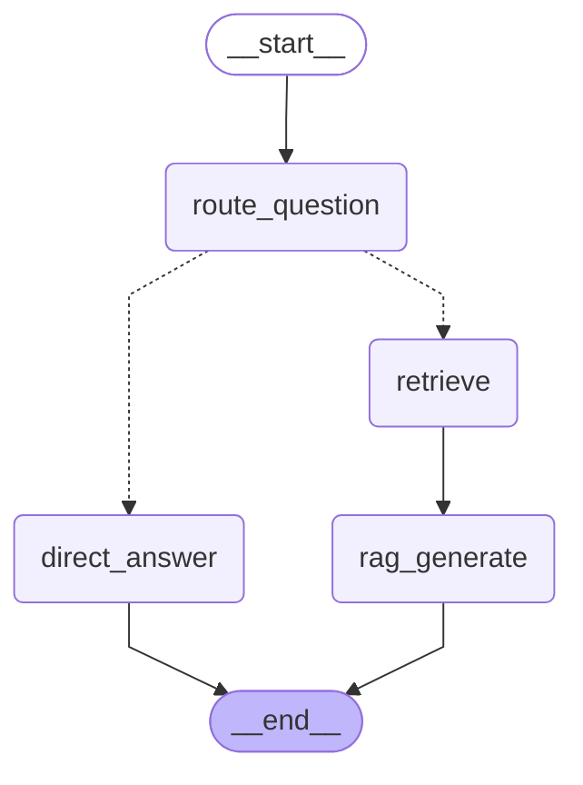
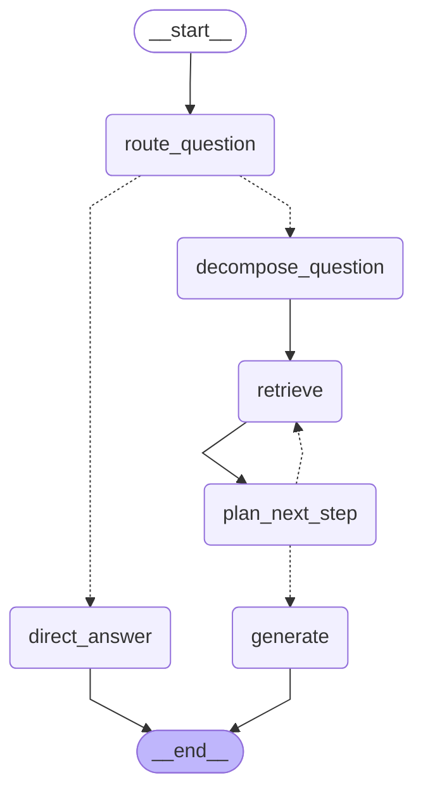
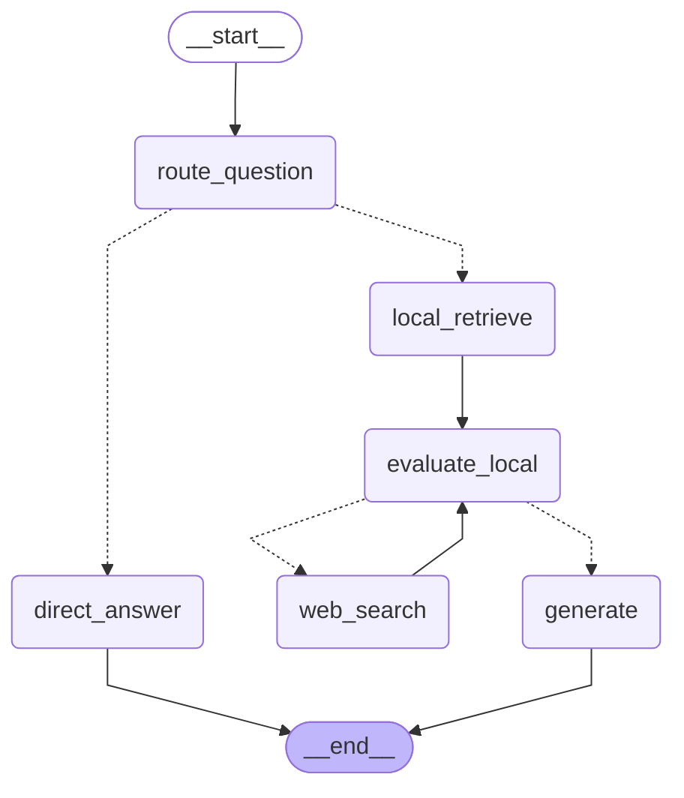

## 前言

公司内部的 Agent 基本都要用到 RAG。

因为大模型能思考，但它不知道公司内部的文档，而我们需要它能基于内部文档来回答。

传统 RAG 是这样的：

查询的时候，把 query 用嵌入模型向量化，根据余弦相似度，匹配向量数据库中最相近的文档返回


但这个流程太固定，会有一些问题：

- 所有问题都走检索，其实简单常识类问题不需要检索，浪费资源
- 没有纠错和评估机制，无法判断检索内容是否准确、是否足够
- 处理不了需要多步检索的复杂问题，比如先查 A、再查 B 才能得出结论
- 专业术语、精确实体更适合关键词检索，纯语义检索容易匹配不准
- 本地知识库没有的内容，不会主动去网络搜索补充，容易编造答案

解决这些问题，显然要在 RAG 的固定流程中，引入大模型来思考。

- 让模型根据问题类型选择检索策略，简单问题直接回答，复杂问题才走完整检索
- 评估检索结果是否相关、是否足够，让模型判断是否需要重新检索或补充检索
- 让模型自动拆解复杂问题，决定先查什么、后查什么，实现多步检索
- 同时结合关键词检索与语义检索，由模型统一融合多路结果，提升专业场景准确率
- 让模型判断本地知识库是否覆盖答案，覆盖不足时自动触发网络搜索补充信息

最终把原本 “死板的检索 - 生成” 流程，升级为可思考、可判断、可纠错的智能 RAG 架构。

这种由大模型自主决策怎么检索、检索的信息是否足够、是否要重新检索等的 RAG 流程就叫 **Agentic RAG**。


这很适合用 LangGraph 的多 Agent 架构来做，每个 Agent 负责其中一块功能。


## 传统 RAG

我们先基于 LangGraph 实现传统 RAG

创建 src/naive-rag.mjs

```js
import "dotenv/config";
import { ChatOpenAI, OpenAIEmbeddings } from "@langchain/openai";
import { Annotation, END, START, StateGraph } from "@langchain/langgraph";
import { Milvus } from "@langchain/community/vectorstores/milvus";

const COLLECTION_NAME = "ebook_collection";
const TOP_K = 5;

const GraphState = Annotation.Root({
  question: Annotation,
  k: Annotation,
  documents: Annotation,
  generation: Annotation,
});

const model = new ChatOpenAI({
  temperature: 0,
  model: "qwen-plus",
  configuration: {
    baseURL: process.env.OPENAI_BASE_URL,
  },
  apiKey: process.env.OPENAI_API_KEY,
});

const embeddings = new OpenAIEmbeddings({
  model: "text-embedding-v3",
  dimensions: 1024,
});

let vectorStore;

async function retrieveRelevantContent(question, k = TOP_K) {
  try {
    const docsWithScores = await vectorStore.similaritySearchWithScore(
      question,
      k,
    );
    return docsWithScores.map(([doc, score]) => ({
      score,
      content: doc.pageContent,
      id: doc.metadata?.id ?? "unknown",
      book_id: doc.metadata?.book_id ?? "未知",
      chapter_num: doc.metadata?.chapter_num ?? "未知",
      index: doc.metadata?.index ?? "未知",
    }));
  } catch (error) {
    console.error("检索内容时出错:", error.message);
    return [];
  }
}

const retrieveNode = async (state) => {
  const documents = await retrieveRelevantContent(state.question, state.k);
  return {
    question: state.question,
    k: state.k,
    documents,
  };
};

const generateNode = async (state) => {
  const context = state.documents
    .map(
      (item, i) =>
        `[片段 ${i + 1}]
章节: 第 ${item.chapter_num} 章
内容: ${item.content}`,
    )
    .join("\n\n━━━━━\n\n");

  const prompt = `你是一个专业的《天龙八部》小说助手。基于小说内容回答问题，用准确、详细的语言。

请根据以下《天龙八部》小说片段内容回答问题：
${context}

用户问题: ${state.question}

回答要求：
1. 如果片段中有相关信息，请结合小说内容给出详细、准确的回答
2. 可以综合多个片段的内容，提供完整的答案
3. 如果片段中没有相关信息，请如实告知用户
4. 回答要准确，符合小说的情节和人物设定
5. 可以引用原文内容来支持你的回答

AI 助手的回答:`;

  process.stdout.write("\n【AI 回答（流式）】\n");
  let generation = "";
  const stream = await model.stream(prompt);
  for await (const chunk of stream) {
    const text = typeof chunk.content === "string" ? chunk.content : "";
    if (!text) continue;
    generation += text;
    process.stdout.write(text);
  }
  process.stdout.write("\n");

  return {
    question: state.question,
    k: state.k,
    documents: state.documents,
    generation,
  };
};

const graph = new StateGraph(GraphState)
  .addNode("retrieve", retrieveNode)
  .addNode("generate", generateNode)
  .addEdge(START, "retrieve")
  .addEdge("retrieve", "generate")
  .addEdge("generate", END)
  .compile();

async function main() {
  const question = "阿朱的结局是什么？";
  const kArg = 5;

  // 导出为 Mermaid：可复制到 https://mermaid.live 或 Markdown 的 ```mermaid 代码块
  const drawable = await graph.getGraphAsync();
  const mermaid = drawable.drawMermaid({ withStyles: true });
  console.log(mermaid);

  console.log("连接到 Milvus...");
  vectorStore = await Milvus.fromExistingCollection(embeddings, {
    collectionName: COLLECTION_NAME,
    url: "localhost:19530",
    textField: "content",
    primaryField: "id",
    vectorField: "vector",
    indexCreateOptions: {
      metric_type: "COSINE",
      index_type: "HNSW",
      params: { M: 16, efConstruction: 200 },
      search_params: { ef: 64 },
    },
  });
  vectorStore.indexSearchParams = {
    metric_type: "COSINE",
    params: JSON.stringify({ ef: 64 }),
  };
  console.log("✓ 已连接\n");

  try {
    await vectorStore.client.loadCollection({
      collection_name: COLLECTION_NAME,
    });
    console.log(`✓ 集合 ${COLLECTION_NAME} 已加载\n`);
  } catch (error) {
    if (!error.message.includes("already loaded")) {
      throw error;
    }
    console.log(`✓ 集合 ${COLLECTION_NAME} 已处于加载状态\n`);
  }

  console.log("=".repeat(80));
  console.log(`问题: ${question}`);
  console.log("=".repeat(80));

  const result = await graph.invoke({
    question,
    k: Number.isFinite(kArg) ? kArg : TOP_K,
    documents: [],
    generation: "",
  });

  console.log("\n【检索相关内容】");
  if (result.documents.length === 0) {
    console.log("未找到相关内容");
    console.log("\n【AI 回答】");
    console.log("抱歉，我没有找到相关的《天龙八部》内容。");
    return;
  } else {
    result.documents.forEach((item, i) => {
      console.log(`\n[片段 ${i + 1}] 相似度: ${item.score.toFixed(4)}`);
      console.log(`书籍: ${item.book_id}`);
      console.log(`章节: 第 ${item.chapter_num} 章`);
      console.log(`片段索引: ${item.index}`);
      console.log(
        `内容: ${item.content.substring(0, 200)}${item.content.length > 200 ? "..." : ""}`,
      );
    });
  }

  if (!result.generation) {
    console.log("\n【AI 回答】");
    console.log("模型未返回内容。");
  }
}

main();
```

RAG 是一个线性的流程，之前用 LCEL 的链写过，这次用 langgraph 来写：



**检索节点**就是把 query 向量化从 Milvus 里检索相关文档：


**生成节点**是把检索的文档放到 prompt 里，调用大模型生成回答：


然后我们一条条来解决上面的问题。


## 解决问题

### 让模型根据问题类型选择检索策略，简单问题直接回答，复杂问题才走完整检索

这个就是加一个节点来做判断，是直接回答，还是先检索向量数据库再回答

src/rag-query-router.mjs

```js
import "dotenv/config";
import { z } from "zod";
import { ChatOpenAI, OpenAIEmbeddings } from "@langchain/openai";
import { Annotation, END, START, StateGraph } from "@langchain/langgraph";
import { Milvus } from "@langchain/community/vectorstores/milvus";

const llm = new ChatOpenAI({
  temperature: 0,
  model: "qwen-plus",
  configuration: {
    baseURL: process.env.OPENAI_BASE_URL,
  },
  apiKey: process.env.OPENAI_API_KEY,
});

const embeddings = new OpenAIEmbeddings({
  model: "text-embedding-v3",
  dimensions: 1024,
  configuration: {
    baseURL: process.env.OPENAI_BASE_URL,
  },
  apiKey: process.env.OPENAI_API_KEY,
});

const RouteSchema = z.object({
  strategy: z.enum(["simple", "complex"]),
  reason: z.string(),
});

const GraphState = Annotation.Root({
  question: Annotation,
  k: Annotation,
  strategy: Annotation,
  routeReason: Annotation,
  documents: Annotation,
  generation: Annotation,
});

let vectorStore;

async function retrieveRelevantContent(question, k) {
  try {
    const docsWithScores = await vectorStore.similaritySearchWithScore(
      question,
      k,
    );
    return docsWithScores.map(([doc, score]) => ({
      score,
      content: doc.pageContent,
      id: doc.metadata?.id ?? "unknown",
      book_id: doc.metadata?.book_id ?? "未知",
      chapter_num: doc.metadata?.chapter_num ?? "未知",
      index: doc.metadata?.index ?? "未知",
    }));
  } catch (error) {
    console.error("检索内容时出错:", error.message);
    return [];
  }
}

const routeQuestionNode = async (state) => {
  console.log("---ROUTE_QUESTION---");
  const router = llm.withStructuredOutput(RouteSchema);
  const route = await router.invoke(`
你是问答路由器。请判断用户问题是否需要外部检索。

规则：
- simple: 常识问答、简短定义、无需特定小说细节即可回答。
- complex: 需要《天龙八部》具体情节、人物关系、章节事实、原文细节或证据支持。

用户问题：${state.question}
`);

  console.log(`路由策略: ${route.strategy} (${route.reason})`);
  return {
    question: state.question,
    k: state.k,
    strategy: route.strategy,
    routeReason: route.reason,
  };
};

const retrieveNode = async (state) => {
  console.log("---RETRIEVE---");
  const documents = await retrieveRelevantContent(state.question, state.k);
  if (documents.length === 0) {
    console.log("RETRIEVE结果: 未命中文档");
  } else {
    console.log(`RETRIEVE结果: 命中 ${documents.length} 条`);
    documents.forEach((item, i) => {
      const preview =
        item.content.length > 120
          ? `${item.content.substring(0, 120)}...`
          : item.content;
      console.log(
        `[R${i + 1}] score=${Number(item.score).toFixed(4)} chapter=${item.chapter_num} index=${item.index}`,
      );
      console.log(`      ${preview}`);
    });
  }
  return {
    question: state.question,
    k: state.k,
    strategy: state.strategy,
    routeReason: state.routeReason,
    documents,
  };
};

const directAnswerNode = async (state) => {
  console.log("---DIRECT_ANSWER---");
  process.stdout.write("\n【AI 回答（流式）】\n");
  let generation = "";
  const stream = await llm.stream(`你是一个中文问答助手，请直接简洁回答问题。

问题：${state.question}
`);
  for await (const chunk of stream) {
    const text = typeof chunk.content === "string" ? chunk.content : "";
    if (!text) continue;
    generation += text;
    process.stdout.write(text);
  }
  process.stdout.write("\n");
  return {
    question: state.question,
    k: state.k,
    strategy: state.strategy,
    routeReason: state.routeReason,
    documents: [],
    generation,
  };
};

const ragGenerateNode = async (state) => {
  console.log("---RAG_GENERATE---");
  const context = state.documents
    .map(
      (item, i) =>
        `[片段 ${i + 1}]
章节: 第 ${item.chapter_num} 章
内容: ${item.content}`,
    )
    .join("\n\n━━━━━\n\n");
  process.stdout.write("\n【AI 回答（流式）】\n");
  let generation = "";
  const stream =
    await llm.stream(`你是一个专业的《天龙八部》小说助手。基于小说内容回答问题，用准确、详细的语言。

请根据以下《天龙八部》小说片段内容回答问题：
${context || "（未检索到相关内容）"}

用户问题: ${state.question}

回答要求：
1. 如果片段中有相关信息，请结合小说内容给出详细、准确的回答
2. 可以综合多个片段的内容，提供完整的答案
3. 如果片段中没有相关信息，请如实告知用户
4. 回答要准确，符合小说的情节和人物设定
5. 可以引用原文内容来支持你的回答

AI 助手的回答:`);
  for await (const chunk of stream) {
    const text = typeof chunk.content === "string" ? chunk.content : "";
    if (!text) continue;
    generation += text;
    process.stdout.write(text);
  }
  process.stdout.write("\n");

  return {
    question: state.question,
    k: state.k,
    strategy: state.strategy,
    routeReason: state.routeReason,
    documents: state.documents,
    generation,
  };
};

function decideNext(state) {
  return state.strategy === "simple" ? "direct_answer" : "retrieve";
}

const graph = new StateGraph(GraphState)
  .addNode("route_question", routeQuestionNode)
  .addNode("direct_answer", directAnswerNode)
  .addNode("retrieve", retrieveNode)
  .addNode("rag_generate", ragGenerateNode)
  .addEdge(START, "route_question")
  .addConditionalEdges("route_question", decideNext, {
    direct_answer: "direct_answer",
    retrieve: "retrieve",
  })
  .addEdge("retrieve", "rag_generate")
  .addEdge("direct_answer", END)
  .addEdge("rag_generate", END)
  .compile();

async function main() {
  const question = "阿朱的结局是什么？";
  const k = 5;

  // 导出为 Mermaid：可复制到 https://mermaid.live 或 Markdown 的 ```mermaid 代码块
  const drawable = await graph.getGraphAsync();
  const mermaid = drawable.drawMermaid({ withStyles: true });
  console.log(mermaid);

  console.log("连接到 Milvus...");
  vectorStore = await Milvus.fromExistingCollection(embeddings, {
    collectionName: "ebook_collection",
    url: "localhost:19530",
    textField: "content",
    primaryField: "id",
    vectorField: "vector",
    indexCreateOptions: {
      metric_type: "COSINE",
      index_type: "HNSW",
      params: { M: 16, efConstruction: 200 },
      search_params: { ef: 64 },
    },
  });
  vectorStore.indexSearchParams = {
    metric_type: "COSINE",
    params: JSON.stringify({ ef: 64 }),
  };
  console.log("✓ 已连接\n");

  try {
    await vectorStore.client.loadCollection({
      collection_name: "ebook_collection",
    });
    console.log("✓ 集合 ebook_collection 已加载\n");
  } catch (error) {
    if (!error.message.includes("already loaded")) {
      throw error;
    }
    console.log("✓ 集合 ebook_collection 已处于加载状态\n");
  }

  console.log("=".repeat(80));
  console.log(`问题: ${question}`);
  console.log("=".repeat(80));

  const result = await graph.invoke({
    question,
    k: Number.isFinite(k) ? k : 5,
    strategy: "",
    routeReason: "",
    documents: [],
    generation: "",
  });

  if (result.strategy === "complex") {
    console.log("\n【检索相关内容】");
    if (result.documents.length === 0) {
      console.log("未找到相关内容");
    } else {
      result.documents.forEach((item, i) => {
        console.log(`\n[片段 ${i + 1}] 相似度: ${item.score.toFixed(4)}`);
        console.log(`书籍: ${item.book_id}`);
        console.log(`章节: 第 ${item.chapter_num} 章`);
        console.log(`片段索引: ${item.index}`);
        console.log(
          `内容: ${item.content.substring(0, 200)}${item.content.length > 200 ? "..." : ""}`,
        );
      });
    }
  }

  console.log(`\n最终策略: ${result.strategy}`);
  if (!result.generation?.trim()) {
    console.log("模型未返回内容。");
  }
}

main();
```

现在的 graph 如下：



我们加了一个对问题做路由的节点：


根据问题返回不同的类型，然后用 conditional edge 转到不同节点来处理

这个路由节点用 withStructuredOutput 来控制结构化输出


用大模型识别 query 是哪种类型，并给出原因

简单问题直接调大模型回答，复杂的问题先检索向量数据库再生成回答

这样就能识别出与小说相关的问题才走检索了。


### 处理不了需要多步检索的复杂问题，比如先查 A、再查 B 才能得出结论

比如这种：段誉遇到的第一个神仙姐姐画像，是谁的弟子？

直接把这个 query 向量化匹配显然不够准确

应该是先检索神仙姐姐画像是谁，有了结果再去检索她是谁的弟子。

所以我们要支持下子问题的拆分：

src/rag-multihop.mjs

```js
import "dotenv/config";
import { z } from "zod";
import { ChatOpenAI, OpenAIEmbeddings } from "@langchain/openai";
import { Annotation, END, START, StateGraph } from "@langchain/langgraph";
import { Milvus } from "@langchain/community/vectorstores/milvus";

const llm = new ChatOpenAI({
  temperature: 0,
  model: "qwen-plus",
  configuration: {
    baseURL: process.env.OPENAI_BASE_URL,
  },
  apiKey: process.env.OPENAI_API_KEY,
});

const embeddings = new OpenAIEmbeddings({
  model: "text-embedding-v3",
  dimensions: 1024,
  configuration: {
    baseURL: process.env.OPENAI_BASE_URL,
  },
  apiKey: process.env.OPENAI_API_KEY,
});

/**
 * complex：先拆解子问题序列，再按序检索
 */
const GraphState = Annotation.Root({
  question: Annotation,
  k: Annotation,
  strategy: Annotation,
  routeReason: Annotation,
  /** 拆解得到的有序子问题，仅用于检索 */
  subQuestions: Annotation,
  /** 下一轮 retrieve 要用的下标（指向 subQuestions 中尚未检索的那一条） */
  nextSubIdx: Annotation,
  documents: Annotation,
  currentQuery: Annotation,
  retrievalCount: Annotation,
  maxRetrievals: Annotation,
  plannedNext: Annotation,
  generation: Annotation,
});

let vectorStore;

async function retrieveRelevantContent(question, k) {
  try {
    const docsWithScores = await vectorStore.similaritySearchWithScore(
      question,
      k,
    );
    return docsWithScores.map(([doc, score]) => ({
      score,
      content: doc.pageContent,
      id: doc.metadata?.id ?? "unknown",
      book_id: doc.metadata?.book_id ?? "未知",
      chapter_num: doc.metadata?.chapter_num ?? "未知",
      index: doc.metadata?.index ?? "未知",
    }));
  } catch (error) {
    console.error("检索内容时出错:", error.message);
    return [];
  }
}

/** 按 id 合并；同 id 保留更高 score */
function mergeUnique(existingDocs, newDocs) {
  const map = newMap();
  for (const d of [...existingDocs, ...newDocs]) {
    const key = String(d.id);
    const prev = map.get(key);
    if (!prev || Number(d.score) > Number(prev.score)) {
      map.set(key, d);
    }
  }
  returnArray
    .from(map.values())
    .sort((a, b) => Number(b.score) - Number(a.score));
}

const RouteSchema = z.object({
  strategy: z.enum(["simple", "complex"]),
  reason: z.string(),
});

const DecomposeSchema = z.object({
  sub_questions: z.array(z.string()).min(1).max(8),
  reason: z.string(),
});

const NextStepSchema = z.object({
  nextAction: z.enum(["retrieve", "generate"]),
  reason: z.string(),
});

const routeQuestionNode = async (state) => {
  console.log("---ROUTE_QUESTION---");
  const router = llm.withStructuredOutput(RouteSchema);
  const route = await router.invoke(`
你是问答路由器。请判断用户问题是否需要外部检索。

规则：
- simple: 常识问答、简短定义、无需特定小说细节即可回答。
- complex: 需要《天龙八部》具体情节、人物关系、章节事实、原文细节或证据支持。

用户问题：${state.question}
`);

  console.log(`路由策略: ${route.strategy} (${route.reason})`);
  return {
    strategy: route.strategy,
    routeReason: route.reason,
    retrievalCount: 0,
    maxRetrievals: state.maxRetrievals ?? 8,
    documents: [],
    subQuestions: [],
    nextSubIdx: 0,
    currentQuery: "",
  };
};

const decomposeQuestionNode = async (state) => {
  console.log("---DECOMPOSE_QUESTION---");
  const decomposer = llm.withStructuredOutput(DecomposeSchema);
  const out =
    await decomposer.invoke(`你是《天龙八部》多跳问答的「子问题拆解器」。

用户原始问题：
${state.question}

任务：将问题拆成**有序**子问题列表 sub_questions，用于**依次向量检索**。要求：
1. 链式推理、多层关系、因果先后的问题，必须拆成多条；单跳即可答的也可只输出 1 条。
2. 每条子问题必须是**可独立检索**的完整中文问句，**禁止**使用「他/她/此人/上文」等指代；可写全人物名与事件名。
3. 顺序必须符合推理链：先搞清前置实体/事实，再查后续结论。
4. **不要**把整句原题原样复制成唯一一条（除非确实无法拆分）；不要拆成过碎的关键词列表。
5. 输出 1～8 条即可。

请输出 sub_questions 与简短 reason。`);

  const subQuestions = out.sub_questions.map((s) => s.trim()).filter(Boolean);
  if (subQuestions.length === 0) {
    thrownewError("decompose_question: sub_questions 为空");
  }

  console.log(`拆解 ${subQuestions.length} 条子问题 (${out.reason})`);
  subQuestions.forEach((q, i) => {
    console.log(`  [${i + 1}] ${q}`);
  });

  return {
    subQuestions,
    nextSubIdx: 0,
    currentQuery: subQuestions[0],
  };
};

const retrieveNode = async (state) => {
  const subs = state.subQuestions ?? [];
  const idx = state.nextSubIdx ?? 0;
  const q = subs[idx]?.trim();
  if (!q) {
    thrownewError(
      `retrieve: 子问题下标 ${idx} 无有效文本（共 ${subs.length} 条）`,
    );
  }

  const round = state.retrievalCount + 1;
  console.log(
    `---RETRIEVE (第 ${round} 轮，子问题 ${idx + 1}/${subs.length})---`,
  );
  console.log(`查询: ${q}`);

  const newDocs = await retrieveRelevantContent(q, state.k);
  const merged = mergeUnique(state.documents ?? [], newDocs);

  if (newDocs.length === 0) {
    console.log("本轮未命中文档");
  } else {
    console.log(
      `本轮命中 ${newDocs.length} 条，累计去重后 ${merged.length} 条`,
    );
    newDocs.forEach((item, i) => {
      const preview =
        item.content.length > 120
          ? `${item.content.substring(0, 120)}...`
          : item.content;
      console.log(
        `[R${i + 1}] score=${Number(item.score).toFixed(4)} chapter=${item.chapter_num} index=${item.index}`,
      );
      console.log(`      ${preview}`);
    });
  }

  return {
    documents: merged,
    retrievalCount: round,
    nextSubIdx: idx + 1,
    currentQuery: q,
  };
};

const planNextStepNode = async (state) => {
  console.log("---PLAN_NEXT_STEP---");
  const subs = state.subQuestions ?? [];
  const nextIdx = state.nextSubIdx ?? 0;
  const remaining = subs.length - nextIdx;

  const subList = subs
    .map(
      (s, i) =>
        `${i + 1}. ${s}${i < nextIdx ? " （已检索）" : i === nextIdx ? " （下一轮将检索，若选择继续）" : " （未检索）"}`,
    )
    .join("\n");

  const docStr =
    state.documents.length === 0
      ? "（尚无检索结果）"
      : state.documents
          .slice(0, 6)
          .map(
            (d, i) =>
              `[${i + 1}] score=${Number(d.score).toFixed(4)} 第${d.chapter_num}章: ${d.content.slice(0, 200)}${d.content.length > 200 ? "..." : ""}`,
          )
          .join("\n\n");

  const prompt = `你是多跳 RAG 规划器。检索查询已由前置步骤拆解为**有序子问题**；若需继续检索，下一轮将自动使用「下一条子问题」做向量检索，你**不要**自拟新的检索句。

用户原始问题：${state.question}

子问题序列：
${subList || "（无）"}

已检索轮数：${state.retrievalCount}；剩余未检索子问题条数：${remaining}
最大检索轮数上限：${state.maxRetrievals}

已召回文档摘要：
${docStr}

请判断下一步：
1) 已有足够依据回答用户原始问题 → nextAction=generate
2) 仍缺关键事实、且仍存在未检索的子问题、且未超过轮数上限 → nextAction=retrieve

硬性规则：
- 若剩余未检索子问题条数为 0，必须 nextAction=generate。
- 若已检索轮数已达到或超过最大检索轮数，必须 nextAction=generate。`;

  const model = llm.withStructuredOutput(NextStepSchema);
  const { nextAction, reason } = await model.invoke(prompt);

  let finalNext = nextAction;
  if (state.retrievalCount >= state.maxRetrievals) finalNext = "generate";
  if (remaining <= 0) finalNext = "generate";

  console.log(
    `[决策] plannedNext=${finalNext} (模型建议=${nextAction}) (${reason})`,
  );

  return {
    plannedNext: finalNext,
  };
};

function afterRoute(state) {
  return state.strategy === "simple" ? "direct_answer" : "decompose_question";
}

function afterPlan(state) {
  return state.plannedNext === "retrieve" ? "retrieve" : "generate";
}

const directAnswerNode = async (state) => {
  console.log("---DIRECT_ANSWER---");
  process.stdout.write("\n【AI 回答（流式）】\n");
  let generation = "";
  const stream = await llm.stream(`你是一个中文问答助手，请直接简洁回答问题。

问题：${state.question}
`);
  for await (const chunk of stream) {
    const text = typeof chunk.content === "string" ? chunk.content : "";
    if (!text) continue;
    generation += text;
    process.stdout.write(text);
  }
  process.stdout.write("\n");
  return { generation };
};

const generateNode = async (state) => {
  console.log("---GENERATE---");
  const context = state.documents
    .map(
      (item, i) =>
        `[片段 ${i + 1}]
章节: 第 ${item.chapter_num} 章
内容: ${item.content}`,
    )
    .join("\n\n━━━━━\n\n");
  process.stdout.write("\n【AI 回答（流式）】\n");
  let generation = "";
  const stream =
    await llm.stream(`你是一个专业的《天龙八部》小说助手。基于小说内容回答问题，用准确、详细的语言。

请根据以下《天龙八部》小说片段内容回答问题：
${context || "（未检索到相关内容）"}

用户问题: ${state.question}

回答要求：
1. 如果片段中有相关信息，请结合小说内容给出详细、准确的回答
2. 可以综合多个片段的内容，提供完整的答案
3. 如果片段中没有相关信息，请如实告知用户
4. 回答要准确，符合小说的情节和人物设定
5. 可以引用原文内容来支持你的回答

AI 助手的回答:`);
  for await (const chunk of stream) {
    const text = typeof chunk.content === "string" ? chunk.content : "";
    if (!text) continue;
    generation += text;
    process.stdout.write(text);
  }
  process.stdout.write("\n");
  return { generation };
};

const graph = new StateGraph(GraphState)
  .addNode("route_question", routeQuestionNode)
  .addNode("direct_answer", directAnswerNode)
  .addNode("decompose_question", decomposeQuestionNode)
  .addNode("retrieve", retrieveNode)
  .addNode("plan_next_step", planNextStepNode)
  .addNode("generate", generateNode)
  .addEdge(START, "route_question")
  .addConditionalEdges("route_question", afterRoute, {
    direct_answer: "direct_answer",
    decompose_question: "decompose_question",
  })
  .addEdge("decompose_question", "retrieve")
  .addEdge("retrieve", "plan_next_step")
  .addConditionalEdges("plan_next_step", afterPlan, {
    retrieve: "retrieve",
    generate: "generate",
  })
  .addEdge("direct_answer", END)
  .addEdge("generate", END)
  .compile();

async function main() {
  const question =
    "《天龙八部》中「四大恶人」排行第二的是谁？此人之子在身世揭晓前，其生父在武林中的公开身份是什么？";
  const k = 5;

  const drawable = await graph.getGraphAsync();
  console.log(drawable.drawMermaid({ withStyles: true }));

  console.log("连接到 Milvus...");
  vectorStore = await Milvus.fromExistingCollection(embeddings, {
    collectionName: "ebook_collection",
    url: "localhost:19530",
    textField: "content",
    primaryField: "id",
    vectorField: "vector",
    indexCreateOptions: {
      metric_type: "COSINE",
      index_type: "HNSW",
      params: { M: 16, efConstruction: 200 },
      search_params: { ef: 64 },
    },
  });
  vectorStore.indexSearchParams = {
    metric_type: "COSINE",
    params: JSON.stringify({ ef: 64 }),
  };
  console.log("✓ 已连接\n");

  try {
    await vectorStore.client.loadCollection({
      collection_name: "ebook_collection",
    });
    console.log("✓ 集合 ebook_collection 已加载\n");
  } catch (error) {
    if (!error.message.includes("already loaded")) {
      throw error;
    }
    console.log("✓ 集合 ebook_collection 已处于加载状态\n");
  }

  console.log("=".repeat(80));
  console.log(`问题: ${question}`);
  console.log("=".repeat(80));

  const result = await graph.invoke({
    question,
    k: Number.isFinite(k) ? k : 5,
    strategy: "",
    routeReason: "",
    subQuestions: [],
    nextSubIdx: 0,
    documents: [],
    currentQuery: "",
    retrievalCount: 0,
    maxRetrievals: 8,
    plannedNext: "",
    generation: "",
  });

  if (result.strategy === "complex") {
    if (result.subQuestions?.length) {
      console.log("\n【子问题序列】");
      result.subQuestions.forEach((s, i) => console.log(`  ${i + 1}. ${s}`));
    }
    console.log("\n【检索相关内容（累计）】");
    if (result.documents.length === 0) {
      console.log("未找到相关内容");
    } else {
      result.documents.forEach((item, i) => {
        console.log(
          `\n[片段 ${i + 1}] 相似度: ${Number(item.score).toFixed(4)}`,
        );
        console.log(`书籍: ${item.book_id}`);
        console.log(`章节: 第 ${item.chapter_num} 章`);
        console.log(`片段索引: ${item.index}`);
        console.log(
          `内容: ${item.content.substring(0, 200)}${item.content.length > 200 ? "..." : ""}`,
        );
      });
    }
    console.log(
      `\n检索轮数: ${result.retrievalCount} / ${result.maxRetrievals}`,
    );
  }

  console.log(`\n最终策略: ${result.strategy}`);
  if (!result.generation?.trim()) {
    console.log("模型未返回内容。");
  }
}

main().catch((err) => {
  console.error("运行失败:", err);
  process.exit(1);
});
```

整体流程如图：



首先拆分成多个子问题：


把原始问题拆成多个子问题的数组。

然后检索的时候根据 state 里的当前下标来检索对应问题的文档：


这里因为会检索多轮，所以做了一下 id 的去重。

接下来判断是否检索完了，如果没有就继续检索：


直到循环完，就检索完了所有子问题，接下来就生成回答就好了。


### 本地知识库没有的内容，不会主动去网络搜索补充，容易编造答案

如果知识库中没有的内容，这时候 agent 就不知道怎么回答了。

这种情况我们可以调用网络搜索来兜底，把搜索结果放到 prompt 里来参考生成回答。

src/rag-webfallback.mjs

```js
import "dotenv/config";
import { z } from "zod";
import { ChatOpenAI, OpenAIEmbeddings } from "@langchain/openai";
import { Annotation, END, START, StateGraph } from "@langchain/langgraph";
import { Milvus } from "@langchain/community/vectorstores/milvus";

const llm = new ChatOpenAI({
  temperature: 0,
  model: "qwen-plus",
  configuration: { baseURL: process.env.OPENAI_BASE_URL },
  apiKey: process.env.OPENAI_API_KEY,
});

const embeddings = new OpenAIEmbeddings({
  model: "text-embedding-v3",
  dimensions: 1024,
  configuration: { baseURL: process.env.OPENAI_BASE_URL },
  apiKey: process.env.OPENAI_API_KEY,
});

const GraphState = Annotation.Root({
  question: Annotation,
  k: Annotation,
  strategy: Annotation,
  routeReason: Annotation,
  retrievedDocs: Annotation,
  localContext: Annotation,
  webContext: Annotation,
  evaluation: Annotation,
  generation: Annotation,
});

let vectorStore;

async function retrieveRelevantContent(query, k) {
  try {
    const docsWithScores = await vectorStore.similaritySearchWithScore(
      query,
      k,
    );
    return docsWithScores.map(([doc, score]) => ({
      score,
      content: doc.pageContent,
      id: doc.metadata?.id ?? "unknown",
      book_id: doc.metadata?.book_id ?? "未知",
      chapter_num: doc.metadata?.chapter_num ?? "未知",
      index: doc.metadata?.index ?? "未知",
    }));
  } catch (error) {
    console.error("检索内容时出错:", error.message);
    return [];
  }
}

const RouteSchema = z.object({
  strategy: z.enum(["simple", "complex"]),
  reason: z.string(),
});

const routeQuestionNode = async (state) => {
  console.log("---ROUTE_QUESTION---");
  const router = llm.withStructuredOutput(RouteSchema);
  const route = await router.invoke(`
你是问答路由器。请判断用户问题是否需要外部检索。

规则：
- simple: 常识问答、简短定义、无需特定小说细节即可回答。
- complex: 需要《天龙八部》具体情节、人物关系、章节事实、原文细节或证据支持。

用户问题：${state.question}
`);
  console.log(`路由策略: ${route.strategy} (${route.reason})`);
  return {
    strategy: route.strategy,
    routeReason: route.reason,
    retrievedDocs: [],
    localContext: "",
    webContext: "",
    evaluation: "",
    generation: "",
  };
};

const directAnswerNode = async (state) => {
  console.log("---DIRECT_ANSWER---");
  process.stdout.write("\n【AI 回答（流式）】\n");
  let generation = "";
  const stream = await llm.stream(`你是一个中文问答助手，请直接简洁回答问题。

问题：${state.question}
`);
  for await (const chunk of stream) {
    const text = typeof chunk.content === "string" ? chunk.content : "";
    if (!text) continue;
    generation += text;
    process.stdout.write(text);
  }
  process.stdout.write("\n");
  return { generation };
};

const retrieveLocalNode = async (state) => {
  console.log("---LOCAL_RETRIEVE---");
  const retrievedDocs = await retrieveRelevantContent(state.question, state.k);
  console.log(`本地检索命中: ${retrievedDocs.length} 条`);
  const localContext = (retrievedDocs ?? []).map((d) => d.content).join("\n\n");
  return {
    retrievedDocs,
    localContext,
  };
};

const EvaluateSchema = z.object({
  enough: z.boolean(),
  missing: z.array(z.string()).max(6),
  reason: z.string(),
  web_query: z.string().optional(),
});

const evaluateNode = async (state) => {
  const hasWeb = Boolean(state.webContext && String(state.webContext).trim());
  console.log(
    hasWeb ? "---EVALUATE_CONTEXT_WITH_WEB---" : "---EVALUATE_LOCAL_CONTEXT---",
  );
  const evaluator = llm.withStructuredOutput(EvaluateSchema);
  const out =
    await evaluator.invoke(`你是信息充分性评估器。判断当前上下文是否足以回答用户问题。

用户问题：${state.question}

已检索上下文（来自本地知识库）：
${state.localContext || "（空）"}

${hasWeb ? `联网搜索结果：\n${state.webContext || "（空）"}\n` : ""}

输出字段：
- enough: 是否足够回答（true/false）
- missing: 若不够，列出缺失信息点（最多 6 条）
- reason: 简短原因
${hasWeb ? "" : "- web_query: 若不够，给出一个适合联网搜索的中文查询句（完整句，不用代词；为空也可）"}
`);

  console.log(
    `${hasWeb ? "二次评估" : "评估"}: enough=${out.enough} (${out.reason})`,
  );
  if (!out.enough && out.missing?.length) {
    out.missing.forEach((m, i) => console.log(`  缺失${i + 1}: ${m}`));
  }
  return {
    evaluation: JSON.stringify(out),
  };
};

/**
 * Call Bocha Web Search API
 */
async function bochaWebSearch(query, count) {
  const apiKey = process.env.BOCHA_API_KEY;
  if (!apiKey) {
    thrownewError(
      "Bocha Web Search 的 API Key 未配置（环境变量 BOCHA_API_KEY）。",
    );
  }
  const url = "https://api.bochaai.com/v1/web-search";
  const body = {
    query,
    freshness: "noLimit",
    summary: true,
    count: count ?? 10,
  };

  let response;
  try {
    response = await fetch(url, {
      method: "POST",
      headers: {
        Authorization: `Bearer ${apiKey}`,
        "Content-Type": "application/json",
      },
      body: JSON.stringify(body),
    });
  } catch (error) {
    thrownewError(`搜索 API 请求失败（网络错误）：${error.message}`);
  }

  if (!response.ok) {
    const errorText = await response.text().catch(() => "");
    thrownewError(
      `搜索 API 请求失败，状态码: ${response.status}, 错误信息: ${errorText}`,
    );
  }

  let json;
  try {
    json = await response.json();
  } catch (error) {
    thrownewError(`搜索结果解析失败：${error.message}`);
  }

  if (json?.code !== 200 || !json?.data) {
    thrownewError(`搜索 API 返回失败：${json?.msg ?? "未知错误"}`);
  }

  const webpages = json.data.webPages?.value ?? [];
  if (!webpages.length) {
    return "未找到相关结果。";
  }

  return webpages
    .map(
      (page, idx) => `引用: ${idx + 1}
标题: ${page.name}
URL: ${page.url}
摘要: ${page.summary}
网站名称: ${page.siteName}
网站图标: ${page.siteIcon}
发布时间: ${page.dateLastCrawled}`,
    )
    .join("\n\n");
}

const webSearchNode = async (state) => {
  console.log("---WEB_SEARCH---");
  const parsed = (() => {
    try {
      returnJSON.parse(state.evaluation || "{}");
    } catch {
      return {};
    }
  })();
  const query = (parsed.web_query ?? "").trim() || state.question;
  console.log(`联网查询: ${query}`);
  const webContext = await bochaWebSearch(query, 8);
  console.log(`联网结果长度: ${webContext.length}`);
  return { webContext };
};

const generateNode = async (state) => {
  console.log("---GENERATE---");
  const context = [state.localContext, state.webContext]
    .filter(Boolean)
    .join("\n\n===== 联网补充 =====\n\n");
  process.stdout.write("\n【AI 回答（流式）】\n");
  let generation = "";
  const stream =
    await llm.stream(`你是一个严谨的中文问答助手。优先依据上下文作答，不要编造。

上下文（本地知识库 + 可选联网补充）：
${context || "（空）"}

用户问题：${state.question}

回答要求：
1. 如果上下文足够，给出清晰、可核对的回答；需要时引用“引用: n / URL”或小说片段来支撑。
2. 如果上下文仍不足以确定关键事实，明确说明“不确定/无法从上下文确认”，并说明缺失点。
3. 不要输出表情符号。

回答：`);
  for await (const chunk of stream) {
    const text = typeof chunk.content === "string" ? chunk.content : "";
    if (!text) continue;
    generation += text;
    process.stdout.write(text);
  }
  process.stdout.write("\n");
  return { generation };
};

function afterRoute(state) {
  return state.strategy === "simple" ? "direct_answer" : "local_retrieve";
}

function afterEvaluateLocal(state) {
  if (state.webContext && String(state.webContext).trim()) {
    return "generate";
  }
  const parsed = (() => {
    try {
      returnJSON.parse(state.evaluation || "{}");
    } catch {
      return {};
    }
  })();
  return parsed.enough === true ? "generate" : "web_search";
}

const graph = new StateGraph(GraphState)
  .addNode("route_question", routeQuestionNode)
  .addNode("direct_answer", directAnswerNode)
  .addNode("local_retrieve", retrieveLocalNode)
  .addNode("evaluate_local", evaluateNode)
  .addNode("web_search", webSearchNode)
  .addNode("generate", generateNode)
  .addEdge(START, "route_question")
  .addConditionalEdges("route_question", afterRoute, {
    direct_answer: "direct_answer",
    local_retrieve: "local_retrieve",
  })
  .addEdge("local_retrieve", "evaluate_local")
  .addConditionalEdges("evaluate_local", afterEvaluateLocal, {
    generate: "generate",
    web_search: "web_search",
  })
  .addEdge("web_search", "evaluate_local")
  .addEdge("direct_answer", END)
  .addEdge("generate", END)
  .compile();

async function main() {
  const question =
    "请回答《天龙八部》小说里“雁门关事件”的主谋是谁，并说明其儿子的最终结局；另外请补充：在《天龙八部》2013 版电视剧中，这段“雁门关事件”主要出现在哪几集？请给出可核对的来源链接。";
  const k = 8;

  const drawable = await graph.getGraphAsync();
  console.log(drawable.drawMermaid({ withStyles: true }));

  console.log("连接到 Milvus...");
  vectorStore = await Milvus.fromExistingCollection(embeddings, {
    collectionName: "ebook_collection",
    url: "localhost:19530",
    textField: "content",
    primaryField: "id",
    vectorField: "vector",
    indexCreateOptions: {
      metric_type: "COSINE",
      index_type: "HNSW",
      params: { M: 16, efConstruction: 200 },
      search_params: { ef: 64 },
    },
  });
  vectorStore.indexSearchParams = {
    metric_type: "COSINE",
    params: JSON.stringify({ ef: 64 }),
  };
  console.log("✓ 已连接\n");

  try {
    await vectorStore.client.loadCollection({
      collection_name: "ebook_collection",
    });
    console.log("✓ 集合 ebook_collection 已加载\n");
  } catch (error) {
    if (!error.message.includes("already loaded")) throw error;
    console.log("✓ 集合 ebook_collection 已处于加载状态\n");
  }

  console.log("=".repeat(80));
  console.log(`问题: ${question}`);
  console.log("=".repeat(80));

  const result = await graph.invoke({
    question,
    k,
    strategy: "",
    routeReason: "",
    retrievedDocs: [],
    localContext: "",
    webContext: "",
    evaluation: "",
    generation: "",
  });

  console.log(`\n最终策略: ${result.strategy}`);
  if (!result.generation?.trim()) {
    console.log("模型未返回内容。");
  }
}

main();
```

现在的流程如下：



检索完向量数据库，会评估一下信息是否足够：


根据问题和检索的文档判断信息是否足够

不够的话生成一个 web search 用的 query，走网络搜索节点：


取出 state 里的网络搜索 query，调用博查来搜索。


### 其他问题

继续来看 RAG 其他问题：

- 没有纠错和评估机制，无法判断检索内容是否准确、是否足够
- 专业术语、精确实体更适合关键词检索，纯语义检索容易匹配不准

评估阶段我们现在已经加了。

而关键词检索需要用到 ElasticSearch 全文检索数据库，后面再讲。

至此，我们基于 LangGraph 的多 Agent 架构实现了自主决策的 Agentic RAG 流程。

什么是 Agentic RAG 呢？

**将 LLM 作为系统的决策大脑，让它自主决定如何检索、检索多少次、判断检索结果是否足够可靠，以及是否需要补充检索、优化查询或切换数据源，这种自我决策、自我反思、自我修正的自主检索闭环，就叫 Agentic RAG。**

当然，具体要根据业务场景来设计实际方案。


## 总结

传统的 RAG 流程很固定，用户问题向量化 → 相似度检索 → prompt 拼接 → 生成回答

但它有一系列的问题：

- 简单常识问题也走向量检索，造成资源浪费
- 缺乏检索结果的评估与纠错机制，无法判断信息是否准确充足
- 无法处理需多步检索的链式推理问题
- 纯语义检索对专业术语、精确实体匹配不准
- 无联网补充能力，知识库缺失信息时易编造答案

解决方案就是 Agentic RAG。

Agentic RAG 是由大模型作为决策中枢，自主控制检索方式、评估检索效果、判断是否需要补充检索或发起网络搜索，形成自主思考与迭代优化的闭环检索系统。

我们基于 LangGraph 的图，实现了这个闭环的决策循环，用多 Agent 架构实现了 Agentic RAG。

比如加入了意图识别路由、多跳检索的循环、效果评估和网络搜索（ElasticSearch 的关键词检索后面再学）

当然，具体的 Agentic RAG 还是要根据业务场景来设计，不是完全照搬，比如我们公司项目就是简化版相对固定的检索流程。

主要是理解什么是 Agentic RAG，如何基于 LangGraph 实现这个决策循环，然后针对传统 RAG 的不同的问题怎么解决就可以了


## 传统`RAg`对比`Agentic RAG`

### Agentic RAG 是什么？

Agentic RAG 是在传统 RAG 的基础上，引入 **Agent（智能体）** 能力，让 LLM 不只是回答问题，还负责**规划、决策和调用工具**。

一句话概括：

> **传统 RAG：固定流程。**
>
> **Agentic RAG：动态流程，由 LLM 自主决策。**


### 一、传统 RAG

传统 RAG 流程固定：

```text
用户问题
    │
Embedding
    │
向量检索（TopK）
    │
返回相关文档
    │
LLM 生成答案
```

特点：

- 检索一次
- TopK 固定
- 不会重新检索
- 检索结束后直接生成答案

例如：

```text
Question
   │
Search
   │
LLM
   │
Answer
```

如果第一次检索的信息不足，流程依然结束，不会主动再次搜索。


### 二、Agentic RAG

Agentic RAG 的核心区别是：

> **LLM 可以自主决定下一步该做什么。**

流程如下：

```text
用户问题
     │
     ▼
Agent（LLM）
     │
是否需要检索？
     │
     ▼
Retriever
     │
返回文档
     │
     ▼
Agent（LLM）
     │
信息足够？
 ┌───┴────┐
 │        │
否        是
 │        │
继续检索   输出答案
```

Agent 可以自主决定：

- 是否检索
- 检索几次
- 如何修改 Query
- 是否调用其他工具
- 什么时候结束


### 三、示例

用户：

> createAgent 底层是如何工作的？

Agent：

```text
search_docs("createAgent")
      │
      ▼
发现缺少 StateGraph
      │
      ▼
search_docs("StateGraph")
      │
      ▼
发现缺少 ToolNode
      │
      ▼
search_docs("ToolNode")
      │
      ▼
综合多个文档生成答案
```

整个过程中，是否继续检索由 LLM 自己决定，而不是程序提前写死。


### 四、Retriever 只是 Agent 的一个工具

在 Agentic RAG 中，Retriever 只是众多工具之一。

Agent 还可以调用：

- Retriever（知识库）
- Web Search
- 数据库
- API
- 浏览器
- 文件系统
- Python
- MCP Tool

例如：

```text
分析一家公司的投资价值：

① 查询公司资料
② 查询财报
③ 查询新闻
④ 查询竞争对手
⑤ 综合分析
```

整个执行过程由 Agent 自主规划。


### 五、与 LangGraph 的关系

LangGraph 很适合实现 Agentic RAG，例如：

```text
START
   │
Agent（LLM）
   │
是否调用 Tool？
   ├── 否 → END
   └── 是
        │
      Retriever
        │
      返回文档
        │
      Agent（LLM）
        │
再次判断是否继续调用 Tool
```

这与你之前设计的循环一致：

```text
START
  │
Agent
  │
Tool Call？
  ├── No → END
  └── Yes
        │
      Tools
        │
      Agent
        │
Tool Call？
```

本质上就是 Agent 根据当前结果不断决定下一步。


### 六、两者区别

| 对比项       | 传统 RAG           | Agentic RAG                   |
| ------------ | ------------------ | ----------------------------- |
| 工作流       | 固定               | 动态                          |
| 检索次数     | 一次               | 多次，可循环                  |
| Query        | 用户输入直接检索   | Agent 可重写、拆分            |
| 是否自主决策 | ❌                  | ✅                             |
| Tool         | 通常只有 Retriever | Retriever + Web + API + DB 等 |
| 适用场景     | FAQ、知识库        | 复杂分析、多步骤任务          |


### 总结

**传统 RAG：**

```text
Question
   │
Search
   │
LLM
   │
Answer
```

**Agentic RAG：**

```text
Question
    │
Agent
    │
Decision
    │
Search / API / DB ...
    │
Agent
    │
Information Enough？
 ┌──┴──┐
 │     │
No    Yes
 │     │
继续    Answer
```

一句话总结：

> **传统 RAG 是固定的"检索 → 回答"；Agentic RAG 则是由 Agent 自主规划整个获取信息的过程，RAG 检索只是它可使用的一种工具。**


