## CSS的三种编写样式的规则

- **内联样式**（行内样式）：存在于HTML元素的style属性中  `<div style='color:red'></div>`
- **内部样式会表**：将CSS放在HTML文件 `<head>` 元素里的 `<style>` 元素中
- **外部样式表**：将CSS编写一个独立的文件，通过 `<link>` 元素引进来  `<link rel="stylesheet" hre="">`

补充：在css文件中，可以通过 @import url(./style.css) 来引入其他的css，不加url也是可以的【@import './style.css'】，url只是其中的一个函数


## CSS常见5个属性

- font-size：文字大小
- color：前景色（颜色）【前景色的原因是，当我们给文字设置text-decoration的时候，线的颜色也会改变】
- background-color：背景色
- width：宽度
- height：高度


## CSS属性—文本

- text-decoration：用户设置文字的装饰线
  - none：无任何装饰线，可以用来去掉a元素默认的下划线
  - underline：下划线
  - overline：上划线
  - line-through：中划线（删除线）
- text-transform：用于设置文字的大小写转换
  - capitalize：(使首字母大写，资本化的意思)将每个单词的首字符变为大写
  - uppercase：(大写字母)将每个单词的所有字符变为大写
  - lowercase：(小写字母)将每个单词的所有字符变为小写
  - none：没有任何影响
- text-indent：用户设置第一行内容的缩进，`text-indent:2em;`刚好缩进2个文字【对行内非替换】
- text-align（重要）：设置文本的对齐方式【其实不仅仅是文本的对齐，它设置的是行内级元素的居中对齐】
  - left：左对齐
  - right：右对齐
  - center：正中间显示
  - justify：两端对齐【现在用到少的，一般涉及到这个两端对齐会使用flex布局】
- word/letter-spacing：分别用来设置字母、单词之间的间距
- text-shadow：文字阴影，类似于盒子阴影box-shadow
  - offset-x：水平方向偏移量，正数往右偏移
  - offset-y：垂直方向偏移量，正数往下偏移
  - blur-radius：模糊半径
  - color：阴影颜色，如果没有设置就跟随color属性的颜色


## CSS属性—字体

- font-size：文字大小【浏览器设置的默认字体大小是16px】

  - 字体设置方式一：px
  - 字体设置方式二：em（不推荐）
  - 字体设置方式三：百分比 %（基于父元素的font-size计算）

- font-family：设置文字的字体名称。可以设置1个或者多个字体名称；浏览器会选择列表中第一个该计算机上有安装的字体；或者是通过@font-face指定的可以直接下载的字体。

  - 使用步骤【固定格式】：

  - ```html
    <style>
        /* 第一步：引入 */
        @font-face {
            font-family: "jl";
            src: url(No.39-ShangShouZhiZunShuFaTi-2.ttf);
        }
    
        /* 第二步：使用 */
        .box{
            font-family: 'jl';
        }
    </style>
    
    <body>
        <div class="box">我是div</div>
    </body>
    ```

  - 

- font-weight：设置字体的粗细 【浏览器默认的粗细是400】，设置值为100-900的整数值，其中700比较常用

- font-style：设置文字常规、斜体显示

  - normal：正常
  - italic(斜体)：用字体的斜体显示(通常会有专门的字体)
  - oblique(倾斜)：文本倾斜显示(仅仅是让文字倾斜)

- font-variant：

- line-height：设置文本的行高。

  - 行高的严格定义：两行文字基线之间的间距
  - 基线（baseline：与小写字母x最底部对齐的线）
  - 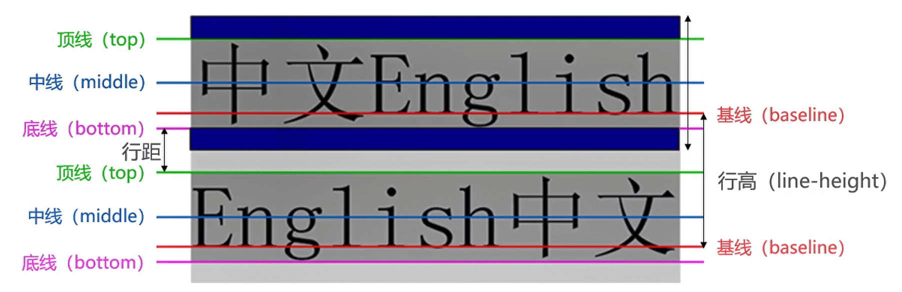
  - **应用实例**：假设div只有一行文字，如何让这行文字在div内部垂直居中 [ 让line-height等于height ]

- font缩写属性：多个属性的缩写


## CSS常见选择器

- 通用选择器：*

  - ```css
    /* 一般我们在写代码之前会重置一些默认属性 */
    *{
    	margin:0;
        padding:0;
    }
    
    /* 其实我们并不推荐上述的写法，一棒子打死，更推荐下面的写法： */
    /* ...的意思是还有其他的标签，并没有这样的写法 */
    body,p,div,span,...,{
        margin:0;
        padding:0;
    }
    ```

  - 

- 简单选择器

  - 元素选择器：使用 元素的名称
  - 类选择器：使用 .类名
  - id选择器：使用 #id。在一个HTML文档里面的**id值是唯一的，不能重复**

- 属性选择器

  - 拥有某个属性 [att]

  - 属性等于某个值 [att = val]

  - ```HTML
    [title]{
        color:red;
    }
    [title = one]{
        background:blue;
    }
    
    <div title="div">1</div>
    <div title="one">2</div>
    ```

  - ...

- 后代选择器 （重要）

  - 第一种：所有的后代（直接/间接）
    - 选择器之间以空格分隔 
    - `.box span{}`
  - 第二种：直接子代选择器（必须是直接子代）
    - 选择器之间以>分隔 
    - `.box>span{}`

- 兄弟选择器（用的少）

  - 第一种：相邻兄弟选择器
    - 使用符号 + 连接
  - 使用 格空
    - 使用符号 **~** 连接

- 交集选择器：需要同事符合两个选择器条件（两个选择器紧密连接）

  - 开发中通常为了精确的选择某一个元素

  - ```html
    div.one{
    	color:red;
    }
    
    <div class="one">我是div</div>
    <p class="one">我是p</p>
    ```

- 并集选择器：符合一个选择器条件即可（两个选择器以 , 号隔开）

  - 在开发中通常为了给多个选择设置相同的样式


## 认识伪类

### 什么是伪类

伪类是选择器的一种，他用于选择处于特定状态的元素。比如我们经常会实现的：当手指放在一个元素上时，显示另外一个颜色。


### 常见伪类

- 动态伪类【除了a元素，:hover、:active也能用在其他元素上】

  - a:link：未访问的链接
  - a:visited：已访问的链接
  - a:hover：鼠标挪到链接上
  - a:active：激活的链接（鼠标在链接上长按未松开）
  - 使用注意事项：
    - :hover必须放在:link和:visited后面才能完全生效
    - :active必须放在:hover后面才能完全生效
    - 所以建议的编写顺序是:link、:visited、:hover、:active
  - a:focus：指当前拥有输入焦点的元素（能接收键盘输入）

- 结构伪类

  - :root	：其实他就是代表 html 元素	【掌握】

  - :empty  ：代表里面是完全空白的元素    【掌握】

  - :nth-child()     【掌握】

    - 选择第一个  `:nth-child(1)`
    - 选择偶数：`:nth-child(2n)`	【n是从0、1、2、3...】
    - 选择前5个：`:nth-child(-n+5)`

  - :nth-last-child()：和:nth-child()相反 

    - 倒数最后一个：`:nth-last-child(1)`
    - 倒数后两个：`:nth-last-child(-n+2)`

  - :nth-of-type()    【掌握】

    - `元素:nth-of-type()`：只计算符合前面元素类型的元素

    - ```html
      div>span:nth-of-type(3){
      	color:red;/* 会选到3，而使用nth-child则选择不到 */
      }
      
      
      <div>
          <span>1</span>
          <span>2</span>
          <p>我是p元素</p>
          <span>3</span>
          <span>4</span>
      </div>
      ```

  - :first-child  ：第一个子元素

  - last-child  ：最后一个子元素

  - ...

- ...


## 伪元素

常见的伪元素【他有两种写法，一个冒号和两个冒号，都是可以的，但一般我们为了$\textcolor{ProcessBlue}{和伪类进行区分，$\textcolor{ProcessBlue}{伪元素都写两个冒号】

伪元素是一个行内级元素，设置宽高是不起作用的，得加入 `display:inline-block/block`

- ::first-line（了解）：可以针对**首行文本**设置属性
- ::first-letter（了解）：可以针对**首字母/首字**设置属性
- ::before（常用）： 用来在一个元素的内容之前插入其他内容（可以是文字、图片)，使用 content 来添加内容，且content不能省略，并且::before是行内不替换元素
- ::after（常用）：用来在一个元素的内容之后插入其他内容（可以是文字、图片)，使用 content 来添加内容，且content不能省略，并且::after是行内不替换元素


在这里补充一个属性：[attr](https://developer.mozilla.org/zh-CN/docs/Web/CSS/attr)

我们一般会使用 content 来添加内容，但是如果我们的内容是动态的不确定的呢，可以使用attr来获取div中的数据

```html
<p data-foo="hello">world</p>
```

```css
p:before {
   /* 先取attr(data-foo)，没有在取后面的 */
  content: attr(data-foo) " ";
}
```

:::info 补充

**备注：** `attr()` 理论上能用于所有的 CSS 属性但目前支持的仅有伪元素的 content属性，其他的属性和高级特性目前是实验性的

:::


## CSS属性的特性 — 继承性

- **CSS的某些属性具有继承性**(Inherited)
  - 如果一个属性具备继承性，那么在该元素上设置后，它的后代元素都可以继承这个属性
  - 当然，如果后代元素自己有设置该属性,那么优先使用后代元素自己的属性(不管继承过来的属性权重多高)
- 常见的具有继承性的属性：font-size/font-family/font-weight/line-height/color/text-align/...【不用刻意去记，多用就记住了】


## CSS属性的特性 — 层叠性

- 对于一个元素来说，相同一个属性我们可以通过不同的选择器给它进行多次设置；那么属性会被一层层覆盖上去；但是最终只有一个会生效
- 那么多个样式属性覆盖上去,哪一个会生效呢?
  - 判断一：选择器的权重，权重大的生效，根据权重可以判断出优先级
  - 判断二：先后顺序，权重相同时，后面设置的生效


## CSS属性的特性 — 权重

权重从大到小：!import > 内联式 > id > class[类选择器] 、属性选择器 、伪类 > 元素选择器 、伪元素 > 通配符


## 块级元素与行内元素

- 块级元素(block-level elements)：独占父元素的一行
- 行内级元素(inline-level elements)：多个行内级元素可以在父元素的同一行中显示

**我们可以通过display来修改元素类型**

display属性：

- block：让元素显示为块级元素。块级元素可以设置宽度和高度
- inline：让元素显示为行内级元素。行内级元素不可以设置宽度和高度【像input、img是行内元素，也可以设置宽高，因为准确的说，他们是行内替换元素，他们的特点就是可以和其他行内元素在同一行，并且可以设置宽高】
- inline-block：让元素同时具备行内级、块级元素的特征【可以理解：对外是一个行内级元素，对内是块级元素】
- none：隐藏元素

|   display    |                        |                                  |                    |
| :----------: | :--------------------: | :------------------------------: | :----------------: |
|    block     |        独占一行        | 可以设置宽高，设置后依然独占一行 | 高度默认由内容决定 |
| inline-block | 和其他行内元素在同一行 |           可以设置宽高           | 宽高默认由内容决定 |
|    inline    | 和其他行内元素在同一行 |           可以设置宽高           | 宽高默认由内容决定 |


## 元素隐藏方法

- 方法一：`display:none;`
  - 元素不显示出来，并且也不占据位置，不占据任何空间(和不存在一样)
- 方法二：`visibility:hidden;`
  - 设置为hidden，虽然元素不可见，但是会占据元素应该占据的空间
  - 默认为visible，元素是可见的
- 方法三：rgba设置颜色，将a的值设置为0
  - rgba的a设置的是alpha值，可以设置透明度，不影响子元素
- 方法四：opacity设置透明度，设置为0
  - 设置整个元素的透明度，会影响子元素


## CSS属性 — overflow

overflow用于控制内容溢出时的行为

- visible：溢出的内容照样可见
- hidden：溢出的内容直接裁剪
- scroll：溢出的内容被裁剪，但可以通过滚动机制查看
  - 会一直显示滚动条区域，滚动条区域占用的空间属于width、height
- auto：自动根据内容是否溢出来决定是否提供滚动机制


## CSS属性 — transform

CSS transform属性运行对某一个元素进行某些形变，包括旋转、缩放、倾斜或平移等。

**并非所有的盒子都可以进行transform的转换(通常行内级元素不能进行形变)**

### transfrom-origin

- 改变transform的坐标原点

- 默认值：`transfrom-origin:center center;`【属性值：left/top/bottom/right/px/%】


### 属性

- 平移：translate(x, y)
  - 单位：px【transform:translate(100px,100px)】、%【transform:translate(100%,100%)】
  - **traslate的百分比是相对于自身的**：如果设置的x位移，那么参考的是自身的宽度；如果设置的y位移，那么参考的是自身的高度【使用 % 可以设置垂直居中】
- 缩放：scale(x, y)：xy的取值就是对元素的变大或者变小， 0~1 对元素进行缩写 ， >1 对元素进行放大，eg：`transfrom:scale(0.5,0.5)`
- 旋转：rotate(deg)：正数顺时针，负数逆时针，eg：`transfrom:rotate(90deg)`
- 倾斜：skew(deg,deg)：定义了一个元素在二维平面上的倾斜转换
- **设置多个transform后面会将前面层叠到，要想设置多个值，得合并使用**
  - `transform:translate(x,y) scale(x, y) rotate(deg) skew(deg,deg)`     【顺序随意，之间没有逗号】


## CSS属性 — vertical-align

为什么文本、图片、方块对齐方式千奇百怪呢？答案就是baseline对齐【line-boxes一定会想办法包裹住当前行中所有的内容】

但是baseline都是谁呢？

- 文本的baseline是字母x的下方
- lnline-block默认的baseline是margin-bottom的底部【设置margin-bottom就是盒子的底部】
- lnline-block有文本时，baseline是最后一行文本的x的下方

**属性值**

- baseline(默认值)：基线对齐（你得先明白什么是基线)
- top：把行内级盒子的顶部跟line boxes顶部对齐
- middle：行内级盒子的中心点与父盒基线加上x-height一半的线对齐
- bottom：把行内级盒子的底部跟line box底部对齐
- `<percentage>`：把行内级盒子提升或者下降一段距离（距离相对于line-height计算\元素高度)，0%意味着同baseline一样
- `<length>`：把行内级盒子提升或者下降一段距离，0cm意味着同baseline一样

**解决图片下边缘的间隙方法：**

- 方法一：设置成top/middle/bottom
- 方法二：将图片设置为block元素


## CSS属性 — white-space

【了解】white-space用于设置空白处理和换行规则

- normal:合并所有连续的空白，允许单词超屏时自动换行
- **nowrap**:合并所有连续的空白，不允许单词超屏时自动换行
- pre:阻止合并所有连续的空白，不允许单词超屏时自动换行
- pre-wrap:阻止合并所有连续的空白，允许单词超屏时自动换行
- pre-line:合并所有连续的空白（但保留换行)，允许单词超屏时自动换行


## CSS属性 — text-overflow

【了解】text-overflow通常用来设置文字溢出时的行为【text-overflow生效的前提是overflow不为visible】

- clip:溢出的内容直接裁剪掉（字符可能会显示不完整)
- **ellipsis**:溢出那行的结尾处用省略号表示


## CSS动画

### transition动画

- css transitions提供了一种在更改CSS属性时控制动画速度的方法。可以让CSS属性变化成为一个持续一段时间的过程，而不是立即生效的

- 通常将两个状态之间的过渡称为隐式过渡（implicit transitions)，因为开始与结束之间的状态由浏览器决定。

- transition是一个简写属性【是transition-property,transition-duration，transition-timing-function和transition-delay的简写属性】

- transition-property：指定应用过渡属性的名称

  - all：所有属性都执行动画
  - none：所有属性都不执行动画
  - CSS属性名称：要执行动画的CSS属性名称，比如width、left、transform等

- transition-duration：指定过渡动画所需的时间

- transition-timing-function：指定动画的变化曲线

- transition-delay：指定过渡动画执行之前的等待时间

- ```html
  <style>
      .box{
          width: 300px;
          height: 300px;
          background-color: aqua;
          transition: all 1s ease-in 1s;【过渡属性名称 过渡时间 变化曲线 等待时间】
      }
  
      .box:hover{
          transform: translate(0,200px);
      }
  </style> 
  
  <body>
      <div class="box"></div>
  </body>
  ```


使用transition来进行过渡动画，但是过渡动画有如下的缺点：

- transition只能定义开始状态和结束状态，不能定义中间状态，也就是说只有两个状态
- transition不能重复执行，除非一再触发动画
- transition需要在特定状态下会触发才能执行，比如某个属性被修改了


### animation动画

使用步骤：

- 步骤一：使用 keyframes 定义动画序列（每一帧动画如何执行）

  - 可以使用@keyframes来定义多个变化状态，并且使用animation-name来声明匹配：

    - 关键帧使用percentage来指定动画发生的时间点
    - 0%表示动画的第一时刻，100%表示动画的最终时刻
    - 因为这两个时间点十分重要，所以还有特殊的别名: from和to。也就是说可以使用from和to关键字，from相当于0%，to相当于100%

  - ```html
    <style>
        /* moveAnim就是animation-name */
    @keyframes moveAnim{
        0%{
        	transform: translate(0,0);
        }
        33%{
        	transform: translate(0,200px);
        }
        66%{
        	transform: translate(400px,200px);
        }
        100%{
        	transform: translate(400px,0);
        }
    }
    </style>
    ```

  - 

- 步骤二：配置动画执行的名称、持续时间、动画曲线、延迟、执行次数、方向等等

  - **animation**：简写属性

  - **animation-name**：指定执行哪一个关键帧动画

  - **animation-duration**：指定动画的持续时间

  - **animation-timing-function**：指定动画的变化曲线

  - animation-delay:指定延迟执行的时间

  - animation-iteration-count:指定动画执行的次数，执行infinite表示无限动画

  - animation-direction:指定方向，常用值normal和reverse

  - animation-fill-mode:执行动画最后保留哪一个值

    - none:回到没有执行动画的位置
    - forwards:动画最后一帧的位置
    - backwards:动画第一帧的位置

  - animation-play-state:指定动画运行或者暂停（在JavaScript中使用，用于暂停动画)

  - ```html
    <style>
        .box{
            width: 300px;
            height: 300px;
            background-color: aqua;
            animation-name: moveAnim;
            animation-duration: 2s;
        }
    
    
        @keyframes moveAnim{
            0%{
                transform: translate(0,0);
            }
            33%{
                transform: translate(0,200px);
            }
            66%{
                transform: translate(400px,200px);
            }
            100%{
                transform: translate(400px,0);
            }
        }
    
    </style> 
    
    <body>   
        <div class="box"></div>   
    </body>
    ```


## CSS盒子模型

### box-sizing

box-sizing用来设置盒子模型中宽高的行为

- border-box：padding、border都布置在width、height里边

- context-box：padding、border都布置在width、height外边


### 属性

HTML中的每一个元素都可以看做是一个盒子，具有四个属性

- 内容（content）
  - 元素的内容宽高width/heigth
  - min-width:最小宽度，无论内容多少，宽度都大于或等于min-width
  - max-width:最大宽度，无论内容多少，宽度都小于或等于max-width
  - 移动端适配时,可以设置最大宽度和最小宽度;
- 内边距（padding）
  - 用于设置盒子的内边距， 通常用于设置边框和内容之间的间距
- 边框（border）
  - 元素之间的边框
  - 边框相对于content/padding/margin来说特殊一些
  - 边框具备宽度width、样式style、颜色color
  - 圆角：border-radius
- 外边框（margin）
  - 用于设置盒子的外边距,通常用于元素和元素之间的间距

- 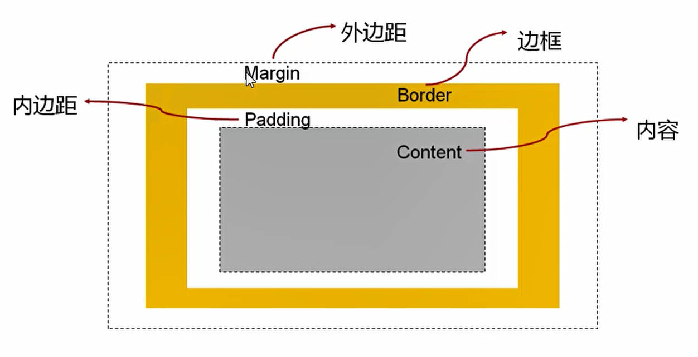

因为盒子有四边，所以margin/padding/border都包括top/right/bottom/left四个边


### margin上下传递问题

这样的问题出现在top和bottom中，left与right并不会出现

```html
.box{
    width: 300px;
    height: 300px;
    background-color: aqua;
}
.contain{
    width: 100px;
    height: 100px;
    background-color: blue;

	/*
    margin-left: 50px;
	margin-top: 50px;
	*/
}

<div class="box">
    <div class="contain"></div>
</div>
```

margin-left情况正常：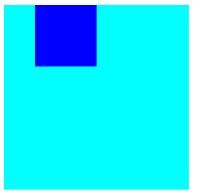

设置margin-top时：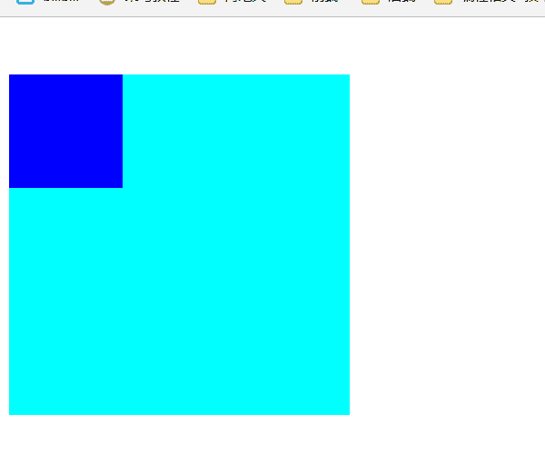

如果块级元素的顶部线和父元素的顶部线重叠，那么这个块级元素的margin-top值会传递给父元素

margin-bottom也会出现，不够触发条件比较难，少见，了解就好

**解决方案：**

- 方法一：改为padding进行设置
- 方法二：设置border，当你有边框的时候，他就不会改变 `border:1px solid transparent` 【但这样的方法不好，他会多一个外面的边框，尽管你这设置边框为透明的】
- 方法三：触发BFC，可以给 **父元素** 设置 `overflow:auto;`


### margin上下折叠问题(margin塌陷)

垂直方向上相邻的2个margin有可能会合并为1个margin，这种现象叫做折叠，水平方向上则不会发生【折叠规则：两值比较取较大的】

两个兄弟块级元素之间、父子块级元素之间 上下margin的折叠

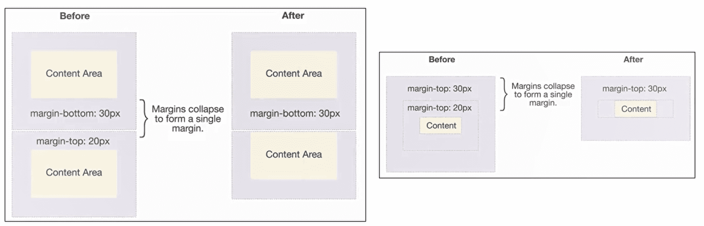

 

### 外轮廓 — outline

outline表示元素的外轮廓

- 不占用空间
- 默认显示在border的外面
- 常用在a标签、input输入框去除外轮廓：`outline:none;`


### 盒子阴影 — box-shadow

 `box-shadow: 10px 10px 5px red`

- offset-x：水平方向偏移量，正数往右偏移
- offset-y：垂直方向偏移量，正数往下偏移
- blur-radius：模糊半径
- spread-radius：延伸半径【就是在原先的基础上，在往外扩展，用的少  `box-shadow: 10px 10px 5px 10px red`  扩10px】
- color：阴影颜色，如果没有设置就跟随color属性的颜色
- 还有一个向内的阴影，外框阴影变成内框阴影：inset `box-shadow: 10px 10px 5px red inset`


## CSS设置背景

- background-image：设置元素的背景图片
  - 会盖在（不是覆盖）background-color的上面
  - 可以设置多张图片，设置的第一张图片将显示在最上面，其他图片按顺序层叠在下面
  - 当我们设置了背景图片之后，元素必须得设置具体的宽高，否则无法显示
- background-repeat：设置背景图片是否要平铺
  - repeat：平铺
  - no-repeat：不平铺
  - repeat-x：只在水平方向平铺
  - repeat-y：只在垂直平方向平铺
- background-size：设置背景图片的大小 
  - auto：默认值,以背景图本身大小显示
  - cover：缩放背景图，以完全覆盖铺满元素,可能背景图片部分看不见
  - contain：缩放背景图，宽度或者高度铺满元素，但是图片保持宽高比
  - `<percentage>`：百分比，相对于背景区(background positioning area)
  - length：具体的大小，比如100px
- background-position：用于设置背景图片在水平、垂直方向上的具体位置
  - 可以设置具体的数值比如20px 30px
  - 水平方向还可以设值：left、center、right
  - 垂直方向还可以设值：top、center、bottom
  - 如果只设置了1个方向，另一个方向默认是center
- background-attachment：决定背景图像的位置是在视口内固定，或者随着包含它的区块滚动。
  - scroll：此关键属性值表示背景相对于元素本身固定，而不是随着它的内容滚动
  - local：此关键属性值表示背景相对于元素的内容固定。如果一个元素拥有滚动机制，背景将会随着元素的内容滚动
  - fixed：此关键属性值表示背景相对于视口固定。即使一个元素拥有滚动机制，背景也不会随着元素的内容滚动


## CSS Sprite精灵图

好处：

- 减少网页hppt请求数量，加快网页相应速度，减轻服务器压力
- 减少图片总大小
- 解决了图片命名的困扰，只需要针对一张集合的图片命名 

使用：

```html
<style>
    i.hot-iocn{
        background-image: url(...);
        background-repeat: no-repeat;
        /* display: inline-block; */
        width: px;
        height: px;
        /* 调整到你需要的那个小图标的位置就行 */
        background-position: px px;
    }
</style>

<body>
    <i class="hot-icon"></i>
</body>
```


## 鼠标指针

**cursor**

- auto：浏览器根据上下文决定指针的显示样式，比如根据文本和非文本切换指针样式
- default：由操作系统决定，一般就是一个小箭头
- **pointer**：一只小手，鼠标指针挪动到链接上面默认就是这个样式
- text：一条竖线，鼠标指针挪动到文本输入框上面默认就是这个样式
- none：没有任何指针显示在元素上面


## CSS元素定位

**标准流布局**：就是正常标签所显示的样子，行内级元素可以同事显示在一行，块级元素独占一行

### position属性值

【**top/right/left/bottom设置百分比大小，相对的是其父元素的大小**】

- static：默认值，静态页面，依然按照标准流布局【left、right、top、bottom没有任何作用】

- relative： 相对定位

  - 元素依然按照标准流在布局，**占位置**
  - 可以通过left、right、top、bottom进行定位【当我们设置了left、right、top、bottom的时候，它就脱离了标准流了】
  - 它并不影响其他元素的位置
  - 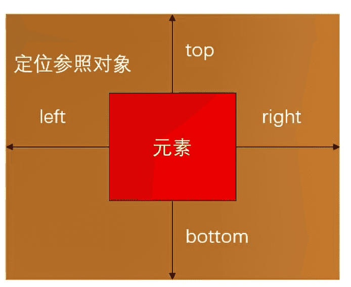

- absolute：绝对定位

  - 脱离标准流，**不占位置**
  - 可以通过left、right、top、bottom进行定位
  - 定位参照对象是最邻近的定位祖先元素，如果找不到这样的祖先元素，参照对象就是浏览器可视化窗口【简单的说，你相对于谁定位，就给谁设置定位元素】
  - **定位元素**：relative、absolute、fixed
  - 如果希望子元素相对于父元素进行定位（大多数情况），又不希望父元素脱标，常用解决方案是：【**找好你的参照系就好**】
    - 父元素设置position: relative(让父元素成为定位元素，而且父元素不脱离标准流)
    - 子元素设置position: absolute
    - 简称为“**子绝父相**”

- fixed：固定定位

  - 脱离标准流，**不占位置**
  - 可以通过left、right、top、bottom进行定位
  - 定位参照对象是浏览器可视窗口
  - 当窗口滚动，依然保持位置不变

- sticky：粘性定位

  - 可以看做是相对定位和固定(绝对)定位的结合体。它允许被定位的元素表现得像相对定位一样，直到它滚动到某个阈值点，当达到这个阈值点时,就会变成固定(绝对)定位。

  - ```html
    /* .box在距离顶部为0的时候就固定在顶部 */
    .box{
        height: 100px;
    	width: 100%;
        background-color: aqua;
        position:sticky;
        top: 0; 
    }
    ```


### 将position设置为绝对定位元素（absolute/fixed）的特点

- 可以随意设置宽高，不管他是块级元素还是行内级元素【宽高默认由内容决定】
- 不受标准流的束缚
- 不再给父元素汇报宽高了【假如我们没有给父元素设置宽高，父元素的宽高就不由子元素撑起来了】
- 内部还是按照标准流
- 定位参照对象的宽度= left + right + margin-left + margin-right + 绝对定位元素的实际占用宽度
- 定位参照对象的高度= top + bottom + margin-top + margin-bottom + 绝对定位元素的实际占用高度
- 如果希望绝对定位元素的宽高和定位参照对象一样大小，可以给绝对定位元素设置以下属性【前提没有设置宽高】
  - `left: 0;right: 0;top: 0;bottom: 0;`
  - 也可以设置为`width:100%;height:100%`

- 如果希望绝对定位元素在定位参照对象中居中显示，可以给绝对定位元素设置以下属性
  - `left: 0;right: 0;top: 0;bottom: 0;margin:auto;`
  - 另外，还得设置具体的宽高值(宽高小于定位参照对象的宽高)


|                     | 脱离标准流 | 定位元素 | 绝对定位元素 |                         定位参照对象                         |
| :-----------------: | :--------: | :------: | :----------: | :----------------------------------------------------------: |
|  static — 静态定位  |     ×      |    ×     |      ×       |                              ×                               |
| relative — 相对定位 |     ×      |    √     |      ×       |                      元素自己原来的位置                      |
| absolute — 绝对定位 |     √      |    √     |      √       | 最邻近的定位祖先元素<br/>(如果找不到这样的祖先元素，参照对象是浏览器可视化窗口) |
|  fixed — 固定定位   |     √      |    √     |      √       |                       浏览器可视化窗口                       |


### z-index

z-index属性用来设置定位元素的层叠顺序(仅对定位元素有效)


## CSS元素浮动

### float属性

float属性可以指定一个元素应沿其容器的左侧或右侧放置，允许文本和内联元素环绕它【绝对定位、浮动都会让元素脱离标准流，以达到灵活布局的效果】

- none：不浮动，默认值
- left：向左浮动
- right：向右浮动


### 规则

- 规则一 
  - **元素一旦浮动后，脱离标准流**。朝着向左或向右方向移动，直到自己的边界紧贴着包含块（一般是父元素）或者其他浮动元素的边界为止
  - 定位元素会层叠在浮动元素上面【前提没有设置z-index】
  - 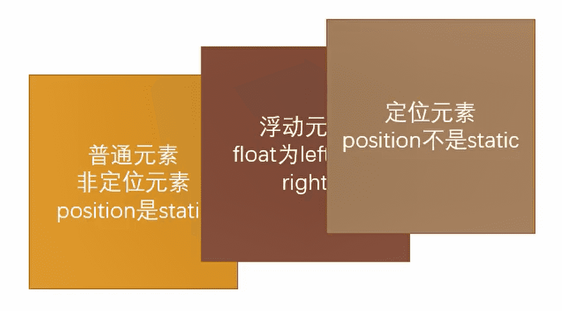
- 规则二：如果元素是向左（右）浮动，浮动元素的左（右）边界不能超出包含块的左（右）边界
- 规则三：**浮动元素之间是不能层叠的**
  - 如果一个元素浮动，另一个浮动元素已经在那个位置了，后浮动的元素将紧贴着前一个浮动元素（左浮找左浮，右浮找右浮)
  - 如果水平方向剩余的空间不够显示浮动元素，浮动元素将向下移动，直到有充足的空间为止
- 规则四：**浮动元素不能与行内级内容层叠，行内级内容将会被浮动元素推出**【比如行内级元素、inline-block元素、块级元素的文字内容】
  - 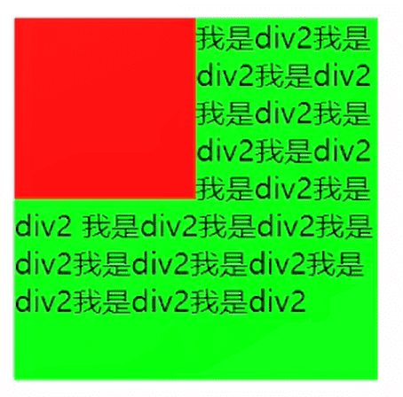


### 浮动的问题

**高度塌陷：**由于浮动元素脱离了标准流，变成了脱标元素，所以不再向父元素汇报高度。父元素计算总高度时，就不会计算浮动子元素的高度，导致了高度坍塌的问题


**解决办法：**清除浮动，解决高度塌陷

- 方法一：给父元素设置固定高度（不推荐）

- 方法二：使用CSS属性 clear 【clear 属性可以指定一个元素是否必须移动(清除浮动后)到在它之前的浮动元素下面】

  - 属性：

    - left：要求元素的顶部低于之前生成的所有左浮动元素的底部
    - right：要求元素的顶部低于之前生成的所有右浮动元素的底部
    - **both**：要求元素的顶部低于之前生成的所有浮动元素的底部
    - none：默认值，无特殊要求

  - 在父元素最后增加一个空的块级子元素，并且让它设置clear: both。【但是这样会增加很多无意义的空标签，维护麻烦，并且违反了结构与样式分离的原则(不推荐)】

  - 一般我们会使用伪元素 ::after，将这个class放到父元素中

    - ```css
      .clear-fix::after{
      	content:"",
          clear:both;
          /* 设置display:block是因为伪元素是一个行内级元素，没有宽高 */
          display:block;
          
          /* 为了适配低版本浏览器的兼容问题，一般我们会加入下面两行代码 */
          visibility:hidden;
          height:0;
      }
      ```

- 方法三：触发BFC

  - ```html
    <style>
        .box{
            background-color: aqua;
            /* 触发BFC */
            overflow: auto;
        }
    
        .item{
            border: 1px solid black;
            width: 400px;
            height: 200px;
            background-color: red;
            box-sizing: border-box;
            float: left;
        }
    </style> 
    
    <body>
        
        <div class="box">
            <div class="item"></div>
            <div class="item"></div>
            <div class="item"></div>
            <div class="item"></div>
        </div>
        
    </body>
    ```

  - 


## flex布局

### flex布局的重要概念

开启了flex布局的元素叫flex container。flex container里面的**直接子元素**叫做flex item

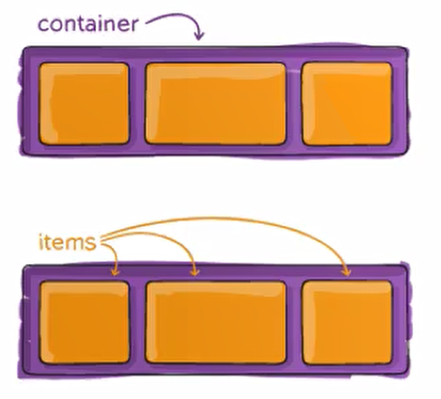

当flex container中的子元素变成了flex item时，具备以下特点：

- flex item的布局将受flex container属性的设置来进行控制和布局
- flex item不再严格区分块级元素和行内级元素【注意是flex item不再严格区分，flex container还是区分的】
- flex item默认情况下是包裹内容的，但是可以设置宽度和高度


### 属性值

- flex
  - 将盒子变成弹性盒子，不过是块级弹性盒子
  - 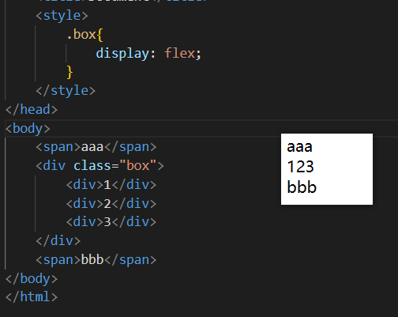
- inline-flex【了解，用的少】
  - 将盒子变成弹性盒子，不过是行内级弹性盒子
  - 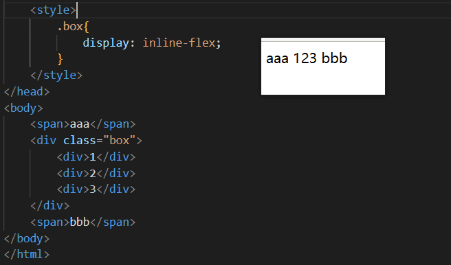


### flex布局的模型

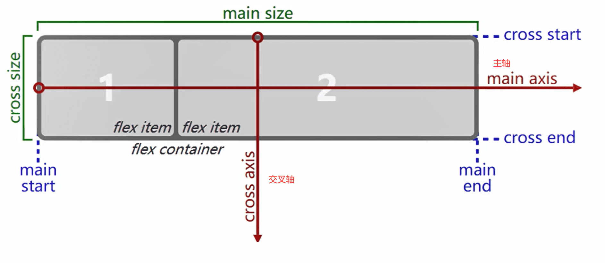

### flex相关属性

**应用在flex container上的 CSS属性**

- flex-direction：决定了 main axis【主轴】的方向【默认都是沿着main axis 从main start开始往main end方向排布】
  - row：默认值，从左到右
  - row-reverse：row的反转
  - column：交叉轴变成主轴
  - column-reverse：column的反转
  - 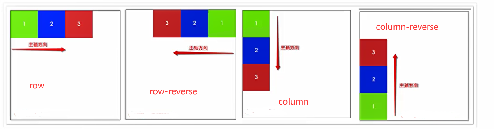
- flex-wrap：决定了flex container是单行还是多行【就是我们设置了宽度，当他一行放不下的时候，他会对宽度进行压缩，这就是弹性的意思】
  - nowrap：默认，单行
  - wrap：多行
  - wrap-reverse：wrap的反转【并没有改变主轴】【了解就好，用的少】
  - 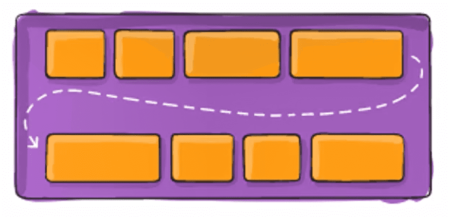
- flex-flow：flex-flow属性是flex-direction和 flex-wrap 的简写。顺序任何，并且都可以省略
- justify-content：决定了flex items 在主轴上的对齐方式
  - flex-start：默认值，main start对齐
  - flex-end: 与main end对齐
  - center：居中对齐
  - space-between：flex items之间的距离相等，与main start、main end两端对齐
  - space-around：flex items 之间的距离相等，flex items 与main start、main end之间的距离是flex items之间距离的一半
  - space-evenly：flex items 之间的距离相等，flex items 与 main start、main end 之间的距离等于flex items之间的距离 
  - 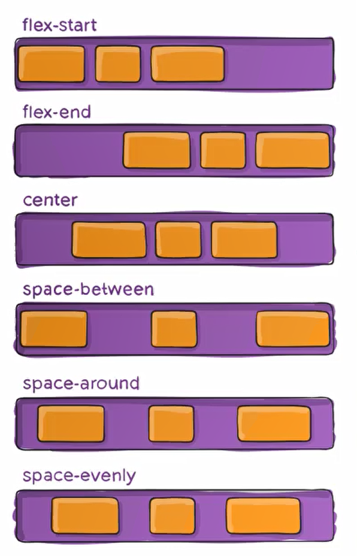
- align-items：决定了flex items 在交叉轴上的对齐方式
  - flex-start：cross start 对齐
  - flex-end：与cross end 对齐
  - **center**：居中对齐
  - baseline：与基准线对齐
  - normal：默认值，在弹性布局中，效果和stretch—样
  - stretch：当flex items在交叉轴方向的 height 为 auto 时【也就是不设置高度】，会自动拉伸至填充flex container
  - 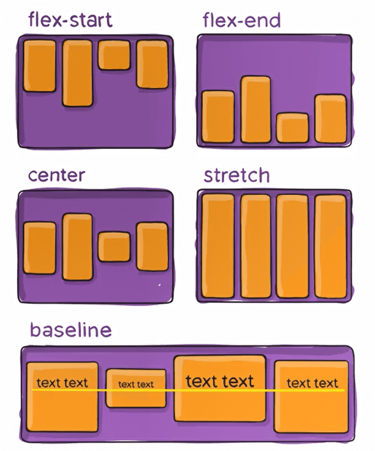
- align-content：决定了多行flex items在交叉轴上的对齐方式，用法与 justify-content类似，等分或者居上居下的
  - stretch：默认值，与align-items的 stretch类似
  - flex-start: 与cross start对齐
  - flex-end: 与cross end对齐
  - center:居中对齐
  - space-between：flex items之间的距离相等，与cross start、cross end两端对齐
  - space-around：flex items之间的距离相等，flex items 与cross start、cross end 之间的距离是flex items之间距离的一半
  - space-evenly：flex items之间的距离相等，flex items 与cross start、cross end之间的距离等于flex items之间的距离
  - 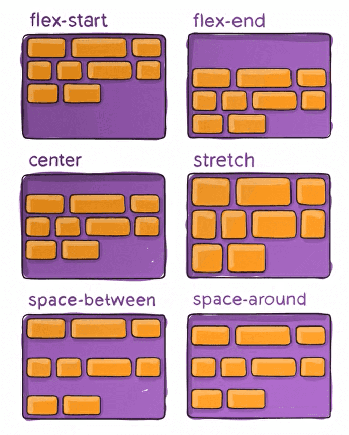


**应用在flex items上的CSS属性**

- order：设置任意整数，值越小越排在前面
- align-self：可以通过align-self 覆盖flex container设置的align-items【允许item有自己的对齐方式】
  - auto(默认值)∶遵从flex container的align-items设置
  - stretch、flex-start、flex-end、center、baseline，效果跟align-items一致
- flex-grow：决定了flex items如何扩展(拉伸/成长)【当我们设置的item是宽度总和比container小的时候他会去拉伸，他的默认值为0】
  - 按容器的剩余比例放大元素填充容器
  - 当flex container 在 main axis方向上有剩余size时，flex-grow属性才会有效
  - flex items扩展后的最终size不能超过max-width\max-height

- flex-shrink：决定了flex items如何收缩(缩小)【当我们设置的item是宽度总和比container大的时候他会去压缩，因为他的默认值为1】
  - 按被挤压空间的比例缩小元素
  - flex items在 main axis方向上超过了flex container的size，flex-shrink属性才会有效
  - flex items收缩后的最终size不能小于min-width\min-height

- flex-basis
  - 默认值auto

- flex：是flex-grow 、 flex-shrink 、 flex-basis的简写，flex属性可以指定1个，2个或3个值。
- 【flex:1  ——>  flex-grow:1】


## grid布局

### grid布局重要概念

`display: grid`

当然还有`display:inline-grid`，这个了解就行

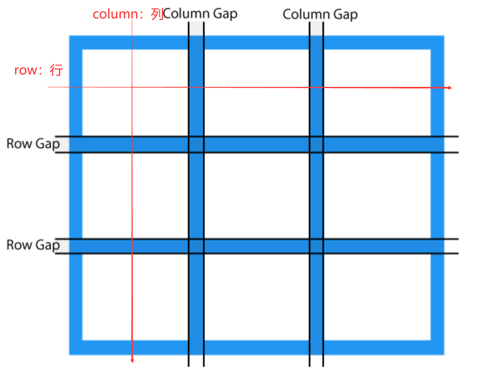


### 容器属性

**`grid-template-columns/grid-template-rows`**

容器指定了网格布局以后，接着就要划分行和列。`grid-template-columns`属性定义每一列的列宽，`grid-template-rows`属性定义每一行的行高。

```css
// 指定了一个三行三列的网格，列宽和行高都是100px
.container {
  display: grid;
  grid-template-columns: 100px 100px 100px;
  grid-template-rows: 100px 100px 100px;
}


// 除了使用绝对单位，也可以使用百分比
.container {
  display: grid;
  grid-template-columns: 33.33% 33.33% 33.33%;
  grid-template-rows: 33.33% 33.33% 33.33%;
}


// repeat: 简化重复的值
.container {
  display: grid;
  grid-template-columns: repeat(3, 33.33%);
  grid-template-rows: repeat(3, 33.33%);
}
// 重复某种模式也是可以的 grid-template-columns: repeat(2, 100px 20px 80px);


// auto-fill: 有时，单元格的大小是固定的，但是容器的大小不确定。如果希望每一行（或每一列）容纳尽可能多的单元格，这时可以使用auto-fill关键字表示自动填充。
.container {
  display: grid;
  grid-template-columns: repeat(auto-fill, 100px) //表示每列宽度100px，然后自动填充，直到容器不能放置更多的列
}


// auto-fit: 除了auto-fill，还有一个关键字auto-fit，两者的行为基本是相同的。只有当容器足够宽，可以在一行容纳所有单元格，并且单元格宽度不固定的时候，才会有行为差异：auto-fill会用空格子填满剩余宽度，auto-fit则会尽量扩大单元格的宽度


// fr: 为了方便表示比例关系，网格布局提供了fr关键字（fraction 的缩写，意为"片段"）。如果两列的宽度分别为1fr和2fr，就表示后者是前者的两倍。
.container {
  display: grid;
  grid-template-columns: 1fr 1fr; // 表示两个相同宽度的列
}
// fr可以与绝对长度的单位结合使用，这时会非常方便。
.container {
  display: grid;
  grid-template-columns: 150px 1fr 2fr; //表示，第一列的宽度为150像素，第二列的宽度是第三列的一半。
}


// minmax(): minmax()函数产生一个长度范围，表示长度就在这个范围之中。它接受两个参数，分别为最小值和最大值
grid-template-columns: 1fr 1fr minmax(100px, 1fr) // minmax(100px, 1fr)表示列宽不小于100px，不大于1fr


// auto 关键字:auto关键字表示由浏览器自己决定长度。
grid-template-columns: 100px auto 100px;


// 网格线的名称:grid-template-columns属性和grid-template-rows属性里面，还可以使用方括号，指定每一根网格线的名字，方便以后的引用。
.container {
  display: grid;
  // 指定网格布局为3行 x 3列，因此有4根垂直网格线和4根水平网格线。方括号里面依次是这八根线的名字。
  grid-template-columns: [c1] 100px [c2] 100px [c3] auto [c4];
  grid-template-rows: [r1] 100px [r2] 100px [r3] auto [r4];
  // 网格布局允许同一根线有多个名字，比如[fifth-line row-5]
}
```


**`grid-row-gap/grid-column-gap/grid-gap`**

`grid-row-gap`属性设置行与行的间隔（行间距），`grid-column-gap`属性设置列与列的间隔（列间距），`grid-gap`是简写，语法：`rid-gap: <grid-row-gap> <grid-column-gap>`，如果`grid-gap`省略了第二个值，浏览器认为第二个值等于第一个值


**`justify-items/align-items/place-items`**

`justify-items`属性设置**单元格内容**的水平位置（左中右），`align-items`属性设置单元格内容的垂直位置（上中下）

```css
.container {
  justify-items: start | end | center | stretch;
  align-items: start | end | center | stretch;
}
```

这两个属性的写法完全相同，都可以取下面这些值。

- start：对齐单元格的起始边缘。
- end：对齐单元格的结束边缘。
- center：单元格内部居中。
- stretch：拉伸，占满单元格的整个宽度（默认值）

`place-items`属性是`align-items`属性和`justify-items`属性的合并简写形式：`place-items: <align-items> <justify-items>`,如果省略第二个值，则浏览器认为与第一个值相等。


**`justify-content/align-content/place-content`**

`justify-content`属性是整个内容区域在容器里面的水平位置（左中右），`align-content`属性是整个内容区域的垂直位置（上中下）

```css
.container {
  justify-content: start | end | center | stretch | space-around | space-between | space-evenly;
  align-content: start | end | center | stretch | space-around | space-between | space-evenly;  
}
```

- start - 对齐容器的起始边框
- end - 对齐容器的结束边框
- center - 容器内部居中
- stretch - 项目大小没有指定时，拉伸占据整个网格容器
- space-around - 每个项目两侧的间隔相等。所以，项目之间的间隔比项目与容器边框的间隔大一倍
- space-between - 项目与项目的间隔相等，项目与容器边框之间没有间隔
- space-evenly - 项目与项目的间隔相等，项目与容器边框之间也是同样长度的间隔

`place-content`属性是`align-content`属性和`justify-content`属性的合并简写形式,`place-content: <align-content> <justify-content>`,如果省略第二个值，浏览器就会假定第二个值等于第一个值。


:::info 补充

`justify-items`与`justify-content`的区别

items设置的是容器内部内容的位置，content设置的是整个容器的位置

:::


**`grid-auto-columns/grid-auto-rows`**

有时候，一些项目的指定位置，在现有网格的外部。比如网格只有3列，但是某一个项目指定在第5行。这时，浏览器会自动生成多余的网格，以便放置项目。

`grid-auto-columns`属性和`grid-auto-rows`属性用来设置，浏览器自动创建的多余网格的列宽和行高。它们的写法与`grid-template-columns`和`grid-template-rows`完全相同。如果不指定这两个属性，浏览器完全根据单元格内容的大小，决定新增网格的列宽和行高。

```
// 划分好的网格是3行 x 3列，但是，8号项目指定在第4行，9号项目指定在第5行。
.container {
  display: grid;
  grid-template-columns: 100px 100px 100px;
  grid-template-rows: 100px 100px 100px;
  grid-auto-rows: 50px; 
}
```


**`grid-template/grid`**

`grid-template`属性是`grid-template-columns`、`grid-template-rows`和`grid-template-areas`这三个属性的合并简写形式。

`grid`属性是`grid-template-rows`、`grid-template-columns`、`grid-template-areas`、 `grid-auto-rows`、`grid-auto-columns`、`grid-auto-flow`这六个属性的合并简写形式。

从易读易写的角度考虑，还是建议不要合并属性


**`grid-template-areas`**

网格布局允许指定"区域"（area），一个区域由单个或多个单元格组成。`grid-template-areas`属性用于定义区域

```css
.container {
  display: grid;
  grid-template-columns: 100px 100px 100px;
  grid-template-rows: 100px 100px 100px;
  // 先划分出9个单元格，然后将其定名为a到i的九个区域，分别对应这九个单元格。
  grid-template-areas: 'a b c'
                       'd e f'
                       'g h i';
}


// 多个单元格合并成一个区域的写法如下。
grid-template-areas: 'a a a'
                     'b b b'
                     'c c c';


// 如果某些区域不需要利用，则使用"点"（.）表示
grid-template-areas: 'a . c'
                     'd . f'
                     'g . i';
```

注意，区域的命名会影响到网格线。每个区域的起始网格线，会自动命名为`区域名-start`，终止网格线自动命名为`区域名-end`。

比如，区域名为`header`，则起始位置的水平网格线和垂直网格线叫做`header-start`，终止位置的水平网格线和垂直网格线叫做`header-end`。


**`grid-auto-flow`**

划分网格以后，容器的子元素会按照顺序，自动放置在每一个网格。默认的放置顺序是"先行后列"，即先填满第一行，再开始放入第二行

这个顺序由`grid-auto-flow`属性决定，默认值是`row`，即"先行后列"。也可以将它设成`column`，变成"先列后行"。

```
grid-auto-flow: column
```


### 项目属性

**`grid-column-start/grid-column-end/grid-row-start/grid-row-end`**

项目的位置是可以指定的，具体方法就是指定项目的四个边框，分别定位在哪根网格线。


**`grid-column/grid-row`**

`grid-column`属性是`grid-column-start`和`grid-column-end`的合并简写形式，`grid-row`属性是`grid-row-start`属性和`grid-row-end`的合并简写形式


**`grid-area`**

`grid-area`属性指定项目放在哪一个区域。


**`justify-self/align-self/place-self`**

`justify-self`属性设置单元格内容的水平位置（左中右），跟`justify-items`属性的用法完全一致，但只作用于单个项目。

`align-self`属性设置单元格内容的垂直位置（上中下），跟`align-items`属性的用法完全一致，也是只作用于单个项目。


### 合并单元格

```html
<div class="container">

    <div class="item">1</div>
    <div class="item one">2</div>
    <!-- <div class="item">3</div> -->
    <div class="item two">4</div>
    <div class="item">5</div>
    <div class="item">6</div>
    <!-- <div class="item">7</div> -->
    <div class="item three">8</div>
    <!-- <div class="item">9</div> -->
    <div class="item">10</div>
    <!-- <div class="item">11</div>
	<div class="item">12</div> -->

</div>
```

```css
.one{
    /* 合并2，3区域
    先将3区域给注释掉
    然后给2区域设置为两列区域
    */
    grid-column: span 2;
}

.two{
    /* 合并4,7区域
    先将7区域给注释掉
    然后给4区域设置为两行区域
    */
    grid-row: span 2;
}

.three{
    /* 合并8,9,11,12区域
    先将9,11,12区域给注释掉
    然后给4区域设置为两行两列区域
    */
    /* grid-area: 行 / 列; */
    grid-area: span 2 / span 2;
}
```

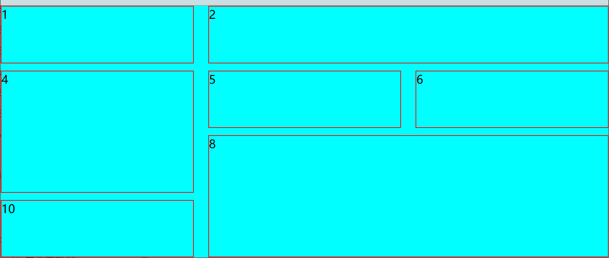


## 居中问题

### 水平居中

#### 块级元素水平居中

  给当前块级元素设置`margin:0 auto;`	【**margin:0 auto只能作用于块级元素，行内元素和行内块级元素是不起作用高度**】

```html
body{
	margin: 0;
}
.box{
    width: 300px;
    height: 300px;
    background-color: aqua;
}
.contain{
    width: 100px;
    height: 100px;
    background-color: blue;
    margin: 0 auto;
}


<div class="box">
    <div class="contain"></div>
</div>
```


#### 行内级元素水平居中

 给父元素中设置 `text-align:center`


#### 设置absolute

- 第一点：设置子绝父相
- 第二点：left、righ为0，margin-left和margin-right为auto
- 补充：当然我们设置 top、bottom为0，margin-top和margin-bottom为auto可以实现垂直居中

```html
<style>
    .box{
        width: 300px;
        height: 100px;
        background-color: aqua;
        position: relative;
    }

    .contain{
        width: 100px;
        height: 100px;
        background-color:brown;
        position: absolute;
        left: 0;
        right: 0;
        margin: 0 auto;
    }
</style> 

<body>
    <div class="box">
        <div class="contain"></div>
    </div>
</body>
```


#### flex布局

`justify-content:center;`


#### left/transfrom

先让元素向作位移父元素的50%，在让元素向右位移自身的50%

```html
<style>
    .box{
        width: 300px;
        height: 300px;
        background-color: aqua;
    }

    .contain{
        width: 100px;
        height: 100px;
        background-color:brown;
        position: relative;
        left: 50%;
        transform: translate(-50%,0);
    }
</style> 
    
<body>
    <div class="box">
        <div class="contain"></div>
    </div>
</body>
```


### 垂直居中

#### 设置sbsolute

- 第一点：设置子绝父相
- 第二点：top、bottom为0，margin-top和margin-bottom为auto
- 补充：当然我们设置 left、right为0，margin-left和margin-right为auto，可以实现水平居中【**其中子元素必须要有高度**】

【

​	**弊端**：

- 使用了绝对定位，脱离了标准流，当我们下面还有元素的时候，会上去

- 必须要给元素设置高度

  】

```html
<style>
    .box{
        width: 100px;
        height: 300px;
        background-color: aqua;
        position: relative;
    }

    .contain{
        width: 100px;
        height: 100px;
        background-color:brown;
        position: absolute;
        top: 0;
        bottom: 0;
        margin: auto 0;
    }
</style> 

<body>
    <div class="box">
        <div class="contain"></div>
    </div>
</body>
```


#### flex布局

`align-items:center;`

【

​	**弊端**：

- flex布局中所有中的元素都居中了

  】


#### top/transfrom

先让元素向下位移父元素的50%，在让元素向上位移自身的50%

```html
<style>
    .box{
        width: 300px;
        height: 300px;
        background-color: aqua;
    }

    .contain{
        width: 100px;
        height: 100px;
        background-color:brown;
        position: relative;
        top: 50%;
        transform: translate(0,-50%);
    }
</style> 
    
<body>
    <div class="box">
        <div class="contain"></div>
    </div>
</body>
```


### 水平垂直居中

#### 设置sbsolute

```html
<style>
    .box{
        width: 300px;
        height: 300px;
        background-color: aqua;
        position: relative;
    }

    .contain{
        width: 100px;
        height: 100px;
        background-color:brown;
        /* 核心设置 */
        position: absolute;
        top: 0;
        bottom: 0;
        left: 0;
        right: 0;
        margin: auto;
    }
</style> 
    
<body>
    <div class="box">
        <div class="contain"></div>
    </div>
</body>
```


#### left/top/transfrom

先让元素向作位移父元素的50%，在让元素向右位移自身的50%

先让元素向下位移父元素的50%，在让元素向上位移自身的50%

```html
<style>
    .box{
        width: 300px;
        height: 300px;
        background-color: aqua;
    }

    .contain{
        width: 100px;
        height: 100px;
        background-color:brown;
        position: relative;
        left: 50%;
        top:50%
        transform: translate(-50%,-50%);
    }
</style> 
    
<body>
    <div class="box">
        <div class="contain"></div>
    </div>
</body>
```

 


## 行内非替换元素的特殊性

行内非替换元素：a、span ...

- width/height：压根不生效
- padding、border：设置了也生效了，他们只是上下会被撑起来，但并不占据空间 【左右也会被撑开，但占据空间】
- margin：上下压根不生效，左右生效


## CSS函数

在前面我们有使用过很多个CSS函数：

- 比如rgb/rgba/translate/rotate/scale等
- CSS函数通常可以帮助我们更加灵活的来编写样式的值


下面我们再学习几个非常好用的CSS函数：

- var：使用CSS自定义的变量

  - **CSS自定义属性**：属性名需要以两个减号（--)开始，属性值则可以是任何有效的CSS值

  - 规则集定义的选择器，是自定义属性的可见作用域(只在选择器内部有交。所以推荐将自定义属性定义在html中，也可以使用:root选择器;

  - ```html
    <style>
        html{
            --main-color:#D3192C;
        }
    
        .box{
            width: 200px;
            height: 200px;
            color: var(--main-color);
        }
    </style>
    
    <body>    
        <div class="box">
            box
        </div>
    </body>
    ```

  - 

- calc：算CSS值,通常用于计算元素的大小或位置

  - 计算支持加减乘除的运算
  - ＋和–运算符的两边必须要有空白字符
  - 通常用来设置一些元素的尺寸或者位置

- blur：毛玻璃(高斯模糊)效果

  - blur()函数将高斯模糊应用于输出图片或者元素
  - blur(radius)【radius,模糊的半径,用于定义高斯函数的偏差值,偏差值越大,图片越模糊】
  - `filter:blur(10px)`

- gradient：颜色渐变函数

  - `<gradient>`是一种`<image>`CSS数据类型的子类型，用于表现两种或多种颜色的过渡转变。

  - `<gradient>`常见函数：

    - **linear-gradient**()：创建一个表示两种或多种颜色线性渐变的图片

      - ```html
        <style>
            .box{
                width: 200px;
                height: 200px;
                /* background-image: linear-gradient(yellow, blue); */
        
                /* 改变方向 */
                /* background-image: linear-gradient(to right,yellow, blue); */
                /* background-image: linear-gradient(to right top,yellow, blue); */
                background-image: linear-gradient(45deg,yellow, blue);
            }
        </style> 
        
        <body>
            
            <div class="box"></div>
          
        </body>
        ```

      - 

    - ...


## FC

块级元素属于BFC，行内级元素属于IFC

MDN上有整理出在哪些具体的情况下会创建BFC：

- 根元素(`<html>`)
- 浮动元素(元素的float不是none)
- 绝对定位元素（元素的position为 absolute或 fixed)和行内块元素(元素的display 为 inline-block)
- 表格单元格(元素的display 为table-cell，HTML表格单元格默认为该值)，表格标题(元素的display 为 table-caption，HTML表格标题默认为该值)
- 匿名表格单元格元素(元素的display 为 table、table-row、table-row-group、table-header-group、table-footer-group(分别是HTML table、row、tbody、thead、tfoot的默认属性)或inline-table)
- overflow计算值(Computed)不为 visible的块元素
- 弹性元素(display为flex或 inline-flex元素的直接子元素)
- 网格元素(display为grid 或 inline-grid元素的直接子元素)
- display值为flow-root的元素


**BFC可以解决的问题**

- 解决margin高度塌陷的问题

- 清除浮动

  - ```html
    <style>
        .box{
            background-color: aqua;
            /* 触发BFC */
            overflow: auto;
        }
    
        .item{
            border: 1px solid black;
            width: 400px;
            height: 200px;
            background-color: red;
            box-sizing: border-box;
            float: left;
        }
    </style> 
    
    <body>
        
        <div class="box">
            <div class="item"></div>
            <div class="item"></div>
            <div class="item"></div>
            <div class="item"></div>
        </div>
        
    </body>
    ```


## CSS中的单位

- 绝对长度单位：它们与其他任何东西都没有关系，通常被认为总是相同的大小。唯一一个经常使用的：px

- 相对长度单位：相对长度单位相对于其他一些东西，比如父元素的字体大小，或者视图端口的大小。

  - 使用相对单位的好处是，经过一些仔细的规划，您可以使文本或其他元素的大小与页面上的其他内容相对应

  - 常用的需要掌握的：

    - em：相对的是自己的font-size

      - ```html
        <style>
            .box{
                font-size: 20px;
            }
        
            .container{
                /* 没有设置会子元素会继承父元素的font-size */
                font-size: 15px;
                /* width、height:150px */
                height: 10em;
                width: 10em;
                background-color: aqua;
            }
        </style> 
        
        <body>
            
            <div class="box">
                <div class="container"></div>
            </div>
            
        </body>
        ```

    - rem：相对的是html的font-size【只要给html设置一个font-size，就一直不会变】

    - vw/vh


## less

Less (Leaner Style Sheets的缩写)是一门CSS扩展语言，并且兼容CSS

- Less增加了很多相比于CSS更好用的特性
- 比如定义变量、混入、嵌套、计算等等
- Less最终需要被编译成CSS运行于浏览器中（包括部署到服务器中）


### less代码的编译

- 方式一：下载Node环境，通过npm包管理下载less工具，使用less工具对代码进行编译
- 方法二：通过VSCode插件来编译成CSS或者在线编译【https://lesscss.org/less-preview/】
- 方式三：引入CDN的less编译代码，对less进行实时的处理【`<script src="https://cdn.jsdelivr.net/npm/less@4"></script>`】


### less语法

- less兼容css

- 变量【就是css函数中设置变量，在less中没有兼容性问题,与css语法有一点不一样】

  - ```html
    //lessc.less中：
    
    //定义变量：
    @maincolor:#f3c258;
    @mainFontSize:20px;
    
    .box{
    	color:@maincolor;
    	font-size:@mainFontSize;
    }
    ```

- 选择器的嵌套

  - 特殊符号：**&表示当前选择器的父级**

- 运算：算术运算符在加、减或比较之前会进行单位换算，计算的结果以最左侧操作数的单位类型为准

- 混合

  - ```html
    .mix{
        margin: 20px;
        padding: 20px;
        box-sizing: border-box;
    }
    
    .box{
        width: 100px;
        height: 100px;
    
        .mix()
    }
    
    .container{
        width: 200px;
        height: 200px;
    
        .mix()
    }
    ```

- 映射【一般和混入一起使用】

  - ```html
    .box{
        width: 100px;
        height: 100px;
    }
    
    .container{
        width: .box()[width];
    }
    ```


## 补充其他CSS

- `user-select`：用于控制用户是否可以选择文本
- `columns`：用来设置元素的列宽和列数，简写属性，可在单个方便的声明中设置 `column-width` 和 `column-count`
  - `column-width`：宽度
  - `column-count`：列数
- `aspect-ratio` ：为盒子规定了首选纵横比
- `gap`: 设置行与行、列与列之间的间隙, 属性用来表示`row-gap`和可选的`column-gap`的值。如果缺失`column-gap`，则其会被设置成跟`row-gap`一样的值。